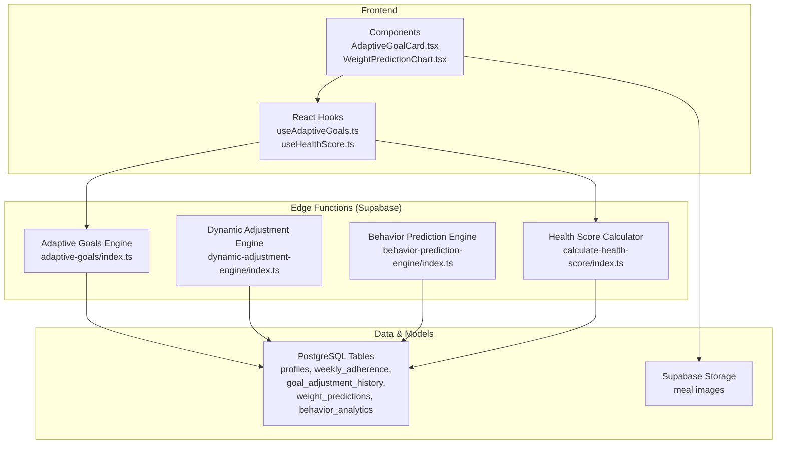
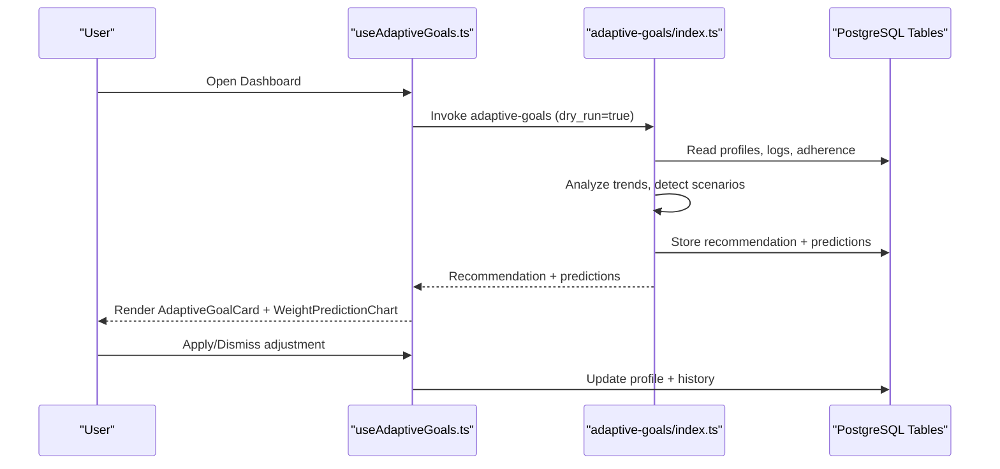
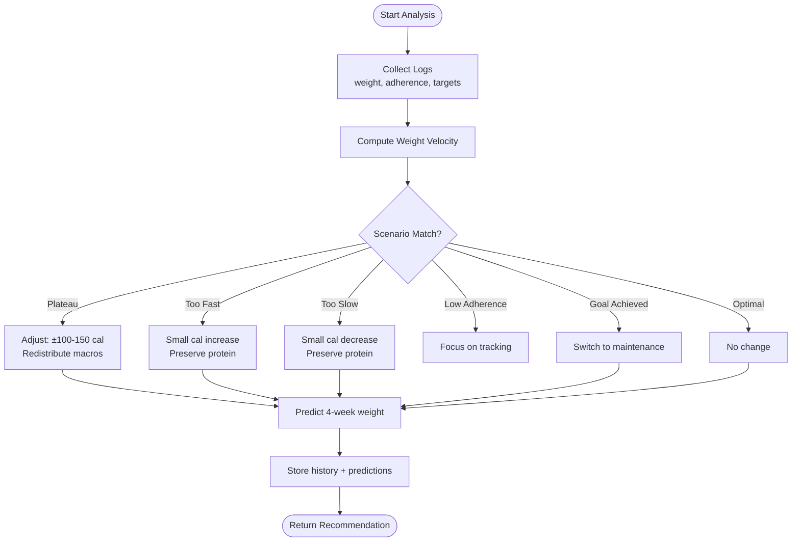
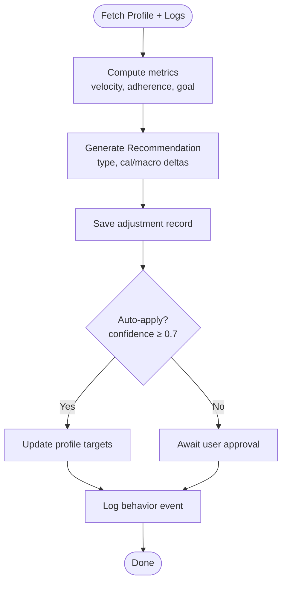
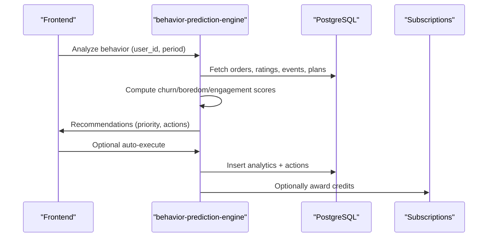
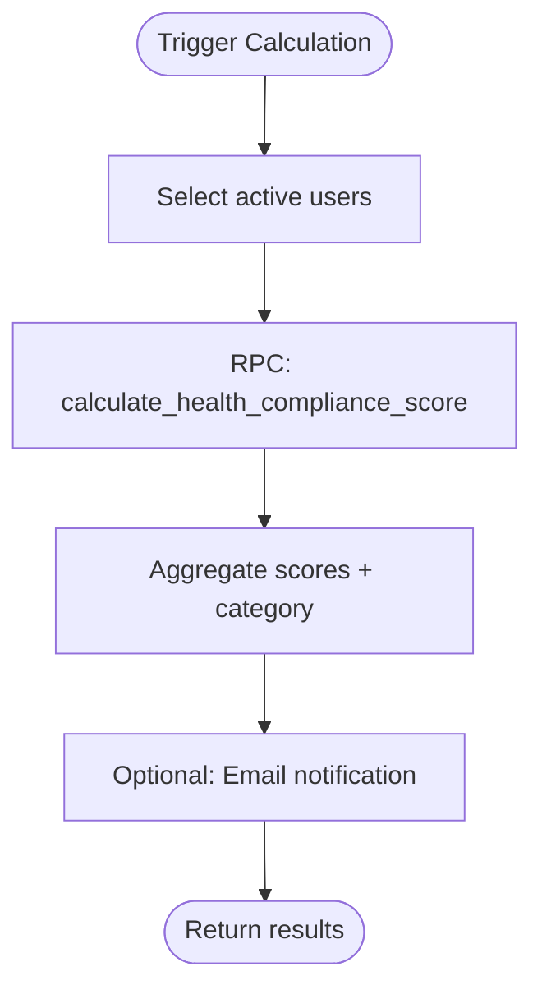
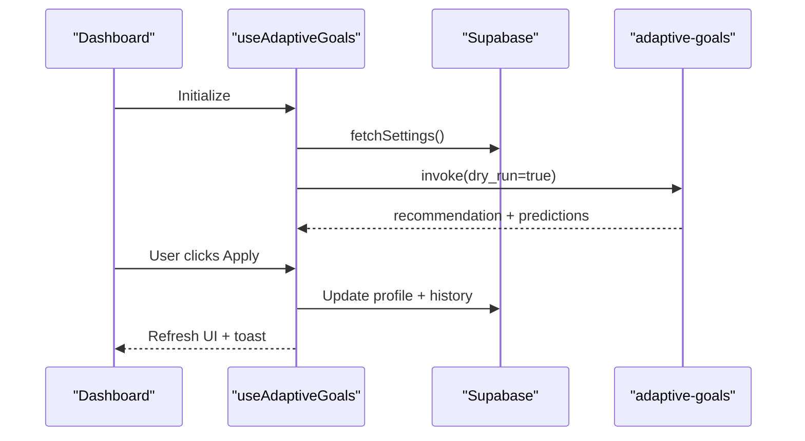
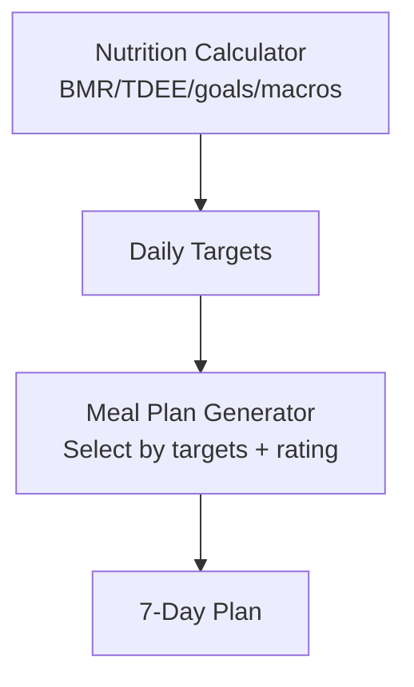
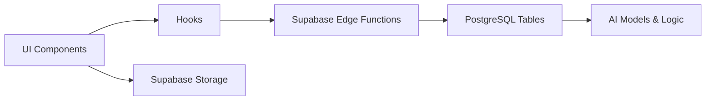

# AI & Machine Learning

<cite>
**Referenced Files in This Document**
- [ADAPTIVE_GOALS_IMPLEMENTATION_SUMMARY.md](file://ADAPTIVE_GOALS_IMPLEMENTATION_SUMMARY.md)
- [AI_IMPLEMENTATION_SUMMARY.md](file://AI_IMPLEMENTATION_SUMMARY.md)
- [index.ts](file://supabase/functions/adaptive-goals/index.ts)
- [index.ts](file://supabase/functions/dynamic-adjustment-engine/index.ts)
- [index.ts](file://supabase/functions/behavior-prediction-engine/index.ts)
- [index.ts](file://supabase/functions/calculate-health-score/index.ts)
- [useAdaptiveGoals.ts](file://src/hooks/useAdaptiveGoals.ts)
- [AdaptiveGoalCard.tsx](file://src/components/AdaptiveGoalCard.tsx)
- [WeightPredictionChart.tsx](file://src/components/WeightPredictionChart.tsx)
- [useHealthScore.ts](file://src/hooks/useHealthScore.ts)
- [nutrition-calculator.ts](file://src/lib/nutrition-calculator.ts)
- [meal-plan-generator.ts](file://src/lib/meal-plan-generator.ts)
</cite>

## Table of Contents
1. [Introduction](#introduction)
2. [Project Structure](#project-structure)
3. [Core Components](#core-components)
4. [Architecture Overview](#architecture-overview)
5. [Detailed Component Analysis](#detailed-component-analysis)
6. [Dependency Analysis](#dependency-analysis)
7. [Performance Considerations](#performance-considerations)
8. [Troubleshooting Guide](#troubleshooting-guide)
9. [Conclusion](#conclusion)
10. [Appendices](#appendices)

## Introduction
This document explains the AI and machine learning systems powering the Nutrio intelligent recommendation platform. It covers the adaptive goals engine, behavior prediction algorithms, dynamic adjustment mechanisms, nutrition recommendation system, meal analysis capabilities, and personalization algorithms. It also documents health score calculations, predictive analytics, frontend integration, data processing pipelines, real-time recommendation updates, model training considerations, performance optimization, and ethical safeguards.

## Project Structure
The AI/ML stack is organized into:
- Edge functions (Supabase) implementing AI engines and analytics
- Frontend hooks and components orchestrating user-facing AI features
- Utility libraries for nutrition calculations and meal plan generation
- Data models and analytics tables supporting AI decisions

**Diagram sources**
- [index.ts:1-522](file://supabase/functions/adaptive-goals/index.ts#L1-L522)
- [index.ts:1-455](file://supabase/functions/dynamic-adjustment-engine/index.ts#L1-L455)
- [index.ts:1-513](file://supabase/functions/behavior-prediction-engine/index.ts#L1-L513)
- [index.ts:1-229](file://supabase/functions/calculate-health-score/index.ts#L1-L229)
- [useAdaptiveGoals.ts:1-407](file://src/hooks/useAdaptiveGoals.ts#L1-L407)
- [useHealthScore.ts:1-246](file://src/hooks/useHealthScore.ts#L1-L246)
- [AdaptiveGoalCard.tsx:1-218](file://src/components/AdaptiveGoalCard.tsx#L1-L218)
- [WeightPredictionChart.tsx:1-291](file://src/components/WeightPredictionChart.tsx#L1-L291)

**Section sources**
- [ADAPTIVE_GOALS_IMPLEMENTATION_SUMMARY.md:1-309](file://ADAPTIVE_GOALS_IMPLEMENTATION_SUMMARY.md#L1-L309)
- [AI_IMPLEMENTATION_SUMMARY.md:1-190](file://AI_IMPLEMENTATION_SUMMARY.md#L1-L190)

## Core Components
- Adaptive Goals Engine: Analyzes user progress and generates personalized calorie and macro adjustments with confidence, plus 4-week weight predictions.
- Dynamic Adjustment Engine: Evidence-based adjustments for weight loss/gain progress, adherence, and plateau detection.
- Behavior Prediction Engine: Predictive churn and boredom risk scoring with retention recommendations.
- Health Score Calculator: Weekly health compliance score with category and breakdown.
- Frontend Hooks and Components: Orchestrate AI features, present recommendations, and manage user actions.
- Nutrition Utilities and Meal Plan Generator: Provide foundational nutrition math and AI-aligned meal plan generation.

**Section sources**
- [index.ts:52-227](file://supabase/functions/adaptive-goals/index.ts#L52-L227)
- [index.ts:85-240](file://supabase/functions/dynamic-adjustment-engine/index.ts#L85-L240)
- [index.ts:41-231](file://supabase/functions/behavior-prediction-engine/index.ts#L41-L231)
- [index.ts:32-218](file://supabase/functions/calculate-health-score/index.ts#L32-L218)
- [useAdaptiveGoals.ts:62-407](file://src/hooks/useAdaptiveGoals.ts#L62-L407)
- [AdaptiveGoalCard.tsx:28-218](file://src/components/AdaptiveGoalCard.tsx#L28-L218)
- [WeightPredictionChart.tsx:40-291](file://src/components/WeightPredictionChart.tsx#L40-L291)
- [nutrition-calculator.ts:1-103](file://src/lib/nutrition-calculator.ts#L1-L103)
- [meal-plan-generator.ts:64-164](file://src/lib/meal-plan-generator.ts#L64-L164)

## Architecture Overview
The system integrates frontend React hooks with Supabase Edge Functions and PostgreSQL. Data flows from user profiles, logs, and events into AI engines that compute recommendations and store outcomes. Frontend components render actionable insights and allow user approvals.

**Diagram sources**
- [useAdaptiveGoals.ts:137-178](file://src/hooks/useAdaptiveGoals.ts#L137-L178)
- [index.ts:316-521](file://supabase/functions/adaptive-goals/index.ts#L316-L521)
- [AdaptiveGoalCard.tsx:28-218](file://src/components/AdaptiveGoalCard.tsx#L28-L218)
- [WeightPredictionChart.tsx:40-291](file://src/components/WeightPredictionChart.tsx#L40-L291)

## Detailed Component Analysis

### Adaptive Goals Engine
Implements scenario-based adjustments using progress signals:
- Plateau detection (3+ weeks, near-zero weight change)
- Rapid weight loss or gain
- Low adherence
- Goal achievement
- Optimal progress

Key outputs: new calorie and macro targets, confidence, reasoning, and 4-week predictions with confidence bands.

**Diagram sources**
- [index.ts:52-227](file://supabase/functions/adaptive-goals/index.ts#L52-L227)
- [index.ts:229-262](file://supabase/functions/adaptive-goals/index.ts#L229-L262)

**Section sources**
- [index.ts:52-227](file://supabase/functions/adaptive-goals/index.ts#L52-L227)
- [index.ts:229-262](file://supabase/functions/adaptive-goals/index.ts#L229-L262)
- [ADAPTIVE_GOALS_IMPLEMENTATION_SUMMARY.md:35-64](file://ADAPTIVE_GOALS_IMPLEMENTATION_SUMMARY.md#L35-L64)

### Dynamic Adjustment Engine
Evidence-based adjustments across layers:
- Weight velocity thresholds
- Plateau detection with adherence checks
- Goal-specific logic (fat loss, muscle gain)
- Auto-apply with confidence threshold

**Diagram sources**
- [index.ts:85-240](file://supabase/functions/dynamic-adjustment-engine/index.ts#L85-L240)
- [index.ts:242-273](file://supabase/functions/dynamic-adjustment-engine/index.ts#L242-L273)
- [index.ts:275-454](file://supabase/functions/dynamic-adjustment-engine/index.ts#L275-L454)

**Section sources**
- [index.ts:85-240](file://supabase/functions/dynamic-adjustment-engine/index.ts#L85-L240)
- [index.ts:242-273](file://supabase/functions/dynamic-adjustment-engine/index.ts#L242-L273)
- [index.ts:275-454](file://supabase/functions/dynamic-adjustment-engine/index.ts#L275-L454)

### Behavior Prediction Engine
Predictive analytics for retention:
- Churn risk: ordering frequency, skip rate, restaurant diversity, app opens
- Boredom risk: rating average, cuisine diversity, plan adherence
- Engagement score: composite metric
- Recommendations: personal outreach, bonus credits, cuisine exploration, gamification

**Diagram sources**
- [index.ts:306-512](file://supabase/functions/behavior-prediction-engine/index.ts#L306-L512)
- [index.ts:233-304](file://supabase/functions/behavior-prediction-engine/index.ts#L233-L304)

**Section sources**
- [index.ts:41-231](file://supabase/functions/behavior-prediction-engine/index.ts#L41-L231)
- [index.ts:306-512](file://supabase/functions/behavior-prediction-engine/index.ts#L306-L512)

### Health Score Calculator
Computes weekly health compliance score with category and breakdown:
- Macro adherence
- Meal consistency
- Weight logging
- Protein accuracy

**Diagram sources**
- [index.ts:32-218](file://supabase/functions/calculate-health-score/index.ts#L32-L218)

**Section sources**
- [index.ts:32-218](file://supabase/functions/calculate-health-score/index.ts#L32-L218)
- [useHealthScore.ts:35-149](file://src/hooks/useHealthScore.ts#L35-L149)

### Frontend Integration: Adaptive Goals
React hook orchestrates:
- Fetch settings, recommendations, history
- Apply or dismiss adjustments
- Update settings
- Dry-run analysis and manual triggers

**Diagram sources**
- [useAdaptiveGoals.ts:62-407](file://src/hooks/useAdaptiveGoals.ts#L62-L407)
- [AdaptiveGoalCard.tsx:28-218](file://src/components/AdaptiveGoalCard.tsx#L28-L218)

**Section sources**
- [useAdaptiveGoals.ts:62-407](file://src/hooks/useAdaptiveGoals.ts#L62-L407)
- [AdaptiveGoalCard.tsx:28-218](file://src/components/AdaptiveGoalCard.tsx#L28-L218)
- [WeightPredictionChart.tsx:40-291](file://src/components/WeightPredictionChart.tsx#L40-L291)

### Nutrition Recommendation System and Meal Planning
- Nutrition calculator: BMR/TDEE, goal-based calories, macro distribution
- Meal plan generator: AI-aligned selection by calorie/protein targets, rating, and variety

**Diagram sources**
- [nutrition-calculator.ts:5-88](file://src/lib/nutrition-calculator.ts#L5-L88)
- [meal-plan-generator.ts:64-164](file://src/lib/meal-plan-generator.ts#L64-L164)

**Section sources**
- [nutrition-calculator.ts:1-103](file://src/lib/nutrition-calculator.ts#L1-L103)
- [meal-plan-generator.ts:64-164](file://src/lib/meal-plan-generator.ts#L64-L164)

## Dependency Analysis
- Edge functions depend on Supabase client and PostgreSQL tables for data access and persistence.
- Frontend hooks depend on Supabase Edge Functions and local state for rendering recommendations.
- Utilities depend on Supabase Storage for image handling and PDF generation.

**Diagram sources**
- [useAdaptiveGoals.ts:1-5](file://src/hooks/useAdaptiveGoals.ts#L1-L5)
- [index.ts:1-11](file://supabase/functions/adaptive-goals/index.ts#L1-L11)
- [meal-plan-generator.ts:1-3](file://src/lib/meal-plan-generator.ts#L1-L3)

**Section sources**
- [useAdaptiveGoals.ts:1-5](file://src/hooks/useAdaptiveGoals.ts#L1-L5)
- [index.ts:1-11](file://supabase/functions/adaptive-goals/index.ts#L1-L11)
- [meal-plan-generator.ts:1-3](file://src/lib/meal-plan-generator.ts#L1-L3)

## Performance Considerations
- Edge function cold starts: minimize initialization cost; reuse Supabase client.
- Data windowing: restrict queries to recent logs (e.g., 12 weeks for weight, 4 weeks for calories).
- Asynchronous processing: batch analysis via scheduled jobs for many users.
- Caching: memoize frontend queries and avoid redundant invocations.
- Image loading: parallelize and timeout image downloads for meal plan PDFs.
- Confidence thresholds: reduce unnecessary auto-applications to prevent churn.

[No sources needed since this section provides general guidance]

## Troubleshooting Guide
Common issues and resolutions:
- Adaptive goals function not deployed: frontend gracefully handles CORS failures and disables the feature until deployment.
- No recommendations: ensure user has logged weight for sufficient periods and settings are enabled.
- Health score calculation errors: verify active subscriptions and RPC availability.
- Behavior prediction timeouts: adjust analysis period and ensure required event data exists.

**Section sources**
- [useAdaptiveGoals.ts:140-178](file://src/hooks/useAdaptiveGoals.ts#L140-L178)
- [index.ts:32-218](file://supabase/functions/calculate-health-score/index.ts#L32-L218)
- [index.ts:306-512](file://supabase/functions/behavior-prediction-engine/index.ts#L306-L512)

## Conclusion
The Nutrio AI/ML stack combines lightweight, evidence-based algorithms with robust frontend integration and PostgreSQL-backed persistence. It delivers personalized nutrition adjustments, predictive retention actions, and transparent health insights, enabling sustainable user progress and engagement.

[No sources needed since this section summarizes without analyzing specific files]

## Appendices

### Model Training and Continuous Learning
- Current models are rule-based and scenario-driven; no neural networks are implemented.
- Future considerations: collect anonymized feedback on recommendation effectiveness to refine thresholds and weights.
- A/B testing hooks are available for evaluating adjustment strategies and retention actions.

**Section sources**
- [AI_IMPLEMENTATION_SUMMARY.md:24-106](file://AI_IMPLEMENTATION_SUMMARY.md#L24-L106)

### Ethical Considerations
- User consent: all adjustments require explicit approval before applying.
- Safety caps: calorie targets remain within safe bounds.
- Transparency: recommendations include reasoning and suggested actions.
- Bias mitigation: diverse meal selection and varied restaurant exposure in plans.

**Section sources**
- [index.ts:88-110](file://supabase/functions/adaptive-goals/index.ts#L88-L110)
- [index.ts:154-229](file://supabase/functions/behavior-prediction-engine/index.ts#L154-L229)