# AI Integration Patterns & Best Practices

<cite>
**Referenced Files in This Document**
- [useAdaptiveGoals.ts](file://src/hooks/useAdaptiveGoals.ts)
- [useSmartRecommendations.ts](file://src/hooks/useSmartRecommendations.ts)
- [AIMealExplanation.tsx](file://src/components/AIMealExplanation.tsx)
- [AdminAIEngineMonitor.tsx](file://src/pages/admin/AdminAIEngineMonitor.tsx)
- [ai-report-generator.ts](file://src/lib/ai-report-generator.ts)
- [meal-plan-generator.ts](file://src/lib/meal-plan-generator.ts)
- [cache.ts](file://src/lib/cache.ts)
- [analyze-meal-image/index.ts](file://supabase/functions/analyze-meal-image/index.ts)
- [ai-accuracy.test.ts](file://tests/ai-accuracy.test.ts)
- [nutrition-calculator.ts](file://src/lib/nutrition-calculator.ts)
- [meal-images.ts](file://src/lib/meal-images.ts)
- [PHASE2_EDGE_FUNCTIONS.md](file://supabase/functions/PHASE2_EDGE_FUNCTIONS.md)
- [realtime.spec.ts](file://e2e/system/realtime.spec.ts)
- [ai.spec.ts](file://e2e/admin/ai.spec.ts)
</cite>

## Table of Contents
1. [Introduction](#introduction)
2. [Project Structure](#project-structure)
3. [Core Components](#core-components)
4. [Architecture Overview](#architecture-overview)
5. [Detailed Component Analysis](#detailed-component-analysis)
6. [Dependency Analysis](#dependency-analysis)
7. [Performance Considerations](#performance-considerations)
8. [Troubleshooting Guide](#troubleshooting-guide)
9. [Conclusion](#conclusion)
10. [Appendices](#appendices)

## Introduction
This document consolidates AI integration patterns and best practices across the Nutrio platform. It focuses on frontend hook patterns for AI-powered features, data caching strategies, real-time update mechanisms, error handling and graceful degradation, performance optimization, API rate limiting, cost management, testing strategies, validation methods for recommendations, and monitoring approaches for model drift detection.

## Project Structure
The AI capabilities span three primary layers:
- Frontend hooks and components that orchestrate AI-driven recommendations and explanations
- Edge functions that encapsulate AI inference and ML logic
- Supporting libraries for caching, image handling, nutrition calculations, and report generation

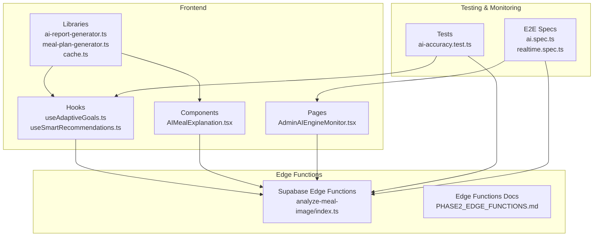

**Diagram sources**
- [useAdaptiveGoals.ts:1-407](file://src/hooks/useAdaptiveGoals.ts#L1-407)
- [useSmartRecommendations.ts:1-297](file://src/hooks/useSmartRecommendations.ts#L1-297)
- [AIMealExplanation.tsx:1-174](file://src/components/AIMealExplanation.tsx#L1-174)
- [AdminAIEngineMonitor.tsx:1-436](file://src/pages/admin/AdminAIEngineMonitor.tsx#L1-436)
- [ai-report-generator.ts:1-709](file://src/lib/ai-report-generator.ts#L1-709)
- [meal-plan-generator.ts:1-439](file://src/lib/meal-plan-generator.ts#L1-439)
- [cache.ts:1-51](file://src/lib/cache.ts#L1-51)
- [analyze-meal-image/index.ts:257-297](file://supabase/functions/analyze-meal-image/index.ts#L257-297)
- [PHASE2_EDGE_FUNCTIONS.md:1-411](file://supabase/functions/PHASE2_EDGE_FUNCTIONS.md#L1-411)
- [ai-accuracy.test.ts:1-383](file://tests/ai-accuracy.test.ts#L1-383)
- [ai.spec.ts:1-37](file://e2e/admin/ai.spec.ts#L1-37)
- [realtime.spec.ts:1-37](file://e2e/system/realtime.spec.ts#L1-37)

**Section sources**
- [useAdaptiveGoals.ts:1-407](file://src/hooks/useAdaptiveGoals.ts#L1-407)
- [useSmartRecommendations.ts:1-297](file://src/hooks/useSmartRecommendations.ts#L1-297)
- [AIMealExplanation.tsx:1-174](file://src/components/AIMealExplanation.tsx#L1-174)
- [AdminAIEngineMonitor.tsx:1-436](file://src/pages/admin/AdminAIEngineMonitor.tsx#L1-436)
- [ai-report-generator.ts:1-709](file://src/lib/ai-report-generator.ts#L1-709)
- [meal-plan-generator.ts:1-439](file://src/lib/meal-plan-generator.ts#L1-439)
- [cache.ts:1-51](file://src/lib/cache.ts#L1-51)
- [analyze-meal-image/index.ts:257-297](file://supabase/functions/analyze-meal-image/index.ts#L257-297)
- [PHASE2_EDGE_FUNCTIONS.md:1-411](file://supabase/functions/PHASE2_EDGE_FUNCTIONS.md#L1-411)
- [ai-accuracy.test.ts:1-383](file://tests/ai-accuracy.test.ts#L1-383)
- [ai.spec.ts:1-37](file://e2e/admin/ai.spec.ts#L1-37)
- [realtime.spec.ts:1-37](file://e2e/system/realtime.spec.ts#L1-37)

## Core Components
- Adaptive Goals Hook: orchestrates AI-driven nutrition goal adjustments via Supabase Edge Functions, with graceful degradation when functions are unavailable.
- Smart Recommendations Hook: generates personalized recommendations from local data aggregation and i18n-aware rendering.
- AI Meal Explanation Component: provides tooltip-based AI reasoning for meal recommendations.
- AI Engine Monitor Page: admin dashboard for monitoring AI layer performance and recommendation accuracy.
- AI Report Generator: multi-model chat completion pipeline with fallbacks and robust parsing.
- Meal Plan Generator: macro-aligned meal selection and image loading with performance constraints.
- Cache Manager: hybrid Redis/in-memory caching abstraction for frequent queries.
- Edge Functions: AI inference and vision processing with rate limiting and monitoring.

**Section sources**
- [useAdaptiveGoals.ts:62-407](file://src/hooks/useAdaptiveGoals.ts#L62-407)
- [useSmartRecommendations.ts:18-297](file://src/hooks/useSmartRecommendations.ts#L18-297)
- [AIMealExplanation.tsx:24-174](file://src/components/AIMealExplanation.tsx#L24-174)
- [AdminAIEngineMonitor.tsx:53-436](file://src/pages/admin/AdminAIEngineMonitor.tsx#L53-436)
- [ai-report-generator.ts:25-709](file://src/lib/ai-report-generator.ts#L25-709)
- [meal-plan-generator.ts:64-439](file://src/lib/meal-plan-generator.ts#L64-439)
- [cache.ts:16-51](file://src/lib/cache.ts#L16-51)
- [analyze-meal-image/index.ts:257-297](file://supabase/functions/analyze-meal-image/index.ts#L257-297)

## Architecture Overview
The AI architecture follows a layered approach:
- Frontend hooks call Supabase Edge Functions for AI inference and ML decisions.
- Edge Functions integrate with external AI APIs and return structured results.
- Frontend components render explanations and recommendations with graceful fallbacks.
- Admin pages monitor engine health and recommendation metrics.
- Libraries provide caching, report generation, and image handling.

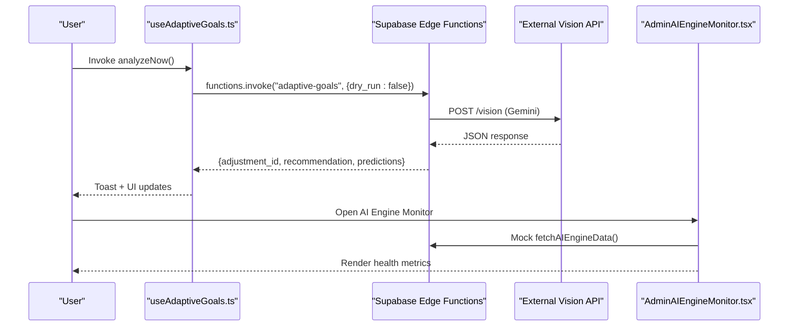

**Diagram sources**
- [useAdaptiveGoals.ts:327-377](file://src/hooks/useAdaptiveGoals.ts#L327-377)
- [AdminAIEngineMonitor.tsx:67-134](file://src/pages/admin/AdminAIEngineMonitor.tsx#L67-134)
- [analyze-meal-image/index.ts:257-297](file://supabase/functions/analyze-meal-image/index.ts#L257-297)

**Section sources**
- [useAdaptiveGoals.ts:327-377](file://src/hooks/useAdaptiveGoals.ts#L327-377)
- [AdminAIEngineMonitor.tsx:67-134](file://src/pages/admin/AdminAIEngineMonitor.tsx#L67-134)
- [PHASE2_EDGE_FUNCTIONS.md:224-254](file://supabase/functions/PHASE2_EDGE_FUNCTIONS.md#L224-254)

## Detailed Component Analysis

### Adaptive Goals Hook Pattern
The hook encapsulates AI-driven goal adjustments with:
- Edge function invocation with dry-run and full-run modes
- Graceful degradation when functions are unavailable (CORS/net::ERR detection)
- Local state management for recommendations, predictions, settings, and history
- Idempotent creation of default settings and optimistic UI updates

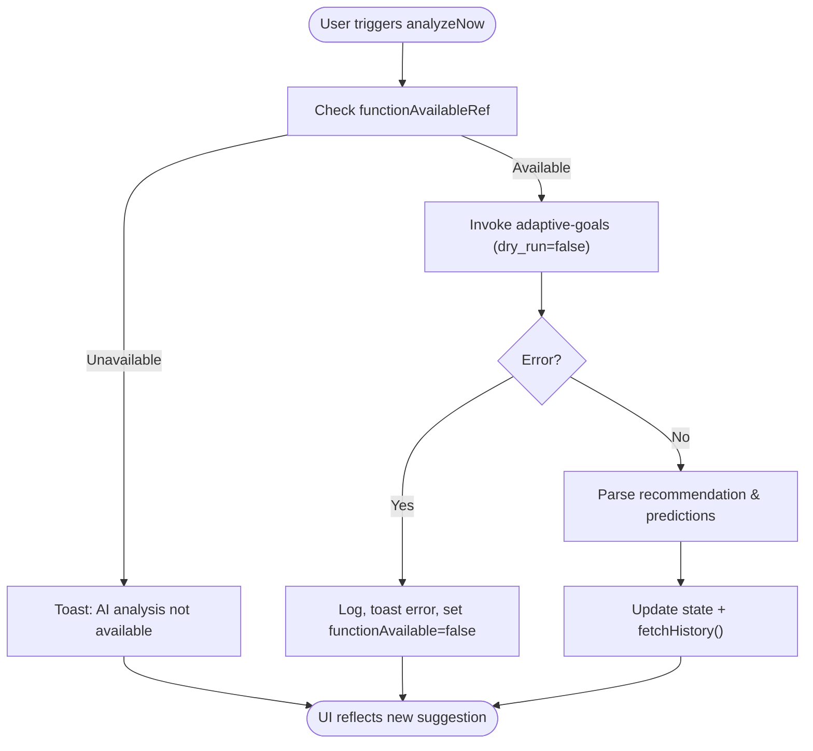

**Diagram sources**
- [useAdaptiveGoals.ts:327-377](file://src/hooks/useAdaptiveGoals.ts#L327-377)
- [useAdaptiveGoals.ts:149-178](file://src/hooks/useAdaptiveGoals.ts#L149-178)

**Section sources**
- [useAdaptiveGoals.ts:62-407](file://src/hooks/useAdaptiveGoals.ts#L62-407)

### Smart Recommendations Hook Pattern
Generates personalized recommendations from local data aggregation:
- Concurrent data fetching for logs, water, goals, and streaks
- Rule-based recommendation generation with priority ordering
- i18n-aware rendering and fallback recommendations
- Sorting by priority and slicing top results

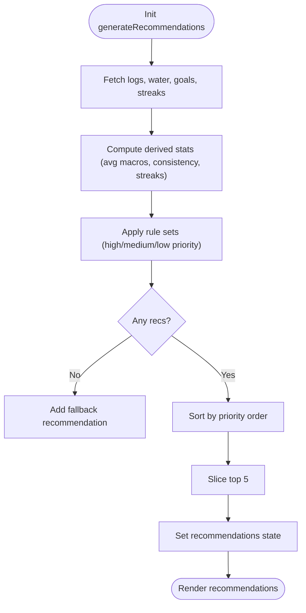

**Diagram sources**
- [useSmartRecommendations.ts:23-285](file://src/hooks/useSmartRecommendations.ts#L23-285)

**Section sources**
- [useSmartRecommendations.ts:18-297](file://src/hooks/useSmartRecommendations.ts#L18-297)

### AI Meal Explanation Component
Provides tooltip-based explanations for AI recommendations:
- Renders overall match score and factor breakdown
- Uses predefined factor explanations for common scenarios
- Includes transparency note about recommendation basis

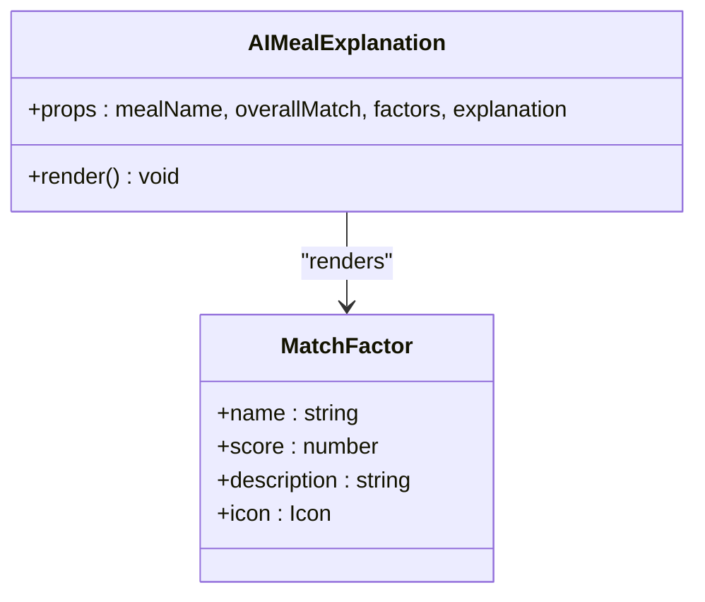

**Diagram sources**
- [AIMealExplanation.tsx:8-30](file://src/components/AIMealExplanation.tsx#L8-30)
- [AIMealExplanation.tsx:136-157](file://src/components/AIMealExplanation.tsx#L136-157)

**Section sources**
- [AIMealExplanation.tsx:24-174](file://src/components/AIMealExplanation.tsx#L24-174)

### AI Engine Monitor Page
Admin dashboard for monitoring AI layer performance:
- Auto-refreshes metrics every 30 seconds
- Displays engine status, response times, success rates, and recommendation metrics
- Provides quick stats and charts for accuracy and request volumes

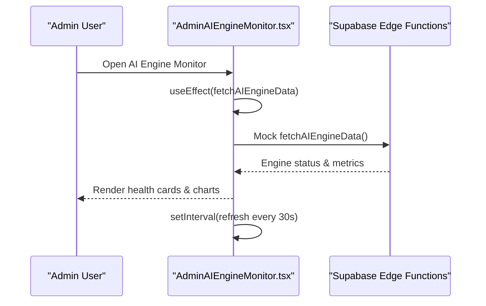

**Diagram sources**
- [AdminAIEngineMonitor.tsx:162-167](file://src/pages/admin/AdminAIEngineMonitor.tsx#L162-167)
- [AdminAIEngineMonitor.tsx:67-134](file://src/pages/admin/AdminAIEngineMonitor.tsx#L67-134)

**Section sources**
- [AdminAIEngineMonitor.tsx:53-436](file://src/pages/admin/AdminAIEngineMonitor.tsx#L53-436)

### AI Report Generator
Multi-model chat completion pipeline with fallbacks:
- Iterates through free models in order of preference
- Robust error handling and fallback content generation
- JSON parsing with sanitization and fallback arrays
- Non-medical tone and lifestyle-focused commentary

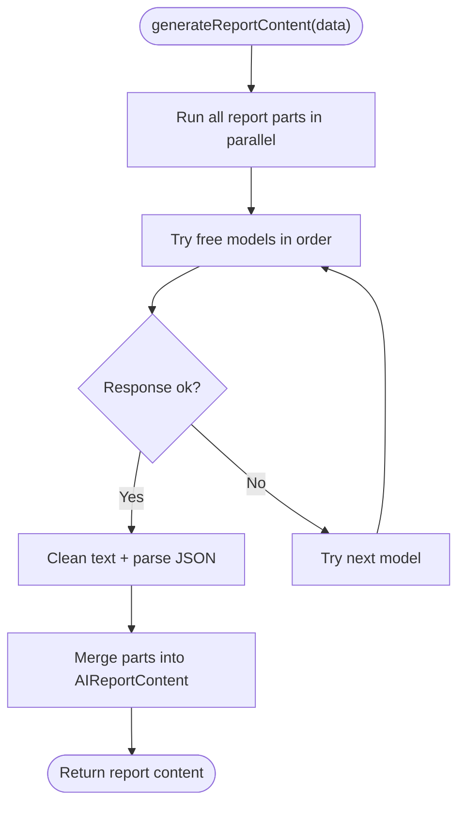

**Diagram sources**
- [ai-report-generator.ts:95-126](file://src/lib/ai-report-generator.ts#L95-126)
- [ai-report-generator.ts:32-78](file://src/lib/ai-report-generator.ts#L32-78)

**Section sources**
- [ai-report-generator.ts:25-709](file://src/lib/ai-report-generator.ts#L25-709)

### Meal Plan Generator
Macro-aligned meal selection and image loading:
- Categorizes meals by type and selects optimal candidates
- Scores meals by rating, macro alignment, and image presence
- Loads images with multiple strategies and timeouts
- Calculates plan statistics and deduplicates images

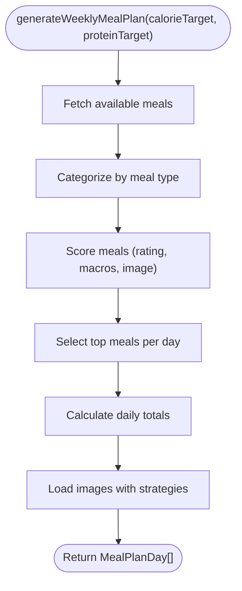

**Diagram sources**
- [meal-plan-generator.ts:64-164](file://src/lib/meal-plan-generator.ts#L64-164)
- [meal-plan-generator.ts:170-205](file://src/lib/meal-plan-generator.ts#L170-205)
- [meal-plan-generator.ts:307-407](file://src/lib/meal-plan-generator.ts#L307-407)

**Section sources**
- [meal-plan-generator.ts:64-439](file://src/lib/meal-plan-generator.ts#L64-439)

### Cache Manager
Hybrid caching abstraction:
- Attempts Redis first, falls back to in-memory cache
- TTL-based eviction and expiry checks
- Graceful degradation when Redis is unavailable

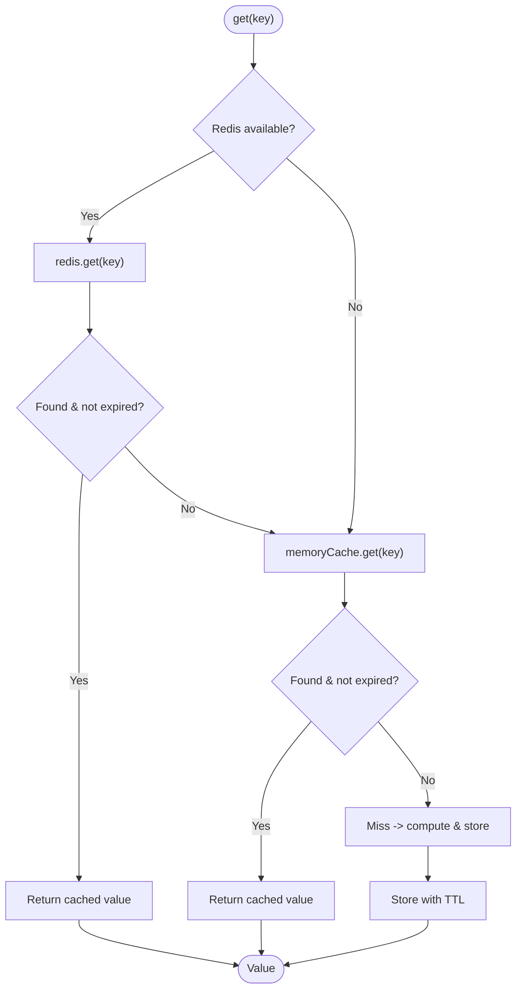

**Diagram sources**
- [cache.ts:37-51](file://src/lib/cache.ts#L37-51)
- [cache.ts:24-35](file://src/lib/cache.ts#L24-35)

**Section sources**
- [cache.ts:16-51](file://src/lib/cache.ts#L16-51)

### Edge Functions: Vision AI Integration
Edge function integrates external vision API:
- Calls Gemini Vision with system/user prompts and image data
- Parses structured JSON from model output
- Implements fallback responses on errors
- Returns normalized results to frontend

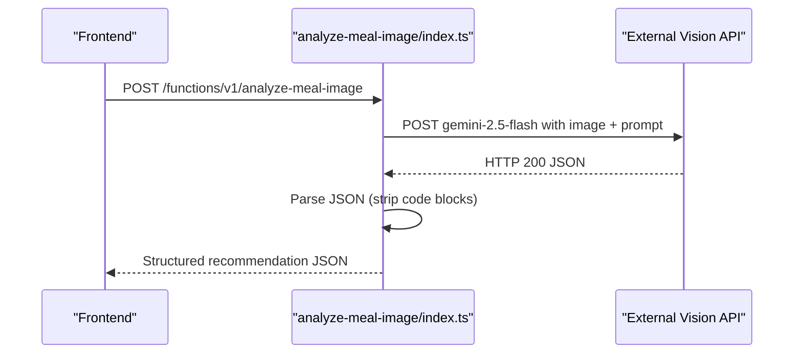

**Diagram sources**
- [analyze-meal-image/index.ts:257-297](file://supabase/functions/analyze-meal-image/index.ts#L257-297)

**Section sources**
- [analyze-meal-image/index.ts:257-297](file://supabase/functions/analyze-meal-image/index.ts#L257-297)

## Dependency Analysis
Key dependencies and relationships:
- Frontend hooks depend on Supabase client and Edge Functions
- Edge Functions depend on external AI APIs and environment variables
- Libraries provide shared utilities for caching, images, and calculations
- Admin pages depend on mock data and Supabase for metrics
- Tests validate accuracy and performance of AI layers

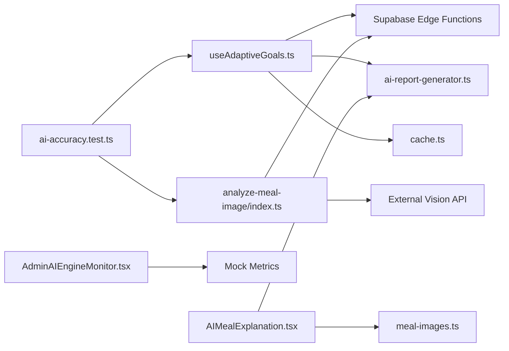

**Diagram sources**
- [useAdaptiveGoals.ts:149-178](file://src/hooks/useAdaptiveGoals.ts#L149-178)
- [AIMealExplanation.tsx:159-173](file://src/components/AIMealExplanation.tsx#L159-173)
- [AdminAIEngineMonitor.tsx:67-134](file://src/pages/admin/AdminAIEngineMonitor.tsx#L67-134)
- [ai-report-generator.ts:25-709](file://src/lib/ai-report-generator.ts#L25-709)
- [meal-images.ts:156-168](file://src/lib/meal-images.ts#L156-168)
- [analyze-meal-image/index.ts:257-297](file://supabase/functions/analyze-meal-image/index.ts#L257-297)
- [ai-accuracy.test.ts:97-333](file://tests/ai-accuracy.test.ts#L97-333)

**Section sources**
- [useAdaptiveGoals.ts:149-178](file://src/hooks/useAdaptiveGoals.ts#L149-178)
- [AIMealExplanation.tsx:159-173](file://src/components/AIMealExplanation.tsx#L159-173)
- [AdminAIEngineMonitor.tsx:67-134](file://src/pages/admin/AdminAIEngineMonitor.tsx#L67-134)
- [ai-report-generator.ts:25-709](file://src/lib/ai-report-generator.ts#L25-709)
- [meal-images.ts:156-168](file://src/lib/meal-images.ts#L156-168)
- [analyze-meal-image/index.ts:257-297](file://supabase/functions/analyze-meal-image/index.ts#L257-297)
- [ai-accuracy.test.ts:97-333](file://tests/ai-accuracy.test.ts#L97-333)

## Performance Considerations
- Concurrency and batching: Smart recommendations use Promise.all for concurrent data fetching; AI report generator runs multiple parts in parallel.
- Caching: Hybrid Redis/in-memory cache reduces repeated computations and API calls.
- Image loading: Meal plan generator loads images in parallel with timeouts to prevent UI blocking.
- Edge function invocation: Dry-run mode avoids heavy computation until user confirms.
- Rate limiting: Database-based rate limiting prevents abuse and controls costs.
- Monitoring: Admin dashboard auto-refreshes metrics and displays health indicators.

[No sources needed since this section provides general guidance]

## Troubleshooting Guide
Common issues and resolutions:
- Edge function not deployed: Hook detects CORS/net::ERR and disables AI features with user-friendly warnings.
- Vision API errors: Edge function returns structured fallback responses; client handles gracefully.
- Missing API keys: AI report generator warns and falls back to curated content.
- Performance regressions: Use AdminAIEngineMonitor to track response times and success rates.
- E2E coverage: Admin AI specs and system realtime specs provide baseline verification.

**Section sources**
- [useAdaptiveGoals.ts:153-161](file://src/hooks/useAdaptiveGoals.ts#L153-161)
- [useAdaptiveGoals.ts:344-352](file://src/hooks/useAdaptiveGoals.ts#L344-352)
- [analyze-meal-image/index.ts:277-289](file://supabase/functions/analyze-meal-image/index.ts#L277-289)
- [ai-report-generator.ts:33-37](file://src/lib/ai-report-generator.ts#L33-37)
- [ai.spec.ts:8-21](file://e2e/admin/ai.spec.ts#L8-21)
- [realtime.spec.ts:8-21](file://e2e/system/realtime.spec.ts#L8-21)

## Conclusion
The Nutrio platform implements robust AI integration patterns with:
- Clear separation of concerns between frontend hooks, edge functions, and supporting libraries
- Graceful degradation and fallback mechanisms for reliability
- Comprehensive testing and monitoring for accuracy and performance
- Practical cost management through rate limiting and model selection
These patterns provide a scalable foundation for evolving AI capabilities while maintaining user trust and system stability.

[No sources needed since this section summarizes without analyzing specific files]

## Appendices

### Testing Strategies for AI Features
- Unit tests validate nutrition calculations, macro compliance, and accuracy thresholds
- E2E tests cover admin monitoring and system realtime behavior
- CI/CD workflows automate testing and deployment of edge functions

**Section sources**
- [ai-accuracy.test.ts:97-333](file://tests/ai-accuracy.test.ts#L97-333)
- [ai.spec.ts:8-21](file://e2e/admin/ai.spec.ts#L8-21)
- [realtime.spec.ts:8-21](file://e2e/system/realtime.spec.ts#L8-21)

### Validation Methods for Recommendations
- Macro compliance thresholds and weighted averages
- Accuracy benchmarks for recommendation layers
- Human-in-the-loop validation via admin monitor

**Section sources**
- [ai-accuracy.test.ts:186-221](file://tests/ai-accuracy.test.ts#L186-221)
- [AdminAIEngineMonitor.tsx:405-420](file://src/pages/admin/AdminAIEngineMonitor.tsx#L405-420)

### Monitoring Approaches for Model Drift Detection
- Admin dashboard tracks accuracy scores and request volumes
- Auto-refresh intervals ensure timely visibility of changes
- Error logging and fallback responses aid in detecting degraded performance

**Section sources**
- [AdminAIEngineMonitor.tsx:162-167](file://src/pages/admin/AdminAIEngineMonitor.tsx#L162-167)
- [AdminAIEngineMonitor.tsx:121-127](file://src/pages/admin/AdminAIEngineMonitor.tsx#L121-127)