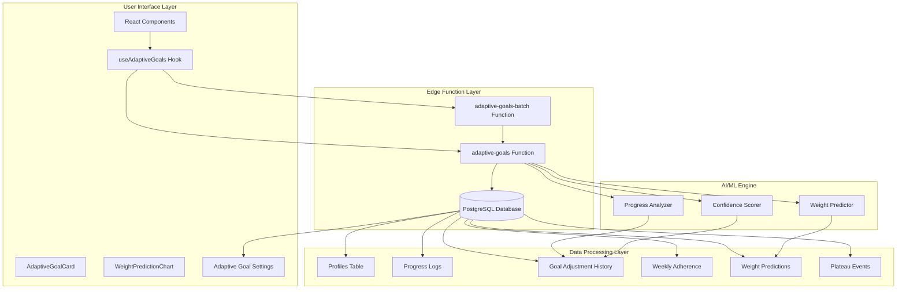
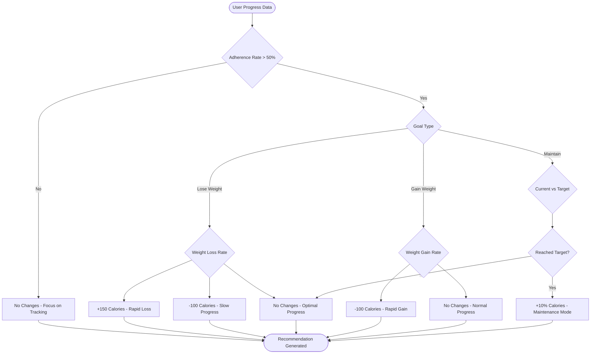
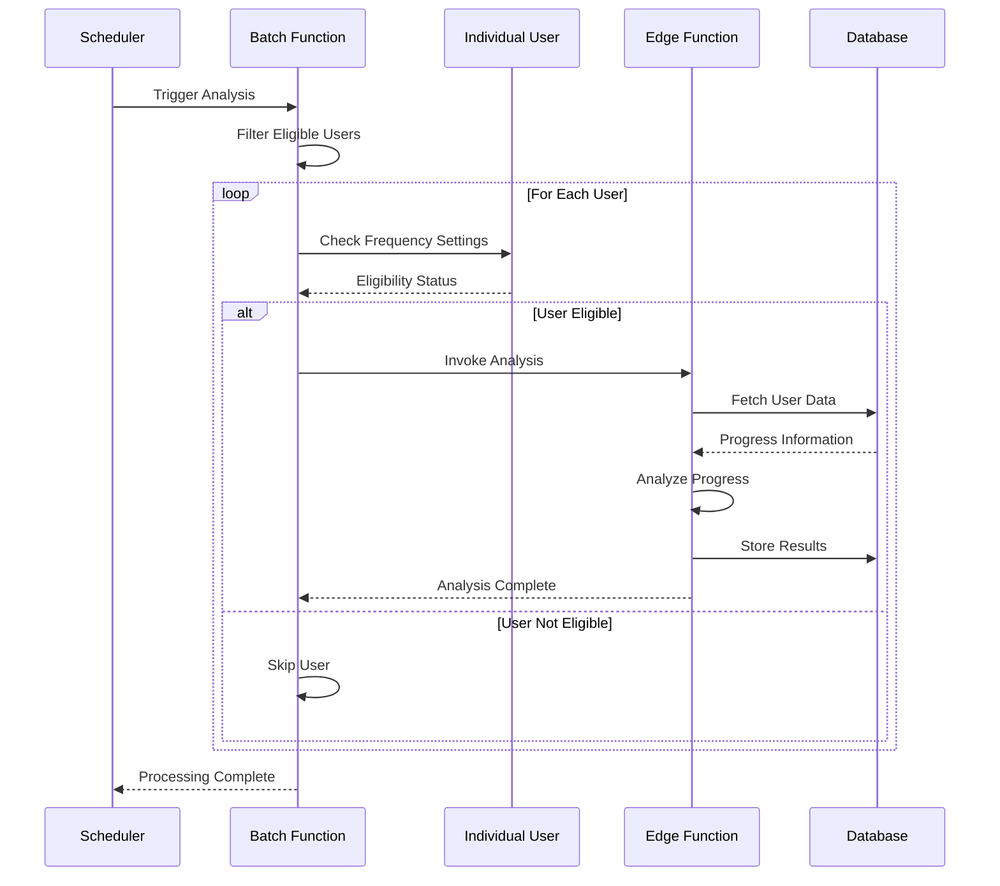
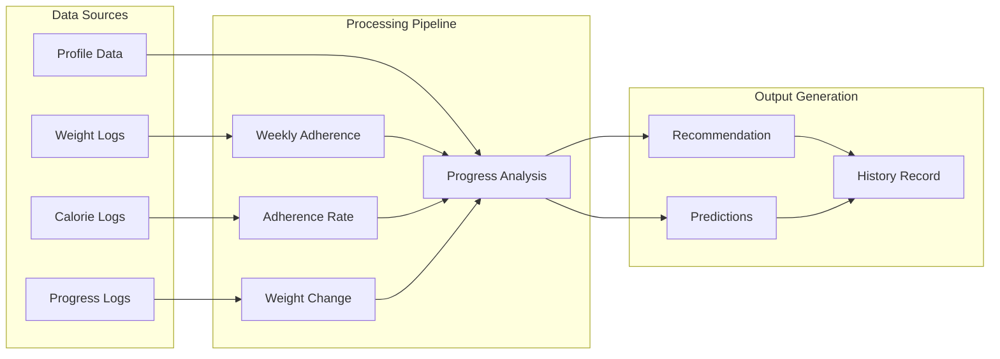
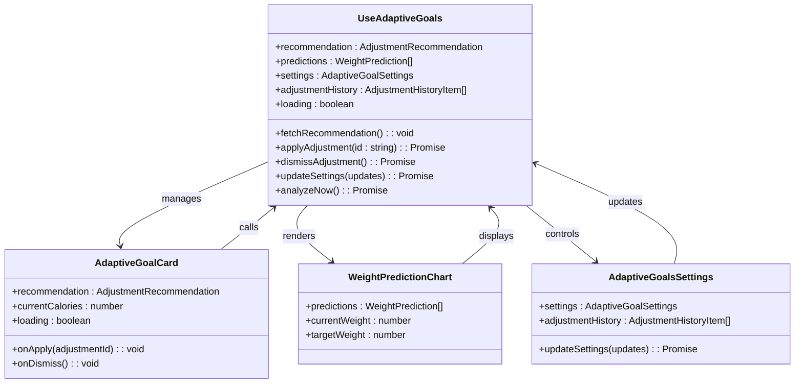

# Adaptive Goals Engine

<cite>
**Referenced Files in This Document**
- [index.ts](file://supabase/functions/adaptive-goals/index.ts)
- [index.ts](file://supabase/functions/adaptive-goals-batch/index.ts)
- [useAdaptiveGoals.ts](file://src/hooks/useAdaptiveGoals.ts)
- [AdaptiveGoalCard.tsx](file://src/components/AdaptiveGoalCard.tsx)
- [WeightPredictionChart.tsx](file://src/components/WeightPredictionChart.tsx)
- [AdaptiveGoalsSettings.tsx](file://src/components/AdaptiveGoalsSettings.tsx)
- [20260221000000_adaptive_goals_system.sql](file://supabase/migrations/20260221000000_adaptive_goals_system.sql)
- [ADAPTIVE_GOALS_IMPLEMENTATION_SUMMARY.md](file://ADAPTIVE_GOALS_IMPLEMENTATION_SUMMARY.md)
</cite>

## Table of Contents
1. [Introduction](#introduction)
2. [System Architecture](#system-architecture)
3. [Core Components](#core-components)
4. [Algorithm Implementation](#algorithm-implementation)
5. [Real-time Adaptation Mechanisms](#real-time-adaptation-mechanisms)
6. [Data Flow and Processing](#data-flow-and-processing)
7. [Frontend Integration](#frontend-integration)
8. [Performance Optimization](#performance-optimization)
9. [Caching Strategies](#caching-strategies)
10. [Error Handling](#error-handling)
11. [Safety and Compliance](#safety-and-compliance)
12. [Deployment and Operations](#deployment-and-operations)
13. [Conclusion](#conclusion)

## Introduction

The Adaptive Goals Engine is a sophisticated AI-powered system designed to personalize nutrition recommendations by automatically adjusting users' daily caloric and macronutrient targets based on their real-time progress. This system represents a significant advancement in personalized health coaching, moving beyond static goal-setting to provide dynamic, data-driven adjustments that respond to individual progress patterns.

The engine operates on a multi-layered approach combining machine learning algorithms with behavioral science principles to optimize user outcomes while maintaining safety and user autonomy. It processes comprehensive user data including weight progression, activity levels, health metrics, and dietary preferences to generate personalized nutrition goals that evolve with the user's journey.

## System Architecture

The Adaptive Goals Engine follows a distributed architecture with clear separation of concerns across three primary layers: data processing, AI decision-making, and user interface. The system leverages Supabase Edge Functions for serverless computation, PostgreSQL for persistent storage, and React-based frontend components for user interaction.

**Diagram sources**
- [index.ts:316-521](file://supabase/functions/adaptive-goals/index.ts#L316-L521)
- [index.ts:9-135](file://supabase/functions/adaptive-goals-batch/index.ts#L9-L135)
- [20260221000000_adaptive_goals_system.sql:1-336](file://supabase/migrations/20260221000000_adaptive_goals_system.sql#L1-L336)

## Core Components

### Edge Functions Infrastructure

The system utilizes two primary edge functions that work in tandem to provide both on-demand analysis and automated batch processing capabilities.

**Adaptive Goals Function (`adaptive-goals/index.ts`)** serves as the primary AI decision-maker, processing individual user requests and generating personalized recommendations. This function implements sophisticated algorithms for progress analysis, plateau detection, and predictive modeling.

**Adaptive Goals Batch Function (`adaptive-goals-batch/index.ts`)** handles automated analysis for all eligible users, implementing intelligent scheduling and rate-limiting to ensure system stability and performance.

### Database Schema Foundation

The system's data foundation consists of five interconnected tables, each serving a specific role in the adaptive process:

- **adaptive_goal_settings**: Stores user preferences for auto-adjustment frequency and safety parameters
- **goal_adjustment_history**: Maintains comprehensive audit trail of all AI recommendations and user actions
- **weekly_adherence**: Tracks user compliance patterns and adherence rates
- **weight_predictions**: Contains 4-week forecasting data with confidence intervals
- **plateau_events**: Records detection and resolution of weight stagnation periods

### Frontend Component Ecosystem

The user interface comprises three specialized components that work together to present recommendations and facilitate user interaction:

- **AdaptiveGoalCard**: Displays AI-generated recommendations with confidence indicators and actionable insights
- **WeightPredictionChart**: Visualizes 4-week weight projections with confidence bands and progress metrics
- **AdaptiveGoalsSettings**: Provides comprehensive control over auto-adjustment preferences and history viewing

**Section sources**
- [index.ts:1-522](file://supabase/functions/adaptive-goals/index.ts#L1-L522)
- [index.ts:1-136](file://supabase/functions/adaptive-goals-batch/index.ts#L1-L136)
- [20260221000000_adaptive_goals_system.sql:1-336](file://supabase/migrations/20260221000000_adaptive_goals_system.sql#L1-L336)

## Algorithm Implementation

### Smart Adjustment Scenarios

The AI engine implements seven distinct adjustment scenarios, each triggered by specific progress patterns and user conditions:

**Diagram sources**
- [index.ts:52-227](file://supabase/functions/adaptive-goals/index.ts#L52-L227)

### Confidence Scoring System

Each recommendation carries a confidence score ranging from 60% to 95%, determined by multiple factors including adherence consistency, data quality, and statistical significance. The scoring system ensures users understand the reliability of each suggestion while maintaining appropriate caution for significant dietary changes.

### Macro Redistribution Algorithm

The system employs sophisticated macro redistribution logic that maintains nutritional balance while achieving caloric targets. Protein distribution remains consistent at approximately 30-35% of total calories, while carbohydrates and fats adjust proportionally to meet target caloric intake safely.

**Section sources**
- [index.ts:52-227](file://supabase/functions/adaptive-goals/index.ts#L52-L227)

## Real-time Adaptation Mechanisms

### Automated Analysis Scheduler

The batch processing system implements intelligent scheduling that respects user preferences while ensuring timely analysis. The scheduler considers adjustment frequency settings, last adjustment dates, and system load to optimize processing efficiency.

**Diagram sources**
- [index.ts:42-82](file://supabase/functions/adaptive-goals-batch/index.ts#L42-L82)
- [index.ts:368-427](file://supabase/functions/adaptive-goals/index.ts#L368-L427)

### Dynamic Adjustment Triggers

The system monitors multiple real-time indicators to determine optimal adjustment timing:

- **Weight Progress Monitoring**: Continuous tracking of weekly weight changes
- **Adherence Pattern Analysis**: Evaluation of logging consistency and accuracy
- **Goal Achievement Detection**: Automatic transition to maintenance mode upon target completion
- **Plateau Event Recognition**: Identification of sustained weight stagnation periods

**Section sources**
- [index.ts:42-82](file://supabase/functions/adaptive-goals-batch/index.ts#L42-L82)
- [index.ts:368-427](file://supabase/functions/adaptive-goals/index.ts#L368-L427)

## Data Flow and Processing

### User Data Collection Pipeline

The system processes diverse data sources to form comprehensive user profiles:

**Diagram sources**
- [index.ts:368-427](file://supabase/functions/adaptive-goals/index.ts#L368-L427)

### Prediction Model Architecture

The weight prediction system implements a trend-based forecasting mechanism that projects 4-week outcomes with confidence intervals. The model considers recent weight trends, adherence patterns, and individual characteristics to generate reliable projections.

**Section sources**
- [index.ts:229-262](file://supabase/functions/adaptive-goals/index.ts#L229-L262)
- [index.ts:368-427](file://supabase/functions/adaptive-goals/index.ts#L368-L427)

## Frontend Integration

### Hook-Based Architecture

The `useAdaptiveGoals` hook provides comprehensive state management and API integration, handling everything from initial data loading to user interaction processing. The hook implements intelligent caching, error handling, and real-time synchronization with backend systems.

### Component Integration Patterns

The adaptive goals system integrates seamlessly with existing dashboard components through well-defined prop interfaces and state management patterns. The integration supports both automatic display of recommendations and manual triggering of analysis.

**Diagram sources**
- [useAdaptiveGoals.ts:62-406](file://src/hooks/useAdaptiveGoals.ts#L62-L406)
- [AdaptiveGoalCard.tsx:28-217](file://src/components/AdaptiveGoalCard.tsx#L28-L217)
- [WeightPredictionChart.tsx:40-290](file://src/components/WeightPredictionChart.tsx#L40-L290)
- [AdaptiveGoalsSettings.tsx:16-179](file://src/components/AdaptiveGoalsSettings.tsx#L16-L179)

**Section sources**
- [useAdaptiveGoals.ts:62-406](file://src/hooks/useAdaptiveGoals.ts#L62-L406)
- [AdaptiveGoalCard.tsx:28-217](file://src/components/AdaptiveGoalCard.tsx#L28-L217)
- [WeightPredictionChart.tsx:40-290](file://src/components/WeightPredictionChart.tsx#L40-L290)
- [AdaptiveGoalsSettings.tsx:16-179](file://src/components/AdaptiveGoalsSettings.tsx#L16-L179)

## Performance Optimization

### Edge Function Optimization

The edge functions implement several performance optimization strategies:

- **Connection Pooling**: Efficient database connection management to minimize cold start latency
- **Result Caching**: Intelligent caching of frequently accessed user data to reduce database queries
- **Batch Processing**: Consolidated processing of multiple users to maximize computational efficiency
- **Rate Limiting**: Built-in throttling to prevent system overload during peak usage

### Database Performance Tuning

The PostgreSQL implementation includes comprehensive indexing strategies targeting the most frequently queried data patterns. Specialized indexes on user-specific data ensure optimal query performance across all system components.

### Frontend Performance Considerations

The React component architecture emphasizes performance through:
- **Memoization**: Strategic use of React.memo and useMemo for expensive computations
- **Lazy Loading**: Conditional loading of heavy components to improve initial page load
- **Efficient State Updates**: Optimized state management to minimize unnecessary re-renders

**Section sources**
- [index.ts:1-522](file://supabase/functions/adaptive-goals/index.ts#L1-L522)
- [index.ts:1-136](file://supabase/functions/adaptive-goals-batch/index.ts#L1-L136)
- [20260221000000_adaptive_goals_system.sql:269-286](file://supabase/migrations/20260221000000_adaptive_goals_system.sql#L269-L286)

## Caching Strategies

### Multi-Level Caching Architecture

The system implements a comprehensive caching strategy spanning multiple layers:

- **Edge Function Caching**: Temporary storage of computed results to avoid redundant calculations
- **Frontend State Caching**: Persistent caching of user preferences and historical data
- **Database Query Caching**: Optimized query patterns to minimize database load
- **Component-Level Caching**: React component memoization for complex UI rendering

### Cache Invalidation Strategy

The caching system includes intelligent invalidation mechanisms that ensure data freshness while maintaining performance. Cache entries are invalidated based on time thresholds, user actions, and system events.

### Memory Management

Both edge functions and frontend components implement careful memory management to prevent leaks and ensure consistent performance over extended usage periods.

## Error Handling

### Comprehensive Error Management

The system implements robust error handling across all layers:

- **Network Error Recovery**: Graceful handling of edge function availability and network connectivity issues
- **Data Validation**: Comprehensive validation of user inputs and system data to prevent processing errors
- **Graceful Degradation**: Fallback mechanisms that allow partial functionality when components fail
- **User-Friendly Error Messages**: Clear communication of system issues to maintain user trust and engagement

### Safety Mechanisms

Multiple safety checks prevent potentially harmful recommendations:
- **Calorie Range Limits**: Automatic enforcement of minimum (1200) and maximum (4000) caloric intake boundaries
- **User Consent Required**: All significant dietary changes require explicit user approval
- **Audit Trail**: Complete logging of all recommendations and user actions for accountability
- **Adherence Thresholds**: Minimum tracking requirements before suggesting significant changes

**Section sources**
- [index.ts:514-520](file://supabase/functions/adaptive-goals/index.ts#L514-L520)
- [useAdaptiveGoals.ts:137-178](file://src/hooks/useAdaptiveGoals.ts#L137-L178)

## Safety and Compliance

### Regulatory Compliance

The system adheres to healthcare industry standards and regulations governing automated health recommendations. All recommendations include appropriate disclaimers and emphasize user responsibility for health decisions.

### Ethical AI Principles

The AI algorithms incorporate ethical considerations including:
- **Transparency**: Clear explanation of recommendation rationale and confidence levels
- **Bias Mitigation**: Regular auditing of algorithm performance across diverse user populations
- **Privacy Protection**: Secure handling of sensitive health data with user consent
- **Accessibility**: User interface designed for individuals with varying technical abilities

### Medical Safety Protocols

The system includes built-in safety protocols to prevent potentially dangerous recommendations:
- **Contraindication Screening**: Automatic detection of conditions that might contraindicate certain approaches
- **Emergency Override**: Manual intervention capabilities for healthcare professionals
- **Continuous Monitoring**: Ongoing evaluation of recommendation effectiveness and safety

## Deployment and Operations

### Production Deployment Strategy

The system follows a comprehensive deployment strategy ensuring reliability and scalability:

- **Blue-Green Deployment**: Zero-downtime deployments with rollback capabilities
- **Health Monitoring**: Comprehensive monitoring of system performance and user impact
- **Capacity Planning**: Scalable infrastructure that adapts to user growth
- **Security Hardening**: Multi-layered security measures protecting user data and system integrity

### Operational Excellence

The operational framework includes:
- **Automated Testing**: Continuous integration with comprehensive test suites
- **Performance Monitoring**: Real-time tracking of system performance and user satisfaction
- **Incident Response**: Rapid response procedures for system issues or security concerns
- **Maintenance Scheduling**: Planned maintenance windows with minimal user impact

**Section sources**
- [ADAPTIVE_GOALS_IMPLEMENTATION_SUMMARY.md:224-286](file://ADAPTIVE_GOALS_IMPLEMENTATION_SUMMARY.md#L224-L286)

## Conclusion

The Adaptive Goals Engine represents a significant advancement in personalized nutrition coaching, combining sophisticated AI algorithms with user-centered design principles. The system's comprehensive approach to data processing, algorithmic decision-making, and user interface integration creates a seamless experience that adapts to individual needs while maintaining safety and user autonomy.

The modular architecture ensures scalability and maintainability, while the comprehensive error handling and safety mechanisms provide confidence in the system's reliability. The integration of real-time adaptation mechanisms with thoughtful user interface design positions the system to deliver meaningful improvements in user outcomes while respecting individual preferences and circumstances.

As the system continues to evolve, the foundation established by this implementation provides a robust platform for future enhancements, including expanded AI capabilities, additional health metrics integration, and enhanced user engagement features.