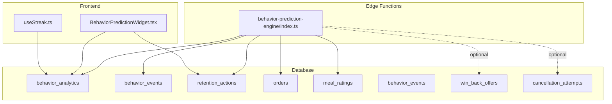
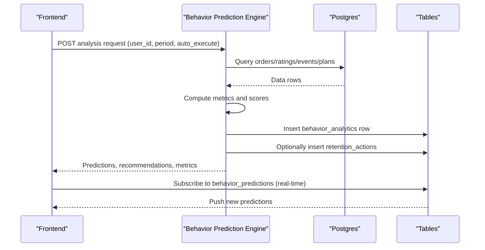
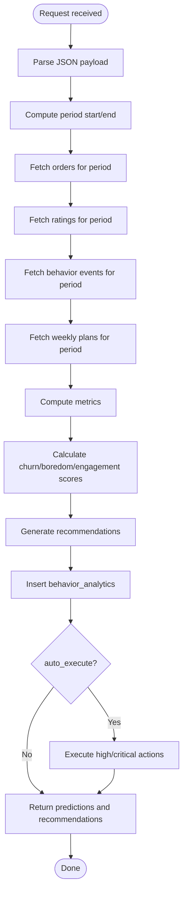
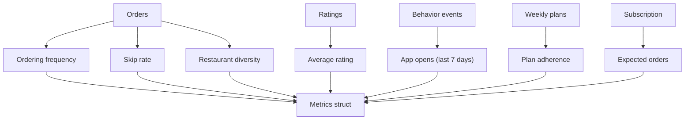
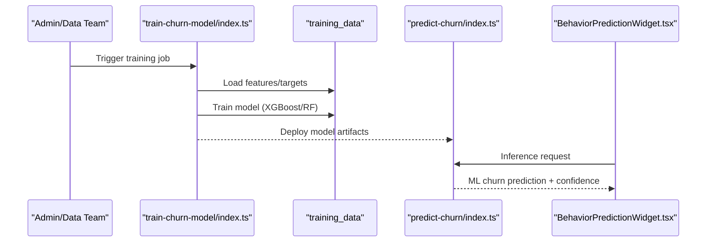
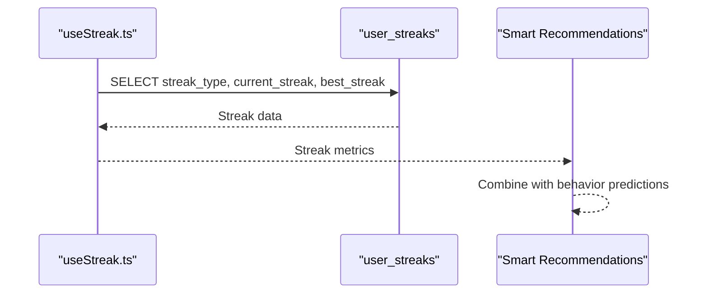
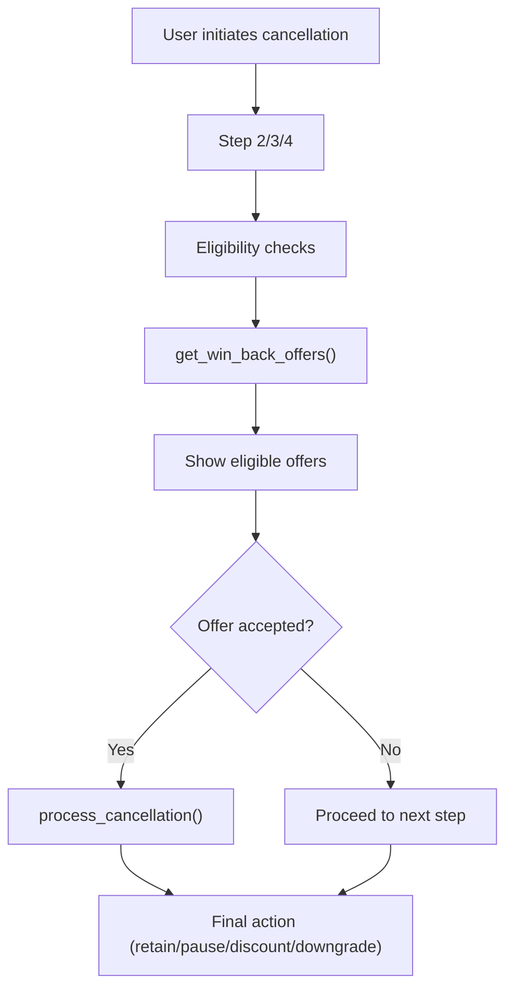
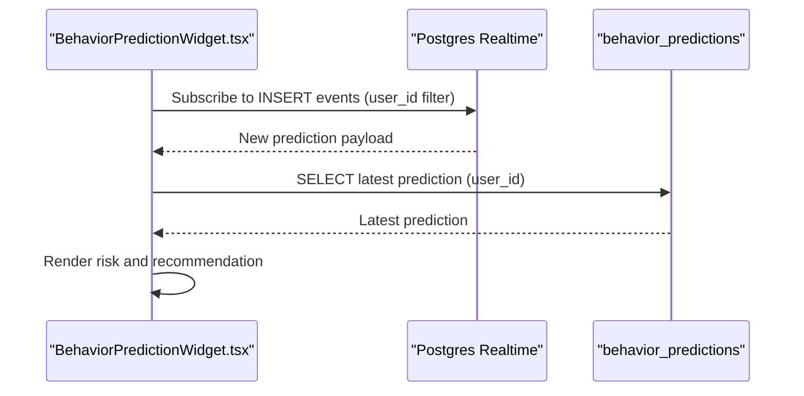
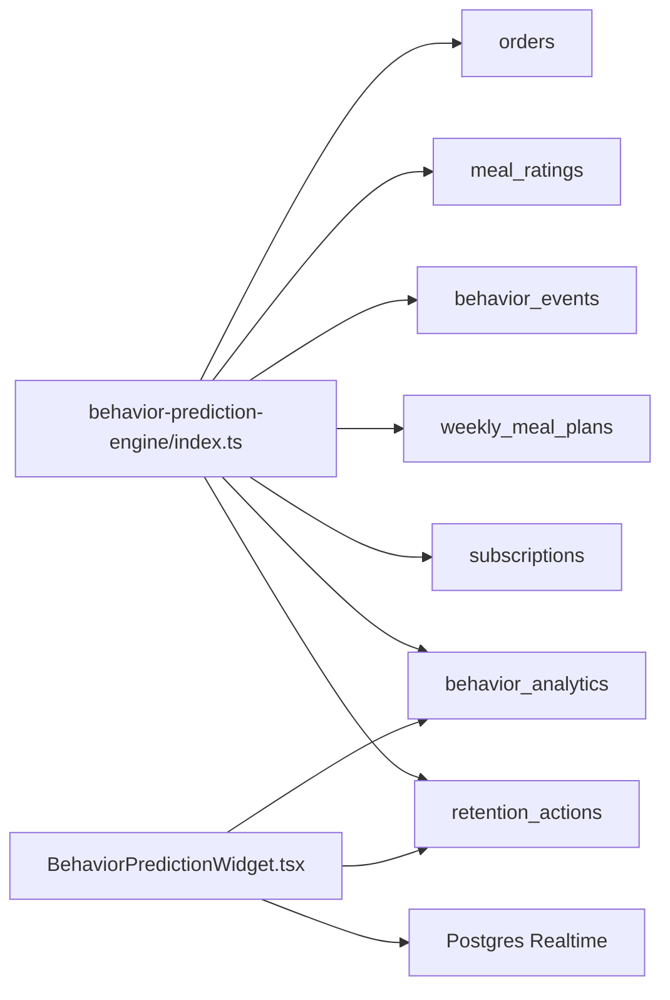

# Behavior Prediction Engine

<cite>
**Referenced Files in This Document**
- [index.ts](file://supabase/functions/behavior-prediction-engine/index.ts)
- [20250223000001_ai_subscription_credit_system.sql](file://supabase/migrations/20250223000001_ai_subscription_credit_system.sql)
- [types.ts](file://src/integrations/supabase/types.ts)
- [BehaviorPredictionWidget.tsx](file://src/components/BehaviorPredictionWidget.tsx)
- [useStreak.ts](file://src/hooks/useStreak.ts)
- [20260225211307_add_win_back_offers.sql](file://supabase/migrations/20260225211307_add_win_back_offers.sql)
- [useSubscriptionManagement.ts](file://src/hooks/useSubscriptionManagement.ts)
- [implementation_matrix.md](file://implementation_matrix.md)
- [20250501_add_ml_churn_prediction.sql](file://supabase/migrations/20250501_add_ml_churn_prediction.sql)
- [train-churn-model/index.ts](file://supabase/functions/train-churn-model/index.ts)
- [predict-churn/index.ts](file://supabase/functions/predict-churn/index.ts)
- [20260224000001_add_ai_profile_fields.sql](file://supabase/migrations/20260224000001_add_ai_profile_fields.sql)
- [20250223-retention-system-design.md](file://docs/plans/2025-02-23-retention-system-design.md)
</cite>

## Table of Contents
1. [Introduction](#introduction)
2. [Project Structure](#project-structure)
3. [Core Components](#core-components)
4. [Architecture Overview](#architecture-overview)
5. [Detailed Component Analysis](#detailed-component-analysis)
6. [Dependency Analysis](#dependency-analysis)
7. [Performance Considerations](#performance-considerations)
8. [Troubleshooting Guide](#troubleshooting-guide)
9. [Ethical and Privacy Considerations](#ethical-and-privacy-considerations)
10. [Conclusion](#conclusion)

## Introduction
This document describes the Behavior Prediction Engine that forecasts user engagement patterns and meal consumption behaviors to drive proactive retention. It explains the rule-based algorithms used to compute churn risk, boredom risk, and engagement scores, and how these inform retention recommendations. It also documents the integration with streak tracking, win-back offer systems, and broader retention strategies. The data preprocessing pipeline, feature engineering, and model training processes are covered, along with ethical considerations around behavioral prediction and user privacy.

## Project Structure
The Behavior Prediction Engine spans Supabase Edge Functions, database schemas, and frontend components:
- Edge Function: Computes behavior metrics, scores, and retention recommendations.
- Database: Stores behavior analytics, behavior events, retention actions, and supporting tables.
- Frontend: Displays predictions and integrates with real-time updates.
- Win-back Offers: Provides structured retention offers during cancellation.
- Streak Tracking: Supplies complementary engagement signals.

**Diagram sources**
- [index.ts:306-512](file://supabase/functions/behavior-prediction-engine/index.ts#L306-L512)
- [20250223000001_ai_subscription_credit_system.sql:164-218](file://supabase/migrations/20250223000001_ai_subscription_credit_system.sql#L164-L218)
- [BehaviorPredictionWidget.tsx:27-89](file://src/components/BehaviorPredictionWidget.tsx#L27-L89)
- [useStreak.ts:11-61](file://src/hooks/useStreak.ts#L11-L61)
- [20260225211307_add_win_back_offers.sql:27-167](file://supabase/migrations/20260225211307_add_win_back_offers.sql#L27-L167)

**Section sources**
- [index.ts:1-513](file://supabase/functions/behavior-prediction-engine/index.ts#L1-L513)
- [20250223000001_ai_subscription_credit_system.sql:161-218](file://supabase/migrations/20250223000001_ai_subscription_credit_system.sql#L161-L218)
- [BehaviorPredictionWidget.tsx:1-201](file://src/components/BehaviorPredictionWidget.tsx#L1-L201)
- [useStreak.ts:1-73](file://src/hooks/useStreak.ts#L1-L73)
- [20260225211307_add_win_back_offers.sql:1-168](file://supabase/migrations/20260225211307_add_win_back_offers.sql#L1-L168)

## Core Components
- Behavior Prediction Engine (Edge Function): Reads user activity, computes metrics, scores, and retention recommendations, and optionally executes actions (e.g., awarding credits).
- Behavior Analytics and Events: Persisted tables capturing behavioral signals and outcomes.
- Frontend Widget: Displays actionable insights and real-time predictions.
- Streak Tracking: Provides complementary engagement signals.
- Win-back Offers: Structured retention offers during cancellation flow.

Key responsibilities:
- Data ingestion: Orders, ratings, behavior events, weekly plans.
- Metric computation: Ordering frequency, skip rate, restaurant diversity, average rating, app opens, plan adherence.
- Risk scoring: Churn risk, boredom risk, engagement score.
- Recommendations: Action types, priorities, and suggested messages.
- Execution: Optional automated actions with audit logging.

**Section sources**
- [index.ts:41-142](file://supabase/functions/behavior-prediction-engine/index.ts#L41-L142)
- [index.ts:144-231](file://supabase/functions/behavior-prediction-engine/index.ts#L144-L231)
- [index.ts:233-304](file://supabase/functions/behavior-prediction-engine/index.ts#L233-L304)
- [20250223000001_ai_subscription_credit_system.sql:164-182](file://supabase/migrations/20250223000001_ai_subscription_credit_system.sql#L164-L182)
- [20250223000001_ai_subscription_credit_system.sql:184-198](file://supabase/migrations/20250223000001_ai_subscription_credit_system.sql#L184-L198)

## Architecture Overview
The system follows a serverless pattern with Supabase Edge Functions and Postgres:
- Edge Function: Accepts a user identifier, optional analysis window, and auto-execute flag; performs analytics and returns predictions and recommendations.
- Database: Stores raw events and derived analytics; supports retention actions and win-back offers.
- Frontend: Subscribes to real-time updates and renders personalized insights.

**Diagram sources**
- [index.ts:306-512](file://supabase/functions/behavior-prediction-engine/index.ts#L306-L512)
- [20250223000001_ai_subscription_credit_system.sql:164-182](file://supabase/migrations/20250223000001_ai_subscription_credit_system.sql#L164-L182)
- [BehaviorPredictionWidget.tsx:34-59](file://src/components/BehaviorPredictionWidget.tsx#L34-L59)

**Section sources**
- [index.ts:306-512](file://supabase/functions/behavior-prediction-engine/index.ts#L306-L512)
- [BehaviorPredictionWidget.tsx:27-89](file://src/components/BehaviorPredictionWidget.tsx#L27-L89)

## Detailed Component Analysis

### Behavior Prediction Engine (Edge Function)
Responsibilities:
- Accepts user_id, analyze_period_days, auto_execute.
- Builds date range and queries orders, ratings, behavior events, and weekly plans.
- Computes metrics: ordering frequency, skip rate, restaurant diversity, average rating, app opens last 7 days, plan adherence.
- Calculates churn risk, boredom risk, and engagement score.
- Generates retention recommendations with priorities and suggested messaging.
- Optionally executes actions (e.g., awarding credits) and logs outcomes.
- Persists analytics to behavior_analytics.

**Diagram sources**
- [index.ts:317-503](file://supabase/functions/behavior-prediction-engine/index.ts#L317-L503)

**Section sources**
- [index.ts:41-142](file://supabase/functions/behavior-prediction-engine/index.ts#L41-L142)
- [index.ts:144-231](file://supabase/functions/behavior-prediction-engine/index.ts#L144-L231)
- [index.ts:233-304](file://supabase/functions/behavior-prediction-engine/index.ts#L233-L304)
- [index.ts:306-512](file://supabase/functions/behavior-prediction-engine/index.ts#L306-L512)

### Data Preprocessing Pipeline and Feature Engineering
- Inputs:
  - Orders: total count, cancellations, restaurant diversity.
  - Ratings: average rating.
  - Behavior events: app opens last 7 days.
  - Weekly plans: acceptance/modification rates.
  - Subscription: expected ordering frequency based on meal credits.
- Derived features:
  - Ordering frequency normalized to expected.
  - Skip rate from cancellations.
  - Restaurant diversity from unique restaurants.
  - Engagement score deduction model.
  - Plan adherence rate.

**Diagram sources**
- [index.ts:335-431](file://supabase/functions/behavior-prediction-engine/index.ts#L335-L431)

**Section sources**
- [index.ts:335-431](file://supabase/functions/behavior-prediction-engine/index.ts#L335-L431)

### Model Training Processes (Planned)
A future enhancement replaces rule-based scoring with a trained model:
- Add model_predictions and training_data tables.
- Create training pipeline and inference endpoints.
- Update frontend widget to display ML scores alongside rule-based ones.
- Track model performance metrics.

**Diagram sources**
- [implementation_matrix.md:544-567](file://implementation_matrix.md#L544-L567)
- [20250501_add_ml_churn_prediction.sql](file://supabase/migrations/20250501_add_ml_churn_prediction.sql)
- [train-churn-model/index.ts](file://supabase/functions/train-churn-model/index.ts)
- [predict-churn/index.ts](file://supabase/functions/predict-churn/index.ts)
- [BehaviorPredictionWidget.tsx:27-89](file://src/components/BehaviorPredictionWidget.tsx#L27-L89)

**Section sources**
- [implementation_matrix.md:544-567](file://implementation_matrix.md#L544-L567)

### Integration with Streak Tracking
The streak hook provides complementary engagement signals:
- Retrieves current and best streaks for logging, goals, weight, and water.
- Used by smart recommendations to personalize suggestions.

**Diagram sources**
- [useStreak.ts:20-61](file://src/hooks/useStreak.ts#L20-L61)

**Section sources**
- [useStreak.ts:1-73](file://src/hooks/useStreak.ts#L1-L73)

### Integration with Win-back Offer Systems
Win-back offers provide structured retention actions during cancellation:
- Eligibility determined by tier, subscription duration, and previous cancellations.
- Offers include pause, discount, downgrade, and bonus credits.
- The system surfaces relevant offers and processes cancellations with retention flow.

**Diagram sources**
- [20260225211307_add_win_back_offers.sql:83-167](file://supabase/migrations/20260225211307_add_win_back_offers.sql#L83-L167)
- [useSubscriptionManagement.ts:233-278](file://src/hooks/useSubscriptionManagement.ts#L233-L278)

**Section sources**
- [20260225211307_add_win_back_offers.sql:1-168](file://supabase/migrations/20260225211307_add_win_back_offers.sql#L1-L168)
- [useSubscriptionManagement.ts:233-278](file://src/hooks/useSubscriptionManagement.ts#L233-L278)

### Frontend Behavior Prediction Widget
The widget subscribes to real-time predictions and displays actionable insights:
- Subscribes to behavior_predictions via Postgres Realtime.
- Filters predictions to recent entries.
- Renders risk indicators and recommended actions with severity.

**Diagram sources**
- [BehaviorPredictionWidget.tsx:34-59](file://src/components/BehaviorPredictionWidget.tsx#L34-L59)
- [types.ts:342-377](file://src/integrations/supabase/types.ts#L342-L377)

**Section sources**
- [BehaviorPredictionWidget.tsx:1-201](file://src/components/BehaviorPredictionWidget.tsx#L1-L201)
- [types.ts:342-377](file://src/integrations/supabase/types.ts#L342-L377)

## Dependency Analysis
- Edge Function depends on:
  - Supabase client for Postgres access.
  - Orders, ratings, behavior_events, weekly_meal_plans, subscriptions tables.
  - Optional integration with win-back offers and retention actions.
- Frontend depends on:
  - Supabase client for Postgres queries and Realtime.
  - Types for behavior_predictions table.
- Database enforces:
  - Row-level security for privacy.
  - Indexes for performance.
  - Integrity constraints for financial and behavioral data.

**Diagram sources**
- [index.ts:335-469](file://supabase/functions/behavior-prediction-engine/index.ts#L335-L469)
- [20250223000001_ai_subscription_credit_system.sql:164-218](file://supabase/migrations/20250223000001_ai_subscription_credit_system.sql#L164-L218)
- [BehaviorPredictionWidget.tsx:34-59](file://src/components/BehaviorPredictionWidget.tsx#L34-L59)

**Section sources**
- [index.ts:306-512](file://supabase/functions/behavior-prediction-engine/index.ts#L306-L512)
- [20250223000001_ai_subscription_credit_system.sql:271-486](file://supabase/migrations/20250223000001_ai_subscription_credit_system.sql#L271-L486)

## Performance Considerations
- Indexes: Ensure optimal query performance on user_id, timestamps, and frequently filtered columns.
- Data volume: Limit analysis windows to reduce compute and IO.
- Real-time updates: Use targeted filters and avoid broad scans.
- Edge Function cold start: Keep initialization minimal; reuse connections where possible.
- Batch processing: Consider nightly or periodic runs for heavy computations if needed.

[No sources needed since this section provides general guidance]

## Troubleshooting Guide
Common issues and remedies:
- Missing user_id: Ensure the request includes a valid user identifier.
- Empty or partial data: Verify that orders, ratings, events, and plans exist for the selected period.
- Execution failures: Check retention action logging and subscription credit updates.
- Realtime subscription: Confirm Postgres Realtime is enabled and filters are correctly configured.

**Section sources**
- [index.ts:317-328](file://supabase/functions/behavior-prediction-engine/index.ts#L317-L328)
- [index.ts:343-356](file://supabase/functions/behavior-prediction-engine/index.ts#L343-L356)
- [index.ts:505-510](file://supabase/functions/behavior-prediction-engine/index.ts#L505-L510)
- [BehaviorPredictionWidget.tsx:34-59](file://src/components/BehaviorPredictionWidget.tsx#L34-L59)

## Ethical and Privacy Considerations
- Data minimization: Collect only necessary behavioral signals for prediction.
- Transparency: Inform users about prediction purposes and how their data is used.
- Consent: Ensure users can opt out of predictive features where applicable.
- Bias mitigation: Regularly audit predictions for disparate impact across user segments.
- Security: Enforce Row Level Security and immutability policies; restrict access to sensitive tables.
- Retention ethics: Avoid manipulative tactics; ensure offers are genuinely beneficial.
- Profiling limits: Avoid creating overly deterministic models that remove user agency.

[No sources needed since this section provides general guidance]

## Conclusion
The Behavior Prediction Engine provides a robust, rule-based foundation for understanding user engagement and guiding retention actions. It integrates seamlessly with streak tracking and win-back offers, while the database schema and RLS policies safeguard user privacy. Planned enhancements include machine learning-driven predictions, further enriching personalization and operational effectiveness.

[No sources needed since this section summarizes without analyzing specific files]