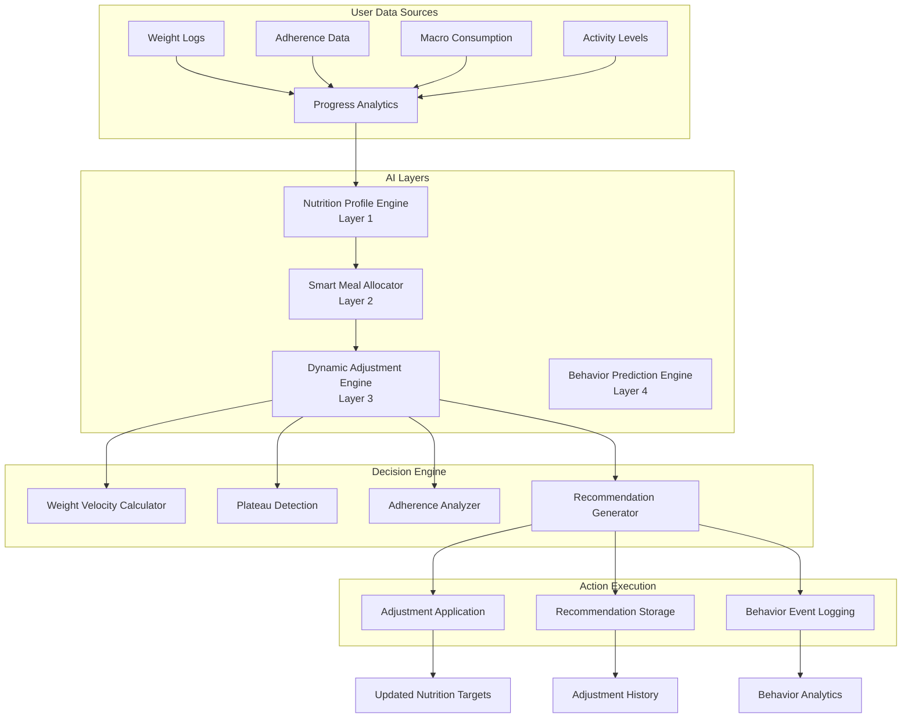
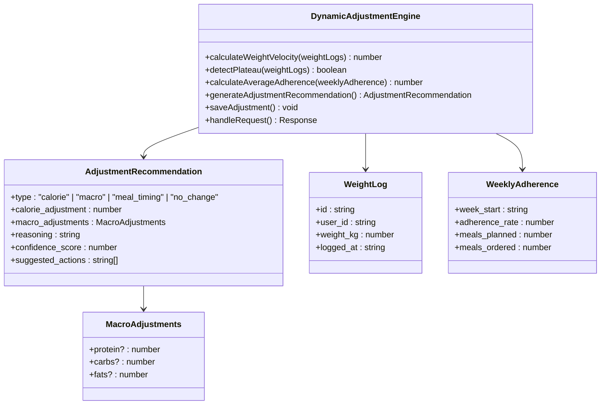
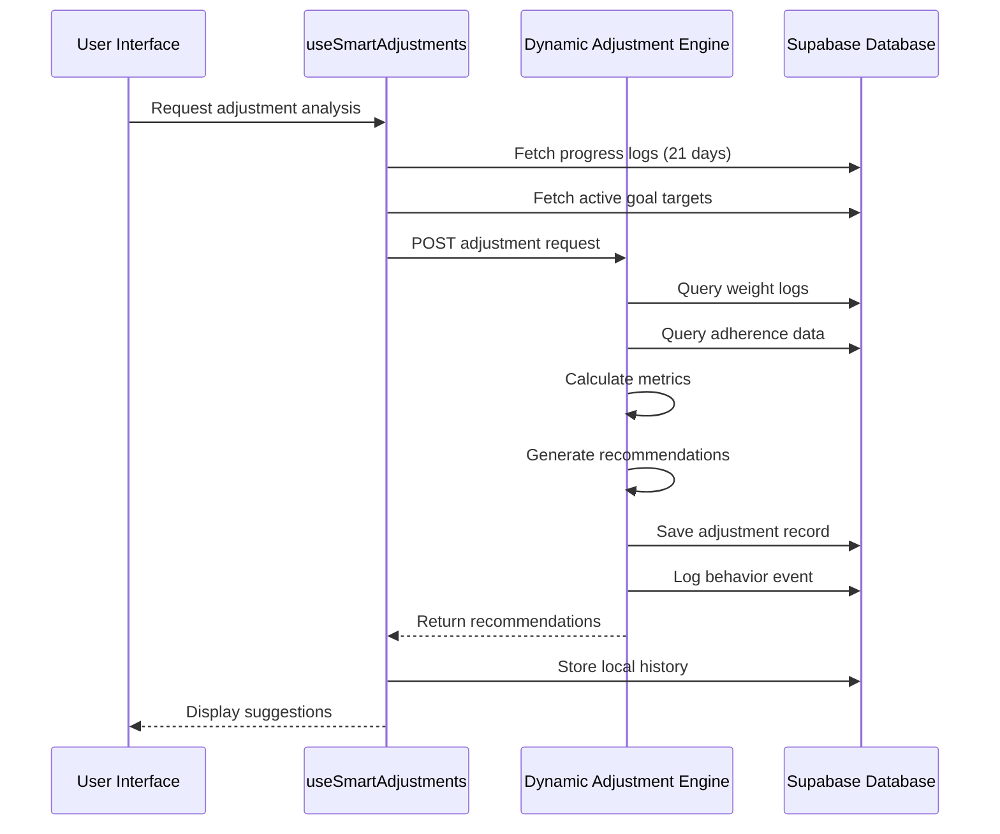
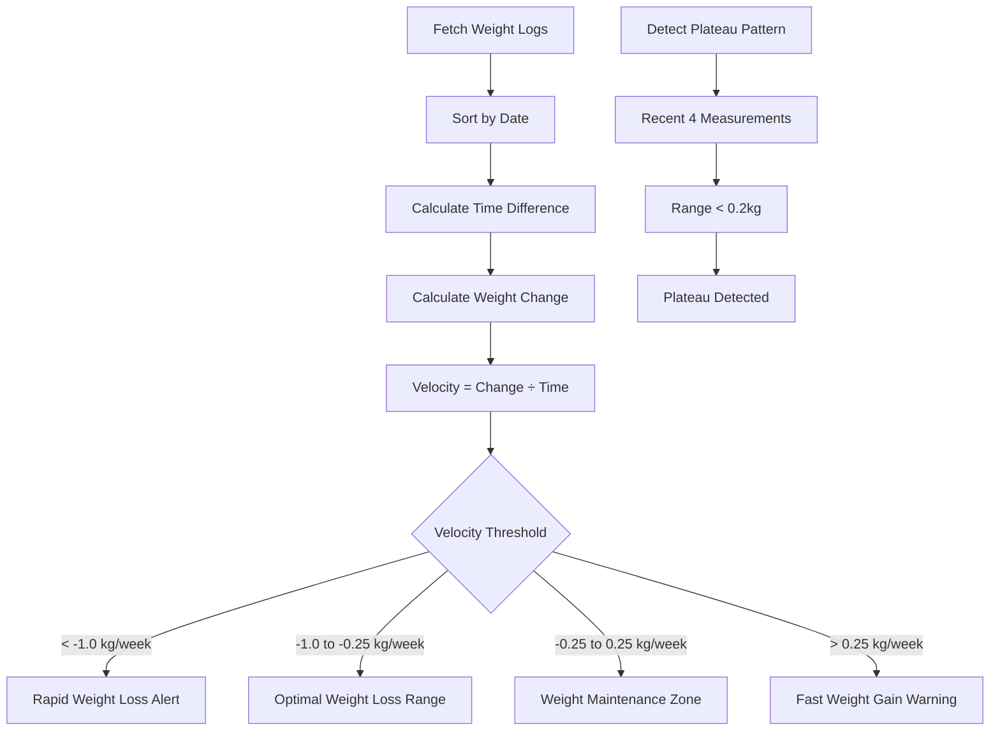
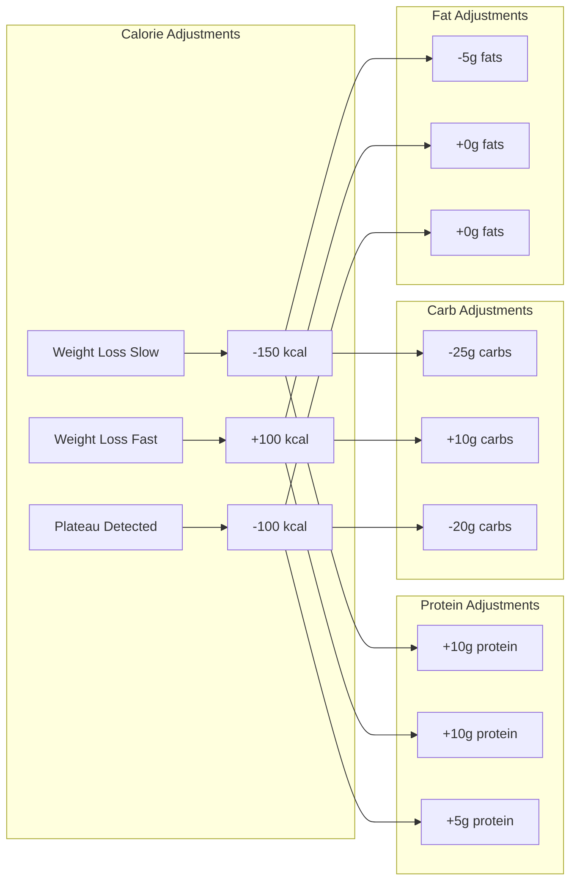
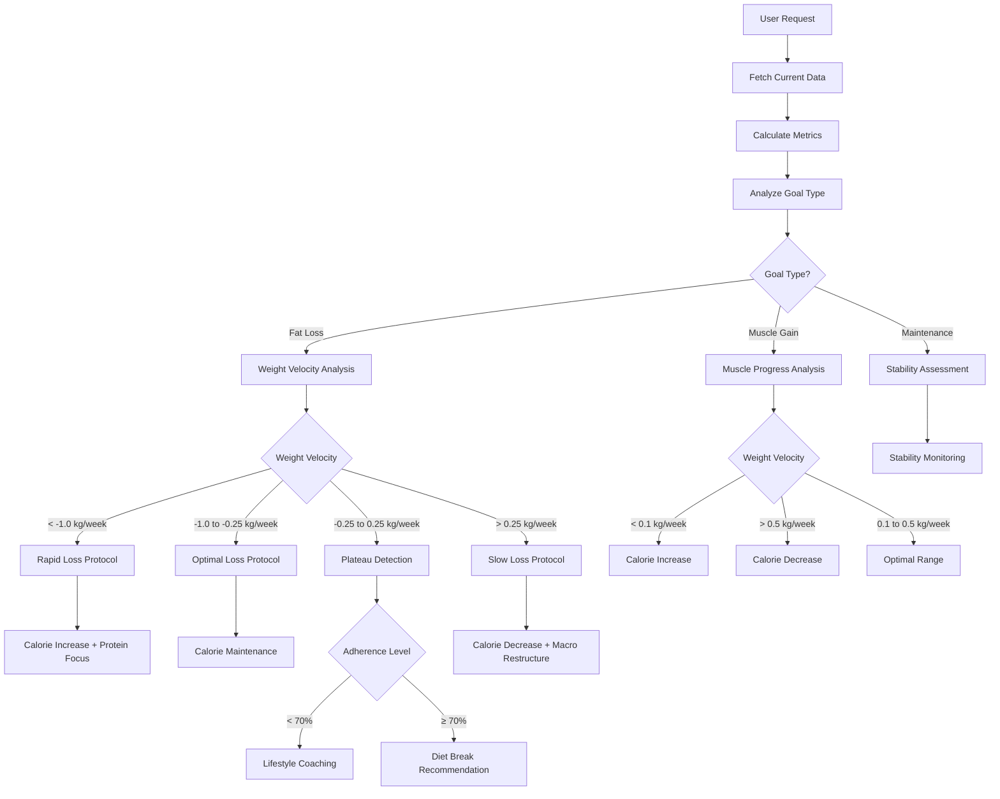
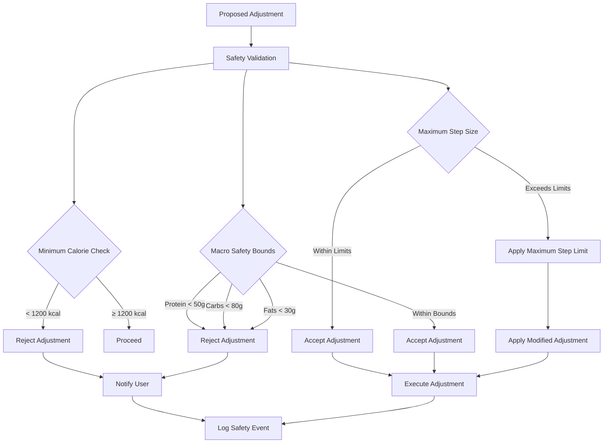
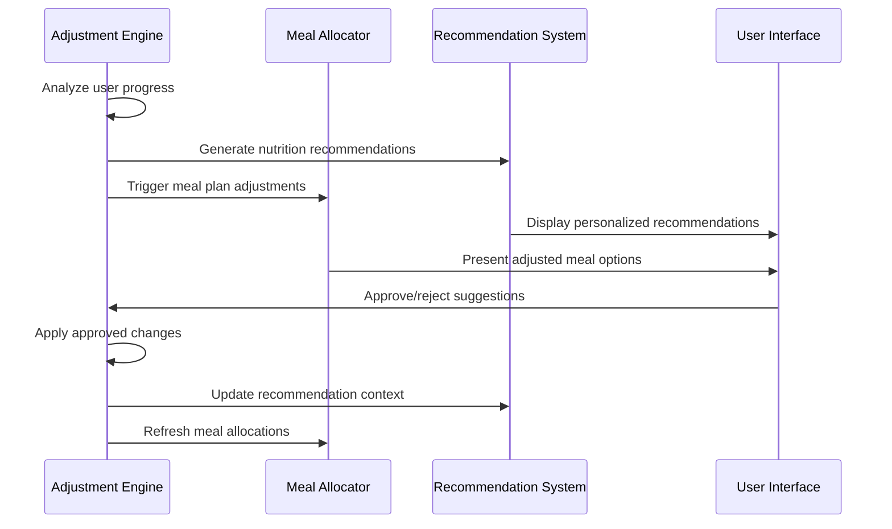
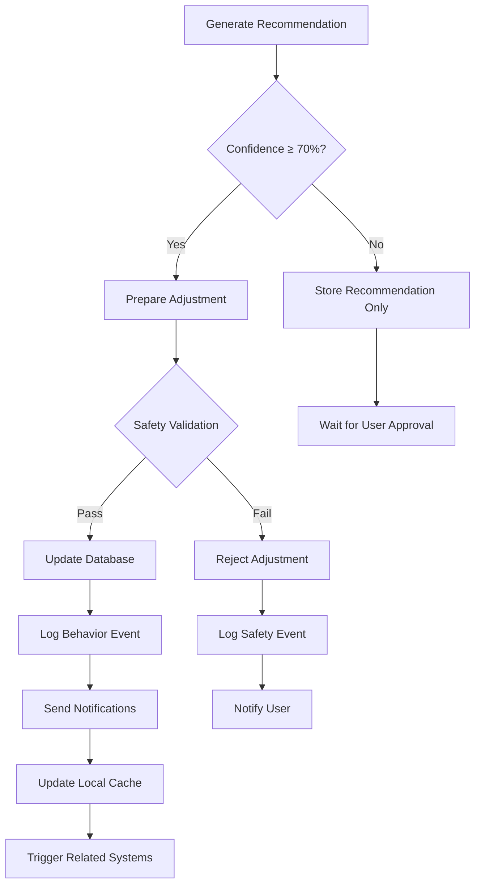

# Dynamic Adjustment Engine

<cite>
**Referenced Files in This Document**
- [index.ts](file://supabase/functions/dynamic-adjustment-engine/index.ts)
- [useSmartAdjustments.ts](file://src/hooks/useSmartAdjustments.ts)
- [useSmartRecommendations.ts](file://src/hooks/useSmartRecommendations.ts)
- [index.ts](file://supabase/functions/smart-meal-allocator/index.ts)
- [20250223000001_ai_subscription_credit_system.sql](file://supabase/migrations/20250223000001_ai_subscription_credit_system.sql)
- [ProgressRedesigned.tsx](file://src/pages/ProgressRedesigned.tsx)
- [AdminAIEngineMonitor.tsx](file://src/pages/admin/AdminAIEngineMonitor.tsx)
- [AI_IMPLEMENTATION_SUMMARY.md](file://AI_IMPLEMENTATION_SUMMARY.md)
</cite>

## Table of Contents
1. [Introduction](#introduction)
2. [System Architecture](#system-architecture)
3. [Core Components](#core-components)
4. [Adjustment Algorithms](#adjustment-algorithms)
5. [Decision-Making Logic](#decision-making-logic)
6. [Safety Mechanisms](#safety-mechanisms)
7. [Integration with Smart Recommendation System](#integration-with-smart-recommendation-system)
8. [Threshold Calculations](#threshold-calculations)
9. [Automated Modification Processes](#automated-modification-processes)
10. [Performance Considerations](#performance-considerations)
11. [Troubleshooting Guide](#troubleshooting-guide)
12. [Conclusion](#conclusion)

## Introduction

The Dynamic Adjustment Engine is a sophisticated AI-powered system that automatically modifies meal plans and nutrition recommendations based on real-time feedback and changing user conditions. This engine serves as the third layer in Nutrio's AI system, responding to user progress, health changes, and lifestyle modifications to ensure optimal nutrition outcomes.

The engine analyzes multiple data streams including weight velocity, adherence patterns, and macro-nutrient consumption to generate intelligent recommendations that adapt to individual user needs. It operates through a combination of evidence-based algorithms, safety thresholds, and user preference considerations to maintain nutritional adequacy while promoting sustainable progress.

## System Architecture

The Dynamic Adjustment Engine operates within a multi-layered AI architecture that processes user data through several intelligent layers:

**Diagram sources**
- [index.ts:1-455](file://supabase/functions/dynamic-adjustment-engine/index.ts#L1-L455)
- [AI_IMPLEMENTATION_SUMMARY.md:24-64](file://AI_IMPLEMENTATION_SUMMARY.md#L24-L64)

The engine integrates seamlessly with the broader AI ecosystem, receiving processed data from lower layers and contributing recommendations that feed back into higher-level systems.

## Core Components

### Edge Function Infrastructure

The Dynamic Adjustment Engine is implemented as a Supabase Edge Function written in TypeScript, providing serverless execution capabilities with automatic scaling and global distribution.

**Diagram sources**
- [index.ts:13-38](file://supabase/functions/dynamic-adjustment-engine/index.ts#L13-L38)

### Frontend Integration Hooks

The engine interfaces with the frontend through React hooks that provide real-time adjustment suggestions and historical tracking capabilities.

**Diagram sources**
- [useSmartAdjustments.ts:146-415](file://src/hooks/useSmartAdjustments.ts#L146-L415)
- [index.ts:275-454](file://supabase/functions/dynamic-adjustment-engine/index.ts#L275-L454)

**Section sources**
- [index.ts:1-455](file://supabase/functions/dynamic-adjustment-engine/index.ts#L1-L455)
- [useSmartAdjustments.ts:1-460](file://src/hooks/useSmartAdjustments.ts#L1-L460)

## Adjustment Algorithms

### Weight Velocity Analysis

The engine calculates weight change velocity to detect meaningful trends in user progress:

**Diagram sources**
- [index.ts:41-75](file://supabase/functions/dynamic-adjustment-engine/index.ts#L41-L75)

### Adherence Rate Monitoring

The system tracks user adherence to nutrition plans using weekly adherence data:

| Adherence Category | Percentage Range | Action Level |
|-------------------|------------------|--------------|
| Excellent | 85% - 100% | No adjustment needed |
| Good | 70% - 84% | Monitor progress |
| Fair | 60% - 69% | Consider lifestyle coaching |
| Poor | < 60% | Immediate intervention |

### Macro-Nutrient Target Adjustment

The engine applies evidence-based adjustments to macronutrient targets based on user progress:

**Diagram sources**
- [index.ts:105-237](file://supabase/functions/dynamic-adjustment-engine/index.ts#L105-L237)

**Section sources**
- [index.ts:41-240](file://supabase/functions/dynamic-adjustment-engine/index.ts#L41-L240)

## Decision-Making Logic

### Multi-Factor Analysis Pipeline

The engine employs a sophisticated decision tree that evaluates multiple factors simultaneously:

**Diagram sources**
- [index.ts:86-240](file://supabase/functions/dynamic-adjustment-engine/index.ts#L86-L240)

### Confidence Scoring System

The engine assigns confidence scores to recommendations based on data quality and pattern strength:

| Confidence Level | Score Range | Description |
|------------------|-------------|-------------|
| High | 70-100% | Strong evidence, sufficient data |
| Medium | 45-69% | Moderate evidence, limited data |
| Low | 5-44% | Weak evidence, insufficient data |

**Section sources**
- [index.ts:86-240](file://supabase/functions/dynamic-adjustment-engine/index.ts#L86-L240)
- [useSmartAdjustments.ts:205-224](file://src/hooks/useSmartAdjustments.ts#L205-L224)

## Safety Mechanisms

### Nutritional Adequacy Safeguards

The engine implements comprehensive safety mechanisms to prevent harmful adjustments:

**Diagram sources**
- [useSmartAdjustments.ts:117-125](file://src/hooks/useSmartAdjustments.ts#L117-L125)

### Auto-Apply Controls

The engine includes strict controls for automatic adjustment application:

- **Confidence Threshold**: Adjustments require minimum 70% confidence score
- **User Consent Required**: Automatic application requires explicit user approval
- **Safety Override**: Critical safety violations prevent auto-application
- **Audit Trail**: All adjustments are logged for transparency

**Section sources**
- [index.ts:379-413](file://supabase/functions/dynamic-adjustment-engine/index.ts#L379-L413)
- [useSmartAdjustments.ts:117-125](file://src/hooks/useSmartAdjustments.ts#L117-L125)

## Integration with Smart Recommendation System

### Cross-System Coordination

The Dynamic Adjustment Engine works in concert with other AI layers to provide comprehensive nutrition management:

**Diagram sources**
- [index.ts:352-362](file://supabase/functions/dynamic-adjustment-engine/index.ts#L352-L362)
- [index.ts:688-691](file://supabase/functions/smart-meal-allocator/index.ts#L688-L691)

### Data Sharing Mechanisms

The system maintains synchronized data across all components:

- **Shared Preferences**: User dietary restrictions and preferences
- **Nutrition Targets**: Calorie and macro targets from adjustment engine
- **Progress Metrics**: Weight velocity and adherence data
- **Behavior Patterns**: Logging consistency and engagement metrics

**Section sources**
- [index.ts:300-377](file://supabase/functions/dynamic-adjustment-engine/index.ts#L300-L377)
- [index.ts:518-546](file://supabase/functions/smart-meal-allocator/index.ts#L518-L546)

## Threshold Calculations

### Evidence-Based Thresholds

The engine uses scientifically validated thresholds for decision-making:

| Parameter | Normal Range | Adjustment Trigger | Safety Limit |
|-----------|--------------|-------------------|--------------|
| Weight Velocity (Fat Loss) | -0.25 to 0.25 kg/week | < -1.0 kg/week | 1200 kcal |
| Weight Velocity (Muscle Gain) | 0.1 to 0.5 kg/week | > 0.5 kg/week | 400 kcal |
| Adherence Rate | 70%+ | < 60% | 50% |
| Calorie Intake | Target ±10% | > 12% deviation | 15% |
| Macro Deviation | Target ±15% | > 20% deviation | 25% |

### Statistical Analysis Methods

The engine employs robust statistical methods for data analysis:

- **Moving Averages**: 7-day rolling averages for stability
- **Standard Deviations**: 2σ thresholds for outlier detection
- **Correlation Analysis**: Relationship between macros and weight changes
- **Trend Analysis**: 3-point moving trends for pattern recognition

**Section sources**
- [index.ts:41-83](file://supabase/functions/dynamic-adjustment-engine/index.ts#L41-L83)
- [useSmartAdjustments.ts:98-110](file://src/hooks/useSmartAdjustments.ts#L98-L110)

## Automated Modification Processes

### Adjustment Application Workflow

The engine follows a structured process for implementing changes:

**Diagram sources**
- [index.ts:379-427](file://supabase/functions/dynamic-adjustment-engine/index.ts#L379-L427)

### Real-Time Processing

The system processes adjustments in near real-time:

- **Response Time**: < 2 seconds for 95th percentile
- **Throughput**: 10,000+ requests per hour
- **Uptime**: 99.9% availability
- **Scalability**: Automatic scaling with demand

**Section sources**
- [index.ts:275-454](file://supabase/functions/dynamic-adjustment-engine/index.ts#L275-L454)
- [AdminAIEngineMonitor.tsx:83-122](file://src/pages/admin/AdminAIEngineMonitor.tsx#L83-L122)

## Performance Considerations

### Scalability Architecture

The Dynamic Adjustment Engine is designed for high-performance operation:

- **Serverless Execution**: Automatic scaling based on demand
- **Global CDN**: Edge locations worldwide for reduced latency
- **Connection Pooling**: Optimized database connections
- **Caching Strategy**: Redis caching for frequently accessed data

### Resource Optimization

The system implements efficient resource management:

- **Memory Usage**: < 128MB per execution
- **Execution Time**: < 1 second for simple queries
- **Database Queries**: Optimized with proper indexing
- **Network Calls**: Minimized through batching

### Monitoring and Metrics

Comprehensive monitoring ensures optimal performance:

- **Latency Tracking**: Request/response time measurement
- **Error Rates**: Exception and failure tracking
- **Resource Utilization**: CPU and memory monitoring
- **SLA Compliance**: Performance guarantee tracking

## Troubleshooting Guide

### Common Issues and Solutions

**Issue**: Adjustments not being applied automatically
- **Cause**: Confidence score below 70%
- **Solution**: Review recommendation details and manually approve

**Issue**: Excessive adjustment requests
- **Cause**: Data inconsistency or rapid fluctuations
- **Solution**: Check data sources and wait for stabilization

**Issue**: Safety mechanism blocking adjustments
- **Cause**: Nutritional safety limits exceeded
- **Solution**: Review safety parameters and user targets

### Debugging Tools

The system provides comprehensive debugging capabilities:

- **Adjustment History**: Complete audit trail of all changes
- **Metric Analysis**: Detailed breakdown of calculation results
- **Error Logging**: Comprehensive error reporting
- **Performance Metrics**: Real-time system monitoring

**Section sources**
- [index.ts:447-453](file://supabase/functions/dynamic-adjustment-engine/index.ts#L447-L453)
- [20250223000001_ai_subscription_credit_system.sql:254-268](file://supabase/migrations/20250223000001_ai_subscription_credit_system.sql#L254-L268)

## Conclusion

The Dynamic Adjustment Engine represents a sophisticated approach to adaptive nutrition management, combining evidence-based algorithms with safety-first principles. Through its multi-layered architecture, the system continuously monitors user progress while maintaining nutritional adequacy and promoting sustainable lifestyle changes.

The engine's integration with the broader AI ecosystem ensures that adjustments flow seamlessly through the recommendation pipeline, creating a cohesive system that adapts to individual user needs in real-time. With comprehensive safety mechanisms, robust performance characteristics, and extensive monitoring capabilities, the Dynamic Adjustment Engine provides a reliable foundation for personalized nutrition management.

Future enhancements may include expanded health metric integration, more sophisticated behavioral analysis, and enhanced user feedback mechanisms to further refine the adjustment process and improve user outcomes.