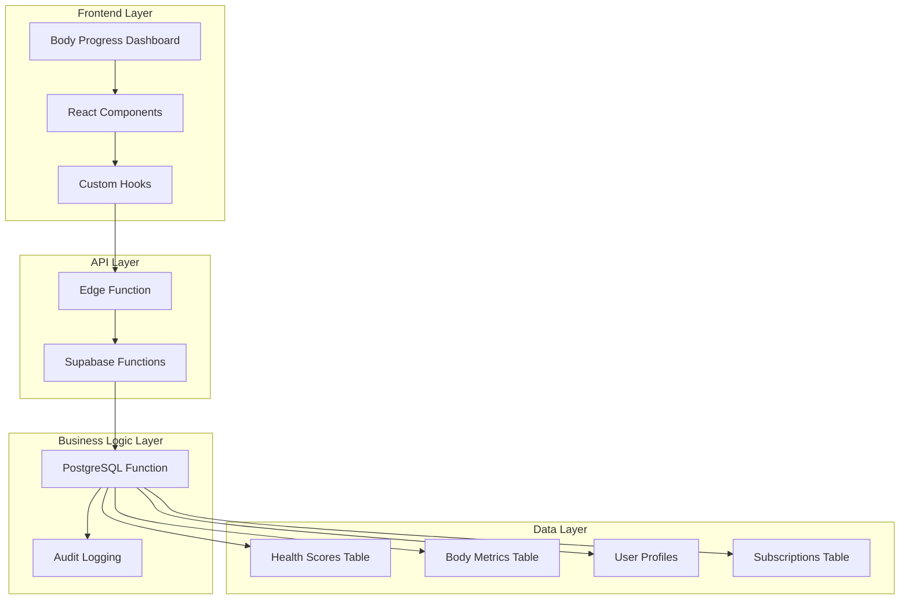
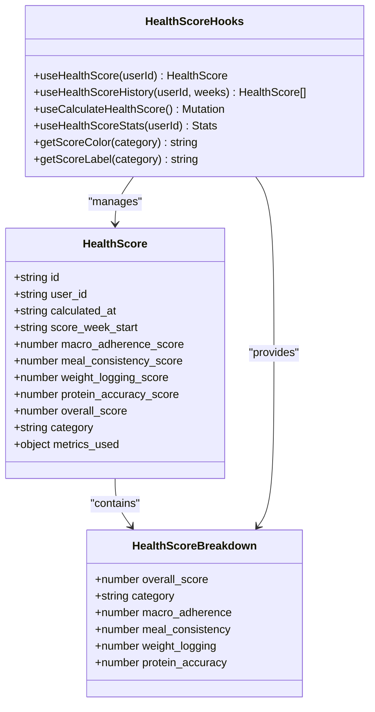
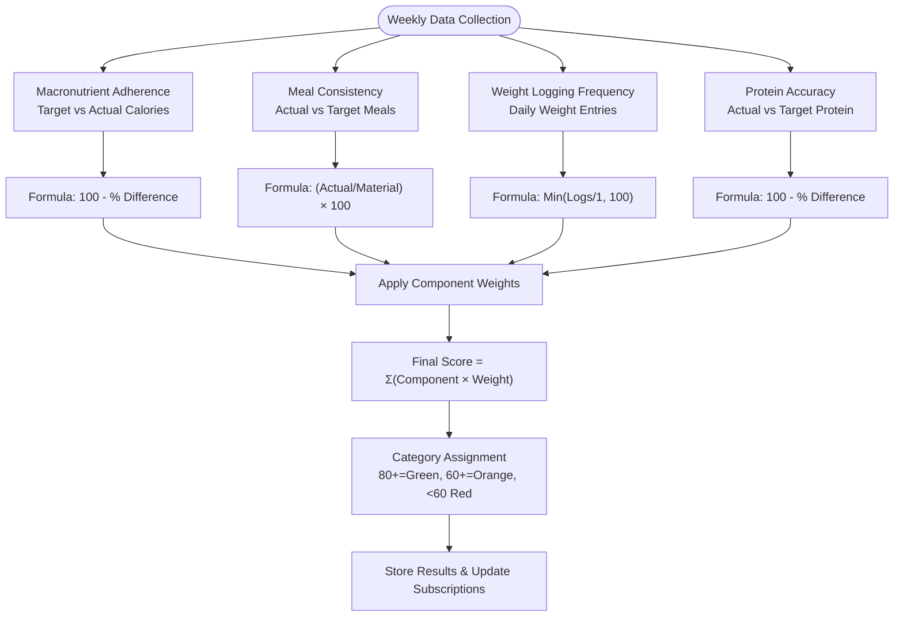
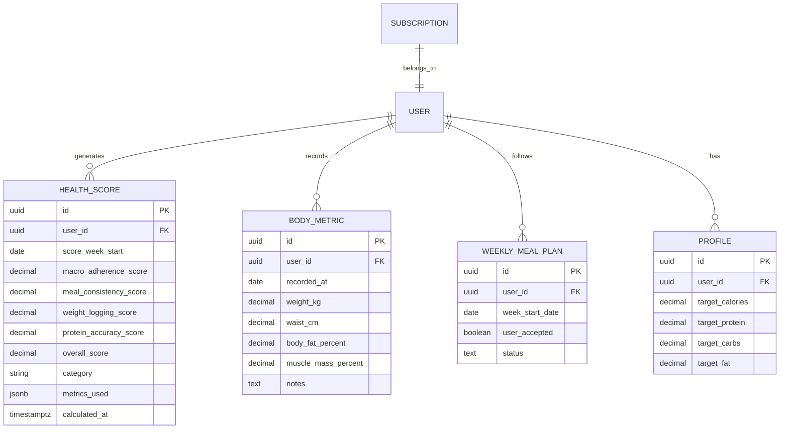
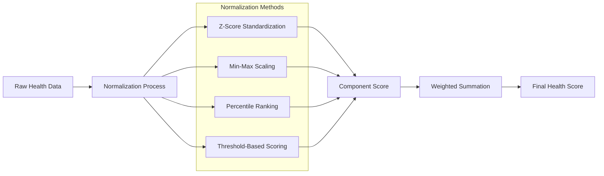
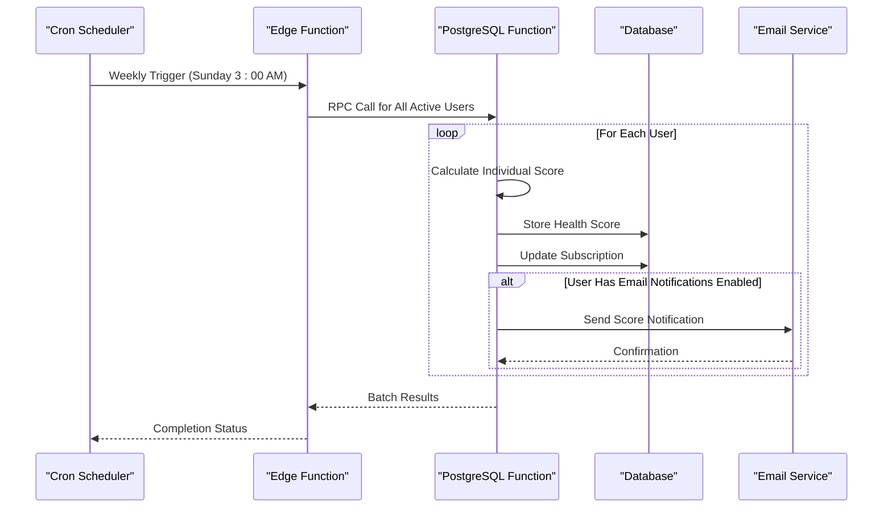
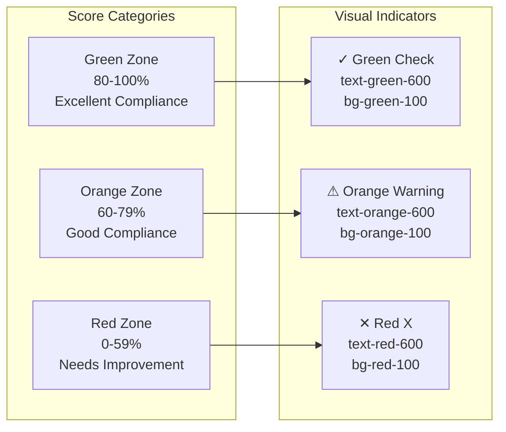

# Health Score Calculator

<cite>
**Referenced Files in This Document**
- [useHealthScore.ts](file://src/hooks/useHealthScore.ts)
- [index.ts](file://supabase/functions/calculate-health-score/index.ts)
- [advanced_retention_system.sql](file://supabase/migrations/20250223000004_advanced_retention_system.sql)
- [BodyProgressDashboard.tsx](file://src/pages/progress/BodyProgressDashboard.tsx)
</cite>

## Table of Contents
1. [Introduction](#introduction)
2. [System Architecture](#system-architecture)
3. [Core Components](#core-components)
4. [Scoring Algorithm](#scoring-algorithm)
5. [Data Sources and Integration](#data-sources-and-integration)
6. [Weight Assignment Methodology](#weight-assignment-methodology)
7. [Normalization and Percentile Systems](#normalization-and-percentile-systems)
8. [Real-time Updates and Automation](#real-time-updates-and-automation)
9. [Interpretation Guidelines](#interpretation-guidelines)
10. [Target Ranges and Recommendations](#target-ranges-and-recommendations)
11. [Performance Considerations](#performance-considerations)
12. [Troubleshooting Guide](#troubleshooting-guide)
13. [Conclusion](#conclusion)

## Introduction

The Health Score Calculator is a comprehensive wellness indicator system that aggregates multiple health metrics into a single, actionable score. This system transforms raw health data from various sources into meaningful insights about user compliance with their nutrition and wellness goals.

The calculator operates on a weekly basis, evaluating four primary health domains: macronutrient adherence, meal consistency, weight logging frequency, and protein accuracy. Each domain contributes differently to the overall health score, with weights assigned based on their relative importance to overall wellness outcomes.

## System Architecture

The Health Score Calculator follows a distributed architecture with clear separation of concerns across frontend, backend, and database layers:

**Diagram sources**
- [useHealthScore.ts:35-62](file://src/hooks/useHealthScore.ts#L35-L62)
- [index.ts:32-50](file://supabase/functions/calculate-health-score/index.ts#L32-L50)
- [advanced_retention_system.sql:594-746](file://supabase/migrations/20250223000004_advanced_retention_system.sql#L594-L746)

**Section sources**
- [useHealthScore.ts:1-246](file://src/hooks/useHealthScore.ts#L1-L246)
- [index.ts:1-229](file://supabase/functions/calculate-health-score/index.ts#L1-L229)
- [advanced_retention_system.sql:146-193](file://supabase/migrations/20250223000004_advanced_retention_system.sql#L146-L193)

## Core Components

### Frontend Health Score Management

The frontend implementation provides comprehensive hooks for managing health score data through React Query integration:

**Diagram sources**
- [useHealthScore.ts:5-32](file://src/hooks/useHealthScore.ts#L5-L32)
- [useHealthScore.ts:35-209](file://src/hooks/useHealthScore.ts#L35-L209)

### Backend Calculation Engine

The calculation engine consists of three main components working in harmony:

1. **Edge Function**: Handles external requests and manages user permissions
2. **PostgreSQL Function**: Performs the core mathematical calculations
3. **Audit System**: Maintains comprehensive logs of all score calculations

**Section sources**
- [useHealthScore.ts:89-149](file://src/hooks/useHealthScore.ts#L89-L149)
- [index.ts:32-218](file://supabase/functions/calculate-health-score/index.ts#L32-L218)
- [advanced_retention_system.sql:594-746](file://supabase/migrations/20250223000004_advanced_retention_system.sql#L594-L746)

## Scoring Algorithm

The Health Score Calculator employs a weighted composite scoring system that evaluates four critical health domains:

### Individual Component Calculations

Each component is calculated independently before being combined into the overall score:

**Diagram sources**
- [advanced_retention_system.sql:614-682](file://supabase/migrations/20250223000004_advanced_retention_system.sql#L614-L682)
- [advanced_retention_system.sql:730-744](file://supabase/migrations/20250223000004_advanced_retention_system.sql#L730-L744)

### Mathematical Implementation Details

The algorithm applies sophisticated normalization techniques to ensure fair comparison across different user profiles and measurement scales:

**Macronutrient Adherence Formula**:
- Calculates percentage difference between target and actual caloric intake
- Applies 100 minus the percentage difference for scoring
- Handles edge cases where target calories are zero

**Meal Consistency Formula**:
- Direct ratio calculation of actual meals to target meals
- Percentage-based scoring with 100% maximum threshold

**Weight Logging Formula**:
- Counts daily weight entries within the evaluation period
- Normalizes to 100% maximum regardless of frequency
- Ensures minimum participation requirement

**Protein Accuracy Formula**:
- Calculates average protein consumption from accepted meal plans
- Compares against individual target protein intake
- Uses absolute difference percentage with 50% baseline for insufficient data

**Section sources**
- [advanced_retention_system.sql:614-668](file://supabase/migrations/20250223000004_advanced_retention_system.sql#L614-L668)

## Data Sources and Integration

The Health Score Calculator integrates with multiple data sources to provide comprehensive health insights:

### Primary Data Sources

**Diagram sources**
- [advanced_retention_system.sql:106-177](file://supabase/migrations/20250223000004_advanced_retention_system.sql#L106-L177)
- [advanced_retention_system.sql:594-746](file://supabase/migrations/20250223000004_advanced_retention_system.sql#L594-L746)

### Integration Points

The system maintains real-time connectivity with various health data sources:

**Weekly Meal Plans Integration**:
- Pulls accepted meal plans for the evaluation period
- Tracks user adherence to planned meals
- Calculates consistency based on actual vs planned consumption

**Body Metrics Integration**:
- Integrates with wearable device data when available
- Processes weight, waist circumference, and body composition metrics
- Supports manual entry fallback for users without devices

**Profile Data Integration**:
- Retrieves individualized nutritional targets
- Adapts scoring criteria based on personal goals
- Supports customization for different dietary needs

**Section sources**
- [advanced_retention_system.sql:615-662](file://supabase/migrations/20250223000004_advanced_retention_system.sql#L615-L662)

## Weight Assignment Methodology

The weight assignment methodology reflects the relative importance of each health domain to overall wellness outcomes:

### Component Weight Distribution

| Component | Weight Percentage | Description |
|-----------|-------------------|-------------|
| Macronutrient Adherence | 40% | Primary focus on meeting caloric and macronutrient targets |
| Meal Consistency | 30% | Importance of maintaining regular eating patterns |
| Weight Logging | 20% | Value of consistent monitoring and feedback |
| Protein Accuracy | 10% | Significance of adequate protein intake |

### Weight Justification

The weight distribution prioritizes behaviors most critical to long-term health improvements:

**Higher Weights (40-30%)**:
- Focus on fundamental nutritional compliance
- Emphasis on establishing healthy eating patterns
- Recognition that consistent adherence drives meaningful change

**Medium Weight (20%)**:
- Encouragement of regular monitoring habits
- Balance between motivation and practicality
- Support for sustainable tracking behaviors

**Lower Weight (10%)**:
- Acknowledgment of protein as important but secondary factor
- Flexibility for individual variations in protein needs
- Prevention of excessive focus on single nutrient

### Dynamic Weight Adaptation

The system allows for potential weight adjustments based on:
- User progress and improvement patterns
- Seasonal or life stage variations
- Individual health conditions and goals
- Feedback from health coaching interventions

**Section sources**
- [useHealthScore.ts:239-245](file://src/hooks/useHealthScore.ts#L239-L245)
- [advanced_retention_system.sql:670-677](file://supabase/migrations/20250223000004_advanced_retention_system.sql#L670-L677)

## Normalization and Percentile Systems

The Health Score Calculator employs sophisticated normalization techniques to ensure fair and accurate scoring across diverse user populations:

### Normalization Strategies

### Component-Specific Normalization

**Macronutrient Adherence Normalization**:
- Percentage-based calculation: 100 - |actual - target| / target × 100
- Handles division by zero scenarios
- Caps maximum at 100% for perfect adherence

**Meal Consistency Normalization**:
- Direct ratio calculation: actual_meals / target_meals × 100
- Zero tolerance for undefined ratios
- Maximum 100% achievement threshold

**Weight Logging Normalization**:
- Frequency-based scoring: min(logs_per_day / 1, 100)
- Recognizes optimal daily logging frequency
- Prevents score inflation from excessive logging

**Protein Accuracy Normalization**:
- Percentage difference from target protein
- Provides 50% baseline when insufficient data exists
- Handles cases where both target and actual protein are zero

### Percentile Ranking System

The system incorporates percentile ranking to provide comparative context:

**Individual Progress Tracking**:
- Compares current score to historical performance
- Identifies improvement trends over time
- Highlights areas of consistent strength or weakness

**Peer Comparison Opportunities**:
- Enables benchmarking against similar user groups
- Supports community motivation and engagement
- Facilitates personalized goal setting

**Section sources**
- [advanced_retention_system.sql:619-668](file://supabase/migrations/20250223000004_advanced_retention_system.sql#L619-L668)

## Real-time Updates and Automation

The Health Score Calculator operates through a combination of automated scheduling and manual triggering mechanisms:

### Automated Calculation Pipeline

**Diagram sources**
- [index.ts:122-194](file://supabase/functions/calculate-health-score/index.ts#L122-L194)
- [advanced_retention_system.sql:683-728](file://supabase/migrations/20250223000004_advanced_retention_system.sql#L683-L728)

### Manual Calculation Triggers

Users can initiate score calculations through multiple interfaces:

**Dashboard Integration**:
- Real-time score refresh capability
- Immediate feedback on recent health data changes
- Interactive score exploration and trend analysis

**Mobile Application Support**:
- Push notifications for score availability
- Background sync with wearable device data
- Offline calculation capabilities with data synchronization

**Administrative Access**:
- System administrators can recalculate scores for troubleshooting
- Bulk calculation capabilities for user onboarding
- Override mechanisms for exceptional circumstances

### Data Synchronization Mechanisms

The system ensures data consistency across all integration points:

**Wearable Device Integration**:
- Direct API connections to popular fitness trackers
- Automatic data synchronization protocols
- Error handling for connectivity issues

**Manual Data Entry Support**:
- Web-based interfaces for manual health metric entry
- Mobile-optimized forms for on-the-go data capture
- Validation systems to ensure data quality

**Section sources**
- [index.ts:90-115](file://supabase/functions/calculate-health-score/index.ts#L90-L115)
- [BodyProgressDashboard.tsx:270-295](file://src/pages/progress/BodyProgressDashboard.tsx#L270-L295)

## Interpretation Guidelines

The Health Score Calculator provides comprehensive interpretation guidelines to help users understand their wellness indicators:

### Score Categories and Meanings

### Category-Specific Interpretations

**Green Zone (80-100%)**:
- Demonstrates excellent adherence to health goals
- Consistent pattern of positive health behaviors
- Strong foundation for continued wellness improvements
- Minimal intervention needed for maintenance

**Orange Zone (60-79%)**:
- Shows good progress toward health objectives
- Some variability in adherence patterns
- Ready for targeted improvements in weaker areas
- Opportunity for modest goal adjustments

**Red Zone (0-59%)**:
- Indicates significant opportunity for improvement
- Requires focused intervention and support
- May benefit from additional coaching resources
- Needs immediate attention to establish positive patterns

### Component-Level Interpretation

Each score category applies to individual components as well as the overall score, allowing for targeted improvement strategies:

**Macronutrient Adherence**:
- Green: Consistent meeting of caloric and macronutrient targets
- Orange: Occasional deviations from targets
- Red: Frequent failure to meet nutritional goals

**Meal Consistency**:
- Green: Regular, predictable eating patterns
- Orange: Some irregularities in meal timing
- Red: Irregular or inconsistent eating behaviors

**Weight Logging**:
- Green: Consistent daily monitoring
- Orange: Occasional missed measurements
- Red: Infrequent or irregular tracking

**Protein Accuracy**:
- Green: Adequate protein intake relative to targets
- Orange: Minor protein intake variations
- Red: Significant protein underconsumption

**Section sources**
- [useHealthScore.ts:211-237](file://src/hooks/useHealthScore.ts#L211-L237)
- [advanced_retention_system.sql:733-737](file://supabase/migrations/20250223000004_advanced_retention_system.sql#L733-L737)

## Target Ranges and Recommendations

The Health Score Calculator provides structured recommendations based on score categories and individual user needs:

### Target Range Specifications

| Category | Score Range | Target Focus Areas | Recommended Actions |
|----------|-------------|-------------------|-------------------|
| **Green** | 80-100% | Maintenance & Optimization | Sustain current behaviors, consider advanced goals |
| **Orange** | 60-79% | Consistency & Improvement | Address minor inconsistencies, set specific improvement goals |
| **Red** | 0-59% | Foundation & Habits | Establish basic tracking, focus on essential behaviors |

### Evidence-Based Recommendations

**Behavioral Change Framework**:
- **Stage 1 (Precontemplation)**: Raise awareness of health gaps
- **Stage 2 (Contemplation)**: Explore reasons for current patterns
- **Stage 3 (Preparation)**: Develop specific, achievable goals
- **Stage 4 (Action)**: Implement targeted interventions
- **Stage 5 (Maintenance)**: Sustain improvements long-term

**Personalized Intervention Strategies**:

**For Green Zone Users**:
- Focus on advanced nutrition optimization
- Introduce variety to prevent plateaus
- Set incremental improvement targets
- Explore performance-enhancing habits

**For Orange Zone Users**:
- Identify specific patterns of inconsistency
- Implement habit stacking techniques
- Establish supportive environmental cues
- Develop contingency plans for challenging situations

**For Red Zone Users**:
- Begin with smallest, most achievable changes
- Focus on building foundational habits
- Utilize external support systems
- Monitor progress closely for early wins

### Integration with Medical History

The system incorporates medical history considerations for personalized recommendations:

**Contraindications Assessment**:
- Review medical conditions affecting nutrition goals
- Consider medications impacting appetite or metabolism
- Account for dietary restrictions or allergies
- Evaluate physical limitations affecting activity levels

**Risk Stratification**:
- Low-risk individuals: More aggressive improvement targets
- Moderate-risk individuals: Balanced, sustainable approaches
- High-risk individuals: Conservative, monitored interventions

**Section sources**
- [advanced_retention_system.sql:730-744](file://supabase/migrations/20250223000004_advanced_retention_system.sql#L730-L744)

## Performance Considerations

The Health Score Calculator is designed for optimal performance across various operational scenarios:

### Database Optimization

**Index Strategy**:
- Composite indexes on frequently queried columns
- Proper indexing on date ranges for weekly calculations
- Optimized indexes for user-specific queries
- Efficient indexing for audit log queries

**Query Optimization**:
- Batch processing for multiple user calculations
- Efficient aggregation queries for score computations
- Minimized data transfer between layers
- Optimized joins for complex scoring calculations

### Scalability Features

**Horizontal Scaling**:
- Stateless edge function design
- Database-driven scaling capabilities
- Load balancing for high-volume calculations
- Caching strategies for frequently accessed data

**Memory Management**:
- Efficient data structures for score calculations
- Minimal memory footprint for batch operations
- Proper resource cleanup in calculation loops
- Optimized data serialization for API responses

### Monitoring and Alerting

**Performance Metrics**:
- Calculation duration tracking
- Database query performance monitoring
- API response time measurement
- Error rate and failure tracking

**Capacity Planning**:
- Predictive scaling based on user growth
- Resource utilization forecasting
- Backup and disaster recovery procedures
- Maintenance window scheduling

## Troubleshooting Guide

Common issues and their resolution strategies:

### Calculation Failures

**Symptoms**: Scores not updating, error messages during calculation
**Causes**: 
- Missing user profile data
- Database connectivity issues
- Insufficient health data for evaluation period
- Permission errors for user-specific calculations

**Resolutions**:
- Verify user profile completion
- Check database connection status
- Ensure adequate data collection for the week
- Confirm user permissions and admin access

### Data Integration Issues

**Symptoms**: Inconsistent scores, missing data in calculations
**Causes**:
- Wearable device connectivity problems
- Manual data entry errors
- Time zone synchronization issues
- Data format compatibility problems

**Resolutions**:
- Re-establish wearable device connections
- Validate manual data entry formats
- Configure proper time zone settings
- Update data format specifications

### Frontend Display Problems

**Symptoms**: Incorrect score display, missing visual indicators
**Causes**:
- Cache synchronization delays
- Color scheme rendering issues
- Responsive design problems
- Component state management failures

**Resolutions**:
- Clear browser cache and reload
- Check color scheme CSS classes
- Test responsive breakpoints
- Reset component state and reinitialize

**Section sources**
- [useHealthScore.ts:49-58](file://src/hooks/useHealthScore.ts#L49-L58)
- [index.ts:111-114](file://supabase/functions/calculate-health-score/index.ts#L111-L114)

## Conclusion

The Health Score Calculator represents a comprehensive approach to transforming health data into actionable insights. Through its sophisticated scoring algorithm, robust integration capabilities, and evidence-based interpretation framework, the system provides users with meaningful guidance for achieving their wellness goals.

The modular architecture ensures scalability and maintainability while the automated calculation pipeline delivers consistent, reliable results. The emphasis on behavioral change principles and personalized recommendations supports long-term success in health improvement journeys.

Future enhancements could include expanded integration with additional health data sources, more sophisticated machine learning algorithms for prediction and recommendation, and enhanced social features for community support and motivation.