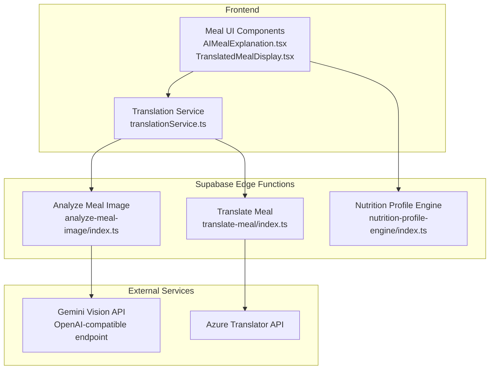
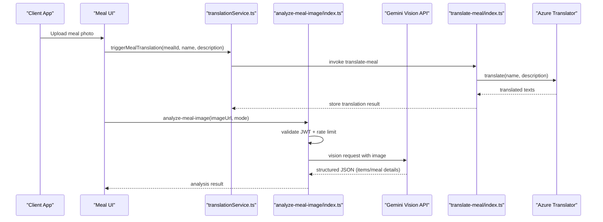
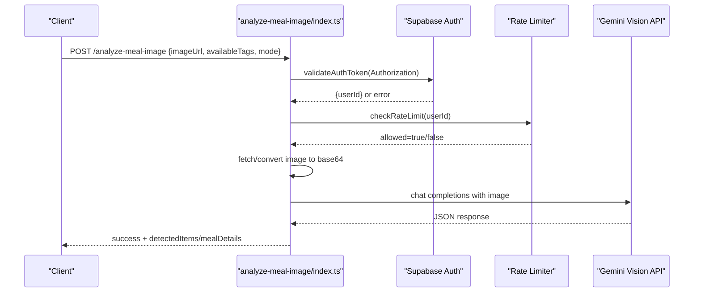
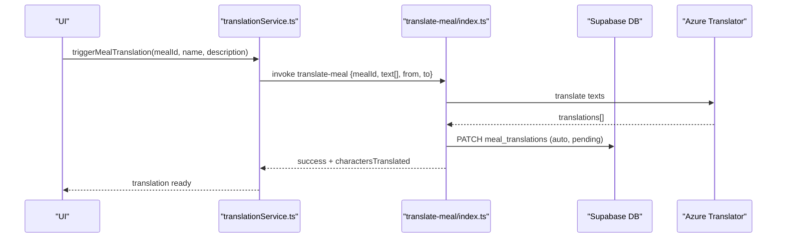
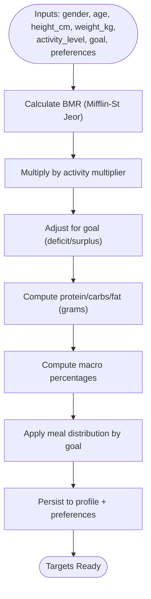
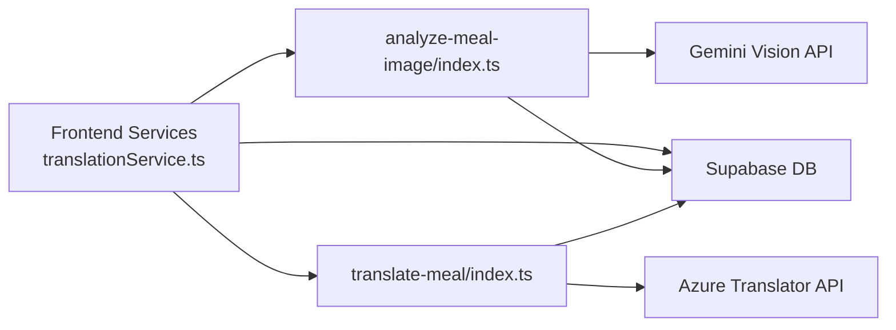

# Meal Analysis & Image Recognition

<cite>
**Referenced Files in This Document**
- [analyze-meal-image/index.ts](file://supabase/functions/analyze-meal-image/index.ts)
- [translate-meal/index.ts](file://supabase/functions/translate-meal/index.ts)
- [translationService.ts](file://src/services/translationService.ts)
- [nutrition-calculator.ts](file://src/lib/nutrition-calculator.ts)
- [nutrition-profile-engine/index.ts](file://supabase/functions/nutrition-profile-engine/index.ts)
- [AIMealExplanation.tsx](file://src/components/AIMealExplanation.tsx)
- [TranslatedMealDisplay.tsx](file://src/components/TranslatedMealDisplay.tsx)
</cite>

## Table of Contents
1. [Introduction](#introduction)
2. [Project Structure](#project-structure)
3. [Core Components](#core-components)
4. [Architecture Overview](#architecture-overview)
5. [Detailed Component Analysis](#detailed-component-analysis)
6. [Dependency Analysis](#dependency-analysis)
7. [Performance Considerations](#performance-considerations)
8. [Troubleshooting Guide](#troubleshooting-guide)
9. [Conclusion](#conclusion)

## Introduction
This document explains the automated meal analysis and image recognition capabilities that power nutrition insights and cultural adaptation for international users. It covers:
- How meal images are analyzed to extract ingredients and nutritional information
- How automated translations adapt meal content for Arabic-speaking users
- The integration with translation services and AI vision models
- The nutrition calculator and profile engine that personalize dietary targets
- Accuracy considerations, supported cuisines, and system limitations

## Project Structure
The meal analysis and translation pipeline spans frontend services, Supabase Edge Functions, and AI providers:
- Frontend services orchestrate translation and display
- Supabase Edge Functions implement image analysis and translation workflows
- AI vision model (gemini-2.5-flash via OpenAI-compatible API) performs image understanding
- Translation service integrates Azure Cognitive Services for Arabic localization
- Nutrition calculator and profile engine compute personalized targets

**Diagram sources**
- [translationService.ts:1-355](file://src/services/translationService.ts#L1-L355)
- [analyze-meal-image/index.ts:1-368](file://supabase/functions/analyze-meal-image/index.ts#L1-L368)
- [translate-meal/index.ts:1-279](file://supabase/functions/translate-meal/index.ts#L1-L279)
- [nutrition-profile-engine/index.ts:1-338](file://supabase/functions/nutrition-profile-engine/index.ts#L1-L338)
- [AIMealExplanation.tsx](file://src/components/AIMealExplanation.tsx)
- [TranslatedMealDisplay.tsx](file://src/components/TranslatedMealDisplay.tsx)

**Section sources**
- [translationService.ts:1-355](file://src/services/translationService.ts#L1-L355)
- [analyze-meal-image/index.ts:1-368](file://supabase/functions/analyze-meal-image/index.ts#L1-L368)
- [translate-meal/index.ts:1-279](file://supabase/functions/translate-meal/index.ts#L1-L279)
- [nutrition-profile-engine/index.ts:1-338](file://supabase/functions/nutrition-profile-engine/index.ts#L1-L338)

## Core Components
- Image analysis function: Authenticates, rate-limits, fetches images, sends them to a vision model, parses structured JSON, and returns either quick scan items or detailed meal attributes.
- Translation function: Uses Azure Translator to localize meal names and descriptions, stores results in the database, and exposes review workflows.
- Translation service: Provides user language preferences, batch translation retrieval, translation triggers, and formatting helpers for UI.
- Nutrition calculator: Implements BMR/TDEE calculations and macro distribution for goals (lose/gain/maintain).
- Nutrition profile engine: Computes personalized nutrition targets and persists them to user profiles.

**Section sources**
- [analyze-meal-image/index.ts:143-344](file://supabase/functions/analyze-meal-image/index.ts#L143-L344)
- [translate-meal/index.ts:155-262](file://supabase/functions/translate-meal/index.ts#L155-L262)
- [translationService.ts:85-130](file://src/services/translationService.ts#L85-L130)
- [nutrition-calculator.ts:68-103](file://src/lib/nutrition-calculator.ts#L68-L103)
- [nutrition-profile-engine/index.ts:177-197](file://supabase/functions/nutrition-profile-engine/index.ts#L177-L197)

## Architecture Overview
The system integrates three major workflows:
- Automated meal analysis: Image ingestion → JWT validation → rate limiting → image fetch/encoding → vision model call → JSON parsing → response
- Automated translation: Trigger → Azure translation → database storage → review status
- Personalized nutrition: User inputs → profile engine → persisted targets → UI consumption

**Diagram sources**
- [translationService.ts:158-190](file://src/services/translationService.ts#L158-L190)
- [translate-meal/index.ts:155-262](file://supabase/functions/translate-meal/index.ts#L155-L262)
- [analyze-meal-image/index.ts:143-344](file://supabase/functions/analyze-meal-image/index.ts#L143-L344)

## Detailed Component Analysis

### Image Analysis Workflow
The analyze-meal-image function validates JWT tokens, enforces rate limits, accepts either data URIs or remote URLs, converts images to base64, and queries a vision model via an OpenAI-compatible endpoint. It supports two modes:
- Quick scan: returns detected items with estimated nutrients
- Detailed: returns a full meal profile including name, description, calories, macronutrients, fiber, prep time, suggested price, and diet tags

**Diagram sources**
- [analyze-meal-image/index.ts:13-55](file://supabase/functions/analyze-meal-image/index.ts#L13-L55)
- [analyze-meal-image/index.ts:105-141](file://supabase/functions/analyze-meal-image/index.ts#L105-L141)
- [analyze-meal-image/index.ts:194-344](file://supabase/functions/analyze-meal-image/index.ts#L194-L344)

**Section sources**
- [analyze-meal-image/index.ts:143-344](file://supabase/functions/analyze-meal-image/index.ts#L143-L344)

### Translation Pipeline
The translate-meal function orchestrates Azure Translator API calls, stores results in the database, and exposes review workflows. The frontend translation service coordinates user language preferences, batch retrieval, and translation triggers.

**Diagram sources**
- [translationService.ts:158-190](file://src/services/translationService.ts#L158-L190)
- [translate-meal/index.ts:155-262](file://supabase/functions/translate-meal/index.ts#L155-L262)

**Section sources**
- [translate-meal/index.ts:155-262](file://supabase/functions/translate-meal/index.ts#L155-L262)
- [translationService.ts:85-130](file://src/services/translationService.ts#L85-L130)

### Nutrition Calculator and Profile Engine
The nutrition calculator computes BMR, TDEE, and macro targets based on gender, age, height, weight, activity level, and goal. The nutrition profile engine extends this by validating inputs, computing personalized targets, and persisting them to user profiles with optional preference storage.

**Diagram sources**
- [nutrition-calculator.ts:6-88](file://src/lib/nutrition-calculator.ts#L6-L88)
- [nutrition-profile-engine/index.ts:177-197](file://supabase/functions/nutrition-profile-engine/index.ts#L177-L197)

**Section sources**
- [nutrition-calculator.ts:68-103](file://src/lib/nutrition-calculator.ts#L68-L103)
- [nutrition-profile-engine/index.ts:177-197](file://supabase/functions/nutrition-profile-engine/index.ts#L177-L197)

### UI Components for AI-Generated Explanations and Translated Meals
- AIMealExplanation: Renders AI-generated explanations for meals, integrating with analysis results.
- TranslatedMealDisplay: Renders localized meal content, indicating translation status and auto vs manual edits.

**Section sources**
- [AIMealExplanation.tsx](file://src/components/AIMealExplanation.tsx)
- [TranslatedMealDisplay.tsx](file://src/components/TranslatedMealDisplay.tsx)

## Dependency Analysis
- Frontend depends on Supabase Edge Functions for AI analysis and translation.
- Edge Functions depend on external AI and translation APIs.
- Database tables store translation records and user nutrition profiles.
- Environment variables secure API keys and endpoints.

**Diagram sources**
- [translationService.ts:158-190](file://src/services/translationService.ts#L158-L190)
- [analyze-meal-image/index.ts:204-281](file://supabase/functions/analyze-meal-image/index.ts#L204-L281)
- [translate-meal/index.ts:6-8](file://supabase/functions/translate-meal/index.ts#L6-L8)

**Section sources**
- [translationService.ts:158-190](file://src/services/translationService.ts#L158-L190)
- [analyze-meal-image/index.ts:204-281](file://supabase/functions/analyze-meal-image/index.ts#L204-L281)
- [translate-meal/index.ts:6-8](file://supabase/functions/translate-meal/index.ts#L6-L8)

## Performance Considerations
- Vision model latency: Network-bound; optimize by reducing image size and ensuring fast CDN delivery of remote images.
- Rate limiting: Per-partner hourly caps prevent abuse; batch operations and caching can reduce repeated calls.
- Translation costs: Azure Translator charges per character; batch multiple texts to minimize cost and latency.
- Database writes: Prefer upserts and minimal updates to reduce write amplification.

## Troubleshooting Guide
Common issues and remedies:
- Authentication failures: Verify Authorization header and token validity; check logs for failed auth attempts.
- Rate limit exceeded: Implement exponential backoff and queueing; inform users of reset timing.
- Vision API errors: Validate image URLs/data URIs; ensure content-type is set; retry with smaller images.
- Translation failures: Confirm Azure credentials and endpoint; check response bodies for detailed errors.
- JSON parsing errors: Expect markdown-wrapped JSON; sanitize content before parsing.

**Section sources**
- [analyze-meal-image/index.ts:152-192](file://supabase/functions/analyze-meal-image/index.ts#L152-L192)
- [analyze-meal-image/index.ts:277-336](file://supabase/functions/analyze-meal-image/index.ts#L277-L336)
- [translate-meal/index.ts:166-175](file://supabase/functions/translate-meal/index.ts#L166-L175)

## Conclusion
The meal analysis and translation system combines robust image understanding, automated localization, and personalized nutrition computation to deliver a culturally adapted, data-driven dining experience. While the current implementation focuses on English-to-Arabic translation and a Gemini-based vision model, the modular architecture supports extension to additional languages and cuisines, and can integrate alternative AI models and translation providers.