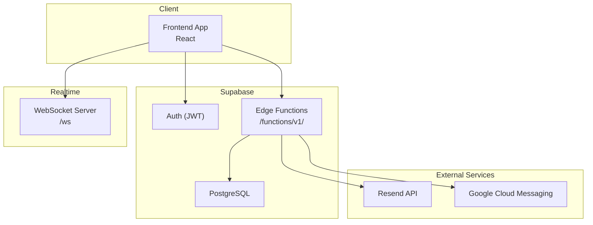
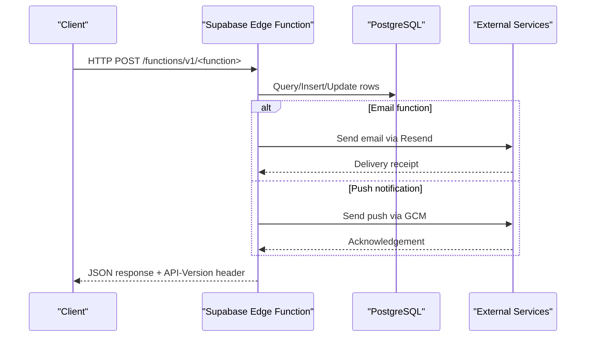
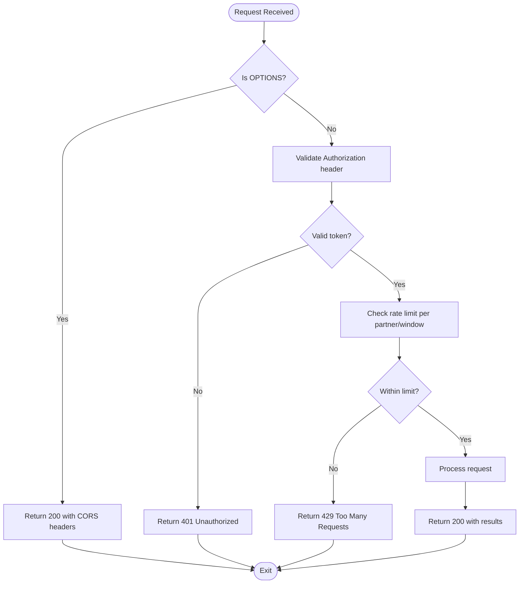
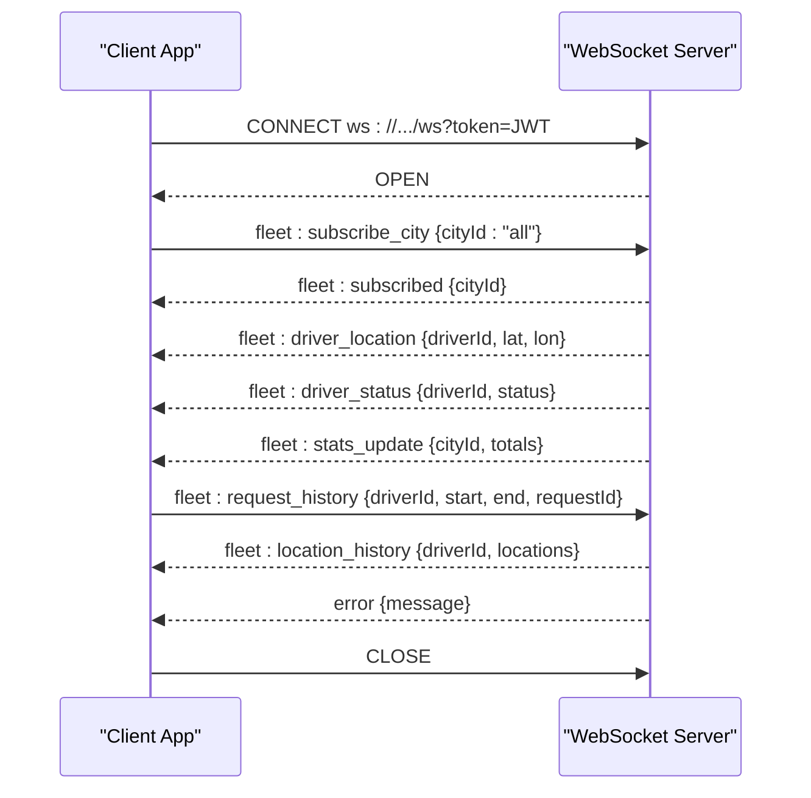
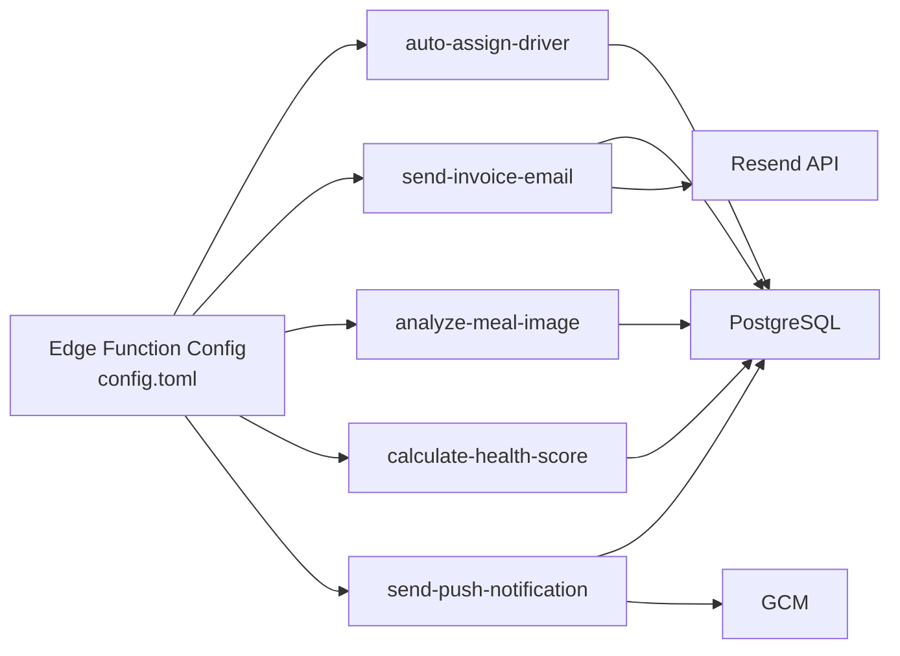

# API Reference

<cite>
**Referenced Files in This Document**
- [config.toml](file://supabase/config.toml)
- [PHASE2_EDGE_FUNCTIONS.md](file://supabase/functions/PHASE2_EDGE_FUNCTIONS.md)
- [index.ts](file://supabase/functions/analyze-meal-image/index.ts)
- [index.ts](file://supabase/functions/calculate-health-score/index.ts)
- [index.ts](file://supabase/functions/send-push-notification/index.ts)
- [index.ts](file://supabase/functions/zhipu-test/index.ts)
- [20260226000006_rate_limiting_enforcement.sql](file://supabase/migrations/20260226000006_rate_limiting_enforcement.sql)
- [20260226000002_secure_api_credentials.sql](file://supabase/migrations/20260226000002_secure_api_credentials.sql)
- [client.ts](file://src/integrations/supabase/client.ts)
- [trackingSocket.ts](file://src/fleet/services/trackingSocket.ts)
- [realtime.spec.ts](file://e2e/system/realtime.spec.ts)
- [server.ts](file://src/test/server.ts)
- [fleet-management-portal-design.md](file://docs/fleet-management-portal-design.md)
</cite>

## Table of Contents
1. [Introduction](#introduction)
2. [Project Structure](#project-structure)
3. [Core Components](#core-components)
4. [Architecture Overview](#architecture-overview)
5. [Detailed Component Analysis](#detailed-component-analysis)
6. [Dependency Analysis](#dependency-analysis)
7. [Performance Considerations](#performance-considerations)
8. [Troubleshooting Guide](#troubleshooting-guide)
9. [Conclusion](#conclusion)
10. [Appendices](#appendices)

## Introduction
This document provides a comprehensive API reference for the Nutrio platform’s Supabase Edge Functions and WebSocket real-time infrastructure. It covers HTTP endpoints, request/response schemas, authentication, rate limiting, CORS, error handling, and client-side integration patterns. It also documents the WebSocket connection lifecycle, message formats, and real-time event types used by the fleet tracking portal.

## Project Structure
The API surface spans Supabase Edge Functions, Supabase Auth/DB, and a dedicated WebSocket server for fleet tracking. Edge Functions are configured in Supabase with per-function JWT verification toggles. The frontend integrates with Supabase client libraries and connects to a WebSocket server for live updates.

**Diagram sources**
- [client.ts:47-57](file://src/integrations/supabase/client.ts#L47-L57)
- [config.toml:1-59](file://supabase/config.toml#L1-L59)
- [PHASE2_EDGE_FUNCTIONS.md:224-254](file://supabase/functions/PHASE2_EDGE_FUNCTIONS.md#L224-L254)

**Section sources**
- [client.ts:47-57](file://src/integrations/supabase/client.ts#L47-L57)
- [config.toml:1-59](file://supabase/config.toml#L1-L59)

## Core Components
- Supabase Edge Functions: HTTP-triggered functions invoked via HTTPS or Supabase client SDK.
- Supabase Auth: JWT-based authentication for clients and function invocation.
- Supabase Database: Postgres-backed storage with row-level security and rate-limiting policies.
- WebSocket Server: Real-time transport for fleet tracking events.
- CORS and Versioning: Cross-origin headers and API version header for Edge Functions.

**Section sources**
- [PHASE2_EDGE_FUNCTIONS.md:224-254](file://supabase/functions/PHASE2_EDGE_FUNCTIONS.md#L224-L254)
- [config.toml:1-59](file://supabase/config.toml#L1-L59)
- [trackingSocket.ts:1-287](file://src/fleet/services/trackingSocket.ts#L1-L287)

## Architecture Overview
The platform exposes two primary API surfaces:
- REST API via Supabase Edge Functions under /functions/v1/.
- Real-time API via WebSocket server for fleet tracking.

**Diagram sources**
- [PHASE2_EDGE_FUNCTIONS.md:224-254](file://supabase/functions/PHASE2_EDGE_FUNCTIONS.md#L224-L254)
- [index.ts:48-68](file://supabase/functions/send-push-notification/index.ts#L48-L68)

## Detailed Component Analysis

### Supabase Edge Functions: Invocation and Authentication
- Base URL: https://<project>.supabase.co/functions/v1/<function-name>
- Authentication: Authorization: Bearer <anon-key> or JWT depending on function configuration.
- CORS: Functions return Access-Control-Allow-* headers for cross-origin requests.
- Versioning: All Edge Function responses include API-Version and Deprecation headers.

Common invocation patterns:
- Using Supabase client SDK invoke().
- Using fetch with Authorization header.

**Section sources**
- [PHASE2_EDGE_FUNCTIONS.md:224-254](file://supabase/functions/PHASE2_EDGE_FUNCTIONS.md#L224-L254)
- [config.toml:1-59](file://supabase/config.toml#L1-L59)

### Edge Function: auto-assign-driver
- Purpose: Assigns the best driver to a delivery order based on proximity, capacity, rating, and experience.
- Method: POST
- Path: /functions/v1/auto-assign-driver
- Auth: Bearer <anon-key> or valid JWT
- Input:
  - deliveryId (UUID) or orderId (UUID, legacy)
- Output (success):
  - success: boolean
  - driverId: UUID
  - score: number
  - message: string
- Output (no drivers available):
  - success: false
  - message: string
  - queued: true
- Output (error):
  - error: string
  - details: string

Testing:
- curl with Authorization header and JSON body containing deliveryId.

**Section sources**
- [PHASE2_EDGE_FUNCTIONS.md:34-103](file://supabase/functions/PHASE2_EDGE_FUNCTIONS.md#L34-L103)

### Edge Function: send-invoice-email
- Purpose: Generates and sends invoices upon payment completion.
- Method: POST
- Path: /functions/v1/send-invoice-email
- Auth: Bearer <anon-key> or valid JWT
- Input:
  - paymentId (UUID)
- Output (success):
  - success: boolean
  - message: string
  - emailId: string
  - invoiceNumber: string
- Output (payment pending):
  - success: false
  - message: string
- Output (already sent):
  - success: true
  - message: string
- Database tables used: payments, invoices, profiles, email_logs
- Email template features: branded layout, invoice number format, payment details, amount in QAR, footer links.

Testing:
- curl with Authorization header and JSON body containing paymentId.

**Section sources**
- [PHASE2_EDGE_FUNCTIONS.md:106-171](file://supabase/functions/PHASE2_EDGE_FUNCTIONS.md#L106-L171)

### Edge Function: analyze-meal-image
- Purpose: Image analysis endpoint with per-partner rate limiting and request counting.
- Method: POST
- Path: /functions/v1/analyze-meal-image
- Auth: Bearer <anon-key> or valid JWT
- Input:
  - Partner-specific payload (validated by function)
- Output:
  - Success response with analysis results
  - Per-window rate limit metadata (allowed, remaining, resetAt)
- CORS: Access-Control-Allow-Origin: *
- Rate limiting:
  - Counts successful requests per partner within a rolling window.
  - On error, allows requests to avoid blocking legitimate users.

Validation and rate limit logic flow:

**Diagram sources**
- [index.ts:143-151](file://supabase/functions/analyze-meal-image/index.ts#L143-L151)
- [index.ts:113-141](file://supabase/functions/analyze-meal-image/index.ts#L113-L141)

**Section sources**
- [index.ts:1-39](file://supabase/functions/analyze-meal-image/index.ts#L1-L39)
- [index.ts:113-151](file://supabase/functions/analyze-meal-image/index.ts#L113-L151)

### Edge Function: calculate-health-score
- Purpose: Computes health scores with robust error handling.
- Method: POST
- Path: /functions/v1/calculate-health-score
- Auth: Bearer <anon-key> or valid JWT
- Input:
  - Health metrics payload
- Output:
  - Success response with computed scores
  - Error response with details on failure
- Error handling:
  - Returns 500 with structured error payload on exceptions.

**Section sources**
- [index.ts:206-218](file://supabase/functions/calculate-health-score/index.ts#L206-L218)

### Edge Function: send-push-notification
- Purpose: Sends push notifications via Google Cloud Messaging using a service account.
- Method: POST
- Path: /functions/v1/send-push-notification
- Auth: Bearer <anon-key> or valid JWT
- Input:
  - Target device token and message payload
- Output:
  - Success response with acknowledgment
  - Error response on failure
- Authentication flow:
  - Generates short-lived Google OAuth2 access token from service account JSON stored as a Supabase secret.

**Section sources**
- [index.ts:48-68](file://supabase/functions/send-push-notification/index.ts#L48-L68)

### Edge Function: zhipu-test
- Purpose: Example function proxying to an external API with unified error handling.
- Method: POST
- Path: /functions/v1/zhipu-test
- Auth: Bearer <anon-key> or valid JWT
- Input:
  - Arbitrary payload forwarded to external service
- Output:
  - Success response with status and response text
  - 500 error response on failure

**Section sources**
- [index.ts:42-57](file://supabase/functions/zhipu-test/index.ts#L42-L57)

### Supabase Auth and Client Integration
- Supabase client initialization sets up storage, persistence, and token refresh.
- Frontend stores tokens in Capacitor Preferences for native apps or localStorage for web.
- Auth flow: user signs in, receives JWT, which is persisted and used for authenticated requests.

**Section sources**
- [client.ts:36-57](file://src/integrations/supabase/client.ts#L36-L57)

### WebSocket: Fleet Tracking
- Transport: Native WebSocket with token passed as query parameter.
- URL: ws(s)://<host>:<port>/ws?token=<jwt>
- Events:
  - fleet:driver_location
  - fleet:driver_status
  - fleet:stats_update
  - fleet:subscribed
  - error
- Client behavior:
  - Connects on demand, subscribes to cities based on role/assignment.
  - Retries with exponential backoff.
  - Queues messages until connected.
  - Supports request/response pattern for historical location queries.

**Diagram sources**
- [trackingSocket.ts:34-95](file://src/fleet/services/trackingSocket.ts#L34-L95)
- [trackingSocket.ts:97-132](file://src/fleet/services/trackingSocket.ts#L97-L132)
- [trackingSocket.ts:228-269](file://src/fleet/services/trackingSocket.ts#L228-L269)

**Section sources**
- [trackingSocket.ts:1-287](file://src/fleet/services/trackingSocket.ts#L1-L287)

## Dependency Analysis
- Edge Functions depend on Supabase client libraries and environment variables for external services.
- Functions share common CORS headers and JWT verification toggles per function.
- Database migrations define rate limiting, API credential security, and policy constraints.

**Diagram sources**
- [config.toml:1-59](file://supabase/config.toml#L1-L59)
- [PHASE2_EDGE_FUNCTIONS.md:106-171](file://supabase/functions/PHASE2_EDGE_FUNCTIONS.md#L106-L171)

**Section sources**
- [config.toml:1-59](file://supabase/config.toml#L1-L59)
- [20260226000006_rate_limiting_enforcement.sql:1-359](file://supabase/migrations/20260226000006_rate_limiting_enforcement.sql#L1-L359)
- [20260226000002_secure_api_credentials.sql:115-157](file://supabase/migrations/20260226000002_secure_api_credentials.sql#L115-L157)

## Performance Considerations
- Edge Functions are cold-started on first request; keep warm by periodic pings if latency-sensitive.
- Use batch operations where possible to reduce round-trips.
- Prefer native WebSocket for low-latency updates; avoid polling.
- Monitor function logs and database query performance via Supabase CLI.

[No sources needed since this section provides general guidance]

## Troubleshooting Guide
- Edge Function deployment failures:
  - Ensure Supabase CLI is up to date and logged in.
  - Verify environment variables are set and named correctly.
- Database connection errors:
  - Confirm SUPABASE_URL and service role key validity.
  - Check RLS policies permit service role access.
- Email delivery issues:
  - Validate RESEND_API_KEY and recipient address.
  - Inspect email_logs for detailed errors.
- WebSocket connection issues:
  - Verify token query parameter and server URL.
  - Check reconnection logs and exponential backoff behavior.
- Rate limiting:
  - Review rate_limit.config and rate_limit.tracking tables.
  - Adjust windows and thresholds as needed.

**Section sources**
- [PHASE2_EDGE_FUNCTIONS.md:380-401](file://supabase/functions/PHASE2_EDGE_FUNCTIONS.md#L380-L401)
- [20260226000006_rate_limiting_enforcement.sql:1-359](file://supabase/migrations/20260226000006_rate_limiting_enforcement.sql#L1-L359)

## Conclusion
The Nutrio platform exposes a secure, versioned REST API via Supabase Edge Functions and a real-time WebSocket API for fleet tracking. Edge Functions implement CORS, JWT verification toggles, and robust error handling. Database migrations enforce rate limits and secure API credentials. The WebSocket service supports role-based subscriptions and resilient message delivery.

[No sources needed since this section summarizes without analyzing specific files]

## Appendices

### API Versioning
- Header: API-Version: v1
- Backward compatibility enforced; breaking changes use new URL path prefixes.
- Clients should verify API-Version header and handle deprecation notices.

**Section sources**
- [PHASE2_EDGE_FUNCTIONS.md:336-372](file://supabase/functions/PHASE2_EDGE_FUNCTIONS.md#L336-L372)

### CORS Configuration
- Functions return Access-Control-Allow-Origin: * and allow-listed headers.
- Apply to all Edge Functions to enable browser-based client access.

**Section sources**
- [index.ts:4-7](file://supabase/functions/analyze-meal-image/index.ts#L4-L7)
- [index.ts:42-57](file://supabase/functions/zhipu-test/index.ts#L42-L57)

### Rate Limiting Policies
- Database-level rate limiting with configurable windows and blocks.
- Examples include auth_login, api_general, order_create, and others.
- Monitoring via rate_limit.tracking and rate_limit.violations tables.

**Section sources**
- [20260226000006_rate_limiting_enforcement.sql:1-359](file://supabase/migrations/20260226000006_rate_limiting_enforcement.sql#L1-L359)

### Error Codes (Fleet Portal)
- Standardized error codes for authentication, city access, drivers, vehicles, payouts, documents, and system errors.
- Useful for client-side error handling and user feedback.

**Section sources**
- [fleet-management-portal-design.md:2824-2861](file://docs/fleet-management-portal-design.md#L2824-L2861)

### Client Integration Examples
- Supabase client SDK invoke() for Edge Functions.
- fetch() with Authorization header for direct HTTP calls.
- WebSocket client with token query parameter and event-driven handlers.

**Section sources**
- [PHASE2_EDGE_FUNCTIONS.md:224-254](file://supabase/functions/PHASE2_EDGE_FUNCTIONS.md#L224-L254)
- [trackingSocket.ts:34-95](file://src/fleet/services/trackingSocket.ts#L34-L95)

### End-to-End Realtime Coverage
- E2E tests validate WebSocket connection and status update scenarios.

**Section sources**
- [realtime.spec.ts:1-37](file://e2e/system/realtime.spec.ts#L1-L37)