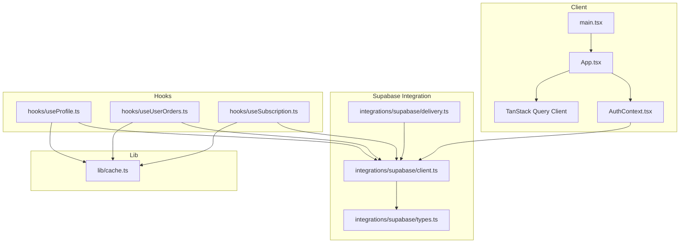
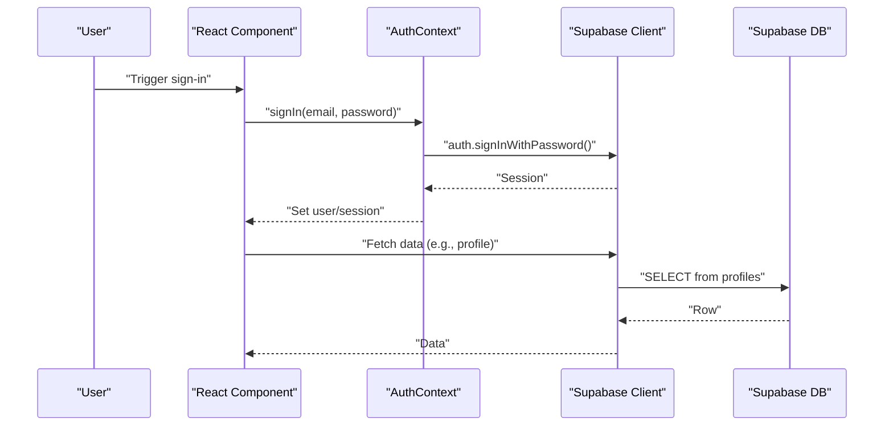
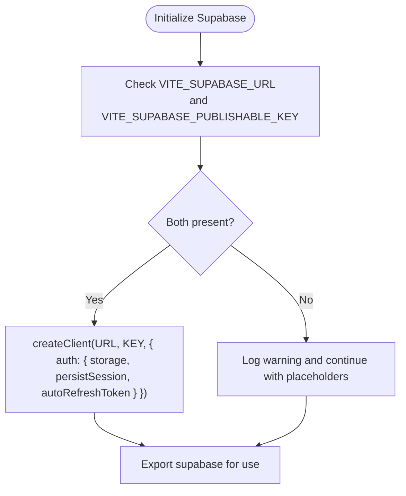
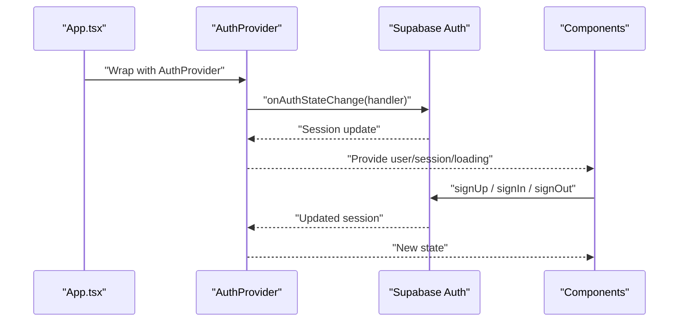
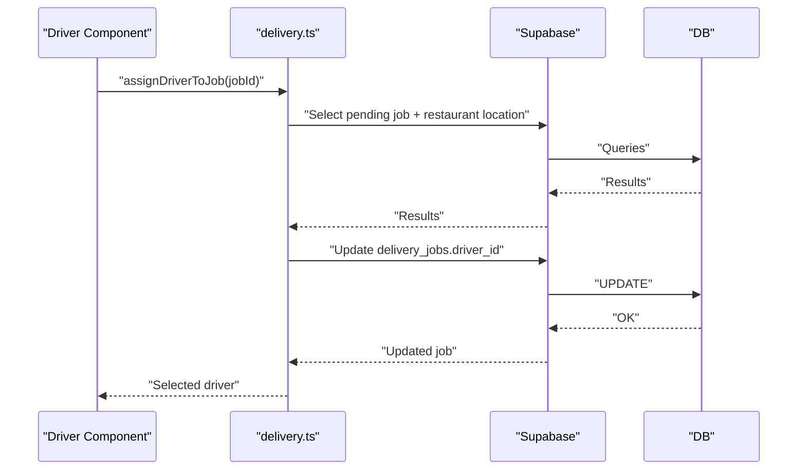
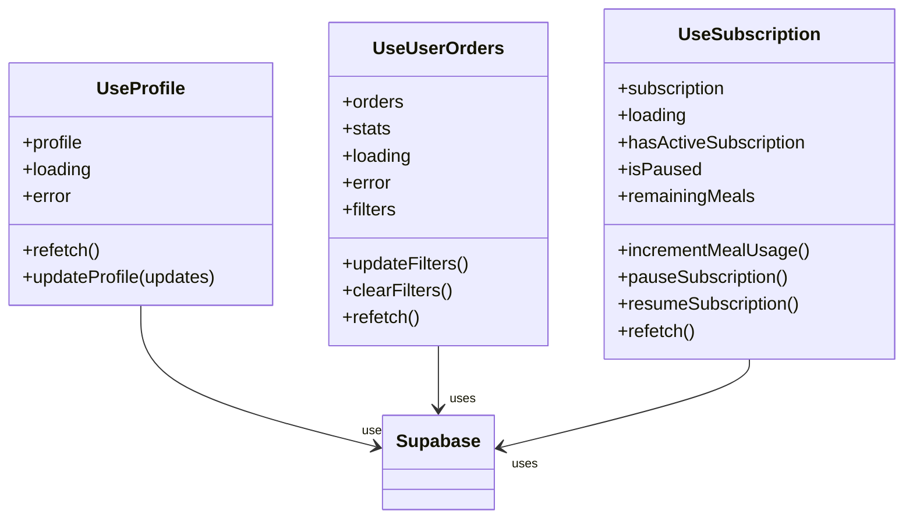
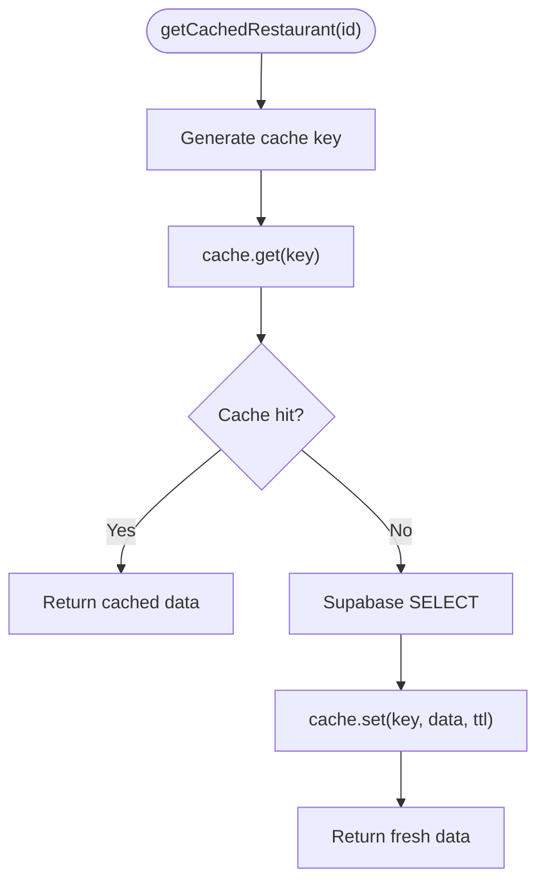
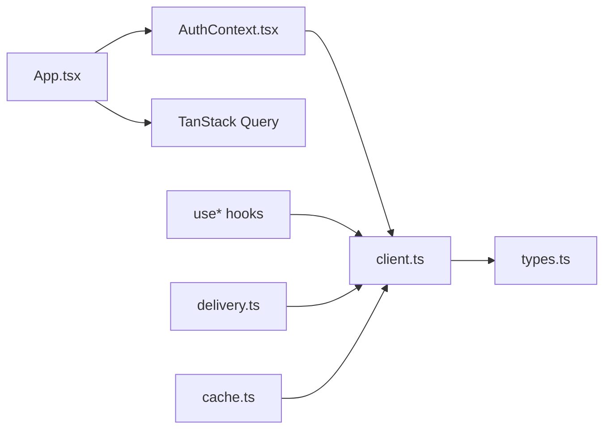

# Client Integration

<cite>
**Referenced Files in This Document**
- [client.ts](file://src/integrations/supabase/client.ts)
- [types.ts](file://src/integrations/supabase/types.ts)
- [delivery.ts](file://src/integrations/supabase/delivery.ts)
- [AuthContext.tsx](file://src/contexts/AuthContext.tsx)
- [cache.ts](file://src/lib/cache.ts)
- [App.tsx](file://src/App.tsx)
- [main.tsx](file://src/main.tsx)
- [useProfile.ts](file://src/hooks/useProfile.ts)
- [useUserOrders.ts](file://src/hooks/useUserOrders.ts)
- [useSubscription.ts](file://src/hooks/useSubscription.ts)
</cite>

## Table of Contents
1. [Introduction](#introduction)
2. [Project Structure](#project-structure)
3. [Core Components](#core-components)
4. [Architecture Overview](#architecture-overview)
5. [Detailed Component Analysis](#detailed-component-analysis)
6. [Dependency Analysis](#dependency-analysis)
7. [Performance Considerations](#performance-considerations)
8. [Troubleshooting Guide](#troubleshooting-guide)
9. [Conclusion](#conclusion)
10. [Appendices](#appendices)

## Introduction
This document explains the client-side API integration for the Nutrio frontend, focusing on Supabase configuration, authentication, data access patterns, service-layer abstractions, hook-based data fetching, state management integration, caching, error handling, loading states, real-time updates, and role-based access control. It also covers API wrapper functions, authentication flows, session management, and practical examples of consuming APIs in React components, form submissions, real-time updates, and offline resilience strategies.

## Project Structure
The client integrates Supabase via a dedicated client module, exposes typed database interfaces, and organizes API wrappers for domain-specific features (such as delivery). Authentication state is centralized in a React context provider, while data fetching is encapsulated in custom hooks. Global providers include TanStack Query for caching and state synchronization, and analytics/auth providers for cross-cutting concerns.

**Diagram sources**
- [main.tsx:1-50](file://src/main.tsx#L1-L50)
- [App.tsx:137-150](file://src/App.tsx#L137-L150)
- [AuthContext.tsx:31-61](file://src/contexts/AuthContext.tsx#L31-L61)
- [client.ts:47-57](file://src/integrations/supabase/client.ts#L47-L57)
- [types.ts:9-14](file://src/integrations/supabase/types.ts#L9-L14)
- [delivery.ts:4-5](file://src/integrations/supabase/delivery.ts#L4-L5)
- [useProfile.ts:33-87](file://src/hooks/useProfile.ts#L33-L87)
- [useUserOrders.ts:43-161](file://src/hooks/useUserOrders.ts#L43-L161)
- [useSubscription.ts:42-263](file://src/hooks/useSubscription.ts#L42-L263)
- [cache.ts:16-107](file://src/lib/cache.ts#L16-L107)

**Section sources**
- [main.tsx:1-50](file://src/main.tsx#L1-L50)
- [App.tsx:137-150](file://src/App.tsx#L137-L150)
- [client.ts:47-57](file://src/integrations/supabase/client.ts#L47-L57)

## Core Components
- Supabase client initialization with Capacitor-native storage adapter and persisted auth sessions.
- Typed Supabase client leveraging generated types for strong typing.
- Delivery system API wrappers for driver lifecycle, job assignment, and real-time tracking.
- Authentication context managing session state, sign-up/sign-in flows, and IP-based checks.
- Hook-based data access for profile, orders, and subscription with caching and real-time updates.
- Centralized caching layer with in-memory fallback and cache key generation.

**Section sources**
- [client.ts:18-57](file://src/integrations/supabase/client.ts#L18-L57)
- [types.ts:9-14](file://src/integrations/supabase/types.ts#L9-L14)
- [delivery.ts:11-82](file://src/integrations/supabase/delivery.ts#L11-L82)
- [AuthContext.tsx:31-130](file://src/contexts/AuthContext.tsx#L31-L130)
- [useProfile.ts:33-87](file://src/hooks/useProfile.ts#L33-L87)
- [useUserOrders.ts:43-161](file://src/hooks/useUserOrders.ts#L43-L161)
- [useSubscription.ts:42-263](file://src/hooks/useSubscription.ts#L42-L263)
- [cache.ts:16-199](file://src/lib/cache.ts#L16-L199)

## Architecture Overview
The frontend composes global providers, a Supabase client, and domain-specific API wrappers. Hooks encapsulate data fetching, caching, and real-time subscriptions. Authentication state drives protected routing and role-based access control.

**Diagram sources**
- [AuthContext.tsx:87-112](file://src/contexts/AuthContext.tsx#L87-L112)
- [useProfile.ts:39-61](file://src/hooks/useProfile.ts#L39-L61)

## Detailed Component Analysis

### Supabase Client Configuration
- Environment-driven configuration with guards to avoid runtime crashes when environment variables are missing.
- Capacitor-native storage adapter ensures sessions persist across app restarts on native platforms.
- Auth persistence and automatic token refresh are enabled for seamless user experience.

**Diagram sources**
- [client.ts:7-16](file://src/integrations/supabase/client.ts#L7-L16)
- [client.ts:47-57](file://src/integrations/supabase/client.ts#L47-L57)

**Section sources**
- [client.ts:7-16](file://src/integrations/supabase/client.ts#L7-L16)
- [client.ts:18-57](file://src/integrations/supabase/client.ts#L18-L57)

### Authentication Integration
- Auth provider subscribes to Supabase auth state changes and initializes push notifications on native platforms.
- Sign-up includes optional full name and redirects to the dashboard after confirmation.
- Sign-in optionally blocks users from blocked IP addresses and handles failures gracefully.
- Session timeout manager and protected routes enforce role-based access control.

**Diagram sources**
- [App.tsx:144-149](file://src/App.tsx#L144-L149)
- [AuthContext.tsx:36-61](file://src/contexts/AuthContext.tsx#L36-L61)
- [AuthContext.tsx:63-118](file://src/contexts/AuthContext.tsx#L63-L118)

**Section sources**
- [AuthContext.tsx:31-130](file://src/contexts/AuthContext.tsx#L31-L130)
- [App.tsx:144-149](file://src/App.tsx#L144-L149)

### Data Access Patterns and Service Layer
- Delivery system API wrappers encapsulate driver actions, job assignment, and real-time subscriptions.
- Functions return typed data or throw errors for robust error handling.
- Real-time channels subscribe to updates for delivery jobs and driver locations.

**Diagram sources**
- [delivery.ts:174-235](file://src/integrations/supabase/delivery.ts#L174-L235)

**Section sources**
- [delivery.ts:11-82](file://src/integrations/supabase/delivery.ts#L11-L82)
- [delivery.ts:174-235](file://src/integrations/supabase/delivery.ts#L174-L235)
- [delivery.ts:695-734](file://src/integrations/supabase/delivery.ts#L695-L734)

### Hook-Based Data Fetching and State Management
- useProfile: Fetches and updates user profile data with loading/error states.
- useUserOrders: Loads paginated/computed order history with filters and stats.
- useSubscription: Provides subscription state, derived metrics, and real-time updates via Postgres changes.

**Diagram sources**
- [useProfile.ts:33-87](file://src/hooks/useProfile.ts#L33-L87)
- [useUserOrders.ts:43-161](file://src/hooks/useUserOrders.ts#L43-L161)
- [useSubscription.ts:42-263](file://src/hooks/useSubscription.ts#L42-L263)

**Section sources**
- [useProfile.ts:33-87](file://src/hooks/useProfile.ts#L33-L87)
- [useUserOrders.ts:43-161](file://src/hooks/useUserOrders.ts#L43-L161)
- [useSubscription.ts:42-263](file://src/hooks/useSubscription.ts#L42-L263)

### Caching Mechanisms
- CacheManager supports Redis availability with in-memory fallback and TTL-based entries.
- Cache keys are standardized for restaurants, meals, challenges, and leaderboards.
- Cached fetchers wrap Supabase queries and invalidate on demand.

**Diagram sources**
- [cache.ts:124-142](file://src/lib/cache.ts#L124-L142)

**Section sources**
- [cache.ts:16-107](file://src/lib/cache.ts#L16-L107)
- [cache.ts:112-199](file://src/lib/cache.ts#L112-L199)

### Error Handling Strategies and Loading States
- Hooks expose loading and error states for optimistic UX and immediate feedback.
- API wrappers throw errors for upstream handling; higher-level components can surface messages.
- Auth provider centralizes sign-in error reporting and graceful degradation for IP checks.

**Section sources**
- [useProfile.ts:36-60](file://src/hooks/useProfile.ts#L36-L60)
- [useUserOrders.ts:46-136](file://src/hooks/useUserOrders.ts#L46-L136)
- [useSubscription.ts:45-93](file://src/hooks/useSubscription.ts#L45-L93)
- [AuthContext.tsx:87-112](file://src/contexts/AuthContext.tsx#L87-L112)

### Real-Time Data Updates
- useSubscription subscribes to Postgres changes on the subscriptions table for the current user.
- Delivery system exposes channels for delivery job updates and driver location inserts.

**Section sources**
- [useSubscription.ts:100-123](file://src/hooks/useSubscription.ts#L100-L123)
- [delivery.ts:695-734](file://src/integrations/supabase/delivery.ts#L695-L734)

### Offline Functionality
- Capacitor storage adapter persists auth sessions across app restarts.
- In-memory cache provides degraded functionality when Redis is unavailable.
- Real-time subscriptions reconnect automatically when network becomes available.

**Section sources**
- [client.ts:18-42](file://src/integrations/supabase/client.ts#L18-L42)
- [cache.ts:24-35](file://src/lib/cache.ts#L24-L35)

### Authentication Flows and Session Management
- Auth provider initializes push notifications on native platforms upon sign-in.
- Sign-out clears remembered credentials and terminates session.
- ProtectedRoute enforces role-based access control across portal routes.

**Section sources**
- [AuthContext.tsx:36-50](file://src/contexts/AuthContext.tsx#L36-L50)
- [AuthContext.tsx:114-118](file://src/contexts/AuthContext.tsx#L114-L118)
- [App.tsx:369-477](file://src/App.tsx#L369-L477)

### Role-Based Access Control Integration
- ProtectedRoute applies required roles and approval flags for partner and admin portals.
- Route definitions embed role checks to prevent unauthorized navigation.

**Section sources**
- [App.tsx:369-477](file://src/App.tsx#L369-L477)

### Examples of API Consumption in React Components
- Profile editing: useProfile.updateProfile updates profile rows and refetches data.
- Orders filtering: useUserOrders.updateFilters applies filters to user_orders_view and recalculates stats.
- Subscription management: useSubscription.incrementMealUsage invokes RPCs and refreshes state.

**Section sources**
- [useProfile.ts:63-80](file://src/hooks/useProfile.ts#L63-L80)
- [useUserOrders.ts:143-149](file://src/hooks/useUserOrders.ts#L143-L149)
- [useSubscription.ts:163-203](file://src/hooks/useSubscription.ts#L163-L203)

## Dependency Analysis
The client integrates tightly with Supabase for authentication and data access, with hooks mediating between components and the database. Global providers (TanStack Query, analytics, auth) coordinate state and caching.

**Diagram sources**
- [App.tsx:144-149](file://src/App.tsx#L144-L149)
- [AuthContext.tsx:31-61](file://src/contexts/AuthContext.tsx#L31-L61)
- [client.ts:47-57](file://src/integrations/supabase/client.ts#L47-L57)
- [delivery.ts:4-5](file://src/integrations/supabase/delivery.ts#L4-L5)
- [cache.ts:6-6](file://src/lib/cache.ts#L6-L6)
- [types.ts:9-14](file://src/integrations/supabase/types.ts#L9-L14)

**Section sources**
- [App.tsx:144-149](file://src/App.tsx#L144-L149)
- [client.ts:47-57](file://src/integrations/supabase/client.ts#L47-L57)

## Performance Considerations
- Prefer cached fetchers for frequently accessed resources (restaurants, meals, challenges).
- Use TanStack Query for efficient caching, background refetching, and invalidation.
- Batch related queries where possible and leverage Supabase RPCs for computed aggregates.
- Debounce filters in lists (e.g., order history) to reduce unnecessary requests.
- Use real-time subscriptions judiciously to minimize bandwidth and CPU usage.

[No sources needed since this section provides general guidance]

## Troubleshooting Guide
- Missing environment variables: The client logs warnings and continues with placeholders; ensure VITE_SUPABASE_URL and VITE_SUPABASE_PUBLISHABLE_KEY are set in the build environment.
- Auth state not persisting on native: Verify Capacitor preferences storage adapter is active and not throwing silent failures.
- Real-time updates not firing: Confirm channel subscriptions are established and Supabase Postgres changes are enabled for the relevant tables.
- IP blocking during sign-in: IP checks may fail silently; ensure network connectivity and logging for diagnostics.

**Section sources**
- [client.ts:7-16](file://src/integrations/supabase/client.ts#L7-L16)
- [client.ts:18-42](file://src/integrations/supabase/client.ts#L18-L42)
- [useSubscription.ts:100-123](file://src/hooks/useSubscription.ts#L100-L123)
- [AuthContext.tsx:87-112](file://src/contexts/AuthContext.tsx#L87-L112)

## Conclusion
The Nutrio frontend integrates Supabase through a strongly typed client, centralized authentication, and domain-specific API wrappers. Hooks encapsulate data fetching, caching, and real-time updates, while global providers manage state and cross-cutting concerns. The architecture supports robust error handling, loading states, role-based access control, and offline resilience, enabling scalable and maintainable client-side data flows.

[No sources needed since this section summarizes without analyzing specific files]

## Appendices

### API Wrapper Functions Reference
- Driver lifecycle: driverGoOnline, driverGoOffline, updateDriverLocation
- Job assignment: assignDriverToJob, autoAssignAllPendingJobs
- Driver actions: driverAcceptJob, driverRejectJob, driverPickupJob, driverDeliverJob, driverFailJob
- Delivery tracking: getDriverCurrentJob, getDriverJobHistory
- Admin management: getPendingDeliveries, getActiveDeliveries, getOnlineDrivers, adminAssignDriver, adminReassignDriver, adminCancelJob, getDeliveryStats
- Customer tracking: getDeliveryTracking, getDriverLocation
- Real-time subscriptions: subscribeToDeliveryUpdates, subscribeToDriverLocation

**Section sources**
- [delivery.ts:11-82](file://src/integrations/supabase/delivery.ts#L11-L82)
- [delivery.ts:174-261](file://src/integrations/supabase/delivery.ts#L174-L261)
- [delivery.ts:268-384](file://src/integrations/supabase/delivery.ts#L268-L384)
- [delivery.ts:389-484](file://src/integrations/supabase/delivery.ts#L389-L484)
- [delivery.ts:491-511](file://src/integrations/supabase/delivery.ts#L491-L511)
- [delivery.ts:516-536](file://src/integrations/supabase/delivery.ts#L516-L536)
- [delivery.ts:541-553](file://src/integrations/supabase/delivery.ts#L541-L553)
- [delivery.ts:558-612](file://src/integrations/supabase/delivery.ts#L558-L612)
- [delivery.ts:617-643](file://src/integrations/supabase/delivery.ts#L617-L643)
- [delivery.ts:650-674](file://src/integrations/supabase/delivery.ts#L650-L674)
- [delivery.ts:679-690](file://src/integrations/supabase/delivery.ts#L679-L690)
- [delivery.ts:695-734](file://src/integrations/supabase/delivery.ts#L695-L734)

### Authentication and Session Management
- Auth provider lifecycle: onAuthStateChange subscription, getSession, signOut cleanup.
- Sign-in flow: optional IP check, password-based sign-in, error propagation.
- Protected routes: role gating for partner/admin/driver portals.

**Section sources**
- [AuthContext.tsx:36-61](file://src/contexts/AuthContext.tsx#L36-L61)
- [AuthContext.tsx:87-118](file://src/contexts/AuthContext.tsx#L87-L118)
- [App.tsx:369-477](file://src/App.tsx#L369-L477)

### Hook Usage Patterns
- useProfile: fetch and update profile data with loading/error handling.
- useUserOrders: filter orders, compute stats, and refetch on demand.
- useSubscription: derive availability, manage pause/resume, and react to real-time updates.

**Section sources**
- [useProfile.ts:33-87](file://src/hooks/useProfile.ts#L33-L87)
- [useUserOrders.ts:43-161](file://src/hooks/useUserOrders.ts#L43-L161)
- [useSubscription.ts:42-263](file://src/hooks/useSubscription.ts#L42-L263)