# Edge Functions

<cite>
**Referenced Files in This Document**
- [PHASE2_EDGE_FUNCTIONS.md](file://supabase/functions/PHASE2_EDGE_FUNCTIONS.md)
- [adaptive-goals/index.ts](file://supabase/functions/adaptive-goals/index.ts)
- [behavior-prediction-engine/index.ts](file://supabase/functions/behavior-prediction-engine/index.ts)
- [nutrition-profile-engine/index.ts](file://supabase/functions/nutrition-profile-engine/index.ts)
- [smart-meal-allocator/index.ts](file://supabase/functions/smart-meal-allocator/index.ts)
- [dynamic-adjustment-engine/index.ts](file://supabase/functions/dynamic-adjustment-engine/index.ts)
- [fleet-auth/index.ts](file://supabase/functions/fleet-auth/index.ts)
- [fleet-dashboard/index.ts](file://supabase/functions/fleet-dashboard/index.ts)
- [send-email/index.ts](file://supabase/functions/send-email/index.ts)
- [send-push-notification/index.ts](file://supabase/functions/send-push-notification/index.ts)
- [process-subscription-renewal/index.ts](file://supabase/functions/process-subscription-renewal/index.ts)
</cite>

## Table of Contents
1. [Introduction](#introduction)
2. [Project Structure](#project-structure)
3. [Core Components](#core-components)
4. [Architecture Overview](#architecture-overview)
5. [Detailed Component Analysis](#detailed-component-analysis)
6. [Dependency Analysis](#dependency-analysis)
7. [Performance Considerations](#performance-considerations)
8. [Troubleshooting Guide](#troubleshooting-guide)
9. [Conclusion](#conclusion)
10. [Appendices](#appendices)

## Introduction
This document provides comprehensive edge function documentation for the Nutrio platform’s Supabase serverless functions. It covers the adaptive goals engine, behavior prediction, nutrition profiling, smart meal allocation, dynamic adjustment engine, fleet management, and notification systems. For each function, we explain parameters, return types, database interactions, business logic, deployment, environment configuration, logging and monitoring, error handling, function chaining, validation, security, and performance optimization. We also include practical integration examples with the Supabase client, authentication context, and external API calls, along with guidance on limits, cold starts, and scaling.

## Project Structure
The edge functions are organized under the Supabase functions directory, grouped by domain:
- AI & Intelligence: adaptive-goals, behavior-prediction-engine, nutrition-profile-engine, smart-meal-allocator, dynamic-adjustment-engine
- Fleet: fleet-auth, fleet-dashboard
- Notifications: send-email, send-push-notification
- Payments/Subscription: process-subscription-renewal
- Phase 2 Functions: auto-assign-driver, send-invoice-email

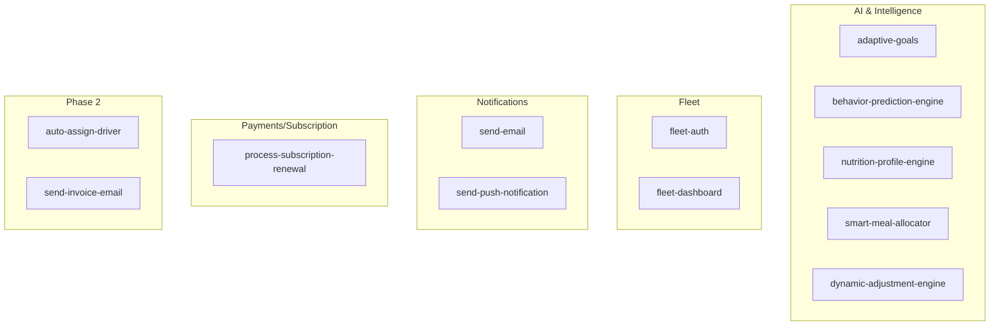

**Diagram sources**
- [adaptive-goals/index.ts:1-522](file://supabase/functions/adaptive-goals/index.ts#L1-L522)
- [behavior-prediction-engine/index.ts:1-513](file://supabase/functions/behavior-prediction-engine/index.ts#L1-L513)
- [nutrition-profile-engine/index.ts:1-338](file://supabase/functions/nutrition-profile-engine/index.ts#L1-L338)
- [smart-meal-allocator/index.ts:1-755](file://supabase/functions/smart-meal-allocator/index.ts#L1-L755)
- [dynamic-adjustment-engine/index.ts:1-455](file://supabase/functions/dynamic-adjustment-engine/index.ts#L1-L455)
- [fleet-auth/index.ts:1-307](file://supabase/functions/fleet-auth/index.ts#L1-L307)
- [fleet-dashboard/index.ts:1-306](file://supabase/functions/fleet-dashboard/index.ts#L1-L306)
- [send-email/index.ts:1-120](file://supabase/functions/send-email/index.ts#L1-L120)
- [send-push-notification/index.ts:1-300](file://supabase/functions/send-push-notification/index.ts#L1-L300)
- [process-subscription-renewal/index.ts:1-278](file://supabase/functions/process-subscription-renewal/index.ts#L1-L278)
- [PHASE2_EDGE_FUNCTIONS.md:1-411](file://supabase/functions/PHASE2_EDGE_FUNCTIONS.md#L1-L411)

**Section sources**
- [PHASE2_EDGE_FUNCTIONS.md:1-411](file://supabase/functions/PHASE2_EDGE_FUNCTIONS.md#L1-L411)

## Core Components
This section summarizes the primary edge functions and their responsibilities.

- Adaptive Goals Engine: Analyzes user progress and generates AI-driven nutrition adjustments with confidence and predictions.
- Behavior Prediction Engine: Computes churn/boredom risks and engagement scores, and optionally executes retention actions.
- Nutrition Profile Engine: Computes personalized macros and targets using BMR/TDEE equations and stores results.
- Smart Meal Allocator: Generates weekly/daily meal plans aligned with macro targets and variety constraints.
- Dynamic Adjustment Engine: Reviews adherence and weight trends to recommend and optionally apply macro adjustments.
- Fleet Authentication and Dashboard: Manages JWT-based fleet portal access and aggregates operational KPIs.
- Notification Engines: Sends email via Resend and push notifications via Firebase Cloud Messaging.
- Subscription Renewal Processor: Calculates rollover credits and renews subscriptions with optional dry-run.

**Section sources**
- [adaptive-goals/index.ts:1-522](file://supabase/functions/adaptive-goals/index.ts#L1-L522)
- [behavior-prediction-engine/index.ts:1-513](file://supabase/functions/behavior-prediction-engine/index.ts#L1-L513)
- [nutrition-profile-engine/index.ts:1-338](file://supabase/functions/nutrition-profile-engine/index.ts#L1-L338)
- [smart-meal-allocator/index.ts:1-755](file://supabase/functions/smart-meal-allocator/index.ts#L1-L755)
- [dynamic-adjustment-engine/index.ts:1-455](file://supabase/functions/dynamic-adjustment-engine/index.ts#L1-L455)
- [fleet-auth/index.ts:1-307](file://supabase/functions/fleet-auth/index.ts#L1-L307)
- [fleet-dashboard/index.ts:1-306](file://supabase/functions/fleet-dashboard/index.ts#L1-L306)
- [send-email/index.ts:1-120](file://supabase/functions/send-email/index.ts#L1-L120)
- [send-push-notification/index.ts:1-300](file://supabase/functions/send-push-notification/index.ts#L1-L300)
- [process-subscription-renewal/index.ts:1-278](file://supabase/functions/process-subscription-renewal/index.ts#L1-L278)

## Architecture Overview
The edge functions integrate with Supabase Auth and Postgres, and interact with external services for notifications and payments. They are invoked via Supabase Functions HTTP endpoints or chained internally via RPC and function invocation.

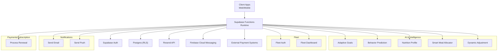

**Diagram sources**
- [adaptive-goals/index.ts:316-521](file://supabase/functions/adaptive-goals/index.ts#L316-L521)
- [behavior-prediction-engine/index.ts:306-512](file://supabase/functions/behavior-prediction-engine/index.ts#L306-L512)
- [nutrition-profile-engine/index.ts:199-337](file://supabase/functions/nutrition-profile-engine/index.ts#L199-L337)
- [smart-meal-allocator/index.ts:480-754](file://supabase/functions/smart-meal-allocator/index.ts#L480-L754)
- [dynamic-adjustment-engine/index.ts:275-454](file://supabase/functions/dynamic-adjustment-engine/index.ts#L275-L454)
- [fleet-auth/index.ts:275-306](file://supabase/functions/fleet-auth/index.ts#L275-L306)
- [fleet-dashboard/index.ts:282-305](file://supabase/functions/fleet-dashboard/index.ts#L282-L305)
- [send-email/index.ts:19-119](file://supabase/functions/send-email/index.ts#L19-L119)
- [send-push-notification/index.ts:178-299](file://supabase/functions/send-push-notification/index.ts#L178-L299)
- [process-subscription-renewal/index.ts:30-277](file://supabase/functions/process-subscription-renewal/index.ts#L30-L277)

## Detailed Component Analysis

### Adaptive Goals Engine
- Purpose: Analyze user progress and generate AI recommendations for nutrition targets with confidence and future weight predictions.
- Inputs:
  - user_id (required)
  - dry_run (optional)
- Outputs:
  - recommendation (new targets and rationale)
  - predictions (future weight with confidence bounds)
  - adjustment_id (when saved)
  - should_notify flag
- Business logic:
  - Calculates BMR and derives targets.
  - Analyzes adherence and weight trends to detect plateaus, fast/slow loss, and goal achievement.
  - Generates macro adjustments with confidence and suggested actions.
  - Stores adjustment history, predictions, and updates profile flags.
- Database interactions:
  - Reads profiles, progress_logs, weekly_adherence.
  - Upserts goal_adjustment_history, weight_predictions, plateau_events.
  - Updates profiles with suggestions and flags.
- Security and validation:
  - Validates presence of user_id and settings.
  - Uses Supabase client with service role key.
- Error handling:
  - Returns structured 4xx/5xx responses with detailed messages.

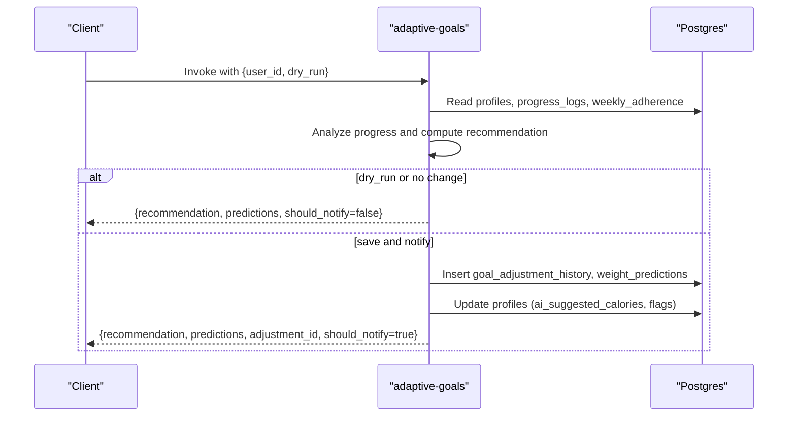

**Diagram sources**
- [adaptive-goals/index.ts:316-521](file://supabase/functions/adaptive-goals/index.ts#L316-L521)

**Section sources**
- [adaptive-goals/index.ts:1-522](file://supabase/functions/adaptive-goals/index.ts#L1-L522)

### Behavior Prediction Engine
- Purpose: Compute churn risk, boredom risk, engagement score, and optionally execute retention actions.
- Inputs:
  - user_id (required)
  - analyze_period_days (optional, default 30)
  - auto_execute (optional, default false)
- Outputs:
  - predictions (scores and confidence)
  - metrics (counts and rates)
  - recommendations (actions with priorities)
  - executed_actions (when auto_execute is true)
- Business logic:
  - Computes ordering frequency, skip rate, diversity, and engagement.
  - Scores churn/boredom and generates recommendations.
  - Optionally executes actions (e.g., bonus credits) and logs outcomes.
- Database interactions:
  - Reads orders, ratings, behavior_events, weekly_meal_plans.
  - Writes behavior_analytics, retention_actions, credit_transactions.
- Security and validation:
  - Validates user_id presence.
- Error handling:
  - Returns structured errors and logs failures.

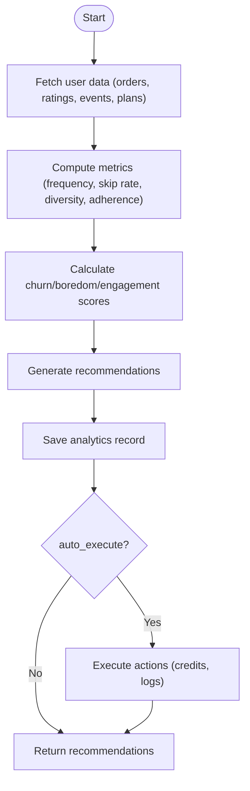

**Diagram sources**
- [behavior-prediction-engine/index.ts:306-512](file://supabase/functions/behavior-prediction-engine/index.ts#L306-L512)

**Section sources**
- [behavior-prediction-engine/index.ts:1-513](file://supabase/functions/behavior-prediction-engine/index.ts#L1-L513)

### Nutrition Profile Engine
- Purpose: Calculate personalized nutrition targets using BMR/TDEE and macro distribution.
- Inputs:
  - user_id (required)
  - profile_data (required): gender, age, height_cm, weight_kg, activity_level, goal, optional training_days_per_week, food_preferences, allergies
  - save_to_database (optional, default true)
- Outputs:
  - success with computed nutrition_profile
- Business logic:
  - BMR via Mifflin-St Jeor.
  - TDEE via activity multipliers.
  - Target calories by goal (deficit/surplus/maintenance).
  - Macro distribution by goal with minimum protein constraint.
  - Meal distribution ratios by goal.
- Database interactions:
  - Updates profiles with computed targets and logs behavior events.
  - Upserts user_preferences if provided.
- Security and validation:
  - Validates required fields and ranges.
- Error handling:
  - Returns structured errors for missing inputs or save failures.

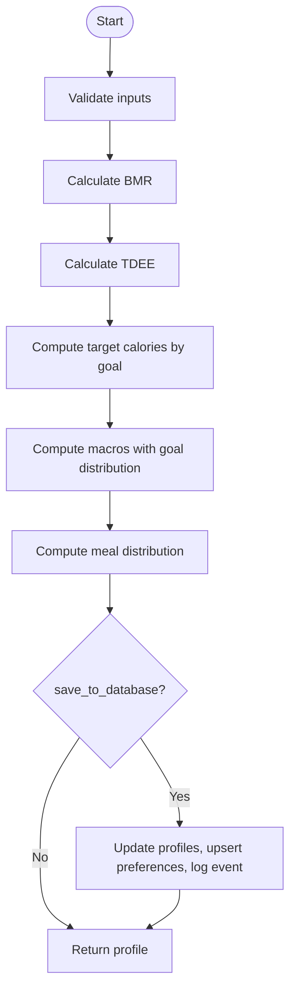

**Diagram sources**
- [nutrition-profile-engine/index.ts:199-337](file://supabase/functions/nutrition-profile-engine/index.ts#L199-L337)

**Section sources**
- [nutrition-profile-engine/index.ts:1-338](file://supabase/functions/nutrition-profile-engine/index.ts#L1-L338)

### Smart Meal Allocator
- Purpose: Generate weekly or daily meal plans aligned with macro targets and variety constraints.
- Inputs:
  - user_id (required)
  - week_start_date (required)
  - generate_variations (optional)
  - save_to_database (optional)
  - remaining_calories, remaining_protein, locked_meal_types, mode (daily/weekly)
- Outputs:
  - plan_id (when saved)
  - plan (with enriched items and totals)
  - weekly_plan (alias)
  - message with compliance score
- Business logic:
  - Filters available meals and scores by macro match and variety.
  - Greedy selection per meal type with restaurant constraints.
  - Calculates compliance and variety scores.
- Database interactions:
  - Reads profiles, user_preferences, meals, restaurants.
  - Logs behavior events.
- Security and validation:
  - Validates inputs and handles missing data gracefully.
- Error handling:
  - Returns structured errors with details.

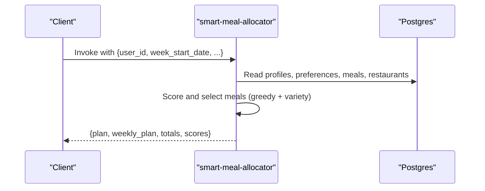

**Diagram sources**
- [smart-meal-allocator/index.ts:480-754](file://supabase/functions/smart-meal-allocator/index.ts#L480-L754)

**Section sources**
- [smart-meal-allocator/index.ts:1-755](file://supabase/functions/smart-meal-allocator/index.ts#L1-L755)

### Dynamic Adjustment Engine
- Purpose: Recommend and optionally apply macro adjustments based on adherence and weight trends.
- Inputs:
  - user_id (required)
  - auto_apply (optional)
  - weeks_of_history (optional)
- Outputs:
  - recommendation (type, adjustments, reasoning, confidence)
  - metrics (velocity, plateau, adherence)
  - applied (when auto_apply succeeds)
- Business logic:
  - Computes weight velocity and detects plateau.
  - Analyzes adherence trends.
  - Generates evidence-based recommendations.
  - Optionally applies changes and marks acceptance.
- Database interactions:
  - Reads profiles, weight_logs, weekly_adherence.
  - Writes ai_nutrition_adjustments and updates profiles.
  - Logs behavior events.
- Security and validation:
  - Validates user_id and handles missing data.
- Error handling:
  - Returns structured errors.

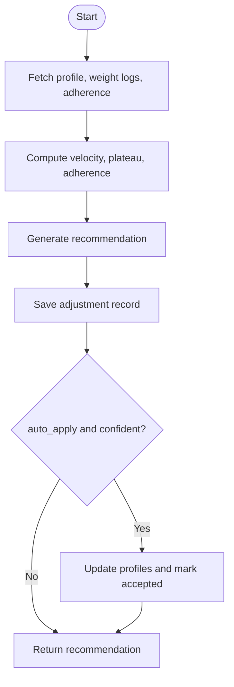

**Diagram sources**
- [dynamic-adjustment-engine/index.ts:275-454](file://supabase/functions/dynamic-adjustment-engine/index.ts#L275-L454)

**Section sources**
- [dynamic-adjustment-engine/index.ts:1-455](file://supabase/functions/dynamic-adjustment-engine/index.ts#L1-L455)

### Fleet Authentication
- Purpose: Manage fleet manager login, token refresh, and logout with role-based access.
- Endpoints:
  - POST /fleet/login
  - POST /fleet/refresh
  - POST /fleet/logout
- Inputs:
  - Login: email, password
  - Refresh: refreshToken
  - Logout: Authorization header
- Outputs:
  - Access/refresh tokens and user info on login
  - New tokens on refresh
  - Success on logout
- Security:
  - Uses separate JWT secrets for access and refresh tokens.
  - Validates token types and roles.
  - Logs activity with IP and UA.
- Error handling:
  - Returns 4xx/5xx with error messages.

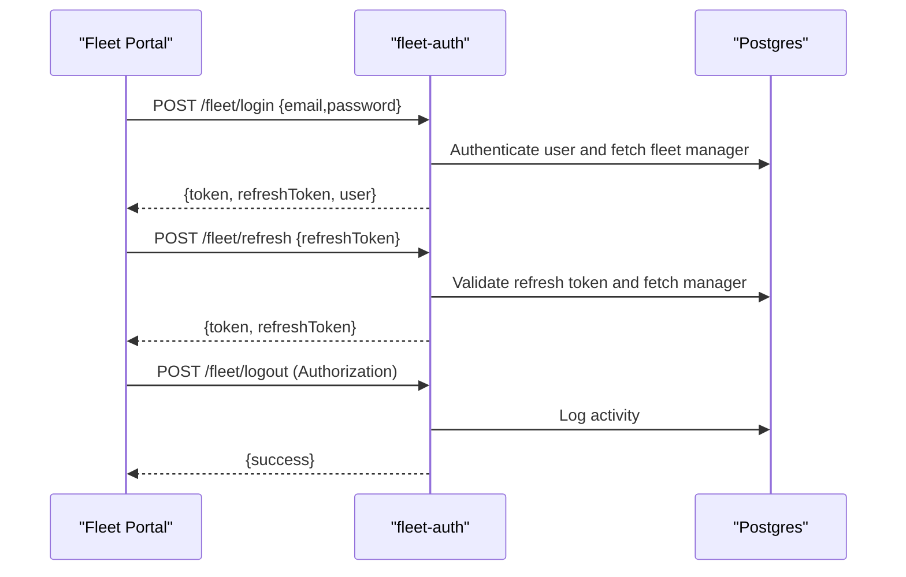

**Diagram sources**
- [fleet-auth/index.ts:275-306](file://supabase/functions/fleet-auth/index.ts#L275-L306)

**Section sources**
- [fleet-auth/index.ts:1-307](file://supabase/functions/fleet-auth/index.ts#L1-L307)

### Fleet Dashboard
- Purpose: Provide aggregated KPIs for fleet managers with city-scoped filtering.
- Endpoint:
  - GET /fleet/dashboard?cityId={optional}
- Inputs:
  - Authorization header (access token)
  - cityId query param (optional)
- Outputs:
  - Counts: total drivers, active, online
  - Orders: in-progress
  - Deliveries: today
  - Average delivery time (last 7 days)
  - City filter data for super admins
- Security:
  - Validates access token and enforces city access rules.
- Error handling:
  - Returns 4xx/5xx with error messages.

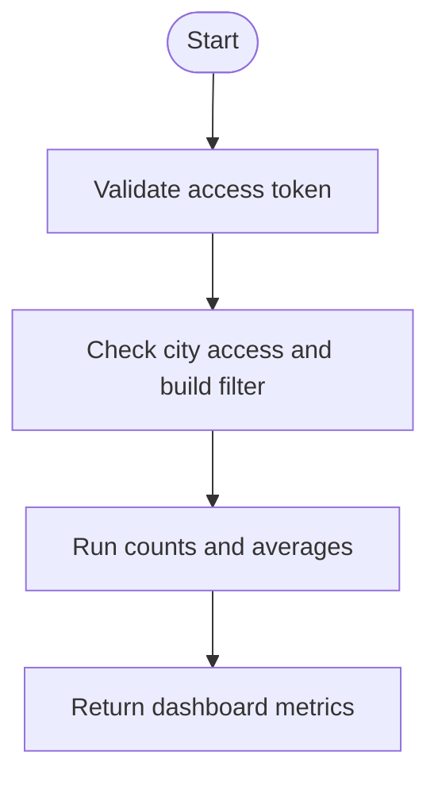

**Diagram sources**
- [fleet-dashboard/index.ts:282-305](file://supabase/functions/fleet-dashboard/index.ts#L282-L305)

**Section sources**
- [fleet-dashboard/index.ts:1-306](file://supabase/functions/fleet-dashboard/index.ts#L1-L306)

### Send Email
- Purpose: Send templated HTML emails via Resend.
- Inputs:
  - to, subject, html (required)
  - from, replyTo (optional)
- Outputs:
  - success with messageId
- Security:
  - Requires RESEND_API_KEY configured.
- Error handling:
  - Returns 4xx/5xx with details.

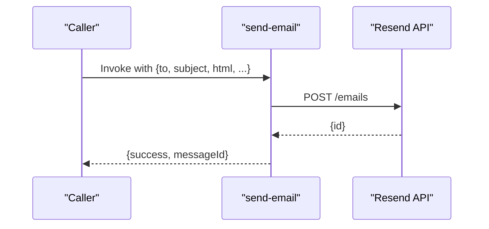

**Diagram sources**
- [send-email/index.ts:19-119](file://supabase/functions/send-email/index.ts#L19-L119)

**Section sources**
- [send-email/index.ts:1-120](file://supabase/functions/send-email/index.ts#L1-L120)

### Send Push Notification
- Purpose: Send cross-platform push notifications via Firebase Cloud Messaging.
- Inputs:
  - user_id, title, message, type, data (optional)
- Outputs:
  - success with sent/failed counts
- Security:
  - Requires FIREBASE_SERVICE_ACCOUNT secret.
- Behavior:
  - Fetches active tokens, obtains OAuth2 access token, sends to all, deactivates invalid tokens, and persists notification record.

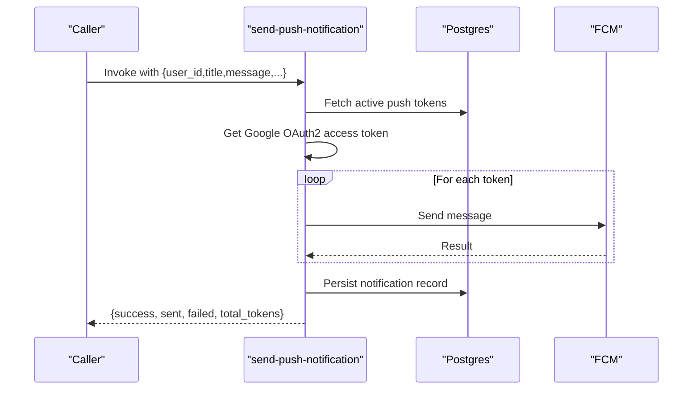

**Diagram sources**
- [send-push-notification/index.ts:178-299](file://supabase/functions/send-push-notification/index.ts#L178-L299)

**Section sources**
- [send-push-notification/index.ts:1-300](file://supabase/functions/send-push-notification/index.ts#L1-L300)

### Process Subscription Renewal
- Purpose: Renew subscriptions with rollover credit calculation and optional dry-run.
- Inputs:
  - subscription_id (optional), user_id (optional), dry_run (optional)
- Outputs:
  - message, processed, successful, failed, results[]
- Security:
  - Validates JWT and checks ownership/admin privileges.
- Behavior:
  - Finds due subscriptions, computes rollover credits via RPC, optionally invokes send-email, and returns summary.

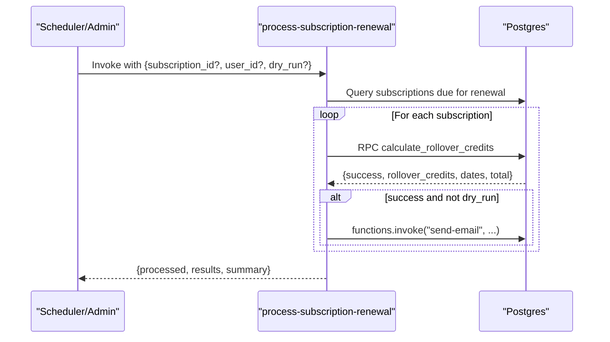

**Diagram sources**
- [process-subscription-renewal/index.ts:30-277](file://supabase/functions/process-subscription-renewal/index.ts#L30-L277)

**Section sources**
- [process-subscription-renewal/index.ts:1-278](file://supabase/functions/process-subscription-renewal/index.ts#L1-L278)

### Phase 2 Functions (Auto Assign Driver, Send Invoice Email)
- Auto Assign Driver:
  - Input: deliveryId (or orderId)
  - Output: success with driverId and score, or queued/no drivers
  - Uses scoring by distance, capacity, rating, experience
  - Logs assignment and updates deliveries
- Send Invoice Email:
  - Input: paymentId
  - Output: success with emailId and invoice number, or already sent/pending
  - Integrates with Resend and logs to email_logs

Deployment and environment configuration are documented in the Phase 2 guide.

**Section sources**
- [PHASE2_EDGE_FUNCTIONS.md:1-411](file://supabase/functions/PHASE2_EDGE_FUNCTIONS.md#L1-L411)

## Dependency Analysis
- Internal dependencies:
  - process-subscription-renewal invokes send-email function.
  - All functions depend on Supabase client and service role key.
- External dependencies:
  - Resend API for email delivery.
  - Firebase Cloud Messaging for push notifications.
  - Google OAuth2 for FCM access token generation.
- Coupling:
  - Functions are cohesive around domain concerns; minimal cross-function coupling.
  - Shared Supabase client and environment variables reduce duplication.

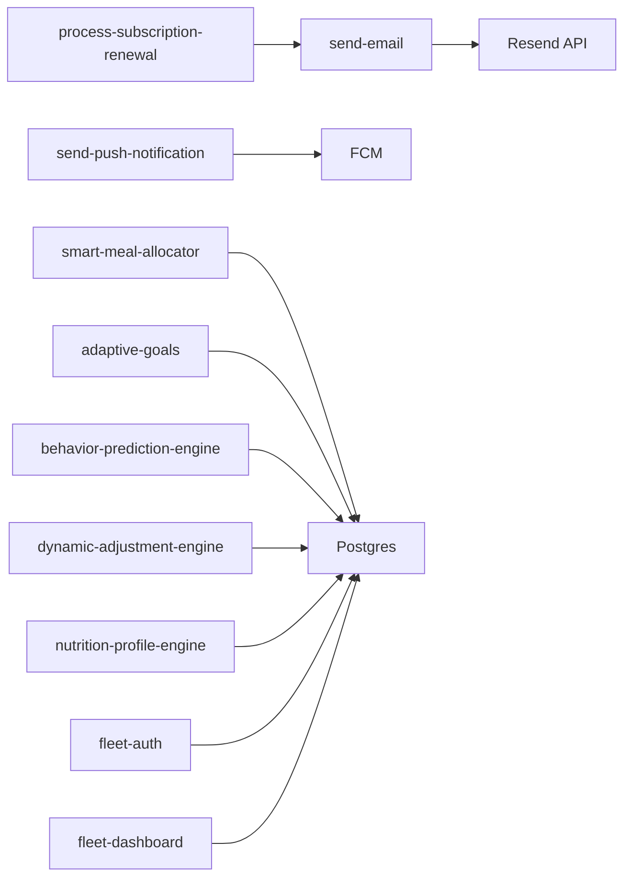

**Diagram sources**
- [process-subscription-renewal/index.ts:229-239](file://supabase/functions/process-subscription-renewal/index.ts#L229-L239)
- [send-push-notification/index.ts:241-281](file://supabase/functions/send-push-notification/index.ts#L241-L281)
- [send-email/index.ts:67-81](file://supabase/functions/send-email/index.ts#L67-L81)
- [smart-meal-allocator/index.ts:518-530](file://supabase/functions/smart-meal-allocator/index.ts#L518-L530)
- [adaptive-goals/index.ts:354-366](file://supabase/functions/adaptive-goals/index.ts#L354-L366)
- [behavior-prediction-engine/index.ts:335-341](file://supabase/functions/behavior-prediction-engine/index.ts#L335-L341)
- [dynamic-adjustment-engine/index.ts:300-312](file://supabase/functions/dynamic-adjustment-engine/index.ts#L300-L312)
- [nutrition-profile-engine/index.ts:267-280](file://supabase/functions/nutrition-profile-engine/index.ts#L267-L280)
- [fleet-auth/index.ts:116-138](file://supabase/functions/fleet-auth/index.ts#L116-L138)
- [fleet-dashboard/index.ts:103-136](file://supabase/functions/fleet-dashboard/index.ts#L103-L136)

**Section sources**
- [process-subscription-renewal/index.ts:1-278](file://supabase/functions/process-subscription-renewal/index.ts#L1-L278)
- [send-push-notification/index.ts:1-300](file://supabase/functions/send-push-notification/index.ts#L1-L300)
- [send-email/index.ts:1-120](file://supabase/functions/send-email/index.ts#L1-L120)
- [smart-meal-allocator/index.ts:1-755](file://supabase/functions/smart-meal-allocator/index.ts#L1-L755)
- [adaptive-goals/index.ts:1-522](file://supabase/functions/adaptive-goals/index.ts#L1-L522)
- [behavior-prediction-engine/index.ts:1-513](file://supabase/functions/behavior-prediction-engine/index.ts#L1-L513)
- [dynamic-adjustment-engine/index.ts:1-455](file://supabase/functions/dynamic-adjustment-engine/index.ts#L1-L455)
- [nutrition-profile-engine/index.ts:1-338](file://supabase/functions/nutrition-profile-engine/index.ts#L1-L338)
- [fleet-auth/index.ts:1-307](file://supabase/functions/fleet-auth/index.ts#L1-L307)
- [fleet-dashboard/index.ts:1-306](file://supabase/functions/fleet-dashboard/index.ts#L1-L306)

## Performance Considerations
- Cold starts:
  - Minimize initialization work; reuse Supabase client instances.
  - Keep function code lean; avoid large imports.
- Database queries:
  - Use targeted selects with indexes; limit result sets.
  - Batch writes where possible.
- External APIs:
  - Use short timeouts; handle transient errors with retries.
  - Cache tokens (e.g., FCM access token) within function lifecycle.
- Concurrency:
  - Avoid synchronous loops; use Promise.allSettled for fan-out operations.
- Observability:
  - Log key metrics and errors; monitor function duration and error rates.

## Troubleshooting Guide
- Function deployment failures:
  - Ensure Supabase CLI is up to date and linked to the project.
  - Verify environment variables are set and redeploy.
- Missing credentials:
  - Confirm SUPABASE_URL and SUPABASE_SERVICE_ROLE_KEY are present.
- Database connectivity:
  - Check RLS policies and service role permissions.
- Email delivery:
  - Verify RESEND_API_KEY validity and Resend sending limits.
- Push notifications:
  - Ensure FIREBASE_SERVICE_ACCOUNT secret is set.
  - Check token deactivation for UNREGISTERED/NOT_FOUND responses.
- Subscription renewal:
  - Validate JWT for non-cron invocations and user/admin permissions.

**Section sources**
- [PHASE2_EDGE_FUNCTIONS.md:380-411](file://supabase/functions/PHASE2_EDGE_FUNCTIONS.md#L380-L411)

## Conclusion
The Nutrio edge function suite delivers a robust, scalable backend for AI-driven nutrition, fleet operations, and notifications. By leveraging Supabase Functions, secure JWT-based access, and external APIs, the system automates key workflows while maintaining strong observability and error handling. Proper environment configuration, validation, and performance tuning ensure reliable operation at scale.

## Appendices

### Environment Configuration
- Shared:
  - SUPABASE_URL
  - SUPABASE_SERVICE_ROLE_KEY
- Notifications:
  - RESEND_API_KEY (send-email)
  - FIREBASE_SERVICE_ACCOUNT (send-push-notification)
- Fleet:
  - FLEET_JWT_SECRET
  - FLEET_REFRESH_SECRET
- Phase 2:
  - SUPABASE_URL, SUPABASE_SERVICE_ROLE_KEY, RESEND_API_KEY (auto-assign-driver, send-invoice-email)

**Section sources**
- [PHASE2_EDGE_FUNCTIONS.md:10-31](file://supabase/functions/PHASE2_EDGE_FUNCTIONS.md#L10-L31)
- [send-email/index.ts:4-4](file://supabase/functions/send-email/index.ts#L4-L4)
- [send-push-notification/index.ts:190-193](file://supabase/functions/send-push-notification/index.ts#L190-L193)
- [fleet-auth/index.ts:8-12](file://supabase/functions/fleet-auth/index.ts#L8-L12)

### Function Invocation Examples
- Supabase client:
  - Invoke adaptive goals: [adaptive-goals/index.ts:327-335](file://supabase/functions/adaptive-goals/index.ts#L327-L335)
  - Invoke smart allocator: [smart-meal-allocator/index.ts:491-501](file://supabase/functions/smart-meal-allocator/index.ts#L491-L501)
  - Invoke process renewal: [process-subscription-renewal/index.ts:50-58](file://supabase/functions/process-subscription-renewal/index.ts#L50-L58)
- HTTP request:
  - [PHASE2_EDGE_FUNCTIONS.md:241-254](file://supabase/functions/PHASE2_EDGE_FUNCTIONS.md#L241-L254)

**Section sources**
- [adaptive-goals/index.ts:327-335](file://supabase/functions/adaptive-goals/index.ts#L327-L335)
- [smart-meal-allocator/index.ts:491-501](file://supabase/functions/smart-meal-allocator/index.ts#L491-L501)
- [process-subscription-renewal/index.ts:50-58](file://supabase/functions/process-subscription-renewal/index.ts#L50-L58)
- [PHASE2_EDGE_FUNCTIONS.md:241-254](file://supabase/functions/PHASE2_EDGE_FUNCTIONS.md#L241-L254)

### Function Chaining and Workflows
- Subscription renewal workflow:
  - Scheduler triggers process-subscription-renewal (dry-run or execute).
  - Successful renewals invoke send-email for notifications.
- Behavior prediction workflow:
  - Periodic analysis computes recommendations and optionally executes actions.

**Section sources**
- [process-subscription-renewal/index.ts:229-240](file://supabase/functions/process-subscription-renewal/index.ts#L229-L240)
- [behavior-prediction-engine/index.ts:471-482](file://supabase/functions/behavior-prediction-engine/index.ts#L471-L482)