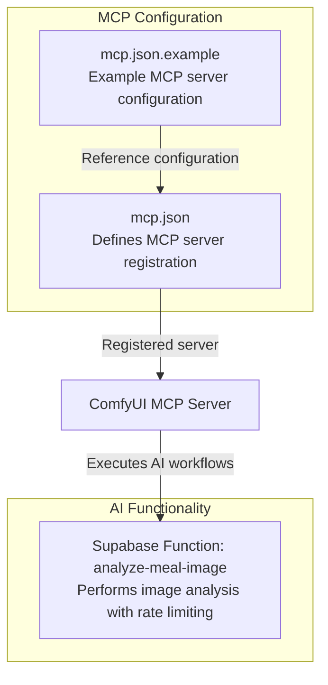
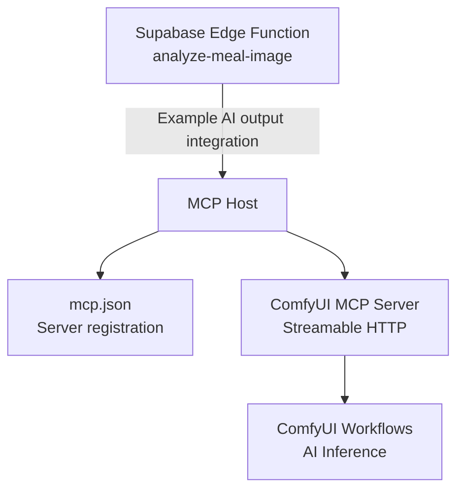
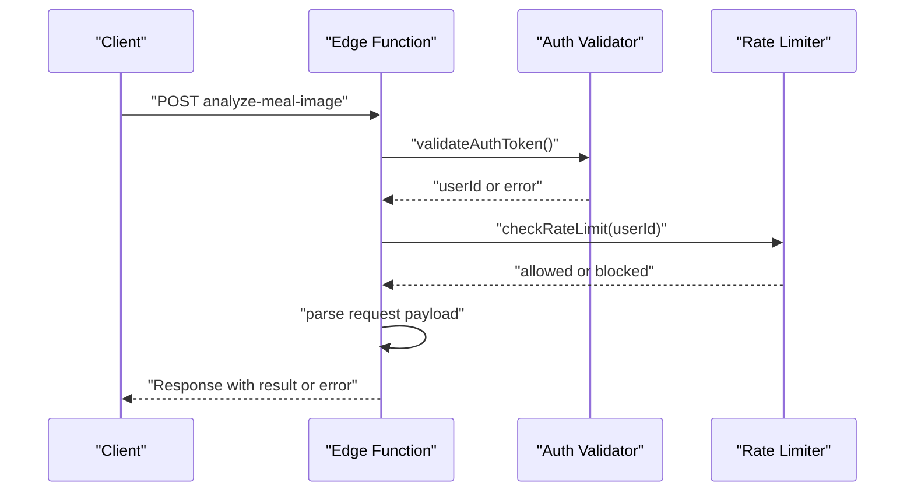
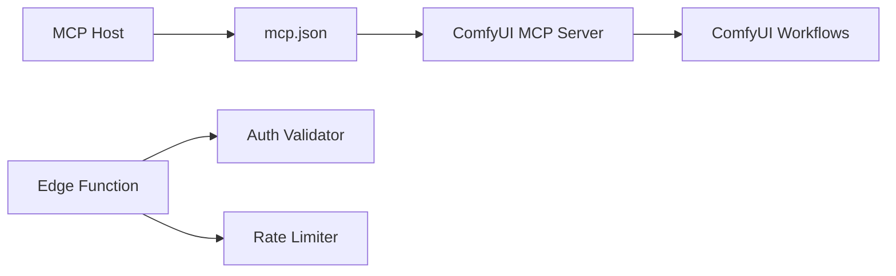

# MCP Server

<cite>
**Referenced Files in This Document**
- [mcp.json](file://mcp-servers/comfyui-mcp-server/mcp.json)
- [mcp.json.example](file://mcp.json.example)
- [.claude/settings.local.json](file://.claude/settings.local.json)
- [analyze-meal-image/index.ts](file://supabase/functions/analyze-meal-image/index.ts)
</cite>

## Table of Contents
1. [Introduction](#introduction)
2. [Project Structure](#project-structure)
3. [Core Components](#core-components)
4. [Architecture Overview](#architecture-overview)
5. [Detailed Component Analysis](#detailed-component-analysis)
6. [Dependency Analysis](#dependency-analysis)
7. [Performance Considerations](#performance-considerations)
8. [Troubleshooting Guide](#troubleshooting-guide)
9. [Security Considerations](#security-considerations)
10. [Conclusion](#conclusion)

## Introduction
This document describes the Model Context Protocol (MCP) server integration for Nutrio's AI capabilities powered by ComfyUI. It explains how the MCP server is configured, how it interacts with ComfyUI workflows for AI-powered features such as meal recommendation generation, nutritional analysis, and content creation, and how to operate and troubleshoot the server. It also documents configuration options, environment variables, and security considerations for model access and data privacy.

## Project Structure
The MCP server for ComfyUI is defined via a configuration file that registers the server with the MCP host. The configuration specifies the transport type and endpoint URL for the server. Additional configuration examples demonstrate how other MCP servers can be registered and configured with environment variables.

**Diagram sources**
- [mcp.json:1-8](file://mcp-servers/comfyui-mcp-server/mcp.json#L1-L8)
- [mcp.json.example:1-16](file://mcp.json.example#L1-L16)

**Section sources**
- [mcp.json:1-8](file://mcp-servers/comfyui-mcp-server/mcp.json#L1-L8)
- [mcp.json.example:1-16](file://mcp.json.example#L1-L16)

## Core Components
- MCP server registration: The server is registered under a logical name with a transport type and URL endpoint. This allows the MCP host to discover and communicate with the server.
- Example configuration: A second configuration demonstrates how to register an external MCP server with command invocation and environment variables.
- AI function integration: An example Supabase Edge Function performs image analysis and applies rate limiting, illustrating how AI inference results can be integrated into broader systems.

Key configuration references:
- Server registration and endpoint definition
- Example external MCP server configuration with environment variables
- AI function with authentication and rate limiting

**Section sources**
- [mcp.json:1-8](file://mcp-servers/comfyui-mcp-server/mcp.json#L1-L8)
- [mcp.json.example:1-16](file://mcp.json.example#L1-L16)
- [analyze-meal-image/index.ts:150-197](file://supabase/functions/analyze-meal-image/index.ts#L150-L197)

## Architecture Overview
The MCP server for ComfyUI operates as a streamable HTTP service. The MCP host discovers the server via the configuration file and communicates with it over HTTP. AI inference requests are routed to ComfyUI workflows, and results are returned to the host. The Supabase function example shows how AI outputs can be integrated with authentication and rate limiting.

**Diagram sources**
- [mcp.json:1-8](file://mcp-servers/comfyui-mcp-server/mcp.json#L1-L8)
- [analyze-meal-image/index.ts:150-197](file://supabase/functions/analyze-meal-image/index.ts#L150-L197)

## Detailed Component Analysis

### MCP Server Registration and Transport
- Logical server name: The server is registered under a unique name for discovery by the MCP host.
- Transport type: The server uses a streamable HTTP transport, enabling streaming responses for long-running AI tasks.
- Endpoint URL: The server listens on a local address and exposes an MCP endpoint path.

Operational implications:
- Ensure the server is reachable at the configured URL.
- Verify that the transport type aligns with the host’s expectations.

**Section sources**
- [mcp.json:1-8](file://mcp-servers/comfyui-mcp-server/mcp.json#L1-L8)

### Example External MCP Server Configuration
- Command invocation: Demonstrates launching an MCP server via a command runner with arguments.
- Environment variables: Shows how to pass environment variables to the server process.

Use cases:
- External MCP servers can be launched alongside the ComfyUI server.
- Environment variables can be used to configure credentials and runtime settings.

**Section sources**
- [mcp.json.example:1-16](file://mcp.json.example#L1-L16)

### AI Function Integration with Authentication and Rate Limiting
- Authentication: Validates the caller using an authentication token and logs failed attempts.
- Rate limiting: Enforces a per-hour cap on analyses and returns standardized rate limit headers.
- Request processing: Extracts image URL and analysis parameters from the request payload.

**Diagram sources**
- [analyze-meal-image/index.ts:150-197](file://supabase/functions/analyze-meal-image/index.ts#L150-L197)

**Section sources**
- [analyze-meal-image/index.ts:150-197](file://supabase/functions/analyze-meal-image/index.ts#L150-L197)

## Dependency Analysis
- MCP host depends on the configuration file to locate the server.
- The ComfyUI MCP server depends on ComfyUI workflows for inference.
- The AI function depends on authentication and rate-limiting infrastructure.

**Diagram sources**
- [mcp.json:1-8](file://mcp-servers/comfyui-mcp-server/mcp.json#L1-L8)
- [analyze-meal-image/index.ts:150-197](file://supabase/functions/analyze-meal-image/index.ts#L150-L197)

**Section sources**
- [mcp.json:1-8](file://mcp-servers/comfyui-mcp-server/mcp.json#L1-L8)
- [analyze-meal-image/index.ts:150-197](file://supabase/functions/analyze-meal-image/index.ts#L150-L197)

## Performance Considerations
- Streaming transport: Using a streamable HTTP transport enables efficient handling of long-running AI tasks.
- Rate limiting: Apply rate limits to protect backend resources during AI inference.
- Authentication overhead: Centralize authentication checks to avoid redundant validations.
- Workflow optimization: Ensure ComfyUI workflows are optimized for batch and streaming scenarios.

[No sources needed since this section provides general guidance]

## Troubleshooting Guide
Common issues and resolutions:
- Server not reachable:
  - Verify the endpoint URL and network accessibility.
  - Confirm the server is running and listening on the expected port.
- Authentication failures:
  - Ensure the client includes valid authentication tokens.
  - Review logs for unauthorized access attempts.
- Rate limit exceeded:
  - Implement client-side backoff and retry logic.
  - Monitor rate limit headers to understand remaining quota.
- Workflow execution errors:
  - Validate model availability and resource allocation.
  - Check logs for inference errors and adjust workflow parameters.

**Section sources**
- [mcp.json:1-8](file://mcp-servers/comfyui-mcp-server/mcp.json#L1-L8)
- [analyze-meal-image/index.ts:150-197](file://supabase/functions/analyze-meal-image/index.ts#L150-L197)

## Security Considerations
- Access control:
  - Require authentication for all AI inference endpoints.
  - Enforce role-based access where applicable.
- Data privacy:
  - Minimize data retention and apply anonymization where possible.
  - Ensure secure transmission and storage of sensitive inputs and outputs.
- Rate limiting:
  - Prevent abuse through configurable rate limits and quotas.
- Environment variables:
  - Store secrets securely and avoid hardcoding credentials.
  - Restrict access to configuration files containing sensitive data.

**Section sources**
- [analyze-meal-image/index.ts:150-197](file://supabase/functions/analyze-meal-image/index.ts#L150-L197)

## Conclusion
The MCP server for ComfyUI integrates seamlessly with the MCP host via a simple configuration file. By leveraging streamable HTTP transport, the server supports long-running AI workflows. Integrating AI outputs with authentication and rate limiting ensures robust and secure operation. Proper configuration, monitoring, and security practices are essential for reliable performance and compliance.