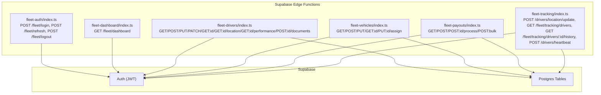
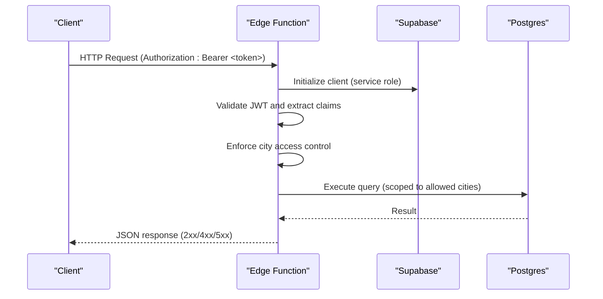
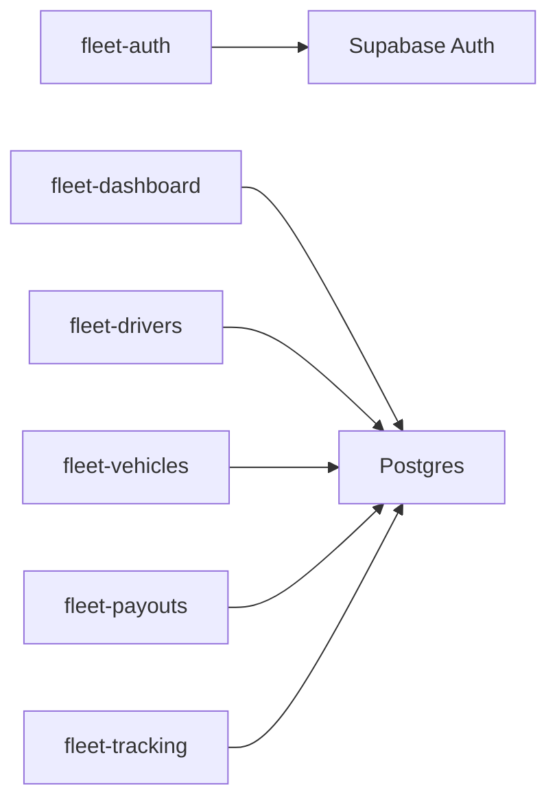

# REST API Endpoints

<cite>
**Referenced Files in This Document**
- [PHASE2_EDGE_FUNCTIONS.md](file://supabase/functions/PHASE2_EDGE_FUNCTIONS.md)
- [config.toml](file://supabase/config.toml)
- [fleet-auth/index.ts](file://supabase/functions/fleet-auth/index.ts)
- [fleet-drivers/index.ts](file://supabase/functions/fleet-drivers/index.ts)
- [fleet-vehicles/index.ts](file://supabase/functions/fleet-vehicles/index.ts)
- [fleet-payouts/index.ts](file://supabase/functions/fleet-payouts/index.ts)
- [fleet-tracking/index.ts](file://supabase/functions/fleet-tracking/index.ts)
- [fleet-dashboard/index.ts](file://supabase/functions/fleet-dashboard/index.ts)
- [types.ts](file://src/integrations/supabase/types.ts)
</cite>

## Table of Contents
1. [Introduction](#introduction)
2. [Project Structure](#project-structure)
3. [Core Components](#core-components)
4. [Architecture Overview](#architecture-overview)
5. [Detailed Component Analysis](#detailed-component-analysis)
6. [Dependency Analysis](#dependency-analysis)
7. [Performance Considerations](#performance-considerations)
8. [Troubleshooting Guide](#troubleshooting-guide)
9. [Conclusion](#conclusion)

## Introduction
This document provides comprehensive REST API endpoint documentation for the Nutrio platform’s Supabase edge functions. It covers authentication, request/response schemas, query parameters, path variables, and error handling for the fleet management portal endpoints. These endpoints are implemented as Deno-based edge functions and integrate with Supabase Auth and Postgres.

## Project Structure
The REST API surface for fleet management is implemented as edge functions under the Supabase project. Each function exposes one or more HTTP endpoints with JWT-based authorization for fleet managers and, in some cases, driver tokens.

**Diagram sources**
- [fleet-auth/index.ts:275-307](file://supabase/functions/fleet-auth/index.ts#L275-L307)
- [fleet-dashboard/index.ts:282-306](file://supabase/functions/fleet-dashboard/index.ts#L282-L306)
- [fleet-drivers/index.ts:56-800](file://supabase/functions/fleet-drivers/index.ts#L56-L800)
- [fleet-vehicles/index.ts:56-671](file://supabase/functions/fleet-vehicles/index.ts#L56-L671)
- [fleet-payouts/index.ts:56-610](file://supabase/functions/fleet-payouts/index.ts#L56-L610)
- [fleet-tracking/index.ts:429-503](file://supabase/functions/fleet-tracking/index.ts#L429-L503)

**Section sources**
- [PHASE2_EDGE_FUNCTIONS.md:1-411](file://supabase/functions/PHASE2_EDGE_FUNCTIONS.md#L1-L411)
- [config.toml:1-59](file://supabase/config.toml#L1-L59)

## Core Components
- fleet-auth: Authentication and session management for fleet managers with JWT issuance and refresh.
- fleet-dashboard: Aggregated metrics for fleet managers with optional city scoping.
- fleet-drivers: Full CRUD and operational endpoints for drivers, including status updates, performance metrics, and document uploads.
- fleet-vehicles: Vehicle lifecycle management with driver assignments and status tracking.
- fleet-payouts: Payout processing with idempotency support and bulk operations.
- fleet-tracking: Driver location updates and historical tracking queries; also supports driver heartbeat.

**Section sources**
- [fleet-auth/index.ts:90-307](file://supabase/functions/fleet-auth/index.ts#L90-L307)
- [fleet-dashboard/index.ts:58-306](file://supabase/functions/fleet-dashboard/index.ts#L58-L306)
- [fleet-drivers/index.ts:56-800](file://supabase/functions/fleet-drivers/index.ts#L56-L800)
- [fleet-vehicles/index.ts:56-671](file://supabase/functions/fleet-vehicles/index.ts#L56-L671)
- [fleet-payouts/index.ts:56-610](file://supabase/functions/fleet-payouts/index.ts#L56-L610)
- [fleet-tracking/index.ts:72-503](file://supabase/functions/fleet-tracking/index.ts#L72-L503)

## Architecture Overview
The fleet management endpoints follow a consistent pattern:
- Authorization: Bearer JWT tokens for fleet managers; driver endpoints accept driver JWTs.
- CORS: Preflight handling and CORS headers configured for all endpoints.
- City-scoped access control: Super admins can access all cities; fleet managers are restricted to assigned cities.
- Database access: Supabase client initialized with service role key; queries scoped to allowed cities.

**Diagram sources**
- [fleet-auth/index.ts:275-307](file://supabase/functions/fleet-auth/index.ts#L275-L307)
- [fleet-dashboard/index.ts:58-306](file://supabase/functions/fleet-dashboard/index.ts#L58-L306)
- [fleet-drivers/index.ts:56-800](file://supabase/functions/fleet-drivers/index.ts#L56-L800)
- [fleet-vehicles/index.ts:56-671](file://supabase/functions/fleet-vehicles/index.ts#L56-L671)
- [fleet-payouts/index.ts:56-610](file://supabase/functions/fleet-payouts/index.ts#L56-L610)
- [fleet-tracking/index.ts:429-503](file://supabase/functions/fleet-tracking/index.ts#L429-L503)

## Detailed Component Analysis

### Authentication Endpoints (fleet-auth)
- Base path: /fleet
- Methods and paths:
  - POST /fleet/login
  - POST /fleet/refresh
  - POST /fleet/logout

- Authentication requirements:
  - Authorization: Bearer <fleet_access_token> for protected endpoints.
  - JWT secrets configured via environment variables.

- Request/response schemas:
  - POST /fleet/login
    - Request: { email, password }
    - Response: { token, refreshToken, expiresIn, user: { id, email, fullName, role, assignedCities } }
  - POST /fleet/refresh
    - Request: { refreshToken }
    - Response: { token, refreshToken, expiresIn }
  - POST /fleet/logout
    - Request: Authorization header only
    - Response: { success: true }

- Query parameters/path variables: None
- Error codes: 400 (validation), 401 (invalid/expired credentials), 403 (not authorized), 500 (server error)

- curl example:
  - curl -X POST https://<project>.supabase.co/functions/v1/fleet/login \
    -H "Authorization: Bearer <anon-key>" \
    -H "Content-Type: application/json" \
    -d '{"email":"manager@example.com","password":"secret"}'

- JavaScript fetch example:
  - fetch("https://<project>.supabase.co/functions/v1/fleet/login", {
      method: "POST",
      headers: { "Authorization": "Bearer <anon-key>", "Content-Type": "application/json" },
      body: JSON.stringify({ email, password })
    })

**Section sources**
- [fleet-auth/index.ts:90-174](file://supabase/functions/fleet-auth/index.ts#L90-L174)
- [fleet-auth/index.ts:176-230](file://supabase/functions/fleet-auth/index.ts#L176-L230)
- [fleet-auth/index.ts:232-273](file://supabase/functions/fleet-auth/index.ts#L232-L273)

### Dashboard Endpoints (fleet-dashboard)
- Base path: /fleet
- Method and path:
  - GET /fleet/dashboard

- Query parameters:
  - cityId (optional): Filter metrics by city; super admin may omit; fleet manager must have access.

- Request/response schemas:
  - Response: { totalDrivers, activeDrivers, onlineDrivers, ordersInProgress, todayDeliveries, averageDeliveryTime, cityFilter }

- curl example:
  - curl "https://<project>.supabase.co/functions/v1/fleet/dashboard?cityId=abc123" \
    -H "Authorization: Bearer <fleet_access_token>"

- JavaScript fetch example:
  - fetch("https://<project>.supabase.co/functions/v1/fleet/dashboard?cityId=abc123", {
      headers: { "Authorization": "Bearer <fleet_access_token>" }
    })

**Section sources**
- [fleet-dashboard/index.ts:58-280](file://supabase/functions/fleet-dashboard/index.ts#L58-L280)

### Drivers Endpoints (fleet-drivers)
- Base path: /fleet
- Methods and paths:
  - GET /fleet/drivers
  - POST /fleet/drivers
  - GET /fleet/drivers/:id
  - PUT /fleet/drivers/:id
  - PATCH /fleet/drivers/:id/status
  - GET /fleet/drivers/:id/location
  - GET /fleet/drivers/:id/performance
  - POST /fleet/drivers/:id/documents

- Query parameters (GET /fleet/drivers):
  - cityId (optional)
  - status (optional)
  - zoneId (optional)
  - isOnline (optional)
  - search (optional)
  - page (default 1, max 100)
  - limit (default 20, max 100)

- Path variables:
  - :id (driver UUID)

- Request/response schemas:
  - GET /fleet/drivers
    - Response: { data: Driver[], pagination: { page, limit, total, totalPages } }
  - POST /fleet/drivers
    - Request: { email, phone, fullName, cityId, zoneIds[] }
    - Response: { id, email, phone, fullName, cityId, status, createdAt }
  - GET /fleet/drivers/:id
    - Response: { id, email, phone, fullName, cityId, status, isOnline, currentLatitude, currentLongitude, locationUpdatedAt, totalDeliveries, rating, cancellationRate, currentBalance, totalEarnings, assignedVehicleId, vehicle, documents, zones, recentActivity, earnings, createdAt }
  - PUT /fleet/drivers/:id
    - Request: { fullName?, phone?, cityId?, zoneIds?, assignedVehicleId? }
    - Response: { id, email, phone, fullName, cityId, status, assignedVehicleId, updatedAt }
  - PATCH /fleet/drivers/:id/status
    - Request: { status, reason? }
    - Response: { id, status, updatedAt }
  - GET /fleet/drivers/:id/location
    - Response: { latitude, longitude, lastUpdated, isOnline }
  - GET /fleet/drivers/:id/performance
    - Query: period (e.g., 30d)
    - Response: { period, totalDeliveries, completedDeliveries, cancelledDeliveries, averageRating, averageDeliveryTime, onTimeRate, cancellationRate, earnings, totalEarnings }
  - POST /fleet/drivers/:id/documents
    - Request: { documentType, documentUrl, expiryDate? }
    - Response: { id, documentType, documentUrl, verificationStatus, expiryDate, uploadedAt }

- curl example (create driver):
  - curl -X POST https://<project>.supabase.co/functions/v1/fleet/drivers \
    -H "Authorization: Bearer <fleet_access_token>" \
    -H "Content-Type: application/json" \
    -d '{"email":"driver@example.com","phone":"+90123456789","fullName":"John Doe","cityId":"abc123","zoneIds":["z1","z2"]}'

- JavaScript fetch example (update driver status):
  - fetch("https://<project>.supabase.co/functions/v1/fleet/drivers/<driver_id>/status", {
      method: "PATCH",
      headers: { "Authorization": "Bearer <fleet_access_token>", "Content-Type": "application/json" },
      body: JSON.stringify({ status: "active", reason: "reinstated" })
    })

**Section sources**
- [fleet-drivers/index.ts:56-173](file://supabase/functions/fleet-drivers/index.ts#L56-L173)
- [fleet-drivers/index.ts:175-281](file://supabase/functions/fleet-drivers/index.ts#L175-L281)
- [fleet-drivers/index.ts:283-371](file://supabase/functions/fleet-drivers/index.ts#L283-L371)
- [fleet-drivers/index.ts:373-482](file://supabase/functions/fleet-drivers/index.ts#L373-L482)
- [fleet-drivers/index.ts:484-577](file://supabase/functions/fleet-drivers/index.ts#L484-L577)
- [fleet-drivers/index.ts:579-619](file://supabase/functions/fleet-drivers/index.ts#L579-L619)
- [fleet-drivers/index.ts:621-712](file://supabase/functions/fleet-drivers/index.ts#L621-L712)
- [fleet-drivers/index.ts:714-800](file://supabase/functions/fleet-drivers/index.ts#L714-L800)

### Vehicles Endpoints (fleet-vehicles)
- Base path: /fleet
- Methods and paths:
  - GET /fleet/vehicles
  - POST /fleet/vehicles
  - GET /fleet/vehicles/:id
  - PUT /fleet/vehicles/:id
  - POST /fleet/vehicles/:id/assign

- Query parameters (GET /fleet/vehicles):
  - cityId (optional)
  - status (optional)
  - type (optional)

- Path variables:
  - :id (vehicle UUID)

- Request/response schemas:
  - GET /fleet/vehicles
    - Response: Vehicle[]
  - POST /fleet/vehicles
    - Request: { cityId, type, plateNumber, make?, model?, year?, color?, registrationNumber?, insuranceExpiry? }
    - Response: { id, type, make, model, year, color, plateNumber, status, cityId, assignedDriverId?, vehiclePhotoUrl?, registrationDocumentUrl?, insuranceDocumentUrl?, daysUntilInsuranceExpiry?, createdAt }
  - GET /fleet/vehicles/:id
    - Response: Vehicle with assignedDriver details
  - PUT /fleet/vehicles/:id
    - Request: { make?, model?, year?, color?, status?, assignedDriverId?, insuranceExpiry?, insuranceProvider? }
    - Response: { id, type, make, model, year, color, plateNumber, status, assignedDriverId, insuranceExpiry, updatedAt }
  - POST /fleet/vehicles/:id/assign
    - Request: { driverId }
    - Response: { success: true, vehicleId, driverId, message }

- curl example (assign vehicle):
  - curl -X POST https://<project>.supabase.co/functions/v1/fleet/vehicles/<vehicle_id>/assign \
    -H "Authorization: Bearer <fleet_access_token>" \
    -H "Content-Type: application/json" \
    -d '{"driverId":"<driver_uuid>"}'

- JavaScript fetch example (list vehicles):
  - fetch("https://<project>.supabase.co/functions/v1/fleet/vehicles?type=motorcycle&cityId=abc123", {
      headers: { "Authorization": "Bearer <fleet_access_token>" }
    })

**Section sources**
- [fleet-vehicles/index.ts:56-141](file://supabase/functions/fleet-vehicles/index.ts#L56-L141)
- [fleet-vehicles/index.ts:143-258](file://supabase/functions/fleet-vehicles/index.ts#L143-L258)
- [fleet-vehicles/index.ts:260-330](file://supabase/functions/fleet-vehicles/index.ts#L260-L330)
- [fleet-vehicles/index.ts:332-490](file://supabase/functions/fleet-vehicles/index.ts#L332-L490)
- [fleet-vehicles/index.ts:492-614](file://supabase/functions/fleet-vehicles/index.ts#L492-L614)

### Payouts Endpoints (fleet-payouts)
- Base path: /fleet
- Methods and paths:
  - GET /fleet/payouts
  - POST /fleet/payouts
  - POST /fleet/payouts/:id/process
  - POST /fleet/payouts/bulk

- Query parameters (GET /fleet/payouts):
  - cityId (optional)
  - driverId (optional)
  - status (optional)
  - startDate (optional)
  - endDate (optional)
  - page (default 1, max 100)
  - limit (default 20, max 100)

- Path variables:
  - :id (payout UUID)

- Request/response schemas:
  - GET /fleet/payouts
    - Response: { data: Payout[], summary: { totalAmount, pendingAmount, paidAmount, driverCount }, pagination: { page, limit, total, totalPages } }
  - POST /fleet/payouts
    - Request: { driverId, periodStart, periodEnd, baseEarnings?, bonusAmount?, penaltyAmount?, totalAmount, notes?, idempotencyKey? }
    - Response: { id, driverId, driverName, periodStart, periodEnd, baseEarnings, bonusAmount, penaltyAmount, totalAmount, status, notes, createdAt }
  - POST /fleet/payouts/:id/process
    - Request: { paymentMethod?, paymentReference?, notes? }
    - Response: { id, status, paymentMethod, paymentReference, paidAt, paidBy }
  - POST /fleet/payouts/bulk
    - Request: { cityId, periodStart, periodEnd, driverIds[]? }
    - Response: { processed, failed, payouts, failures }

- curl example (create payout):
  - curl -X POST https://<project>.supabase.co/functions/v1/fleet/payouts \
    -H "Authorization: Bearer <fleet_access_token>" \
    -H "Content-Type: application/json" \
    -d '{"driverId":"<driver_uuid>","periodStart":"2025-01-01","periodEnd":"2025-01-31","totalAmount":1200.00,"idempotencyKey":"key123"}'

- JavaScript fetch example (process payout):
  - fetch("https://<project>.supabase.co/functions/v1/fleet/payouts/<payout_id>/process", {
      method: "POST",
      headers: { "Authorization": "Bearer <fleet_access_token>", "Content-Type": "application/json" },
      body: JSON.stringify({ paymentMethod: "cash", paymentReference: "REF-123" })
    })

**Section sources**
- [fleet-payouts/index.ts:56-184](file://supabase/functions/fleet-payouts/index.ts#L56-L184)
- [fleet-payouts/index.ts:186-315](file://supabase/functions/fleet-payouts/index.ts#L186-L315)
- [fleet-payouts/index.ts:317-428](file://supabase/functions/fleet-payouts/index.ts#L317-L428)
- [fleet-payouts/index.ts:430-558](file://supabase/functions/fleet-payouts/index.ts#L430-L558)

### Tracking Endpoints (fleet-tracking)
- Base path: /fleet and /drivers
- Methods and paths:
  - POST /drivers/location/update
  - GET /fleet/tracking/drivers
  - GET /fleet/tracking/drivers/:id/history
  - POST /drivers/heartbeat

- Query parameters:
  - GET /fleet/tracking/drivers
    - cityId (optional)
  - GET /fleet/tracking/drivers/:id/history
    - startTime, endTime (required)
    - Max time range: 24 hours

- Path variables:
  - :id (driver UUID)

- Request/response schemas:
  - POST /drivers/location/update
    - Request: { driverId, latitude, longitude, accuracy?, speed?, heading?, batteryLevel?, timestamp? }
    - Response: { success: true, serverTime, nextUpdateInterval }
  - GET /fleet/tracking/drivers
    - Response: DriverLocation[]
  - GET /fleet/tracking/drivers/:id/history
    - Response: { driverId, driverName, startTime, endTime, totalPoints, locations: Point[] }
  - POST /drivers/heartbeat
    - Request: { driverId, isOnline? }
    - Response: { success: true, timestamp }

- curl example (driver location update):
  - curl -X POST https://<project>.supabase.co/functions/v1/drivers/location/update \
    -H "Authorization: Bearer <driver_jwt>" \
    -H "Content-Type: application/json" \
    -d '{"driverId":"<driver_uuid>","latitude":25.2048,"longitude":55.2708,"timestamp":"2025-01-15T10:00:00Z"}'

- JavaScript fetch example (get driver history):
  - fetch("https://<project>.supabase.co/functions/v1/fleet/tracking/drivers/<driver_id>/history?startTime=2025-01-15T09:00:00Z&endTime=2025-01-15T10:00:00Z", {
      headers: { "Authorization": "Bearer <fleet_access_token>" }
    })

**Section sources**
- [fleet-tracking/index.ts:72-188](file://supabase/functions/fleet-tracking/index.ts#L72-L188)
- [fleet-tracking/index.ts:190-264](file://supabase/functions/fleet-tracking/index.ts#L190-L264)
- [fleet-tracking/index.ts:266-371](file://supabase/functions/fleet-tracking/index.ts#L266-L371)
- [fleet-tracking/index.ts:373-427](file://supabase/functions/fleet-tracking/index.ts#L373-L427)

## Dependency Analysis
- Authentication and authorization:
  - fleet-auth issues fleet_access and fleet_refresh tokens with role and city claims.
  - Other functions validate fleet_access tokens; some driver endpoints accept driver JWTs.
- City access control:
  - Super admins can access all cities; fleet managers are restricted to assigned cities.
- Database dependencies:
  - All functions use Supabase client with service role key to query Postgres tables.
  - Key tables include drivers, vehicles, driver_payouts, driver_locations, fleet_managers, cities, orders.

**Diagram sources**
- [fleet-auth/index.ts:275-307](file://supabase/functions/fleet-auth/index.ts#L275-L307)
- [fleet-dashboard/index.ts:282-306](file://supabase/functions/fleet-dashboard/index.ts#L282-L306)
- [fleet-drivers/index.ts:56-800](file://supabase/functions/fleet-drivers/index.ts#L56-L800)
- [fleet-vehicles/index.ts:56-671](file://supabase/functions/fleet-vehicles/index.ts#L56-L671)
- [fleet-payouts/index.ts:56-610](file://supabase/functions/fleet-payouts/index.ts#L56-L610)
- [fleet-tracking/index.ts:429-503](file://supabase/functions/fleet-tracking/index.ts#L429-L503)

**Section sources**
- [types.ts:729-800](file://src/integrations/supabase/types.ts#L729-L800)

## Performance Considerations
- Rate limiting:
  - Several functions include TODO comments indicating planned Redis-based rate limiting for production. Current implementations rely on in-memory counters.
- Pagination:
  - Drivers and payouts endpoints enforce maximum page sizes to prevent heavy queries.
- Query constraints:
  - City filters and time windows (e.g., driver history max 24 hours) reduce dataset sizes.

[No sources needed since this section provides general guidance]

## Troubleshooting Guide
- Authentication failures:
  - Ensure Authorization header uses Bearer token issued by fleet-auth.
  - Verify JWT secret environment variables are set and correct.
- City access denied:
  - Super admins can omit cityId; fleet managers must operate within assigned cities.
- Endpoint not found:
  - Confirm correct base path (/fleet or /drivers) and method.
- CORS issues:
  - Pre-flight OPTIONS requests are handled; ensure Content-Type and Authorization headers are present.

**Section sources**
- [fleet-auth/index.ts:275-307](file://supabase/functions/fleet-auth/index.ts#L275-L307)
- [fleet-dashboard/index.ts:58-306](file://supabase/functions/fleet-dashboard/index.ts#L58-L306)
- [fleet-drivers/index.ts:56-800](file://supabase/functions/fleet-drivers/index.ts#L56-L800)
- [fleet-vehicles/index.ts:56-671](file://supabase/functions/fleet-vehicles/index.ts#L56-L671)
- [fleet-payouts/index.ts:56-610](file://supabase/functions/fleet-payouts/index.ts#L56-L610)
- [fleet-tracking/index.ts:429-503](file://supabase/functions/fleet-tracking/index.ts#L429-L503)

## Conclusion
The fleet management REST API provides a cohesive set of endpoints for fleet managers to manage drivers, vehicles, payouts, and real-time tracking. Authentication relies on fleet-accessible JWTs, while city-scoped access ensures appropriate isolation. The documented endpoints, schemas, and examples enable consistent client integration across portals.