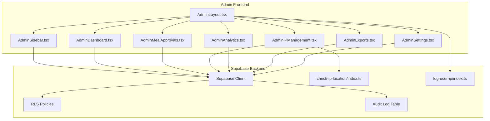
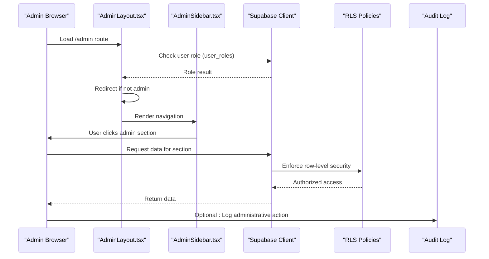
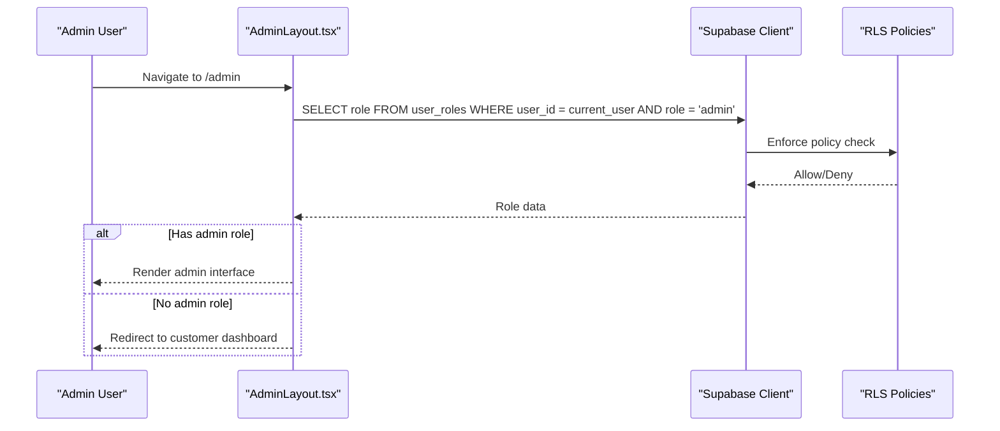
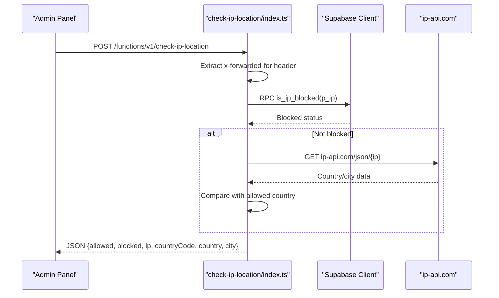
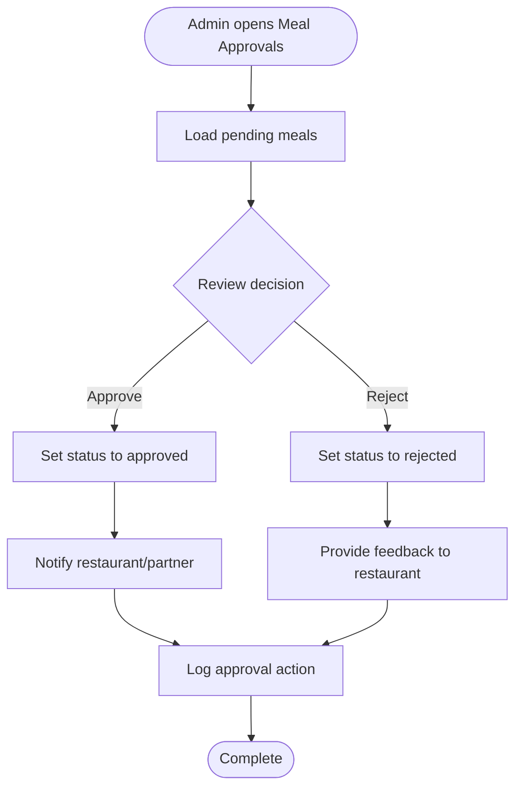
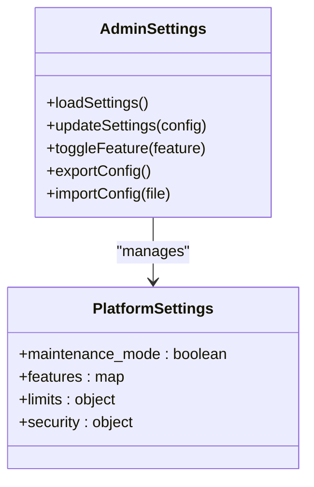
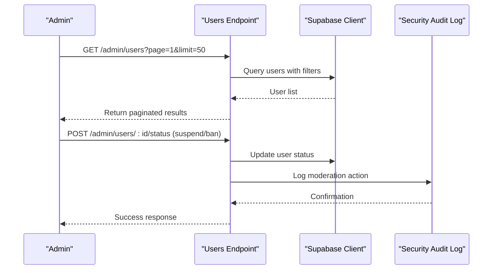
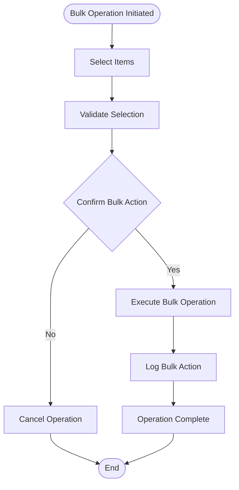
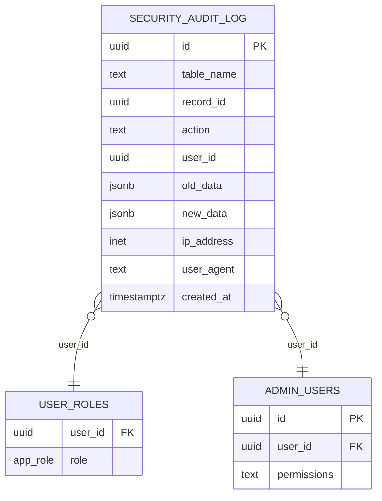
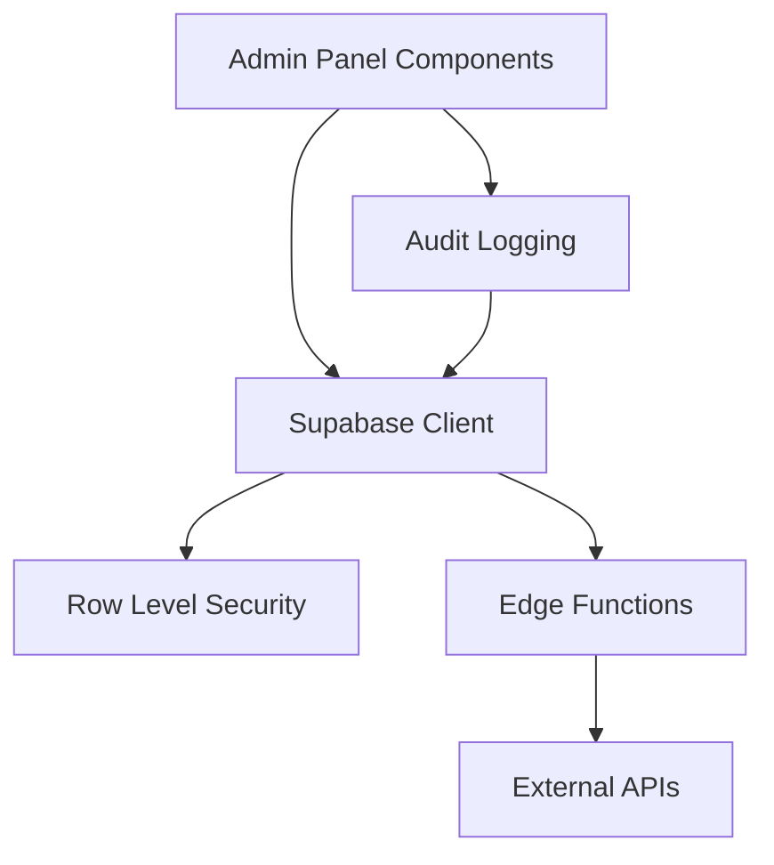

# Administrative Endpoints

<cite>
**Referenced Files in This Document**
- [AdminSidebar.tsx](file://src/components/AdminSidebar.tsx)
- [AdminLayout.tsx](file://src/components/AdminLayout.tsx)
- [AdminDashboard.tsx](file://src/pages/admin/AdminDashboard.tsx)
- [AdminMealApprovals.tsx](file://src/pages/admin/AdminMealApprovals.tsx)
- [AdminIPManagement.tsx](file://src/pages/admin/AdminIPManagement.tsx)
- [AdminAnalytics.tsx](file://src/pages/admin/AdminAnalytics.tsx)
- [AdminExports.tsx](file://src/pages/admin/AdminExports.tsx)
- [AdminSettings.tsx](file://src/pages/admin/AdminSettings.tsx)
- [check-ip-location/index.ts](file://supabase/functions/check-ip-location/index.ts)
- [log-user-ip/index.ts](file://supabase/functions/log-user-ip/index.ts)
- [20250218000002_rls_audit_and_policies.sql](file://supabase/migrations/20250218000002_rls_audit_and_policies.sql)
- [20250220000000_create_essential_tables.sql](file://supabase/migrations/20250220000000_create_essential_tables.sql)
- [20250220000001_fix_ip_rls_policies.sql](file://supabase/migrations/20250220000001_fix_ip_rls_policies.sql)
- [20250219000003_grant_admin_role.sql](file://supabase/migrations/20250219000003_grant_admin_role.sql)
- [setup-admin-role.mjs](file://setup-admin-role.mjs)
- [auth.spec.ts](file://e2e/admin/auth.spec.ts)
- [ip_management.spec.ts](file://e2e/admin/ip_management.spec.ts)
- [admin_integration_test_results.json](file://admin_integration_test_results.json)
</cite>

## Table of Contents
1. [Introduction](#introduction)
2. [Project Structure](#project-structure)
3. [Core Components](#core-components)
4. [Architecture Overview](#architecture-overview)
5. [Detailed Component Analysis](#detailed-component-analysis)
6. [Dependency Analysis](#dependency-analysis)
7. [Performance Considerations](#performance-considerations)
8. [Troubleshooting Guide](#troubleshooting-guide)
9. [Conclusion](#conclusion)

## Introduction
This document provides comprehensive REST API documentation for administrative endpoints within the system. It covers administrative capabilities for system configuration, user moderation, content management, operational controls, IP management, content approval workflows, system maintenance, and emergency controls. It also documents administrative user management, permission delegation, and audit logging, along with examples for bulk operations, system health checks, and disaster recovery procedures. Security considerations for administrative access and role-based restrictions are included.

## Project Structure
The administrative interface is implemented as a React-based admin panel integrated with Supabase for authentication, authorization, and data access. Administrative routes are defined in the sidebar and protected by role-based access control. Backend functionality for IP management and user activity logging is implemented via Supabase Edge Functions.

**Diagram sources**
- [AdminLayout.tsx:25-128](file://src/components/AdminLayout.tsx#L25-L128)
- [AdminSidebar.tsx:43-66](file://src/components/AdminSidebar.tsx#L43-L66)
- [AdminDashboard.tsx](file://src/pages/admin/AdminDashboard.tsx)
- [AdminMealApprovals.tsx](file://src/pages/admin/AdminMealApprovals.tsx)
- [AdminIPManagement.tsx](file://src/pages/admin/AdminIPManagement.tsx)
- [AdminAnalytics.tsx](file://src/pages/admin/AdminAnalytics.tsx)
- [AdminExports.tsx](file://src/pages/admin/AdminExports.tsx)
- [AdminSettings.tsx](file://src/pages/admin/AdminSettings.tsx)
- [check-ip-location/index.ts:1-107](file://supabase/functions/check-ip-location/index.ts#L1-L107)
- [log-user-ip/index.ts:1-65](file://supabase/functions/log-user-ip/index.ts#L1-L65)
- [20250218000002_rls_audit_and_policies.sql:1-356](file://supabase/migrations/20250218000002_rls_audit_and_policies.sql#L1-L356)

**Section sources**
- [AdminSidebar.tsx:43-66](file://src/components/AdminSidebar.tsx#L43-L66)
- [AdminLayout.tsx:25-128](file://src/components/AdminLayout.tsx#L25-L128)

## Core Components
- AdminLayout: Provides role-based access control and renders the admin sidebar and main content area.
- AdminSidebar: Defines navigation links for administrative sections including dashboard, restaurants, meal approvals, featured content, users, orders, subscriptions, payouts, analytics, exports, settings, and IP management.
- Supabase Edge Functions: Implement IP location verification and user IP logging for security and audit purposes.
- Supabase Row Level Security (RLS): Enforces role-based access policies across core tables and admin-specific tables.

Key administrative routes:
- /admin: Dashboard
- /admin/restaurants: Restaurant management
- /admin/meal-approvals: Content approval workflows
- /admin/featured: Featured content management
- /admin/users: User moderation
- /admin/orders: Order management
- /admin/subscriptions: Subscription management
- /admin/payouts: Payout management
- /admin/premium-analytics: Premium analytics
- /admin/profit: Income & profit reporting
- /admin/affiliate-applications: Affiliate applications
- /admin/affiliate-payouts: Affiliate payouts
- /admin/affiliate-milestones: Affiliate milestones
- /admin/streak-rewards: Streak rewards
- /admin/diet-tags: Diet tags management
- /admin/promotions: Promotions management
- /admin/notifications: Announcements management
- /admin/support: Support management
- /admin/analytics: Analytics and reporting
- /admin/exports: Data exports
- /admin/settings: System settings
- /admin/ip-management: IP management

**Section sources**
- [AdminSidebar.tsx:43-66](file://src/components/AdminSidebar.tsx#L43-L66)
- [AdminLayout.tsx:25-128](file://src/components/AdminLayout.tsx#L25-L128)

## Architecture Overview
The admin architecture combines a frontend React admin panel with Supabase for authentication, authorization, and data persistence. Edge Functions provide specialized administrative services such as IP location verification and user activity logging. RLS policies ensure that only authorized administrators can access sensitive administrative endpoints.

**Diagram sources**
- [AdminLayout.tsx:39-67](file://src/components/AdminLayout.tsx#L39-L67)
- [AdminSidebar.tsx:68-114](file://src/components/AdminSidebar.tsx#L68-L114)
- [20250218000002_rls_audit_and_policies.sql:275-286](file://supabase/migrations/20250218000002_rls_audit_and_policies.sql#L275-L286)

## Detailed Component Analysis

### Authentication and Authorization
Administrative access is controlled through role-based permissions enforced by Supabase RLS. The admin layout component queries the user_roles table to verify admin privileges before rendering the admin interface.

**Diagram sources**
- [AdminLayout.tsx:39-67](file://src/components/AdminLayout.tsx#L39-L67)
- [20250220000000_create_essential_tables.sql:127-135](file://supabase/migrations/20250220000000_create_essential_tables.sql#L127-L135)

**Section sources**
- [AdminLayout.tsx:39-67](file://src/components/AdminLayout.tsx#L39-L67)
- [20250220000000_create_essential_tables.sql:127-135](file://supabase/migrations/20250220000000_create_essential_tables.sql#L127-L135)

### IP Management and Location Verification
The IP management endpoint integrates with a Supabase Edge Function that verifies client IP locations against configured policies and maintains audit trails.

**Diagram sources**
- [check-ip-location/index.ts:26-94](file://supabase/functions/check-ip-location/index.ts#L26-L94)
- [20250218000002_rls_audit_and_policies.sql:275-286](file://supabase/migrations/20250218000002_rls_audit_and_policies.sql#L275-L286)

**Section sources**
- [AdminIPManagement.tsx](file://src/pages/admin/AdminIPManagement.tsx)
- [check-ip-location/index.ts:1-107](file://supabase/functions/check-ip-location/index.ts#L1-L107)

### Content Approval Workflows
The meal approvals endpoint manages content review and approval processes, integrating with restaurant and meal data.

**Diagram sources**
- [AdminMealApprovals.tsx](file://src/pages/admin/AdminMealApprovals.tsx)

**Section sources**
- [AdminMealApprovals.tsx](file://src/pages/admin/AdminMealApprovals.tsx)

### System Configuration and Settings
Administrative settings management includes platform-wide configuration controls and operational parameters.

**Diagram sources**
- [AdminSettings.tsx](file://src/pages/admin/AdminSettings.tsx)

**Section sources**
- [AdminSettings.tsx](file://src/pages/admin/AdminSettings.tsx)

### User Moderation and Management
User moderation capabilities include user search, profile review, account status management, and role assignment.

**Diagram sources**
- [AdminLayout.tsx:39-67](file://src/components/AdminLayout.tsx#L39-L67)
- [20250218000002_rls_audit_and_policies.sql:275-286](file://supabase/migrations/20250218000002_rls_audit_and_policies.sql#L275-L286)

**Section sources**
- [AdminLayout.tsx:39-67](file://src/components/AdminLayout.tsx#L39-L67)

### Operational Controls and Bulk Operations
Operational controls enable bulk actions across users, orders, and content, with safeguards and audit logging.

**Diagram sources**
- [AdminExports.tsx](file://src/pages/admin/AdminExports.tsx)
- [20250218000002_rls_audit_and_policies.sql:275-286](file://supabase/migrations/20250218000002_rls_audit_and_policies.sql#L275-L286)

**Section sources**
- [AdminExports.tsx](file://src/pages/admin/AdminExports.tsx)

### Audit Logging and Compliance
Security audit logging captures administrative actions, user sessions, and system events for compliance and monitoring.

**Diagram sources**
- [20250218000002_rls_audit_and_policies.sql:275-286](file://supabase/migrations/20250218000002_rls_audit_and_policies.sql#L275-L286)

**Section sources**
- [20250218000002_rls_audit_and_policies.sql:275-286](file://supabase/migrations/20250218000002_rls_audit_and_policies.sql#L275-L286)

## Dependency Analysis
Administrative functionality depends on Supabase for authentication, authorization, and data persistence. Edge Functions provide specialized services for IP verification and user logging. RLS policies govern access to administrative data.

**Diagram sources**
- [AdminLayout.tsx:16-31](file://src/components/AdminLayout.tsx#L16-L31)
- [check-ip-location/index.ts:21-24](file://supabase/functions/check-ip-location/index.ts#L21-L24)
- [log-user-ip/index.ts:19-22](file://supabase/functions/log-user-ip/index.ts#L19-L22)

**Section sources**
- [AdminLayout.tsx:16-31](file://src/components/AdminLayout.tsx#L16-L31)
- [20250218000002_rls_audit_and_policies.sql:1-356](file://supabase/migrations/20250218000002_rls_audit_and_policies.sql#L1-L356)

## Performance Considerations
- Use pagination for large datasets in administrative views to minimize payload sizes.
- Implement caching for frequently accessed configuration data.
- Optimize database queries with appropriate indexing on administrative endpoints.
- Monitor Edge Function execution times and consider scaling for high-volume operations.

## Troubleshooting Guide
Common administrative access issues and resolutions:
- Access Denied: Verify admin role assignment in user_roles table and ensure RLS policies are properly configured.
- IP Blocking Issues: Check IP blocklist entries and verify Edge Function IP resolution headers.
- Audit Log Access: Confirm admin-only access policy for security_audit_log table.
- Authentication Failures: Validate Supabase service role keys and JWT configuration.

**Section sources**
- [AdminLayout.tsx:50-58](file://src/components/AdminLayout.tsx#L50-L58)
- [20250219000003_grant_admin_role.sql:1-33](file://supabase/migrations/20250219000003_grant_admin_role.sql#L1-L33)
- [20250220000001_fix_ip_rls_policies.sql:47-56](file://supabase/migrations/20250220000001_fix_ip_rls_policies.sql#L47-L56)

## Conclusion
The administrative endpoints provide comprehensive controls for system management, user moderation, content governance, and operational oversight. The implementation leverages Supabase RLS for robust role-based access control, Edge Functions for specialized services, and audit logging for compliance. Administrators can efficiently manage system operations while maintaining security and transparency through well-defined workflows and safeguards.