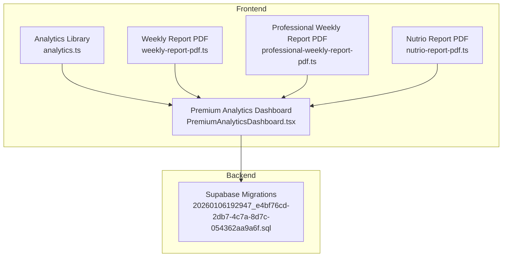
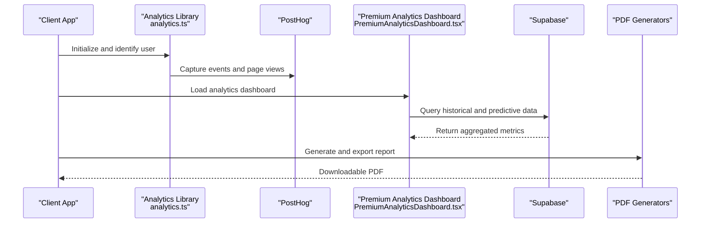
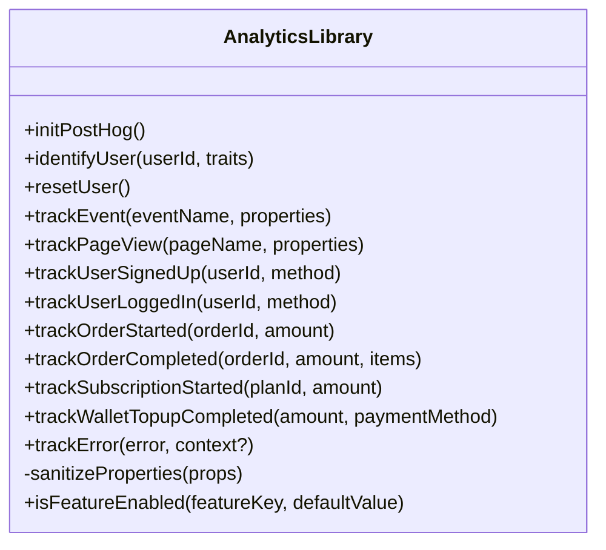
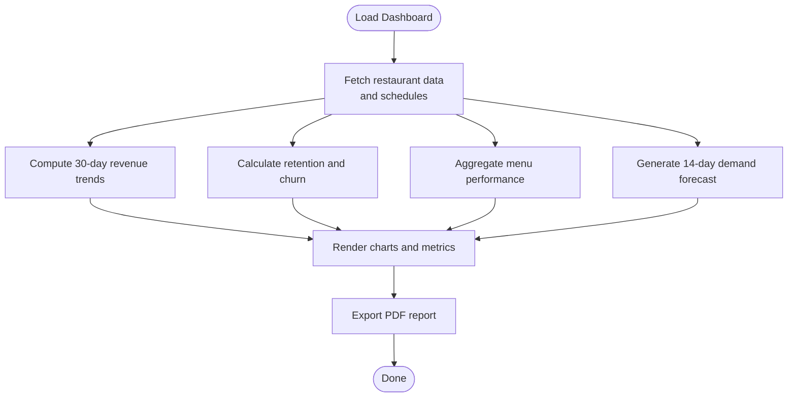
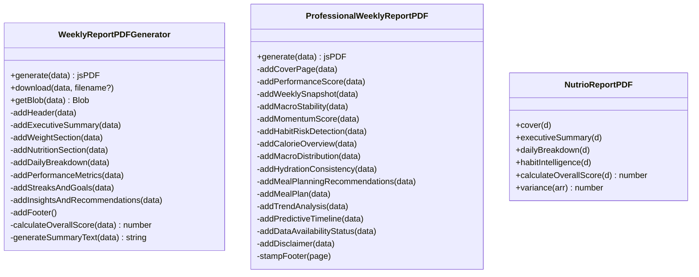
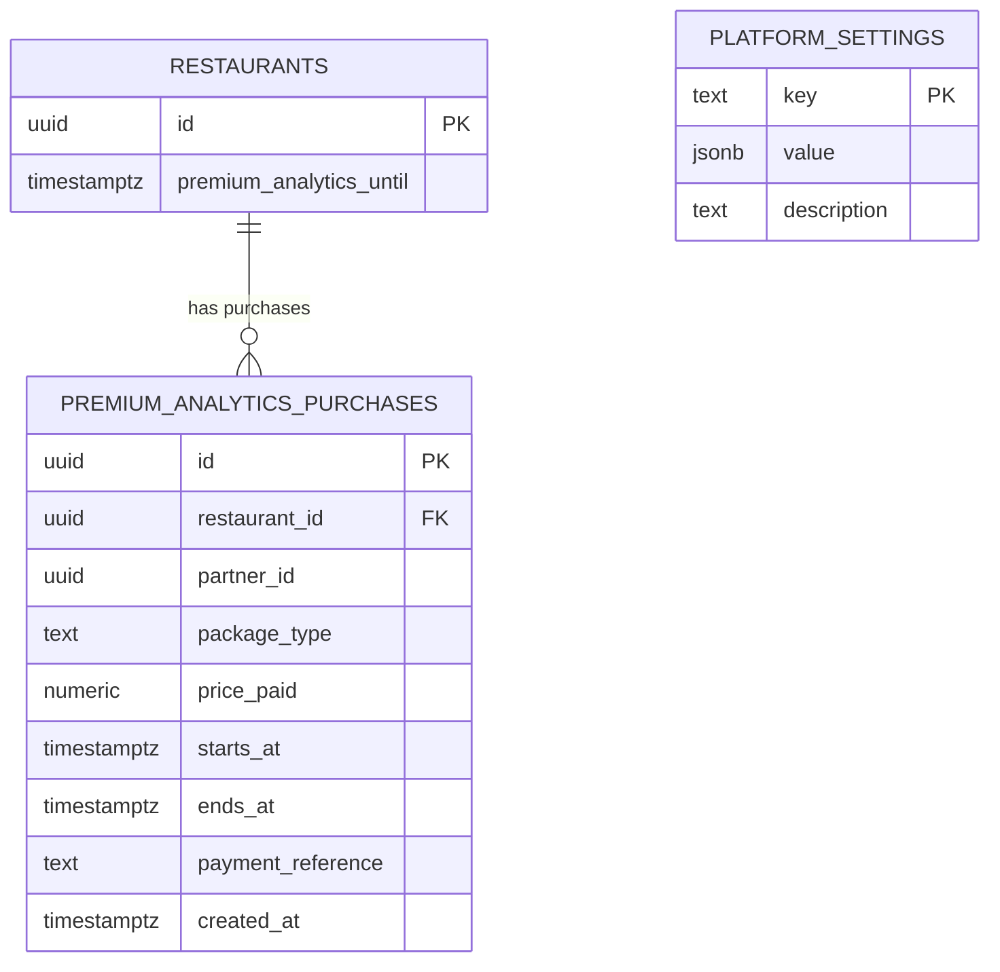
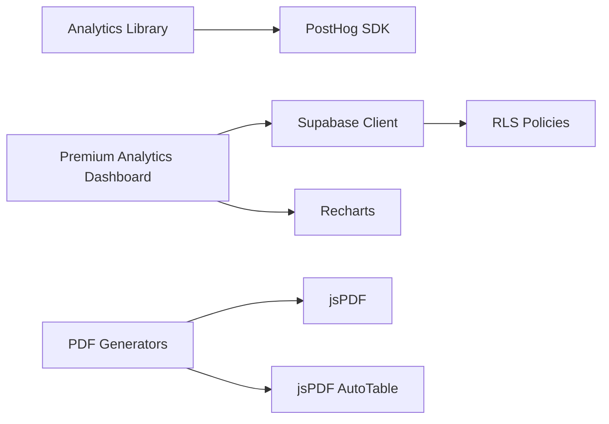

# Analytics & Reporting Endpoints

<cite>
**Referenced Files in This Document**
- [analytics.ts](file://src/lib/analytics.ts)
- [PremiumAnalyticsDashboard.tsx](file://src/components/PremiumAnalyticsDashboard.tsx)
- [analytics.spec.ts](file://e2e/admin/analytics.spec.ts)
- [reports.spec.ts](file://e2e/admin/reports.spec.ts)
- [20260106192947_e4bf76cd-2db7-4c7a-8d7c-054362aa9a6f.sql](file://supabase/migrations/20260106192947_e4bf76cd-2db7-4c7a-8d7c-054362aa9a6f.sql)
- [weekly-report-pdf.ts](file://src/lib/weekly-report-pdf.ts)
- [professional-weekly-report-pdf.ts](file://src/lib/professional-weekly-report-pdf.ts)
- [nutrio-report-pdf.ts](file://src/lib/nutrio-report-pdf.ts)
</cite>

## Table of Contents
1. [Introduction](#introduction)
2. [Project Structure](#project-structure)
3. [Core Components](#core-components)
4. [Architecture Overview](#architecture-overview)
5. [Detailed Component Analysis](#detailed-component-analysis)
6. [Dependency Analysis](#dependency-analysis)
7. [Performance Considerations](#performance-considerations)
8. [Troubleshooting Guide](#troubleshooting-guide)
9. [Conclusion](#conclusion)

## Introduction
This document provides comprehensive REST API documentation for analytics and reporting endpoints across business metrics, user behavior analytics, financial reporting, and operational dashboards. It covers data export capabilities, custom report generation, automated reporting schedules, KPI tracking, trend analysis, performance monitoring, real-time analytics, historical data queries, and executive reporting. It also documents data privacy considerations and compliance reporting features.

## Project Structure
The analytics and reporting functionality spans frontend components, backend Supabase migrations, and PDF generation utilities:
- Frontend analytics instrumentation and dashboards
- Premium analytics dashboard with historical and predictive views
- Automated report generation via PDF libraries
- Database schema supporting premium analytics subscriptions and pricing

**Diagram sources**
- [analytics.ts:1-170](file://src/lib/analytics.ts#L1-L170)
- [PremiumAnalyticsDashboard.tsx:1-800](file://src/components/PremiumAnalyticsDashboard.tsx#L1-L800)
- [weekly-report-pdf.ts:1-766](file://src/lib/weekly-report-pdf.ts#L1-L766)
- [professional-weekly-report-pdf.ts:1-800](file://src/lib/professional-weekly-report-pdf.ts#L1-L800)
- [nutrio-report-pdf.ts:1-800](file://src/lib/nutrio-report-pdf.ts#L1-L800)
- [20260106192947_e4bf76cd-2db7-4c7a-8d7c-054362aa9a6f.sql:1-48](file://supabase/migrations/20260106192947_e4bf76cd-2db7-4c7a-8d7c-054362aa9a6f.sql#L1-L48)

**Section sources**
- [analytics.ts:1-170](file://src/lib/analytics.ts#L1-L170)
- [PremiumAnalyticsDashboard.tsx:1-800](file://src/components/PremiumAnalyticsDashboard.tsx#L1-L800)
- [weekly-report-pdf.ts:1-766](file://src/lib/weekly-report-pdf.ts#L1-L766)
- [professional-weekly-report-pdf.ts:1-800](file://src/lib/professional-weekly-report-pdf.ts#L1-L800)
- [nutrio-report-pdf.ts:1-800](file://src/lib/nutrio-report-pdf.ts#L1-L800)
- [20260106192947_e4bf76cd-2db7-4c7a-8d7c-054362aa9a6f.sql:1-48](file://supabase/migrations/20260106192947_e4bf76cd-2db7-4c7a-8d7c-054362aa9a6f.sql#L1-L48)

## Core Components
- Analytics instrumentation library for event tracking, user identification, and privacy-safe property sanitization
- Premium analytics dashboard for revenue trends, customer retention, peak hours, menu performance, and forecasting
- PDF report generators for weekly and professional reports with export capabilities
- Supabase migration enabling premium analytics subscriptions and pricing configuration

Key capabilities:
- Real-time analytics via PostHog integration
- Historical data queries for 30-day and 90-day trends
- Exportable reports in PDF format
- Subscription-based premium analytics access control

**Section sources**
- [analytics.ts:1-170](file://src/lib/analytics.ts#L1-L170)
- [PremiumAnalyticsDashboard.tsx:1-800](file://src/components/PremiumAnalyticsDashboard.tsx#L1-L800)
- [weekly-report-pdf.ts:1-766](file://src/lib/weekly-report-pdf.ts#L1-L766)
- [professional-weekly-report-pdf.ts:1-800](file://src/lib/professional-weekly-report-pdf.ts#L1-L800)
- [nutrio-report-pdf.ts:1-800](file://src/lib/nutrio-report-pdf.ts#L1-L800)
- [20260106192947_e4bf76cd-2db7-4c7a-8d7c-054362aa9a6f.sql:1-48](file://supabase/migrations/20260106192947_e4bf76cd-2db7-4c7a-8d7c-054362aa9a6f.sql#L1-L48)

## Architecture Overview
The analytics and reporting architecture integrates frontend instrumentation with backend data access and PDF generation:
- Analytics events are captured client-side and sent to PostHog
- Premium analytics dashboard queries Supabase tables for historical and predictive insights
- PDF generators produce exportable reports for executive consumption

**Diagram sources**
- [analytics.ts:1-170](file://src/lib/analytics.ts#L1-L170)
- [PremiumAnalyticsDashboard.tsx:1-800](file://src/components/PremiumAnalyticsDashboard.tsx#L1-L800)
- [weekly-report-pdf.ts:1-766](file://src/lib/weekly-report-pdf.ts#L1-L766)
- [professional-weekly-report-pdf.ts:1-800](file://src/lib/professional-weekly-report-pdf.ts#L1-L800)
- [nutrio-report-pdf.ts:1-800](file://src/lib/nutrio-report-pdf.ts#L1-L800)

## Detailed Component Analysis

### Analytics Instrumentation
The analytics library provides:
- Initialization with environment-specific configuration
- User identification and event tracking
- Privacy-safe property sanitization
- Predefined event categories for common actions

**Diagram sources**
- [analytics.ts:1-170](file://src/lib/analytics.ts#L1-L170)

**Section sources**
- [analytics.ts:1-170](file://src/lib/analytics.ts#L1-L170)

### Premium Analytics Dashboard
The premium dashboard aggregates:
- Revenue trends over 30 days with projections
- Customer retention and churn analysis
- Menu performance classification
- Demand forecasting calendar
- Exportable PDF report

**Diagram sources**
- [PremiumAnalyticsDashboard.tsx:185-526](file://src/components/PremiumAnalyticsDashboard.tsx#L185-L526)

**Section sources**
- [PremiumAnalyticsDashboard.tsx:1-800](file://src/components/PremiumAnalyticsDashboard.tsx#L1-L800)

### PDF Report Generation
Multiple PDF generators support:
- Weekly progress reports with metrics and recommendations
- Professional weekly reports with advanced insights and habit intelligence
- Specialized reports for nutrition tracking

**Diagram sources**
- [weekly-report-pdf.ts:93-766](file://src/lib/weekly-report-pdf.ts#L93-L766)
- [professional-weekly-report-pdf.ts:127-192](file://src/lib/professional-weekly-report-pdf.ts#L127-L192)
- [nutrio-report-pdf.ts:105-800](file://src/lib/nutrio-report-pdf.ts#L105-L800)

**Section sources**
- [weekly-report-pdf.ts:1-766](file://src/lib/weekly-report-pdf.ts#L1-L766)
- [professional-weekly-report-pdf.ts:1-800](file://src/lib/professional-weekly-report-pdf.ts#L1-L800)
- [nutrio-report-pdf.ts:1-800](file://src/lib/nutrio-report-pdf.ts#L1-L800)

### Supabase Schema for Premium Analytics
The migration defines:
- Premium analytics subscription tracking on restaurants
- Purchase records with RLS policies
- Platform settings for pricing tiers

**Diagram sources**
- [20260106192947_e4bf76cd-2db7-4c7a-8d7c-054362aa9a6f.sql:1-48](file://supabase/migrations/20260106192947_e4bf76cd-2db7-4c7a-8d7c-054362aa9a6f.sql#L1-L48)

**Section sources**
- [20260106192947_e4bf76cd-2db7-4c7a-8d7c-054362aa9a6f.sql:1-48](file://supabase/migrations/20260106192947_e4bf76cd-2db7-4c7a-8d7c-054362aa9a6f.sql#L1-L48)

## Dependency Analysis
- Analytics library depends on PostHog SDK and environment variables
- Premium dashboard depends on Supabase client and recharts for visualization
- PDF generators depend on jsPDF and optional autoTable for tabular data
- Supabase migration enforces RLS policies for secure access

**Diagram sources**
- [analytics.ts:1-170](file://src/lib/analytics.ts#L1-L170)
- [PremiumAnalyticsDashboard.tsx:1-800](file://src/components/PremiumAnalyticsDashboard.tsx#L1-L800)
- [weekly-report-pdf.ts:1-766](file://src/lib/weekly-report-pdf.ts#L1-L766)
- [professional-weekly-report-pdf.ts:1-800](file://src/lib/professional-weekly-report-pdf.ts#L1-L800)
- [nutrio-report-pdf.ts:1-800](file://src/lib/nutrio-report-pdf.ts#L1-L800)
- [20260106192947_e4bf76cd-2db7-4c7a-8d7c-054362aa9a6f.sql:1-48](file://supabase/migrations/20260106192947_e4bf76cd-2db7-4c7a-8d7c-054362aa9a6f.sql#L1-L48)

**Section sources**
- [analytics.ts:1-170](file://src/lib/analytics.ts#L1-L170)
- [PremiumAnalyticsDashboard.tsx:1-800](file://src/components/PremiumAnalyticsDashboard.tsx#L1-L800)
- [weekly-report-pdf.ts:1-766](file://src/lib/weekly-report-pdf.ts#L1-L766)
- [professional-weekly-report-pdf.ts:1-800](file://src/lib/professional-weekly-report-pdf.ts#L1-L800)
- [nutrio-report-pdf.ts:1-800](file://src/lib/nutrio-report-pdf.ts#L1-L800)
- [20260106192947_e4bf76cd-2db7-4c7a-8d7c-054362aa9a6f.sql:1-48](file://supabase/migrations/20260106192947_e4bf76cd-2db7-4c7a-8d7c-054362aa9a6f.sql#L1-L48)

## Performance Considerations
- Client-side analytics minimize server load while providing real-time insights
- Dashboard computations aggregate data locally for responsive rendering
- PDF generation occurs client-side to reduce backend processing overhead
- Supabase queries use targeted filters and date ranges to limit payload size

## Troubleshooting Guide
Common issues and resolutions:
- Analytics not capturing events: verify PostHog initialization and environment variables
- Dashboard data missing: confirm Supabase connection and table permissions
- PDF generation failures: ensure jsPDF and autoTable are properly imported
- Subscription access denied: check RLS policies and user roles

**Section sources**
- [analytics.ts:1-170](file://src/lib/analytics.ts#L1-L170)
- [PremiumAnalyticsDashboard.tsx:1-800](file://src/components/PremiumAnalyticsDashboard.tsx#L1-L800)
- [weekly-report-pdf.ts:1-766](file://src/lib/weekly-report-pdf.ts#L1-L766)
- [professional-weekly-report-pdf.ts:1-800](file://src/lib/professional-weekly-report-pdf.ts#L1-L800)
- [nutrio-report-pdf.ts:1-800](file://src/lib/nutrio-report-pdf.ts#L1-L800)
- [20260106192947_e4bf76cd-2db7-4c7a-8d7c-054362aa9a6f.sql:1-48](file://supabase/migrations/20260106192947_e4bf76cd-2db7-4c7a-8d7c-054362aa9a6f.sql#L1-L48)

## Conclusion
The analytics and reporting system combines client-side instrumentation, server-backed data aggregation, and export-ready PDF generation to deliver comprehensive insights. Premium subscriptions enable advanced dashboards and forecasting, while robust privacy controls and RLS policies ensure secure access to sensitive data.