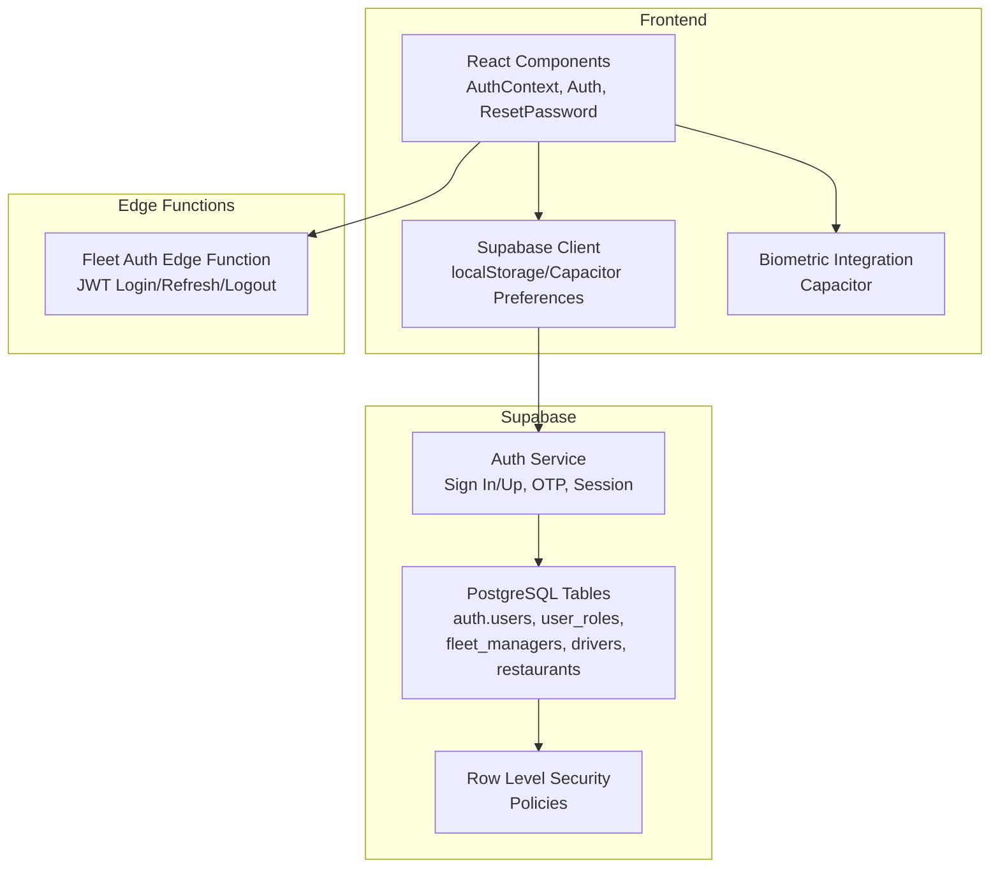
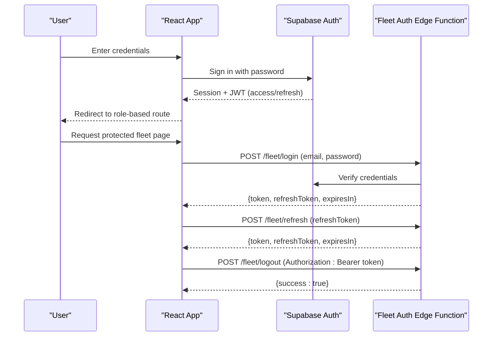
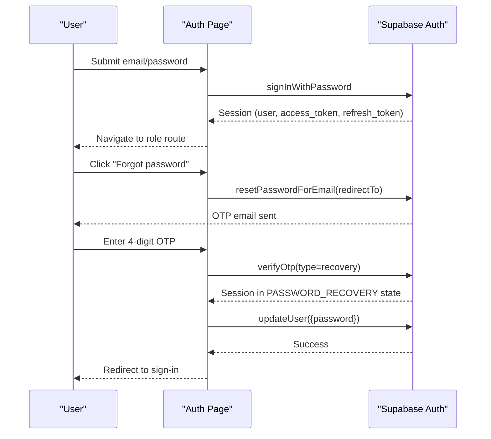
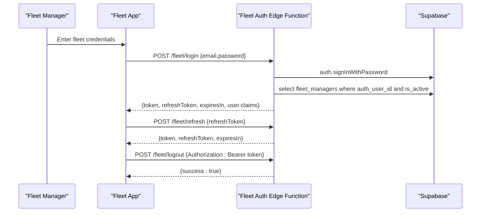
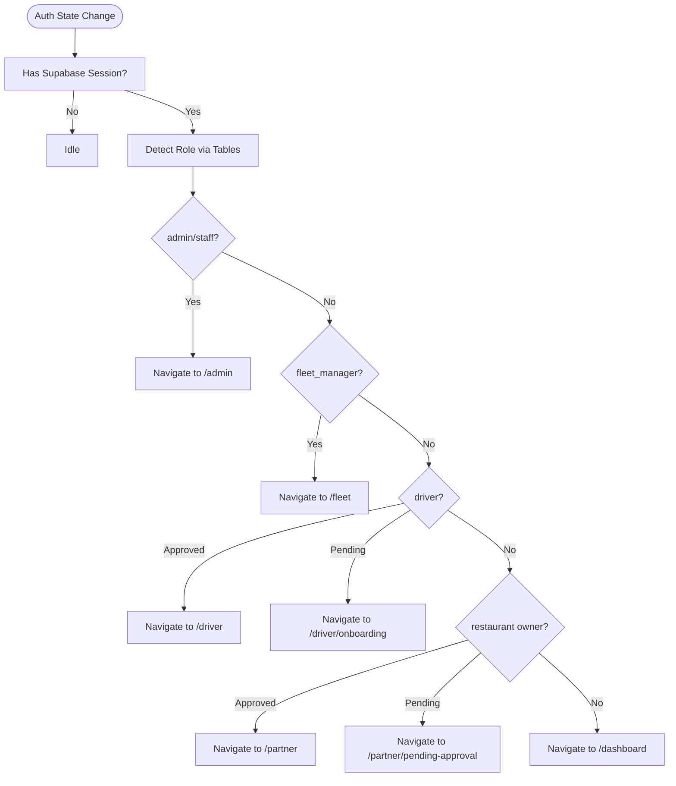
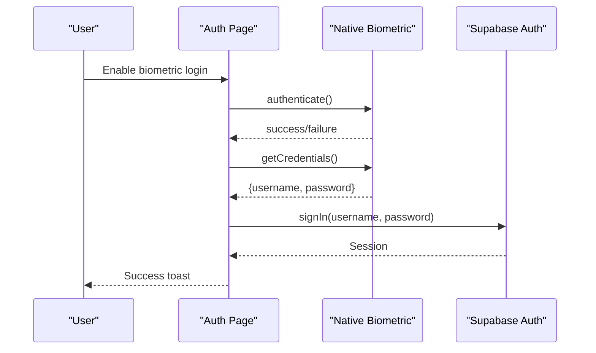
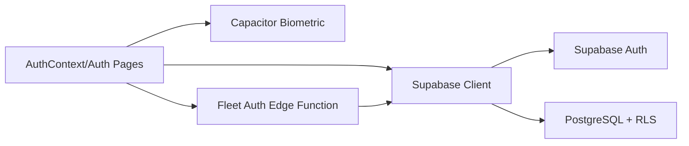

# Authentication Endpoints

<cite>
**Referenced Files in This Document**
- [AuthContext.tsx](file://src/contexts/AuthContext.tsx)
- [Auth.tsx](file://src/pages/Auth.tsx)
- [ResetPassword.tsx](file://src/pages/ResetPassword.tsx)
- [client.ts](file://src/integrations/supabase/client.ts)
- [capacitor.ts](file://src/lib/capacitor.ts)
- [index.ts](file://supabase/functions/fleet-auth/index.ts)
- [20250218000002_rls_audit_and_policies.sql](file://supabase/migrations/20250218000002_rls_audit_and_policies.sql)
- [20260302000000_e2e_test_setup.sql](file://supabase/migrations/20260302000000_e2e_test_setup.sql)
- [ManageRolesDialog.tsx](file://src/components/admin/ManageRolesDialog.tsx)
</cite>

## Table of Contents
1. [Introduction](#introduction)
2. [Project Structure](#project-structure)
3. [Core Components](#core-components)
4. [Architecture Overview](#architecture-overview)
5. [Detailed Component Analysis](#detailed-component-analysis)
6. [Dependency Analysis](#dependency-analysis)
7. [Performance Considerations](#performance-considerations)
8. [Troubleshooting Guide](#troubleshooting-guide)
9. [Conclusion](#conclusion)
10. [Appendices](#appendices)

## Introduction
This document provides comprehensive REST API documentation for authentication endpoints across the system. It covers:
- Login and logout flows for the main customer portal
- Password reset via OTP verification
- Email confirmation and redirection flows
- Session management using Supabase Auth
- JWT token handling and refresh token mechanisms for the fleet management portal
- Role-based access control (RBAC) and row-level security (RLS)
- Client-side implementation patterns for React and mobile apps
- Security considerations and error handling

## Project Structure
Authentication spans three layers:
- Frontend React app with Supabase integration and local/native storage
- Supabase Auth for primary user management, OTP, and session persistence
- Edge function for fleet portal JWT login/refresh/logout with role-scoped claims

**Diagram sources**
- [AuthContext.tsx:1-131](file://src/contexts/AuthContext.tsx#L1-L131)
- [client.ts:18-57](file://src/integrations/supabase/client.ts#L18-L57)
- [index.ts:275-307](file://supabase/functions/fleet-auth/index.ts#L275-L307)
- [20250218000002_rls_audit_and_policies.sql:1-200](file://supabase/migrations/20250218000002_rls_audit_and_policies.sql#L1-L200)

**Section sources**
- [AuthContext.tsx:1-131](file://src/contexts/AuthContext.tsx#L1-L131)
- [client.ts:18-57](file://src/integrations/supabase/client.ts#L18-L57)
- [index.ts:275-307](file://supabase/functions/fleet-auth/index.ts#L275-L307)
- [20250218000002_rls_audit_and_policies.sql:1-200](file://supabase/migrations/20250218000002_rls_audit_and_policies.sql#L1-L200)

## Core Components
- Supabase Auth integration for email/password, OTP, and session persistence
- React context managing auth state, sign-in/sign-up, and sign-out
- Password reset flow with OTP verification and secure redirection
- Fleet portal JWT endpoints for login, refresh, and logout with role-scoped claims
- Biometric authentication for native clients
- RBAC and RLS enforcing access per user roles and resource ownership

**Section sources**
- [AuthContext.tsx:1-131](file://src/contexts/AuthContext.tsx#L1-L131)
- [Auth.tsx:1-800](file://src/pages/Auth.tsx#L1-L800)
- [ResetPassword.tsx:1-272](file://src/pages/ResetPassword.tsx#L1-L272)
- [client.ts:18-57](file://src/integrations/supabase/client.ts#L18-L57)
- [index.ts:35-90](file://supabase/functions/fleet-auth/index.ts#L35-L90)
- [capacitor.ts:503-581](file://src/lib/capacitor.ts#L503-L581)
- [20250218000002_rls_audit_and_policies.sql:56-96](file://supabase/migrations/20250218000002_rls_audit_and_policies.sql#L56-L96)

## Architecture Overview
High-level authentication architecture:
- Frontend authenticates via Supabase Auth for standard user flows
- Fleet portal uses custom JWT issued by an edge function
- Sessions are persisted in browser/local storage or Capacitor preferences
- Backend enforces RBAC and RLS policies

**Diagram sources**
- [Auth.tsx:169-203](file://src/pages/Auth.tsx#L169-L203)
- [client.ts:47-57](file://src/integrations/supabase/client.ts#L47-L57)
- [index.ts:90-174](file://supabase/functions/fleet-auth/index.ts#L90-L174)
- [index.ts:176-230](file://supabase/functions/fleet-auth/index.ts#L176-L230)
- [index.ts:232-273](file://supabase/functions/fleet-auth/index.ts#L232-L273)

## Detailed Component Analysis

### Supabase Auth Endpoints (Customer Portal)
- Sign In: Email/password
- Sign Up: Email/password with optional profile data
- Password Reset: Send OTP, verify OTP, update password
- Session Management: Persist session, auto-refresh token, sign out

**Diagram sources**
- [Auth.tsx:169-203](file://src/pages/Auth.tsx#L169-L203)
- [Auth.tsx:216-240](file://src/pages/Auth.tsx#L216-L240)
- [Auth.tsx:257-276](file://src/pages/Auth.tsx#L257-L276)
- [ResetPassword.tsx:57-73](file://src/pages/ResetPassword.tsx#L57-L73)
- [client.ts:47-57](file://src/integrations/supabase/client.ts#L47-L57)

**Section sources**
- [Auth.tsx:169-203](file://src/pages/Auth.tsx#L169-L203)
- [Auth.tsx:216-276](file://src/pages/Auth.tsx#L216-L276)
- [ResetPassword.tsx:57-73](file://src/pages/ResetPassword.tsx#L57-L73)
- [client.ts:47-57](file://src/integrations/supabase/client.ts#L47-L57)

### Fleet Portal JWT Endpoints
- POST /fleet/login: Authenticate with Supabase, validate fleet manager, issue access and refresh JWTs
- POST /fleet/refresh: Validate refresh token, reissue new tokens
- POST /fleet/logout: Optional activity logging; token invalidation requires external revocation list

**Diagram sources**
- [index.ts:90-174](file://supabase/functions/fleet-auth/index.ts#L90-L174)
- [index.ts:176-230](file://supabase/functions/fleet-auth/index.ts#L176-L230)
- [index.ts:232-273](file://supabase/functions/fleet-auth/index.ts#L232-L273)

**Section sources**
- [index.ts:35-90](file://supabase/functions/fleet-auth/index.ts#L35-L90)
- [index.ts:90-174](file://supabase/functions/fleet-auth/index.ts#L90-L174)
- [index.ts:176-230](file://supabase/functions/fleet-auth/index.ts#L176-L230)
- [index.ts:232-273](file://supabase/functions/fleet-auth/index.ts#L232-L273)

### Role-Based Access Control and Session Management
- RBAC roles include user, admin, staff, restaurant, driver, partner, fleet_manager
- RLS policies restrict data visibility by ownership and role
- Sessions persist in localStorage on web and Capacitor Preferences on native

**Diagram sources**
- [Auth.tsx:80-115](file://src/pages/Auth.tsx#L80-L115)
- [20250218000002_rls_audit_and_policies.sql:56-96](file://supabase/migrations/20250218000002_rls_audit_and_policies.sql#L56-L96)

**Section sources**
- [ManageRolesDialog.tsx:30-73](file://src/components/admin/ManageRolesDialog.tsx#L30-L73)
- [Auth.tsx:80-115](file://src/pages/Auth.tsx#L80-L115)
- [20250218000002_rls_audit_and_policies.sql:56-96](file://supabase/migrations/20250218000002_rls_audit_and_policies.sql#L56-L96)

### Multi-Factor Authentication (MFA) and Biometrics
- Biometric login supported on native platforms using Capacitor Native Biometric
- Stores credentials securely for quick biometric sign-in
- Falls back to password sign-in if biometric fails or credentials are missing

**Diagram sources**
- [Auth.tsx:137-167](file://src/pages/Auth.tsx#L137-L167)
- [capacitor.ts:503-581](file://src/lib/capacitor.ts#L503-L581)

**Section sources**
- [Auth.tsx:137-167](file://src/pages/Auth.tsx#L137-L167)
- [capacitor.ts:503-581](file://src/lib/capacitor.ts#L503-L581)

## Dependency Analysis
- Frontend depends on Supabase client for auth operations and local/native storage
- Fleet edge function depends on Supabase Auth service and JWT libraries
- Database relies on RLS policies and user role tables for access control

**Diagram sources**
- [client.ts:47-57](file://src/integrations/supabase/client.ts#L47-L57)
- [index.ts:281-284](file://supabase/functions/fleet-auth/index.ts#L281-L284)
- [20250218000002_rls_audit_and_policies.sql:1-200](file://supabase/migrations/20250218000002_rls_audit_and_policies.sql#L1-L200)

**Section sources**
- [client.ts:47-57](file://src/integrations/supabase/client.ts#L47-L57)
- [index.ts:281-284](file://supabase/functions/fleet-auth/index.ts#L281-L284)
- [20250218000002_rls_audit_and_policies.sql:1-200](file://supabase/migrations/20250218000002_rls_audit_and_policies.sql#L1-L200)

## Performance Considerations
- Supabase Auth handles session persistence and token auto-refresh automatically
- Fleet JWT tokens are short-lived (access ~15 min) to reduce risk exposure
- Consider implementing rate limiting for fleet login attempts and OTP resend requests
- Use CDN caching for static assets and keep API calls minimal during navigation

[No sources needed since this section provides general guidance]

## Troubleshooting Guide
Common issues and resolutions:
- Missing Supabase configuration in build environment leads to initialization warnings
- OTP verification failures indicate expired or invalid token; trigger resend
- Fleet login returns unauthorized if user is not an active fleet manager
- Refresh token validation errors require re-authentication
- Biometric login fails if device lacks enrolled biometrics or stored credentials are missing

**Section sources**
- [client.ts:10-16](file://src/integrations/supabase/client.ts#L10-L16)
- [Auth.tsx:257-276](file://src/pages/Auth.tsx#L257-L276)
- [index.ts:124-129](file://supabase/functions/fleet-auth/index.ts#L124-L129)
- [index.ts:188-194](file://supabase/functions/fleet-auth/index.ts#L188-L194)
- [capacitor.ts:503-581](file://src/lib/capacitor.ts#L503-L581)

## Conclusion
The authentication system combines Supabase Auth for standard user flows with a custom JWT-based fleet portal for role-scoped access. RBAC and RLS ensure strict data governance, while session persistence and biometric support improve UX across web and native clients.

[No sources needed since this section summarizes without analyzing specific files]

## Appendices

### API Definitions

- POST /fleet/login
  - Request: { email, password }
  - Response: { token, refreshToken, expiresIn, user }
  - Errors: 400 invalid input, 401 invalid credentials, 403 not authorized, 500 internal error

- POST /fleet/refresh
  - Request: { refreshToken }
  - Response: { token, refreshToken, expiresIn }
  - Errors: 400 missing token, 401 invalid/expired token, 403 manager not found, 500 internal error

- POST /fleet/logout
  - Request: Authorization: Bearer <token>
  - Response: { success: true }
  - Errors: 401 missing authorization, 500 internal error

- POST /auth/sign_up
  - Request: { email, password, options.data.full_name }
  - Response: { user, session } or error
  - Notes: Redirects to dashboard after sign-up

- POST /auth/sign_in_with_password
  - Request: { email, password }
  - Response: { user, session } or error
  - Notes: Optional IP location check may block login

- POST /auth/reset_password_for_email
  - Request: { email, options.redirectTo }
  - Response: { user, session } or error
  - Notes: Used to initiate password reset flow

- POST /auth/verify_otp
  - Request: { email, token, type: "recovery" }
  - Response: { user, session } or error
  - Notes: Moves session into PASSWORD_RECOVERY state

- PATCH /auth/user
  - Request: { password }
  - Response: { user } or error
  - Notes: Updates user password after OTP verification

**Section sources**
- [index.ts:90-174](file://supabase/functions/fleet-auth/index.ts#L90-L174)
- [index.ts:176-230](file://supabase/functions/fleet-auth/index.ts#L176-L230)
- [index.ts:232-273](file://supabase/functions/fleet-auth/index.ts#L232-L273)
- [Auth.tsx:169-203](file://src/pages/Auth.tsx#L169-L203)
- [Auth.tsx:216-240](file://src/pages/Auth.tsx#L216-L240)
- [Auth.tsx:257-276](file://src/pages/Auth.tsx#L257-L276)
- [ResetPassword.tsx:57-73](file://src/pages/ResetPassword.tsx#L57-L73)

### Headers and Storage
- Authentication headers:
  - Authorization: Bearer <token> (for fleet logout)
- Storage:
  - Web: localStorage
  - Native: Capacitor Preferences
- Redirect URLs:
  - Supabase options.redirectTo for email actions

**Section sources**
- [index.ts:235-241](file://supabase/functions/fleet-auth/index.ts#L235-L241)
- [client.ts:47-57](file://src/integrations/supabase/client.ts#L47-L57)
- [Auth.tsx:66-78](file://src/pages/Auth.tsx#L66-L78)

### Security Considerations
- Short-lived access tokens and long-lived refresh tokens for fleet
- RLS policies enforced on all core tables
- Role-based policies for admin access
- Optional IP location checks for login
- Biometric credential storage on native devices

**Section sources**
- [index.ts:11-12](file://supabase/functions/fleet-auth/index.ts#L11-L12)
- [20250218000002_rls_audit_and_policies.sql:56-96](file://supabase/migrations/20250218000002_rls_audit_and_policies.sql#L56-L96)
- [Auth.tsx:89-100](file://src/pages/Auth.tsx#L89-L100)
- [capacitor.ts:522-533](file://src/lib/capacitor.ts#L522-L533)

### Client Implementation Patterns

- React (Web)
  - Use Supabase client for auth operations
  - Persist sessions with auto-refresh enabled
  - Handle role detection and redirects after auth state changes

- Mobile (Capacitor)
  - Use Capacitor Preferences for session storage
  - Integrate biometric authentication for seamless login
  - Handle deep links for email actions (redirectTo)

**Section sources**
- [client.ts:47-57](file://src/integrations/supabase/client.ts#L47-L57)
- [AuthContext.tsx:36-61](file://src/contexts/AuthContext.tsx#L36-L61)
- [capacitor.ts:18-42](file://src/lib/capacitor.ts#L18-L42)