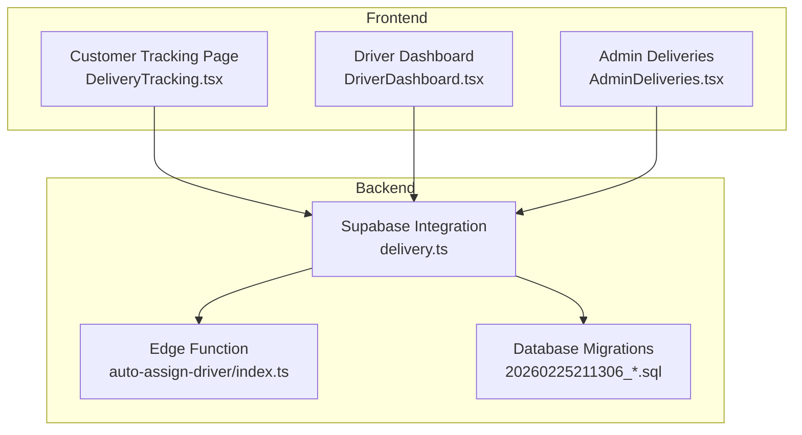
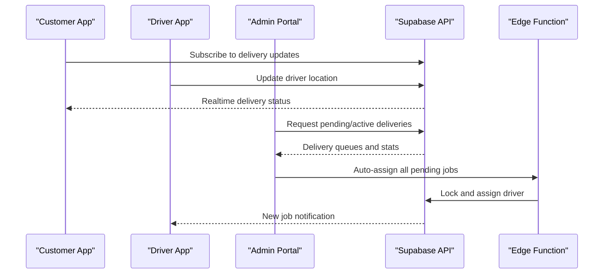
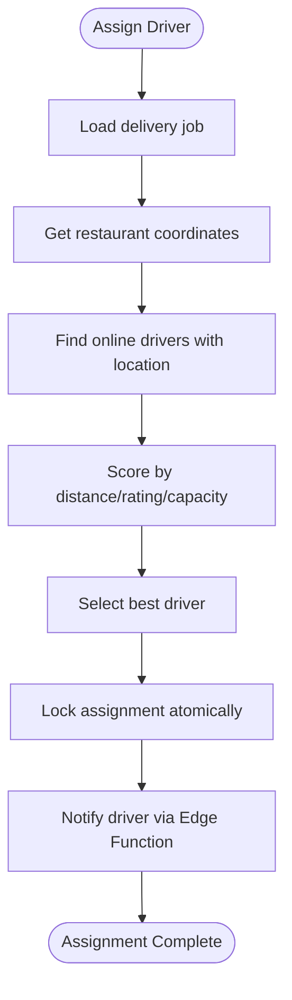
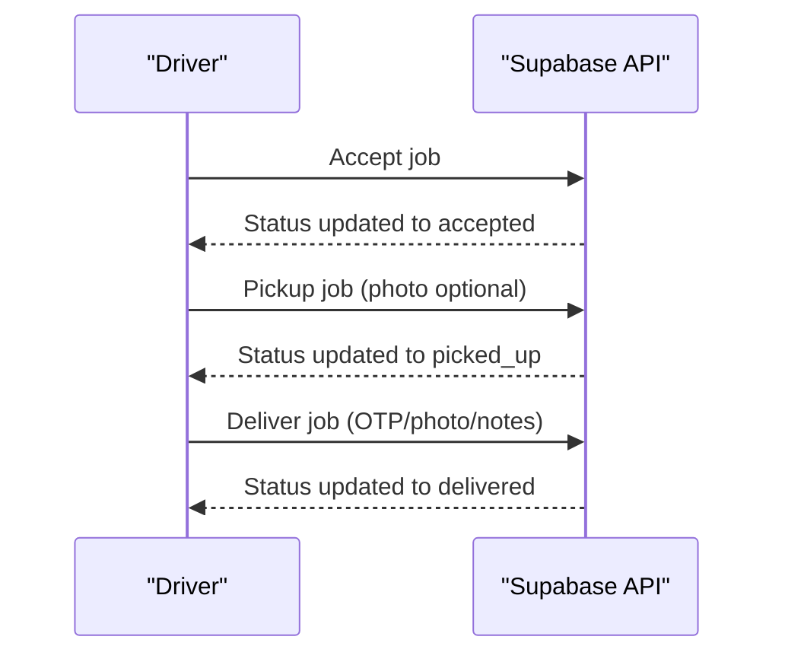
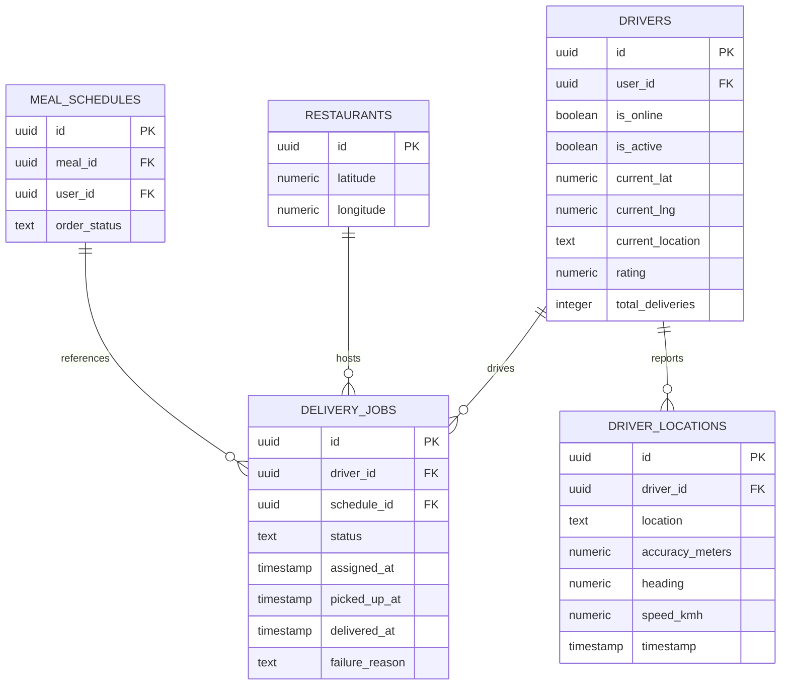
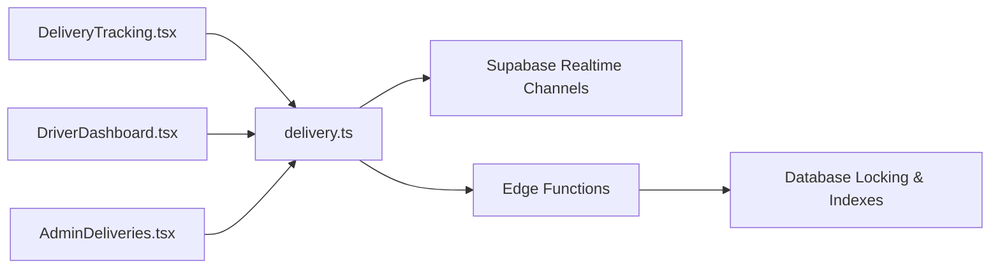

# Delivery & Tracking Endpoints

<cite>
**Referenced Files in This Document**
- [delivery.ts](file://src/integrations/supabase/delivery.ts)
- [types.ts](file://src/integrations/supabase/types.ts)
- [DeliveryTracking.tsx](file://src/pages/DeliveryTracking.tsx)
- [DriverDashboard.tsx](file://src/pages/driver/DriverDashboard.tsx)
- [AdminDeliveries.tsx](file://src/pages/admin/AdminDeliveries.tsx)
- [LiveTracking.tsx](file://delivery_implementation_plan.md)
- [auto-assign-driver/index.ts](file://supabase/functions/auto-assign-driver/index.ts)
- [20260225211306_add_driver_assignment_locking.sql](file://supabase/migrations/20260225211306_add_driver_assignment_locking.sql)
- [delivery_analysis.md](file://delivery_analysis.md)
- [delivery_system_design.md](file://delivery_system_design.md)
</cite>

## Table of Contents
1. [Introduction](#introduction)
2. [Project Structure](#project-structure)
3. [Core Components](#core-components)
4. [Architecture Overview](#architecture-overview)
5. [Detailed Component Analysis](#detailed-component-analysis)
6. [Dependency Analysis](#dependency-analysis)
7. [Performance Considerations](#performance-considerations)
8. [Troubleshooting Guide](#troubleshooting-guide)
9. [Conclusion](#conclusion)
10. [Appendices](#appendices)

## Introduction
This document provides comprehensive REST API documentation for the delivery and tracking system. It covers driver assignment, real-time location updates, delivery status changes, route optimization, driver availability management, delivery queue operations, estimated arrival times, delivery completion confirmation, signature capture, and delivery feedback collection. It also includes examples for delivery scheduling, driver performance tracking, and fleet management operations.

## Project Structure
The delivery system spans frontend pages, Supabase integration utilities, backend functions, and database migrations:
- Frontend pages for customer tracking, driver dashboards, and admin management
- Supabase integration module for driver/location/status operations
- Supabase Edge Functions for driver assignment logic
- Database migrations for driver assignment locking and indexing
- Implementation plans and design documents

**Diagram sources**
- [DeliveryTracking.tsx:113-592](file://src/pages/DeliveryTracking.tsx#L113-L592)
- [DriverDashboard.tsx:33-494](file://src/pages/driver/DriverDashboard.tsx#L33-L494)
- [AdminDeliveries.tsx:119-735](file://src/pages/admin/AdminDeliveries.tsx#L119-L735)
- [delivery.ts:1-735](file://src/integrations/supabase/delivery.ts#L1-L735)
- [auto-assign-driver/index.ts:46-113](file://supabase/functions/auto-assign-driver/index.ts#L46-L113)
- [20260225211306_add_driver_assignment_locking.sql:292-375](file://supabase/migrations/20260225211306_add_driver_assignment_locking.sql#L292-L375)

**Section sources**
- [DeliveryTracking.tsx:113-592](file://src/pages/DeliveryTracking.tsx#L113-L592)
- [DriverDashboard.tsx:33-494](file://src/pages/driver/DriverDashboard.tsx#L33-L494)
- [AdminDeliveries.tsx:119-735](file://src/pages/admin/AdminDeliveries.tsx#L119-L735)
- [delivery.ts:1-735](file://src/integrations/supabase/delivery.ts#L1-L735)
- [auto-assign-driver/index.ts:46-113](file://supabase/functions/auto-assign-driver/index.ts#L46-L113)
- [20260225211306_add_driver_assignment_locking.sql:292-375](file://supabase/migrations/20260225211306_add_driver_assignment_locking.sql#L292-L375)

## Core Components
- Driver Management: Online/offline toggles, current location updates, and profile retrieval
- Job Assignment: Automatic and manual assignment with proximity scoring and locking
- Driver Actions: Accept/reject/pickup/deliver/fail job operations
- Customer Tracking: Real-time delivery status and driver location subscription
- Admin Management: Pending/active deliveries, online drivers, auto-assign, reassign, cancel
- Statistics: Delivery metrics aggregation

**Section sources**
- [delivery.ts:11-735](file://src/integrations/supabase/delivery.ts#L11-L735)
- [AdminDeliveries.tsx:119-735](file://src/pages/admin/AdminDeliveries.tsx#L119-L735)
- [DriverDashboard.tsx:33-494](file://src/pages/driver/DriverDashboard.tsx#L33-L494)
- [DeliveryTracking.tsx:113-592](file://src/pages/DeliveryTracking.tsx#L113-L592)

## Architecture Overview
The system integrates Supabase Realtime channels for live updates, Edge Functions for robust driver assignment, and frontend pages for customer, driver, and admin experiences.

**Diagram sources**
- [delivery.ts:695-735](file://src/integrations/supabase/delivery.ts#L695-L735)
- [AdminDeliveries.tsx:167-185](file://src/pages/admin/AdminDeliveries.tsx#L167-L185)
- [auto-assign-driver/index.ts:46-113](file://supabase/functions/auto-assign-driver/index.ts#L46-L113)

## Detailed Component Analysis

### Driver Management API
Endpoints and operations:
- Set driver online/offline
- Update driver location with accuracy, heading, and speed
- Retrieve driver profile with user metadata

Key behaviors:
- Location updates persist both current driver position and historical entries
- Realtime driver location channel supports live map overlays

**Section sources**
- [delivery.ts:11-82](file://src/integrations/supabase/delivery.ts#L11-L82)
- [delivery.ts:679-735](file://src/integrations/supabase/delivery.ts#L679-L735)

### Job Assignment Engine
Automatic assignment algorithm:
- Finds nearest available drivers within proximity thresholds
- Scores drivers by distance, rating, and capacity
- Uses locking to prevent race conditions during assignment
- Supports manual override by admins

**Diagram sources**
- [delivery.ts:174-235](file://src/integrations/supabase/delivery.ts#L174-L235)
- [auto-assign-driver/index.ts:65-97](file://supabase/functions/auto-assign-driver/index.ts#L65-L97)
- [20260225211306_add_driver_assignment_locking.sql:292-359](file://supabase/migrations/20260225211306_add_driver_assignment_locking.sql#L292-L359)

**Section sources**
- [delivery.ts:174-261](file://src/integrations/supabase/delivery.ts#L174-L261)
- [auto-assign-driver/index.ts:46-113](file://supabase/functions/auto-assign-driver/index.ts#L46-L113)
- [20260225211306_add_driver_assignment_locking.sql:292-375](file://supabase/migrations/20260225211306_add_driver_assignment_locking.sql#L292-L375)

### Driver Actions Workflow
Driver lifecycle operations:
- Accept assigned job
- Reject assigned job (reassignment)
- Mark job as picked up (optional photo)
- Mark job as delivered (OTP, photo, notes)
- Fail job with reason

**Diagram sources**
- [delivery.ts:268-384](file://src/integrations/supabase/delivery.ts#L268-L384)

**Section sources**
- [delivery.ts:268-384](file://src/integrations/supabase/delivery.ts#L268-L384)

### Customer Tracking Experience
Real-time tracking features:
- Live status updates via Supabase Realtime
- Driver location subscription for ETA calculation
- Integrated map placeholder with driver marker
- Call/message actions to driver

**Section sources**
- [DeliveryTracking.tsx:258-275](file://src/pages/DeliveryTracking.tsx#L258-L275)
- [LiveTracking.tsx:1851-1943](file://delivery_implementation_plan.md#L1851-L1943)

### Admin Fleet Management
Admin capabilities:
- View pending and active deliveries
- Auto-assign all pending jobs
- Manually assign or reassign drivers
- Cancel jobs with reasons
- Monitor driver availability and ratings

**Section sources**
- [AdminDeliveries.tsx:119-735](file://src/pages/admin/AdminDeliveries.tsx#L119-L735)
- [delivery.ts:491-612](file://src/integrations/supabase/delivery.ts#L491-L612)

### Data Models Overview
Core tables and relationships:
- Drivers, delivery_jobs, driver_locations, restaurants, profiles, meals, meal_schedules
- Real-time channels for delivery_jobs and driver_locations
- Enumerations for delivery statuses

**Diagram sources**
- [types.ts:729-800](file://src/integrations/supabase/types.ts#L729-L800)
- [delivery.ts:679-735](file://src/integrations/supabase/delivery.ts#L679-L735)

**Section sources**
- [types.ts:729-800](file://src/integrations/supabase/types.ts#L729-L800)

## Dependency Analysis
- Frontend pages depend on Supabase integration module for all delivery operations
- Edge Functions encapsulate driver assignment logic and database locking
- Database migrations enforce assignment locking and indexing for performance
- Realtime channels connect customer, driver, and admin views to live updates

**Diagram sources**
- [DeliveryTracking.tsx:113-592](file://src/pages/DeliveryTracking.tsx#L113-L592)
- [DriverDashboard.tsx:33-494](file://src/pages/driver/DriverDashboard.tsx#L33-L494)
- [AdminDeliveries.tsx:119-735](file://src/pages/admin/AdminDeliveries.tsx#L119-L735)
- [delivery.ts:695-735](file://src/integrations/supabase/delivery.ts#L695-L735)
- [auto-assign-driver/index.ts:46-113](file://supabase/functions/auto-assign-driver/index.ts#L46-L113)
- [20260225211306_add_driver_assignment_locking.sql:292-375](file://supabase/migrations/20260225211306_add_driver_assignment_locking.sql#L292-L375)

**Section sources**
- [delivery.ts:1-735](file://src/integrations/supabase/delivery.ts#L1-L735)
- [auto-assign-driver/index.ts:46-113](file://supabase/functions/auto-assign-driver/index.ts#L46-L113)
- [20260225211306_add_driver_assignment_locking.sql:292-375](file://supabase/migrations/20260225211306_add_driver_assignment_locking.sql#L292-L375)

## Performance Considerations
- Use indexes on drivers (availability) and delivery_jobs (assignable) to optimize assignment queries
- Batch fetch related entities (restaurants, meals, profiles) to minimize round-trips
- Leverage Supabase Realtime channels to reduce polling overhead
- Cache driver locations and recalculate ETAs efficiently using geometric calculations
- Employ atomic assignment functions to prevent race conditions and maintain consistency

## Troubleshooting Guide
Common issues and resolutions:
- No drivers available: Verify driver online status and recent location updates; check assignment indexes
- Duplicate assignments: Confirm atomic assignment function is used; review locking logic
- Realtime updates not received: Validate channel subscriptions and connection status
- ETA calculation anomalies: Ensure driver location parsing and coordinate systems are consistent

**Section sources**
- [20260225211306_add_driver_assignment_locking.sql:292-375](file://supabase/migrations/20260225211306_add_driver_assignment_locking.sql#L292-L375)
- [delivery.ts:695-735](file://src/integrations/supabase/delivery.ts#L695-L735)

## Conclusion
The delivery and tracking system provides a robust foundation for driver assignment, real-time updates, and fleet management. By leveraging Supabase Realtime, Edge Functions, and well-designed database constraints, it ensures reliable operations across customer, driver, and admin experiences.

## Appendices

### API Reference Summary
- Driver Management
  - POST /api/drivers/:driverId/online
  - POST /api/drivers/:driverId/offline
  - PUT /api/drivers/:driverId/location
- Job Assignment
  - POST /api/deliveries/assign
  - POST /api/deliveries/auto-assign
- Driver Actions
  - POST /api/deliveries/:jobId/accept
  - POST /api/deliveries/:jobId/reject
  - POST /api/deliveries/:jobId/pickup
  - POST /api/deliveries/:jobId/deliver
  - POST /api/deliveries/:jobId/fail
- Customer Tracking
  - GET /api/deliveries/:scheduleId/tracking
  - GET /api/deliveries/:scheduleId/driver-location
- Admin Management
  - GET /api/admin/deliveries/pending
  - GET /api/admin/deliveries/active
  - POST /api/admin/deliveries/:jobId/assign
  - POST /api/admin/deliveries/:jobId/reassign
  - POST /api/admin/deliveries/:jobId/cancel
  - GET /api/admin/deliveries/stats

**Section sources**
- [delivery.ts:11-735](file://src/integrations/supabase/delivery.ts#L11-L735)
- [AdminDeliveries.tsx:167-227](file://src/pages/admin/AdminDeliveries.tsx#L167-L227)
- [delivery_system_design.md:76-125](file://delivery_system_design.md#L76-L125)