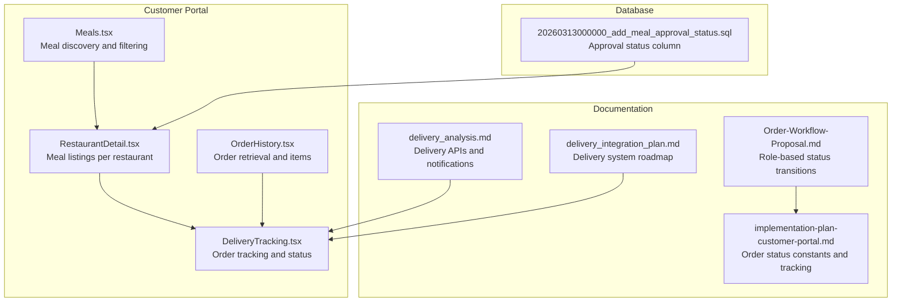
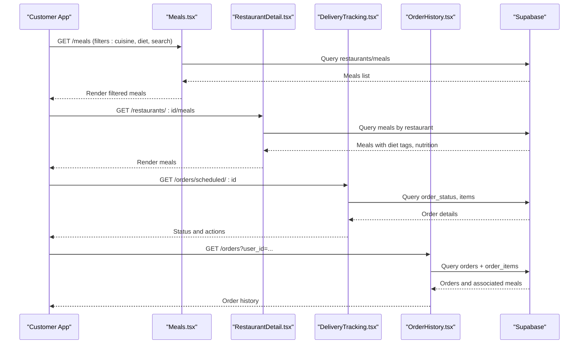
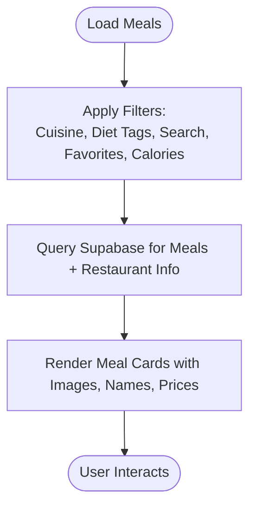
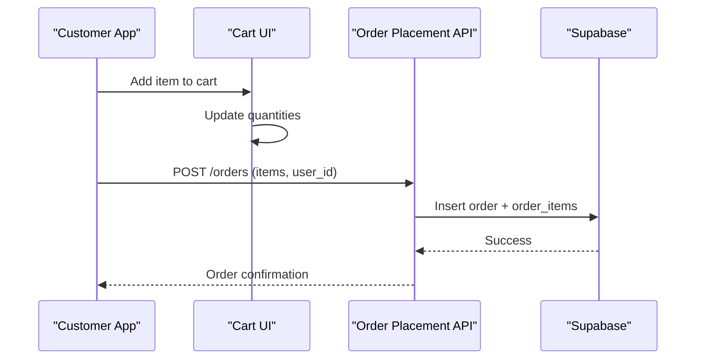
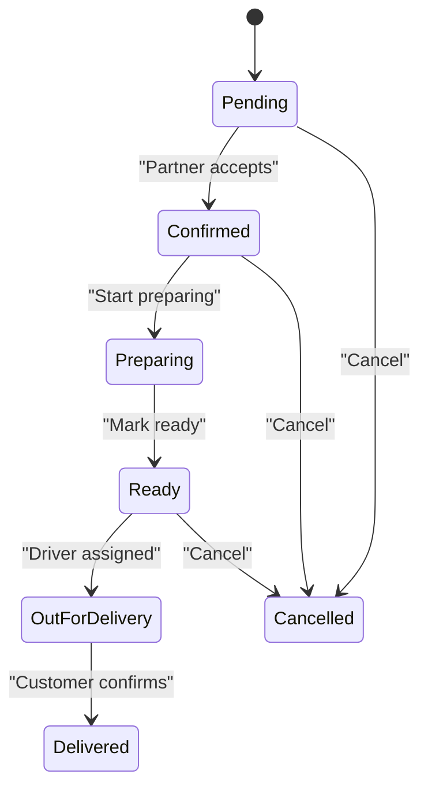
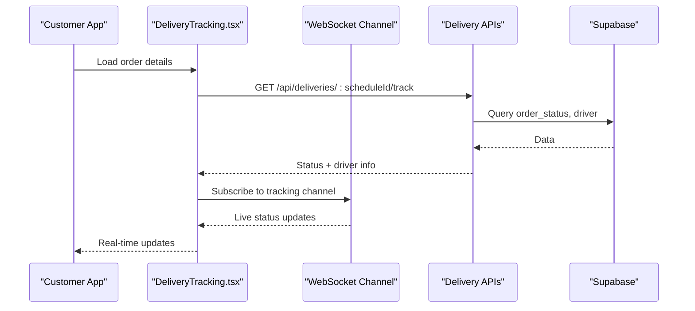
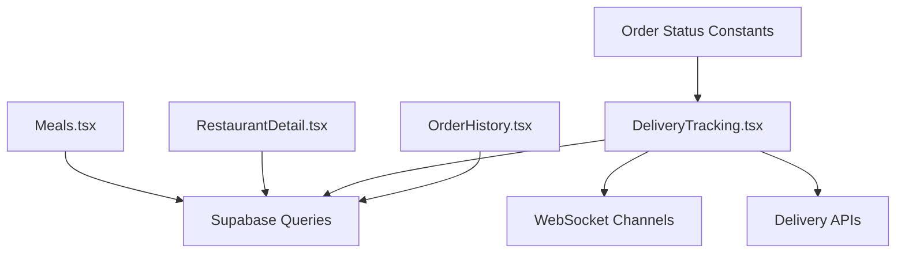

# Meal & Ordering Endpoints

<cite>
**Referenced Files in This Document**
- [Meals.tsx](file://src/pages/Meals.tsx)
- [RestaurantDetail.tsx](file://src/pages/RestaurantDetail.tsx)
- [DeliveryTracking.tsx](file://src/pages/DeliveryTracking.tsx)
- [OrderHistory.tsx](file://src/pages/OrderHistory.tsx)
- [Order-Workflow-Proposal.md](file://docs/Order-Workflow-Proposal.md)
- [implementation-plan-customer-portal.md](file://docs/implementation-plan-customer-portal.md)
- [delivery_analysis.md](file://delivery_analysis.md)
- [delivery_integration_plan.md](file://delivery_integration_plan.md)
- [meals.spec.ts](file://e2e/customer/meals.spec.ts)
- [orders.spec.ts](file://e2e/customer/orders.spec.ts)
- [20260313000000_add_meal_approval_status.sql](file://supabase/migrations/20260313000000_add_meal_approval_status.sql)
</cite>

## Table of Contents
1. [Introduction](#introduction)
2. [Project Structure](#project-structure)
3. [Core Components](#core-components)
4. [Architecture Overview](#architecture-overview)
5. [Detailed Component Analysis](#detailed-component-analysis)
6. [Dependency Analysis](#dependency-analysis)
7. [Performance Considerations](#performance-considerations)
8. [Troubleshooting Guide](#troubleshooting-guide)
9. [Conclusion](#conclusion)
10. [Appendices](#appendices)

## Introduction
This document provides comprehensive REST API documentation for meal discovery and ordering workflows. It covers restaurant search, meal browsing, cart management, order placement, order modification, order status tracking, delivery scheduling, cancellation policies, inventory management, availability checking, real-time stock updates, and promotional pricing. It also outlines bulk ordering, subscription management, and administrative controls derived from the frontend and documentation artifacts.

## Project Structure
The application is a React-based customer portal integrated with Supabase for data persistence and real-time features. Key frontend pages and supporting documents define the order lifecycle and UI-driven workflows that map to backend APIs.

**Diagram sources**
- [Meals.tsx:820-844](file://src/pages/Meals.tsx#L820-L844)
- [RestaurantDetail.tsx:178-205](file://src/pages/RestaurantDetail.tsx#L178-L205)
- [DeliveryTracking.tsx:40-65](file://src/pages/DeliveryTracking.tsx#L40-L65)
- [OrderHistory.tsx:189-211](file://src/pages/OrderHistory.tsx#L189-L211)
- [Order-Workflow-Proposal.md:1-50](file://docs/Order-Workflow-Proposal.md#L1-L50)
- [implementation-plan-customer-portal.md:538-930](file://docs/implementation-plan-customer-portal.md#L538-L930)
- [delivery_analysis.md:833-888](file://delivery_analysis.md#L833-L888)
- [delivery_integration_plan.md:1-17](file://delivery_integration_plan.md#L1-L17)
- [20260313000000_add_meal_approval_status.sql:1-4](file://supabase/migrations/20260313000000_add_meal_approval_status.sql#L1-L4)

**Section sources**
- [Meals.tsx:820-844](file://src/pages/Meals.tsx#L820-L844)
- [RestaurantDetail.tsx:178-205](file://src/pages/RestaurantDetail.tsx#L178-L205)
- [Order-Workflow-Proposal.md:1-50](file://docs/Order-Workflow-Proposal.md#L1-L50)
- [implementation-plan-customer-portal.md:538-930](file://docs/implementation-plan-customer-portal.md#L538-L930)
- [delivery_analysis.md:833-888](file://delivery_analysis.md#L833-L888)
- [delivery_integration_plan.md:1-17](file://delivery_integration_plan.md#L1-L17)
- [20260313000000_add_meal_approval_status.sql:1-4](file://supabase/migrations/20260313000000_add_meal_approval_status.sql#L1-L4)

## Core Components
- Meal discovery and filtering: Restaurant and meal browsing with cuisine, dietary tags, and nutritional filters.
- Cart and checkout: Add/remove items, adjust quantities, and place orders.
- Order lifecycle: Status transitions, cancellations, and completion.
- Delivery tracking: Real-time status updates, driver assignment, and estimated delivery windows.
- Inventory and availability: Approval status and stock checks via backend services.
- Promotions and pricing: VIP pricing badges and promotional offers surfaced in UI.

**Section sources**
- [Meals.tsx:820-844](file://src/pages/Meals.tsx#L820-L844)
- [RestaurantDetail.tsx:178-205](file://src/pages/RestaurantDetail.tsx#L178-L205)
- [Order-Workflow-Proposal.md:16-50](file://docs/Order-Workflow-Proposal.md#L16-L50)
- [implementation-plan-customer-portal.md:538-930](file://docs/implementation-plan-customer-portal.md#L538-L930)
- [delivery_analysis.md:833-888](file://delivery_analysis.md#L833-L888)

## Architecture Overview
The customer portal integrates with Supabase for data and real-time updates. Order workflows are governed by documented status transitions and role-based actions. Delivery APIs and WebSocket channels enable real-time tracking.

**Diagram sources**
- [Meals.tsx:820-844](file://src/pages/Meals.tsx#L820-L844)
- [RestaurantDetail.tsx:178-205](file://src/pages/RestaurantDetail.tsx#L178-L205)
- [DeliveryTracking.tsx:40-65](file://src/pages/DeliveryTracking.tsx#L40-L65)
- [OrderHistory.tsx:189-211](file://src/pages/OrderHistory.tsx#L189-L211)

## Detailed Component Analysis

### Meal Discovery and Filtering
- Endpoint pattern: GET /meals with query parameters for filtering.
- Filters supported by UI logic:
  - Cuisine: restaurant cuisine_types matching selection.
  - Dietary tags: meal.diet_tags applied in UI rendering.
  - Search: name and restaurant name matching.
  - Favorites: show only favorite restaurants.
  - Nutritional filters: calories range computed in UI.
- Pagination and sorting: UI uses pagination hooks and sorting dropdowns.

**Diagram sources**
- [Meals.tsx:820-844](file://src/pages/Meals.tsx#L820-L844)

**Section sources**
- [Meals.tsx:820-844](file://src/pages/Meals.tsx#L820-L844)
- [meals.spec.ts:1-34](file://e2e/customer/meals.spec.ts#L1-L34)

### Restaurant and Meal Details
- Endpoint pattern: GET /restaurants/:id/meals.
- UI transforms meal records to typed objects with nutrition fields and diet tags.
- Displays meal images, descriptions, and VIP exclusivity indicators.

**Section sources**
- [RestaurantDetail.tsx:178-205](file://src/pages/RestaurantDetail.tsx#L178-L205)
- [RestaurantDetail.tsx:747-778](file://src/pages/RestaurantDetail.tsx#L747-L778)

### Cart Management and Checkout
- UI-driven cart operations:
  - Add/remove items, adjust quantities.
  - Proceed to checkout with selected items.
- Backend integration points:
  - Create order via order placement endpoint.
  - Retrieve order items and associated meals for history.

**Diagram sources**
- [OrderHistory.tsx:189-211](file://src/pages/OrderHistory.tsx#L189-L211)

**Section sources**
- [orders.spec.ts:1-124](file://e2e/customer/orders.spec.ts#L1-L124)
- [OrderHistory.tsx:189-211](file://src/pages/OrderHistory.tsx#L189-L211)

### Order Lifecycle and Status Tracking
- Status workflow:
  - Pending → Confirmed → Preparing → Ready → Out for Delivery → Delivered.
  - Cancellation allowed only when status is pending or confirmed.
- UI exposes actions based on current status:
  - Cancel, Modify (pending/confirmed), Track (active statuses), Complete (delivered).

**Diagram sources**
- [Order-Workflow-Proposal.md:16-50](file://docs/Order-Workflow-Proposal.md#L16-L50)
- [implementation-plan-customer-portal.md:538-930](file://docs/implementation-plan-customer-portal.md#L538-L930)

**Section sources**
- [Order-Workflow-Proposal.md:16-50](file://docs/Order-Workflow-Proposal.md#L16-L50)
- [implementation-plan-customer-portal.md:538-930](file://docs/implementation-plan-customer-portal.md#L538-L930)
- [DeliveryTracking.tsx:345-355](file://src/pages/DeliveryTracking.tsx#L345-L355)

### Delivery Scheduling and Real-Time Tracking
- Delivery APIs:
  - GET /api/deliveries/:scheduleId/track
  - GET /api/deliveries/:scheduleId/driver
- Real-time infrastructure:
  - WebSocket channels for live status updates.
  - Redis caching for driver locations and session management.
- Notifications matrix:
  - Automated push notifications for order events across roles.

**Diagram sources**
- [delivery_analysis.md:833-888](file://delivery_analysis.md#L833-L888)
- [implementation-plan-customer-portal.md:864-930](file://docs/implementation-plan-customer-portal.md#L864-L930)

**Section sources**
- [delivery_analysis.md:833-888](file://delivery_analysis.md#L833-L888)
- [delivery_integration_plan.md:1-17](file://delivery_integration_plan.md#L1-L17)
- [implementation-plan-customer-portal.md:864-930](file://docs/implementation-plan-customer-portal.md#L864-L930)

### Inventory Management and Availability
- Approval status column added to meals table to control visibility and availability.
- UI can leverage approval_status to hide unapproved meals until approved.

**Section sources**
- [20260313000000_add_meal_approval_status.sql:1-4](file://supabase/migrations/20260313000000_add_meal_approval_status.sql#L1-L4)

### Promotional Pricing and VIP Features
- VIP exclusive badges and pricing indicators are rendered in UI components.
- Promotional banners and pricing tiers are part of the UI design system.

**Section sources**
- [RestaurantDetail.tsx:178-205](file://src/pages/RestaurantDetail.tsx#L178-L205)

## Dependency Analysis
- Frontend pages depend on Supabase for data queries and real-time channels.
- Order status constants and UI logic enforce role-based actions and visibility.
- Delivery endpoints and WebSocket channels integrate with real-time infrastructure.

**Diagram sources**
- [Meals.tsx:820-844](file://src/pages/Meals.tsx#L820-L844)
- [RestaurantDetail.tsx:178-205](file://src/pages/RestaurantDetail.tsx#L178-L205)
- [DeliveryTracking.tsx:40-65](file://src/pages/DeliveryTracking.tsx#L40-L65)
- [OrderHistory.tsx:189-211](file://src/pages/OrderHistory.tsx#L189-L211)
- [implementation-plan-customer-portal.md:538-930](file://docs/implementation-plan-customer-portal.md#L538-L930)
- [delivery_analysis.md:833-888](file://delivery_analysis.md#L833-L888)

**Section sources**
- [Meals.tsx:820-844](file://src/pages/Meals.tsx#L820-L844)
- [RestaurantDetail.tsx:178-205](file://src/pages/RestaurantDetail.tsx#L178-L205)
- [DeliveryTracking.tsx:40-65](file://src/pages/DeliveryTracking.tsx#L40-L65)
- [OrderHistory.tsx:189-211](file://src/pages/OrderHistory.tsx#L189-L211)
- [implementation-plan-customer-portal.md:538-930](file://docs/implementation-plan-customer-portal.md#L538-L930)
- [delivery_analysis.md:833-888](file://delivery_analysis.md#L833-L888)

## Performance Considerations
- Use pagination and efficient queries to limit meal lists.
- Cache frequently accessed restaurant and meal metadata.
- Debounce search inputs to reduce network requests.
- Batch order history queries to minimize round trips.

## Troubleshooting Guide
- Order status discrepancies:
  - Verify status transitions align with documented workflow.
  - Check real-time channel subscriptions for live updates.
- Delivery tracking issues:
  - Confirm WebSocket connections and Redis caching.
  - Validate driver assignment and location broadcasts.
- Inventory problems:
  - Ensure approval_status is enforced to prevent displaying unavailable meals.

**Section sources**
- [Order-Workflow-Proposal.md:16-50](file://docs/Order-Workflow-Proposal.md#L16-L50)
- [delivery_analysis.md:833-888](file://delivery_analysis.md#L833-L888)
- [20260313000000_add_meal_approval_status.sql:1-4](file://supabase/migrations/20260313000000_add_meal_approval_status.sql#L1-L4)

## Conclusion
The customer portal defines a clear order lifecycle with role-based actions, real-time delivery tracking, and robust filtering for discovering meals. The backend integration points and documentation artifacts provide a solid foundation for implementing REST endpoints that support bulk ordering, subscription management, promotional pricing, and inventory controls.

## Appendices

### API Reference Summary
- GET /meals
  - Query parameters: cuisine, diet (tags), search, favorites, calories range.
  - Returns: paginated list of meals with restaurant metadata.
- GET /restaurants/:id/meals
  - Returns: meals with diet tags, nutrition, and pricing.
- POST /orders
  - Body: items[], user_id, delivery_address_id.
  - Returns: order_id, order_status.
- GET /orders/scheduled/:id
  - Returns: order details, status, driver info.
- GET /orders?user_id=...
  - Returns: order history with associated meals.
- GET /api/deliveries/:scheduleId/track
  - Returns: live status updates and estimated arrival.
- GET /api/deliveries/:scheduleId/driver
  - Returns: driver contact and location.

**Section sources**
- [Meals.tsx:820-844](file://src/pages/Meals.tsx#L820-L844)
- [RestaurantDetail.tsx:178-205](file://src/pages/RestaurantDetail.tsx#L178-L205)
- [OrderHistory.tsx:189-211](file://src/pages/OrderHistory.tsx#L189-L211)
- [delivery_analysis.md:833-888](file://delivery_analysis.md#L833-L888)