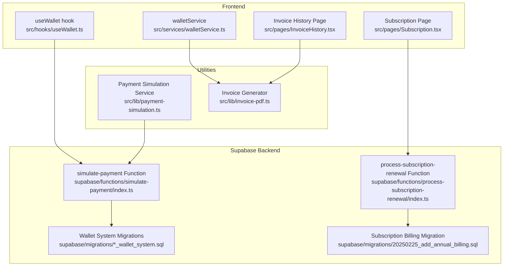
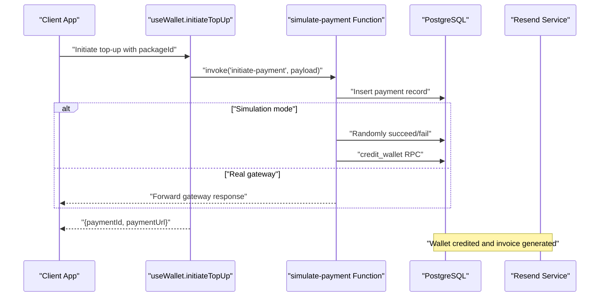
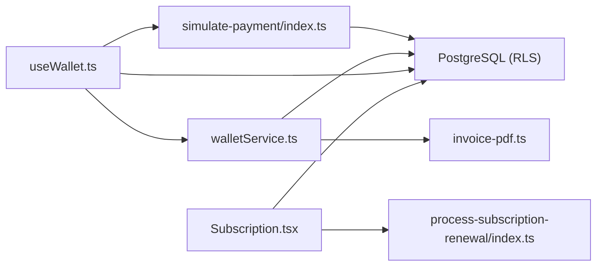

# Payment & Wallet Endpoints

<cite>
**Referenced Files in This Document**
- [useWallet.ts](file://src/hooks/useWallet.ts)
- [walletService.ts](file://src/services/walletService.ts)
- [payment-simulation.ts](file://src/lib/payment-simulation.ts)
- [payment-simulation-config.ts](file://src/lib/payment-simulation-config.ts)
- [simulate-payment/index.ts](file://supabase/functions/simulate-payment/index.ts)
- [20260218120000_wallet_system.sql](file://supabase/migrations/20260218120000_wallet_system.sql)
- [process-subscription-renewal/index.ts](file://supabase/functions/process-subscription-renewal/index.ts)
- [20250225_add_annual_billing.sql](file://supabase/migrations/20250225_add_annual_billing.sql)
- [Subscription.tsx](file://src/pages/Subscription.tsx)
- [invoice-pdf.ts](file://src/lib/invoice-pdf.ts)
- [InvoiceHistory.tsx](file://src/pages/InvoiceHistory.tsx)
- [20240101000002_add_cancel_order_rpc.sql](file://supabase/migrations/20240101000002_add_cancel_order_rpc.sql)
- [index.tsx](file://src/components/CancellationFlow/index.tsx)
- [20260225211307_add_win_back_offers.sql](file://supabase/migrations/20260225211307_add_win_back_back_offers.sql)
- [test-ip-check.mjs](file://test-ip-check.mjs)
</cite>

## Table of Contents
1. [Introduction](#introduction)
2. [Project Structure](#project-structure)
3. [Core Components](#core-components)
4. [Architecture Overview](#architecture-overview)
5. [Detailed Component Analysis](#detailed-component-analysis)
6. [Dependency Analysis](#dependency-analysis)
7. [Performance Considerations](#performance-considerations)
8. [Troubleshooting Guide](#troubleshooting-guide)
9. [Conclusion](#conclusion)
10. [Appendices](#appendices)

## Introduction
This document provides comprehensive REST API documentation for payment processing and wallet management endpoints. It covers wallet top-ups, balance inquiries, transaction history, and payout requests. It also documents subscription billing, promotional credits, and refund processing. Payment method management, recurring payments, and subscription modifications are included, along with examples for payment simulation, fraud detection integration, and financial reporting. Wallet funding sources, withdrawal limits, and compliance requirements are addressed.

## Project Structure
The payment and wallet system spans React hooks, Supabase functions, PostgreSQL migrations, and frontend pages. Key areas:
- Frontend hooks and services for wallet operations
- Supabase Edge Functions for payment simulation and processing
- Database migrations defining wallet and subscription schemas
- Subscription management UI and cancellation flows
- Financial reporting via invoice generation

**Diagram sources**
- [useWallet.ts:137-167](file://src/hooks/useWallet.ts#L137-L167)
- [walletService.ts:13-137](file://src/services/walletService.ts#L13-L137)
- [simulate-payment/index.ts:1-119](file://supabase/functions/simulate-payment/index.ts#L1-L119)
- [process-subscription-renewal/index.ts:122-277](file://supabase/functions/process-subscription-renewal/index.ts#L122-L277)
- [20260218120000_wallet_system.sql:59-86](file://supabase/migrations/20260218120000_wallet_system.sql#L59-L86)
- [20250225_add_annual_billing.sql:182-234](file://supabase/migrations/20250225_add_annual_billing.sql#L182-L234)
- [payment-simulation.ts:25-223](file://src/lib/payment-simulation.ts#L25-L223)
- [invoice-pdf.ts:40-359](file://src/lib/invoice-pdf.ts#L40-L359)

**Section sources**
- [useWallet.ts:56-275](file://src/hooks/useWallet.ts#L56-L275)
- [walletService.ts:13-180](file://src/services/walletService.ts#L13-L180)
- [simulate-payment/index.ts:1-119](file://supabase/functions/simulate-payment/index.ts#L1-L119)
- [process-subscription-renewal/index.ts:122-277](file://supabase/functions/process-subscription-renewal/index.ts#L122-L277)
- [20260218120000_wallet_system.sql:59-86](file://supabase/migrations/20260218120000_wallet_system.sql#L59-L86)
- [20250225_add_annual_billing.sql:182-234](file://supabase/migrations/20250225_add_annual_billing.sql#L182-L234)
- [payment-simulation.ts:25-223](file://src/lib/payment-simulation.ts#L25-L223)
- [invoice-pdf.ts:40-359](file://src/lib/invoice-pdf.ts#L40-L359)

## Core Components
- Wallet Management Hook: Provides wallet data, transactions, top-up packages, and operations like initiating top-ups and crediting wallets.
- Wallet Service: Handles wallet top-up processing, invoice generation, and email notifications.
- Payment Simulation: Simulates payment flows including 3D Secure checks and outcomes.
- Supabase Functions: Implement payment simulation and subscription renewal logic.
- Subscription Management: Manages upgrades, billing intervals, and cancellation flows.
- Financial Reporting: Generates invoices for wallet top-ups and other transactions.

**Section sources**
- [useWallet.ts:56-275](file://src/hooks/useWallet.ts#L56-L275)
- [walletService.ts:13-180](file://src/services/walletService.ts#L13-L180)
- [payment-simulation.ts:25-223](file://src/lib/payment-simulation.ts#L25-L223)
- [simulate-payment/index.ts:1-119](file://supabase/functions/simulate-payment/index.ts#L1-L119)
- [process-subscription-renewal/index.ts:122-277](file://supabase/functions/process-subscription-renewal/index.ts#L122-L277)

## Architecture Overview
The system integrates frontend React hooks with Supabase Edge Functions and PostgreSQL stored procedures. Payment simulation can operate independently of external gateways, while real payments leverage wallet credit procedures and invoice generation.

**Diagram sources**
- [useWallet.ts:137-167](file://src/hooks/useWallet.ts#L137-L167)
- [simulate-payment/index.ts:14-110](file://supabase/functions/simulate-payment/index.ts#L14-L110)
- [walletService.ts:33-49](file://src/services/walletService.ts#L33-L49)

## Detailed Component Analysis

### Wallet Endpoints

#### GET /wallet/balance
- Description: Retrieve the authenticated user's wallet balance and related totals.
- Authentication: Required (authenticated user).
- Response: Wallet data object including balance, total credits, total debits, and timestamps.
- Implementation: Uses the wallet hook to query customer_wallets table filtered by user_id.

**Section sources**
- [useWallet.ts:65-98](file://src/hooks/useWallet.ts#L65-L98)
- [20260218120000_wallet_system.sql:69-86](file://supabase/migrations/20260218120000_wallet_system.sql#L69-L86)

#### GET /wallet/transactions
- Description: List recent wallet transactions for the authenticated user.
- Authentication: Required.
- Query Parameters:
  - limit: Number of transactions to return (default 20).
  - offset: Starting position for pagination.
- Response: Array of wallet transactions ordered by created_at descending.
- Implementation: Queries wallet_transactions with user_id filter and range-based pagination.

**Section sources**
- [useWallet.ts:100-120](file://src/hooks/useWallet.ts#L100-L120)
- [20260218120000_wallet_system.sql:59-61](file://supabase/migrations/20260218120000_wallet_system.sql#L59-L61)

#### POST /wallet/topup/initiate
- Description: Initiate a wallet top-up using a selected package and payment method.
- Authentication: Required.
- Request Body:
  - packageId: UUID of the selected top-up package.
  - paymentMethod: 'sadad' or 'card'.
- Response: { paymentId, paymentUrl } for redirection to payment provider.
- Implementation: Invokes Supabase Edge Function 'initiate-payment' with user context and package details.

**Section sources**
- [useWallet.ts:137-167](file://src/hooks/useWallet.ts#L137-L167)
- [simulate-payment/index.ts:14-110](file://supabase/functions/simulate-payment/index.ts#L14-L110)

#### POST /wallet/credit
- Description: Credit wallet balance directly (administrative or promotional).
- Authentication: Required (service role).
- Request Body:
  - amount: Numeric credit amount.
  - type: Transaction type (e.g., 'bonus', 'cashback').
  - referenceType/referenceId: Optional identifiers.
  - description: Optional description.
  - metadata: Optional structured data.
- Response: Credit operation result and updated transaction ID.
- Implementation: Calls credit_wallet RPC with provided parameters.

**Section sources**
- [useWallet.ts:169-200](file://src/hooks/useWallet.ts#L169-L200)
- [walletService.ts:33-49](file://src/services/walletService.ts#L33-L49)

#### GET /wallet/topup/packages
- Description: List active wallet top-up packages.
- Authentication: Required.
- Response: Array of top-up packages with pricing, bonuses, and ordering.
- Implementation: Queries wallet_topup_packages with is_active filter.

**Section sources**
- [useWallet.ts:122-135](file://src/hooks/useWallet.ts#L122-L135)
- [20260218120000_wallet_system.sql:61-61](file://supabase/migrations/20260218120000_wallet_system.sql#L61-L61)

### Subscription Billing Endpoints

#### POST /subscription/upgrade
- Description: Upgrade a subscription with proration and optional wallet payment.
- Authentication: Required.
- Request Body:
  - subscriptionId: UUID of target subscription.
  - newTier: New plan tier.
  - newBillingInterval: Billing interval (e.g., monthly/annual).
  - paymentMethod: 'wallet' or 'card'.
- Response: Upgrade result including prorated credit and amount due.
- Implementation: Uses upgrade_subscription RPC with proration logic and optional wallet debit.

**Section sources**
- [Subscription.tsx:310-418](file://src/pages/Subscription.tsx#L310-L418)
- [20250225_add_annual_billing.sql:190-234](file://supabase/migrations/20250225_add_annual_billing.sql#L190-L234)

#### POST /subscription/renewal/process
- Description: Process subscription renewals and calculate rollover credits.
- Authentication: Required (service role).
- Query Parameters:
  - dry_run: Boolean to preview results without execution.
- Response: Batch results with processed counts and per-subscription outcomes.
- Implementation: Iterates subscriptions due for renewal and invokes calculate_rollover_credits RPC.

**Section sources**
- [process-subscription-renewal/index.ts:122-277](file://supabase/functions/process-subscription-renewal/index.ts#L122-L277)

#### POST /subscription/cancel
- Description: Cancel a subscription and process refunds or quotas restoration.
- Authentication: Required.
- Request Body:
  - subscriptionId: UUID of subscription.
  - reason: Cancellation reason.
  - refundType: 'full', 'partial', or 'none'.
- Response: Cancellation result including refund amount and status.
- Implementation: Updates subscription status, restores meal quotas, and credits wallet for eligible refunds.

**Section sources**
- [20240101000002_add_cancel_order_rpc.sql:2062-2136](file://supabase/migrations/20240101000002_add_cancel_order_rpc.sql#L2062-L2136)
- [index.tsx:48-95](file://src/components/CancellationFlow/index.tsx#L48-L95)

#### POST /subscription/win-back-offer
- Description: Offer promotional credits to retain subscribers during cancellation flow.
- Authentication: Required.
- Request Body:
  - subscriptionId: UUID of subscription.
  - step: Current step in cancellation flow.
  - acceptOffer: Boolean indicating acceptance.
- Response: Action result (retain or cancel) and bonus credits applied.
- Implementation: Uses get_win_back_offers RPC to determine offers and applies credits upon acceptance.

**Section sources**
- [20260225211307_add_win_back_offers.sql:310-349](file://supabase/migrations/20260225211307_add_win_back_offers.sql#L310-L349)
- [index.tsx:48-95](file://src/components/CancellationFlow/index.tsx#L48-L95)

### Financial Reporting Endpoints

#### GET /invoices/{invoiceId}/download
- Description: Download a wallet top-up invoice as PDF.
- Authentication: Required.
- Path Parameters:
  - invoiceId: UUID of the invoice.
- Response: PDF download stream.
- Implementation: Retrieves invoice metadata and generates PDF via invoice-pdf utility.

**Section sources**
- [walletService.ts:139-180](file://src/services/walletService.ts#L139-L180)
- [invoice-pdf.ts:285-300](file://src/lib/invoice-pdf.ts#L285-L300)

#### GET /invoices/history
- Description: List invoices for the authenticated user.
- Authentication: Required.
- Response: Array of invoices with status, amounts, and dates.
- Implementation: Queries invoices table filtered by user_id.

**Section sources**
- [InvoiceHistory.tsx:206-231](file://src/pages/InvoiceHistory.tsx#L206-L231)

### Payment Simulation and Fraud Detection Integration

#### Payment Simulation Service
- Purpose: Simulate payment flows for development and testing.
- Features:
  - Configurable success rate and delays.
  - 3D Secure simulation with OTP verification.
  - Forced outcomes for testing.
- Endpoints:
  - POST /payment/simulate/create: Create a simulated payment.
  - POST /payment/simulate/3d-secure: Initiate 3D Secure challenge.
  - POST /payment/simulate/verify-3d: Verify OTP.
  - POST /payment/simulate/process: Finalize payment processing.

**Section sources**
- [payment-simulation.ts:25-223](file://src/lib/payment-simulation.ts#L25-L223)
- [payment-simulation-config.ts:4-79](file://src/lib/payment-simulation-config.ts#L4-L79)

#### Supabase Payment Simulation Function
- Purpose: Backend simulation of payment initiation and completion.
- Endpoints:
  - POST /functions/v1/simulate-payment: Create payment record, optionally succeed or fail, and credit wallet in simulation mode.

**Section sources**
- [simulate-payment/index.ts:14-110](file://supabase/functions/simulate-payment/index.ts#L14-L110)

#### Fraud Detection Integration
- IP Location Check: Supabase function to check requester IP location for risk assessment.
- Usage: Call check-ip-location endpoint to retrieve geolocation data for origin IP.

**Section sources**
- [test-ip-check.mjs:17-31](file://test-ip-check.mjs#L17-L31)

### Wallet Funding Sources, Withdrawal Limits, and Compliance

#### Funding Sources
- Wallet top-ups supported via Sadad and card payment methods.
- Promotional credits and cashback can be credited via administrative operations.

**Section sources**
- [useWallet.ts:137-167](file://src/hooks/useWallet.ts#L137-L167)
- [walletService.ts:33-49](file://src/services/walletService.ts#L33-L49)

#### Withdrawal Limits
- Not implemented in the current codebase. Any withdrawal functionality would require new endpoints and database schema changes.

#### Compliance Requirements
- Row Level Security policies restrict wallet and transaction visibility to authenticated users.
- Email logs track invoice delivery attempts.
- Invoices include company details, tax breakdowns, and payment metadata.

**Section sources**
- [20260218120000_wallet_system.sql:63-86](file://supabase/migrations/20260218120000_wallet_system.sql#L63-L86)
- [walletService.ts:100-125](file://src/services/walletService.ts#L100-L125)
- [invoice-pdf.ts:241-283](file://src/lib/invoice-pdf.ts#L241-L283)

## Dependency Analysis

**Diagram sources**
- [useWallet.ts:137-167](file://src/hooks/useWallet.ts#L137-L167)
- [walletService.ts:13-137](file://src/services/walletService.ts#L13-L137)
- [simulate-payment/index.ts:1-119](file://supabase/functions/simulate-payment/index.ts#L1-L119)
- [process-subscription-renewal/index.ts:122-277](file://supabase/functions/process-subscription-renewal/index.ts#L122-L277)
- [invoice-pdf.ts:40-359](file://src/lib/invoice-pdf.ts#L40-L359)

**Section sources**
- [useWallet.ts:137-167](file://src/hooks/useWallet.ts#L137-L167)
- [walletService.ts:13-137](file://src/services/walletService.ts#L13-L137)
- [simulate-payment/index.ts:1-119](file://supabase/functions/simulate-payment/index.ts#L1-L119)
- [process-subscription-renewal/index.ts:122-277](file://supabase/functions/process-subscription-renewal/index.ts#L122-L277)
- [invoice-pdf.ts:40-359](file://src/lib/invoice-pdf.ts#L40-L359)

## Performance Considerations
- Use pagination for transaction lists to avoid large payloads.
- Leverage Supabase RLS to minimize unnecessary data transfer.
- Cache frequently accessed top-up packages on the client.
- Batch subscription renewal processing to reduce database load.

## Troubleshooting Guide
- Payment Simulation Disabled: Ensure environment variable enables payment simulation.
- Insufficient Wallet Balance: Subscription upgrades using wallet require sufficient balance.
- Invoice Generation Failures: Verify Resend configuration and PDF generation pipeline.
- Subscription Upgrade Errors: Confirm target plan availability and billing interval compatibility.

**Section sources**
- [payment-simulation.ts:219-223](file://src/lib/payment-simulation.ts#L219-L223)
- [Subscription.tsx:324-344](file://src/pages/Subscription.tsx#L324-L344)
- [walletService.ts:99-125](file://src/services/walletService.ts#L99-L125)
- [20250225_add_annual_billing.sql:226-234](file://supabase/migrations/20250225_add_annual_billing.sql#L226-L234)

## Conclusion
The payment and wallet system provides robust APIs for wallet management, subscription billing, and financial reporting. Payment simulation and fraud detection integration enhance development and operational safety. Future enhancements could include explicit withdrawal endpoints, expanded funding sources, and withdrawal limits aligned with compliance requirements.

## Appendices

### API Definitions

- GET /wallet/balance
  - Authentication: Required
  - Response: WalletData

- GET /wallet/transactions?limit={number}&offset={number}
  - Authentication: Required
  - Response: WalletTransaction[]

- POST /wallet/topup/initiate
  - Authentication: Required
  - Request: { packageId, paymentMethod }
  - Response: { paymentId, paymentUrl }

- POST /wallet/credit
  - Authentication: Service role
  - Request: { amount, type, referenceType?, referenceId?, description?, metadata? }
  - Response: { success, walletTxId }

- GET /wallet/topup/packages
  - Authentication: Required
  - Response: TopUpPackage[]

- POST /subscription/upgrade
  - Authentication: Required
  - Request: { subscriptionId, newTier, newBillingInterval, paymentMethod }
  - Response: { success, proratedCredit?, amountDue? }

- POST /subscription/renewal/process?dry_run={boolean}
  - Authentication: Service role
  - Response: { processed, successful, failed, results }

- POST /subscription/cancel
  - Authentication: Required
  - Request: { subscriptionId, reason, refundType }
  - Response: { success, refundAmount, refundType, walletTransactionId? }

- POST /subscription/win-back-offer
  - Authentication: Required
  - Request: { subscriptionId, step, acceptOffer }
  - Response: { success, action, message, bonusCredits? }

- GET /invoices/{invoiceId}/download
  - Authentication: Required
  - Response: PDF stream

- GET /invoices/history
  - Authentication: Required
  - Response: Invoice[]

- POST /payment/simulate/create
  - Authentication: Optional (dev)
  - Request: { amount, orderId, paymentMethod, simulationMode? }
  - Response: { paymentId, paymentUrl, status }

- POST /payment/simulate/3d-secure
  - Authentication: Optional (dev)
  - Request: { paymentId }
  - Response: { requires3D, redirectUrl? }

- POST /payment/simulate/verify-3d
  - Authentication: Optional (dev)
  - Request: { paymentId, otp }
  - Response: { success }

- POST /payment/simulate/process
  - Authentication: Optional (dev)
  - Request: { paymentId }
  - Response: { success, transactionId?, failureReason? }

- POST /functions/v1/check-ip-location
  - Authentication: Optional (dev)
  - Response: { ip, country, region, city }

**Section sources**
- [useWallet.ts:65-200](file://src/hooks/useWallet.ts#L65-L200)
- [Subscription.tsx:310-418](file://src/pages/Subscription.tsx#L310-L418)
- [process-subscription-renewal/index.ts:122-277](file://supabase/functions/process-subscription-renewal/index.ts#L122-L277)
- [walletService.ts:13-180](file://src/services/walletService.ts#L13-L180)
- [simulate-payment/index.ts:14-110](file://supabase/functions/simulate-payment/index.ts#L14-L110)
- [payment-simulation.ts:38-140](file://src/lib/payment-simulation.ts#L38-L140)
- [test-ip-check.mjs:17-31](file://test-ip-check.mjs#L17-L31)