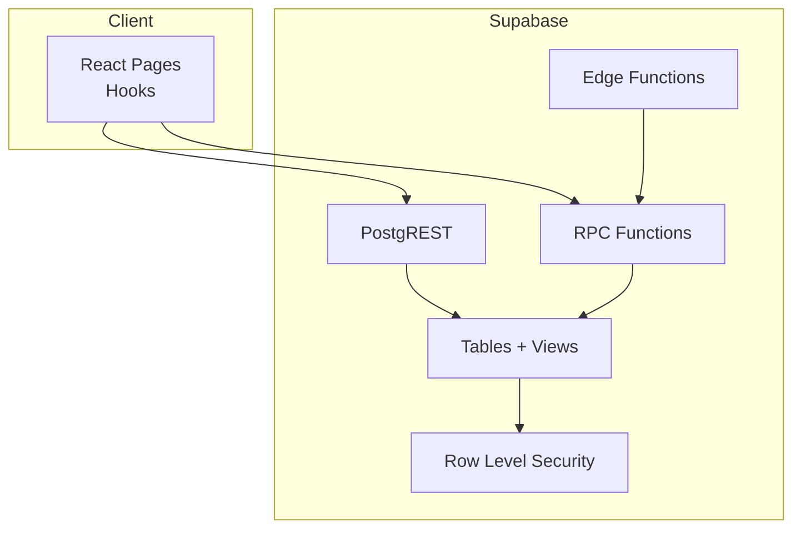
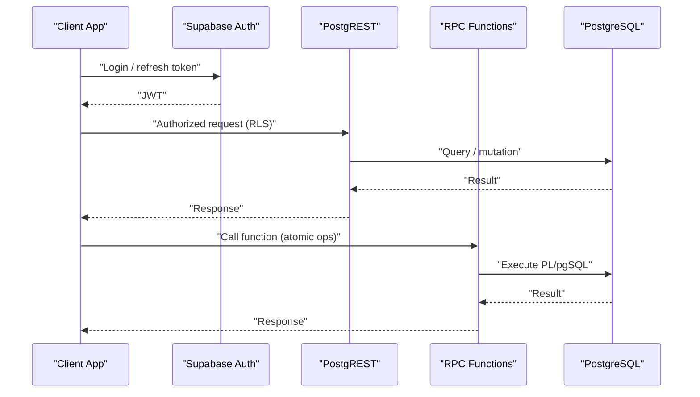
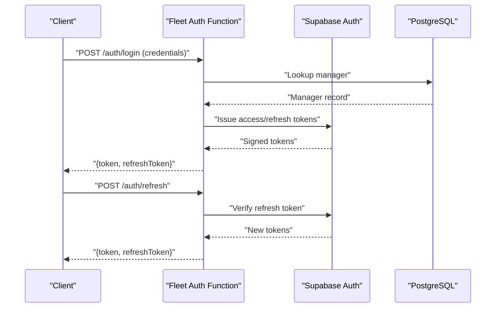
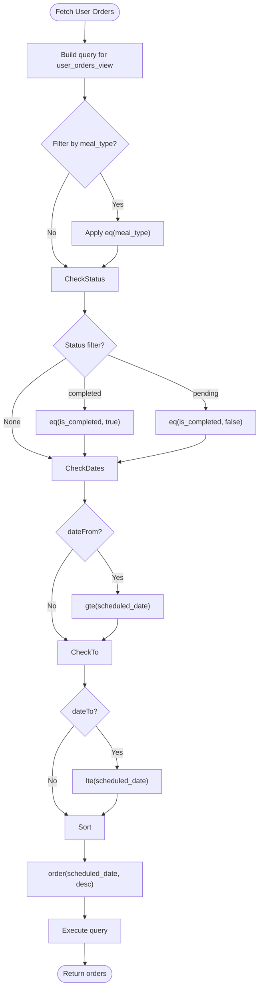
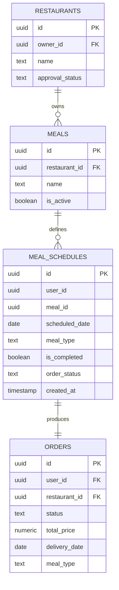
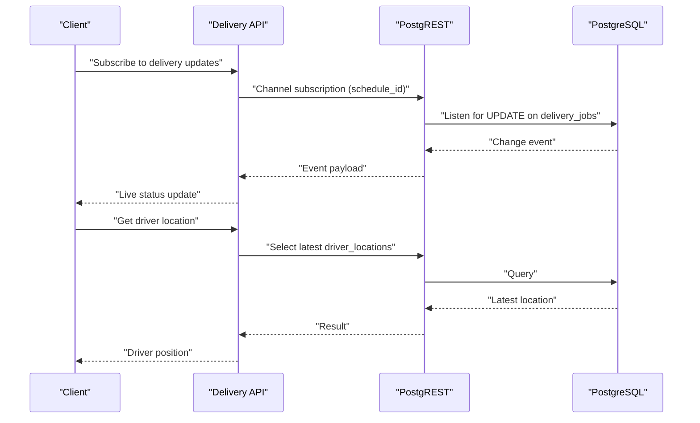
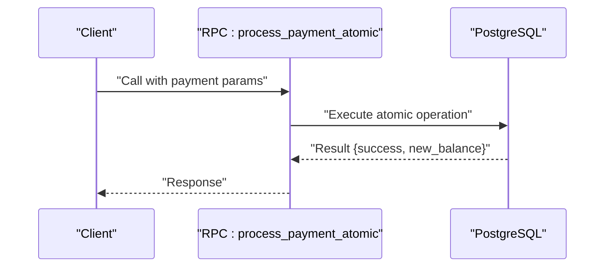
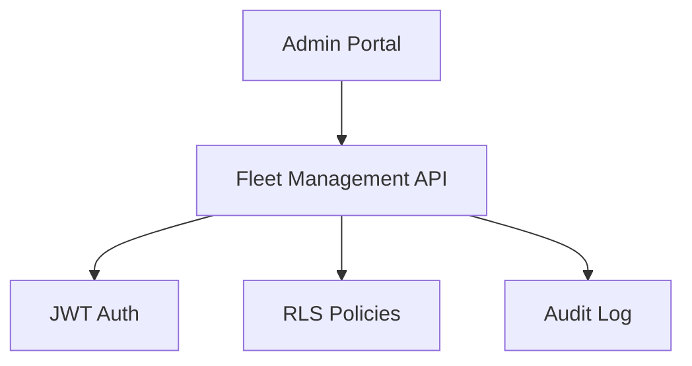
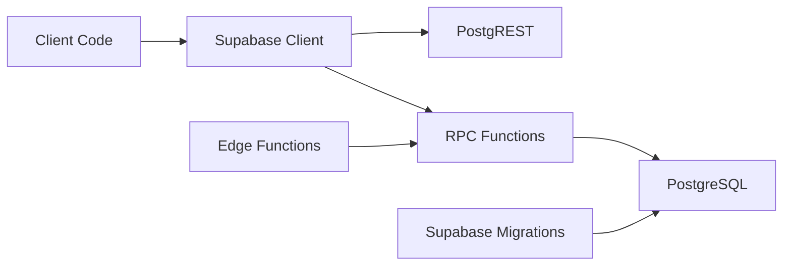

# REST API

<cite>
**Referenced Files in This Document**
- [client.ts](file://src/integrations/supabase/client.ts)
- [types.ts](file://src/integrations/supabase/types.ts)
- [delivery.ts](file://src/integrations/supabase/delivery.ts)
- [useUserOrders.ts](file://src/hooks/useUserOrders.ts)
- [Checkout.tsx](file://src/pages/Checkout.tsx)
- [Subscription.tsx](file://src/pages/Subscription.tsx)
- [performance-benchmark.ts](file://scripts/performance-benchmark.ts)
- [20250218000002_rls_audit_and_policies.sql](file://supabase/migrations/20250218000002_rls_audit_and_policies.sql)
- [20260106163711_365c874b-1a80-458a-bf16-84db6b752f0d.sql](file://supabase/migrations/20260106163711_365c874b-1a80-458a-bf16-84db6b752f0d.sql)
- [20260224000002_add_payment_verification_to_rollover.sql](file://supabase/migrations/20260224000002_add_payment_verification_to_rollover.sql)
- [20260303160000_cancel_meal_schedule_function.sql](file://supabase/migrations/20260303160000_cancel_meal_schedule_function.sql)
- [fleet-auth/index.ts](file://supabase/functions/fleet-auth/index.ts)
- [analyze-meal-image/index.ts](file://supabase/functions/analyze-meal-image/index.ts)
- [config.toml](file://supabase/config.toml)
- [fleet-management-portal-design.md](file://docs/fleet-management-portal-design.md)
- [PRODUCTION_HARDENING_FINAL_SUMMARY.md](file://PRODUCTION_HARDENING_FINAL_SUMMARY.md)
- [system-architecture.html](file://docs/plans/system-architecture.html)
- [nutrio-system-documentation.html](file://docs/plans/nutrio-system-documentation.html)
- [server.ts](file://src/test/server.ts)
</cite>

## Table of Contents
1. [Introduction](#introduction)
2. [Project Structure](#project-structure)
3. [Core Components](#core-components)
4. [Architecture Overview](#architecture-overview)
5. [Detailed Component Analysis](#detailed-component-analysis)
6. [Dependency Analysis](#dependency-analysis)
7. [Performance Considerations](#performance-considerations)
8. [Troubleshooting Guide](#troubleshooting-guide)
9. [Conclusion](#conclusion)
10. [Appendices](#appendices)

## Introduction
This document provides comprehensive REST API documentation for Nutrio’s Supabase-backed system. It covers authentication, authorization, endpoint categories (user management, meal ordering, delivery tracking, payment processing, and administrative functions), query parameters, filtering, pagination, sorting, and operational guidance. It also outlines rate limiting, caching strategies, and performance optimization techniques, along with integration patterns and debugging approaches.

## Project Structure
The Supabase integration is primarily accessed through a typed Supabase client and PostgREST/RPC functions. Client-side pages and hooks orchestrate requests to Supabase tables and database functions. Supabase migrations define row-level security (RLS) policies and function-level permissions. Supabase Edge Functions implement fleet authentication and image analysis with JWT validation.

**Diagram sources**
- [client.ts:47-57](file://src/integrations/supabase/client.ts#L47-L57)
- [types.ts:9-14](file://src/integrations/supabase/types.ts#L9-L14)
- [20250218000002_rls_audit_and_policies.sql:1-44](file://supabase/migrations/20250218000002_rls_audit_and_policies.sql#L1-L44)

**Section sources**
- [client.ts:1-57](file://src/integrations/supabase/client.ts#L1-L57)
- [types.ts:1-14](file://src/integrations/supabase/types.ts#L1-L14)

## Core Components
- Supabase client with persisted session and auto-refresh enabled.
- Typed Supabase database interface for compile-time safety.
- Delivery system API integration for driver lifecycle and job assignment.
- Order and wallet hooks implementing filtering, pagination, and sorting.
- Payment flows using RPC functions for atomic operations.
- Fleet authentication Edge Function for JWT-based access control.
- RLS policies enforcing role-based access across tables.

**Section sources**
- [client.ts:18-57](file://src/integrations/supabase/client.ts#L18-L57)
- [delivery.ts:1-735](file://src/integrations/supabase/delivery.ts#L1-L735)
- [useUserOrders.ts:1-164](file://src/hooks/useUserOrders.ts#L1-L164)
- [Checkout.tsx:32-70](file://src/pages/Checkout.tsx#L32-L70)
- [Subscription.tsx:310-344](file://src/pages/Subscription.tsx#L310-L344)
- [fleet-auth/index.ts:35-90](file://supabase/functions/fleet-auth/index.ts#L35-L90)
- [20250218000002_rls_audit_and_policies.sql:46-96](file://supabase/migrations/20250218000002_rls_audit_and_policies.sql#L46-L96)

## Architecture Overview
The system uses:
- Supabase Auth for JWT issuance and verification.
- PostgREST for RESTful table access with RLS.
- RPC functions for atomic operations and business logic.
- Edge Functions for specialized flows (e.g., fleet auth).
- Client-side hooks and pages to orchestrate requests and present data.

**Diagram sources**
- [client.ts:47-57](file://src/integrations/supabase/client.ts#L47-L57)
- [20250218000002_rls_audit_and_policies.sql:46-96](file://supabase/migrations/20250218000002_rls_audit_and_policies.sql#L46-L96)
- [Checkout.tsx:32-70](file://src/pages/Checkout.tsx#L32-L70)

## Detailed Component Analysis

### Authentication and Authorization
- JWT-based authentication with access and refresh tokens.
- Fleet authentication Edge Function issues role-specific tokens and validates them.
- Supabase Auth manages sessions with persisted storage and auto-refresh.
- RLS policies restrict table access by roles and ownership.

**Diagram sources**
- [fleet-auth/index.ts:35-90](file://supabase/functions/fleet-auth/index.ts#L35-L90)
- [fleet-auth/index.ts:207-248](file://supabase/functions/fleet-auth/index.ts#L207-L248)

**Section sources**
- [client.ts:47-57](file://src/integrations/supabase/client.ts#L47-L57)
- [fleet-auth/index.ts:35-90](file://supabase/functions/fleet-auth/index.ts#L35-L90)
- [20250218000002_rls_audit_and_policies.sql:46-96](file://supabase/migrations/20250218000002_rls_audit_and_policies.sql#L46-L96)
- [PRODUCTION_HARDENING_FINAL_SUMMARY.md:105-144](file://PRODUCTION_HARDENING_FINAL_SUMMARY.md#L105-L144)

### User Management
- Orders and schedules are filtered by authenticated user via RLS.
- Orders view aggregates meal and restaurant details for the user.
- Filtering supports meal type, completion status, and date range.
- Sorting defaults to descending by scheduled date.

**Diagram sources**
- [useUserOrders.ts:50-82](file://src/hooks/useUserOrders.ts#L50-L82)

**Section sources**
- [useUserOrders.ts:1-164](file://src/hooks/useUserOrders.ts#L1-L164)
- [20250218000002_rls_audit_and_policies.sql:46-96](file://supabase/migrations/20250218000002_rls_audit_and_policies.sql#L46-L96)

### Meal Ordering and Scheduling
- Orders are linked to meal schedules with granular status tracking.
- Status values include pending, confirmed, preparing, delivered.
- Cancellation logic refunds meal credits back to subscription quotas.

**Diagram sources**
- [20260106163711_365c874b-1a80-458a-bf16-84db6b752f0d.sql:1-10](file://supabase/migrations/20260106163711_365c874b-1a80-458a-bf16-84db6b752f0d.sql#L1-L10)
- [20260303160000_cancel_meal_schedule_function.sql:37-61](file://supabase/migrations/20260303160000_cancel_meal_schedule_function.sql#L37-L61)

**Section sources**
- [20260106163711_365c874b-1a80-458a-bf16-84db6b752f0d.sql:1-10](file://supabase/migrations/20260106163711_365c874b-1a80-458a-bf16-84db6b752f0d.sql#L1-L10)
- [20260303160000_cancel_meal_schedule_function.sql:37-61](file://supabase/migrations/20260303160000_cancel_meal_schedule_function.sql#L37-L61)

### Delivery Tracking
- Delivery jobs are associated with meal schedules and drivers.
- Real-time updates are supported via Postgres changes channels.
- Driver location history is stored for tracking and auditing.

**Diagram sources**
- [delivery.ts:695-735](file://src/integrations/supabase/delivery.ts#L695-L735)
- [delivery.ts:679-690](file://src/integrations/supabase/delivery.ts#L679-L690)

**Section sources**
- [delivery.ts:1-735](file://src/integrations/supabase/delivery.ts#L1-L735)

### Payment Processing
- Atomic payment processing via RPC function ensures idempotency and consistency.
- Wallet top-ups and subscription upgrades leverage RPC functions for debits and credits.
- Payment verification influences rollover credit calculations.

**Diagram sources**
- [Checkout.tsx:32-70](file://src/pages/Checkout.tsx#L32-L70)
- [20260224000002_add_payment_verification_to_rollover.sql:112-126](file://supabase/migrations/20260224000002_add_payment_verification_to_rollover.sql#L112-L126)

**Section sources**
- [Checkout.tsx:32-70](file://src/pages/Checkout.tsx#L32-L70)
- [Subscription.tsx:310-344](file://src/pages/Subscription.tsx#L310-L344)
- [20260224000002_add_payment_verification_to_rollover.sql:112-126](file://supabase/migrations/20260224000002_add_payment_verification_to_rollover.sql#L112-L126)

### Administrative Functions
- Fleet management API specification defines endpoints for drivers, vehicles, payouts, and tracking.
- Authentication uses Bearer JWT; rate limiting applies to specific endpoints.
- Audit logging and RLS policies protect sensitive operations.

**Diagram sources**
- [fleet-management-portal-design.md:615-1265](file://docs/fleet-management-portal-design.md#L615-L1265)
- [PRODUCTION_HARDENING_FINAL_SUMMARY.md:105-144](file://PRODUCTION_HARDENING_FINAL_SUMMARY.md#L105-L144)
- [20250218000002_rls_audit_and_policies.sql:275-295](file://supabase/migrations/20250218000002_rls_audit_and_policies.sql#L275-L295)

**Section sources**
- [fleet-management-portal-design.md:615-1265](file://docs/fleet-management-portal-design.md#L615-L1265)
- [PRODUCTION_HARDENING_FINAL_SUMMARY.md:105-144](file://PRODUCTION_HARDENING_FINAL_SUMMARY.md#L105-L144)
- [20250218000002_rls_audit_and_policies.sql:275-295](file://supabase/migrations/20250218000002_rls_audit_and_policies.sql#L275-L295)

## Dependency Analysis
- Client depends on typed Supabase client and environment variables for Supabase URL and key.
- Pages and hooks depend on PostgREST queries and RPC functions.
- Edge Functions depend on Supabase runtime and environment variables.
- Migrations define RLS and function-level permissions.

**Diagram sources**
- [client.ts:7-57](file://src/integrations/supabase/client.ts#L7-L57)
- [types.ts:9-14](file://src/integrations/supabase/types.ts#L9-L14)
- [fleet-auth/index.ts:35-90](file://supabase/functions/fleet-auth/index.ts#L35-L90)
- [20250218000002_rls_audit_and_policies.sql:1-44](file://supabase/migrations/20250218000002_rls_audit_and_policies.sql#L1-L44)

**Section sources**
- [client.ts:1-57](file://src/integrations/supabase/client.ts#L1-L57)
- [types.ts:1-14](file://src/integrations/supabase/types.ts#L1-L14)
- [fleet-auth/index.ts:35-90](file://supabase/functions/fleet-auth/index.ts#L35-L90)
- [20250218000002_rls_audit_and_policies.sql:1-44](file://supabase/migrations/20250218000002_rls_audit_and_policies.sql#L1-L44)

## Performance Considerations
- Use RPC functions for atomic operations to reduce round-trips and ensure consistency.
- Leverage indexes on frequently queried columns (e.g., order_status, created_at).
- Apply filters early to minimize result sets.
- Use views (e.g., user_orders_view) to pre-join and simplify queries.
- Benchmark critical flows using the provided performance benchmarking script.

**Section sources**
- [performance-benchmark.ts:1-135](file://scripts/performance-benchmark.ts#L1-L135)
- [20260106163711_365c874b-1a80-458a-bf16-84db6b752f0d.sql:1-10](file://supabase/migrations/20260106163711_365c874b-1a80-458a-bf16-84db6b752f0d.sql#L1-L10)

## Troubleshooting Guide
- Authentication failures: Verify JWT presence and validity; ensure refresh token flow is used when access token expires.
- Authorization errors: Confirm RLS policies match user roles and ownership; check policy definitions for the relevant table.
- Rate limiting: Some endpoints enforce rate limits; implement client-side retries with exponential backoff.
- Payment errors: Use RPC functions to ensure idempotency; inspect returned error messages and balances.
- Mocking: Use the mock service worker server to simulate Supabase endpoints during development.

**Section sources**
- [PRODUCTION_HARDENING_FINAL_SUMMARY.md:105-144](file://PRODUCTION_HARDENING_FINAL_SUMMARY.md#L105-L144)
- [server.ts:1-24](file://src/test/server.ts#L1-L24)

## Conclusion
Nutrio’s Supabase REST API leverages JWT authentication, RLS policies, PostgREST, and RPC functions to deliver a secure, scalable backend. The system supports robust user management, meal ordering, delivery tracking, and payment processing, with clear administrative controls and performance-conscious design.

## Appendices

### API Reference: Authentication
- Endpoint: POST /auth/login (fleet)
- Request: Email, password
- Response: { token, refreshToken, user }
- Endpoint: POST /auth/refresh (fleet)
- Request: { refreshToken }
- Response: { token, refreshToken, expiresIn }
- Endpoint: POST /auth/logout (fleet)
- Request: Authorization: Bearer token
- Response: Success

**Section sources**
- [fleet-auth/index.ts:35-90](file://supabase/functions/fleet-auth/index.ts#L35-L90)
- [fleet-auth/index.ts:207-248](file://supabase/functions/fleet-auth/index.ts#L207-L248)

### API Reference: User Orders
- GET /rest/v1/user_orders_view
- Filters:
  - meal_type (eq)
  - is_completed (eq)
  - scheduled_date (gte/lte)
- Sorting: scheduled_date (desc)
- Pagination: limit/offset supported by PostgREST

**Section sources**
- [useUserOrders.ts:50-82](file://src/hooks/useUserOrders.ts#L50-L82)
- [20250218000002_rls_audit_and_policies.sql:46-96](file://supabase/migrations/20250218000002_rls_audit_and_policies.sql#L46-L96)

### API Reference: Delivery Tracking
- GET /rest/v1/delivery_jobs?schedule_id=eq.{id}
- GET /rest/v1/driver_locations?driver_id=eq.{id}&order=timestamp.desc&limit=1
- Subscriptions:
  - Channel: delivery-{scheduleId}
  - Channel: driver-location-{driverId}

**Section sources**
- [delivery.ts:647-735](file://src/integrations/supabase/delivery.ts#L647-L735)

### API Reference: Payments
- RPC: process_payment_atomic
  - Params: p_payment_id, p_user_id, p_amount, p_payment_method, p_gateway_reference, p_description
  - Returns: { success, error?, new_balance? }
- RPC: credit_wallet
  - Params: p_user_id, p_amount, p_type, p_reference_type, p_reference_id, p_description, p_metadata
  - Returns: { success, error? }

**Section sources**
- [Checkout.tsx:32-70](file://src/pages/Checkout.tsx#L32-L70)
- [Subscription.tsx:310-344](file://src/pages/Subscription.tsx#L310-L344)

### Edge Functions
- analyze-meal-image: Validates JWT from Authorization header for authenticated access.
- verify_jwt flags in config.toml indicate which functions require JWT verification.

**Section sources**
- [analyze-meal-image/index.ts:13-39](file://supabase/functions/analyze-meal-image/index.ts#L13-L39)
- [config.toml:1-59](file://supabase/config.toml#L1-L59)

### Security and Compliance
- JWT-based authentication, role-based access control, and RLS policies.
- Audit logging table for admin actions and sensitive operations.
- Rate limiting matrix for endpoints.

**Section sources**
- [PRODUCTION_HARDENING_FINAL_SUMMARY.md:105-144](file://PRODUCTION_HARDENING_FINAL_SUMMARY.md#L105-L144)
- [20250218000002_rls_audit_and_policies.sql:275-295](file://supabase/migrations/20250218000002_rls_audit_and_policies.sql#L275-L295)