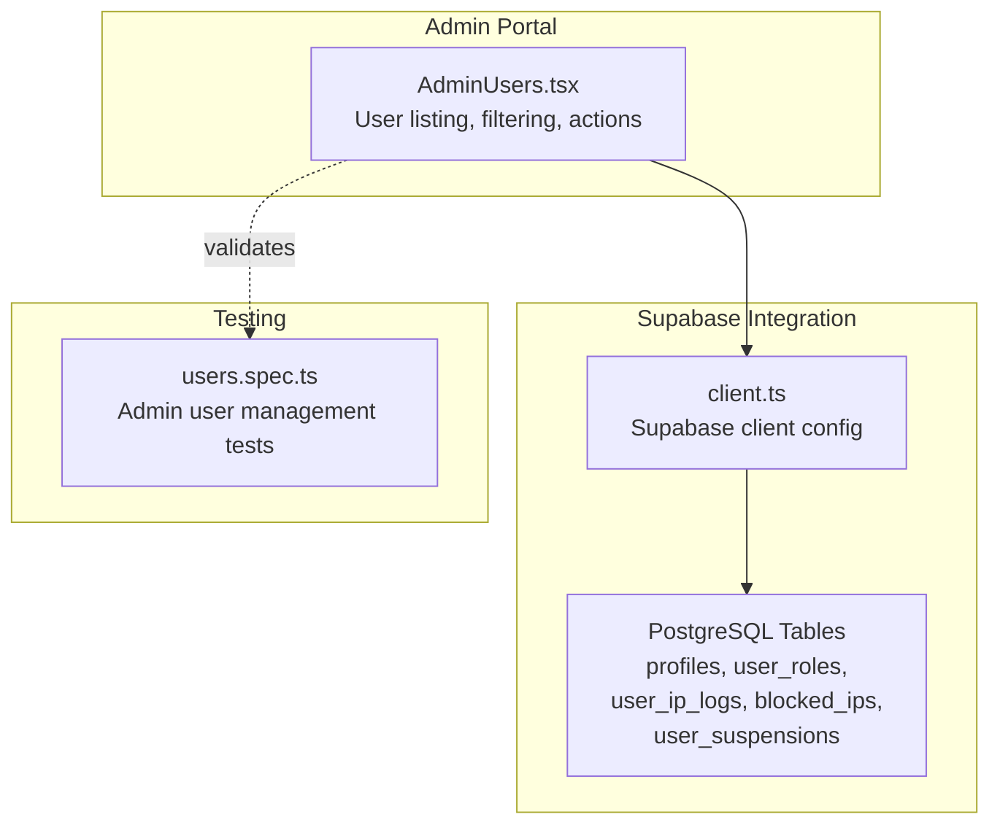
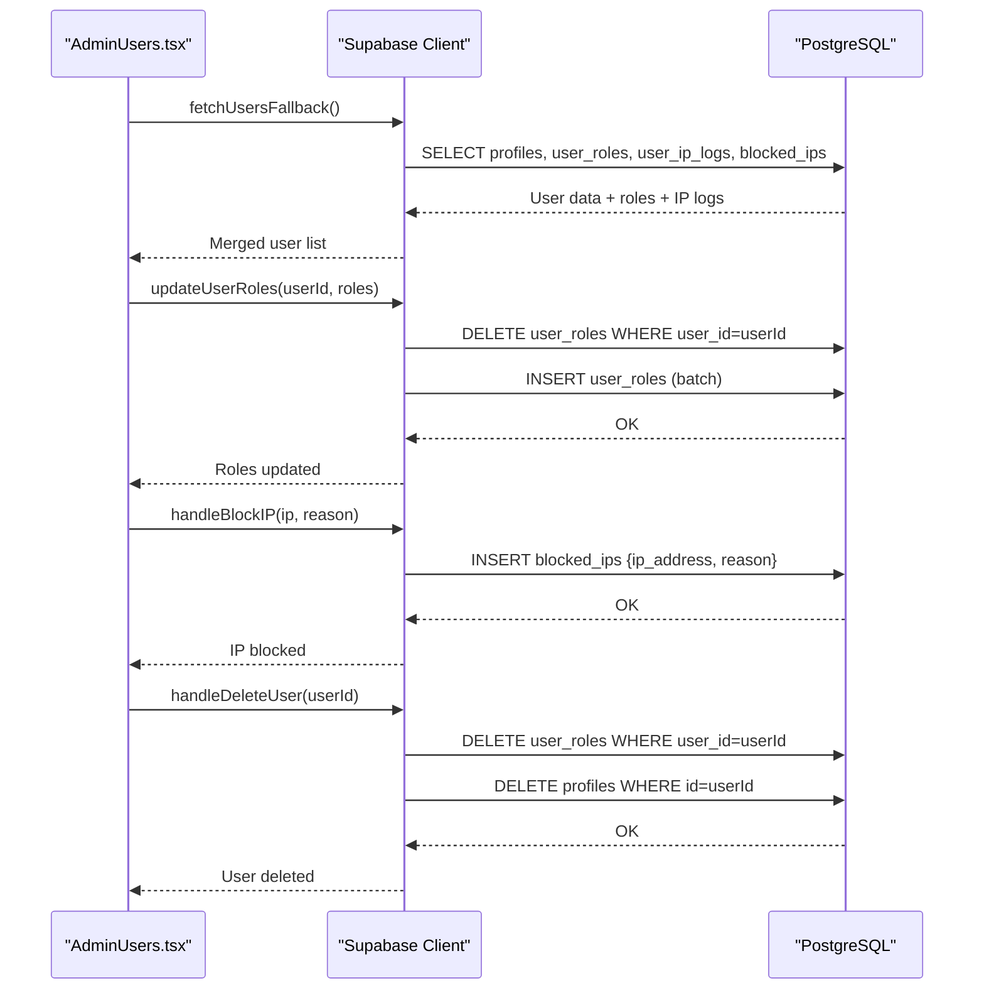
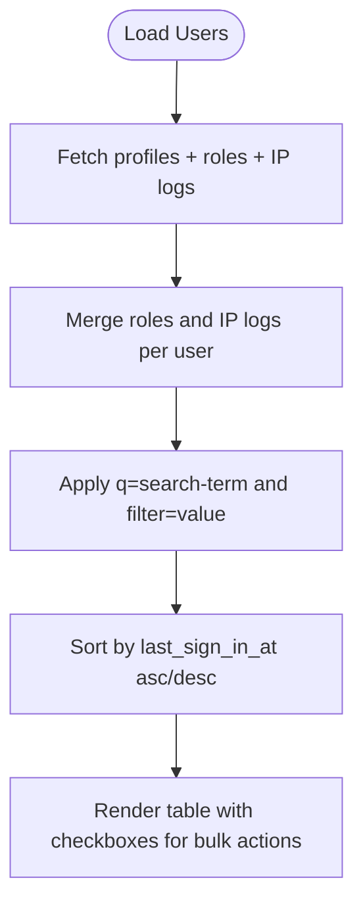
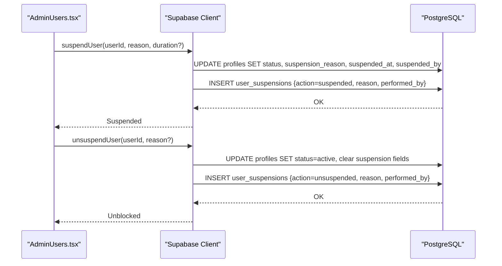
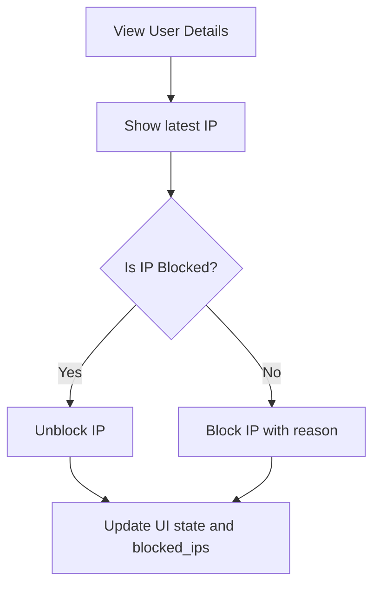
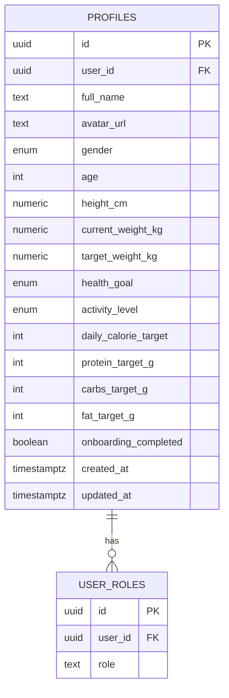
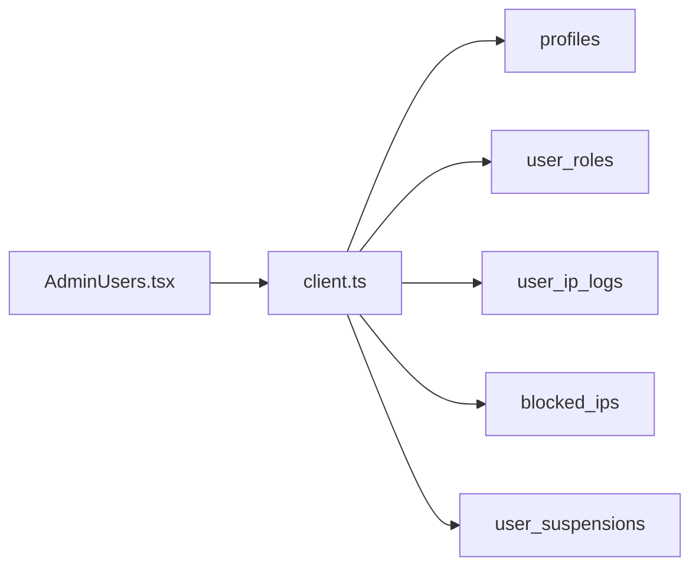

# User Management Endpoints

<cite>
**Referenced Files in This Document**
- [AdminUsers.tsx](file://src/pages/admin/AdminUsers.tsx)
- [client.ts](file://src/integrations/supabase/client.ts)
- [users.spec.ts](file://e2e/admin/users.spec.ts)
- [20250220000000_create_essential_tables.sql](file://supabase/migrations/20250220000000_create_essential_tables.sql)
- [CREATE_TABLES_SQL.md](file://CREATE_TABLES_SQL.md)
- [IMPLEMENTATION_PLAN.md](file://IMPLEMENTATION_PLAN.md)
</cite>

## Table of Contents
1. [Introduction](#introduction)
2. [Project Structure](#project-structure)
3. [Core Components](#core-components)
4. [Architecture Overview](#architecture-overview)
5. [Detailed Component Analysis](#detailed-component-analysis)
6. [Dependency Analysis](#dependency-analysis)
7. [Performance Considerations](#performance-considerations)
8. [Troubleshooting Guide](#troubleshooting-guide)
9. [Conclusion](#conclusion)

## Introduction
This document provides comprehensive REST API documentation for user management endpoints across customer profiles, driver registrations, partner restaurant accounts, and admin user management. It covers CRUD operations, profile updates, address management, dietary preferences, subscription status updates, role transitions, account activation/deactivation, and data export capabilities. It also documents bulk user operations, user search and filtering, and profile synchronization across platforms.

## Project Structure
The user management functionality spans:
- Admin portal UI that orchestrates user operations and integrates with Supabase
- Supabase client configuration for secure database access
- End-to-end tests that define expected user management behaviors
- Database schema supporting profiles, roles, and user-related metadata



**Diagram sources**
- [AdminUsers.tsx:106-221](file://src/pages/admin/AdminUsers.tsx#L106-L221)
- [client.ts:47-57](file://src/integrations/supabase/client.ts#L47-L57)
- [users.spec.ts:1-338](file://e2e/admin/users.spec.ts#L1-L338)

**Section sources**
- [AdminUsers.tsx:106-221](file://src/pages/admin/AdminUsers.tsx#L106-L221)
- [client.ts:47-57](file://src/integrations/supabase/client.ts#L47-L57)
- [users.spec.ts:1-338](file://e2e/admin/users.spec.ts#L1-L338)

## Core Components
- AdminUsers page: Fetches and displays users, supports filtering/search, manages roles, blocks/unblocks IPs, deletes users, and opens detailed views.
- Supabase client: Provides authenticated access to PostgreSQL with session persistence and storage abstraction for native environments.
- Database schema: Defines profiles, roles, IP logs, blocked IPs, and suspension history tables with Row Level Security policies.

Key responsibilities:
- User listing and search via query parameters and filters
- Role assignment/removal and role badges
- IP logging and blocking
- Suspension history and restoration
- Bulk selection and batch actions

**Section sources**
- [AdminUsers.tsx:146-221](file://src/pages/admin/AdminUsers.tsx#L146-L221)
- [client.ts:47-57](file://src/integrations/supabase/client.ts#L47-L57)
- [20250220000000_create_essential_tables.sql:137-167](file://supabase/migrations/20250220000000_create_essential_tables.sql#L137-L167)
- [CREATE_TABLES_SQL.md:98-137](file://CREATE_TABLES_SQL.md#L98-L137)

## Architecture Overview
The admin user management flow integrates UI actions with Supabase queries and database mutations.



**Diagram sources**
- [AdminUsers.tsx:146-221](file://src/pages/admin/AdminUsers.tsx#L146-L221)
- [AdminUsers.tsx:251-283](file://src/pages/admin/AdminUsers.tsx#L251-L283)
- [client.ts:47-57](file://src/integrations/supabase/client.ts#L47-L57)

## Detailed Component Analysis

### User Listing and Filtering
- Endpoint pattern: GET /admin/users with optional query parameters
- Query parameters:
  - q=search-term: Full-text search across name and email
  - filter=value: Filter by status or role
- Sorting: last_sign_in_at with asc/desc direction
- Bulk selection: Select multiple users for batch actions



**Diagram sources**
- [AdminUsers.tsx:146-221](file://src/pages/admin/AdminUsers.tsx#L146-L221)
- [AdminUsers.tsx:335-372](file://src/pages/admin/AdminUsers.tsx#L335-L372)

**Section sources**
- [AdminUsers.tsx:146-221](file://src/pages/admin/AdminUsers.tsx#L146-L221)
- [AdminUsers.tsx:335-372](file://src/pages/admin/AdminUsers.tsx#L335-L372)
- [users.spec.ts:23-51](file://e2e/admin/users.spec.ts#L23-L51)

### Role Management
- Available roles: user, admin, gym_owner, staff, restaurant, driver, fleet_manager, partner
- Operations:
  - Get available roles
  - Add a single role
  - Remove a single role
  - Replace all roles atomically
- UI: Role badges with color-coded indicators; confirmation for sensitive roles

```mermaid
classDiagram
class RoleManager {
+getAvailableRoles() UserRole[]
+addUserRole(userId, role) void
+removeUserRole(userId, role) void
+updateUserRoles(userId, roles) void
}
class UserRole {
<<enum>>
"user","admin","gym_owner","staff","restaurant","driver","fleet_manager","partner"
}
RoleManager --> UserRole : "manages"
```

**Diagram sources**
- [IMPLEMENTATION_PLAN.md:166-212](file://IMPLEMENTATION_PLAN.md#L166-L212)

**Section sources**
- [IMPLEMENTATION_PLAN.md:166-212](file://IMPLEMENTATION_PLAN.md#L166-L212)
- [AdminUsers.tsx:313-333](file://src/pages/admin/AdminUsers.tsx#L313-L333)

### Account Status and Suspension
- Status values: active, blocked, suspended
- Operations:
  - Suspend user (temporary or permanent)
  - Unsuspend user
  - Retrieve suspension history
- Suspensions logged in user_suspensions table with performed_by and reason



**Diagram sources**
- [IMPLEMENTATION_PLAN.md:333-386](file://IMPLEMENTATION_PLAN.md#L333-L386)

**Section sources**
- [IMPLEMENTATION_PLAN.md:333-386](file://IMPLEMENTATION_PLAN.md#L333-L386)
- [20250220000000_create_essential_tables.sql:137-167](file://supabase/migrations/20250220000000_create_essential_tables.sql#L137-L167)

### IP Management and Blocking
- View latest IP and IP history
- Block/unblock IP with reason
- Blocked IPs stored in blocked_ips table



**Diagram sources**
- [AdminUsers.tsx:223-311](file://src/pages/admin/AdminUsers.tsx#L223-L311)

**Section sources**
- [AdminUsers.tsx:223-311](file://src/pages/admin/AdminUsers.tsx#L223-L311)

### Profile Updates and Dietary Preferences
- Profiles table includes personal attributes and nutritional targets
- UI supports updating profile information and dietary preferences
- Nutritional goals and targets are part of the profile schema



**Diagram sources**
- [20250220000000_create_essential_tables.sql:137-167](file://supabase/migrations/20250220000000_create_essential_tables.sql#L137-L167)
- [CREATE_TABLES_SQL.md:98-137](file://CREATE_TABLES_SQL.md#L98-L137)

**Section sources**
- [20250220000000_create_essential_tables.sql:137-167](file://supabase/migrations/20250220000000_create_essential_tables.sql#L137-L167)
- [CREATE_TABLES_SQL.md:98-137](file://CREATE_TABLES_SQL.md#L98-L137)

### Subscription Management
- Per-user subscription management integrated in user detail view
- Supports viewing and modifying subscription status

**Section sources**
- [AdminUsers.tsx:1046-1050](file://src/pages/admin/AdminUsers.tsx#L1046-L1050)

### Data Export Capabilities
- Test coverage indicates export capability for users list
- Implementation likely leverages backend functions or CSV generation

**Section sources**
- [users.spec.ts:323-336](file://e2e/admin/users.spec.ts#L323-L336)

### Bulk User Operations
- Multi-select users in the table
- Batch actions supported via UI selections
- Backend operations include atomic role updates and deletions

**Section sources**
- [AdminUsers.tsx:345-363](file://src/pages/admin/AdminUsers.tsx#L345-L363)
- [AdminUsers.tsx:251-283](file://src/pages/admin/AdminUsers.tsx#L251-L283)

### User Search and Filtering
- Search by name or email via q parameter
- Filter by status or role via filter parameter
- Sorting by last sign-in time with toggle direction

**Section sources**
- [AdminUsers.tsx:335-372](file://src/pages/admin/AdminUsers.tsx#L335-L372)
- [users.spec.ts:23-51](file://e2e/admin/users.spec.ts#L23-L51)

### Profile Synchronization Across Platforms
- Supabase client persists sessions using Capacitor Preferences on native and localStorage on web
- Ensures consistent user state across platforms

**Section sources**
- [client.ts:18-42](file://src/integrations/supabase/client.ts#L18-L42)

## Dependency Analysis
- AdminUsers depends on Supabase client for all data operations
- Supabase client depends on environment variables for configuration
- Database tables enforce referential integrity and security policies



**Diagram sources**
- [AdminUsers.tsx:146-221](file://src/pages/admin/AdminUsers.tsx#L146-L221)
- [client.ts:47-57](file://src/integrations/supabase/client.ts#L47-L57)
- [20250220000000_create_essential_tables.sql:137-167](file://supabase/migrations/20250220000000_create_essential_tables.sql#L137-L167)

**Section sources**
- [AdminUsers.tsx:146-221](file://src/pages/admin/AdminUsers.tsx#L146-L221)
- [client.ts:47-57](file://src/integrations/supabase/client.ts#L47-L57)
- [20250220000000_create_essential_tables.sql:137-167](file://supabase/migrations/20250220000000_create_essential_tables.sql#L137-L167)

## Performance Considerations
- Batch role updates minimize round-trips by deleting and inserting roles atomically
- Pagination and filtering reduce payload sizes for large user lists
- IP history is truncated to recent entries in UI to limit rendering overhead

## Troubleshooting Guide
- Missing Supabase configuration: Ensure VITE_SUPABASE_URL and VITE_SUPABASE_PUBLISHABLE_KEY are set; otherwise, client initialization logs an error
- User deletion failures: Deletion requires removal from user_roles before profiles; errors indicate related data (e.g., orders) preventing cascade deletion
- Role update anomalies: Use updateUserRoles to replace all roles atomically; partial updates risk inconsistent state

**Section sources**
- [client.ts:10-16](file://src/integrations/supabase/client.ts#L10-L16)
- [AdminUsers.tsx:251-283](file://src/pages/admin/AdminUsers.tsx#L251-L283)
- [IMPLEMENTATION_PLAN.md:194-212](file://IMPLEMENTATION_PLAN.md#L194-L212)

## Conclusion
The user management system provides a robust foundation for customer, driver, partner, and admin user lifecycle operations. It integrates UI-driven actions with Supabase-backed data operations, ensuring secure, auditable, and scalable user administration across platforms.