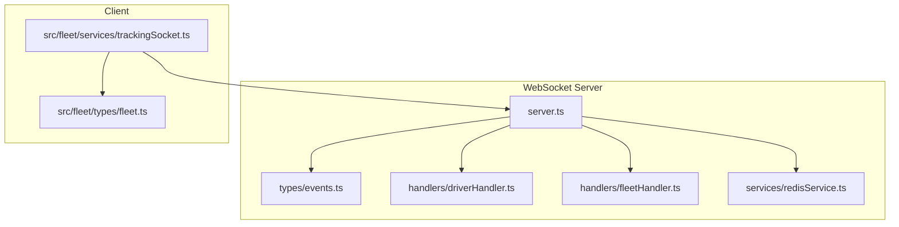
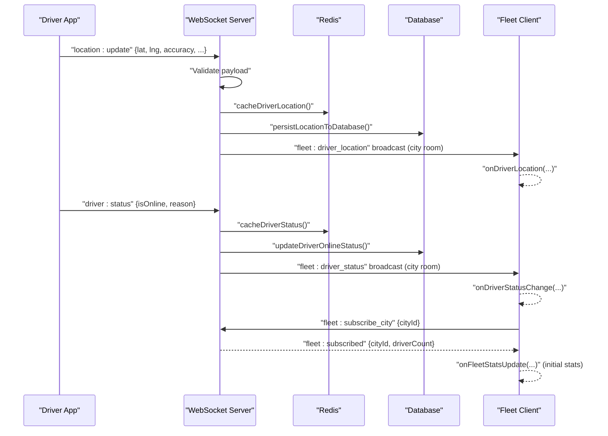
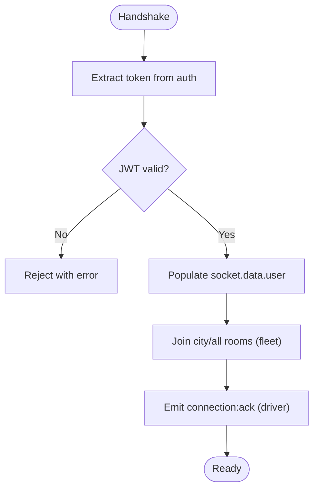
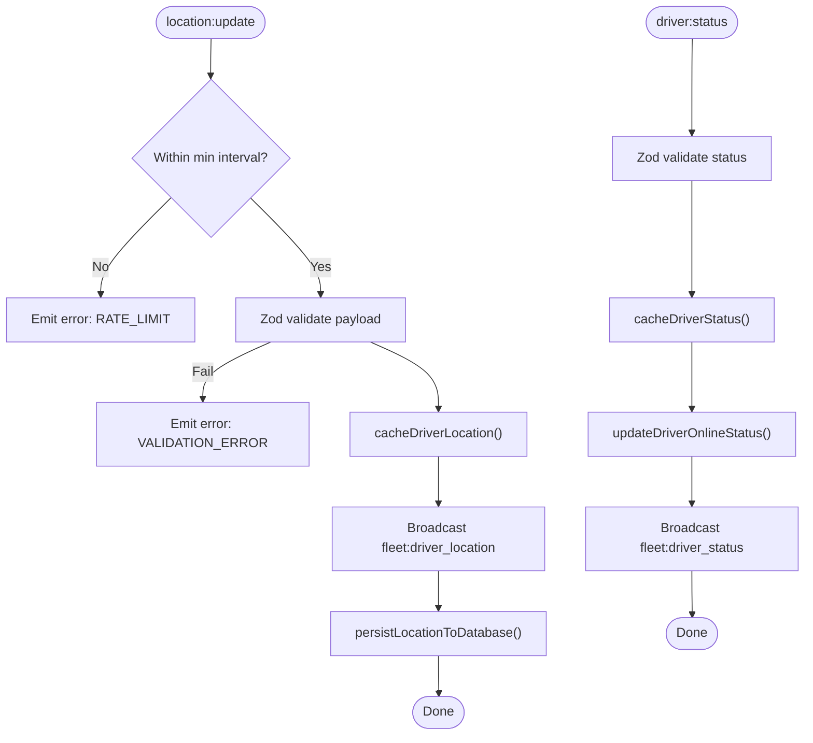
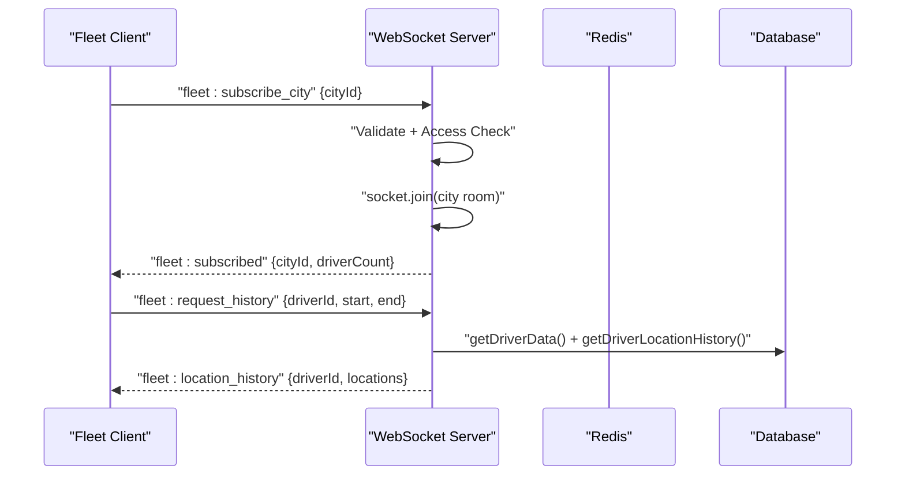
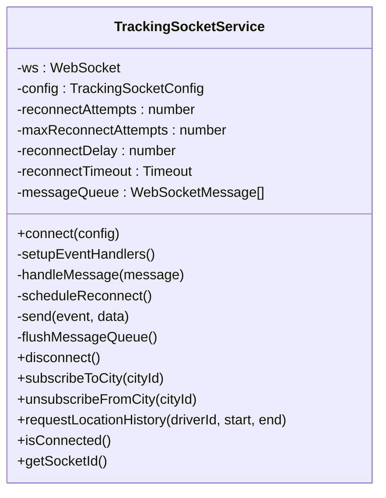
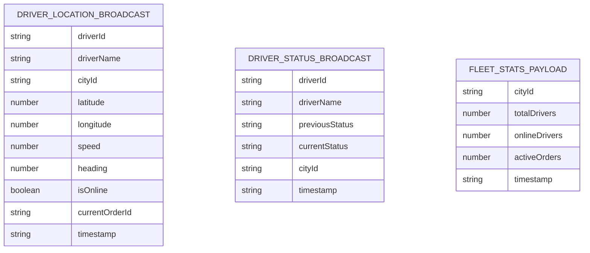
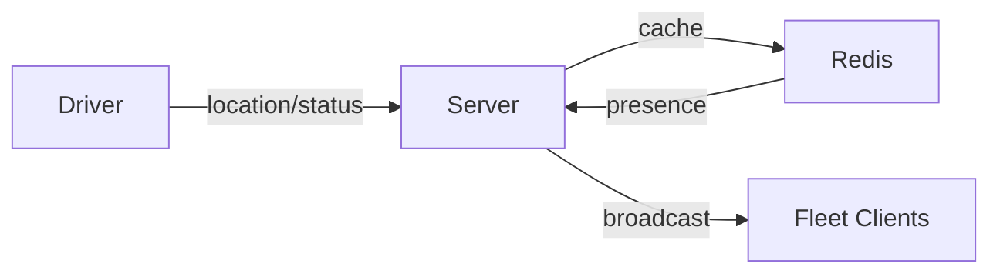
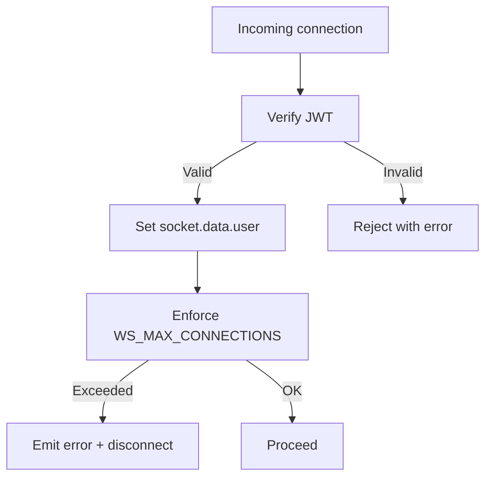
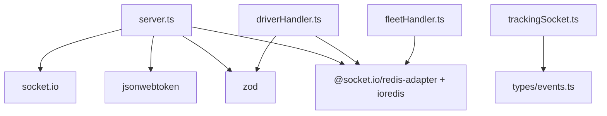

# WebSocket API

<cite>
**Referenced Files in This Document**
- [server.ts](file://websocket-server/src/server.ts)
- [events.ts](file://websocket-server/src/types/events.ts)
- [driverHandler.ts](file://websocket-server/src/handlers/driverHandler.ts)
- [fleetHandler.ts](file://websocket-server/src/handlers/fleetHandler.ts)
- [redisService.ts](file://websocket-server/src/services/redisService.ts)
- [trackingSocket.ts](file://src/fleet/services/trackingSocket.ts)
- [fleet.ts](file://src/fleet/types/fleet.ts)
- [realtime.spec.ts](file://e2e/system/realtime.spec.ts)
- [20260226000006_rate_limiting_enforcement.sql](file://supabase/migrations/20260226000006_rate_limiting_enforcement.sql)
</cite>

## Table of Contents
1. [Introduction](#introduction)
2. [Project Structure](#project-structure)
3. [Core Components](#core-components)
4. [Architecture Overview](#architecture-overview)
5. [Detailed Component Analysis](#detailed-component-analysis)
6. [Dependency Analysis](#dependency-analysis)
7. [Performance Considerations](#performance-considerations)
8. [Troubleshooting Guide](#troubleshooting-guide)
9. [Conclusion](#conclusion)
10. [Appendices](#appendices)

## Introduction
This document specifies the WebSocket API used by Nutrio’s Fleet Management Portal for real-time delivery tracking, driver coordination, and live notifications. It covers connection establishment, authentication, message formats, event types, client-side integration patterns, Redis-backed pub/sub and caching, scalability, security, rate limiting, and operational monitoring.

## Project Structure
The WebSocket system comprises:
- A standalone WebSocket server built with Socket.IO and Redis adapter for multi-node scaling
- Client-side service using native WebSocket for compatibility and simplicity
- Shared type definitions for events and payloads
- End-to-end tests validating real-time behavior

**Diagram sources**
- [server.ts:1-256](file://websocket-server/src/server.ts#L1-L256)
- [events.ts:1-210](file://websocket-server/src/types/events.ts#L1-L210)
- [driverHandler.ts:1-318](file://websocket-server/src/handlers/driverHandler.ts#L1-L318)
- [fleetHandler.ts:1-247](file://websocket-server/src/handlers/fleetHandler.ts#L1-L247)
- [redisService.ts:1-264](file://websocket-server/src/services/redisService.ts#L1-L264)
- [trackingSocket.ts:1-287](file://src/fleet/services/trackingSocket.ts#L1-L287)
- [fleet.ts:448-484](file://src/fleet/types/fleet.ts#L448-L484)

**Section sources**
- [server.ts:1-256](file://websocket-server/src/server.ts#L1-L256)
- [events.ts:1-210](file://websocket-server/src/types/events.ts#L1-L210)
- [driverHandler.ts:1-318](file://websocket-server/src/handlers/driverHandler.ts#L1-L318)
- [fleetHandler.ts:1-247](file://websocket-server/src/handlers/fleetHandler.ts#L1-L247)
- [redisService.ts:1-264](file://websocket-server/src/services/redisService.ts#L1-L264)
- [trackingSocket.ts:1-287](file://src/fleet/services/trackingSocket.ts#L1-L287)
- [fleet.ts:448-484](file://src/fleet/types/fleet.ts#L448-L484)

## Core Components
- WebSocket Server: Socket.IO with Redis adapter, JWT authentication middleware, connection lifecycle management, and health endpoints.
- Driver Handler: Validates and processes driver location/status updates, caches data in Redis, persists to DB, and broadcasts to fleet clients.
- Fleet Handler: Manages city subscriptions, access control, and location history requests; emits stats and acknowledgments.
- Redis Service: Provides caching, pub/sub synchronization, and city statistics.
- Client Service: Native WebSocket client with token-based auth, exponential backoff, message queuing, and event routing.
- Shared Types: Strongly typed event names, payloads, and room names.

**Section sources**
- [server.ts:65-150](file://websocket-server/src/server.ts#L65-L150)
- [driverHandler.ts:48-100](file://websocket-server/src/handlers/driverHandler.ts#L48-L100)
- [fleetHandler.ts:36-82](file://websocket-server/src/handlers/fleetHandler.ts#L36-L82)
- [redisService.ts:87-146](file://websocket-server/src/services/redisService.ts#L87-L146)
- [trackingSocket.ts:34-95](file://src/fleet/services/trackingSocket.ts#L34-L95)
- [events.ts:157-186](file://websocket-server/src/types/events.ts#L157-L186)

## Architecture Overview
The system uses Socket.IO with Redis adapter to scale across multiple server instances. Drivers publish location/status updates; the server validates, caches, persists, and broadcasts to fleet clients subscribed to city rooms. Fleet clients can request historical data and subscribe/unsubscribe to cities.

**Diagram sources**
- [driverHandler.ts:105-207](file://websocket-server/src/handlers/driverHandler.ts#L105-L207)
- [driverHandler.ts:212-275](file://websocket-server/src/handlers/driverHandler.ts#L212-L275)
- [fleetHandler.ts:87-140](file://websocket-server/src/handlers/fleetHandler.ts#L87-L140)
- [redisService.ts:87-146](file://websocket-server/src/services/redisService.ts#L87-L146)
- [server.ts:108-150](file://websocket-server/src/server.ts#L108-L150)

## Detailed Component Analysis

### Server Initialization and Authentication
- Validates JWT from handshake auth; populates socket metadata with user type, roles, and assigned cities.
- Enforces global connection cap and emits an error event prior to disconnect when capacity is reached.
- Exposes health and readiness endpoints for monitoring.

**Diagram sources**
- [server.ts:65-103](file://websocket-server/src/server.ts#L65-L103)
- [server.ts:108-150](file://websocket-server/src/server.ts#L108-L150)

**Section sources**
- [server.ts:65-103](file://websocket-server/src/server.ts#L65-L103)
- [server.ts:108-150](file://websocket-server/src/server.ts#L108-L150)

### Driver Events and Processing
- Location updates:
  - Rate limiting enforced per driver.
  - Payload validated with strict schema.
  - Cached in Redis with TTL; persisted asynchronously to DB.
  - Broadcasts to city and optionally all-city rooms.
- Status updates:
  - Validates status payload.
  - Updates Redis and DB status; broadcasts to fleet clients.

**Diagram sources**
- [driverHandler.ts:110-207](file://websocket-server/src/handlers/driverHandler.ts#L110-L207)
- [driverHandler.ts:212-275](file://websocket-server/src/handlers/driverHandler.ts#L212-L275)
- [redisService.ts:87-146](file://websocket-server/src/services/redisService.ts#L87-L146)

**Section sources**
- [driverHandler.ts:24-44](file://websocket-server/src/handlers/driverHandler.ts#L24-L44)
- [driverHandler.ts:105-207](file://websocket-server/src/handlers/driverHandler.ts#L105-L207)
- [driverHandler.ts:212-275](file://websocket-server/src/handlers/driverHandler.ts#L212-L275)
- [redisService.ts:87-146](file://websocket-server/src/services/redisService.ts#L87-L146)

### Fleet Events and Access Control
- City subscription:
  - Validates UUID and checks role/city access.
  - Joins appropriate rooms and returns subscribed ack with driver counts.
- Location history:
  - Validates request range and driver ownership.
  - Returns paginated history response.

**Diagram sources**
- [fleetHandler.ts:87-140](file://websocket-server/src/handlers/fleetHandler.ts#L87-L140)
- [fleetHandler.ts:145-212](file://websocket-server/src/handlers/fleetHandler.ts#L145-L212)
- [redisService.ts:212-224](file://websocket-server/src/services/redisService.ts#L212-L224)

**Section sources**
- [fleetHandler.ts:19-28](file://websocket-server/src/handlers/fleetHandler.ts#L19-L28)
- [fleetHandler.ts:87-140](file://websocket-server/src/handlers/fleetHandler.ts#L87-L140)
- [fleetHandler.ts:145-212](file://websocket-server/src/handlers/fleetHandler.ts#L145-L212)
- [redisService.ts:212-224](file://websocket-server/src/services/redisService.ts#L212-L224)

### Client-Side WebSocket Service (React)
- Establishes connection with token query parameter.
- Subscribes to city rooms based on user role and assigned cities upon connect.
- Implements exponential backoff reconnection with capped attempts.
- Queues outgoing messages until connected; handles incoming events and dispatches callbacks.

**Diagram sources**
- [trackingSocket.ts:25-287](file://src/fleet/services/trackingSocket.ts#L25-L287)

**Section sources**
- [trackingSocket.ts:34-95](file://src/fleet/services/trackingSocket.ts#L34-L95)
- [trackingSocket.ts:162-178](file://src/fleet/services/trackingSocket.ts#L162-L178)
- [trackingSocket.ts:180-198](file://src/fleet/services/trackingSocket.ts#L180-L198)
- [trackingSocket.ts:213-226](file://src/fleet/services/trackingSocket.ts#L213-L226)
- [trackingSocket.ts:228-269](file://src/fleet/services/trackingSocket.ts#L228-L269)

### Message Schemas and Event Types
- Driver location broadcast payload includes driver identity, coordinates, speed, heading, online status, and timestamp.
- Driver status broadcast includes driver identity, previous/current statuses, city, and timestamp.
- Fleet stats payload includes city metrics and timestamp.
- Room names define scoping for city and all-fleet channels.

**Diagram sources**
- [events.ts:37-48](file://websocket-server/src/types/events.ts#L37-L48)
- [events.ts:57-64](file://websocket-server/src/types/events.ts#L57-L64)
- [events.ts:119-125](file://websocket-server/src/types/events.ts#L119-L125)

**Section sources**
- [events.ts:27-48](file://websocket-server/src/types/events.ts#L27-L48)
- [events.ts:52-64](file://websocket-server/src/types/events.ts#L52-L64)
- [events.ts:119-125](file://websocket-server/src/types/events.ts#L119-L125)
- [events.ts:182-186](file://websocket-server/src/types/events.ts#L182-L186)

### Redis-Based Pub/Sub and Caching
- Driver location and status cached with TTL; city stats maintained for fleet dashboards.
- Redis adapter ensures multi-instance synchronization for pub/sub and presence.

**Diagram sources**
- [redisService.ts:87-146](file://websocket-server/src/services/redisService.ts#L87-L146)
- [server.ts:53-55](file://websocket-server/src/server.ts#L53-L55)

**Section sources**
- [redisService.ts:87-146](file://websocket-server/src/services/redisService.ts#L87-L146)
- [redisService.ts:212-224](file://websocket-server/src/services/redisService.ts#L212-L224)
- [server.ts:53-55](file://websocket-server/src/server.ts#L53-L55)

### Security, Authentication, and Rate Limiting
- JWT-based authentication during handshake; rejects missing/expired/invalid tokens.
- Global connection cap prevents overload; emits error prior to disconnect.
- Driver location updates are rate-limited per driver to mitigate spam.
- Supabase migration defines a robust rate limiting framework for API enforcement.

**Diagram sources**
- [server.ts:65-103](file://websocket-server/src/server.ts#L65-L103)
- [server.ts:108-117](file://websocket-server/src/server.ts#L108-L117)
- [driverHandler.ts:111-123](file://websocket-server/src/handlers/driverHandler.ts#L111-L123)
- [20260226000006_rate_limiting_enforcement.sql:70-157](file://supabase/migrations/20260226000006_rate_limiting_enforcement.sql#L70-L157)

**Section sources**
- [server.ts:65-103](file://websocket-server/src/server.ts#L65-L103)
- [server.ts:108-117](file://websocket-server/src/server.ts#L108-L117)
- [driverHandler.ts:24-26](file://websocket-server/src/handlers/driverHandler.ts#L24-L26)
- [driverHandler.ts:111-123](file://websocket-server/src/handlers/driverHandler.ts#L111-L123)
- [20260226000006_rate_limiting_enforcement.sql:70-157](file://supabase/migrations/20260226000006_rate_limiting_enforcement.sql#L70-L157)

### Monitoring and Health
- Health endpoint returns connection counts and environment.
- Readiness probe checks Redis connectivity.
- Graceful shutdown closes server, sockets, Redis, and DB pool.

**Section sources**
- [server.ts:162-192](file://websocket-server/src/server.ts#L162-L192)
- [server.ts:197-224](file://websocket-server/src/server.ts#L197-L224)
- [redisService.ts:254-263](file://websocket-server/src/services/redisService.ts#L254-L263)

## Dependency Analysis
- Server depends on Socket.IO, Redis adapter, JWT, and Zod for validation.
- Handlers depend on shared event types and Redis/DB helpers.
- Client depends on shared event type definitions and environment variables.

**Diagram sources**
- [server.ts:6-16](file://websocket-server/src/server.ts#L6-L16)
- [driverHandler.ts:14-22](file://websocket-server/src/handlers/driverHandler.ts#L14-L22)
- [fleetHandler.ts:13-17](file://websocket-server/src/handlers/fleetHandler.ts#L13-L17)
- [trackingSocket.ts:4-6](file://src/fleet/services/trackingSocket.ts#L4-L6)
- [events.ts:157-178](file://websocket-server/src/types/events.ts#L157-L178)

**Section sources**
- [server.ts:6-16](file://websocket-server/src/server.ts#L6-L16)
- [driverHandler.ts:14-22](file://websocket-server/src/handlers/driverHandler.ts#L14-L22)
- [fleetHandler.ts:13-17](file://websocket-server/src/handlers/fleetHandler.ts#L13-L17)
- [trackingSocket.ts:4-6](file://src/fleet/services/trackingSocket.ts#L4-L6)
- [events.ts:157-178](file://websocket-server/src/types/events.ts#L157-L178)

## Performance Considerations
- Use Redis adapter for horizontal scaling across multiple server instances.
- Enable compression for large messages and cap max buffer size.
- Apply rate limiting on driver location updates to reduce load.
- Cache recent driver locations and statuses to minimize DB reads.
- Monitor connection counts and Redis health via health/readiness endpoints.

[No sources needed since this section provides general guidance]

## Troubleshooting Guide
Common issues and resolutions:
- Authentication failures: Ensure the token is present, not expired, and signed with the correct secret.
- Connection refused or capacity reached: Check server logs and WS_MAX_CONNECTIONS; verify Redis readiness.
- Rate limit exceeded: Reduce update frequency or increase intervals; review client-side throttling.
- Messages not received: Confirm room subscriptions and that the client is connected before sending.

Operational checks:
- Health endpoint: GET /health for connection metrics.
- Readiness probe: GET /ready for Redis connectivity.
- Graceful shutdown: SIGTERM/SIGINT triggers orderly closure.

**Section sources**
- [server.ts:65-103](file://websocket-server/src/server.ts#L65-L103)
- [server.ts:108-117](file://websocket-server/src/server.ts#L108-L117)
- [server.ts:162-192](file://websocket-server/src/server.ts#L162-L192)
- [driverHandler.ts:111-123](file://websocket-server/src/handlers/driverHandler.ts#L111-L123)
- [redisService.ts:254-263](file://websocket-server/src/services/redisService.ts#L254-L263)

## Conclusion
Nutrio’s WebSocket API provides a scalable, secure, and observable real-time infrastructure for driver tracking and fleet coordination. With JWT authentication, Redis-backed caching and pub/sub, and robust client-side reconnection logic, it supports high-throughput scenarios while maintaining reliability and operability.

[No sources needed since this section summarizes without analyzing specific files]

## Appendices

### API Reference: Events and Payloads
- Client → Server
  - location:update: Driver location payload
  - driver:status: Driver status payload
  - fleet:subscribe_city: City subscription payload
  - fleet:request_history: Location history request payload
- Server → Client
  - connection:ack: Driver connection acknowledgment
  - order:assigned: Driver assignment (if applicable)
  - fleet:driver_location: Driver location broadcast
  - fleet:driver_status: Driver status broadcast
  - fleet:stats_update: City stats update
  - fleet:subscribed: City subscription acknowledgment
  - fleet:location_history: Historical points
  - error: Standardized error envelope

**Section sources**
- [events.ts:157-178](file://websocket-server/src/types/events.ts#L157-L178)
- [driverHandler.ts:105-207](file://websocket-server/src/handlers/driverHandler.ts#L105-L207)
- [driverHandler.ts:212-275](file://websocket-server/src/handlers/driverHandler.ts#L212-L275)
- [fleetHandler.ts:87-140](file://websocket-server/src/handlers/fleetHandler.ts#L87-L140)
- [fleetHandler.ts:145-212](file://websocket-server/src/handlers/fleetHandler.ts#L145-L212)

### Client-Side Implementation Notes (React)
- Use the TrackingSocketService singleton or createTrackingSocket() to instantiate.
- Provide token, role, and assigned cities; register callbacks for onConnect/onDisconnect/onError and real-time events.
- Implement exponential backoff and message queue flushing on connect.
- Subscribe to city rooms after connection; request history with time bounds.

**Section sources**
- [trackingSocket.ts:34-95](file://src/fleet/services/trackingSocket.ts#L34-L95)
- [trackingSocket.ts:162-178](file://src/fleet/services/trackingSocket.ts#L162-L178)
- [trackingSocket.ts:213-226](file://src/fleet/services/trackingSocket.ts#L213-L226)
- [trackingSocket.ts:228-269](file://src/fleet/services/trackingSocket.ts#L228-L269)
- [fleet.ts:448-484](file://src/fleet/types/fleet.ts#L448-L484)

### End-to-End Test Coverage
- Real-time WebSocket connectivity and status update expectations are covered by system tests.

**Section sources**
- [realtime.spec.ts:1-37](file://e2e/system/realtime.spec.ts#L1-L37)