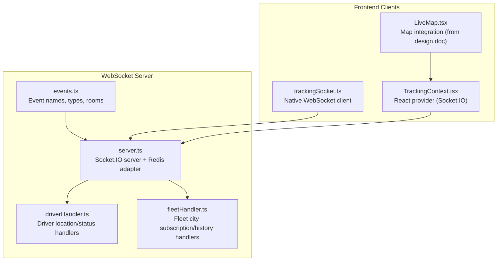
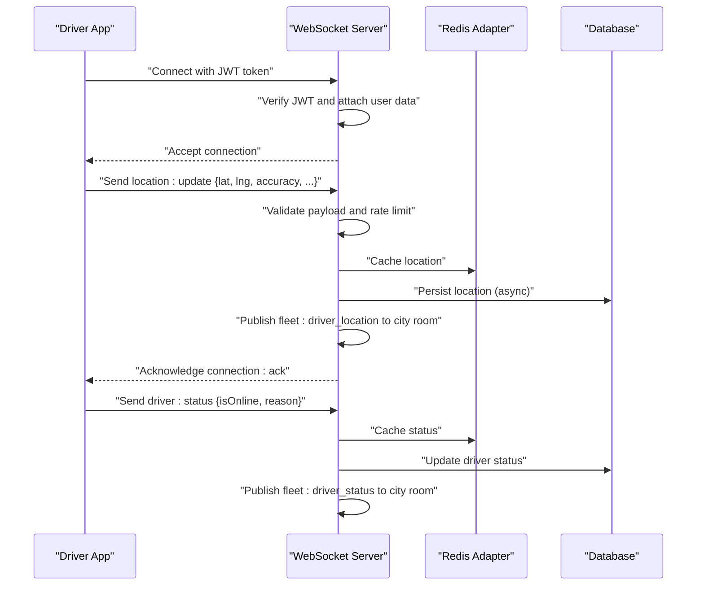
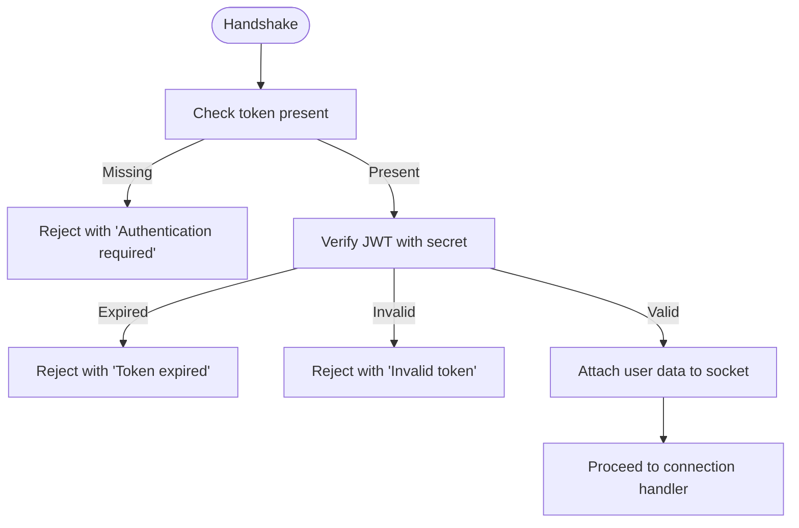
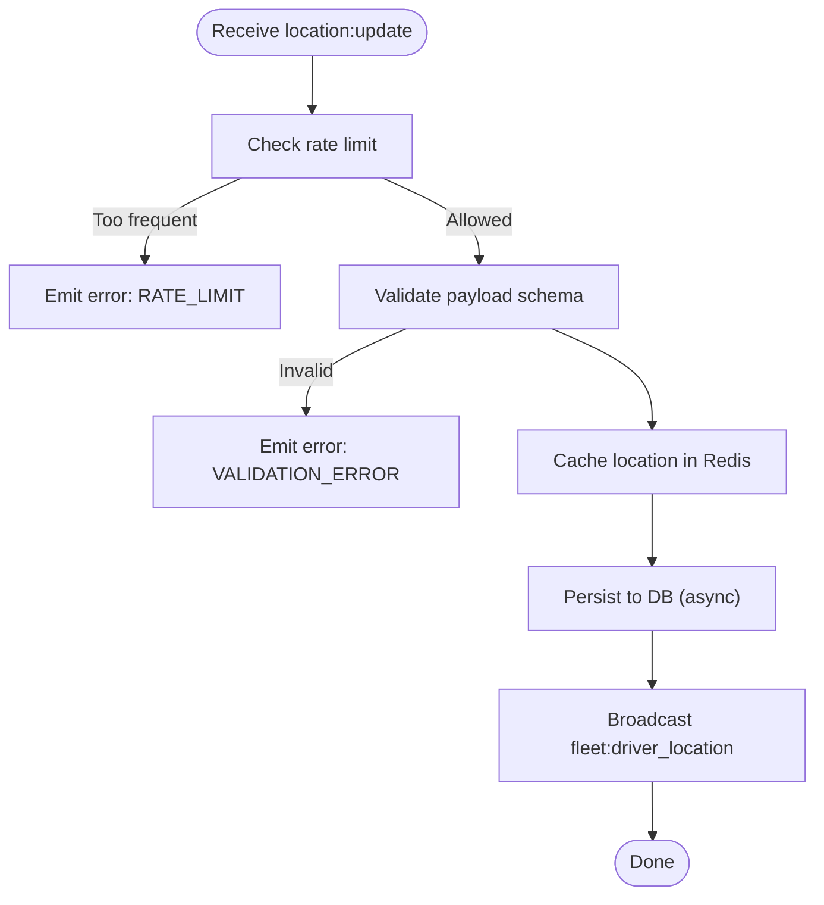
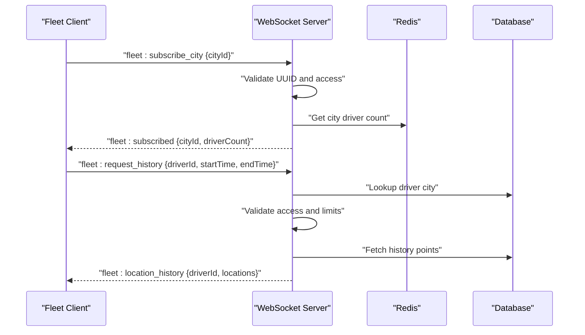
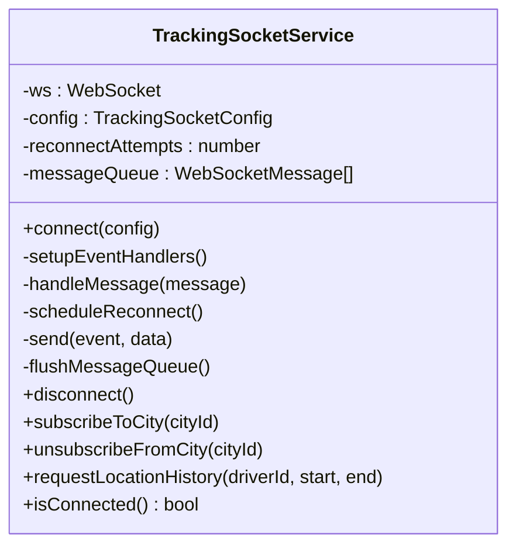
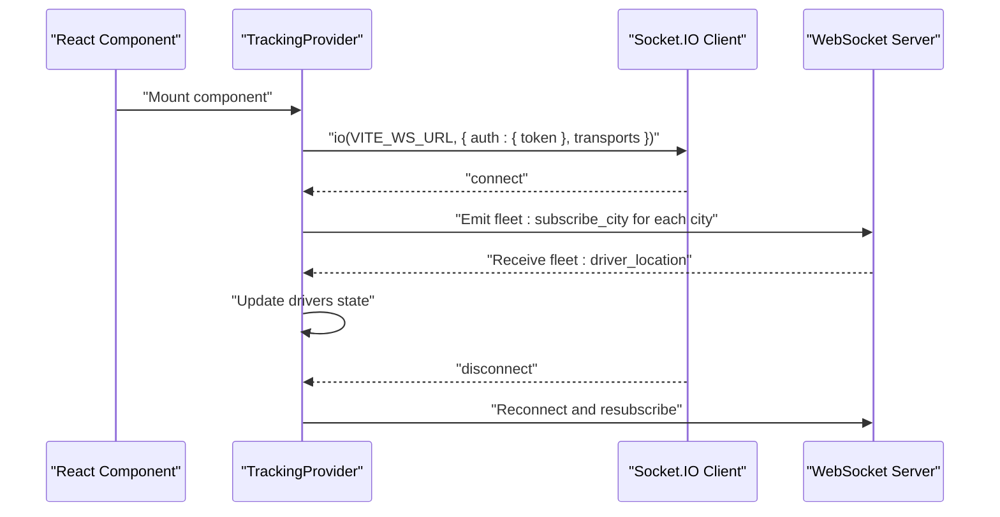
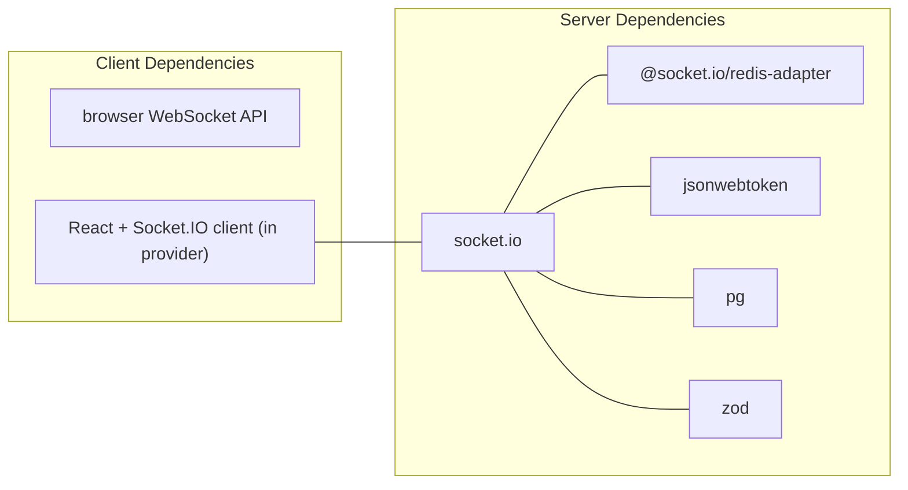

# WebSocket Connections

<cite>
**Referenced Files in This Document**
- [server.ts](file://websocket-server/src/server.ts)
- [events.ts](file://websocket-server/src/types/events.ts)
- [driverHandler.ts](file://websocket-server/src/handlers/driverHandler.ts)
- [fleetHandler.ts](file://websocket-server/src/handlers/fleetHandler.ts)
- [trackingSocket.ts](file://src/fleet/services/trackingSocket.ts)
- [TrackingContext.tsx](file://src/fleet/context/TrackingContext.tsx)
- [LiveMap.tsx](file://docs/fleet-management-portal-design.md)
- [realtime.spec.ts](file://e2e/system/realtime.spec.ts)
- [package.json](file://websocket-server/package.json)
</cite>

## Table of Contents
1. [Introduction](#introduction)
2. [Project Structure](#project-structure)
3. [Core Components](#core-components)
4. [Architecture Overview](#architecture-overview)
5. [Detailed Component Analysis](#detailed-component-analysis)
6. [Dependency Analysis](#dependency-analysis)
7. [Performance Considerations](#performance-considerations)
8. [Troubleshooting Guide](#troubleshooting-guide)
9. [Conclusion](#conclusion)

## Introduction
This document describes the WebSocket-based real-time communication system for the Nutrio Fleet Management Platform. It covers connection establishment, authentication, message formats, event types, lifecycle management, error handling, reconnection strategies, and client-side integration patterns. The system supports live driver location tracking, status updates, historical location retrieval, and administrative fleet insights.

## Project Structure
The WebSocket system spans two primary areas:
- Backend server: Socket.IO server with Redis adapter, JWT authentication, and room-based publish/subscribe for city-scoped updates.
- Frontend client: A native WebSocket service for browsers and a React context/provider for Socket.IO-based clients.

**Diagram sources**
- [server.ts:37-51](file://websocket-server/src/server.ts#L37-L51)
- [driverHandler.ts:48-80](file://websocket-server/src/handlers/driverHandler.ts#L48-L80)
- [fleetHandler.ts:36-62](file://websocket-server/src/handlers/fleetHandler.ts#L36-L62)
- [events.ts:157-186](file://websocket-server/src/types/events.ts#L157-L186)
- [trackingSocket.ts:34-53](file://src/fleet/services/trackingSocket.ts#L34-L53)
- [TrackingContext.tsx:24-83](file://src/fleet/context/TrackingContext.tsx#L24-L83)
- [LiveMap.tsx:1945-2043](file://docs/fleet-management-portal-design.md#L1945-L2043)

**Section sources**
- [server.ts:37-51](file://websocket-server/src/server.ts#L37-L51)
- [events.ts:157-186](file://websocket-server/src/types/events.ts#L157-L186)
- [trackingSocket.ts:34-53](file://src/fleet/services/trackingSocket.ts#L34-L53)
- [TrackingContext.tsx:24-83](file://src/fleet/context/TrackingContext.tsx#L24-L83)

## Core Components
- WebSocket Server
  - Socket.IO server with Redis adapter for horizontal scaling.
  - JWT-based authentication middleware validating tokens and attaching user metadata to sockets.
  - Room-based subscriptions by city for targeted broadcasts.
- Driver Handler
  - Accepts driver location and status updates with validation and rate limiting.
  - Broadcasts driver location and status to city-specific rooms and super admin rooms.
  - Persists location asynchronously to the database.
- Fleet Handler
  - Manages city subscriptions and location history requests with access control.
  - Sends initial stats for subscribed cities.
- Client Services
  - Native WebSocket client for browser environments with exponential backoff and message queuing.
  - React context/provider for Socket.IO-based clients with automatic reconnection and city filtering.

**Section sources**
- [server.ts:65-103](file://websocket-server/src/server.ts#L65-L103)
- [driverHandler.ts:105-207](file://websocket-server/src/handlers/driverHandler.ts#L105-L207)
- [fleetHandler.ts:67-140](file://websocket-server/src/handlers/fleetHandler.ts#L67-L140)
- [trackingSocket.ts:25-95](file://src/fleet/services/trackingSocket.ts#L25-L95)
- [TrackingContext.tsx:24-83](file://src/fleet/context/TrackingContext.tsx#L24-L83)

## Architecture Overview
The backend authenticates clients via JWT and routes them to either driver or fleet roles. Drivers publish location/status updates; the server validates and broadcasts to relevant rooms. Fleet clients subscribe to city rooms to receive updates and request historical data.

**Diagram sources**
- [server.ts:65-103](file://websocket-server/src/server.ts#L65-L103)
- [driverHandler.ts:105-207](file://websocket-server/src/handlers/driverHandler.ts#L105-L207)
- [events.ts:157-178](file://websocket-server/src/types/events.ts#L157-L178)

## Detailed Component Analysis

### Server Authentication and Lifecycle
- Authentication
  - Validates presence of token in handshake.auth.
  - Verifies JWT using a shared secret and extracts role, user ID, and assigned cities.
  - Attaches user data to socket for downstream handlers.
- Connection Limits and Metrics
  - Enforces maximum concurrent connections.
  - Tracks driver and fleet connection counts.
- Graceful Shutdown
  - Closes HTTP server, Socket.IO server, disconnects sockets, closes Redis and DB connections.

**Diagram sources**
- [server.ts:65-103](file://websocket-server/src/server.ts#L65-L103)

**Section sources**
- [server.ts:65-103](file://websocket-server/src/server.ts#L65-L103)
- [server.ts:108-150](file://websocket-server/src/server.ts#L108-L150)
- [server.ts:197-224](file://websocket-server/src/server.ts#L197-L224)

### Driver Location and Status Processing
- Location Updates
  - Payload validated with Zod schema (latitude, longitude, accuracy, optional speed/heading/battery).
  - Rate limiting enforced via an in-memory map keyed by driver ID.
  - Cached in Redis and asynchronously persisted to database.
  - Broadcasts to city room and super admin room.
- Status Updates
  - Validates boolean online flag and optional reason enum.
  - Updates Redis status and database.
  - Broadcasts status change to city and super admin rooms.

**Diagram sources**
- [driverHandler.ts:105-207](file://websocket-server/src/handlers/driverHandler.ts#L105-L207)
- [events.ts:27-48](file://websocket-server/src/types/events.ts#L27-L48)

**Section sources**
- [driverHandler.ts:24-43](file://websocket-server/src/handlers/driverHandler.ts#L24-L43)
- [driverHandler.ts:105-207](file://websocket-server/src/handlers/driverHandler.ts#L105-L207)

### Fleet City Subscription and History Requests
- City Subscription
  - Validates UUID city ID and checks access for non-super admins.
  - Joins socket to city room and emits subscribed confirmation with driver count.
- Location History
  - Validates driverId, ISO datetime range, and max points limit.
  - Enforces access control based on assigned cities.
  - Returns paginated history points.

**Diagram sources**
- [fleetHandler.ts:87-140](file://websocket-server/src/handlers/fleetHandler.ts#L87-L140)
- [fleetHandler.ts:145-212](file://websocket-server/src/handlers/fleetHandler.ts#L145-L212)
- [events.ts:92-117](file://websocket-server/src/types/events.ts#L92-L117)

**Section sources**
- [fleetHandler.ts:19-28](file://websocket-server/src/handlers/fleetHandler.ts#L19-L28)
- [fleetHandler.ts:87-140](file://websocket-server/src/handlers/fleetHandler.ts#L87-L140)
- [fleetHandler.ts:145-212](file://websocket-server/src/handlers/fleetHandler.ts#L145-L212)

### Client-Side Native WebSocket Service
- Connection Establishment
  - Connects to configured WebSocket URL with token as query parameter.
  - Subscribes to city rooms based on user role and assigned cities after connect.
- Message Handling
  - Parses incoming JSON messages and routes to callbacks for driver location, status, and stats.
  - Emits error events from the server.
- Reconnection and Queueing
  - Exponential backoff with capped attempts.
  - Queues outgoing messages until connected; flushes on open.

**Diagram sources**
- [trackingSocket.ts:25-95](file://src/fleet/services/trackingSocket.ts#L25-L95)
- [trackingSocket.ts:162-178](file://src/fleet/services/trackingSocket.ts#L162-L178)

**Section sources**
- [trackingSocket.ts:34-95](file://src/fleet/services/trackingSocket.ts#L34-L95)
- [trackingSocket.ts:162-178](file://src/fleet/services/trackingSocket.ts#L162-L178)
- [trackingSocket.ts:180-198](file://src/fleet/services/trackingSocket.ts#L180-L198)
- [trackingSocket.ts:213-226](file://src/fleet/services/trackingSocket.ts#L213-L226)
- [trackingSocket.ts:228-269](file://src/fleet/services/trackingSocket.ts#L228-L269)

### React Context Provider (Socket.IO)
- Provider initializes a Socket.IO connection with auth token and transports array.
- Subscribes to city rooms for super admin or assigned cities.
- Maintains driver list state, connection status, and exposes reconnect function.
- Merges REST-provided driver data with real-time updates.

**Diagram sources**
- [TrackingContext.tsx:24-83](file://src/fleet/context/TrackingContext.tsx#L24-L83)
- [LiveMap.tsx:2086-2141](file://docs/fleet-management-portal-design.md#L2086-L2141)

**Section sources**
- [TrackingContext.tsx:24-83](file://src/fleet/context/TrackingContext.tsx#L24-L83)
- [LiveMap.tsx:2086-2141](file://docs/fleet-management-portal-design.md#L2086-L2141)

## Dependency Analysis
- Backend dependencies include Socket.IO, Redis adapter, JSON Web Token verification, PostgreSQL driver, and Zod for validation.
- Client-side native WebSocket service depends on browser-native WebSocket API and environment variables for endpoint configuration.
- React provider uses Socket.IO client library and integrates with fleet authentication context.

**Diagram sources**
- [package.json:21-29](file://websocket-server/package.json#L21-L29)
- [TrackingContext.tsx:2078-2141](file://src/fleet/context/TrackingContext.tsx#L2078-L2141)

**Section sources**
- [package.json:21-29](file://websocket-server/package.json#L21-L29)
- [TrackingContext.tsx:2078-2141](file://src/fleet/context/TrackingContext.tsx#L2078-L2141)

## Performance Considerations
- Transport and Compression
  - Server enables WebSocket and polling transports with compression threshold and max buffer size.
- Scaling
  - Redis adapter enables multi-instance Socket.IO deployments.
- Rate Limiting
  - Driver location updates are rate-limited per driver to prevent flooding.
- Persistence
  - Location persistence is asynchronous to avoid blocking real-time broadcasts.
- Connection Limits
  - Maximum concurrent connections enforced to protect server capacity.

**Section sources**
- [server.ts:38-51](file://websocket-server/src/server.ts#L38-L51)
- [server.ts:108-117](file://websocket-server/src/server.ts#L108-L117)
- [driverHandler.ts:24-26](file://websocket-server/src/handlers/driverHandler.ts#L24-L26)
- [driverHandler.ts:196-198](file://websocket-server/src/handlers/driverHandler.ts#L196-L198)

## Troubleshooting Guide
- Authentication Failures
  - Missing or invalid token leads to immediate rejection during handshake.
  - Token expiration triggers a specific error message.
- Connection Issues
  - Server-side capacity exceeded emits an error and disconnects.
  - Client-side reconnection follows exponential backoff with capped attempts.
- Message Parsing and Validation
  - Malformed messages are logged; validation errors are returned as structured errors.
- Client Reconnect Patterns
  - Native WebSocket service flushes queued messages upon successful reconnection.
  - React provider maintains connection state and exposes a reconnect method.

**Section sources**
- [server.ts:69-102](file://websocket-server/src/server.ts#L69-L102)
- [server.ts:110-117](file://websocket-server/src/server.ts#L110-L117)
- [trackingSocket.ts:162-178](file://src/fleet/services/trackingSocket.ts#L162-L178)
- [trackingSocket.ts:87-94](file://src/fleet/services/trackingSocket.ts#L87-L94)
- [TrackingContext.tsx:97-110](file://src/fleet/context/TrackingContext.tsx#L97-L110)

## Conclusion
The WebSocket system provides a robust, scalable foundation for real-time fleet operations. It secures connections with JWT, organizes traffic via rooms, and offers resilient client integrations for both native WebSocket and React-based Socket.IO clients. The documented message schemas, event names, and lifecycle behaviors enable consistent client implementations and reliable operational monitoring.