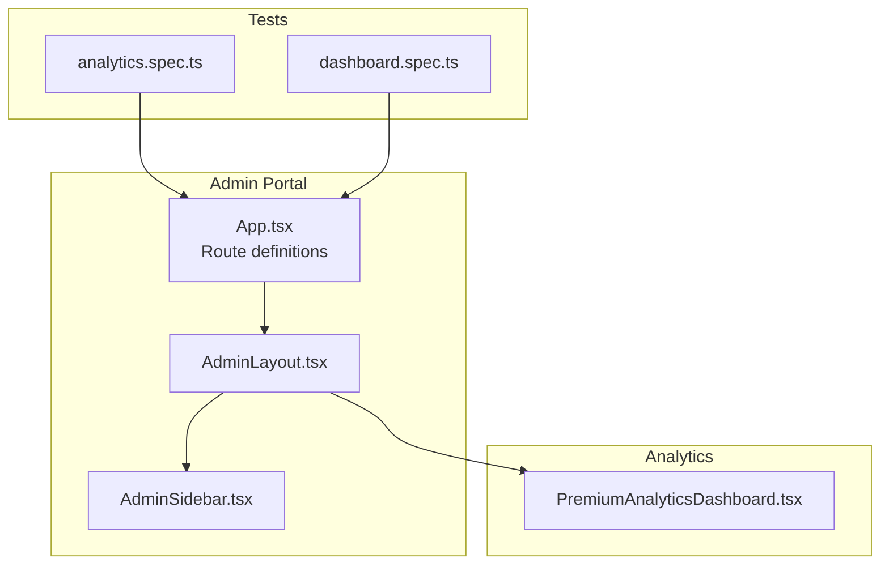
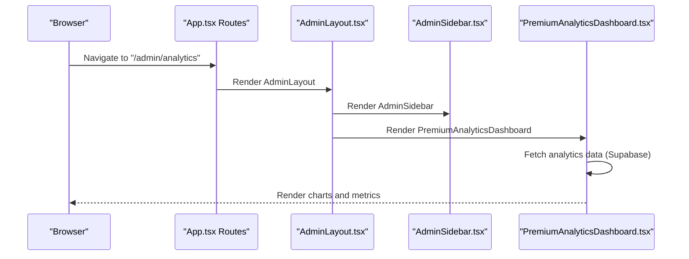
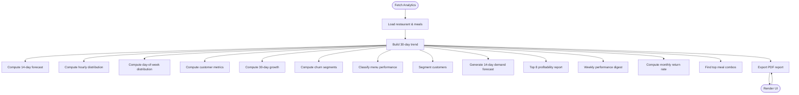
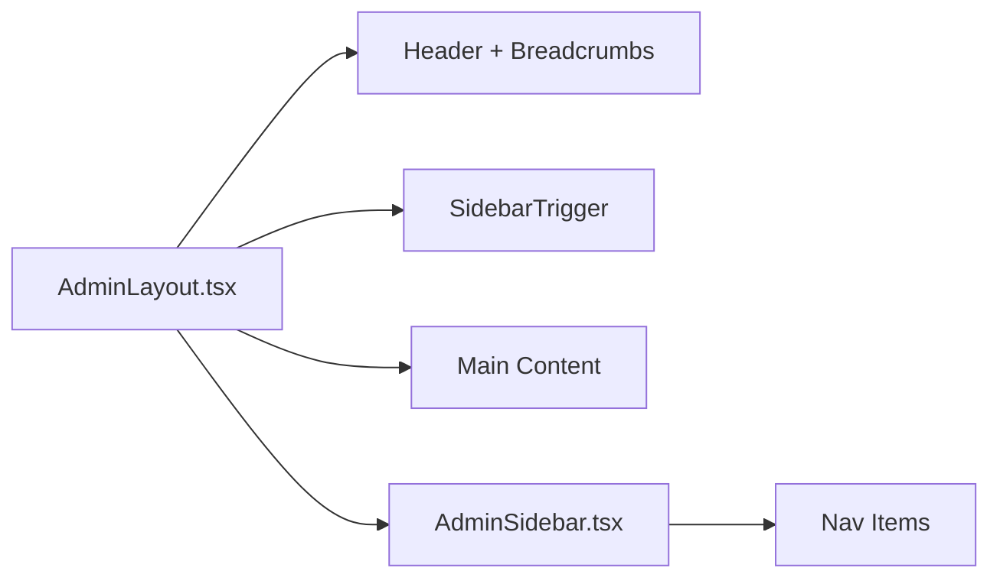
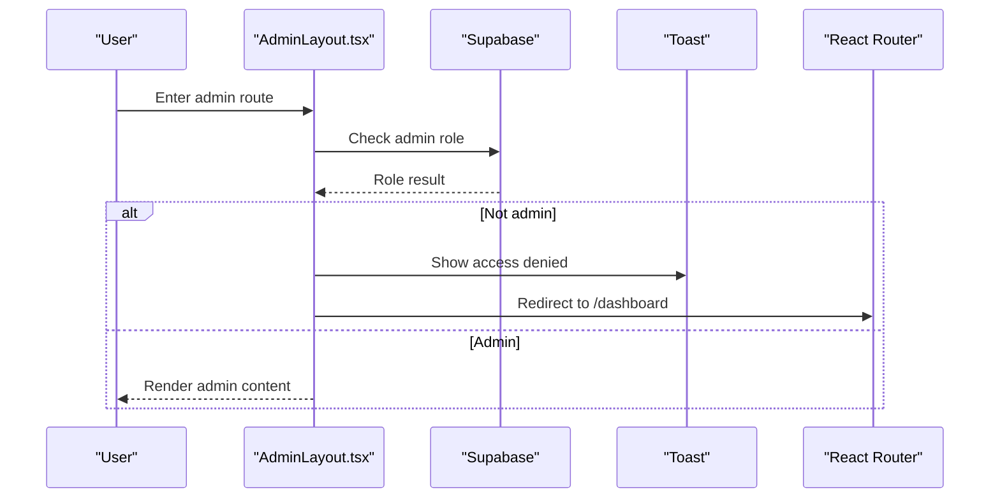
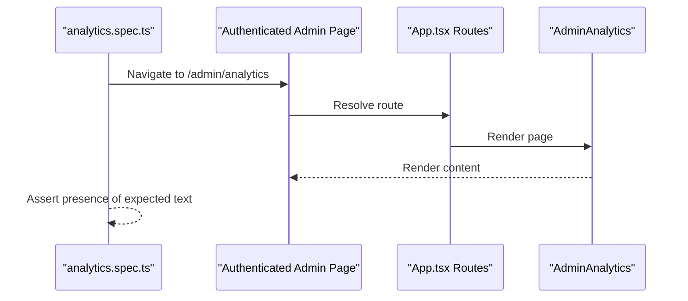
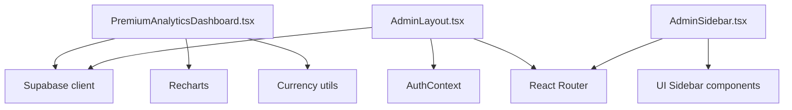

# Admin Dashboard

<cite>
**Referenced Files in This Document**
- [PremiumAnalyticsDashboard.tsx](file://src/components/PremiumAnalyticsDashboard.tsx)
- [AdminLayout.tsx](file://src/components/AdminLayout.tsx)
- [AdminSidebar.tsx](file://src/components/AdminSidebar.tsx)
- [App.tsx](file://src/App.tsx)
- [analytics.spec.ts](file://e2e/admin/analytics.spec.ts)
- [dashboard.spec.ts](file://e2e/admin/dashboard.spec.ts)
</cite>

## Table of Contents
1. [Introduction](#introduction)
2. [Project Structure](#project-structure)
3. [Core Components](#core-components)
4. [Architecture Overview](#architecture-overview)
5. [Detailed Component Analysis](#detailed-component-analysis)
6. [Dependency Analysis](#dependency-analysis)
7. [Performance Considerations](#performance-considerations)
8. [Troubleshooting Guide](#troubleshooting-guide)
9. [Conclusion](#conclusion)

## Introduction
This document describes the Admin Dashboard system, focusing on the main dashboard interface, key performance indicators, and system overview widgets. It explains analytics dashboard components, profit tracking, and business metrics visualization, including real-time data displays, system health monitoring, and administrative insights. It also documents the dashboard layout, widget configuration, and data presentation patterns used throughout the admin interface.

## Project Structure
The Admin Dashboard is built as a React application with route-protected admin pages. The primary admin layout composes a sidebar and a main content area. Navigation routes are defined centrally and protected by role checks. The Premium Analytics Dashboard component encapsulates advanced analytics and reporting features.

**Diagram sources**
- [AdminLayout.tsx:25-129](file://src/components/AdminLayout.tsx#L25-L129)
- [AdminSidebar.tsx:68-149](file://src/components/AdminSidebar.tsx#L68-L149)
- [App.tsx:536-556](file://src/App.tsx#L536-L556)
- [PremiumAnalyticsDashboard.tsx:147-183](file://src/components/PremiumAnalyticsDashboard.tsx#L147-L183)
- [analytics.spec.ts:1-157](file://e2e/admin/analytics.spec.ts#L1-L157)
- [dashboard.spec.ts:102-124](file://e2e/admin/dashboard.spec.ts#L102-L124)

**Section sources**
- [AdminLayout.tsx:25-129](file://src/components/AdminLayout.tsx#L25-L129)
- [AdminSidebar.tsx:68-149](file://src/components/AdminSidebar.tsx#L68-L149)
- [App.tsx:536-556](file://src/App.tsx#L536-L556)

## Core Components
- AdminLayout: Provides the shared admin shell, breadcrumbs, header, and sidebar trigger. Handles admin role checks and redirects unauthorized users.
- AdminSidebar: Renders the navigation menu for admin pages and includes quick links and logout.
- PremiumAnalyticsDashboard: Aggregates and visualizes premium analytics including revenue trends, customer metrics, churn analysis, menu performance, profitability, weekly digest, return rates, and demand forecasting. Includes an export-to-PDF capability.

Key capabilities:
- Revenue trends with historical and projected data
- Customer segmentation and churn risk
- Menu performance classification
- Profitability reporting
- Weekly performance digest
- Return rate computation
- Demand forecast calendar
- Exportable PDF report

**Section sources**
- [AdminLayout.tsx:25-129](file://src/components/AdminLayout.tsx#L25-L129)
- [AdminSidebar.tsx:43-66](file://src/components/AdminSidebar.tsx#L43-L66)
- [PremiumAnalyticsDashboard.tsx:47-183](file://src/components/PremiumAnalyticsDashboard.tsx#L47-L183)

## Architecture Overview
The admin portal follows a route-based architecture with protected routes. The Premium Analytics Dashboard is rendered within the AdminLayout, which ensures consistent navigation and access control. Tests validate analytics page rendering and basic functionality.

**Diagram sources**
- [App.tsx:536-556](file://src/App.tsx#L536-L556)
- [AdminLayout.tsx:84-129](file://src/components/AdminLayout.tsx#L84-L129)
- [AdminSidebar.tsx:68-149](file://src/components/AdminSidebar.tsx#L68-L149)
- [PremiumAnalyticsDashboard.tsx:181-526](file://src/components/PremiumAnalyticsDashboard.tsx#L181-L526)

## Detailed Component Analysis

### Premium Analytics Dashboard
The Premium Analytics Dashboard is a comprehensive analytics widget suite that:
- Loads restaurant metadata and meal catalog
- Builds 30-day historical revenue and order counts
- Computes 14-day revenue forecast based on average daily revenue
- Analyzes hourly and day-of-week order distributions
- Calculates customer metrics (repeat rate, average orders per customer)
- Computes growth metrics (revenue, orders, customers) over 30-day windows
- Flags churn risk (at-risk, likely lost, lost) based on recency thresholds
- Classifies menu items using a BCG-like matrix (Top Seller, High Value, Growing, Needs Attention)
- Segments customers (Champions, Loyal, At Risk, Inactive)
- Forecasts demand for the next 14 days by day-of-week averages
- Produces a profitability report of top meals
- Generates a weekly performance digest (this week vs last week)
- Computes monthly return rate (customers from last month who returned this month)
- Identifies top meal combination patterns
- Exports a printable PDF report

**Diagram sources**
- [PremiumAnalyticsDashboard.tsx:181-526](file://src/components/PremiumAnalyticsDashboard.tsx#L181-L526)

**Section sources**
- [PremiumAnalyticsDashboard.tsx:147-526](file://src/components/PremiumAnalyticsDashboard.tsx#L147-L526)

### Admin Layout and Navigation
The Admin Layout provides:
- Role-based access control to admin routes
- Sticky header with breadcrumb navigation
- Collapsible sidebar via SidebarTrigger
- Protected route rendering for admin-only pages

The Admin Sidebar defines the navigation items for the admin panel, including dashboards, analytics, subscriptions, payouts, premium analytics, income & profit, and more.

**Diagram sources**
- [AdminLayout.tsx:84-129](file://src/components/AdminLayout.tsx#L84-L129)
- [AdminSidebar.tsx:43-66](file://src/components/AdminSidebar.tsx#L43-L66)

**Section sources**
- [AdminLayout.tsx:25-129](file://src/components/AdminLayout.tsx#L25-L129)
- [AdminSidebar.tsx:68-149](file://src/components/AdminSidebar.tsx#L68-L149)

### Route Protection and Access Control
Routes under /admin are protected and require admin role verification. Unauthorized access triggers a redirect to the customer dashboard.

**Diagram sources**
- [AdminLayout.tsx:33-67](file://src/components/AdminLayout.tsx#L33-L67)

**Section sources**
- [AdminLayout.tsx:33-67](file://src/components/AdminLayout.tsx#L33-L67)

### Analytics Page Coverage and Tests
End-to-end tests verify that the analytics page loads and displays expected sections such as revenue trends, customer retention, peak hours, and export report functionality.

**Diagram sources**
- [analytics.spec.ts:8-21](file://e2e/admin/analytics.spec.ts#L8-L21)
- [analytics.spec.ts:23-33](file://e2e/admin/analytics.spec.ts#L23-L33)
- [analytics.spec.ts:98-111](file://e2e/admin/analytics.spec.ts#L98-L111)
- [analytics.spec.ts:113-126](file://e2e/admin/analytics.spec.ts#L113-L126)
- [analytics.spec.ts:143-156](file://e2e/admin/analytics.spec.ts#L143-L156)

**Section sources**
- [analytics.spec.ts:1-157](file://e2e/admin/analytics.spec.ts#L1-L157)

## Dependency Analysis
- PremiumAnalyticsDashboard depends on:
  - Supabase client for data retrieval
  - Recharts for visualization
  - Currency formatting utilities
- AdminLayout depends on:
  - AuthContext for admin role checks
  - Supabase for role verification
  - React Router for navigation and breadcrumbs
- AdminSidebar depends on:
  - React Router for navigation
  - UI sidebar components

**Diagram sources**
- [PremiumAnalyticsDashboard.tsx:28-43](file://src/components/PremiumAnalyticsDashboard.tsx#L28-L43)
- [AdminLayout.tsx:14-17](file://src/components/AdminLayout.tsx#L14-L17)
- [AdminSidebar.tsx:39-38](file://src/components/AdminSidebar.tsx#L39-L38)

**Section sources**
- [PremiumAnalyticsDashboard.tsx:28-43](file://src/components/PremiumAnalyticsDashboard.tsx#L28-L43)
- [AdminLayout.tsx:14-17](file://src/components/AdminLayout.tsx#L14-L17)
- [AdminSidebar.tsx:39-38](file://src/components/AdminSidebar.tsx#L39-L38)

## Performance Considerations
- Data aggregation uses client-side computations over filtered datasets. For large datasets, consider server-side aggregations or pagination.
- Chart rendering performance can be improved by memoizing computed datasets and using virtualization for large lists.
- Exporting PDFs is client-generated; for heavy reports, consider server-side generation to reduce client load.
- Network requests are batched per dataset; ensure caching and debouncing to minimize redundant queries.

## Troubleshooting Guide
Common issues and resolutions:
- Access Denied: If redirected to the customer dashboard, verify the user’s admin role in the database and ensure the role lookup query executes successfully.
- Empty Analytics: If no data appears, confirm that the restaurant has associated meals and schedules within the selected date range.
- Slow Rendering: Reduce the date range or limit the number of displayed items; consider lazy-loading charts.
- Export Failures: Ensure the browser allows pop-ups and printing; verify that the HTML template renders without missing data.

**Section sources**
- [AdminLayout.tsx:33-67](file://src/components/AdminLayout.tsx#L33-L67)
- [PremiumAnalyticsDashboard.tsx:181-526](file://src/components/PremiumAnalyticsDashboard.tsx#L181-L526)

## Conclusion
The Admin Dashboard system provides a robust, role-protected interface for administrators to monitor and analyze business performance. The Premium Analytics Dashboard centralizes key metrics, visualizations, and actionable insights, while the AdminLayout and AdminSidebar ensure consistent navigation and access control. The system is extensible and can accommodate additional widgets, filters, and export formats as requirements evolve.