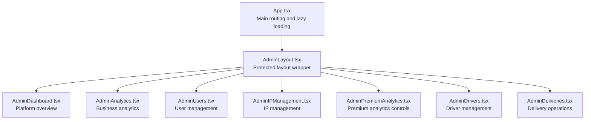
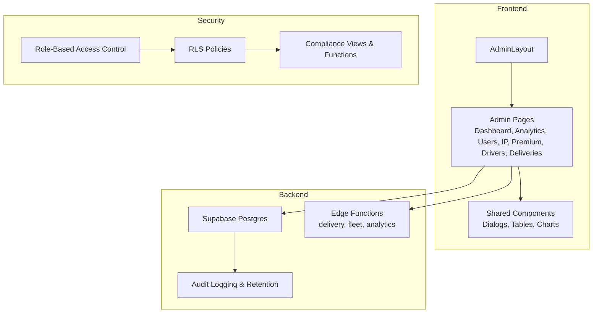
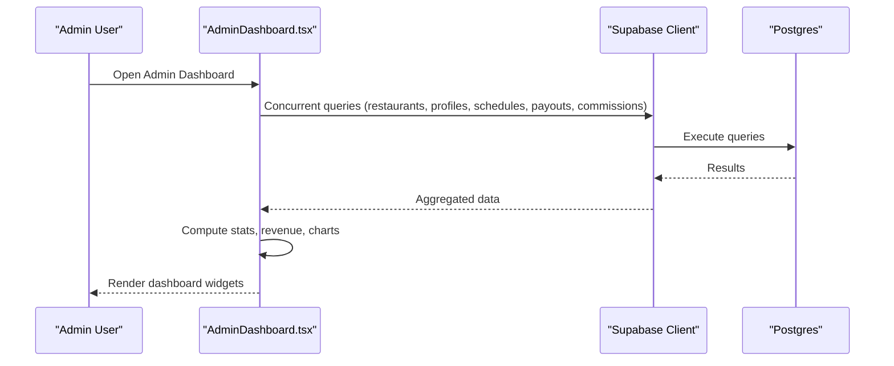
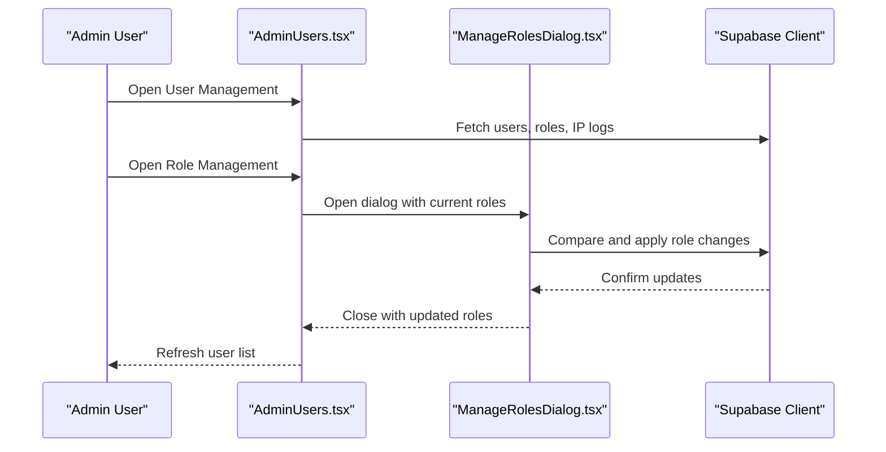
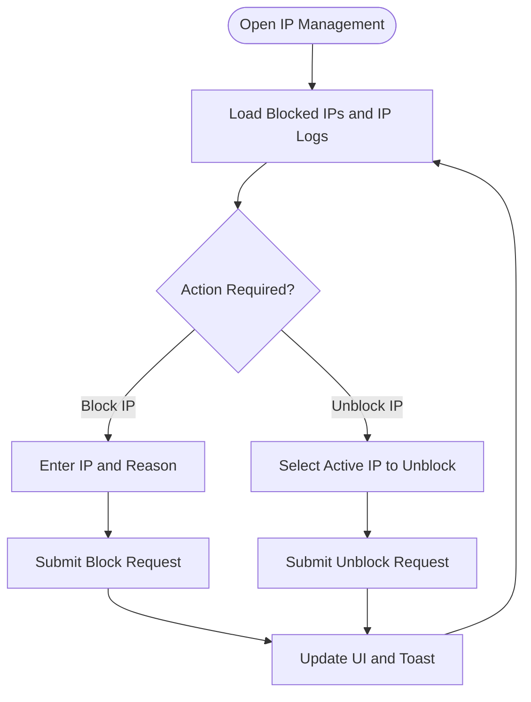
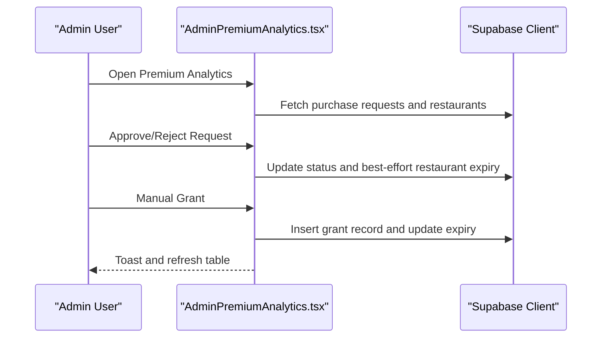
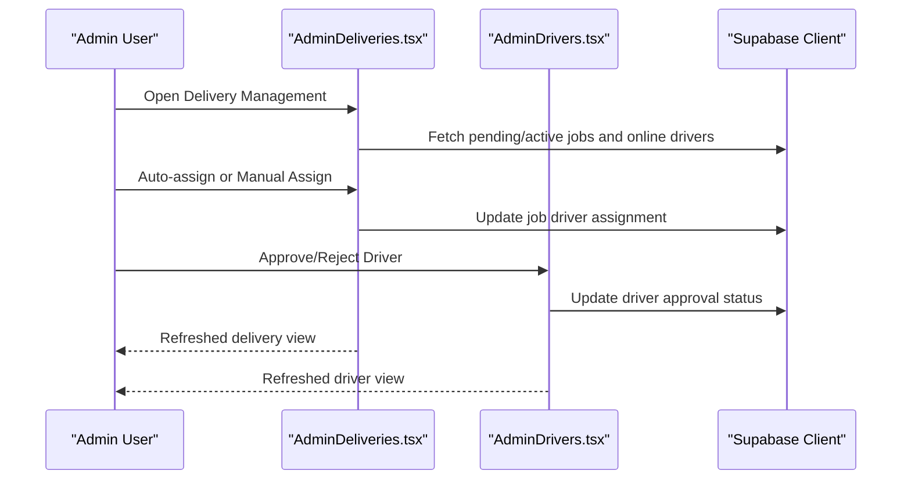
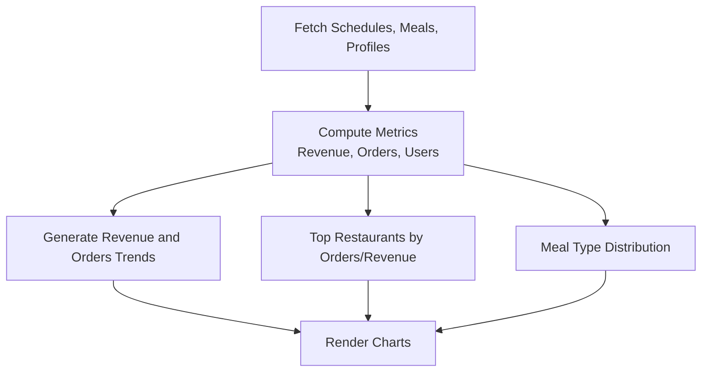
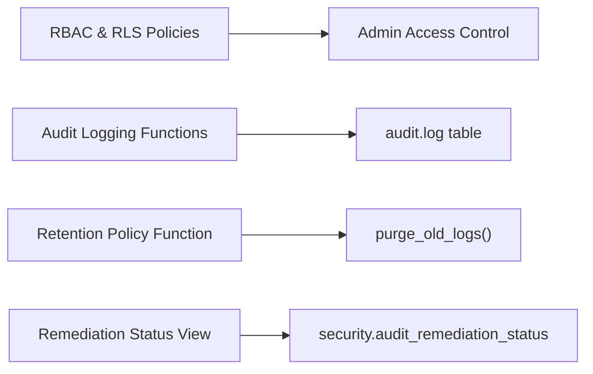
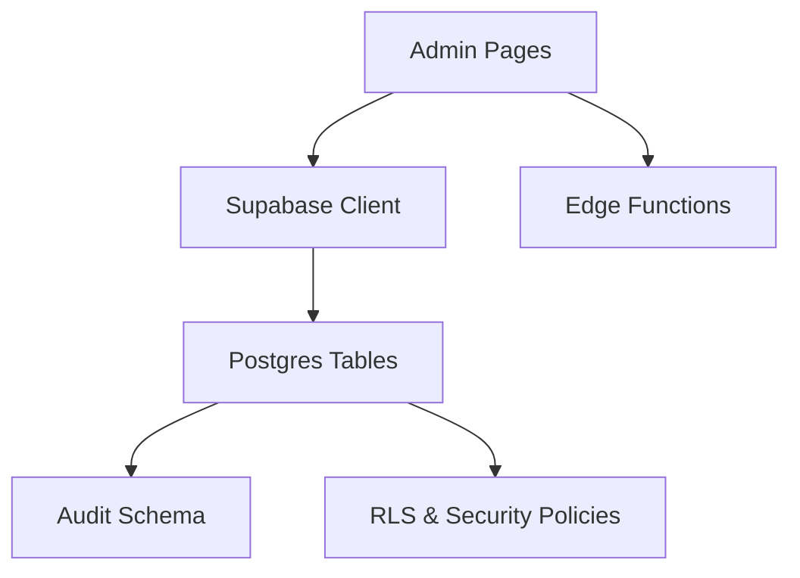

# Admin Portal

<cite>
**Referenced Files in This Document**
- [App.tsx](file://src/App.tsx)
- [AdminLayout.tsx](file://src/components/AdminLayout.tsx)
- [AdminDashboard.tsx](file://src/pages/admin/AdminDashboard.tsx)
- [AdminAnalytics.tsx](file://src/pages/admin/AdminAnalytics.tsx)
- [AdminUsers.tsx](file://src/pages/admin/AdminUsers.tsx)
- [AdminIPManagement.tsx](file://src/pages/admin/AdminIPManagement.tsx)
- [ManageRolesDialog.tsx](file://src/components/admin/ManageRolesDialog.tsx)
- [AdminPremiumAnalytics.tsx](file://src/pages/admin/AdminPremiumAnalytics.tsx)
- [AdminDrivers.tsx](file://src/pages/admin/AdminDrivers.tsx)
- [AdminDeliveries.tsx](file://src/pages/admin/AdminDeliveries.tsx)
- [20260226000003_audit_logging_system.sql](file://supabase/migrations/20260226000003_audit_logging_system.sql)
- [20260226000008_fix_rls_and_security_issues.sql](file://supabase/migrations/20260226000008_fix_rls_and_security_issues.sql)
- [20260226000009_audit_remediation_summary.sql](file://supabase/migrations/20260226000009_audit_remediation_summary.sql)
</cite>

## Table of Contents
1. [Introduction](#introduction)
2. [Project Structure](#project-structure)
3. [Core Components](#core-components)
4. [Architecture Overview](#architecture-overview)
5. [Detailed Component Analysis](#detailed-component-analysis)
6. [Dependency Analysis](#dependency-analysis)
7. [Performance Considerations](#performance-considerations)
8. [Troubleshooting Guide](#troubleshooting-guide)
9. [Conclusion](#conclusion)

## Introduction
This document describes the administrative oversight system for the Nutrio platform. It covers the admin portal's capabilities for user management, system analytics, content management, IP management, driver and delivery oversight, premium analytics controls, and security/compliance features. The portal provides centralized dashboards, role management, real-time delivery operations, and robust audit logging for regulatory compliance.

## Project Structure
The admin portal is integrated into the main application routing and protected by role-based access control. Admin pages are lazily loaded and organized under `/admin/*` routes. The layout enforces admin-only access and provides breadcrumbs and sidebar navigation.

**Diagram sources**
- [App.tsx:470-698](file://src/App.tsx#L470-L698)
- [AdminLayout.tsx:25-129](file://src/components/AdminLayout.tsx#L25-L129)

**Section sources**
- [App.tsx:470-698](file://src/App.tsx#L470-L698)
- [AdminLayout.tsx:25-129](file://src/components/AdminLayout.tsx#L25-L129)

## Core Components
- AdminLayout: Enforces admin-only access, renders breadcrumbs, and wraps page content with sidebar navigation.
- AdminDashboard: Provides platform KPIs, charts, recent activity, and quick navigation to admin sections.
- AdminAnalytics: Displays revenue trends, order counts, top restaurants, and meal type distribution.
- AdminUsers: Manages users, roles, IP blocks/unblocks, and user detail views with order history.
- AdminIPManagement: Blocks/unblocks IP addresses and displays user IP logs for security monitoring.
- ManageRolesDialog: Updates user roles with safeguards (e.g., preventing removal of the last role).
- AdminPremiumAnalytics: Approves/rejects premium analytics purchase requests and grants access manually.
- AdminDrivers: Lists drivers, manages approval status, and shows ratings and earnings.
- AdminDeliveries: Real-time delivery operations including auto-assignment, manual assignment, reassignment, and cancellation.

**Section sources**
- [AdminLayout.tsx:25-129](file://src/components/AdminLayout.tsx#L25-L129)
- [AdminDashboard.tsx:67-587](file://src/pages/admin/AdminDashboard.tsx#L67-L587)
- [AdminAnalytics.tsx:50-395](file://src/pages/admin/AdminAnalytics.tsx#L50-L395)
- [AdminUsers.tsx:95-675](file://src/pages/admin/AdminUsers.tsx#L95-L675)
- [AdminIPManagement.tsx:34-344](file://src/pages/admin/AdminIPManagement.tsx#L34-L344)
- [ManageRolesDialog.tsx:75-330](file://src/components/admin/ManageRolesDialog.tsx#L75-L330)
- [AdminPremiumAnalytics.tsx:68-462](file://src/pages/admin/AdminPremiumAnalytics.tsx#L68-L462)
- [AdminDrivers.tsx:52-423](file://src/pages/admin/AdminDrivers.tsx#L52-L423)
- [AdminDeliveries.tsx:119-734](file://src/pages/admin/AdminDeliveries.tsx#L119-L734)

## Architecture Overview
The admin portal integrates frontend components with Supabase for data access and edge functions for delivery orchestration. Security is enforced via role-based access control and database policies. Audit logging captures administrative actions for compliance.

**Diagram sources**
- [App.tsx:470-698](file://src/App.tsx#L470-L698)
- [AdminLayout.tsx:25-129](file://src/components/AdminLayout.tsx#L25-L129)
- [20260226000003_audit_logging_system.sql:256-307](file://supabase/migrations/20260226000003_audit_logging_system.sql#L256-L307)
- [20260226000008_fix_rls_and_security_issues.sql:125-251](file://supabase/migrations/20260226000008_fix_rls_and_security_issues.sql#L125-L251)

## Detailed Component Analysis

### Admin Dashboard
The dashboard aggregates platform-wide statistics, revenue trends, and recent activity. It queries multiple datasets concurrently and computes derived metrics such as weekly revenue and pending payouts.

**Diagram sources**
- [AdminDashboard.tsx:94-261](file://src/pages/admin/AdminDashboard.tsx#L94-L261)

**Section sources**
- [AdminDashboard.tsx:67-587](file://src/pages/admin/AdminDashboard.tsx#L67-L587)

### User Management and Role Management
The user management interface allows filtering, sorting, and bulk operations. It integrates with the role management dialog to safely update user roles while ensuring users retain at least one role.

**Diagram sources**
- [AdminUsers.tsx:116-207](file://src/pages/admin/AdminUsers.tsx#L116-L207)
- [ManageRolesDialog.tsx:95-226](file://src/components/admin/ManageRolesDialog.tsx#L95-L226)

**Section sources**
- [AdminUsers.tsx:95-675](file://src/pages/admin/AdminUsers.tsx#L95-L675)
- [ManageRolesDialog.tsx:75-330](file://src/components/admin/ManageRolesDialog.tsx#L75-L330)

### IP Management and Security Monitoring
The IP management module enables blocking/unblocking IP addresses and viewing recent user IP logs. It supports security monitoring and incident response workflows.

**Diagram sources**
- [AdminIPManagement.tsx:46-157](file://src/pages/admin/AdminIPManagement.tsx#L46-L157)

**Section sources**
- [AdminIPManagement.tsx:34-344](file://src/pages/admin/AdminIPManagement.tsx#L34-L344)

### Premium Analytics Controls
The premium analytics module handles subscription requests for advanced analytics, including approval/rejection and manual grants with configurable durations.

**Diagram sources**
- [AdminPremiumAnalytics.tsx:92-223](file://src/pages/admin/AdminPremiumAnalytics.tsx#L92-L223)

**Section sources**
- [AdminPremiumAnalytics.tsx:68-462](file://src/pages/admin/AdminPremiumAnalytics.tsx#L68-L462)

### Driver and Delivery Operations
The driver and delivery modules provide oversight of delivery operations, including driver approvals, online status, and real-time job assignments.

**Diagram sources**
- [AdminDeliveries.tsx:136-227](file://src/pages/admin/AdminDeliveries.tsx#L136-L227)
- [AdminDrivers.tsx:131-158](file://src/pages/admin/AdminDrivers.tsx#L131-L158)

**Section sources**
- [AdminDeliveries.tsx:119-734](file://src/pages/admin/AdminDeliveries.tsx#L119-L734)
- [AdminDrivers.tsx:52-423](file://src/pages/admin/AdminDrivers.tsx#L52-L423)

### Analytics Reporting and Financial Oversight
The analytics module provides revenue trends, order counts, top-performing restaurants, and meal type distributions. Financial oversight includes pending payouts and commission analytics visible on the dashboard.

**Diagram sources**
- [AdminAnalytics.tsx:72-189](file://src/pages/admin/AdminAnalytics.tsx#L72-L189)

**Section sources**
- [AdminAnalytics.tsx:50-395](file://src/pages/admin/AdminAnalytics.tsx#L50-L395)
- [AdminDashboard.tsx:94-261](file://src/pages/admin/AdminDashboard.tsx#L94-L261)

### Security Management Tools and Audit Logging
Security features include role-based access enforcement, IP blocking, and comprehensive audit logging with retention policies. Compliance views verify remediation status.

**Diagram sources**
- [20260226000003_audit_logging_system.sql:256-307](file://supabase/migrations/20260226000003_audit_logging_system.sql#L256-L307)
- [20260226000008_fix_rls_and_security_issues.sql:125-251](file://supabase/migrations/20260226000008_fix_rls_and_security_issues.sql#L125-L251)
- [20260226000009_audit_remediation_summary.sql:168-186](file://supabase/migrations/20260226000009_audit_remediation_summary.sql#L168-L186)

**Section sources**
- [AdminLayout.tsx:39-67](file://src/components/AdminLayout.tsx#L39-L67)
- [20260226000003_audit_logging_system.sql:256-307](file://supabase/migrations/20260226000003_audit_logging_system.sql#L256-L307)
- [20260226000008_fix_rls_and_security_issues.sql:125-251](file://supabase/migrations/20260226000008_fix_rls_and_security_issues.sql#L125-L251)
- [20260226000009_audit_remediation_summary.sql:168-186](file://supabase/migrations/20260226000009_audit_remediation_summary.sql#L168-L186)

## Dependency Analysis
The admin portal relies on Supabase for data access and edge functions for delivery operations. Security and compliance are enforced through database policies and audit functions.

**Diagram sources**
- [App.tsx:470-698](file://src/App.tsx#L470-L698)
- [AdminDeliveries.tsx:49](file://src/pages/admin/AdminDeliveries.tsx#L49)

**Section sources**
- [App.tsx:470-698](file://src/App.tsx#L470-L698)
- [AdminDeliveries.tsx:49](file://src/pages/admin/AdminDeliveries.tsx#L49)

## Performance Considerations
- Use concurrent queries for dashboard metrics to minimize load time.
- Implement pagination and virtualized lists for large datasets (users, IP logs).
- Debounce search and filter operations to reduce unnecessary network requests.
- Cache frequently accessed data where appropriate and invalidate on write operations.

## Troubleshooting Guide
Common issues and resolutions:
- Access denied: Ensure the user has the admin role; the layout redirects unauthorized users to the dashboard.
- Data fetch failures: Check network connectivity and Supabase service availability; verify database policies allow access.
- Role update errors: Confirm that removing the last role is prevented; ensure at least one role remains.
- Delivery operations failing: Verify edge functions are deployed and accessible; check job status transitions.

**Section sources**
- [AdminLayout.tsx:39-67](file://src/components/AdminLayout.tsx#L39-L67)
- [ManageRolesDialog.tsx:128-140](file://src/components/admin/ManageRolesDialog.tsx#L128-L140)

## Conclusion
The admin portal provides comprehensive oversight of the Nutrio platform, combining user management, analytics, IP security, driver/delivery operations, and premium analytics controls. Built-in audit logging and compliance functions support regulatory requirements, while role-based access ensures secure administration.