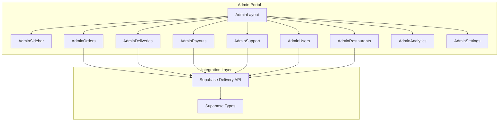
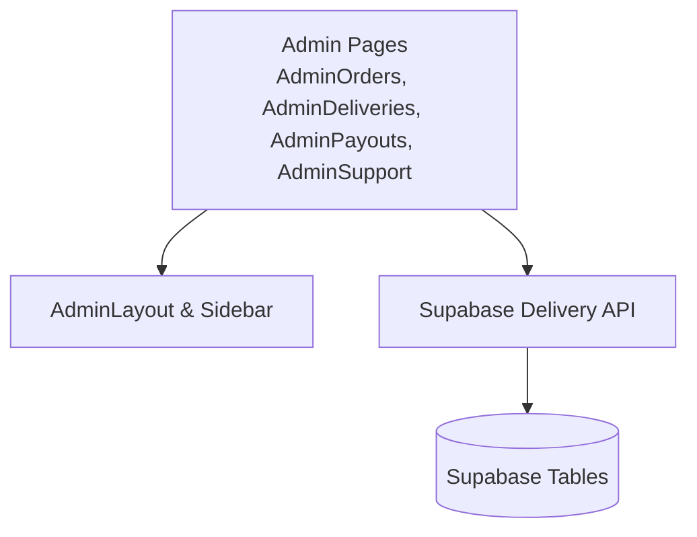
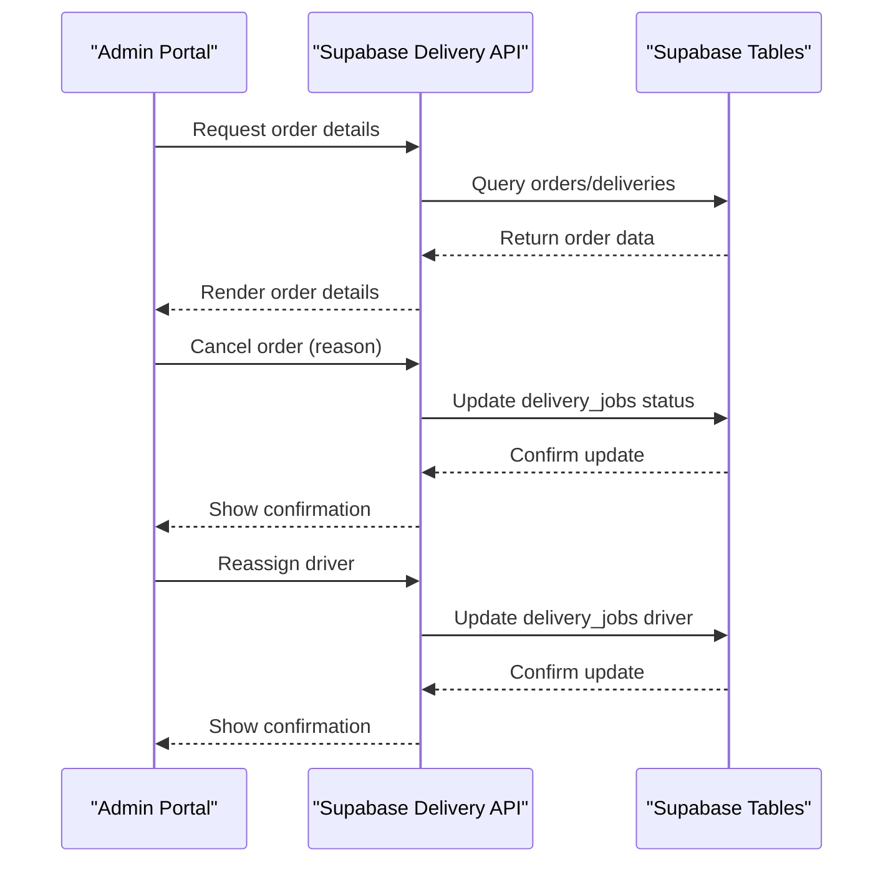
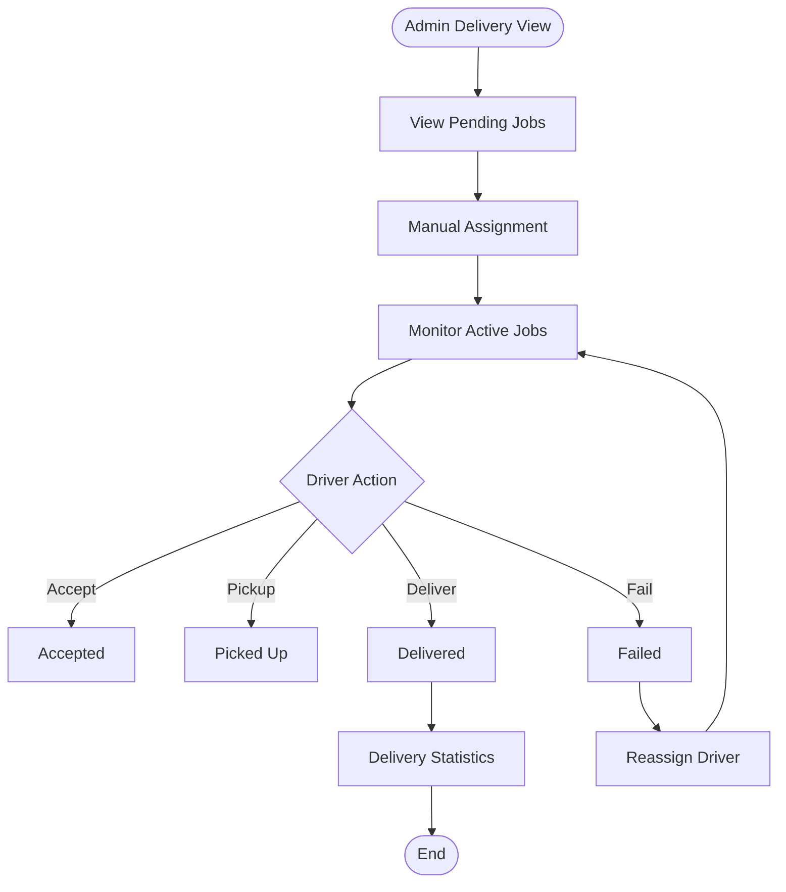
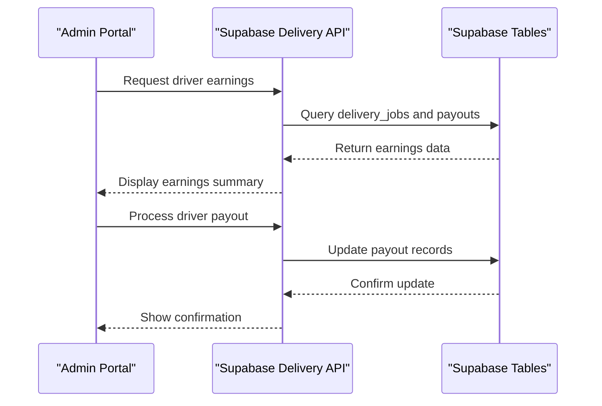
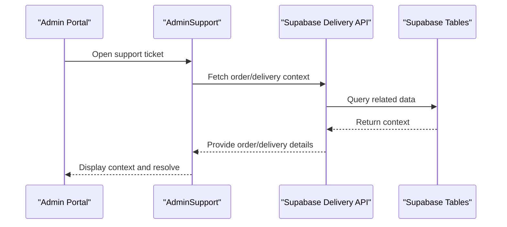
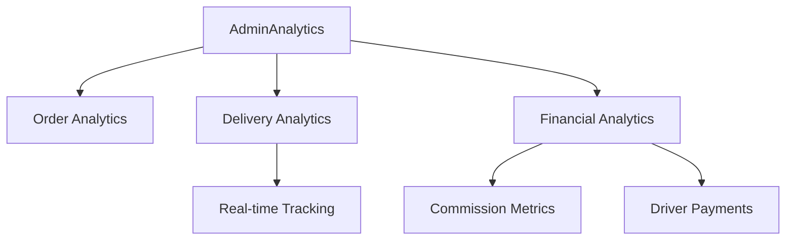
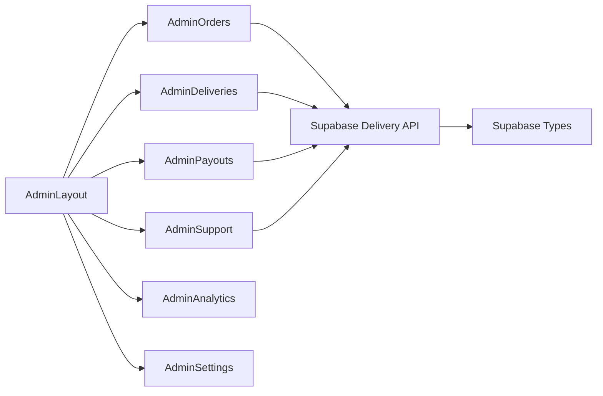

# Administrative Workflows

<cite>
**Referenced Files in This Document**
- [AdminLayout.tsx](file://src/components/AdminLayout.tsx)
- [delivery.ts](file://src/integrations/supabase/delivery.ts)
- [types.ts](file://src/integrations/supabase/types.ts)
- [App.tsx](file://src/App.tsx)
- [AdminOrders.tsx](file://src/pages/admin/AdminOrders.tsx)
- [AdminUsers.tsx](file://src/pages/admin/AdminUsers.tsx)
- [AdminRestaurants.tsx](file://src/pages/admin/AdminRestaurants.tsx)
- [AdminDashboard.tsx](file://src/pages/admin/AdminDashboard.tsx)
- [AdminDeliveries.tsx](file://src/pages/admin/AdminDeliveries.tsx)
- [AdminPayouts.tsx](file://src/pages/admin/AdminPayouts.tsx)
- [AdminSupport.tsx](file://src/pages/admin/AdminSupport.tsx)
- [AdminAnalytics.tsx](file://src/pages/admin/AdminAnalytics.tsx)
- [AdminSettings.tsx](file://src/pages/admin/AdminSettings.tsx)
- [AdminSidebar.tsx](file://src/components/AdminSidebar.tsx)
- [AdminLayout.tsx](file://src/components/AdminLayout.tsx)
- [AdminLayout.tsx](file://src/components/AdminLayout.tsx)
- [AdminLayout.tsx](file://src/components/AdminLayout.tsx)
- [AdminLayout.tsx](file://src/components/AdminLayout.tsx)
- [AdminLayout.tsx](file://src/components/AdminLayout.tsx)
- [AdminLayout.tsx](file://src/components/AdminLayout.tsx)
</cite>

## Table of Contents
1. [Introduction](#introduction)
2. [Project Structure](#project-structure)
3. [Core Components](#core-components)
4. [Architecture Overview](#architecture-overview)
5. [Detailed Component Analysis](#detailed-component-analysis)
6. [Dependency Analysis](#dependency-analysis)
7. [Performance Considerations](#performance-considerations)
8. [Troubleshooting Guide](#troubleshooting-guide)
9. [Conclusion](#conclusion)

## Introduction
This document describes administrative workflows and operational procedures for managing orders, deliveries, payouts, and support within the platform. It covers oversight of order lifecycle events (disputes, cancellations, delivery issues), delivery coordination and logistics management, payout management for commissions and driver payments, and integration with customer support for escalated issues. It also outlines automation, approval processes, decision-making procedures, and manual intervention capabilities.

## Project Structure
The administrative domain is implemented as a React-based admin portal integrated with Supabase for data access and real-time updates. Key elements include:
- Admin layout and navigation
- Dedicated pages for orders, users, restaurants, deliveries, payouts, support, analytics, and settings
- Supabase integration module for delivery operations and type definitions for database schemas

**Diagram sources**
- [AdminLayout.tsx](file://src/components/AdminLayout.tsx)
- [AdminSidebar.tsx](file://src/components/AdminSidebar.tsx)
- [AdminOrders.tsx](file://src/pages/admin/AdminOrders.tsx)
- [AdminUsers.tsx](file://src/pages/admin/AdminUsers.tsx)
- [AdminRestaurants.tsx](file://src/pages/admin/AdminRestaurants.tsx)
- [AdminDeliveries.tsx](file://src/pages/admin/AdminDeliveries.tsx)
- [AdminPayouts.tsx](file://src/pages/admin/AdminPayouts.tsx)
- [AdminSupport.tsx](file://src/pages/admin/AdminSupport.tsx)
- [AdminAnalytics.tsx](file://src/pages/admin/AdminAnalytics.tsx)
- [AdminSettings.tsx](file://src/pages/admin/AdminSettings.tsx)
- [delivery.ts](file://src/integrations/supabase/delivery.ts)
- [types.ts](file://src/integrations/supabase/types.ts)

**Section sources**
- [AdminLayout.tsx](file://src/components/AdminLayout.tsx)
- [App.tsx](file://src/App.tsx)

## Core Components
- AdminLayout: Provides admin-only access, breadcrumb navigation, sidebar, and protected routing.
- Supabase Delivery API: Centralized integration for driver management, job assignment, driver actions, admin interventions, and real-time tracking.
- Supabase Types: Strongly typed database schema definitions enabling safe integration with Supabase tables.

Key responsibilities:
- Access control and navigation for administrative functions
- End-to-end delivery lifecycle management with admin override capabilities
- Real-time delivery and driver location updates
- Administrative dashboards and reporting surfaces

**Section sources**
- [AdminLayout.tsx](file://src/components/AdminLayout.tsx)
- [delivery.ts](file://src/integrations/supabase/delivery.ts)
- [types.ts](file://src/integrations/supabase/types.ts)

## Architecture Overview
The admin portal follows a layered architecture:
- Presentation layer: React components and pages for administrative tasks
- Integration layer: Supabase client and typed database access
- Data layer: Supabase tables for orders, deliveries, drivers, payouts, and related entities

**Diagram sources**
- [AdminLayout.tsx](file://src/components/AdminLayout.tsx)
- [AdminOrders.tsx](file://src/pages/admin/AdminOrders.tsx)
- [AdminDeliveries.tsx](file://src/pages/admin/AdminDeliveries.tsx)
- [AdminPayouts.tsx](file://src/pages/admin/AdminPayouts.tsx)
- [AdminSupport.tsx](file://src/pages/admin/AdminSupport.tsx)
- [delivery.ts](file://src/integrations/supabase/delivery.ts)
- [types.ts](file://src/integrations/supabase/types.ts)

## Detailed Component Analysis

### Order Management Oversight
Administrative oversight of orders encompasses dispute handling, cancellations, and delivery issue resolution. The admin portal integrates with Supabase to:
- View order details and statuses
- Initiate cancellations with reasons
- Coordinate delivery interventions (reassignment, rescheduling)
- Track delivery performance and resolve issues

**Diagram sources**
- [AdminOrders.tsx](file://src/pages/admin/AdminOrders.tsx)
- [delivery.ts](file://src/integrations/supabase/delivery.ts)

Operational procedures:
- Dispute resolution: Admin reviews order and delivery context, applies appropriate actions (refund initiation, cancellation, or driver reassignment).
- Cancellations: Admin cancels orders with reasons recorded for audit and analytics.
- Delivery issues: Admin monitors delivery status, reassigns drivers, and escalates to support when necessary.

Approval and decision-making:
- Administrative approvals are enforced via admin-only routes and role checks.
- Decisions are logged with timestamps and reasons for traceability.

Manual intervention capabilities:
- Admin can manually assign or reassign drivers.
- Admin can cancel jobs and update statuses.

**Section sources**
- [AdminOrders.tsx](file://src/pages/admin/AdminOrders.tsx)
- [delivery.ts](file://src/integrations/supabase/delivery.ts)

### Delivery Coordination and Logistics Management
The delivery coordination module provides:
- Real-time visibility into pending, active, and completed deliveries
- Online driver monitoring and manual assignment
- Driver action lifecycle (accept, pickup, deliver, fail)
- Job history and statistics aggregation

**Diagram sources**
- [AdminDeliveries.tsx](file://src/pages/admin/AdminDeliveries.tsx)
- [delivery.ts](file://src/integrations/supabase/delivery.ts)

Administrative intervention highlights:
- Manual driver assignment and reassignment
- Real-time tracking subscriptions for delivery and driver location
- Job history retrieval for audit and review

**Section sources**
- [AdminDeliveries.tsx](file://src/pages/admin/AdminDeliveries.tsx)
- [delivery.ts](file://src/integrations/supabase/delivery.ts)

### Payout Management
Payout management covers:
- Commission calculations and tracking
- Driver payments and settlement workflows
- Settlement reconciliation and reporting

**Diagram sources**
- [AdminPayouts.tsx](file://src/pages/admin/AdminPayouts.tsx)
- [delivery.ts](file://src/integrations/supabase/delivery.ts)
- [types.ts](file://src/integrations/supabase/types.ts)

Operational procedures:
- Earnings calculation based on completed deliveries
- Settlement processing with audit trails
- Reporting for reconciliations

Manual intervention capabilities:
- Admin can initiate payouts and adjust records as needed.

**Section sources**
- [AdminPayouts.tsx](file://src/pages/admin/AdminPayouts.tsx)
- [delivery.ts](file://src/integrations/supabase/delivery.ts)
- [types.ts](file://src/integrations/supabase/types.ts)

### Customer Support Integration
Customer support integration enables:
- Escalated issue handling from admin portal
- Unified ticketing and communication workflows
- Cross-reference with order and delivery data for context

**Diagram sources**
- [AdminSupport.tsx](file://src/pages/admin/AdminSupport.tsx)
- [delivery.ts](file://src/integrations/supabase/delivery.ts)

Manual intervention capabilities:
- Admin can escalate tickets, attach evidence (photos, notes), and coordinate with drivers or restaurants.

**Section sources**
- [AdminSupport.tsx](file://src/pages/admin/AdminSupport.tsx)
- [delivery.ts](file://src/integrations/supabase/delivery.ts)

### Administrative Dashboards and Reporting
Administrative dashboards provide:
- Order and delivery KPIs
- Driver performance metrics
- Financial summaries and analytics

**Diagram sources**
- [AdminAnalytics.tsx](file://src/pages/admin/AdminAnalytics.tsx)
- [delivery.ts](file://src/integrations/supabase/delivery.ts)
- [types.ts](file://src/integrations/supabase/types.ts)

Manual intervention capabilities:
- Admin can drill into anomalies, apply corrective actions, and export reports.

**Section sources**
- [AdminAnalytics.tsx](file://src/pages/admin/AdminAnalytics.tsx)
- [delivery.ts](file://src/integrations/supabase/delivery.ts)
- [types.ts](file://src/integrations/supabase/types.ts)

## Dependency Analysis
Administrative components depend on:
- AdminLayout and AdminSidebar for navigation and access control
- Supabase Delivery API for all delivery operations
- Supabase Types for schema-aware data access

**Diagram sources**
- [AdminLayout.tsx](file://src/components/AdminLayout.tsx)
- [AdminSidebar.tsx](file://src/components/AdminSidebar.tsx)
- [AdminOrders.tsx](file://src/pages/admin/AdminOrders.tsx)
- [AdminDeliveries.tsx](file://src/pages/admin/AdminDeliveries.tsx)
- [AdminPayouts.tsx](file://src/pages/admin/AdminPayouts.tsx)
- [AdminSupport.tsx](file://src/pages/admin/AdminSupport.tsx)
- [AdminAnalytics.tsx](file://src/pages/admin/AdminAnalytics.tsx)
- [AdminSettings.tsx](file://src/pages/admin/AdminSettings.tsx)
- [delivery.ts](file://src/integrations/supabase/delivery.ts)
- [types.ts](file://src/integrations/supabase/types.ts)

**Section sources**
- [AdminLayout.tsx](file://src/components/AdminLayout.tsx)
- [delivery.ts](file://src/integrations/supabase/delivery.ts)
- [types.ts](file://src/integrations/supabase/types.ts)

## Performance Considerations
- Minimize redundant queries by batching operations and leveraging real-time subscriptions where appropriate.
- Use pagination and filtering in admin views to reduce payload sizes.
- Cache frequently accessed metadata (e.g., driver profiles, restaurant details) to improve responsiveness.
- Optimize real-time channels to avoid excessive updates during high-volume periods.

## Troubleshooting Guide
Common scenarios and resolutions:
- Access denied: Verify admin role checks and redirect logic in the admin layout.
- Delivery not updating: Confirm real-time subscriptions and channel filters.
- Driver location missing: Ensure location history inserts succeed and driver locations are queried correctly.
- Payout discrepancies: Cross-check delivery job statuses and payout records against schema definitions.

**Section sources**
- [AdminLayout.tsx](file://src/components/AdminLayout.tsx)
- [delivery.ts](file://src/integrations/supabase/delivery.ts)
- [types.ts](file://src/integrations/supabase/types.ts)

## Conclusion
The administrative workflows integrate a secure, role-protected interface with robust delivery operations, real-time tracking, and comprehensive reporting. Administrative oversight ensures efficient handling of order disputes, cancellations, and delivery issues, while supporting payout management and customer support escalation. The modular design allows for continued enhancement of automation, approval processes, and manual intervention capabilities.