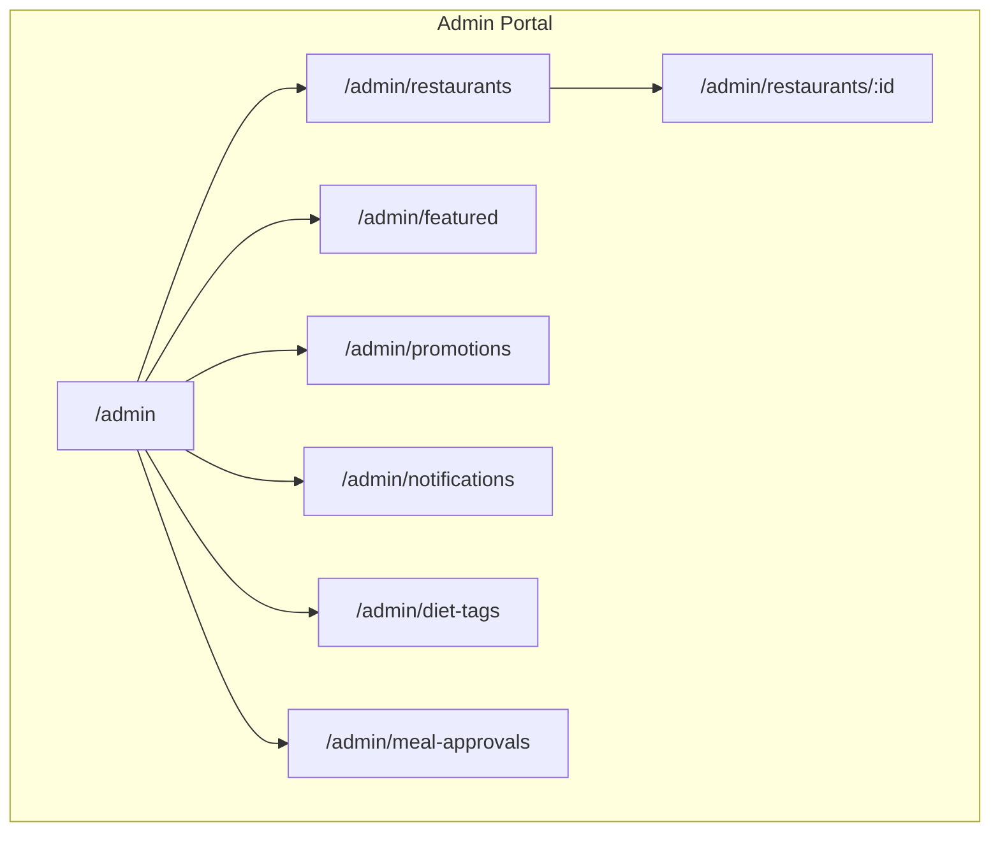
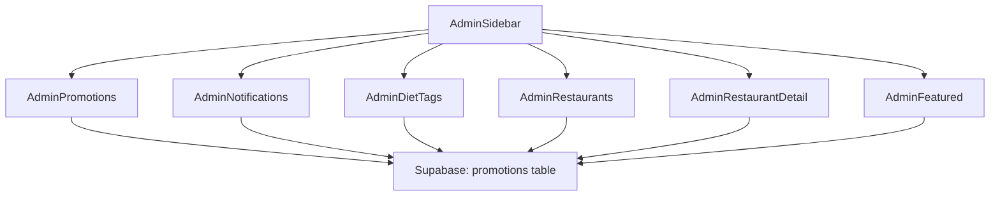
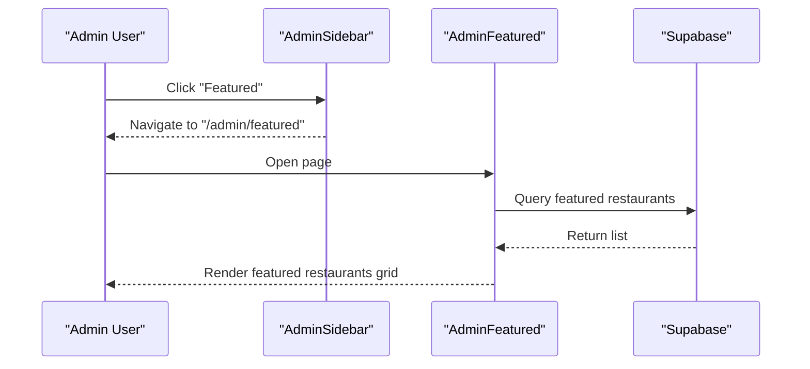
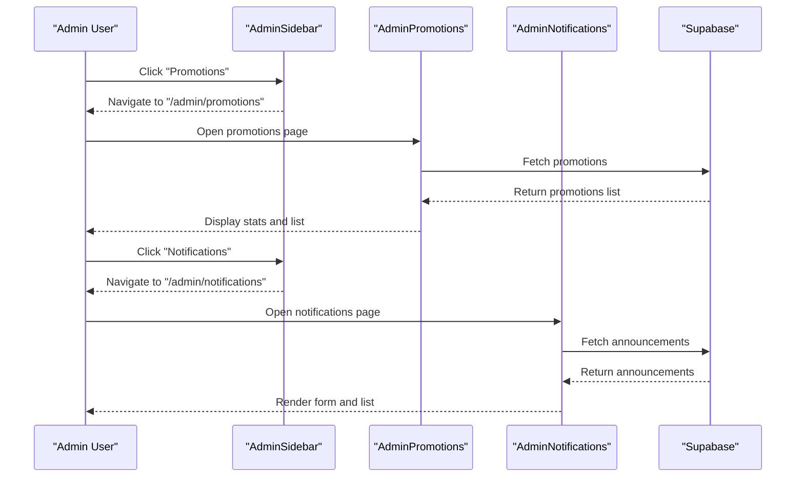
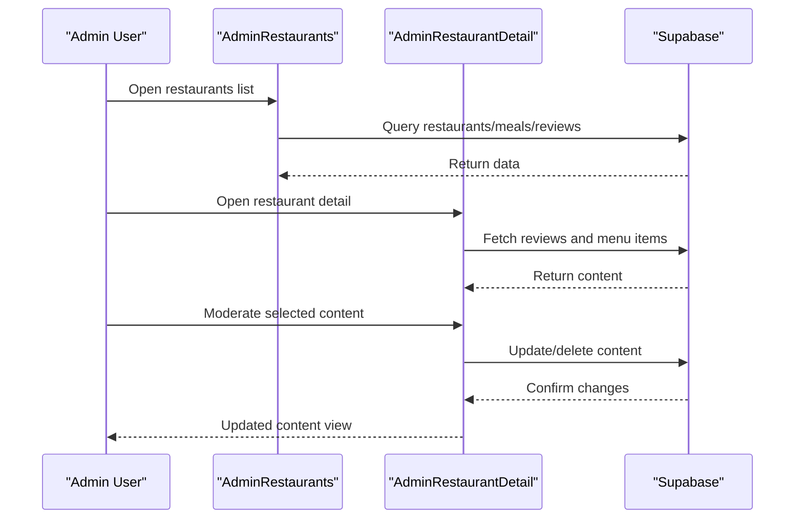
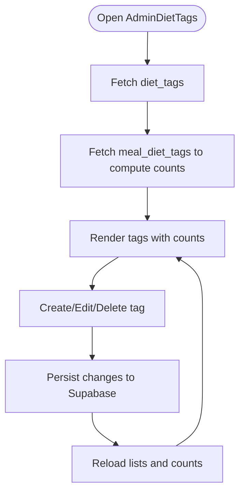
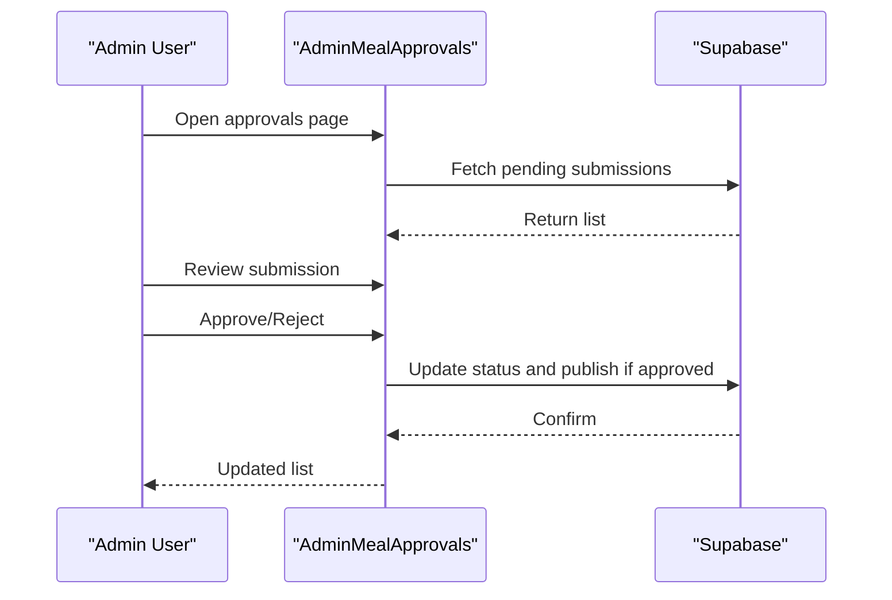
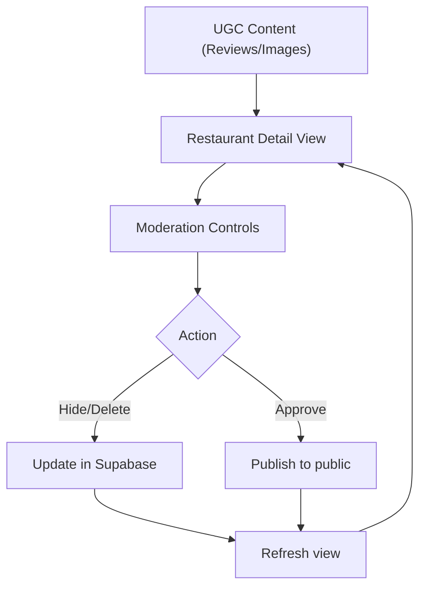
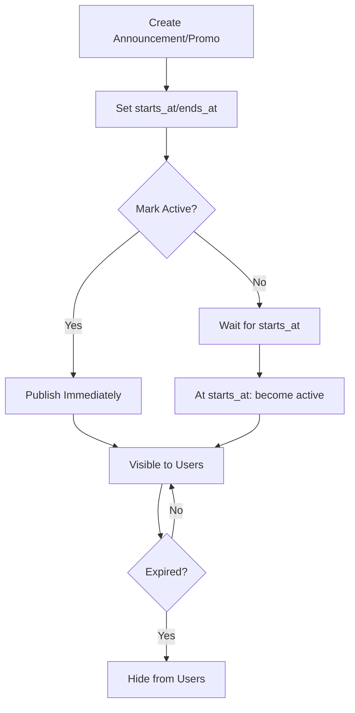
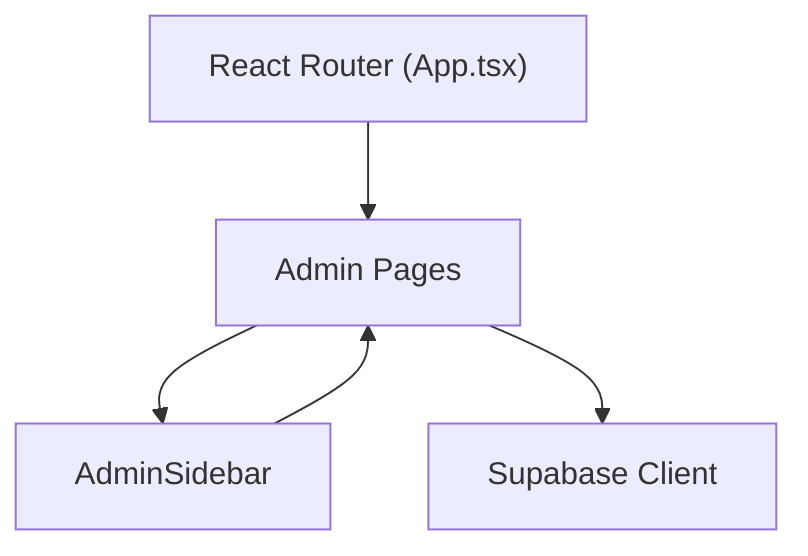

# Content Management

<cite>
**Referenced Files in This Document**
- [App.tsx](file://src/App.tsx)
- [AdminSidebar.tsx](file://src/components/AdminSidebar.tsx)
- [AdminNotifications.tsx](file://src/pages/admin/AdminNotifications.tsx)
- [AdminPromotions.tsx](file://src/pages/admin/AdminPromotions.tsx)
- [AdminDietTags.tsx](file://src/pages/admin/AdminDietTags.tsx)
- [AdminFeatured.tsx](file://src/pages/admin/AdminFeatured.tsx)
- [AdminRestaurants.tsx](file://src/pages/admin/AdminRestaurants.tsx)
- [AdminRestaurantDetail.tsx](file://src/pages/admin/AdminRestaurantDetail.tsx)
- [content.spec.ts](file://e2e/admin/content.spec.ts)
- [featured.spec.ts](file://e2e/admin/featured.spec.ts)
- [20250220000003_create_diet_tags.sql](file://supabase/migrations/20250220000003_create_diet_tags.sql)
</cite>

## Table of Contents
1. [Introduction](#introduction)
2. [Project Structure](#project-structure)
3. [Core Components](#core-components)
4. [Architecture Overview](#architecture-overview)
5. [Detailed Component Analysis](#detailed-component-analysis)
6. [Dependency Analysis](#dependency-analysis)
7. [Performance Considerations](#performance-considerations)
8. [Troubleshooting Guide](#troubleshooting-guide)
9. [Conclusion](#conclusion)

## Introduction
This document describes the content management system covering featured listings management, content moderation tools, and the announcement system. It explains content approval workflows, promotional content management, user-generated content oversight, content scheduling, and integration with marketing automation and content distribution channels. The focus is on the admin portal routes and pages that enable these capabilities.

## Project Structure
The content management system is primarily implemented in the admin portal routes and pages. Key routes include:
- Featured listings: `/admin/featured`
- Promotions and announcements: `/admin/promotions` and `/admin/notifications`
- Restaurant content management: `/admin/restaurants` and `/admin/restaurants/:id`
- Diet tags management: `/admin/diet-tags`
- Meal approvals: `/admin/meal-approvals`

**Diagram sources**
- [App.tsx:470-510](file://src/App.tsx#L470-L510)
- [App.tsx:634-658](file://src/App.tsx#L634-L658)

**Section sources**
- [App.tsx:470-510](file://src/App.tsx#L470-L510)
- [App.tsx:634-658](file://src/App.tsx#L634-L658)

## Core Components
- Featured listings management: AdminFeatured enables managing restaurants marked as featured.
- Promotions and announcements: AdminPromotions and AdminNotifications provide creation, editing, activation/deactivation, scheduling, and analytics for promotional banners and announcements.
- Content moderation: AdminRestaurants and AdminRestaurantDetail support moderation of user-generated content such as reviews and menu items.
- Diet tags: AdminDietTags manages dietary tags applied to meals for filtering and discovery.
- Approval workflows: AdminMealApprovals supports content approval processes.

**Section sources**
- [AdminFeatured.tsx](file://src/pages/admin/AdminFeatured.tsx)
- [AdminPromotions.tsx:107-148](file://src/pages/admin/AdminPromotions.tsx#L107-L148)
- [AdminNotifications.tsx:108-146](file://src/pages/admin/AdminNotifications.tsx#L108-L146)
- [AdminRestaurants.tsx](file://src/pages/admin/AdminRestaurants.tsx)
- [AdminRestaurantDetail.tsx](file://src/pages/admin/AdminRestaurantDetail.tsx)
- [AdminDietTags.tsx:48-120](file://src/pages/admin/AdminDietTags.tsx#L48-L120)
- [AdminSidebar.tsx:51-66](file://src/components/AdminSidebar.tsx#L51-L66)

## Architecture Overview
The admin portal integrates frontend pages with Supabase for data persistence. The sidebar navigation exposes content management areas, while routes render dedicated pages for featured restaurants, promotions, announcements, diet tags, and restaurant content.

**Diagram sources**
- [AdminSidebar.tsx:51-66](file://src/components/AdminSidebar.tsx#L51-L66)
- [AdminPromotions.tsx:123-147](file://src/pages/admin/AdminPromotions.tsx#L123-L147)
- [AdminNotifications.tsx:143-160](file://src/pages/admin/AdminNotifications.tsx#L143-L160)
- [AdminDietTags.tsx:82-120](file://src/pages/admin/AdminDietTags.tsx#L82-L120)
- [AdminRestaurants.tsx](file://src/pages/admin/AdminRestaurants.tsx)
- [AdminRestaurantDetail.tsx](file://src/pages/admin/AdminRestaurantDetail.tsx)
- [AdminFeatured.tsx](file://src/pages/admin/AdminFeatured.tsx)

## Detailed Component Analysis

### Featured Listings Management
- Purpose: Manage restaurants designated as featured.
- Key behaviors:
  - Load featured restaurants list.
  - Update featured status and ordering.
  - Filter and search within the list.
- UI entry point: Sidebar navigation item "Featured" links to `/admin/featured`.

**Diagram sources**
- [AdminSidebar.tsx:51-66](file://src/components/AdminSidebar.tsx#L51-L66)
- [App.tsx:496-502](file://src/App.tsx#L496-L502)
- [AdminFeatured.tsx](file://src/pages/admin/AdminFeatured.tsx)

**Section sources**
- [App.tsx:496-502](file://src/App.tsx#L496-L502)
- [AdminSidebar.tsx:51-66](file://src/components/AdminSidebar.tsx#L51-L66)
- [featured.spec.ts:8-21](file://e2e/admin/featured.spec.ts#L8-L21)

### Promotions and Announcements
- Promotions:
  - List, create, edit, delete promotional banners.
  - Track redemption counts and discount totals.
  - Toggle activation status.
- Announcements:
  - Create and manage announcements with scheduling (starts_at, ends_at).
  - Target audience selection (all, users, partners).
  - Activate/deactivate and bulk actions.
- Navigation: Promotions under "Promotions" and announcements under "Notifications".

**Diagram sources**
- [AdminSidebar.tsx:51-66](file://src/components/AdminSidebar.tsx#L51-L66)
- [App.tsx:634-658](file://src/App.tsx#L634-L658)
- [AdminPromotions.tsx:123-147](file://src/pages/admin/AdminPromotions.tsx#L123-L147)
- [AdminNotifications.tsx:143-160](file://src/pages/admin/AdminNotifications.tsx#L143-L160)

**Section sources**
- [App.tsx:634-658](file://src/App.tsx#L634-L658)
- [AdminPromotions.tsx:107-148](file://src/pages/admin/AdminPromotions.tsx#L107-L148)
- [AdminNotifications.tsx:108-146](file://src/pages/admin/AdminNotifications.tsx#L108-L146)
- [content.spec.ts:68-81](file://e2e/admin/content.spec.ts#L68-L81)
- [content.spec.ts:113-126](file://e2e/admin/content.spec.ts#L113-L126)

### Content Moderation Tools
- Restaurant content moderation:
  - View and moderate user-generated content (e.g., reviews) via restaurant detail pages.
  - Edit or remove inappropriate content.
- Bulk moderation actions:
  - Select multiple items and apply moderation decisions in batch.

**Diagram sources**
- [AdminRestaurants.tsx](file://src/pages/admin/AdminRestaurants.tsx)
- [AdminRestaurantDetail.tsx](file://src/pages/admin/AdminRestaurantDetail.tsx)
- [content.spec.ts:98-111](file://e2e/admin/content.spec.ts#L98-L111)

**Section sources**
- [AdminRestaurants.tsx](file://src/pages/admin/AdminRestaurants.tsx)
- [AdminRestaurantDetail.tsx](file://src/pages/admin/AdminRestaurantDetail.tsx)
- [content.spec.ts:98-111](file://e2e/admin/content.spec.ts#L98-L111)

### Diet Tags Management
- Purpose: Maintain a taxonomy of dietary tags for filtering and discovery.
- Features:
  - Create, edit, and delete tags.
  - Assign tags to meals via junction table.
  - View usage count per tag.
- Security: Row-level security policies restrict management to admins and allow partners to manage tags for their own meals.

**Diagram sources**
- [AdminDietTags.tsx:82-120](file://src/pages/admin/AdminDietTags.tsx#L82-L120)
- [20250220000003_create_diet_tags.sql:8-26](file://supabase/migrations/20250220000003_create_diet_tags.sql#L8-L26)

**Section sources**
- [AdminDietTags.tsx:48-120](file://src/pages/admin/AdminDietTags.tsx#L48-L120)
- [20250220000003_create_diet_tags.sql:8-74](file://supabase/migrations/20250003_create_diet_tags.sql#L8-L74)

### Content Approval Workflows
- Route: `/admin/meal-approvals`
- Purpose: Approve or reject user-generated content (e.g., new meals or edits) before publication.
- Typical flow:
  - View pending submissions.
  - Review content details.
  - Approve or reject with optional comments.
  - Publish approved content immediately or schedule later.

**Diagram sources**
- [App.tsx:504-510](file://src/App.tsx#L504-L510)
- [content.spec.ts:218-231](file://e2e/admin/content.spec.ts#L218-L231)

**Section sources**
- [App.tsx:504-510](file://src/App.tsx#L504-L510)
- [content.spec.ts:218-231](file://e2e/admin/content.spec.ts#L218-L231)

### User-Generated Content Oversight
- Reviews moderation: Accessible via restaurant detail pages to filter, hide, or delete inappropriate reviews.
- Bulk moderation: Select multiple reviews and apply moderation actions in bulk.
- Audit trail: Changes are persisted to Supabase for compliance.

**Diagram sources**
- [AdminRestaurantDetail.tsx](file://src/pages/admin/AdminRestaurantDetail.tsx)
- [content.spec.ts:98-111](file://e2e/admin/content.spec.ts#L98-L111)

**Section sources**
- [AdminRestaurantDetail.tsx](file://src/pages/admin/AdminRestaurantDetail.tsx)
- [content.spec.ts:98-111](file://e2e/admin/content.spec.ts#L98-L111)

### Content Scheduling
- Announcements support scheduling via start/end timestamps.
- Promotions can be activated/deactivated and scheduled for future availability.
- Users see only active and non-expired content.

**Diagram sources**
- [AdminNotifications.tsx:129-137](file://src/pages/admin/AdminNotifications.tsx#L129-L137)
- [AdminPromotions.tsx:103-105](file://src/pages/admin/AdminPromotions.tsx#L103-L105)

**Section sources**
- [AdminNotifications.tsx:129-137](file://src/pages/admin/AdminNotifications.tsx#L129-L137)
- [AdminPromotions.tsx:103-105](file://src/pages/admin/AdminPromotions.tsx#L103-L105)

### A/B Testing and Performance Tracking
- A/B testing: Not implemented in the current codebase.
- Performance tracking: Promotions page displays redemption counts and discount totals; announcements page tracks counts by status.
- Recommendations:
  - Add experiment identifiers and traffic allocation in promotion records.
  - Integrate analytics events for clicks and conversions.
  - Extend announcements with engagement metrics.

**Section sources**
- [AdminPromotions.tsx:115-120](file://src/pages/admin/AdminPromotions.tsx#L115-L120)
- [AdminNotifications.tsx:114-119](file://src/pages/admin/AdminNotifications.tsx#L114-L119)

### Marketing Automation and Distribution Channels
- Marketing automation: Not implemented in the current codebase.
- Distribution channels: Announcements and promotions are surfaced within the application; external distribution would require additional integrations.
- Recommendations:
  - Add push notification triggers upon activation.
  - Integrate email blast capabilities for announcements.
  - Provide export of active promotions for external channels.

**Section sources**
- [AdminNotifications.tsx:121-127](file://src/pages/admin/AdminNotifications.tsx#L121-L127)
- [AdminPromotions.tsx:108-114](file://src/pages/admin/AdminPromotions.tsx#L108-L114)

## Dependency Analysis
- Frontend routing depends on React Router and protected routes for admin roles.
- Pages depend on Supabase client for CRUD operations.
- Sidebar navigation centralizes access to content management areas.

**Diagram sources**
- [App.tsx:470-510](file://src/App.tsx#L470-L510)
- [App.tsx:634-658](file://src/App.tsx#L634-L658)
- [AdminSidebar.tsx:51-66](file://src/components/AdminSidebar.tsx#L51-L66)

**Section sources**
- [App.tsx:470-510](file://src/App.tsx#L470-L510)
- [App.tsx:634-658](file://src/App.tsx#L634-L658)
- [AdminSidebar.tsx:51-66](file://src/components/AdminSidebar.tsx#L51-L66)

## Performance Considerations
- Pagination and search queries should be optimized to avoid loading large datasets.
- Debounce search inputs to reduce network requests.
- Batch moderation actions to minimize repeated updates.
- Cache frequently accessed metadata (e.g., tag counts) to reduce redundant queries.

## Troubleshooting Guide
- Promotions fail to load:
  - Verify Supabase connection and permissions.
  - Check console for error messages and toast notifications.
- Announcements not appearing:
  - Confirm activation status and scheduling window.
  - Ensure target audience matches user role.
- Diet tags not updating:
  - Confirm RLS policies allow admin access and partner access for their meals.
  - Re-fetch tag counts after bulk updates.

**Section sources**
- [AdminPromotions.tsx:137-146](file://src/pages/admin/AdminPromotions.tsx#L137-L146)
- [AdminNotifications.tsx:143-160](file://src/pages/admin/AdminNotifications.tsx#L143-L160)
- [AdminDietTags.tsx:82-120](file://src/pages/admin/AdminDietTags.tsx#L82-L120)
- [20250220000003_create_diet_tags.sql:32-56](file://supabase/migrations/20250220000003_create_diet_tags.sql#L32-L56)

## Conclusion
The content management system provides robust tools for managing featured listings, promotions, announcements, and user-generated content. It leverages Supabase for data persistence and offers scheduling and moderation capabilities. Future enhancements should focus on A/B testing instrumentation, marketing automation, and expanded distribution channel integrations.