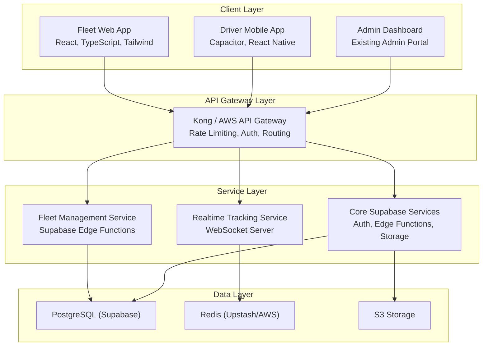
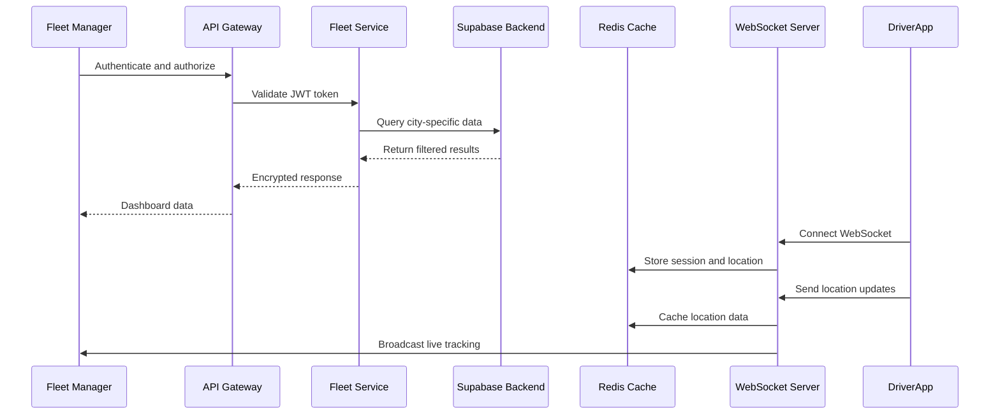
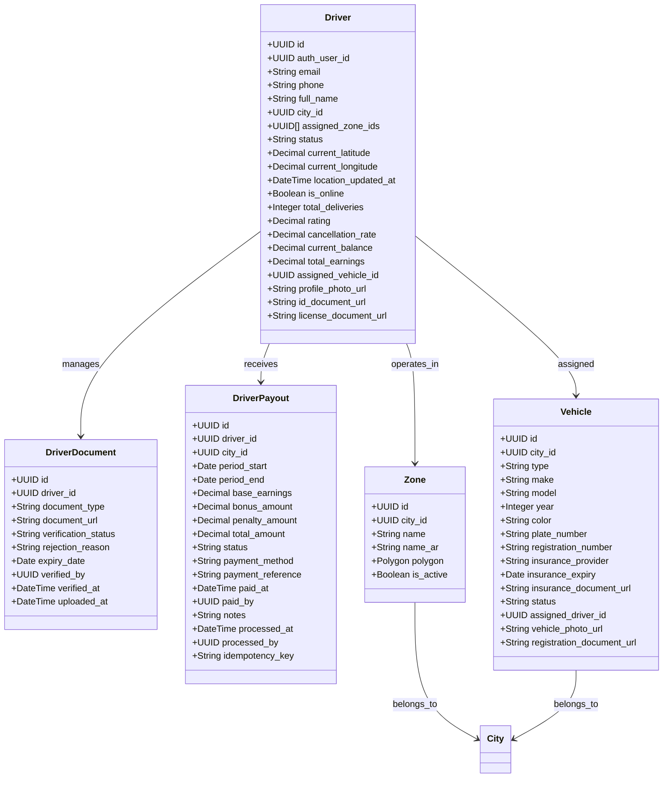
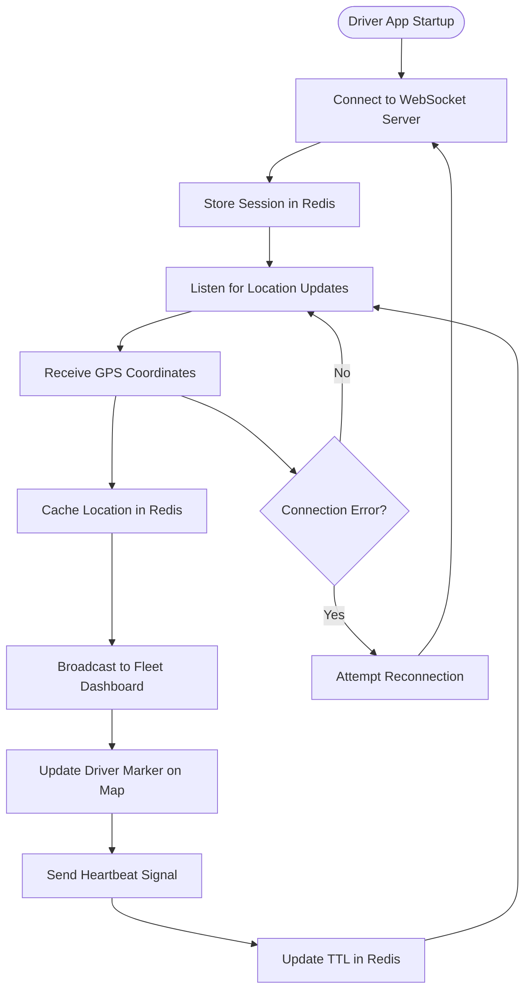
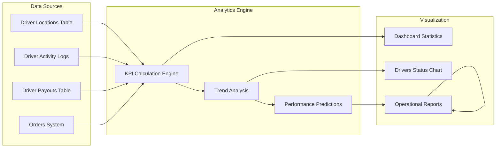
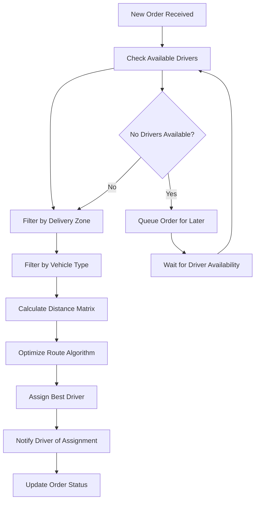
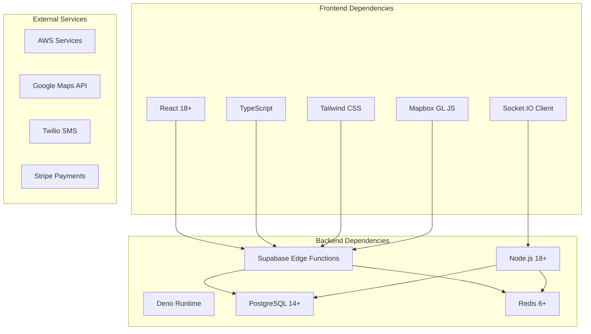

# Fleet Operations Oversight

<cite>
**Referenced Files in This Document**
- [fleet-management-portal-design.md](file://docs/fleet-management-portal-design.md)
- [fleet/index.ts](file://src/fleet/index.ts)
- [fleet/routes.tsx](file://src/fleet/routes.tsx)
- [FleetLayout.tsx](file://src/fleet/components/layout/FleetLayout.tsx)
- [ProtectedFleetRoute.tsx](file://src/fleet/components/ProtectedFleetRoute.tsx)
- [DashboardStats.tsx](file://src/fleet/components/dashboard/DashboardStats.tsx)
- [DriversStatusChart.tsx](file://src/fleet/components/dashboard/DriversStatusChart.tsx)
- [DriverCard.tsx](file://src/fleet/components/drivers/DriverCard.tsx)
- [DriverList.tsx](file://src/fleet/components/drivers/DriverList.tsx)
- [DriverFilters.tsx](file://src/fleet/components/drivers/DriverFilters.tsx)
- [DriverMarker.tsx](file://src/fleet/components/map/DriverMarker.tsx)
- [CitySelector.tsx](file://src/fleet/components/common/CitySelector.tsx)
- [ZoneSelector.tsx](file://src/fleet/components/common/ZoneSelector.tsx)
- [StatusFilter.tsx](file://src/fleet/components/common/StatusFilter.tsx)
- [fleet-dashboard.ts](file://supabase/functions/fleet-dashboard.ts)
- [fleet-drivers.ts](file://supabase/functions/fleet-drivers.ts)
- [fleet-tracking.ts](file://supabase/functions/fleet-tracking.ts)
- [fleet-vehicles.ts](file://supabase/functions/fleet-vehicles.ts)
- [fleet-payouts.ts](file://supabase/functions/fleet-payouts.ts)
- [auto-assign-driver.ts](file://supabase/functions/auto-assign-driver.ts)
- [smart-meal-allocator.ts](file://supabase/functions/smart-meal-allocator.ts)
- [websocket-server/src/index.ts](file://websocket-server/src/index.ts)
- [websocket-server/package.json](file://websocket-server/package.json)
- [websocket-server/tsconfig.json](file://websocket-server/tsconfig.json)
- [integrations/supabase/client.ts](file://src/integrations/supabase/client.ts)
- [integrations/supabase/delivery.ts](file://src/integrations/supabase/delivery.ts)
- [integrations/supabase/types.ts](file://src/integrations/supabase/types.ts)
</cite>

## Table of Contents
1. [Introduction](#introduction)
2. [Project Structure](#project-structure)
3. [Core Components](#core-components)
4. [Architecture Overview](#architecture-overview)
5. [Detailed Component Analysis](#detailed-component-analysis)
6. [Dependency Analysis](#dependency-analysis)
7. [Performance Considerations](#performance-considerations)
8. [Troubleshooting Guide](#troubleshooting-guide)
9. [Conclusion](#conclusion)

## Introduction
This document provides comprehensive documentation for the Fleet Operations Oversight system within the admin portal. It covers the delivery oversight system, driver management, and vehicle tracking capabilities. It also explains fleet analytics, driver performance monitoring, and operational efficiency tracking, including delivery route optimization, driver assignment algorithms, and fleet utilization metrics. The document details integration with real-time tracking systems and operational reporting dashboards.

## Project Structure
The Fleet Management Portal is implemented as a dedicated React application integrated into the broader admin portal ecosystem. The system follows a layered architecture with clear separation between the client-side fleet web app, backend services via Supabase Edge Functions, real-time tracking infrastructure, and data persistence.

**Diagram sources**
- [fleet-management-portal-design.md:14-82](file://docs/fleet-management-portal-design.md#L14-L82)
- [fleet/routes.tsx:1-42](file://src/fleet/routes.tsx#L1-L42)

**Section sources**
- [fleet-management-portal-design.md:1-167](file://docs/fleet-management-portal-design.md#L1-L167)
- [fleet/index.ts:1-14](file://src/fleet/index.ts#L1-L14)
- [fleet/routes.tsx:1-42](file://src/fleet/routes.tsx#L1-L42)

## Core Components
The Fleet Management Portal consists of several core components organized by feature areas:

### Navigation and Layout
- **FleetLayout**: Main layout component providing navigation structure
- **ProtectedFleetRoute**: Authentication and authorization wrapper
- **FleetHeader**: Top-level header with branding and user controls
- **FleetSidebar**: Left navigation sidebar for fleet operations

### Dashboard Components
- **DashboardStats**: Key performance indicators and metrics display
- **DriversStatusChart**: Visual representation of driver availability and status
- **CitySelector**: Multi-city filtering capability for fleet managers

### Driver Management Components
- **DriverList**: Comprehensive list of drivers with filtering and sorting
- **DriverCard**: Individual driver information cards
- **DriverFilters**: Advanced filtering options for driver records
- **DriverStatusBadge**: Status indicators and visual cues

### Vehicle and Tracking Components
- **DriverMarker**: Interactive markers for driver locations on maps
- **ZoneSelector**: Geographic zone selection for route planning
- **StatusFilter**: Status-based filtering for fleet assets

**Section sources**
- [FleetLayout.tsx](file://src/fleet/components/layout/FleetLayout.tsx)
- [ProtectedFleetRoute.tsx](file://src/fleet/components/ProtectedFleetRoute.tsx)
- [DashboardStats.tsx](file://src/fleet/components/dashboard/DashboardStats.tsx)
- [DriversStatusChart.tsx](file://src/fleet/components/dashboard/DriversStatusChart.tsx)
- [DriverCard.tsx](file://src/fleet/components/drivers/DriverCard.tsx)
- [DriverList.tsx](file://src/fleet/components/drivers/DriverList.tsx)
- [DriverFilters.tsx](file://src/fleet/components/drivers/DriverFilters.tsx)
- [DriverMarker.tsx](file://src/fleet/components/map/DriverMarker.tsx)
- [CitySelector.tsx](file://src/fleet/components/common/CitySelector.tsx)
- [ZoneSelector.tsx](file://src/fleet/components/common/ZoneSelector.tsx)
- [StatusFilter.tsx](file://src/fleet/components/common/StatusFilter.tsx)

## Architecture Overview
The fleet operations system implements a multi-tenant architecture with city-level data isolation, real-time tracking, and comprehensive analytics capabilities.

**Diagram sources**
- [fleet-management-portal-design.md:84-122](file://docs/fleet-management-portal-design.md#L84-L122)
- [fleet-dashboard.ts](file://supabase/functions/fleet-dashboard.ts)
- [fleet-tracking.ts](file://supabase/functions/fleet-tracking.ts)

The architecture supports:
- **Multi-city isolation**: Super admin access to all cities, city managers to assigned cities
- **Real-time tracking**: WebSocket-based live location updates with Redis caching
- **Role-based access control**: JWT authentication with row-level security policies
- **Scalable backend**: Supabase Edge Functions for business logic processing

## Detailed Component Analysis

### Driver Management System
The driver management system provides comprehensive oversight of driver operations, performance tracking, and administrative controls.

**Diagram sources**
- [fleet-management-portal-design.md:231-430](file://docs/fleet-management-portal-design.md#L231-L430)

Key driver management capabilities include:
- **Performance Monitoring**: Delivery metrics, rating system, cancellation tracking
- **Document Verification**: ID cards, driving licenses, insurance documents
- **Payout Management**: Automated calculation, approval workflows, payment processing
- **Geographic Assignment**: Zone-based driver assignments with priority systems

**Section sources**
- [DriverCard.tsx](file://src/fleet/components/drivers/DriverCard.tsx)
- [DriverList.tsx](file://src/fleet/components/drivers/DriverList.tsx)
- [DriverFilters.tsx](file://src/fleet/components/drivers/DriverFilters.tsx)

### Real-Time Tracking and Live Monitoring
The real-time tracking system provides live visibility into driver locations and operational status.

**Diagram sources**
- [fleet-management-portal-design.md:107-122](file://docs/fleet-management-portal-design.md#L107-L122)
- [DriverMarker.tsx](file://src/fleet/components/map/DriverMarker.tsx)

Real-time tracking features:
- **Live Location Streaming**: Continuous GPS coordinate updates
- **Session Management**: WebSocket connection lifecycle and heartbeat
- **Caching Strategy**: Redis-based location caching with TTL management
- **Broadcast Architecture**: Efficient distribution of location updates to multiple clients

**Section sources**
- [DriverMarker.tsx](file://src/fleet/components/map/DriverMarker.tsx)
- [websocket-server/src/index.ts](file://websocket-server/src/index.ts)

### Fleet Analytics and Performance Monitoring
The analytics system provides comprehensive insights into fleet operations, driver performance, and operational efficiency.

**Diagram sources**
- [DashboardStats.tsx](file://src/fleet/components/dashboard/DashboardStats.tsx)
- [DriversStatusChart.tsx](file://src/fleet/components/dashboard/DriversStatusChart.tsx)

Analytics capabilities include:
- **Real-time Metrics**: Online/offline drivers, active deliveries, completion rates
- **Historical Analysis**: Performance trends, seasonal variations, efficiency improvements
- **Predictive Modeling**: Delivery time predictions, optimal shift scheduling
- **Custom Reporting**: Exportable reports for management review

**Section sources**
- [DashboardStats.tsx](file://src/fleet/components/dashboard/DashboardStats.tsx)
- [DriversStatusChart.tsx](file://src/fleet/components/dashboard/DriversStatusChart.tsx)

### Route Optimization and Driver Assignment
The system implements intelligent algorithms for delivery route optimization and driver assignment.

**Diagram sources**
- [auto-assign-driver.ts](file://supabase/functions/auto-assign-driver.ts)
- [smart-meal-allocator.ts](file://supabase/functions/smart-meal-allocator.ts)

Assignment algorithms include:
- **Proximity-Based Assignment**: Closest available driver prioritization
- **Capacity Optimization**: Vehicle capacity and route efficiency considerations
- **Skill Matching**: Specialized drivers for specific delivery requirements
- **Load Balancing**: Even distribution of work across available drivers

**Section sources**
- [auto-assign-driver.ts](file://supabase/functions/auto-assign-driver.ts)
- [smart-meal-allocator.ts](file://supabase/functions/smart-meal-allocator.ts)

## Dependency Analysis
The fleet operations system has well-defined dependencies between frontend components, backend services, and external infrastructure.

**Diagram sources**
- [websocket-server/package.json](file://websocket-server/package.json)
- [websocket-server/tsconfig.json](file://websocket-server/tsconfig.json)

Key dependency relationships:
- **Frontend-Backend Integration**: React components communicate via Supabase Edge Functions
- **Real-time Communication**: WebSocket server handles live location updates
- **Data Persistence**: PostgreSQL stores structured fleet data with Redis caching
- **External Integrations**: Payment processing, SMS notifications, mapping services

**Section sources**
- [fleet-management-portal-design.md:155-166](file://docs/fleet-management-portal-design.md#L155-L166)
- [websocket-server/package.json](file://websocket-server/package.json)

## Performance Considerations
The fleet operations system is designed with scalability and performance optimization in mind:

### Database Optimization
- **Indexing Strategy**: Strategic indexing on frequently queried columns (city_id, status, timestamps)
- **Partitioning**: Time-series data partitioning for historical location tracking
- **Connection Pooling**: Optimized database connections for high-throughput scenarios
- **Query Optimization**: Efficient queries with proper joins and filters

### Caching Strategy
- **Redis Implementation**: Multi-level caching for location data, session management, and frequently accessed metrics
- **TTL Management**: Intelligent expiration policies for stale data removal
- **Cache Invalidation**: Event-driven cache updates for real-time consistency

### Scalability Features
- **Horizontal Scaling**: Stateless service design enabling easy scaling
- **Load Distribution**: Round-robin load balancing across service instances
- **Rate Limiting**: API gateway level rate limiting for protection
- **Circuit Breakers**: Fault tolerance mechanisms for service resilience

## Troubleshooting Guide
Common issues and their resolutions in the fleet operations system:

### Authentication and Authorization Issues
- **Symptom**: Users unable to access fleet portal
- **Cause**: Invalid JWT tokens or insufficient permissions
- **Resolution**: Verify user roles in fleet_managers table, check assigned_city_ids, regenerate tokens

### Real-time Tracking Problems
- **Symptom**: Drivers not appearing on map
- **Cause**: WebSocket connection failures or Redis connectivity issues
- **Resolution**: Check WebSocket server logs, verify Redis cluster health, restart failed connections

### Performance Degradation
- **Symptom**: Slow dashboard loading or delayed location updates
- **Cause**: Database query bottlenecks or excessive cache misses
- **Resolution**: Analyze slow query logs, optimize database indexes, adjust cache TTL settings

### Data Consistency Issues
- **Symptom**: Inconsistent driver status or location data
- **Cause**: Race conditions in concurrent updates
- **Resolution**: Implement proper transaction handling, add optimistic locking mechanisms

**Section sources**
- [fleet-management-portal-design.md:536-607](file://docs/fleet-management-portal-design.md#L536-L607)

## Conclusion
The Fleet Operations Oversight system provides comprehensive management capabilities for modern fleet operations. Its multi-tenant architecture, real-time tracking, advanced analytics, and intelligent assignment algorithms enable efficient fleet management across multiple cities. The system's modular design, robust security measures, and scalable infrastructure support both current operations and future growth requirements.

The integration of Supabase Edge Functions, WebSocket real-time communication, and comprehensive analytics creates a powerful platform for fleet oversight. With proper monitoring, maintenance, and adherence to the established patterns, the system will continue to deliver reliable fleet management capabilities for years to come.