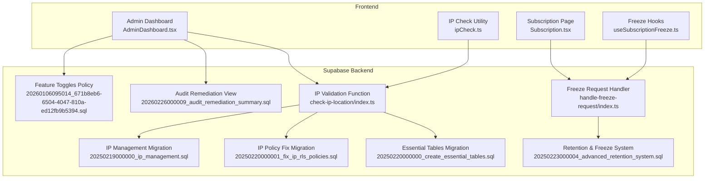
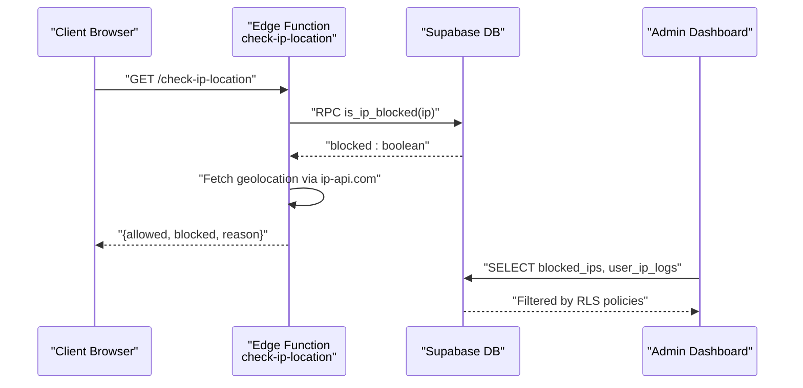
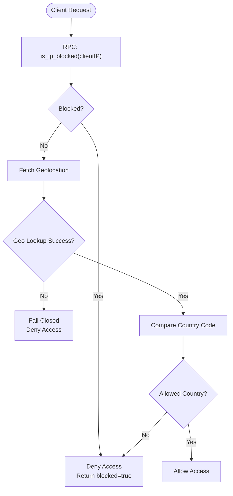
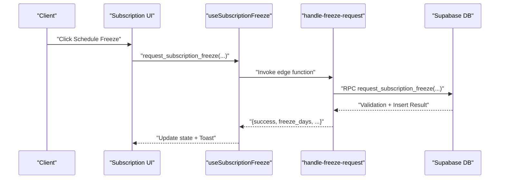
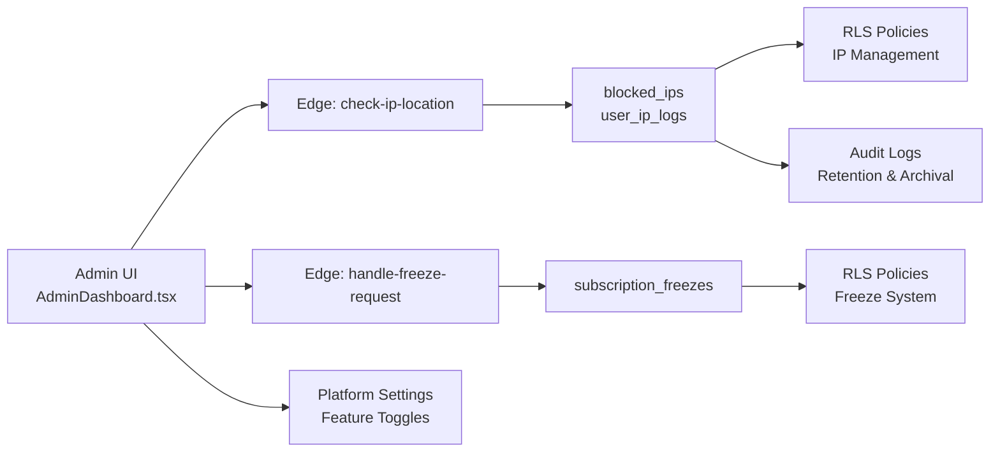

# Security & Access Control

<cite>
**Referenced Files in This Document**
- [AdminDashboard.tsx](file://src/pages/admin/AdminDashboard.tsx)
- [20250219000000_ip_management.sql](file://supabase/migrations/20250219000000_ip_management.sql)
- [20250220000001_fix_ip_rls_policies.sql](file://supabase/migrations/20250220000001_fix_ip_rls_policies.sql)
- [20250220000000_create_essential_tables.sql](file://supabase/migrations/20250220000000_create_essential_tables.sql)
- [20250223000004_advanced_retention_system.sql](file://supabase/migrations/20250223000004_advanced_retention_system.sql)
- [20260106095014_671b8eb6-6504-4047-810a-ed12fb9b5394.sql](file://supabase/migrations/20260106095014_671b8eb6-6504-4047-810a-ed12fb9b5394.sql)
- [20260226000008_fix_rls_and_security_issues.sql](file://supabase/migrations/20260226000008_fix_rls_and_security_issues.sql)
- [20260226000009_audit_remediation_summary.sql](file://supabase/migrations/20260226000009_audit_remediation_summary.sql)
- [check-ip-location/index.ts](file://supabase/functions/check-ip-location/index.ts)
- [handle-freeze-request/index.ts](file://supabase/functions/handle-freeze-request/index.ts)
- [ip_management.spec.ts](file://e2e/admin/ip_management.spec.ts)
- [Subscription.tsx](file://src/pages/Subscription.tsx)
- [useSubscriptionFreeze.ts](file://src/hooks/useSubscriptionFreeze.ts)
- [ipCheck.ts](file://src/lib/ipCheck.ts)
</cite>

## Table of Contents
1. [Introduction](#introduction)
2. [Project Structure](#project-structure)
3. [Core Components](#core-components)
4. [Architecture Overview](#architecture-overview)
5. [Detailed Component Analysis](#detailed-component-analysis)
6. [Dependency Analysis](#dependency-analysis)
7. [Performance Considerations](#performance-considerations)
8. [Troubleshooting Guide](#troubleshooting-guide)
9. [Conclusion](#conclusion)
10. [Appendices](#appendices)

## Introduction
This document provides comprehensive documentation for security and access control features in the admin portal. It covers IP management and geographic access control (whitelist/blacklist, location-based restrictions, suspicious activity monitoring), freeze management for account security (temporary suspensions, permanent bans, investigations), system settings and configuration management (security policies, feature toggles, operational parameters), and audit logging with compliance reporting and security incident response procedures. It also includes examples of security workflows, risk assessment procedures, and regulatory compliance features.

## Project Structure
Security and access control functionality spans three primary areas:
- Supabase database schema and row-level security (RLS) policies for IP management and audit logging
- Edge functions for IP validation and subscription freeze orchestration
- Frontend admin dashboards and subscription management UI

**Diagram sources**
- [20250219000000_ip_management.sql:1-120](file://supabase/migrations/20250219000000_ip_management.sql#L1-L120)
- [20250220000001_fix_ip_rls_policies.sql:1-43](file://supabase/migrations/20250220000001_fix_ip_rls_policies.sql#L1-L43)
- [20250220000000_create_essential_tables.sql:190-232](file://supabase/migrations/20250220000000_create_essential_tables.sql#L190-L232)
- [20250223000004_advanced_retention_system.sql:425-573](file://supabase/migrations/20250223000004_advanced_retention_system.sql#L425-L573)
- [20260106095014_671b8eb6-6504-4047-810a-ed12fb9b5394.sql:1-5](file://supabase/migrations/20260106095014_671b8eb6-6504-4047-810a-ed12fb9b5394.sql#L1-L5)
- [20260226000009_audit_remediation_summary.sql:168-186](file://supabase/migrations/20260226000009_audit_remediation_summary.sql#L168-L186)
- [check-ip-location/index.ts:37-84](file://supabase/functions/check-ip-location/index.ts#L37-L84)
- [handle-freeze-request/index.ts:107-159](file://supabase/functions/handle-freeze-request/index.ts#L107-L159)
- [AdminDashboard.tsx:1-591](file://src/pages/admin/AdminDashboard.tsx#L1-L591)
- [Subscription.tsx:816-842](file://src/pages/Subscription.tsx#L816-L842)
- [useSubscriptionFreeze.ts:138-183](file://src/hooks/useSubscriptionFreeze.ts#L138-L183)
- [ipCheck.ts:1-200](file://src/lib/ipCheck.ts#L1-L200)

**Section sources**
- [AdminDashboard.tsx:1-591](file://src/pages/admin/AdminDashboard.tsx#L1-L591)
- [20250219000000_ip_management.sql:1-120](file://supabase/migrations/20250219000000_ip_management.sql#L1-L120)
- [20250220000001_fix_ip_rls_policies.sql:1-43](file://supabase/migrations/20250220000001_fix_ip_rls_policies.sql#L1-L43)
- [20250220000000_create_essential_tables.sql:190-232](file://supabase/migrations/20250220000000_create_essential_tables.sql#L190-L232)
- [20250223000004_advanced_retention_system.sql:425-573](file://supabase/migrations/20250223000004_advanced_retention_system.sql#L425-L573)
- [20260106095014_671b8eb6-6504-4047-810a-ed12fb9b5394.sql:1-5](file://supabase/migrations/20260106095014_671b8eb6-6504-4047-810a-ed12fb9b5394.sql#L1-L5)
- [20260226000009_audit_remediation_summary.sql:168-186](file://supabase/migrations/20260226000009_audit_remediation_summary.sql#L168-L186)
- [check-ip-location/index.ts:37-84](file://supabase/functions/check-ip-location/index.ts#L37-L84)
- [handle-freeze-request/index.ts:107-159](file://supabase/functions/handle-freeze-request/index.ts#L107-L159)
- [Subscription.tsx:816-842](file://src/pages/Subscription.tsx#L816-L842)
- [useSubscriptionFreeze.ts:138-183](file://src/hooks/useSubscriptionFreeze.ts#L138-L183)
- [ipCheck.ts:1-200](file://src/lib/ipCheck.ts#L1-L200)

## Core Components
- IP Management and Geographic Access Control
  - Blocked IP table with RLS policy allowing admin management
  - User IP logs table with RLS enabling admin viewing and user self-insertion
  - Edge function validating client IP against blocklist and geolocation
- Freeze Management for Account Security
  - Subscription freeze table with lifecycle tracking and admin/user policies
  - Edge function orchestrating freeze scheduling and validation
  - Frontend hooks and UI for scheduling and canceling freezes
- System Settings and Configuration Management
  - Platform settings table with policy enabling feature toggle visibility
  - Audit remediation verification view for compliance checks
- Audit Logging and Compliance Reporting
  - Retention policies and archival procedures for audit logs
  - Remediation status view for security controls verification

**Section sources**
- [20250219000000_ip_management.sql:39-60](file://supabase/migrations/20250219000000_ip_management.sql#L39-L60)
- [20250220000001_fix_ip_rls_policies.sql:20-42](file://supabase/migrations/20250220000001_fix_ip_rls_policies.sql#L20-L42)
- [20250220000000_create_essential_tables.sql:200-232](file://supabase/migrations/20250220000000_create_essential_tables.sql#L200-L232)
- [check-ip-location/index.ts:37-84](file://supabase/functions/check-ip-location/index.ts#L37-L84)
- [20250223000004_advanced_retention_system.sql:425-573](file://supabase/migrations/20250223000004_advanced_retention_system.sql#L425-L573)
- [handle-freeze-request/index.ts:107-159](file://supabase/functions/handle-freeze-request/index.ts#L107-L159)
- [Subscription.tsx:816-842](file://src/pages/Subscription.tsx#L816-L842)
- [useSubscriptionFreeze.ts:138-183](file://src/hooks/useSubscriptionFreeze.ts#L138-L183)
- [20260106095014_671b8eb6-6504-4047-810a-ed12fb9b5394.sql:1-5](file://supabase/migrations/20260106095014_671b8eb6-6504-4047-810a-ed12fb9b5394.sql#L1-L5)
- [20260226000009_audit_remediation_summary.sql:168-186](file://supabase/migrations/20260226000009_audit_remediation_summary.sql#L168-L186)
- [20260226000008_fix_rls_and_security_issues.sql:125-154](file://supabase/migrations/20260226000008_fix_rls_and_security_issues.sql#L125-L154)

## Architecture Overview
The security architecture integrates database-level controls with edge functions and frontend components:

**Diagram sources**
- [check-ip-location/index.ts:37-84](file://supabase/functions/check-ip-location/index.ts#L37-L84)
- [20250219000000_ip_management.sql:51-60](file://supabase/migrations/20250219000000_ip_management.sql#L51-L60)
- [20250220000001_fix_ip_rls_policies.sql:20-42](file://supabase/migrations/20250220000001_fix_ip_rls_policies.sql#L20-L42)
- [AdminDashboard.tsx:1-591](file://src/pages/admin/AdminDashboard.tsx#L1-L591)

## Detailed Component Analysis

### IP Management and Geographic Access Control
- Blocked IP Management
  - Table: blocked_ips with indexes on ip_address and is_active
  - RLS Policy: Admins can manage blocked IPs; fail-closed enforcement via RPC
- User IP Logs
  - Table: user_ip_logs capturing user_id, ip_address, user_agent, created_at
  - RLS Policies: Admins can view; users can insert their own logs
- Edge Function: check-ip-location
  - Validates client IP against blocklist
  - Performs geolocation lookup and enforces country-based restrictions
  - Returns structured response indicating allowed/block status and reason
- Frontend Integration
  - Admin dashboard queries blocked_ips and user_ip_logs with RLS constraints
  - Utility module provides IP check capabilities for client-side validation

**Diagram sources**
- [check-ip-location/index.ts:37-84](file://supabase/functions/check-ip-location/index.ts#L37-L84)
- [20250219000000_ip_management.sql:51-60](file://supabase/migrations/20250219000000_ip_management.sql#L51-L60)

**Section sources**
- [20250219000000_ip_management.sql:39-60](file://supabase/migrations/20250219000000_ip_management.sql#L39-L60)
- [20250220000001_fix_ip_rls_policies.sql:20-42](file://supabase/migrations/20250220000001_fix_ip_rls_policies.sql#L20-L42)
- [20250220000000_create_essential_tables.sql:200-232](file://supabase/migrations/20250220000000_create_essential_tables.sql#L200-L232)
- [check-ip-location/index.ts:37-84](file://supabase/functions/check-ip-location/index.ts#L37-L84)
- [AdminDashboard.tsx:1-591](file://src/pages/admin/AdminDashboard.tsx#L1-L591)
- [ipCheck.ts:1-200](file://src/lib/ipCheck.ts#L1-L200)

### Freeze Management for Account Security
- Subscription Freeze Lifecycle
  - Table: subscription_freezes tracks freeze periods, billing cycles, and status
  - Constraints: freeze duration limits, overlap prevention, billing cycle boundaries
  - RLS: Users can view/manage own freezes; Admins have full access
- Edge Function: handle-freeze-request
  - Orchestrates freeze scheduling via stored procedure
  - Validates inputs, checks subscription status and cycle boundaries
  - Updates related audit logs and returns structured results
- Frontend Hooks and UI
  - useSubscriptionFreeze handles scheduling and cancellation mutations
  - Subscription page renders freeze scheduling controls based on remaining freeze days

**Diagram sources**
- [handle-freeze-request/index.ts:107-159](file://supabase/functions/handle-freeze-request/index.ts#L107-L159)
- [20250223000004_advanced_retention_system.sql:425-573](file://supabase/migrations/20250223000004_advanced_retention_system.sql#L425-L573)
- [useSubscriptionFreeze.ts:138-183](file://src/hooks/useSubscriptionFreeze.ts#L138-L183)
- [Subscription.tsx:816-842](file://src/pages/Subscription.tsx#L816-L842)

**Section sources**
- [20250223000004_advanced_retention_system.sql:425-573](file://supabase/migrations/20250223000004_advanced_retention_system.sql#L425-L573)
- [handle-freeze-request/index.ts:107-159](file://supabase/functions/handle-freeze-request/index.ts#L107-L159)
- [useSubscriptionFreeze.ts:138-183](file://src/hooks/useSubscriptionFreeze.ts#L138-L183)
- [Subscription.tsx:816-842](file://src/pages/Subscription.tsx#L816-L842)

### System Settings and Configuration Management
- Feature Toggles
  - Platform settings table with policy allowing read access for feature keys
  - Enables frontend to conditionally render features without exposing secrets
- Audit Remediation Verification
  - Dedicated view validates that all security audit remediation checks pass
  - Grants authenticated access to the verification view for oversight

**Section sources**
- [20260106095014_671b8eb6-6504-4047-810a-ed12fb9b5394.sql:1-5](file://supabase/migrations/20260106095014_671b8eb6-6504-4047-810a-ed12fb9b5394.sql#L1-L5)
- [20260226000009_audit_remediation_summary.sql:168-186](file://supabase/migrations/20260226000009_audit_remediation_summary.sql#L168-L186)

### Audit Logging, Compliance Reporting, and Incident Response
- Retention and Archival
  - Stored procedure supports purge/archive policies for audit logs
  - Dry-run mode enables validation before execution
- Compliance Checks
  - Remediation view aggregates security control verification results
  - Ensures policies and configurations are consistently applied

**Section sources**
- [20260226000008_fix_rls_and_security_issues.sql:125-154](file://supabase/migrations/20260226000008_fix_rls_and_security_issues.sql#L125-L154)
- [20260226000009_audit_remediation_summary.sql:168-186](file://supabase/migrations/20260226000009_audit_remediation_summary.sql#L168-L186)

## Dependency Analysis
Security features depend on coordinated database policies, edge functions, and frontend components:

**Diagram sources**
- [AdminDashboard.tsx:1-591](file://src/pages/admin/AdminDashboard.tsx#L1-L591)
- [check-ip-location/index.ts:37-84](file://supabase/functions/check-ip-location/index.ts#L37-L84)
- [handle-freeze-request/index.ts:107-159](file://supabase/functions/handle-freeze-request/index.ts#L107-L159)
- [20250219000000_ip_management.sql:39-60](file://supabase/migrations/20250219000000_ip_management.sql#L39-L60)
- [20250223000004_advanced_retention_system.sql:425-573](file://supabase/migrations/20250223000004_advanced_retention_system.sql#L425-L573)
- [20260106095014_671b8eb6-6504-4047-810a-ed12fb9b5394.sql:1-5](file://supabase/migrations/20260106095014_671b8eb6-6504-4047-810a-ed12fb9b5394.sql#L1-L5)
- [20260226000008_fix_rls_and_security_issues.sql:125-154](file://supabase/migrations/20260226000008_fix_rls_and_security_issues.sql#L125-L154)

**Section sources**
- [AdminDashboard.tsx:1-591](file://src/pages/admin/AdminDashboard.tsx#L1-L591)
- [check-ip-location/index.ts:37-84](file://supabase/functions/check-ip-location/index.ts#L37-L84)
- [handle-freeze-request/index.ts:107-159](file://supabase/functions/handle-freeze-request/index.ts#L107-L159)
- [20250219000000_ip_management.sql:39-60](file://supabase/migrations/20250219000000_ip_management.sql#L39-L60)
- [20250223000004_advanced_retention_system.sql:425-573](file://supabase/migrations/20250223000004_advanced_retention_system.sql#L425-L573)
- [20260106095014_671b8eb6-6504-4047-810a-ed12fb9b5394.sql:1-5](file://supabase/migrations/20260106095014_671b8eb6-6504-4047-810a-ed12fb9b5394.sql#L1-L5)
- [20260226000008_fix_rls_and_security_issues.sql:125-154](file://supabase/migrations/20260226000008_fix_rls_and_security_issues.sql#L125-L154)

## Performance Considerations
- Database Indexes
  - blocked_ips: ip_address, is_active
  - user_ip_logs: user_id, ip_address, created_at DESC
  - subscription_freezes: user_id/status (active), subscription_id, billing cycle
- Edge Function Efficiency
  - Early exit on blocked IP detection
  - Minimal external API calls with caching-friendly patterns
- Frontend Responsiveness
  - Query invalidation and optimistic updates for freeze operations
  - Debounced network calls for admin dashboards

[No sources needed since this section provides general guidance]

## Troubleshooting Guide
- IP Access Denied
  - Verify client IP is not present in blocked_ips
  - Confirm geolocation service availability and country code match
  - Check RLS policy permissions for the requesting user
- Freeze Request Errors
  - Validate freeze dates within billing cycle
  - Ensure sufficient remaining freeze days in the cycle
  - Confirm no overlapping freeze periods
- Audit Remediation Failures
  - Review remediation view for failing checks
  - Execute dry-run archival procedures before applying changes

**Section sources**
- [check-ip-location/index.ts:37-84](file://supabase/functions/check-ip-location/index.ts#L37-L84)
- [20250219000000_ip_management.sql:51-60](file://supabase/migrations/20250219000000_ip_management.sql#L51-L60)
- [20250223000004_advanced_retention_system.sql:425-573](file://supabase/migrations/20250223000004_advanced_retention_system.sql#L425-L573)
- [20260226000009_audit_remediation_summary.sql:168-186](file://supabase/migrations/20260226000009_audit_remediation_summary.sql#L168-L186)

## Conclusion
The admin portal implements robust security and access control through database-driven policies, validated by edge functions, and surfaced via admin dashboards. IP management leverages blocklists and geolocation with fail-closed safety, while freeze management provides secure, auditable suspension mechanisms. System settings enable controlled feature toggles, and comprehensive audit logging with remediation verification ensures ongoing compliance.

[No sources needed since this section summarizes without analyzing specific files]

## Appendices

### Security Workflows Examples
- IP-Based Access Control Workflow
  - Client requests protected resource
  - Edge function checks blocklist and geolocation
  - Decision enforced with structured response
- Freeze Request Workflow
  - User submits freeze request via UI
  - Frontend invokes edge function with validation
  - Database stores freeze record and updates audit logs

**Section sources**
- [check-ip-location/index.ts:37-84](file://supabase/functions/check-ip-location/index.ts#L37-L84)
- [handle-freeze-request/index.ts:107-159](file://supabase/functions/handle-freeze-request/index.ts#L107-L159)
- [useSubscriptionFreeze.ts:138-183](file://src/hooks/useSubscriptionFreeze.ts#L138-L183)

### Risk Assessment Procedures
- Monthly IP Access Reviews
  - Audit blocked_ips entries and rationale
  - Review user_ip_logs for suspicious patterns
- Quarterly Freeze Policy Review
  - Evaluate freeze durations and cycle utilization
  - Assess overlap incidents and adjust constraints
- Annual Audit Remediation Verification
  - Run remediation view checks
  - Document and remediate failing controls

**Section sources**
- [20250219000000_ip_management.sql:39-60](file://supabase/migrations/20250219000000_ip_management.sql#L39-L60)
- [20250223000004_advanced_retention_system.sql:425-573](file://supabase/migrations/20250223000004_advanced_retention_system.sql#L425-L573)
- [20260226000009_audit_remediation_summary.sql:168-186](file://supabase/migrations/20260226000009_audit_remediation_summary.sql#L168-L186)

### Regulatory Compliance Features
- Data Retention and Archival
  - Configurable retention policies for audit logs
  - Archive procedures for long-term compliance storage
- Access Control and Auditing
  - Row-level security policies for sensitive tables
  - Comprehensive audit trail for administrative actions

**Section sources**
- [20260226000008_fix_rls_and_security_issues.sql:125-154](file://supabase/migrations/20260226000008_fix_rls_and_security_issues.sql#L125-L154)
- [20250220000000_create_essential_tables.sql:200-232](file://supabase/migrations/20250220000000_create_essential_tables.sql#L200-L232)