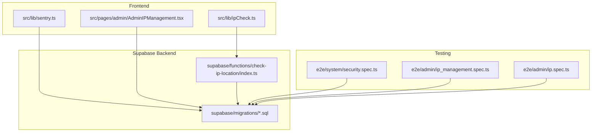
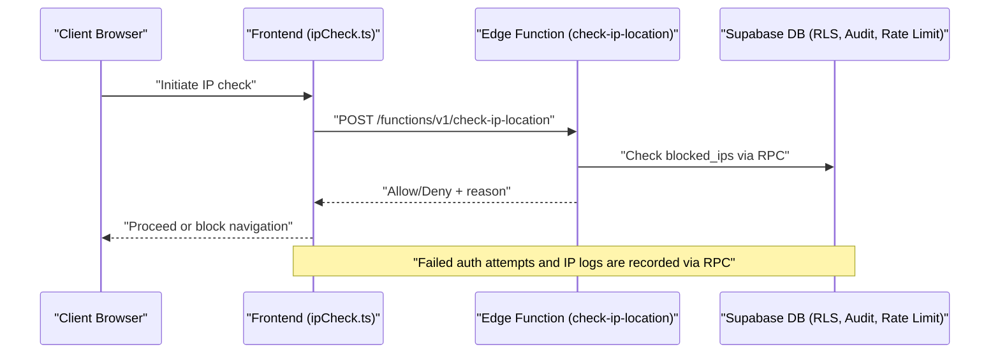
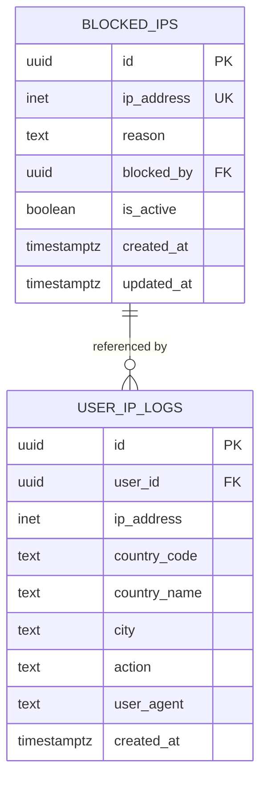
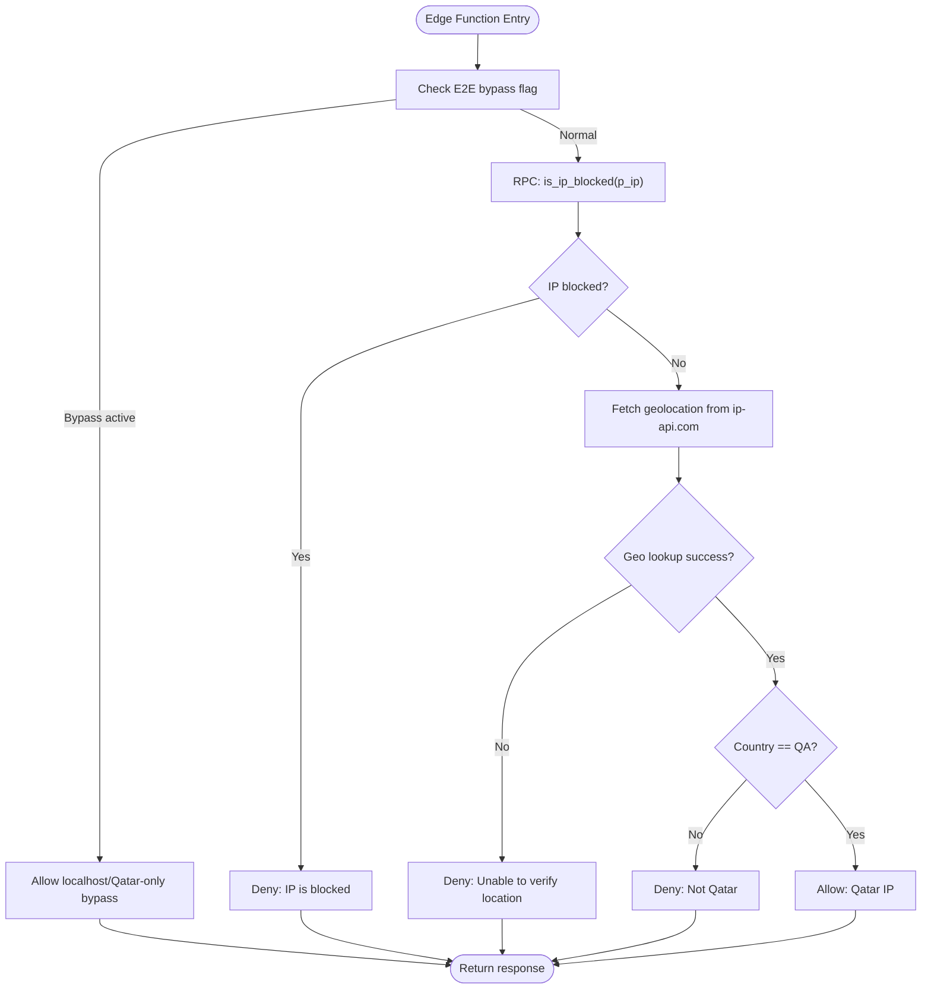
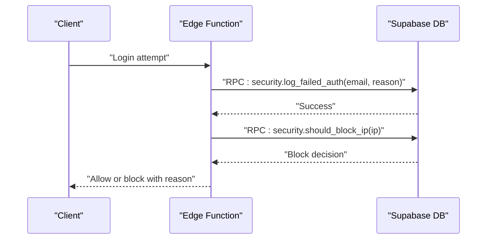
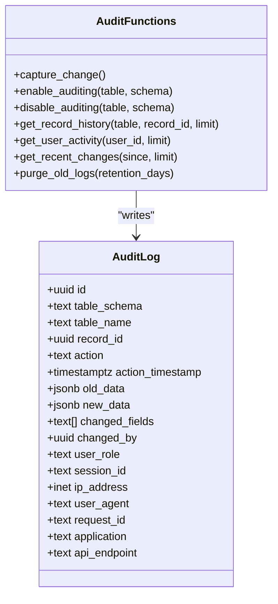
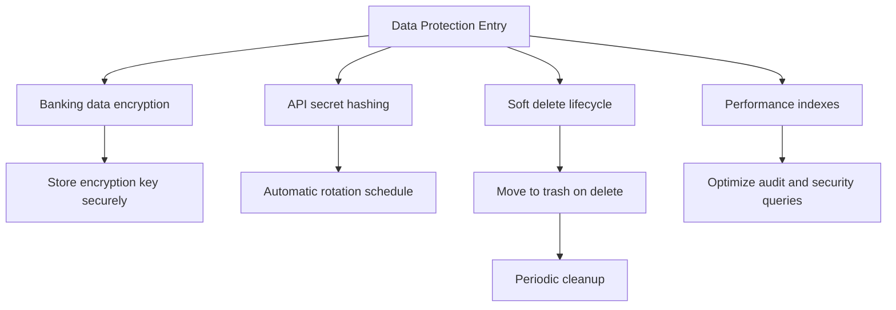
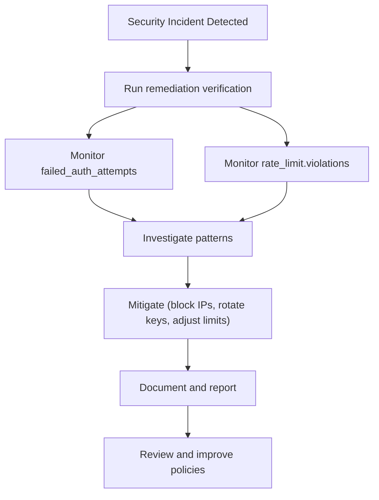
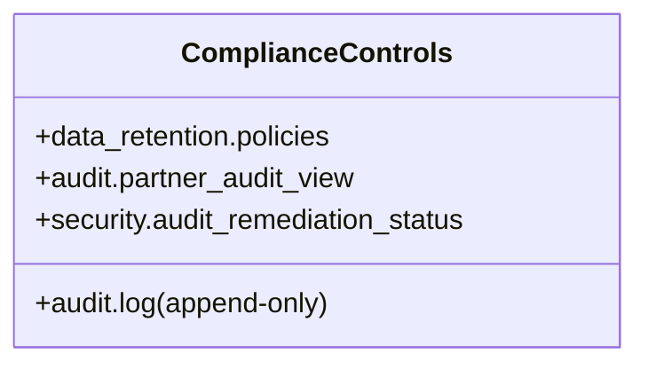
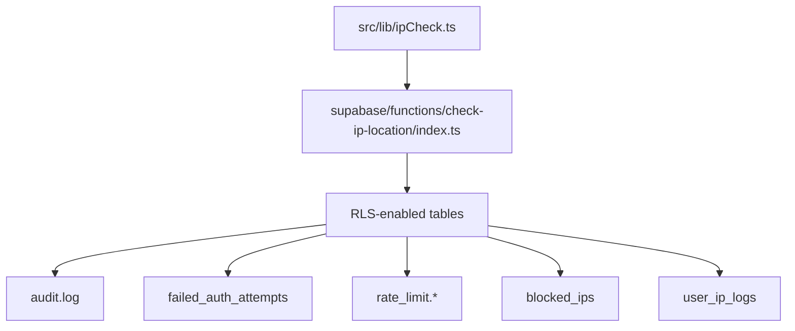

# Security & Compliance

<cite>
**Referenced Files in This Document**
- [security.spec.ts](file://e2e/system/security.spec.ts)
- [ipCheck.ts](file://src/lib/ipCheck.ts)
- [sentry.ts](file://src/lib/sentry.ts)
- [rls_audit_and_policies.sql](file://supabase/migrations/20250218000002_rls_audit_and_policies.sql)
- [audit_logging_system.sql](file://supabase/migrations/20260226000003_audit_logging_system.sql)
- [fix_rls_and_security_issues.sql](file://supabase/migrations/20260226000008_fix_rls_and_security_issues.sql)
- [20260226000009_audit_remediation_summary.sql](file://supabase/migrations/20260226000009_audit_remediation_summary.sql)
- [check-ip-location/index.ts](file://supabase/functions/check-ip-location/index.ts)
- [20250220000001_fix_ip_rls_policies.sql](file://supabase/migrations/20250220000001_fix_ip_rls_policies.sql)
- [CREATE_TABLES_SQL.md](file://CREATE_TABLES_SQL.md)
- [AdminIPManagement.tsx](file://src/pages/admin/AdminIPManagement.tsx)
- [ip_management.spec.ts](file://e2e/admin/ip_management.spec.ts)
- [ip.spec.ts](file://e2e/admin/ip.spec.ts)
- [SECURITY_REMEDIATION_REPORT.md](file://SECURITY_REMEDIATION_REPORT.md)
- [audit_deliverable.md](file://audit_deliverable.md)
</cite>

## Table of Contents
1. [Introduction](#introduction)
2. [Project Structure](#project-structure)
3. [Core Components](#core-components)
4. [Architecture Overview](#architecture-overview)
5. [Detailed Component Analysis](#detailed-component-analysis)
6. [Dependency Analysis](#dependency-analysis)
7. [Performance Considerations](#performance-considerations)
8. [Troubleshooting Guide](#troubleshooting-guide)
9. [Conclusion](#conclusion)
10. [Appendices](#appendices)

## Introduction
This document provides comprehensive documentation for the security and compliance management features across the platform. It covers the IP management system, security monitoring tools, and audit logging capabilities. It also explains IP blacklisting functionality, geographic access controls, security threat detection, compliance reporting, data protection measures, and security incident response procedures. Finally, it documents integrations with external security tools and compliance frameworks.

## Project Structure
Security and compliance features span three primary areas:
- Frontend libraries for IP checks and error monitoring
- Supabase database migrations implementing Row Level Security (RLS), audit logging, rate limiting, and data retention
- Supabase Edge Functions for IP geolocation and blocking logic
- Administrative UI for managing IP restrictions and reviewing logs

**Diagram sources**
- [ipCheck.ts:1-107](file://src/lib/ipCheck.ts#L1-L107)
- [sentry.ts:1-73](file://src/lib/sentry.ts#L1-L73)
- [AdminIPManagement.tsx:213-251](file://src/pages/admin/AdminIPManagement.tsx#L213-L251)
- [check-ip-location/index.ts:37-84](file://supabase/functions/check-ip-location/index.ts#L37-L84)
- [rls_audit_and_policies.sql:1-356](file://supabase/migrations/20250218000002_rls_audit_and_policies.sql#L1-L356)
- [security.spec.ts:1-188](file://e2e/system/security.spec.ts#L1-L188)
- [ip_management.spec.ts:1-22](file://e2e/admin/ip_management.spec.ts#L1-L22)
- [ip.spec.ts:35-52](file://e2e/admin/ip.spec.ts#L35-L52)

**Section sources**
- [ipCheck.ts:1-107](file://src/lib/ipCheck.ts#L1-L107)
- [sentry.ts:1-73](file://src/lib/sentry.ts#L1-L73)
- [AdminIPManagement.tsx:213-251](file://src/pages/admin/AdminIPManagement.tsx#L213-L251)
- [check-ip-location/index.ts:37-84](file://supabase/functions/check-ip-location/index.ts#L37-L84)
- [rls_audit_and_policies.sql:1-356](file://supabase/migrations/20250218000002_rls_audit_and_policies.sql#L1-L356)
- [security.spec.ts:1-188](file://e2e/system/security.spec.ts#L1-L188)
- [ip_management.spec.ts:1-22](file://e2e/admin/ip_management.spec.ts#L1-L22)
- [ip.spec.ts:35-52](file://e2e/admin/ip.spec.ts#L35-L52)

## Core Components
- IP Management System: Database tables for blocked IPs and user IP logs, RLS policies, and administrative UI for managing restrictions.
- Security Monitoring Tools: Edge function for IP geolocation and blocking, failed authentication tracking, and rate limiting enforcement.
- Audit Logging: Comprehensive audit trail capturing data changes with user, IP, and request context; retention and access policies.
- Compliance Reporting: Data retention policies aligned with privacy regulations, audit views for admin visibility, and remediation verification.

**Section sources**
- [CREATE_TABLES_SQL.md:139-191](file://CREATE_TABLES_SQL.md#L139-L191)
- [20250220000001_fix_ip_rls_policies.sql:1-43](file://supabase/migrations/20250220000001_fix_ip_rls_policies.sql#L1-L43)
- [AdminIPManagement.tsx:213-251](file://src/pages/admin/AdminIPManagement.tsx#L213-L251)
- [check-ip-location/index.ts:37-84](file://supabase/functions/check-ip-location/index.ts#L37-L84)
- [rls_audit_and_policies.sql:244-356](file://supabase/migrations/20250218000002_rls_audit_and_policies.sql#L244-L356)
- [audit_logging_system.sql:1-373](file://supabase/migrations/20260226000003_audit_logging_system.sql#L1-L373)
- [fix_rls_and_security_issues.sql:1-252](file://supabase/migrations/20260226000008_fix_rls_and_security_issues.sql#L1-L252)
- [20260226000009_audit_remediation_summary.sql:168-186](file://supabase/migrations/20260226000009_audit_remediation_summary.sql#L168-L186)

## Architecture Overview
The security architecture integrates frontend checks, backend enforcement, and centralized logging and monitoring.

**Diagram sources**
- [ipCheck.ts:19-80](file://src/lib/ipCheck.ts#L19-L80)
- [check-ip-location/index.ts:37-84](file://supabase/functions/check-ip-location/index.ts#L37-L84)
- [rls_audit_and_policies.sql:244-356](file://supabase/migrations/20250218000002_rls_audit_and_policies.sql#L244-L356)

## Detailed Component Analysis

### IP Management System
The IP management system consists of:
- Blocked IPs table with unique IP entries, reason, and admin metadata
- User IP logs table capturing user actions, IP, geolocation, and user agent
- RLS policies ensuring only admins can manage blocked IPs and view logs
- Administrative UI enabling listing, blocking/unblocking, and viewing logs

**Diagram sources**
- [CREATE_TABLES_SQL.md:142-171](file://CREATE_TABLES_SQL.md#L142-L171)
- [20250220000001_fix_ip_rls_policies.sql:20-42](file://supabase/migrations/20250220000001_fix_ip_rls_policies.sql#L20-L42)

Key implementation highlights:
- RLS policies restrict blocked IPs management to admins and limit user IP logs visibility to admins while allowing users to log their own IPs.
- Administrative UI displays blocked IPs and user IP logs with pagination and actions.

**Section sources**
- [CREATE_TABLES_SQL.md:139-191](file://CREATE_TABLES_SQL.md#L139-L191)
- [20250220000001_fix_ip_rls_policies.sql:20-42](file://supabase/migrations/20250220000001_fix_ip_rls_policies.sql#L20-L42)
- [AdminIPManagement.tsx:213-251](file://src/pages/admin/AdminIPManagement.tsx#L213-L251)

### Geographic Access Controls
Geographic access control is enforced via an Edge Function that:
- Checks if the client IP is present in the blocked IPs table
- Performs geolocation lookup and enforces country-based restrictions
- Returns allow/deny decisions with reasons

**Diagram sources**
- [check-ip-location/index.ts:37-84](file://supabase/functions/check-ip-location/index.ts#L37-L84)

Operational behavior:
- During E2E testing, the function allows localhost and Qatar-only access by design.
- In production, the function denies access when geolocation cannot be verified (fail closed) and enforces country-based restrictions.

**Section sources**
- [check-ip-location/index.ts:37-84](file://supabase/functions/check-ip-location/index.ts#L37-L84)
- [ipCheck.ts:19-80](file://src/lib/ipCheck.ts#L19-L80)

### Security Threat Detection
Security threat detection includes:
- Failed authentication attempt tracking with IP, email, and user agent
- Automatic IP blocking after excessive failed attempts
- Rate limiting enforcement across key endpoints
- Soft delete mechanism for recoverable data loss scenarios

**Diagram sources**
- [fix_rls_and_security_issues.sql:168-227](file://supabase/migrations/20260226000008_fix_rls_and_security_issues.sql#L168-L227)

Implementation details:
- Failed authentication attempts are logged with timestamps and failure reasons.
- An IP is blocked automatically if more than five failures occur within fifteen minutes.
- Rate limiting tables and functions track and enforce limits for authentication, API calls, and other endpoints.

**Section sources**
- [fix_rls_and_security_issues.sql:168-227](file://supabase/migrations/20260226000008_fix_rls_and_security_issues.sql#L168-L227)
- [SECURITY_REMEDIATION_REPORT.md:78-87](file://SECURITY_REMEDIATION_REPORT.md#L78-L87)

### Audit Logging Capabilities
The audit logging system captures:
- All changes to critical tables (insert/update/delete/truncate)
- Old/new data snapshots and changed field lists
- User identity, role, session, IP, user agent, request ID, and application context
- Helper functions to query record history, user activity, and recent changes
- Append-only policy with admin-only access and data retention

**Diagram sources**
- [audit_logging_system.sql:9-52](file://supabase/migrations/20260226000003_audit_logging_system.sql#L9-L52)
- [audit_logging_system.sql:74-190](file://supabase/migrations/20260226000003_audit_logging_system.sql#L74-L190)
- [audit_logging_system.sql:207-291](file://supabase/migrations/20260226000003_audit_logging_system.sql#L207-L291)

Access and retention:
- RLS policies restrict audit log visibility to administrators.
- Data retention policies define how long different log types are kept, with archiving for long-term compliance.

**Section sources**
- [audit_logging_system.sql:1-373](file://supabase/migrations/20260226000003_audit_logging_system.sql#L1-L373)
- [fix_rls_and_security_issues.sql:35-63](file://supabase/migrations/20260226000008_fix_rls_and_security_issues.sql#L35-L63)

### Data Protection Measures
Data protection measures include:
- Encryption of banking data using symmetric encryption with configurable keys
- Hashing of API secrets using bcrypt with salt and rotation schedules
- Soft delete mechanism with a recycle bin and automatic cleanup
- Performance indexes to optimize audit and security queries

**Diagram sources**
- [SECURITY_REMEDIATION_REPORT.md:13-47](file://SECURITY_REMEDIATION_REPORT.md#L13-L47)
- [SECURITY_REMEDIATION_REPORT.md:92-110](file://SECURITY_REMEDIATION_REPORT.md#L92-L110)
- [SECURITY_REMEDIATION_REPORT.md:173-186](file://SECURITY_REMEDIATION_REPORT.md#L173-L186)

**Section sources**
- [SECURITY_REMEDIATION_REPORT.md:13-47](file://SECURITY_REMEDIATION_REPORT.md#L13-L47)
- [SECURITY_REMEDIATION_REPORT.md:92-110](file://SECURITY_REMEDIATION_REPORT.md#L92-L110)
- [SECURITY_REMEDIATION_REPORT.md:173-186](file://SECURITY_REMEDIATION_REPORT.md#L173-L186)

### Security Incident Response Procedures
Incident response procedures include:
- Immediate verification of remediation status via a dedicated verification view
- Daily monitoring of failed authentication attempts
- Weekly monitoring of rate limit violations
- Post-migration checklist for encryption key configuration and application updates

**Diagram sources**
- [20260226000009_audit_remediation_summary.sql:168-186](file://supabase/migrations/20260226000009_audit_remediation_summary.sql#L168-L186)
- [SECURITY_REMEDIATION_REPORT.md:314-360](file://SECURITY_REMEDIATION_REPORT.md#L314-L360)

**Section sources**
- [20260226000009_audit_remediation_summary.sql:168-186](file://supabase/migrations/20260226000009_audit_remediation_summary.sql#L168-L186)
- [SECURITY_REMEDIATION_REPORT.md:314-360](file://SECURITY_REMEDIATION_REPORT.md#L314-L360)

### Compliance Reporting
Compliance reporting leverages:
- Data retention policies aligned with privacy regulations
- Audit trails with append-only policies and admin-only access
- Partner-specific audit views for restaurant owners
- Remediation verification view to confirm all security controls are active

**Diagram sources**
- [fix_rls_and_security_issues.sql:35-63](file://supabase/migrations/20260226000008_fix_rls_and_security_issues.sql#L35-L63)
- [audit_logging_system.sql:310-351](file://supabase/migrations/20260226000003_audit_logging_system.sql#L310-L351)
- [20260226000009_audit_remediation_summary.sql:168-186](file://supabase/migrations/20260226000009_audit_remediation_summary.sql#L168-L186)

**Section sources**
- [fix_rls_and_security_issues.sql:35-63](file://supabase/migrations/20260226000008_fix_rls_and_security_issues.sql#L35-L63)
- [audit_logging_system.sql:310-351](file://supabase/migrations/20260226000003_audit_logging_system.sql#L310-L351)
- [20260226000009_audit_remediation_summary.sql:168-186](file://supabase/migrations/20260226000009_audit_remediation_summary.sql#L168-L186)

### Integration with External Security Tools and Compliance Frameworks
- Error monitoring and session replay via Sentry SDK with PII filtering
- Edge Functions for IP geolocation and blocking integrate with external geolocation APIs
- Data retention and audit logging align with GDPR and similar privacy frameworks

**Section sources**
- [sentry.ts:1-73](file://src/lib/sentry.ts#L1-L73)
- [check-ip-location/index.ts:64-78](file://supabase/functions/check-ip-location/index.ts#L64-L78)
- [audit_deliverable.md:326-331](file://audit_deliverable.md#L326-L331)

## Dependency Analysis
Security features depend on:
- Supabase RLS for row-level access control across tables
- Edge Functions for IP geolocation and blocking logic
- Audit logging triggers and stored procedures for comprehensive change tracking
- Rate limiting and failed authentication tracking for threat detection

**Diagram sources**
- [ipCheck.ts:19-80](file://src/lib/ipCheck.ts#L19-L80)
- [check-ip-location/index.ts:37-84](file://supabase/functions/check-ip-location/index.ts#L37-L84)
- [rls_audit_and_policies.sql:4-43](file://supabase/migrations/20250218000002_rls_audit_and_policies.sql#L4-L43)
- [audit_logging_system.sql:74-190](file://supabase/migrations/20260226000003_audit_logging_system.sql#L74-L190)
- [fix_rls_and_security_issues.sql:168-227](file://supabase/migrations/20260226000008_fix_rls_and_security_issues.sql#L168-L227)

**Section sources**
- [ipCheck.ts:19-80](file://src/lib/ipCheck.ts#L19-L80)
- [check-ip-location/index.ts:37-84](file://supabase/functions/check-ip-location/index.ts#L37-L84)
- [rls_audit_and_policies.sql:4-43](file://supabase/migrations/20250218000002_rls_audit_and_policies.sql#L4-L43)
- [audit_logging_system.sql:74-190](file://supabase/migrations/20260226000003_audit_logging_system.sql#L74-L190)
- [fix_rls_and_security_issues.sql:168-227](file://supabase/migrations/20260226000008_fix_rls_and_security_issues.sql#L168-L227)

## Performance Considerations
- Audit logging includes generated columns for changed fields and multiple indexes to optimize querying.
- Rate limiting and failed authentication tracking rely on indexed lookups for timely decisions.
- Data retention functions support dry-run mode to test impact before execution.
- Edge Function geolocation calls are designed to fail open for availability but fail closed for security.

[No sources needed since this section provides general guidance]

## Troubleshooting Guide
Common issues and resolutions:
- IP check failures during development: The frontend IP check intentionally bypasses restrictions in development environments; verify environment variables and remove bypass for production.
- Edge Function geolocation failures: The function denies access when geolocation cannot be verified; ensure external service availability and network connectivity.
- Audit logging not visible: Confirm RLS policies and admin role; use the verification view to confirm remediation status.
- Rate limiting false positives: Review rate limit configurations and adjust thresholds as needed.

**Section sources**
- [ipCheck.ts:19-80](file://src/lib/ipCheck.ts#L19-L80)
- [check-ip-location/index.ts:68-78](file://supabase/functions/check-ip-location/index.ts#L68-L78)
- [20260226000009_audit_remediation_summary.sql:168-186](file://supabase/migrations/20260226000009_audit_remediation_summary.sql#L168-L186)
- [SECURITY_REMEDIATION_REPORT.md:314-360](file://SECURITY_REMEDIATION_REPORT.md#L314-L360)

## Conclusion
The platform implements a robust security and compliance framework with IP management, geographic access controls, comprehensive audit logging, threat detection, and data protection measures. The system leverages Supabase RLS, Edge Functions, and centralized logging to provide visibility and control. Administrators can manage IP restrictions, monitor security events, and maintain compliance through automated retention and verification mechanisms.

[No sources needed since this section summarizes without analyzing specific files]

## Appendices

### Appendix A: Security Testing Coverage
- System security tests cover Row Level Security, authentication requirements, SQL injection protection, XSS protection, brute force protection, and session timeout behavior.
- Admin IP management tests cover blocking and unblocking IP addresses.

**Section sources**
- [security.spec.ts:6-187](file://e2e/system/security.spec.ts#L6-L187)
- [ip_management.spec.ts:6-21](file://e2e/admin/ip_management.spec.ts#L6-L21)
- [ip.spec.ts:35-52](file://e2e/admin/ip.spec.ts#L35-L52)