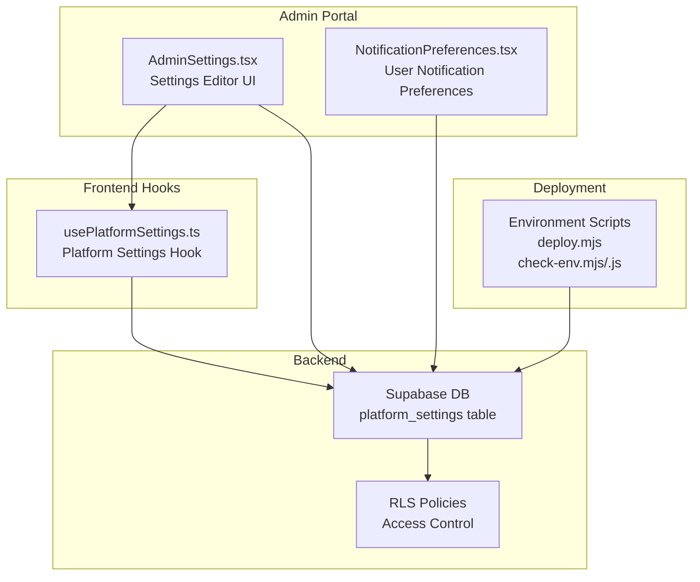
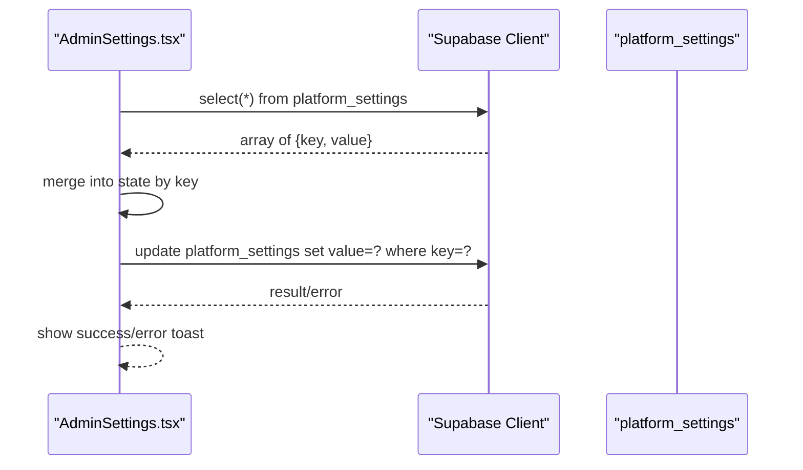
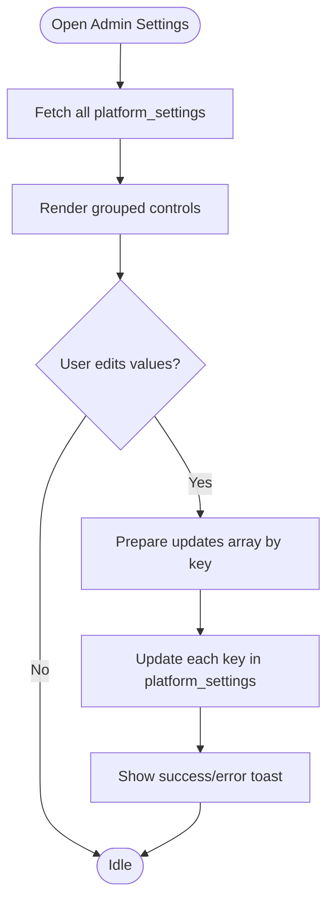
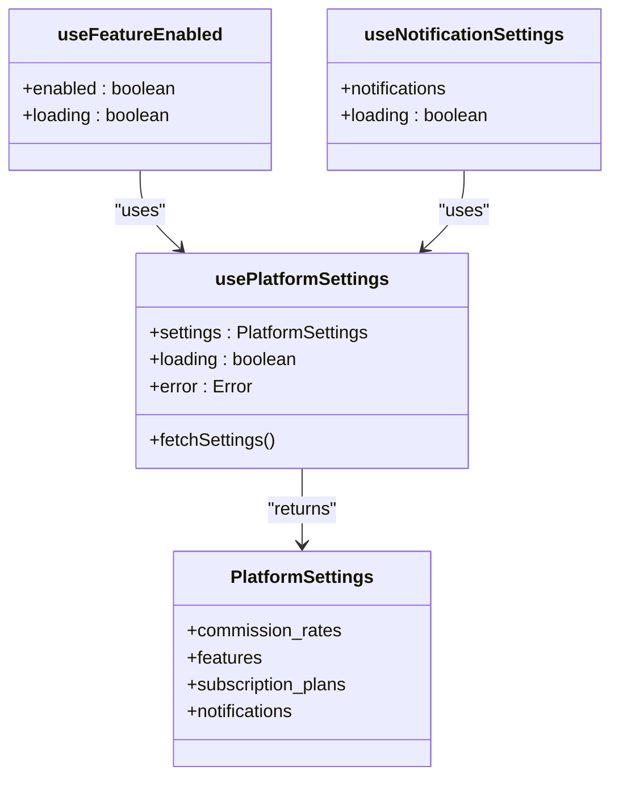
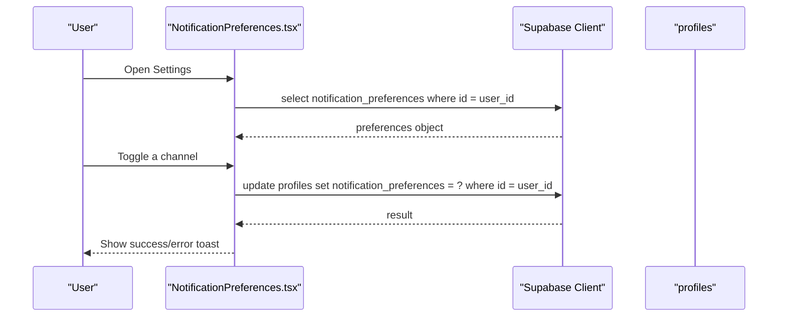
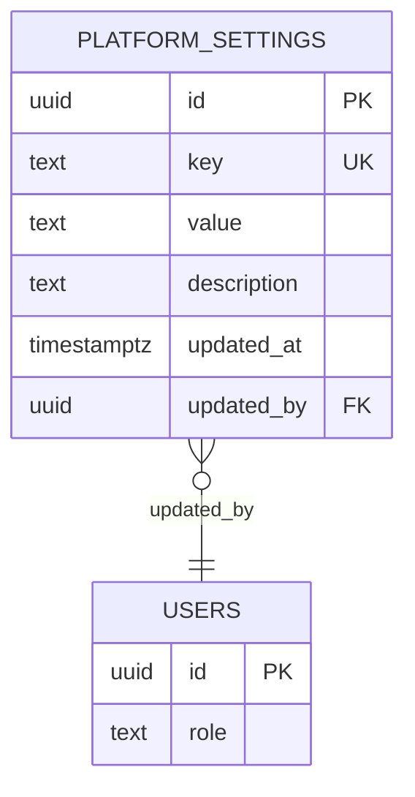
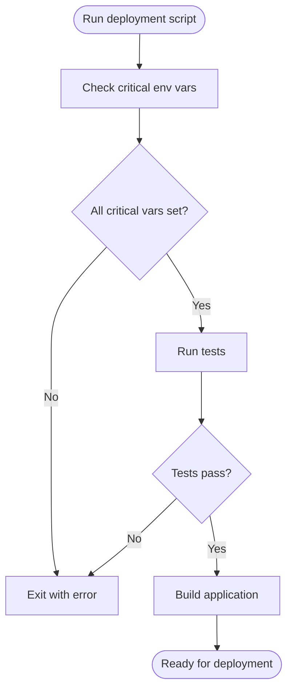
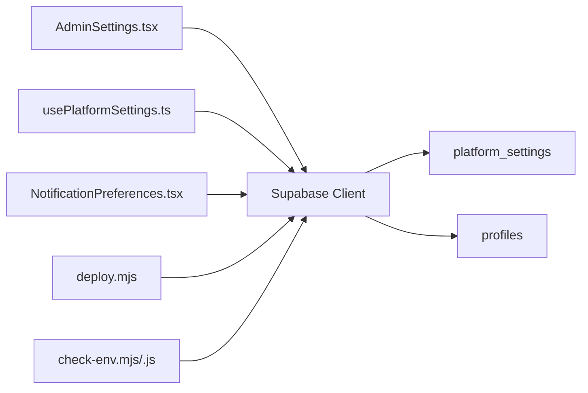

# Settings & Preferences

<cite>
**Referenced Files in This Document**
- [AdminSettings.tsx](file://src/pages/admin/AdminSettings.tsx)
- [usePlatformSettings.ts](file://src/hooks/usePlatformSettings.ts)
- [NotificationPreferences.tsx](file://src/components/NotificationPreferences.tsx)
- [20250220000006_create_admin_tables.sql](file://supabase/migrations/20250220000006_create_admin_tables.sql)
- [20260106092333_6e1a6787-965d-47ac-bad3-292ac9587964.sql](file://supabase/migrations/20260106092333_6e1a6787-965d-47ac-bad3-292ac9587964.sql)
- [20260106095014_671b8eb6-6504-4047-810a-ed12fb9b5394.sql](file://supabase/migrations/20260106095014_671b8eb6-6504-4047-810a-ed12fb9b5394.sql)
- [deploy.mjs](file://deploy.mjs)
- [check-env.mjs](file://check-env.mjs)
- [check-env.js](file://check-env.js)
- [package.json](file://package.json)
</cite>

## Table of Contents
1. [Introduction](#introduction)
2. [Project Structure](#project-structure)
3. [Core Components](#core-components)
4. [Architecture Overview](#architecture-overview)
5. [Detailed Component Analysis](#detailed-component-analysis)
6. [Dependency Analysis](#dependency-analysis)
7. [Performance Considerations](#performance-considerations)
8. [Troubleshooting Guide](#troubleshooting-guide)
9. [Conclusion](#conclusion)

## Introduction
This document describes the administrative settings and configuration system for the platform. It covers global settings management, feature toggles, system-wide preferences, platform customization options, operational parameters, and administrative workflow configuration. It also explains how settings integrate with environment-specific configuration and deployment management.

## Project Structure
The settings system spans three primary areas:
- Administrative UI for editing platform-wide settings
- Frontend hook for consuming platform settings across the app
- Backend storage via Supabase with row-level security policies
- Environment configuration and deployment scripts

**Diagram sources**
- [AdminSettings.tsx:174-253](file://src/pages/admin/AdminSettings.tsx#L174-L253)
- [usePlatformSettings.ts:50-113](file://src/hooks/usePlatformSettings.ts#L50-L113)
- [NotificationPreferences.tsx:51-83](file://src/components/NotificationPreferences.tsx#L51-L83)
- [20250220000006_create_admin_tables.sql:382-400](file://supabase/migrations/20250220000006_create_admin_tables.sql#L382-L400)
- [20260106092333_6e1a6787-965d-47ac-bad3-292ac9587964.sql:1-5](file://supabase/migrations/20260106092333_6e1a6787-965d-47ac-bad3-292ac9587964.sql#L1-L5)
- [20260106095014_671b8eb6-6504-4047-810a-ed12fb9b5394.sql:1-5](file://supabase/migrations/20260106095014_671b8eb6-6504-4047-810a-ed12fb9b5394.sql#L1-L5)
- [deploy.mjs:1-90](file://deploy.mjs#L1-L90)
- [check-env.mjs:1-51](file://check-env.mjs#L1-L51)
- [check-env.js:1-53](file://check-env.js#L1-L53)

**Section sources**
- [AdminSettings.tsx:1-1035](file://src/pages/admin/AdminSettings.tsx#L1-L1035)
- [usePlatformSettings.ts:1-125](file://src/hooks/usePlatformSettings.ts#L1-L125)
- [NotificationPreferences.tsx:45-197](file://src/components/NotificationPreferences.tsx#L45-L197)
- [20250220000006_create_admin_tables.sql:382-400](file://supabase/migrations/20250220000006_create_admin_tables.sql#L382-L400)
- [20260106092333_6e1a6787-965d-47ac-bad3-292ac9587964.sql:1-5](file://supabase/migrations/20260106092333_6e1a6787-965d-47ac-bad3-292ac9587964.sql#L1-L5)
- [20260106095014_671b8eb6-6504-4047-810a-ed12fb9b5394.sql:1-5](file://supabase/migrations/20260106095014_671b8eb6-6504-4047-810a-ed12fb9b5394.sql#L1-L5)
- [deploy.mjs:1-90](file://deploy.mjs#L1-L90)
- [check-env.mjs:1-51](file://check-env.mjs#L1-L51)
- [check-env.js:1-53](file://check-env.js#L1-L53)

## Core Components
- Administrative Settings Editor: A React page that loads, edits, and saves platform-wide settings to the backend.
- Platform Settings Hook: A React hook that fetches and merges settings with defaults for use across the app.
- Notification Preferences: A component allowing users to manage their own notification channels.
- Supabase Settings Storage: A dedicated table with row-level security policies governing who can view and edit settings.
- Environment and Deployment Scripts: Scripts that validate environment variables and orchestrate deployment readiness.

Key responsibilities:
- AdminSettings.tsx: Loads settings from the backend, renders grouped controls, and persists updates atomically by key.
- usePlatformSettings.ts: Provides a typed settings object merged from defaults and backend values, with helper hooks for features and notifications.
- NotificationPreferences.tsx: Manages user-specific notification preferences stored in profiles.
- Supabase migrations: Define the platform_settings table and policies for visibility and management.
- Environment scripts: Verify critical environment variables before building/deploying.

**Section sources**
- [AdminSettings.tsx:95-253](file://src/pages/admin/AdminSettings.tsx#L95-L253)
- [usePlatformSettings.ts:50-125](file://src/hooks/usePlatformSettings.ts#L50-L125)
- [NotificationPreferences.tsx:51-83](file://src/components/NotificationPreferences.tsx#L51-L83)
- [20250220000006_create_admin_tables.sql:382-400](file://supabase/migrations/20250220000006_create_admin_tables.sql#L382-L400)
- [deploy.mjs:1-90](file://deploy.mjs#L1-L90)

## Architecture Overview
The settings architecture follows a centralized storage pattern with controlled access:
- Settings are stored as key-value pairs in a single table.
- Row-level security policies define who can view and edit settings.
- The admin UI updates settings by key, while the frontend hook reads and merges settings with defaults.
- Environment scripts ensure required configuration exists prior to deployment.

**Diagram sources**
- [AdminSettings.tsx:178-253](file://src/pages/admin/AdminSettings.tsx#L178-L253)
- [20250220000006_create_admin_tables.sql:382-400](file://supabase/migrations/20250220000006_create_admin_tables.sql#L382-L400)

**Section sources**
- [AdminSettings.tsx:174-253](file://src/pages/admin/AdminSettings.tsx#L174-L253)
- [usePlatformSettings.ts:55-113](file://src/hooks/usePlatformSettings.ts#L55-L113)
- [20250220000006_create_admin_tables.sql:382-400](file://supabase/migrations/20250220000006_create_admin_tables.sql#L382-L400)

## Detailed Component Analysis

### Administrative Settings Editor (AdminSettings.tsx)
Responsibilities:
- Load all platform settings from the backend on mount.
- Render grouped configuration panels for:
  - Commission rates
  - Featured listing pricing tiers
  - Feature toggles
  - Delivery fee settings
  - Driver earnings configuration (global defaults and advanced features)
- Persist changes by updating each key individually.

Processing logic:
- Fetch all rows from platform_settings and map by key into local state.
- Save iterates through a predefined list of keys and performs an atomic update per key.
- Uses optimistic UI with loading and saving states and toast feedback.

Operational parameters:
- Commission rates: restaurant and delivery percentages.
- Featured listing prices: weekly, biweekly, monthly pricing tiers.
- Delivery fees: enable/disable flag, standard and express amounts, and free delivery threshold.
- Driver earnings: base earning per order, percentage of delivery fee, minimum payout threshold, and advanced features (distance tiers, city multipliers, restaurant-specific rates, time-based bonuses).

Administrative workflow:
- Admin navigates to the settings page, adjusts values, and clicks Save Changes.
- Updates are persisted one key at a time; the UI remains responsive during the operation.

**Diagram sources**
- [AdminSettings.tsx:174-253](file://src/pages/admin/AdminSettings.tsx#L174-L253)

**Section sources**
- [AdminSettings.tsx:95-800](file://src/pages/admin/AdminSettings.tsx#L95-L800)

### Platform Settings Hook (usePlatformSettings.ts)
Responsibilities:
- Fetch platform settings from the backend.
- Merge backend values with a strong default configuration.
- Expose settings, loading, and error states.
- Provide helper hooks for specific features and notifications.

Data model:
- Strongly typed PlatformSettings interface with nested objects for commission rates, feature flags, subscription plans, and notification preferences.
- Defaults serve as fallbacks when backend values are missing or undefined.

Behavior:
- On mount, fetches key/value pairs and merges into a normalized settings object.
- Helper hooks derive feature flags and notification settings for easy consumption.

**Diagram sources**
- [usePlatformSettings.ts:4-48](file://src/hooks/usePlatformSettings.ts#L4-L48)
- [usePlatformSettings.ts:50-125](file://src/hooks/usePlatformSettings.ts#L50-L125)

**Section sources**
- [usePlatformSettings.ts:50-125](file://src/hooks/usePlatformSettings.ts#L50-L125)

### Notification Preferences (NotificationPreferences.tsx)
Responsibilities:
- Fetch the current user’s notification preferences from their profile.
- Allow toggling of channels (email, push, SMS, WhatsApp) and persist changes back to the backend.
- Provide user feedback via toast notifications.

Data flow:
- Reads notification_preferences from profiles where user_id equals the current user.
- Updates the same record when a preference changes.

**Diagram sources**
- [NotificationPreferences.tsx:51-83](file://src/components/NotificationPreferences.tsx#L51-L83)

**Section sources**
- [NotificationPreferences.tsx:45-197](file://src/components/NotificationPreferences.tsx#L45-L197)

### Supabase Settings Storage and Policies
Storage:
- A single table stores key-value settings with metadata and audit fields.
- Row-level security policies control visibility and management.

Policies:
- Anyone can view platform settings (for feature flags and pricing display).
- Admins can manage platform settings (create, update, delete).
- Additional policies exist for related tables (e.g., subscription pricing visibility).

**Diagram sources**
- [20250220000006_create_admin_tables.sql:382-389](file://supabase/migrations/20250220000006_create_admin_tables.sql#L382-L389)

**Section sources**
- [20250220000006_create_admin_tables.sql:382-400](file://supabase/migrations/20250220000006_create_admin_tables.sql#L382-L400)
- [20260106092333_6e1a6787-965d-47ac-bad3-292ac9587964.sql:1-5](file://supabase/migrations/20260106092333_6e1a6787-965d-47ac-bad3-292ac9587964.sql#L1-L5)
- [20260106095014_671b8eb6-6504-4047-810a-ed12fb9b5394.sql:1-5](file://supabase/migrations/20260106095014_671b8eb6-6504-4047-810a-ed12fb9b5394.sql#L1-L5)

### Environment and Deployment Configuration
Environment scripts:
- Verify critical environment variables before building/deploying.
- Warn about optional variables (Sentry, PostHog) without failing the process.

Deployment script:
- Orchestrates environment checks, runs tests, builds the app, and prints next steps for pushing database changes and deploying to hosting.

**Diagram sources**
- [deploy.mjs:1-90](file://deploy.mjs#L1-L90)
- [check-env.mjs:1-51](file://check-env.mjs#L1-L51)
- [check-env.js:1-53](file://check-env.js#L1-L53)

**Section sources**
- [deploy.mjs:1-90](file://deploy.mjs#L1-L90)
- [check-env.mjs:1-51](file://check-env.mjs#L1-L51)
- [check-env.js:1-53](file://check-env.js#L1-L53)
- [package.json:7-42](file://package.json#L7-L42)

## Dependency Analysis
- AdminSettings.tsx depends on Supabase client to read/write platform_settings.
- usePlatformSettings.ts depends on Supabase client to read platform_settings and merges with defaults.
- NotificationPreferences.tsx depends on Supabase client to read/update profiles.notification_preferences.
- Supabase policies govern access to platform_settings and related tables.
- Environment scripts depend on filesystem and child process execution to validate and build the app.

**Diagram sources**
- [AdminSettings.tsx:10-11](file://src/pages/admin/AdminSettings.tsx#L10-L11)
- [usePlatformSettings.ts](file://src/hooks/usePlatformSettings.ts#L2)
- [NotificationPreferences.tsx:52-75](file://src/components/NotificationPreferences.tsx#L52-L75)
- [20250220000006_create_admin_tables.sql:382-389](file://supabase/migrations/20250220000006_create_admin_tables.sql#L382-L389)
- [deploy.mjs:6-84](file://deploy.mjs#L6-L84)
- [check-env.mjs:5-46](file://check-env.mjs#L5-L46)
- [check-env.js:7-44](file://check-env.js#L7-L44)

**Section sources**
- [AdminSettings.tsx:10-11](file://src/pages/admin/AdminSettings.tsx#L10-L11)
- [usePlatformSettings.ts](file://src/hooks/usePlatformSettings.ts#L2)
- [NotificationPreferences.tsx:52-75](file://src/components/NotificationPreferences.tsx#L52-L75)
- [20250220000006_create_admin_tables.sql:382-389](file://supabase/migrations/20250220000006_create_admin_tables.sql#L382-L389)
- [deploy.mjs:6-84](file://deploy.mjs#L6-L84)
- [check-env.mjs:5-46](file://check-env.mjs#L5-L46)
- [check-env.js:7-44](file://check-env.js#L7-L44)

## Performance Considerations
- Batched updates: The admin editor updates each key individually, which is acceptable for a small number of settings keys. For very large configurations, consider batching or partial updates.
- Defaults merging: The hook merges backend values with defaults on the client, reducing backend round trips but increasing initial render cost slightly. Keep the settings object compact.
- RLS overhead: Row-level security adds minimal overhead for simple policies; ensure indexes remain aligned with access patterns.
- Environment checks: Running tests and builds in deployment scripts ensures early failure detection, preventing wasted deployment attempts.

## Troubleshooting Guide
Common issues and resolutions:
- Settings fail to load:
  - Verify platform_settings table exists and RLS policy allows selection.
  - Confirm the Supabase client is initialized and authenticated.
- Save fails:
  - Check RLS policy for admin management permissions.
  - Inspect network requests for error responses.
- Notification preferences not updating:
  - Ensure the user is authenticated and the profiles record exists.
  - Confirm the notification_preferences field is present and writable.
- Deployment failures:
  - Review environment variable checks and ensure critical variables are set.
  - Run tests locally to catch regressions before deployment.

**Section sources**
- [20250220000006_create_admin_tables.sql:396-400](file://supabase/migrations/20250220000006_create_admin_tables.sql#L396-L400)
- [AdminSettings.tsx:215-253](file://src/pages/admin/AdminSettings.tsx#L215-L253)
- [NotificationPreferences.tsx:58-83](file://src/components/NotificationPreferences.tsx#L58-L83)
- [deploy.mjs:29-33](file://deploy.mjs#L29-L33)

## Conclusion
The settings and configuration system centers on a simple, maintainable key-value storage model with clear separation of concerns:
- Admins edit platform-wide settings via a dedicated UI.
- Frontend consumers access settings through a typed hook with sensible defaults.
- Supabase policies enforce appropriate access control.
- Environment scripts ensure configuration correctness before deployment.

This design supports rapid iteration on platform features, operational parameters, and administrative workflows while maintaining security and reliability.