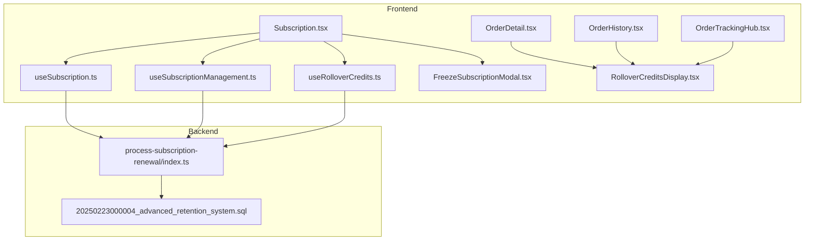
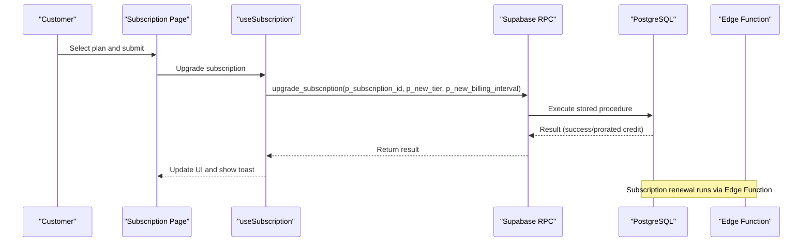
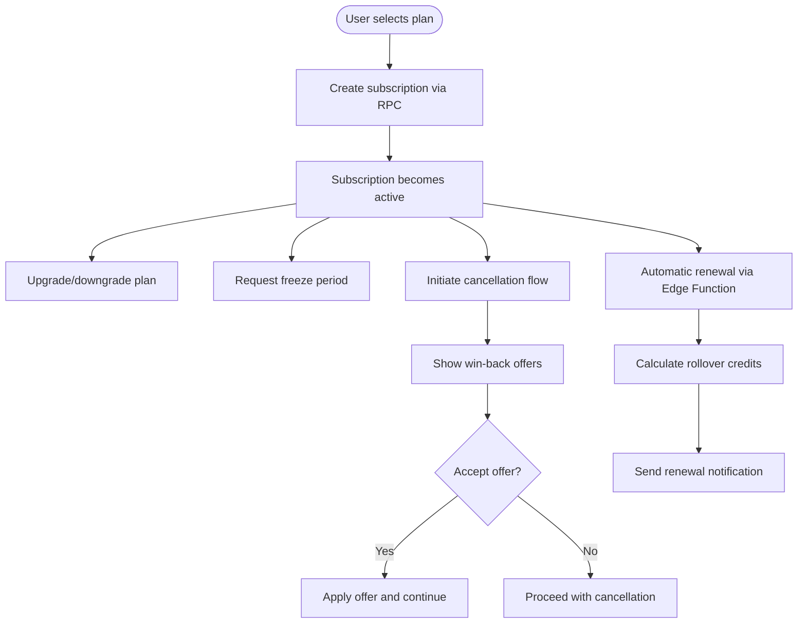
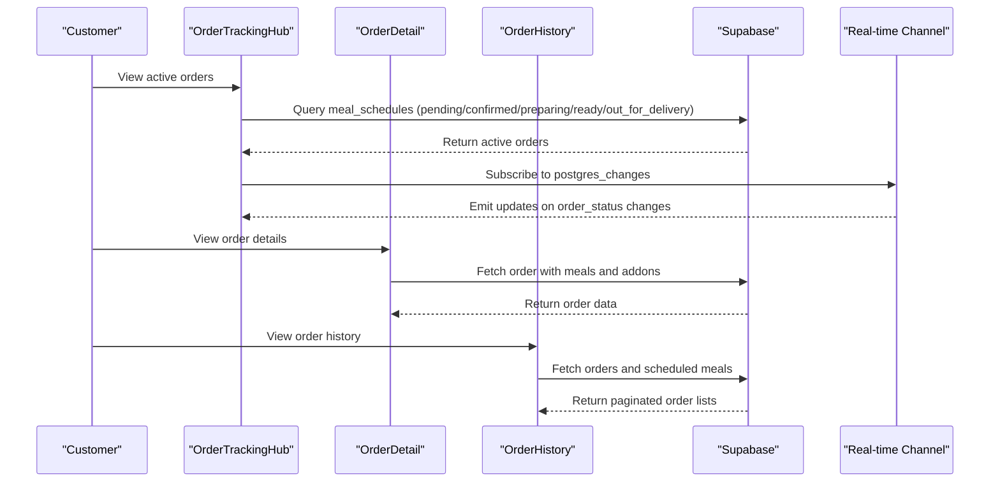
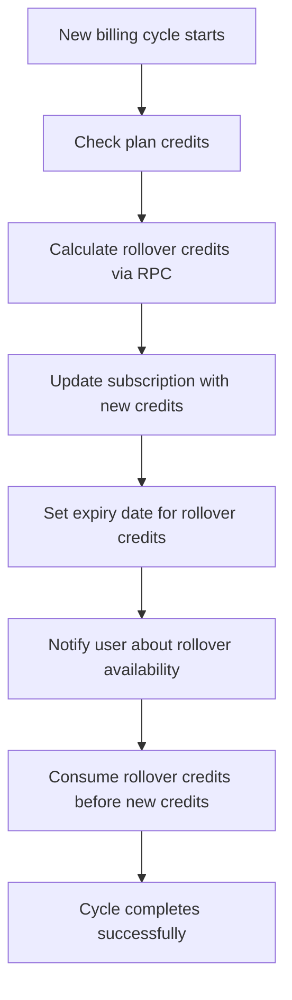
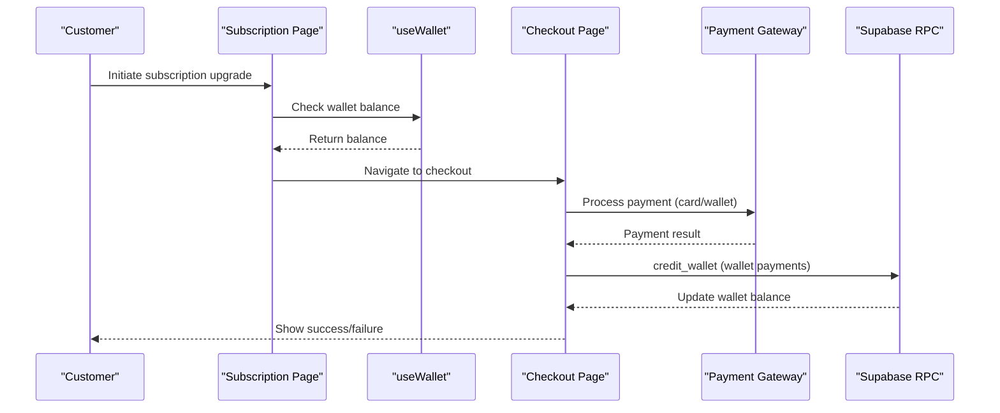
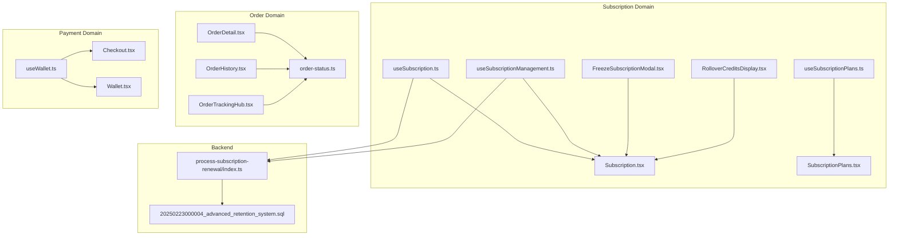

# Subscription & Orders Management

<cite>
**Referenced Files in This Document**
- [Subscription.tsx](file://src/pages/Subscription.tsx)
- [SubscriptionPlans.tsx](file://src/pages/subscription/SubscriptionPlans.tsx)
- [OrderDetail.tsx](file://src/pages/OrderDetail.tsx)
- [OrderHistory.tsx](file://src/pages/OrderHistory.tsx)
- [OrderTrackingHub.tsx](file://src/components/OrderTrackingHub.tsx)
- [useSubscription.ts](file://src/hooks/useSubscription.ts)
- [useSubscriptionManagement.ts](file://src/hooks/useSubscriptionManagement.ts)
- [useSubscriptionPlans.ts](file://src/hooks/useSubscriptionPlans.ts)
- [useRolloverCredits.ts](file://src/hooks/useRolloverCredits.ts)
- [useWallet.ts](file://src/hooks/useWallet.ts)
- [order-status.ts](file://src/lib/constants/order-status.ts)
- [FreezeSubscriptionModal.tsx](file://src/components/subscription/FreezeSubscriptionModal.tsx)
- [RolloverCreditsDisplay.tsx](file://src/components/subscription/RolloverCreditsDisplay.tsx)
- [process-subscription-renewal/index.ts](file://supabase/functions/process-subscription-renewal/index.ts)
- [20250223000004_advanced_retention_system.sql](file://supabase/migrations/20250223000004_advanced_retention_system.sql)
- [subscription-management.spec.ts](file://e2e/cross-portal/subscription-management.spec.ts)
- [Checkout.tsx](file://src/pages/Checkout.tsx)
- [Wallet.tsx](file://src/pages/Wallet.tsx)
</cite>

## Table of Contents
1. [Introduction](#introduction)
2. [Project Structure](#project-structure)
3. [Core Components](#core-components)
4. [Architecture Overview](#architecture-overview)
5. [Detailed Component Analysis](#detailed-component-analysis)
6. [Dependency Analysis](#dependency-analysis)
7. [Performance Considerations](#performance-considerations)
8. [Troubleshooting Guide](#troubleshooting-guide)
9. [Conclusion](#conclusion)

## Introduction
This document provides comprehensive technical documentation for the subscription and order management system. It covers subscription lifecycle management, order processing oversight, fulfillment monitoring, rollover credits, freeze functionality, and integration with payment systems. The system supports real-time order tracking, subscription renewal automation, and financial reporting capabilities through Supabase Edge Functions and PostgreSQL functions.

## Project Structure
The subscription and order management system spans frontend React components and hooks, backend Supabase Edge Functions, and database migrations:

- Frontend pages and components manage user-facing workflows for subscriptions, orders, and payments
- Hooks encapsulate business logic for subscription status, plan administration, and rollover credits
- Supabase Edge Functions automate subscription renewals, freeze requests, and rollover cleanup
- Database migrations define the schema for subscriptions, plans, rollover credits, and related entities

**Diagram sources**
- [Subscription.tsx:126-800](file://src/pages/Subscription.tsx#L126-L800)
- [OrderDetail.tsx:146-777](file://src/pages/OrderDetail.tsx#L146-L777)
- [OrderHistory.tsx:115-974](file://src/pages/OrderHistory.tsx#L115-L974)
- [OrderTrackingHub.tsx:689-859](file://src/components/OrderTrackingHub.tsx#L689-L859)
- [useSubscription.ts:42-264](file://src/hooks/useSubscription.ts#L42-L264)
- [useSubscriptionManagement.ts:48-396](file://src/hooks/useSubscriptionManagement.ts#L48-L396)
- [useRolloverCredits.ts:25-39](file://src/hooks/useRolloverCredits.ts#L25-L39)
- [FreezeSubscriptionModal.tsx:23-258](file://src/components/subscription/FreezeSubscriptionModal.tsx#L23-L258)
- [RolloverCreditsDisplay.tsx:20-132](file://src/components/subscription/RolloverCreditsDisplay.tsx#L20-L132)
- [process-subscription-renewal/index.ts:122-231](file://supabase/functions/process-subscription-renewal/index.ts#L122-L231)
- [20250223000004_advanced_retention_system.sql](file://supabase/migrations/20250223000004_advanced_retention_system.sql)

**Section sources**
- [Subscription.tsx:126-800](file://src/pages/Subscription.tsx#L126-L800)
- [OrderDetail.tsx:146-777](file://src/pages/OrderDetail.tsx#L146-L777)
- [OrderHistory.tsx:115-974](file://src/pages/OrderHistory.tsx#L115-L974)
- [OrderTrackingHub.tsx:689-859](file://src/components/OrderTrackingHub.tsx#L689-L859)
- [useSubscription.ts:42-264](file://src/hooks/useSubscription.ts#L42-L264)
- [useSubscriptionManagement.ts:48-396](file://src/hooks/useSubscriptionManagement.ts#L48-L396)
- [useRolloverCredits.ts:25-39](file://src/hooks/useRolloverCredits.ts#L25-L39)
- [FreezeSubscriptionModal.tsx:23-258](file://src/components/subscription/FreezeSubscriptionModal.tsx#L23-L258)
- [RolloverCreditsDisplay.tsx:20-132](file://src/components/subscription/RolloverCreditsDisplay.tsx#L20-L132)
- [process-subscription-renewal/index.ts:122-231](file://supabase/functions/process-subscription-renewal/index.ts#L122-L231)
- [20250223000004_advanced_retention_system.sql](file://supabase/migrations/20250223000004_advanced_retention_system.sql)

## Core Components
This section outlines the primary components responsible for subscription and order management:

- Subscription Management Page: Handles plan selection, upgrades, cancellations, and auto-renewal toggles
- Order Management Pages: Provide order history, detail view, and tracking hub for active orders
- Subscription Hooks: Encapsulate subscription status, plan administration, and rollover credit logic
- Subscription Components: Offer freeze modal and rollover credit display widgets
- Backend Automation: Uses Edge Functions for subscription renewal and rollover cleanup

Key responsibilities:
- Order status management with real-time updates and timeline visualization
- Subscription plan administration with annual billing and win-back offers
- Financial reporting via wallet transactions and payment records
- Integration with payment systems for subscription upgrades and wallet top-ups

**Section sources**
- [Subscription.tsx:126-800](file://src/pages/Subscription.tsx#L126-L800)
- [OrderDetail.tsx:146-777](file://src/pages/OrderDetail.tsx#L146-L777)
- [OrderHistory.tsx:115-974](file://src/pages/OrderHistory.tsx#L115-L974)
- [useSubscription.ts:42-264](file://src/hooks/useSubscription.ts#L42-L264)
- [useSubscriptionManagement.ts:48-396](file://src/hooks/useSubscriptionManagement.ts#L48-L396)
- [useRolloverCredits.ts:25-39](file://src/hooks/useRolloverCredits.ts#L25-L39)
- [FreezeSubscriptionModal.tsx:23-258](file://src/components/subscription/FreezeSubscriptionModal.tsx#L23-L258)
- [RolloverCreditsDisplay.tsx:20-132](file://src/components/subscription/RolloverCreditsDisplay.tsx#L20-L132)

## Architecture Overview
The system follows a layered architecture with clear separation between frontend, backend, and database concerns:

**Diagram sources**
- [Subscription.tsx:310-418](file://src/pages/Subscription.tsx#L310-L418)
- [useSubscription.ts:163-203](file://src/hooks/useSubscription.ts#L163-L203)
- [process-subscription-renewal/index.ts:122-231](file://supabase/functions/process-subscription-renewal/index.ts#L122-L231)

## Detailed Component Analysis

### Subscription Lifecycle Management
The subscription lifecycle encompasses creation, upgrades, cancellations, and renewals:

**Diagram sources**
- [useSubscriptionManagement.ts:118-330](file://src/hooks/useSubscriptionManagement.ts#L118-L330)
- [process-subscription-renewal/index.ts:122-231](file://supabase/functions/process-subscription-renewal/index.ts#L122-L231)

Key implementation details:
- Plan creation and upgrades use RPC functions with proration logic
- Win-back offers guide users through retention scenarios
- Freeze requests allow date-range scheduling with validation
- Renewal automation calculates rollover credits and notifies users

**Section sources**
- [useSubscriptionManagement.ts:48-396](file://src/hooks/useSubscriptionManagement.ts#L48-L396)
- [FreezeSubscriptionModal.tsx:23-258](file://src/components/subscription/FreezeSubscriptionModal.tsx#L23-L258)
- [process-subscription-renewal/index.ts:122-231](file://supabase/functions/process-subscription-renewal/index.ts#L122-L231)

### Order Processing Oversight
Order processing includes status management, real-time updates, and fulfillment monitoring:

**Diagram sources**
- [OrderTrackingHub.tsx:689-859](file://src/components/OrderTrackingHub.tsx#L689-L859)
- [OrderDetail.tsx:146-777](file://src/pages/OrderDetail.tsx#L146-L777)
- [OrderHistory.tsx:115-974](file://src/pages/OrderHistory.tsx#L115-L974)

Order status management features:
- Unified status definitions with customer-visible labels and descriptions
- Timeline visualization showing progression from pending to delivered
- Real-time updates via Supabase real-time channels
- Estimated arrival times and driver information for out-for-delivery orders

**Section sources**
- [order-status.ts:1-116](file://src/lib/constants/order-status.ts#L1-L116)
- [OrderTrackingHub.tsx:689-859](file://src/components/OrderTrackingHub.tsx#L689-L859)
- [OrderDetail.tsx:146-777](file://src/pages/OrderDetail.tsx#L146-L777)
- [OrderHistory.tsx:115-974](file://src/pages/OrderHistory.tsx#L115-L974)

### Subscription Renewal Tracking and Rollover Credits
Rollover credits provide bonus meals during subscription cycles:

**Diagram sources**
- [process-subscription-renewal/index.ts:194-231](file://supabase/functions/process-subscription-renewal/index.ts#L194-L231)
- [useRolloverCredits.ts:25-39](file://src/hooks/useRolloverCredits.ts#L25-L39)
- [RolloverCreditsDisplay.tsx:20-132](file://src/components/subscription/RolloverCreditsDisplay.tsx#L20-L132)

Rollover functionality:
- Automatic calculation during renewal cycles
- Expiry countdown and visual indicators
- Priority consumption over new credits
- Detailed breakdown for checkout/order flows

**Section sources**
- [process-subscription-renewal/index.ts:122-231](file://supabase/functions/process-subscription-renewal/index.ts#L122-L231)
- [useRolloverCredits.ts:25-39](file://src/hooks/useRolloverCredits.ts#L25-L39)
- [RolloverCreditsDisplay.tsx:20-132](file://src/components/subscription/RolloverCreditsDisplay.tsx#L20-L132)

### Financial Reporting and Payment Integration
Financial reporting and payment integration enable seamless subscription upgrades and wallet transactions:

**Diagram sources**
- [Subscription.tsx:310-418](file://src/pages/Subscription.tsx#L310-L418)
- [useWallet.ts:1-54](file://src/hooks/useWallet.ts#L1-L54)
- [Checkout.tsx:17-70](file://src/pages/Checkout.tsx#L17-L70)
- [Wallet.tsx:76-116](file://src/pages/Wallet.tsx#L76-L116)

Payment and reporting features:
- Wallet balance checks before subscription upgrades
- Atomic payment processing for wallet top-ups
- Transaction records for refunds, bonuses, and cashbacks
- Payment method selection with simulated payment flows

**Section sources**
- [Subscription.tsx:310-418](file://src/pages/Subscription.tsx#L310-L418)
- [useWallet.ts:1-54](file://src/hooks/useWallet.ts#L1-L54)
- [Checkout.tsx:17-70](file://src/pages/Checkout.tsx#L17-L70)
- [Wallet.tsx:76-116](file://src/pages/Wallet.tsx#L76-L116)

## Dependency Analysis
The system exhibits strong cohesion within functional areas and clear separation of concerns:

**Diagram sources**
- [useSubscription.ts:42-264](file://src/hooks/useSubscription.ts#L42-L264)
- [useSubscriptionManagement.ts:48-396](file://src/hooks/useSubscriptionManagement.ts#L48-L396)
- [useSubscriptionPlans.ts:28-84](file://src/hooks/useSubscriptionPlans.ts#L28-L84)
- [Subscription.tsx:126-800](file://src/pages/Subscription.tsx#L126-L800)
- [SubscriptionPlans.tsx:12-306](file://src/pages/subscription/SubscriptionPlans.tsx#L12-L306)
- [FreezeSubscriptionModal.tsx:23-258](file://src/components/subscription/FreezeSubscriptionModal.tsx#L23-L258)
- [RolloverCreditsDisplay.tsx:20-132](file://src/components/subscription/RolloverCreditsDisplay.tsx#L20-L132)
- [OrderDetail.tsx:146-777](file://src/pages/OrderDetail.tsx#L146-L777)
- [OrderHistory.tsx:115-974](file://src/pages/OrderHistory.tsx#L115-L974)
- [OrderTrackingHub.tsx:689-859](file://src/components/OrderTrackingHub.tsx#L689-L859)
- [order-status.ts:1-116](file://src/lib/constants/order-status.ts#L1-L116)
- [useWallet.ts:1-54](file://src/hooks/useWallet.ts#L1-L54)
- [Checkout.tsx:17-70](file://src/pages/Checkout.tsx#L17-L70)
- [Wallet.tsx:76-116](file://src/pages/Wallet.tsx#L76-L116)
- [process-subscription-renewal/index.ts:122-231](file://supabase/functions/process-subscription-renewal/index.ts#L122-L231)
- [20250223000004_advanced_retention_system.sql](file://supabase/migrations/20250223000004_advanced_retention_system.sql)

## Performance Considerations
- Real-time channels minimize polling overhead for order status updates
- Pagination in order history reduces initial load times
- Client-side caching via React Query optimizes subscription and plan data retrieval
- Edge Functions handle heavy computations asynchronously to keep the UI responsive
- Database indexing on frequently queried fields (user_id, status, scheduled_date) improves query performance

## Troubleshooting Guide
Common issues and resolutions:
- Subscription upgrade failures: Verify wallet balance and payment method selection
- Order status not updating: Check real-time channel subscriptions and network connectivity
- Rollover credit display shows zero: Confirm database columns exist and Edge Function executed
- Freeze request validation errors: Ensure selected date range respects remaining freeze days
- Payment processing errors: Review gateway responses and retry logic in checkout flow

**Section sources**
- [Subscription.tsx:310-418](file://src/pages/Subscription.tsx#L310-L418)
- [OrderDetail.tsx:146-777](file://src/pages/OrderDetail.tsx#L146-L777)
- [useRolloverCredits.ts:25-39](file://src/hooks/useRolloverCredits.ts#L25-L39)
- [FreezeSubscriptionModal.tsx:23-258](file://src/components/subscription/FreezeSubscriptionModal.tsx#L23-L258)
- [Checkout.tsx:17-70](file://src/pages/Checkout.tsx#L17-L70)

## Conclusion
The subscription and order management system provides a robust foundation for customer engagement through flexible subscription plans, real-time order tracking, automated renewal processes, and integrated payment solutions. The modular architecture ensures maintainability while supporting future enhancements such as advanced analytics and expanded subscription features.