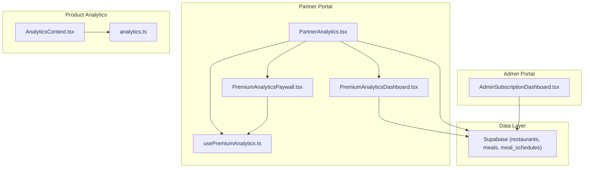
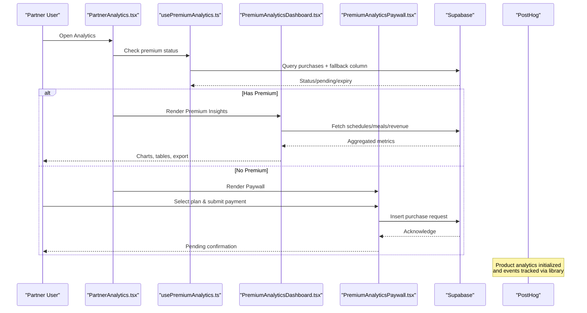
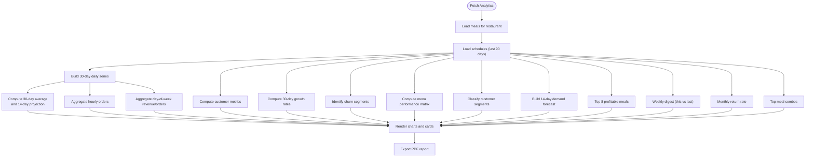
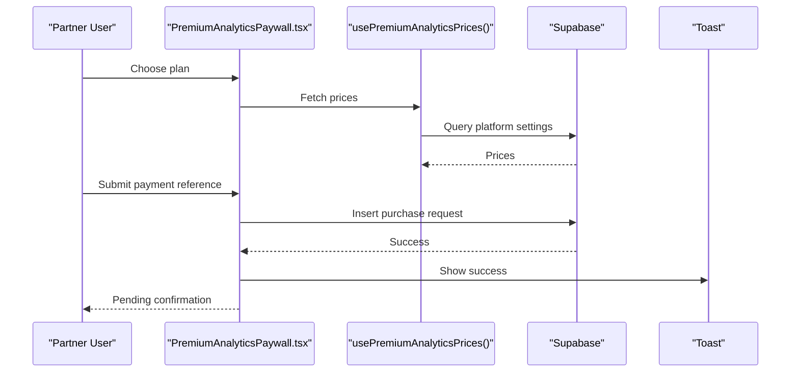
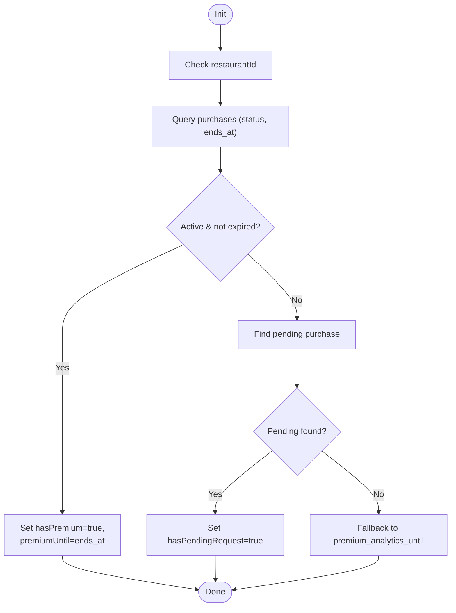
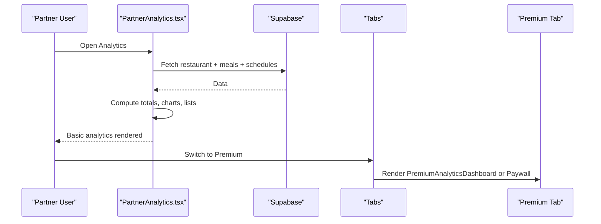
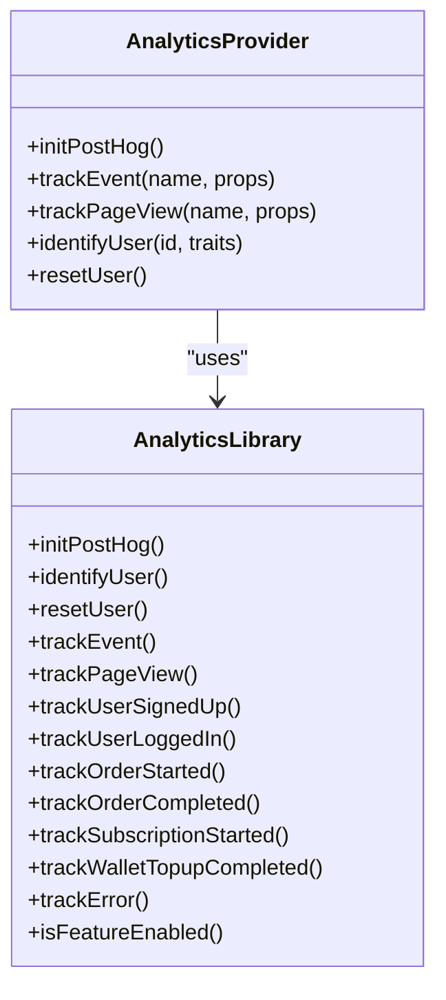
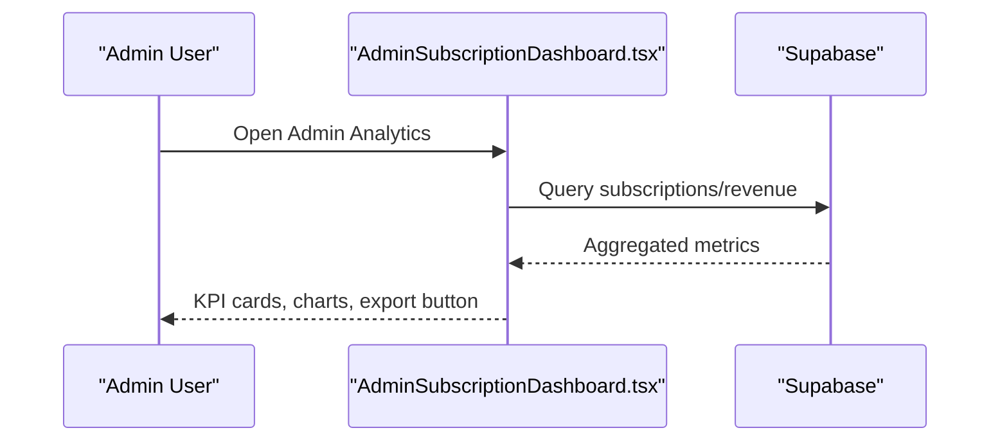
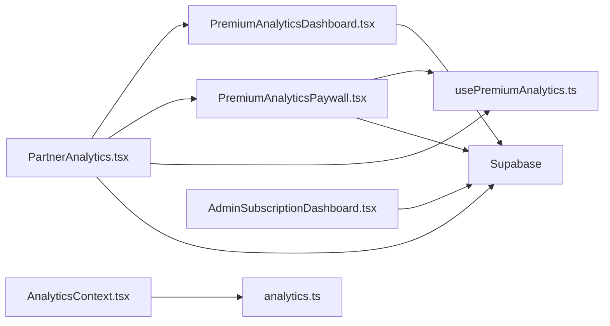

# System Analytics

<cite>
**Referenced Files in This Document**
- [PremiumAnalyticsDashboard.tsx](file://src/components/PremiumAnalyticsDashboard.tsx)
- [PremiumAnalyticsPaywall.tsx](file://src/components/PremiumAnalyticsPaywall.tsx)
- [usePremiumAnalytics.ts](file://src/hooks/usePremiumAnalytics.ts)
- [PartnerAnalytics.tsx](file://src/pages/partner/PartnerAnalytics.tsx)
- [analytics.ts](file://src/lib/analytics.ts)
- [AnalyticsContext.tsx](file://src/contexts/AnalyticsContext.tsx)
- [AdminSubscriptionDashboard.tsx](file://src/pages/admin/AdminSubscriptionDashboard.tsx)
- [analytics.spec.ts](file://e2e/admin/analytics.spec.ts)
</cite>

## Table of Contents
1. [Introduction](#introduction)
2. [Project Structure](#project-structure)
3. [Core Components](#core-components)
4. [Architecture Overview](#architecture-overview)
5. [Detailed Component Analysis](#detailed-component-analysis)
6. [Dependency Analysis](#dependency-analysis)
7. [Performance Considerations](#performance-considerations)
8. [Troubleshooting Guide](#troubleshooting-guide)
9. [Conclusion](#conclusion)

## Introduction
This document explains the system analytics and reporting capabilities, focusing on the Premium Analytics dashboard, retention analytics, and premium analytics features. It covers data visualization components, business intelligence reports, performance metrics tracking, user engagement analytics, subscription analytics, revenue tracking, and the premium analytics paywall for administrators. The goal is to help both technical and non-technical stakeholders understand how analytics data is collected, processed, visualized, and monetized.

## Project Structure
The analytics system spans several layers:
- UI components for displaying analytics and paywalls
- Hooks for managing premium analytics status and pricing
- Supabase queries for retrieving and aggregating data
- PostHog integration for product analytics and event tracking
- Admin-facing dashboards for subscription and revenue insights

**Diagram sources**
- [PartnerAnalytics.tsx:51-436](file://src/pages/partner/PartnerAnalytics.tsx#L51-L436)
- [PremiumAnalyticsDashboard.tsx:147-183](file://src/components/PremiumAnalyticsDashboard.tsx#L147-L183)
- [PremiumAnalyticsPaywall.tsx:147-177](file://src/components/PremiumAnalyticsPaywall.tsx#L147-L177)
- [usePremiumAnalytics.ts:16-81](file://src/hooks/usePremiumAnalytics.ts#L16-L81)
- [AnalyticsContext.tsx:22-38](file://src/contexts/AnalyticsContext.tsx#L22-L38)
- [analytics.ts:3-35](file://src/lib/analytics.ts#L3-L35)
- [AdminSubscriptionDashboard.tsx:197-229](file://src/pages/admin/AdminSubscriptionDashboard.tsx#L197-L229)

**Section sources**
- [PartnerAnalytics.tsx:51-436](file://src/pages/partner/PartnerAnalytics.tsx#L51-L436)
- [PremiumAnalyticsDashboard.tsx:147-183](file://src/components/PremiumAnalyticsDashboard.tsx#L147-L183)
- [PremiumAnalyticsPaywall.tsx:147-177](file://src/components/PremiumAnalyticsPaywall.tsx#L147-L177)
- [usePremiumAnalytics.ts:16-81](file://src/hooks/usePremiumAnalytics.ts#L16-L81)
- [AnalyticsContext.tsx:22-38](file://src/contexts/AnalyticsContext.tsx#L22-L38)
- [analytics.ts:3-35](file://src/lib/analytics.ts#L3-L35)
- [AdminSubscriptionDashboard.tsx:197-229](file://src/pages/admin/AdminSubscriptionDashboard.tsx#L197-L229)

## Core Components
- Premium Analytics Dashboard: Aggregates and visualizes advanced metrics including revenue trends, customer retention, churn alerts, menu performance, profitability, demand forecasting, and exportable reports.
- Premium Analytics Paywall: Manages subscription flow, displays feature comparisons, handles pricing, and records purchase requests.
- Premium Analytics Hooks: Determine access status, expiration, and pending requests; fetch pricing from platform settings.
- Partner Analytics Page: Renders basic analytics and exposes a tabbed interface to Premium Insights.
- Product Analytics Library and Provider: Initialize PostHog, identify users, track events, and expose tracking utilities.
- Admin Subscription Dashboard: Presents subscription and revenue KPIs for administrative oversight.

**Section sources**
- [PremiumAnalyticsDashboard.tsx:147-183](file://src/components/PremiumAnalyticsDashboard.tsx#L147-L183)
- [PremiumAnalyticsPaywall.tsx:147-177](file://src/components/PremiumAnalyticsPaywall.tsx#L147-L177)
- [usePremiumAnalytics.ts:16-81](file://src/hooks/usePremiumAnalytics.ts#L16-L81)
- [PartnerAnalytics.tsx:210-431](file://src/pages/partner/PartnerAnalytics.tsx#L210-L431)
- [analytics.ts:3-35](file://src/lib/analytics.ts#L3-L35)
- [AnalyticsContext.tsx:22-38](file://src/contexts/AnalyticsContext.tsx#L22-L38)
- [AdminSubscriptionDashboard.tsx:197-229](file://src/pages/admin/AdminSubscriptionDashboard.tsx#L197-L229)

## Architecture Overview
The analytics architecture integrates UI components with Supabase-backed data retrieval and optional product analytics via PostHog. Premium access is controlled by purchase records and platform settings.

**Diagram sources**
- [PartnerAnalytics.tsx:68-68](file://src/pages/partner/PartnerAnalytics.tsx#L68-L68)
- [usePremiumAnalytics.ts:30-78](file://src/hooks/usePremiumAnalytics.ts#L30-L78)
- [PremiumAnalyticsDashboard.tsx:185-526](file://src/components/PremiumAnalyticsDashboard.tsx#L185-L526)
- [PremiumAnalyticsPaywall.tsx:179-213](file://src/components/PremiumAnalyticsPaywall.tsx#L179-L213)
- [analytics.ts:3-35](file://src/lib/analytics.ts#L3-L35)

## Detailed Component Analysis

### Premium Analytics Dashboard
The dashboard computes and visualizes:
- 30-day revenue trend with 14-day projection
- Hourly and day-of-week order distributions
- Customer metrics (repeat rate, average orders per customer)
- Growth metrics (revenue, orders, customers)
- Revenue forecast based on 30-day average
- Churn alert counts (at-risk, likely lost, lost)
- Menu performance matrix (Top Seller, High Value, Growing, Needs Attention)
- Customer segmentation (Champions, Loyal, At Risk, Inactive)
- 14-day demand forecast calendar
- Profitability report (top meals by net revenue)
- Weekly performance digest (this vs last week)
- Monthly return rate and churn insights
- Meal combo patterns (top pairings)

**Diagram sources**
- [PremiumAnalyticsDashboard.tsx:185-526](file://src/components/PremiumAnalyticsDashboard.tsx#L185-L526)

**Section sources**
- [PremiumAnalyticsDashboard.tsx:147-183](file://src/components/PremiumAnalyticsDashboard.tsx#L147-L183)
- [PremiumAnalyticsDashboard.tsx:185-526](file://src/components/PremiumAnalyticsDashboard.tsx#L185-L526)

### Premium Analytics Paywall
The paywall manages:
- Feature comparison table highlighting differences between Basic and Premium
- Pricing tiers (monthly, quarterly, yearly) with calculated savings
- Bank transfer instructions and payment reference collection
- Pending request state with review notice
- Submission of purchase requests linked to restaurant and partner

**Diagram sources**
- [PremiumAnalyticsPaywall.tsx:179-213](file://src/components/PremiumAnalyticsPaywall.tsx#L179-L213)
- [usePremiumAnalytics.ts:83-117](file://src/hooks/usePremiumAnalytics.ts#L83-L117)

**Section sources**
- [PremiumAnalyticsPaywall.tsx:147-177](file://src/components/PremiumAnalyticsPaywall.tsx#L147-L177)
- [PremiumAnalyticsPaywall.tsx:179-213](file://src/components/PremiumAnalyticsPaywall.tsx#L179-L213)
- [usePremiumAnalytics.ts:83-117](file://src/hooks/usePremiumAnalytics.ts#L83-L117)

### Premium Analytics Hooks
The hooks provide:
- Premium status detection using purchase records and optional fallback column
- Pending request detection
- Loading states
- Price fetching from platform settings with defaults

**Diagram sources**
- [usePremiumAnalytics.ts:30-78](file://src/hooks/usePremiumAnalytics.ts#L30-L78)

**Section sources**
- [usePremiumAnalytics.ts:16-81](file://src/hooks/usePremiumAnalytics.ts#L16-L81)
- [usePremiumAnalytics.ts:83-117](file://src/hooks/usePremiumAnalytics.ts#L83-L117)

### Partner Analytics Page
The page orchestrates:
- Loading basic analytics (orders, revenue, AOV, unique customers)
- Rendering charts for revenue and orders (last 7 days)
- Displaying top meals and meal type distribution
- Switching to Premium Insights tab when eligible

**Diagram sources**
- [PartnerAnalytics.tsx:76-191](file://src/pages/partner/PartnerAnalytics.tsx#L76-L191)
- [PartnerAnalytics.tsx:404-431](file://src/pages/partner/PartnerAnalytics.tsx#L404-L431)

**Section sources**
- [PartnerAnalytics.tsx:51-436](file://src/pages/partner/PartnerAnalytics.tsx#L51-L436)

### Product Analytics Library and Provider
The provider initializes PostHog in production, identifies users, tracks events, and exposes helpers for common actions. It also sanitizes sensitive properties and supports feature flags.

**Diagram sources**
- [AnalyticsContext.tsx:22-38](file://src/contexts/AnalyticsContext.tsx#L22-L38)
- [analytics.ts:3-35](file://src/lib/analytics.ts#L3-L35)
- [analytics.ts:79-144](file://src/lib/analytics.ts#L79-L144)

**Section sources**
- [AnalyticsContext.tsx:22-38](file://src/contexts/AnalyticsContext.tsx#L22-L38)
- [analytics.ts:3-35](file://src/lib/analytics.ts#L3-L35)
- [analytics.ts:79-144](file://src/lib/analytics.ts#L79-L144)

### Admin Subscription Dashboard
The admin dashboard presents subscription and revenue KPIs, date range controls, and export functionality for administrative reporting.

**Diagram sources**
- [AdminSubscriptionDashboard.tsx:197-229](file://src/pages/admin/AdminSubscriptionDashboard.tsx#L197-L229)

**Section sources**
- [AdminSubscriptionDashboard.tsx:197-229](file://src/pages/admin/AdminSubscriptionDashboard.tsx#L197-L229)

## Dependency Analysis
- UI components depend on Supabase for data retrieval and on hooks for access control.
- Premium dashboard depends on Recharts for visualization and on currency formatting utilities.
- Paywall depends on platform settings for pricing and on toast notifications for feedback.
- Product analytics depends on PostHog SDK and environment configuration.
- Admin dashboard depends on Supabase for subscription and revenue metrics.

**Diagram sources**
- [PartnerAnalytics.tsx:51-436](file://src/pages/partner/PartnerAnalytics.tsx#L51-L436)
- [PremiumAnalyticsDashboard.tsx:147-183](file://src/components/PremiumAnalyticsDashboard.tsx#L147-L183)
- [PremiumAnalyticsPaywall.tsx:147-177](file://src/components/PremiumAnalyticsPaywall.tsx#L147-L177)
- [usePremiumAnalytics.ts:16-81](file://src/hooks/usePremiumAnalytics.ts#L16-L81)
- [AnalyticsContext.tsx:22-38](file://src/contexts/AnalyticsContext.tsx#L22-L38)
- [analytics.ts:3-35](file://src/lib/analytics.ts#L3-L35)
- [AdminSubscriptionDashboard.tsx:197-229](file://src/pages/admin/AdminSubscriptionDashboard.tsx#L197-L229)

**Section sources**
- [PartnerAnalytics.tsx:51-436](file://src/pages/partner/PartnerAnalytics.tsx#L51-L436)
- [PremiumAnalyticsDashboard.tsx:147-183](file://src/components/PremiumAnalyticsDashboard.tsx#L147-L183)
- [PremiumAnalyticsPaywall.tsx:147-177](file://src/components/PremiumAnalyticsPaywall.tsx#L147-L177)
- [usePremiumAnalytics.ts:16-81](file://src/hooks/usePremiumAnalytics.ts#L16-L81)
- [AnalyticsContext.tsx:22-38](file://src/contexts/AnalyticsContext.tsx#L22-L38)
- [analytics.ts:3-35](file://src/lib/analytics.ts#L3-L35)
- [AdminSubscriptionDashboard.tsx:197-229](file://src/pages/admin/AdminSubscriptionDashboard.tsx#L197-L229)

## Performance Considerations
- Data aggregation is bounded to recent periods (e.g., last 90 days) to limit query volume.
- Charts render responsive containers to adapt to screen sizes efficiently.
- Currency formatting and localized date formatting reduce rendering overhead.
- Purchase status checks leverage indexed columns and limits to minimize latency.
- PostHog initialization is guarded by environment checks to avoid unnecessary overhead in development.

[No sources needed since this section provides general guidance]

## Troubleshooting Guide
Common issues and resolutions:
- Premium status not activating: Verify purchase records and ensure ends_at is in the future; check fallback column if migration is incomplete.
- Missing premium features: Confirm platform settings for pricing are present; otherwise defaults apply.
- Payment submission errors: Validate bank transfer details and ensure payment reference is recorded; retry submission after correcting reference.
- Analytics data missing: Confirm restaurant has associated meals and schedules within the selected date range.
- PostHog not capturing events: Ensure API key is configured and environment is production.

**Section sources**
- [usePremiumAnalytics.ts:30-78](file://src/hooks/usePremiumAnalytics.ts#L30-L78)
- [PremiumAnalyticsPaywall.tsx:179-213](file://src/components/PremiumAnalyticsPaywall.tsx#L179-L213)
- [analytics.ts:3-35](file://src/lib/analytics.ts#L3-L35)

## Conclusion
The system provides a robust analytics foundation with clear pathways from raw scheduling data to actionable insights. The Premium Analytics dashboard elevates reporting with advanced visualizations and exportable summaries, while the paywall enables monetization through transparent pricing and streamlined purchase workflows. Product analytics via PostHog complements operational dashboards, and admin views consolidate subscription and revenue metrics for strategic oversight.