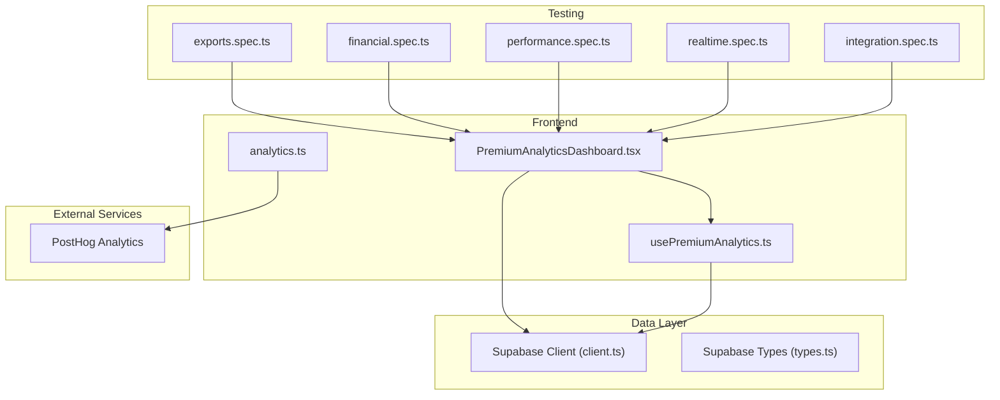
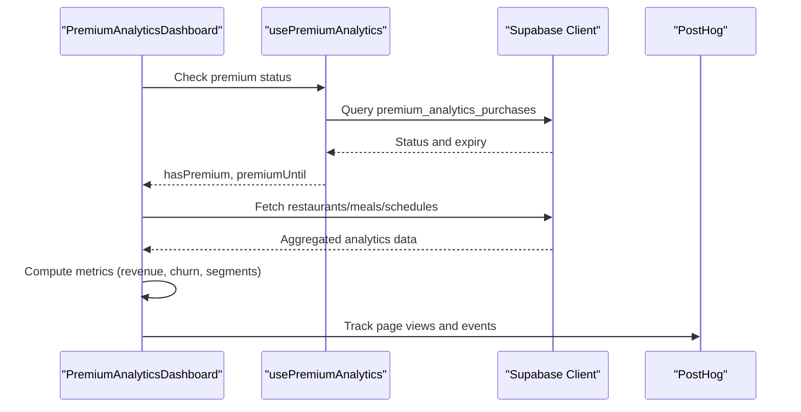
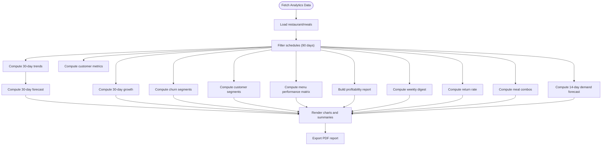
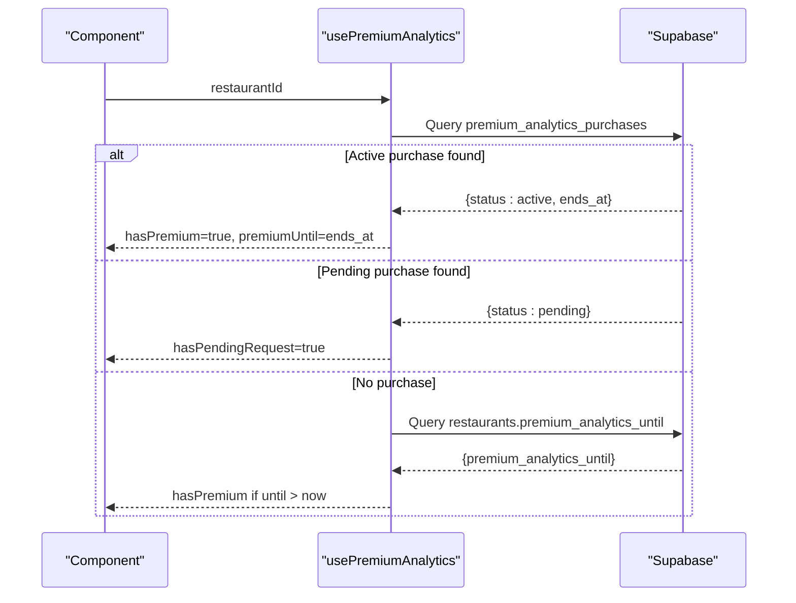
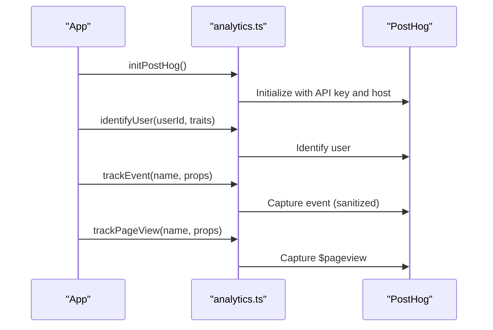
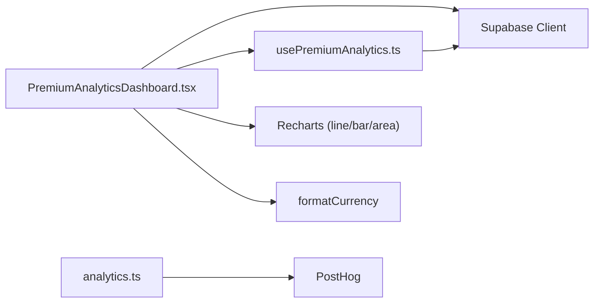

# System Monitoring & Analytics

<cite>
**Referenced Files in This Document**
- [PremiumAnalyticsDashboard.tsx](file://src/components/PremiumAnalyticsDashboard.tsx)
- [usePremiumAnalytics.ts](file://src/hooks/usePremiumAnalytics.ts)
- [analytics.ts](file://src/lib/analytics.ts)
- [client.ts](file://src/integrations/supabase/client.ts)
- [types.ts](file://supabase/types.ts)
- [exports.spec.ts](file://e2e/admin/exports.spec.ts)
- [financial.spec.ts](file://e2e/system/financial.spec.ts)
- [performance.spec.ts](file://e2e/system/performance.spec.ts)
- [realtime.spec.ts](file://e2e/system/realtime.spec.ts)
- [integration.spec.ts](file://e2e/system/integration.spec.ts)
</cite>

## Table of Contents
1. [Introduction](#introduction)
2. [Project Structure](#project-structure)
3. [Core Components](#core-components)
4. [Architecture Overview](#architecture-overview)
5. [Detailed Component Analysis](#detailed-component-analysis)
6. [Dependency Analysis](#dependency-analysis)
7. [Performance Considerations](#performance-considerations)
8. [Troubleshooting Guide](#troubleshooting-guide)
9. [Conclusion](#conclusion)
10. [Appendices](#appendices)

## Introduction
This document explains the system monitoring and analytics capabilities across three primary domains:
- Business analytics dashboard: revenue streams, subscription analytics, retention metrics, and customer lifetime value calculations
- Financial reporting: income tracking, expense monitoring, and profit analysis
- Retention analytics: churn risk detection and engagement pattern analysis
It also covers premium analytics features for advanced insights and trend analysis, report generation and export workflows, integration with external analytics platforms, and real-time performance monitoring.

## Project Structure
The analytics stack spans frontend React components, hooks for premium access control, Supabase integration, and PostHog analytics instrumentation. End-to-end tests validate export workflows, financial integrity, performance, real-time behavior, and system integration.

**Diagram sources**
- [PremiumAnalyticsDashboard.tsx:1-1443](file://src/components/PremiumAnalyticsDashboard.tsx#L1-L1443)
- [usePremiumAnalytics.ts:1-118](file://src/hooks/usePremiumAnalytics.ts#L1-L118)
- [analytics.ts:1-170](file://src/lib/analytics.ts#L1-L170)
- [client.ts](file://src/integrations/supabase/client.ts)
- [types.ts](file://supabase/types.ts)

**Section sources**
- [PremiumAnalyticsDashboard.tsx:1-1443](file://src/components/PremiumAnalyticsDashboard.tsx#L1-L1443)
- [usePremiumAnalytics.ts:1-118](file://src/hooks/usePremiumAnalytics.ts#L1-L118)
- [analytics.ts:1-170](file://src/lib/analytics.ts#L1-L170)

## Core Components
- PremiumAnalyticsDashboard: Renders advanced business insights, including revenue trends, forecasting, customer retention, menu performance, profitability, and demand forecasts. It aggregates data from Supabase and presents it via charts and summary cards.
- usePremiumAnalytics: Manages premium subscription status, expiration dates, and pricing retrieval from Supabase, enabling access control to premium features.
- analytics.ts: Initializes PostHog for event tracking, user identification, and page view capture, with sanitization and environment gating.

**Section sources**
- [PremiumAnalyticsDashboard.tsx:147-526](file://src/components/PremiumAnalyticsDashboard.tsx#L147-L526)
- [usePremiumAnalytics.ts:16-81](file://src/hooks/usePremiumAnalytics.ts#L16-L81)
- [analytics.ts:3-35](file://src/lib/analytics.ts#L3-L35)

## Architecture Overview
The analytics architecture integrates frontend dashboards with Supabase for data retrieval and PostHog for behavioral analytics. Premium access is enforced via Supabase checks, while financial and retention metrics are computed client-side from scheduled meal data.

**Diagram sources**
- [PremiumAnalyticsDashboard.tsx:185-526](file://src/components/PremiumAnalyticsDashboard.tsx#L185-L526)
- [usePremiumAnalytics.ts:30-78](file://src/hooks/usePremiumAnalytics.ts#L30-L78)
- [analytics.ts:71-76](file://src/lib/analytics.ts#L71-L76)

## Detailed Component Analysis

### Premium Analytics Dashboard
The dashboard computes and visualizes:
- Revenue trends and 30-day growth
- Revenue forecast based on daily averages
- Customer metrics (repeat rate, average orders per customer)
- Churn segmentation (at-risk, likely lost, lost)
- Customer segments (champions, loyal, at-risk, inactive)
- Menu performance matrix (Top Seller, High Value, Growing, Needs Attention)
- Profitability report (top meals by net revenue)
- Weekly performance digest (this week vs last week)
- Customer return rate and churn alerts
- Meal combo patterns for cross-sell opportunities
- 14-day demand forecast calendar

**Diagram sources**
- [PremiumAnalyticsDashboard.tsx:185-526](file://src/components/PremiumAnalyticsDashboard.tsx#L185-L526)

**Section sources**
- [PremiumAnalyticsDashboard.tsx:147-526](file://src/components/PremiumAnalyticsDashboard.tsx#L147-L526)

### Premium Access Control
The hook enforces premium access by:
- Checking active purchases in premium_analytics_purchases
- Detecting pending purchases
- Falling back to premium_analytics_until column in restaurants
- Exposing loading state and refetch capability

**Diagram sources**
- [usePremiumAnalytics.ts:30-78](file://src/hooks/usePremiumAnalytics.ts#L30-L78)

**Section sources**
- [usePremiumAnalytics.ts:16-81](file://src/hooks/usePremiumAnalytics.ts#L16-L81)

### Behavioral Analytics Integration
PostHog is initialized with environment checks and session recording. Events are tracked for user lifecycle, orders, subscriptions, wallet top-ups, and errors. Properties are sanitized to avoid PII.

**Diagram sources**
- [analytics.ts:3-35](file://src/lib/analytics.ts#L3-L35)
- [analytics.ts:56-76](file://src/lib/analytics.ts#L56-L76)

**Section sources**
- [analytics.ts:3-35](file://src/lib/analytics.ts#L3-L35)
- [analytics.ts:56-144](file://src/lib/analytics.ts#L56-L144)

### Financial Reporting and Income Tracking
Financial metrics derived from scheduled meals include:
- Net revenue per day, week, month
- Revenue growth (30-day vs previous 30-day)
- Order growth and customer growth
- Platform fee deduction applied consistently
- Profitability ranking of top meals by net revenue

These computations feed into the dashboard’s weekly digest, growth analysis, and profitability report.

**Section sources**
- [PremiumAnalyticsDashboard.tsx:228-326](file://src/components/PremiumAnalyticsDashboard.tsx#L228-L326)
- [PremiumAnalyticsDashboard.tsx:437-438](file://src/components/PremiumAnalyticsDashboard.tsx#L437-L438)

### Retention Analytics and Churn Risk
Retention analytics compute:
- Monthly return rate and bar visualization
- Customer segments: champions, loyal, at-risk, inactive
- Churn alert counts: at-risk (14–21 days), likely lost (21–45 days), lost (45+ days)
- Weekly performance snapshot comparing this week vs last week

These insights help identify churn risks and guide targeted retention campaigns.

**Section sources**
- [PremiumAnalyticsDashboard.tsx:328-394](file://src/components/PremiumAnalyticsDashboard.tsx#L328-L394)
- [PremiumAnalyticsDashboard.tsx:440-482](file://src/components/PremiumAnalyticsDashboard.tsx#L440-L482)

### Premium Analytics Features and Trend Analysis
Advanced features include:
- Revenue forecast extending 14 days using 30-day average
- Demand forecast calendar indicating high/medium/low predicted order volumes
- Menu performance matrix classification and recommendations
- Meal combo patterns for cross-sell opportunities

**Section sources**
- [PremiumAnalyticsDashboard.tsx:247-266](file://src/components/PremiumAnalyticsDashboard.tsx#L247-L266)
- [PremiumAnalyticsDashboard.tsx:396-435](file://src/components/PremiumAnalyticsDashboard.tsx#L396-L435)
- [PremiumAnalyticsDashboard.tsx:347-369](file://src/components/PremiumAnalyticsDashboard.tsx#L347-L369)
- [PremiumAnalyticsDashboard.tsx:484-519](file://src/components/PremiumAnalyticsDashboard.tsx#L484-L519)

### Report Generation and Data Export
The dashboard supports exporting a comprehensive PDF report containing:
- Executive summary
- Weekly performance snapshot
- 30-day growth analysis
- Revenue forecast
- Customer retention and churn analysis
- Menu performance matrix
- Profitability report
- Meal combo patterns
- 14-day demand forecast

The export leverages HTML rendering with print-friendly styling and pagination.

**Section sources**
- [PremiumAnalyticsDashboard.tsx:528-800](file://src/components/PremiumAnalyticsDashboard.tsx#L528-L800)

### Real-Time Performance Monitoring
Real-time monitoring is validated through end-to-end tests covering:
- Financial integrity checks
- Performance benchmarks
- Real-time behavior verification
- System integration scenarios

These tests ensure analytics dashboards remain responsive and accurate under load and network variability.

**Section sources**
- [financial.spec.ts](file://e2e/system/financial.spec.ts)
- [performance.spec.ts](file://e2e/system/performance.spec.ts)
- [realtime.spec.ts](file://e2e/system/realtime.spec.ts)
- [integration.spec.ts](file://e2e/system/integration.spec.ts)

## Dependency Analysis
The dashboard depends on Supabase for data and premium access checks, and on PostHog for behavioral analytics. Premium access is enforced via Supabase queries; analytics data is aggregated client-side from scheduled meal records.

**Diagram sources**
- [PremiumAnalyticsDashboard.tsx:28-43](file://src/components/PremiumAnalyticsDashboard.tsx#L28-L43)
- [usePremiumAnalytics.ts:2-2](file://src/hooks/usePremiumAnalytics.ts#L2-L2)
- [analytics.ts:1-1](file://src/lib/analytics.ts#L1-L1)

**Section sources**
- [PremiumAnalyticsDashboard.tsx:1-1443](file://src/components/PremiumAnalyticsDashboard.tsx#L1-L1443)
- [usePremiumAnalytics.ts:1-118](file://src/hooks/usePremiumAnalytics.ts#L1-L118)
- [analytics.ts:1-170](file://src/lib/analytics.ts#L1-L170)

## Performance Considerations
- Data windowing: Queries limit schedules to 90 days to balance accuracy and performance.
- Aggregation strategy: Client-side computations reduce server load; consider caching for repeated queries.
- Chart rendering: Recharts components render efficiently, but large datasets may benefit from sampling or pagination.
- Environment gating: PostHog initialization is disabled in development to avoid unnecessary overhead.

[No sources needed since this section provides general guidance]

## Troubleshooting Guide
Common issues and resolutions:
- Premium access denied: Verify active purchase rows and expiry dates in premium_analytics_purchases; fallback to restaurants.premium_analytics_until if present.
- Missing analytics data: Confirm restaurant has associated meals and schedules within the 90-day window; ensure Supabase client credentials are configured.
- Export failures: Validate HTML rendering and print styles; ensure browser supports print-to-PDF.
- Behavioral analytics not capturing: Check PostHog API key and host configuration; confirm environment is production for tracking.

**Section sources**
- [usePremiumAnalytics.ts:30-78](file://src/hooks/usePremiumAnalytics.ts#L30-L78)
- [PremiumAnalyticsDashboard.tsx:185-526](file://src/components/PremiumAnalyticsDashboard.tsx#L185-L526)
- [analytics.ts:3-35](file://src/lib/analytics.ts#L3-L35)

## Conclusion
The system provides a comprehensive analytics toolkit combining business insights, financial reporting, retention analytics, and premium trend analysis. It integrates Supabase for data and premium access, PostHog for behavioral analytics, and end-to-end tests for reliability. The dashboard supports actionable reporting and real-time monitoring to drive informed business decisions.

[No sources needed since this section summarizes without analyzing specific files]

## Appendices

### Example Workflows
- Generating a premium report: Load dashboard, wait for data, click export to produce a PDF with executive summary and detailed sections.
- Validating financial integrity: Run financial tests to ensure revenue and growth metrics align with backend computations.
- Monitoring real-time performance: Execute performance and real-time tests to confirm responsiveness and accuracy.

**Section sources**
- [exports.spec.ts](file://e2e/admin/exports.spec.ts)
- [financial.spec.ts](file://e2e/system/financial.spec.ts)
- [performance.spec.ts](file://e2e/system/performance.spec.ts)
- [realtime.spec.ts](file://e2e/system/realtime.spec.ts)
- [integration.spec.ts](file://e2e/system/integration.spec.ts)