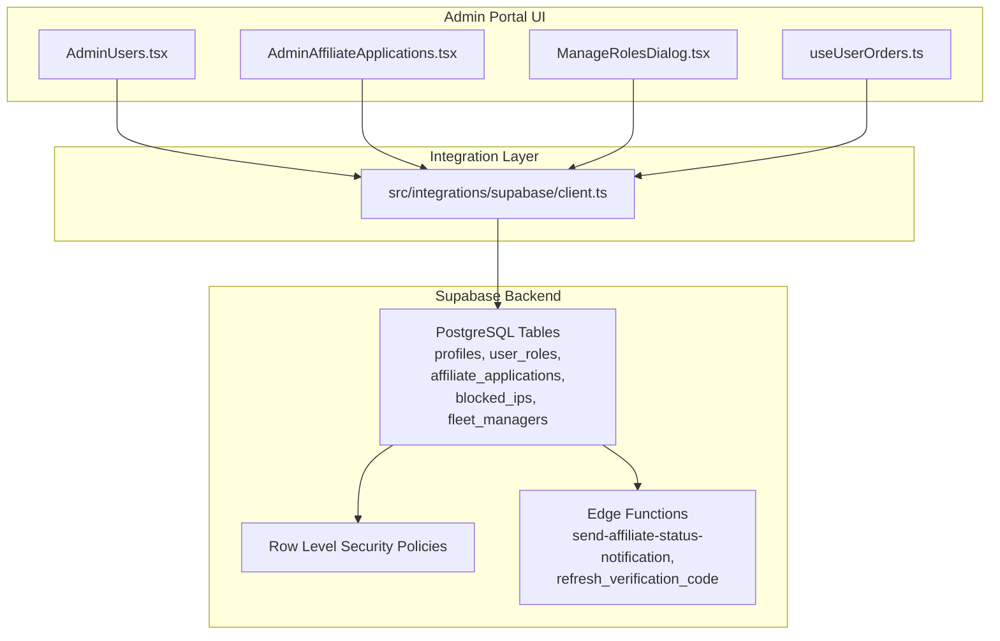
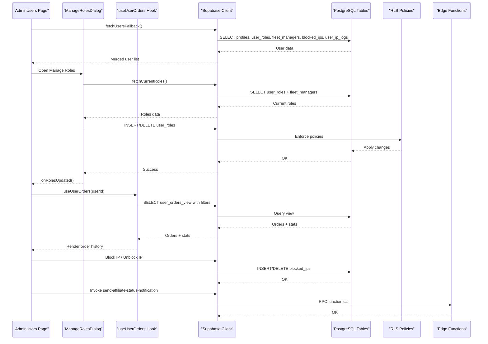
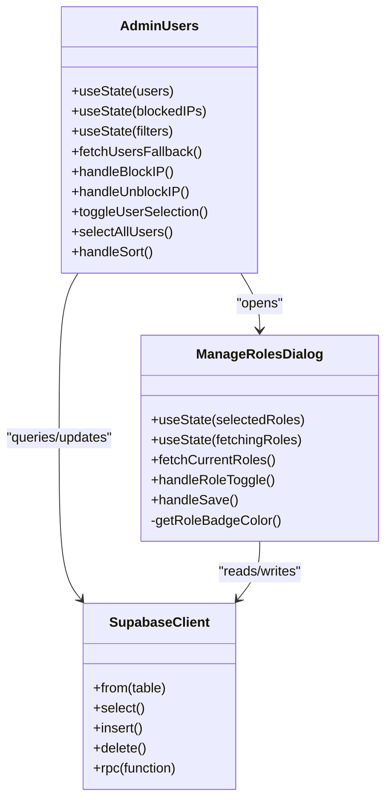
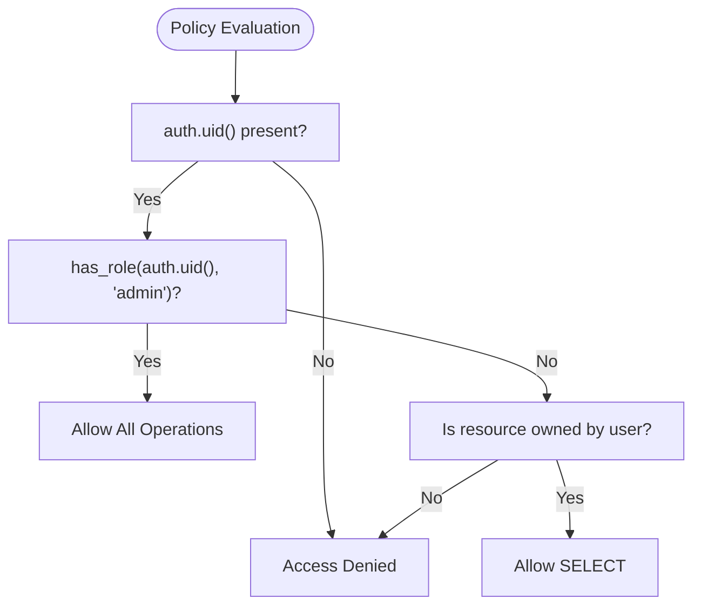
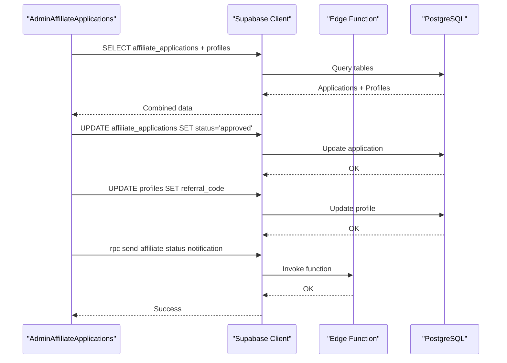
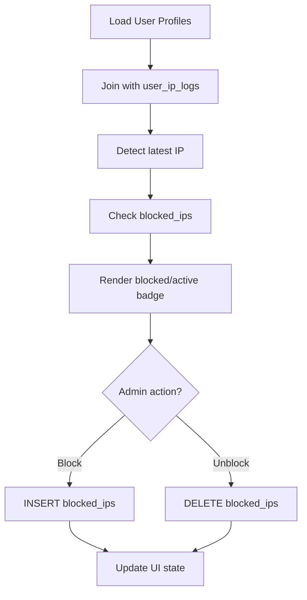
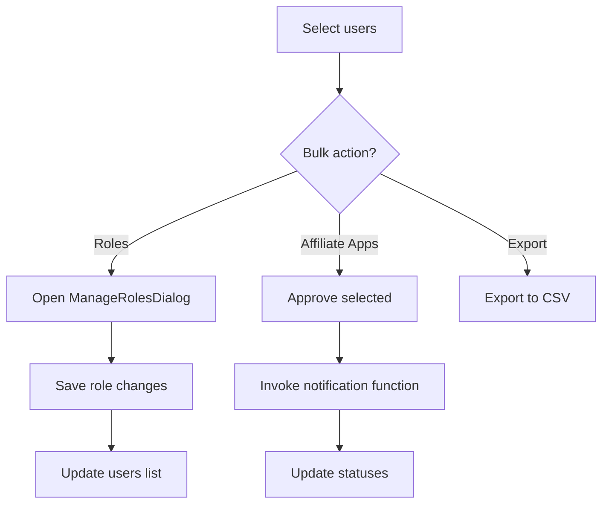
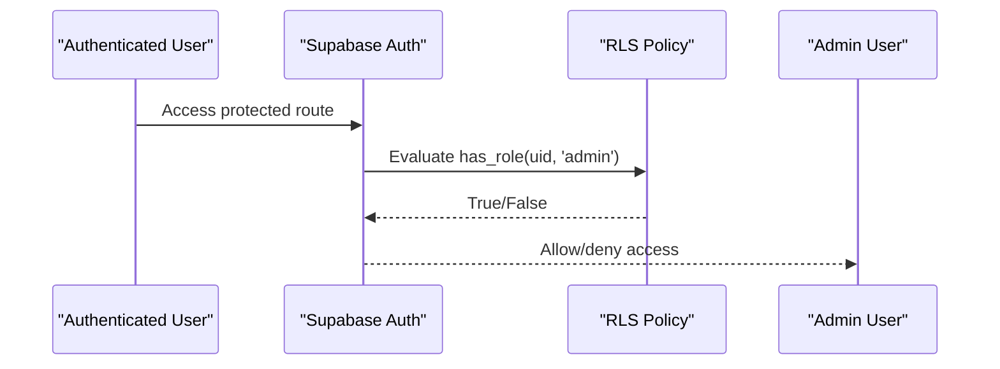
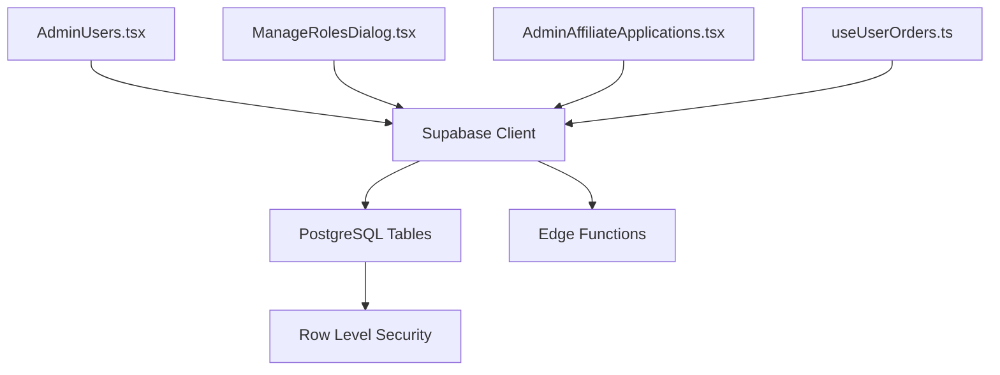

# User Management

<cite>
**Referenced Files in This Document**
- [AdminUsers.tsx](file://src/pages/admin/AdminUsers.tsx)
- [ManageRolesDialog.tsx](file://src/components/admin/ManageRolesDialog.tsx)
- [AdminAffiliateApplications.tsx](file://src/pages/admin/AdminAffiliateApplications.tsx)
- [useUserOrders.ts](file://src/hooks/useUserOrders.ts)
- [client.ts](file://src/integrations/supabase/client.ts)
- [20250220000000_create_essential_tables.sql](file://supabase/migrations/20250220000000_create_essential_tables.sql)
- [20260106214714_64a7966a-9adb-4862-b2fe-63d10e6d9d95.sql](file://supabase/migrations/20260106214714_64a7966a-9adb-4862-b2fe-63d10e6d9d95.sql)
- [20250219000003_grant_admin_role.sql](file://supabase/migrations/20250219000003_grant_admin_role.sql)
- [affiliate.spec.ts](file://e2e/admin/affiliate.spec.ts)
- [App.tsx](file://src/App.tsx)
</cite>

## Table of Contents
1. [Introduction](#introduction)
2. [Project Structure](#project-structure)
3. [Core Components](#core-components)
4. [Architecture Overview](#architecture-overview)
5. [Detailed Component Analysis](#detailed-component-analysis)
6. [Dependency Analysis](#dependency-analysis)
7. [Performance Considerations](#performance-considerations)
8. [Troubleshooting Guide](#troubleshooting-guide)
9. [Conclusion](#conclusion)

## Introduction
This document describes the user management system within the admin portal, focusing on user account management, role assignment, and permission controls. It also covers affiliate program administration, application review processes, and payout management features. The documentation explains user verification workflows, account status management, bulk user operations, integration with authentication systems, and user lifecycle management processes.

## Project Structure
The user management system spans frontend pages, dialogs, hooks, and backend Supabase resources:
- Frontend pages: Admin user listing and affiliate application management
- Dialogs: Role management for users
- Hooks: Order history and statistics per user
- Supabase: Essential tables, row-level security policies, and migration scripts

**Diagram sources**
- [AdminUsers.tsx:116-207](file://src/pages/admin/AdminUsers.tsx#L116-L207)
- [ManageRolesDialog.tsx:95-126](file://src/components/admin/ManageRolesDialog.tsx#L95-L126)
- [AdminAffiliateApplications.tsx:88-131](file://src/pages/admin/AdminAffiliateApplications.tsx#L88-L131)
- [useUserOrders.ts:50-86](file://src/hooks/useUserOrders.ts#L50-L86)
- [client.ts:1-200](file://src/integrations/supabase/client.ts#L1-L200)
- [20250220000000_create_essential_tables.sql:90-139](file://supabase/migrations/20250220000000_create_essential_tables.sql#L90-L139)
- [20260106214714_64a7966a-9adb-4862-b2fe-63d10e6d9d95.sql:1-39](file://supabase/migrations/20260106214714_64a7966a-9adb-4862-b2fe-63d10e6d9d95.sql#L1-L39)

**Section sources**
- [AdminUsers.tsx:1-120](file://src/pages/admin/AdminUsers.tsx#L1-L120)
- [ManageRolesDialog.tsx:1-120](file://src/components/admin/ManageRolesDialog.tsx#L1-L120)
- [AdminAffiliateApplications.tsx:1-120](file://src/pages/admin/AdminAffiliateApplications.tsx#L1-L120)
- [useUserOrders.ts:1-60](file://src/hooks/useUserOrders.ts#L1-L60)
- [client.ts:1-200](file://src/integrations/supabase/client.ts#L1-L200)

## Core Components
- AdminUsers page: Lists users, filters by role/status/search, sorts by activity, blocks/unblocks IPs, opens user detail sheets, and manages roles.
- ManageRolesDialog: Edits user roles, enforces minimum role constraints, and handles fleet_manager separately.
- AdminAffiliateApplications page: Reviews affiliate applications, approves/rejects, bulk operations, exports CSV, and generates referral codes.
- useUserOrders hook: Loads user order history and computes statistics for the user detail panel.
- Supabase integration: Uses Supabase client for queries, mutations, and edge function invocations.

Key capabilities:
- User listing with role badges, status indicators, and IP address management
- Role assignment with row-level security enforcement
- Affiliate application lifecycle with email notifications
- Order history and statistics per user
- Bulk operations for applications

**Section sources**
- [AdminUsers.tsx:95-130](file://src/pages/admin/AdminUsers.tsx#L95-L130)
- [ManageRolesDialog.tsx:75-126](file://src/components/admin/ManageRolesDialog.tsx#L75-L126)
- [AdminAffiliateApplications.tsx:68-131](file://src/pages/admin/AdminAffiliateApplications.tsx#L68-L131)
- [useUserOrders.ts:43-86](file://src/hooks/useUserOrders.ts#L43-L86)

## Architecture Overview
The admin portal integrates with Supabase for data persistence and authentication. The frontend communicates via the Supabase client to fetch and mutate data, while edge functions handle asynchronous notifications.

**Diagram sources**
- [AdminUsers.tsx:132-207](file://src/pages/admin/AdminUsers.tsx#L132-L207)
- [ManageRolesDialog.tsx:95-226](file://src/components/admin/ManageRolesDialog.tsx#L95-L226)
- [useUserOrders.ts:50-137](file://src/hooks/useUserOrders.ts#L50-L137)
- [client.ts:1-200](file://src/integrations/supabase/client.ts#L1-L200)
- [20250220000000_create_essential_tables.sql:127-135](file://supabase/migrations/20250220000000_create_essential_tables.sql#L127-L135)

## Detailed Component Analysis

### User Account Management and Role Assignment
The AdminUsers page aggregates user data from multiple tables and presents a unified view. It supports filtering, sorting, and actions such as viewing details, managing roles, and blocking/unblocking IPs. The ManageRolesDialog ensures users maintain at least one role and coordinates updates to both user_roles and fleet_managers tables.

**Diagram sources**
- [AdminUsers.tsx:95-207](file://src/pages/admin/AdminUsers.tsx#L95-L207)
- [ManageRolesDialog.tsx:75-226](file://src/components/admin/ManageRolesDialog.tsx#L75-L226)
- [client.ts:1-200](file://src/integrations/supabase/client.ts#L1-L200)

Key behaviors:
- Role enforcement: The "User" role cannot be removed if it would leave a user with zero roles.
- Fleet manager handling: Special logic checks fleet_managers table and provides guidance when adding/removing fleet_manager.
- IP blocking: Updates blocked_ips and reflects live status in the UI.

**Section sources**
- [ManageRolesDialog.tsx:128-140](file://src/components/admin/ManageRolesDialog.tsx#L128-L140)
- [ManageRolesDialog.tsx:189-207](file://src/components/admin/ManageRolesDialog.tsx#L189-L207)
- [AdminUsers.tsx:209-263](file://src/pages/admin/AdminUsers.tsx#L209-L263)

### Permission Controls and Row-Level Security
Permission enforcement relies on Supabase row-level security policies:
- User roles visibility and management are restricted to admins.
- Users can view their own roles; admins can view and manage all roles.
- Affiliate application policies restrict users to their own records and admins to all records.

**Diagram sources**
- [20250220000000_create_essential_tables.sql:127-135](file://supabase/migrations/20250220000000_create_essential_tables.sql#L127-L135)
- [20260106214714_64a7966a-9adb-4862-b2fe-63d10e6d9d95.sql:22-38](file://supabase/migrations/20260106214714_64a7966a-9adb-4862-b2fe-63d10e6d9d95.sql#L22-L38)

**Section sources**
- [20250220000000_create_essential_tables.sql:127-135](file://supabase/migrations/20250220000000_create_essential_tables.sql#L127-L135)
- [20260106214714_64a7966a-9adb-4862-b2fe-63d10e6d9d95.sql:22-38](file://supabase/migrations/20260106214714_64a7966a-9adb-4862-b2fe-63d10e6d9d95.sql#L22-L38)

### Affiliate Program Administration
The AdminAffiliateApplications page manages affiliate applications:
- Lists applications with status badges and sorting
- Approves/rejects individual or bulk applications
- Generates referral codes upon approval
- Sends status notifications via edge functions
- Exports application data to CSV

**Diagram sources**
- [AdminAffiliateApplications.tsx:88-131](file://src/pages/admin/AdminAffiliateApplications.tsx#L88-L131)
- [AdminAffiliateApplications.tsx:133-189](file://src/pages/admin/AdminAffiliateApplications.tsx#L133-L189)
- [AdminAffiliateApplications.tsx:248-325](file://src/pages/admin/AdminAffiliateApplications.tsx#L248-L325)

**Section sources**
- [AdminAffiliateApplications.tsx:54-66](file://src/pages/admin/AdminAffiliateApplications.tsx#L54-L66)
- [AdminAffiliateApplications.tsx:133-189](file://src/pages/admin/AdminAffiliateApplications.tsx#L133-L189)
- [AdminAffiliateApplications.tsx:248-325](file://src/pages/admin/AdminAffiliateApplications.tsx#L248-L325)

### User Verification Workflows and Account Status Management
The system supports IP-based verification and blocking:
- Latest IP detection from user_ip_logs
- Blocked IP management via blocked_ips table
- UI indicators for active/block status
- Edge function for verification code refresh in related flows

**Diagram sources**
- [AdminUsers.tsx:132-207](file://src/pages/admin/AdminUsers.tsx#L132-L207)
- [AdminUsers.tsx:209-263](file://src/pages/admin/AdminUsers.tsx#L209-L263)

**Section sources**
- [AdminUsers.tsx:132-207](file://src/pages/admin/AdminUsers.tsx#L132-L207)
- [AdminUsers.tsx:209-263](file://src/pages/admin/AdminUsers.tsx#L209-L263)

### Bulk User Operations
Bulk operations are supported for:
- Selecting multiple users in the AdminUsers page
- Managing roles in bulk via ManageRolesDialog
- Approving/rejecting multiple affiliate applications
- Exporting application data to CSV

**Diagram sources**
- [AdminUsers.tsx:297-315](file://src/pages/admin/AdminUsers.tsx#L297-L315)
- [ManageRolesDialog.tsx:142-226](file://src/components/admin/ManageRolesDialog.tsx#L142-L226)
- [AdminAffiliateApplications.tsx:248-325](file://src/pages/admin/AdminAffiliateApplications.tsx#L248-L325)
- [AdminAffiliateApplications.tsx:442-463](file://src/pages/admin/AdminAffiliateApplications.tsx#L442-L463)

**Section sources**
- [AdminUsers.tsx:297-315](file://src/pages/admin/AdminUsers.tsx#L297-L315)
- [ManageRolesDialog.tsx:142-226](file://src/components/admin/ManageRolesDialog.tsx#L142-L226)
- [AdminAffiliateApplications.tsx:248-325](file://src/pages/admin/AdminAffiliateApplications.tsx#L248-L325)
- [AdminAffiliateApplications.tsx:442-463](file://src/pages/admin/AdminAffiliateApplications.tsx#L442-L463)

### Integration with Authentication Systems and User Lifecycle
- Authentication: Supabase auth integration provides user context for policies and edge functions.
- User lifecycle: Creation, role assignment, verification (IP-based), and status updates.
- Admin provisioning: Migration grants admin role to specific users.

**Diagram sources**
- [20250219000003_grant_admin_role.sql:1-33](file://supabase/migrations/20250219000003_grant_admin_role.sql#L1-L33)
- [20250220000000_create_essential_tables.sql:103-120](file://supabase/migrations/20250220000000_create_essential_tables.sql#L103-L120)

**Section sources**
- [20250219000003_grant_admin_role.sql:1-33](file://supabase/migrations/20250219000003_grant_admin_role.sql#L1-L33)
- [20250220000000_create_essential_tables.sql:103-120](file://supabase/migrations/20250220000000_create_essential_tables.sql#L103-L120)

## Dependency Analysis
The admin portal depends on Supabase for data and edge functions. The following diagram shows key dependencies:

**Diagram sources**
- [AdminUsers.tsx:53-61](file://src/pages/admin/AdminUsers.tsx#L53-L61)
- [ManageRolesDialog.tsx](file://src/components/admin/ManageRolesDialog.tsx#L13)
- [AdminAffiliateApplications.tsx](file://src/pages/admin/AdminAffiliateApplications.tsx#L50)
- [useUserOrders.ts](file://src/hooks/useUserOrders.ts#L2)
- [client.ts:1-200](file://src/integrations/supabase/client.ts#L1-L200)

**Section sources**
- [AdminUsers.tsx:53-61](file://src/pages/admin/AdminUsers.tsx#L53-L61)
- [ManageRolesDialog.tsx](file://src/components/admin/ManageRolesDialog.tsx#L13)
- [AdminAffiliateApplications.tsx](file://src/pages/admin/AdminAffiliateApplications.tsx#L50)
- [useUserOrders.ts](file://src/hooks/useUserOrders.ts#L2)
- [client.ts:1-200](file://src/integrations/supabase/client.ts#L1-L200)

## Performance Considerations
- Minimize round-trips: The AdminUsers page consolidates multiple reads into a single fetchUsersFallback operation.
- Efficient filtering: Client-side filtering and sorting reduce server load; consider pagination for very large datasets.
- Bulk operations: Approve/reject loops in AdminAffiliateApplications could benefit from batch updates if scaling.
- Edge functions: Asynchronous notifications prevent blocking the UI during long-running tasks.

## Troubleshooting Guide
Common issues and resolutions:
- Role removal fails: The "User" role cannot be removed if it leaves a user with zero roles. Assign another role first.
- Fleet manager assignment: Adding fleet_manager requires additional setup; use the dedicated dialog and ensure required fields are provided.
- IP blocking errors: Verify blocked_ips table permissions and network connectivity to Supabase.
- Affiliate approval failures: Confirm edge function availability and email service configuration.
- Order history empty: Ensure user_orders_view exists and filters are not overly restrictive.

**Section sources**
- [ManageRolesDialog.tsx:131-139](file://src/components/admin/ManageRolesDialog.tsx#L131-L139)
- [ManageRolesDialog.tsx:197-207](file://src/components/admin/ManageRolesDialog.tsx#L197-L207)
- [AdminUsers.tsx:209-263](file://src/pages/admin/AdminUsers.tsx#L209-L263)
- [AdminAffiliateApplications.tsx:133-189](file://src/pages/admin/AdminAffiliateApplications.tsx#L133-L189)
- [useUserOrders.ts:50-86](file://src/hooks/useUserOrders.ts#L50-L86)

## Conclusion
The admin portal provides comprehensive user management capabilities, including role assignment, verification workflows, and affiliate program administration. Supabase’s row-level security and edge functions underpin secure, scalable operations. The system supports bulk actions, order analytics, and asynchronous notifications, enabling efficient platform administration.