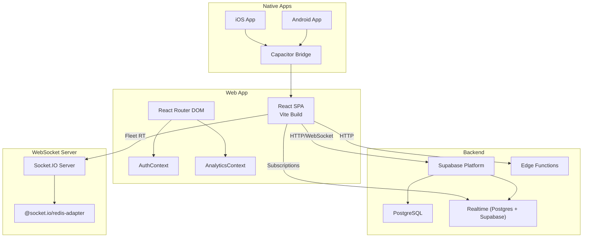
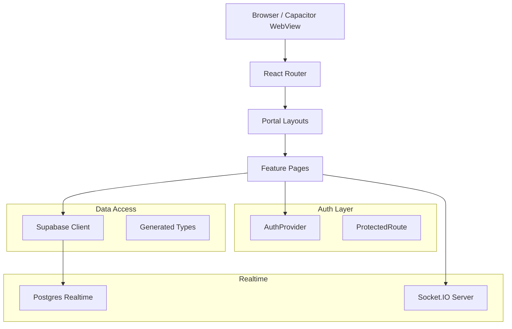
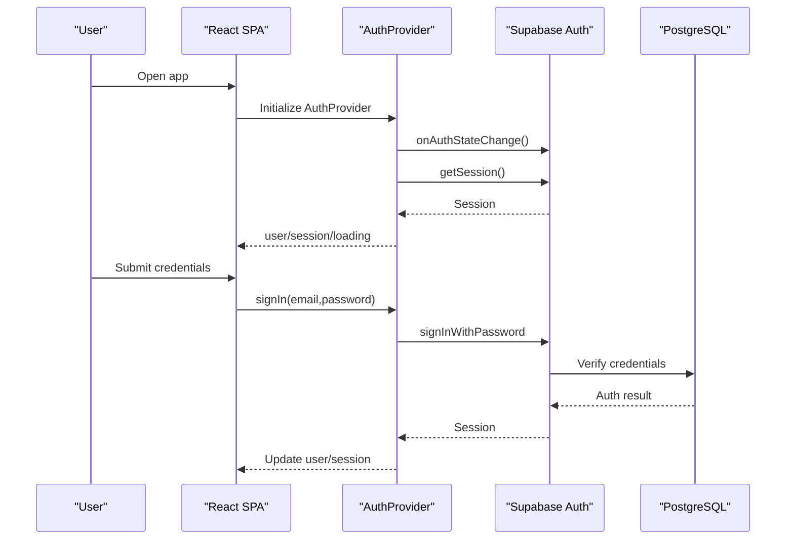
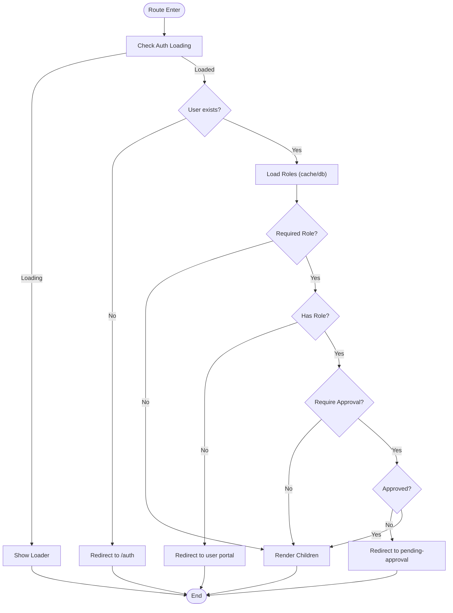
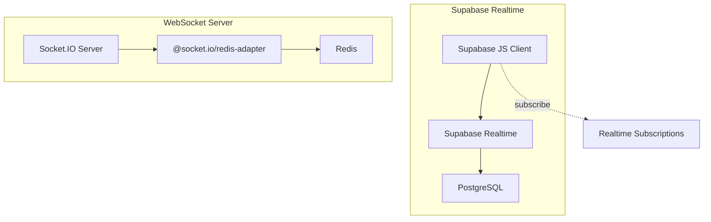
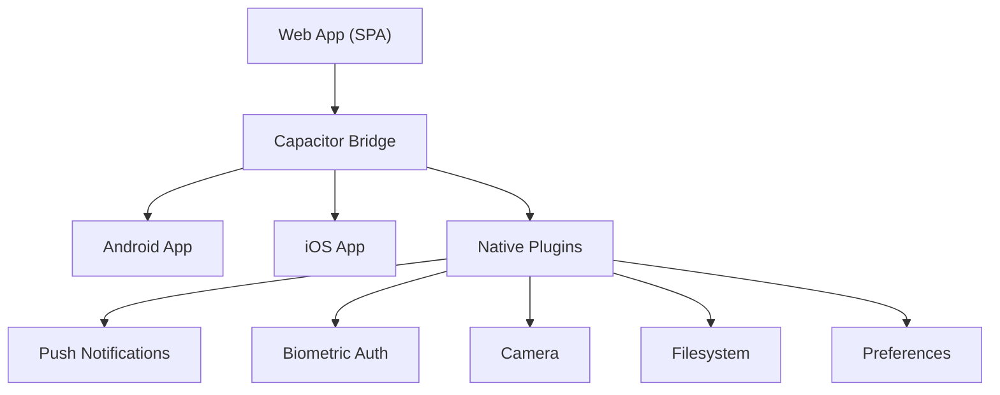
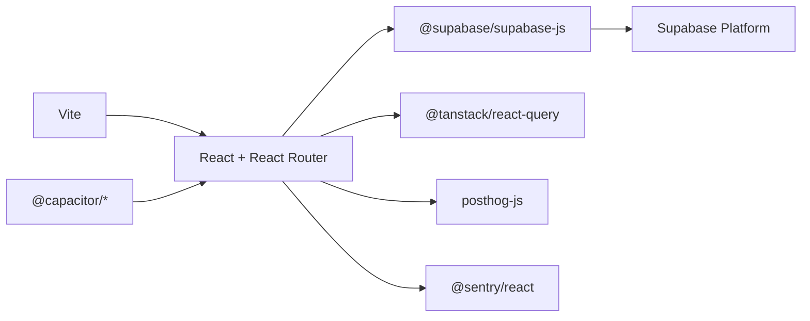
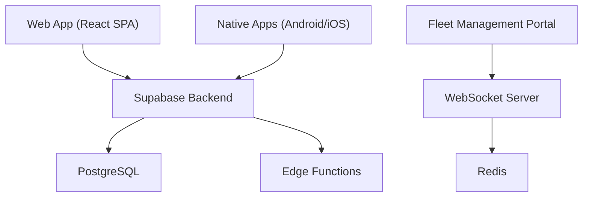

# Application Architecture

<cite>
**Referenced Files in This Document**
- [package.json](file://package.json)
- [vite.config.ts](file://vite.config.ts)
- [capacitor.config.ts](file://capacitor.config.ts)
- [src/App.tsx](file://src/App.tsx)
- [src/contexts/AuthContext.tsx](file://src/contexts/AuthContext.tsx)
- [src/contexts/AnalyticsContext.tsx](file://src/contexts/AnalyticsContext.tsx)
- [src/integrations/supabase/client.ts](file://src/integrations/supabase/client.ts)
- [src/components/ProtectedRoute.tsx](file://src/components/ProtectedRoute.tsx)
- [src/fleet/routes.tsx](file://src/fleet/routes.tsx)
- [supabase/config.toml](file://supabase/config.toml)
- [supabase/types.ts](file://supabase/types.ts)
- [src/integrations/supabase/types.ts](file://src/integrations/supabase/types.ts)
- [websocket-server/package.json](file://websocket-server/package.json)
</cite>

## Table of Contents
1. [Introduction](#introduction)
2. [Project Structure](#project-structure)
3. [Core Components](#core-components)
4. [Architecture Overview](#architecture-overview)
5. [Detailed Component Analysis](#detailed-component-analysis)
6. [Dependency Analysis](#dependency-analysis)
7. [Performance Considerations](#performance-considerations)
8. [Troubleshooting Guide](#troubleshooting-guide)
9. [Conclusion](#conclusion)
10. [Appendices](#appendices)

## Introduction
This document describes the Nutrio application architecture for its multi-portal system. The frontend is a React-based Single Page Application (SPA) with TypeScript, packaged via Vite and deployed as a web application and integrated into native Android and iOS apps using Capacitor. The backend is powered by Supabase, which provides authentication, relational database, Row Level Security (RLS), and real-time capabilities. A dedicated WebSocket server supports real-time features for the Fleet Management Portal. Cross-cutting concerns include centralized authentication and analytics contexts, error tracking via Sentry, and performance monitoring through PostHog.

## Project Structure
The repository is organized around:
- Frontend (React + Vite): src/ for application code, pages/, components/, contexts/, hooks/, integrations/, services/
- Supabase: supabase/ for migrations, functions, and configuration
- Native Mobile: Capacitor configuration and Android/iOS projects under android/ and ios/
- WebSocket Server: fleet real-time tracking server under websocket-server/
- Testing and CI/CD: GitHub Actions workflows under .github/workflows/

**Diagram sources**
- [src/App.tsx:139-739](file://src/App.tsx#L139-L739)
- [src/contexts/AuthContext.tsx:31-130](file://src/contexts/AuthContext.tsx#L31-L130)
- [src/contexts/AnalyticsContext.tsx:22-61](file://src/contexts/AnalyticsContext.tsx#L22-L61)
- [capacitor.config.ts:3-45](file://capacitor.config.ts#L3-L45)
- [supabase/config.toml:1-59](file://supabase/config.toml#L1-L59)
- [websocket-server/package.json:21-30](file://websocket-server/package.json#L21-L30)

**Section sources**
- [package.json:1-159](file://package.json#L1-L159)
- [vite.config.ts:1-77](file://vite.config.ts#L1-L77)
- [capacitor.config.ts:1-45](file://capacitor.config.ts#L1-L45)
- [src/App.tsx:139-739](file://src/App.tsx#L139-L739)

## Core Components
- Centralized Providers:
  - AuthProvider: Manages authentication state, JWT sessions, and native push notification initialization.
  - AnalyticsProvider: Initializes analytics SDK and exposes tracking APIs.
- Routing and Guards:
  - React Router DOM routes with ProtectedRoute for role-based access control and approval gating.
  - Fleet portal routes are modularized and wrapped with fleet-specific guards.
- Supabase Integration:
  - Supabase client configured with Capacitor-compatible storage for native sessions.
  - Edge functions configured in Supabase TOML for serverless logic.
- Native Integration:
  - Capacitor configuration enables secure navigation to Supabase domains and native plugin integrations (push, biometric, splash, etc.).

Key implementation references:
- [src/App.tsx:139-739](file://src/App.tsx#L139-L739)
- [src/contexts/AuthContext.tsx:31-130](file://src/contexts/AuthContext.tsx#L31-L130)
- [src/contexts/AnalyticsContext.tsx:22-61](file://src/contexts/AnalyticsContext.tsx#L22-L61)
- [src/components/ProtectedRoute.tsx:139-230](file://src/components/ProtectedRoute.tsx#L139-L230)
- [src/fleet/routes.tsx:20-42](file://src/fleet/routes.tsx#L20-L42)
- [src/integrations/supabase/client.ts:47-57](file://src/integrations/supabase/client.ts#L47-L57)
- [supabase/config.toml:1-59](file://supabase/config.toml#L1-L59)
- [capacitor.config.ts:3-45](file://capacitor.config.ts#L3-L45)

**Section sources**
- [src/App.tsx:139-739](file://src/App.tsx#L139-L739)
- [src/contexts/AuthContext.tsx:31-130](file://src/contexts/AuthContext.tsx#L31-L130)
- [src/contexts/AnalyticsContext.tsx:22-61](file://src/contexts/AnalyticsContext.tsx#L22-L61)
- [src/components/ProtectedRoute.tsx:139-230](file://src/components/ProtectedRoute.tsx#L139-L230)
- [src/fleet/routes.tsx:20-42](file://src/fleet/routes.tsx#L20-L42)
- [src/integrations/supabase/client.ts:47-57](file://src/integrations/supabase/client.ts#L47-L57)
- [supabase/config.toml:1-59](file://supabase/config.toml#L1-L59)
- [capacitor.config.ts:3-45](file://capacitor.config.ts#L3-L45)

## Architecture Overview
The system follows a multi-portal design:
- Web App: React SPA with protected routes per role (customer, partner, driver, admin, staff).
- Native Apps: Capacitor wraps the web app for Android and iOS, enabling native device features.
- Backend: Supabase handles authentication, database, RLS, and real-time subscriptions.
- Real-time: Supabase Postgres-based real-time plus a dedicated Socket.IO server for fleet tracking.
- Edge Functions: Supabase functions for domain logic (e.g., reminders, analytics, processing).

**Diagram sources**
- [src/App.tsx:174-739](file://src/App.tsx#L174-L739)
- [src/contexts/AuthContext.tsx:31-130](file://src/contexts/AuthContext.tsx#L31-L130)
- [src/components/ProtectedRoute.tsx:139-230](file://src/components/ProtectedRoute.tsx#L139-L230)
- [src/integrations/supabase/client.ts:47-57](file://src/integrations/supabase/client.ts#L47-L57)
- [websocket-server/package.json:21-30](file://websocket-server/package.json#L21-L30)

## Detailed Component Analysis

### Authentication and Authorization Flow
The authentication system is centralized via AuthProvider and integrates with Supabase Auth. It:
- Subscribes to auth state changes and persists sessions using Capacitor Preferences on native platforms.
- Provides sign-up, sign-in, and sign-out functions.
- Initializes native push notifications upon sign-in on native platforms.
- ProtectedRoute enforces role-based access and optional approval checks for partner routes.

**Diagram sources**
- [src/contexts/AuthContext.tsx:36-61](file://src/contexts/AuthContext.tsx#L36-L61)
- [src/contexts/AuthContext.tsx:87-112](file://src/contexts/AuthContext.tsx#L87-L112)
- [src/integrations/supabase/client.ts:47-57](file://src/integrations/supabase/client.ts#L47-L57)

**Section sources**
- [src/contexts/AuthContext.tsx:31-130](file://src/contexts/AuthContext.tsx#L31-L130)
- [src/components/ProtectedRoute.tsx:139-230](file://src/components/ProtectedRoute.tsx#L139-L230)
- [src/integrations/supabase/client.ts:47-57](file://src/integrations/supabase/client.ts#L47-L57)

### Routing and Role-Based Access Control
Routing is defined in App with nested layouts and protected routes. ProtectedRoute:
- Loads user roles from Supabase tables (including derived roles like partner/restaurant).
- Supports role hierarchy so higher roles can access lower-role routes.
- Enforces approval checks for partner routes.
- Uses caching to avoid repeated role queries.

**Diagram sources**
- [src/components/ProtectedRoute.tsx:139-230](file://src/components/ProtectedRoute.tsx#L139-L230)
- [src/components/ProtectedRoute.tsx:40-98](file://src/components/ProtectedRoute.tsx#L40-L98)

**Section sources**
- [src/App.tsx:174-739](file://src/App.tsx#L174-L739)
- [src/components/ProtectedRoute.tsx:139-230](file://src/components/ProtectedRoute.tsx#L139-L230)

### Real-time Communication Architecture
Supabase provides real-time subscriptions via PostgreSQL replication and a WebSocket transport. The Supabase client is configured with persistent sessions and native storage for Capacitor. The dedicated WebSocket server (Socket.IO) is used for fleet tracking and can scale horizontally with Redis adapter.

**Diagram sources**
- [src/integrations/supabase/client.ts:47-57](file://src/integrations/supabase/client.ts#L47-L57)
- [websocket-server/package.json:21-30](file://websocket-server/package.json#L21-L30)

**Section sources**
- [src/integrations/supabase/client.ts:47-57](file://src/integrations/supabase/client.ts#L47-L57)
- [websocket-server/package.json:21-30](file://websocket-server/package.json#L21-L30)

### Native Mobile Integration
Capacitor bridges the web app to native platforms:
- Secure navigation to Supabase domains.
- Native plugins for push notifications, biometrics, splash screen, keyboard, filesystem, preferences, and camera.
- Production mode serves bundled assets; development proxies to Vite dev server.

**Diagram sources**
- [capacitor.config.ts:3-45](file://capacitor.config.ts#L3-L45)
- [package.json:44-61](file://package.json#L44-L61)

**Section sources**
- [capacitor.config.ts:3-45](file://capacitor.config.ts#L3-L45)
- [package.json:44-61](file://package.json#L44-L61)

## Dependency Analysis
- Build and Dev Tools:
  - Vite for fast builds and HMR; Sentry plugin for source maps in production.
  - React Query for data fetching and caching.
- Analytics and Observability:
  - PostHog for analytics; Sentry for error tracking.
- Native:
  - Capacitor ecosystem for native integrations.
- Supabase:
  - Supabase JS client with custom storage for sessions.
  - Edge functions configured in Supabase TOML.

**Diagram sources**
- [vite.config.ts:28-40](file://vite.config.ts#L28-L40)
- [package.json:91-126](file://package.json#L91-L126)
- [package.json:44-61](file://package.json#L44-L61)
- [src/integrations/supabase/client.ts:47-57](file://src/integrations/supabase/client.ts#L47-L57)

**Section sources**
- [vite.config.ts:1-77](file://vite.config.ts#L1-L77)
- [package.json:1-159](file://package.json#L1-L159)
- [src/integrations/supabase/client.ts:47-57](file://src/integrations/supabase/client.ts#L47-L57)

## Performance Considerations
- Build and Bundling:
  - Modern target and chunk splitting for caching and faster loads.
  - Terser minification and console removal in production.
- Runtime:
  - React Query for efficient caching and background refetching.
  - Suspense-based lazy loading for feature pages.
  - Role caching in ProtectedRoute to reduce DB queries.
- Native:
  - Capacitor storage adapter ensures session persistence without blocking the UI.
- Observability:
  - Sentry source maps for error tracking.
  - PostHog for behavioral insights.

[No sources needed since this section provides general guidance]

## Troubleshooting Guide
- Authentication Issues:
  - Verify Supabase URL and keys are present in environment variables for Capacitor builds.
  - Check auth state listener initialization and session retrieval.
- Role and Permission Problems:
  - Confirm user roles exist in user_roles and derived roles in restaurants/drivers tables.
  - Review ProtectedRoute role hierarchy and approval checks.
- Real-time Subscriptions:
  - Ensure Supabase client is initialized with proper storage and auth persistence.
  - For fleet tracking, confirm Socket.IO server is reachable and Redis adapter is configured.
- Native App Navigation:
  - Confirm allowNavigation includes supabase.co domains in Capacitor config.

**Section sources**
- [src/integrations/supabase/client.ts:10-16](file://src/integrations/supabase/client.ts#L10-L16)
- [src/contexts/AuthContext.tsx:36-61](file://src/contexts/AuthContext.tsx#L36-L61)
- [src/components/ProtectedRoute.tsx:40-98](file://src/components/ProtectedRoute.tsx#L40-L98)
- [capacitor.config.ts:13-16](file://capacitor.config.ts#L13-L16)
- [websocket-server/package.json:21-30](file://websocket-server/package.json#L21-L30)

## Conclusion
Nutrio’s architecture combines a modern React SPA with Supabase for authentication, data, and real-time features, and a dedicated WebSocket server for fleet tracking. The centralized AuthProvider and AnalyticsProvider enable consistent behavior across portals and platforms. Capacitor integration delivers a seamless native experience. Supabase edge functions and real-time subscriptions provide scalable backend capabilities, while Sentry and PostHog support observability and insights.

[No sources needed since this section summarizes without analyzing specific files]

## Appendices

### System Context Diagram

**Diagram sources**
- [src/App.tsx:139-739](file://src/App.tsx#L139-L739)
- [supabase/config.toml:1-59](file://supabase/config.toml#L1-L59)
- [websocket-server/package.json:21-30](file://websocket-server/package.json#L21-L30)

### Infrastructure and Deployment Topology
- Web: Vercel or static hosting serving SPA with base path configured for production vs. Capacitor.
- Native: Capacitor builds distribute the web app as native apps with platform-specific configurations.
- Backend: Supabase manages authentication, database, RLS, and real-time; edge functions for serverless logic.
- Real-time: Supabase Postgres-based real-time plus Socket.IO server with Redis adapter for horizontal scaling.

**Section sources**
- [vite.config.ts:9-11](file://vite.config.ts#L9-L11)
- [capacitor.config.ts:3-17](file://capacitor.config.ts#L3-L17)
- [supabase/config.toml:1-59](file://supabase/config.toml#L1-L59)
- [websocket-server/package.json:21-30](file://websocket-server/package.json#L21-L30)