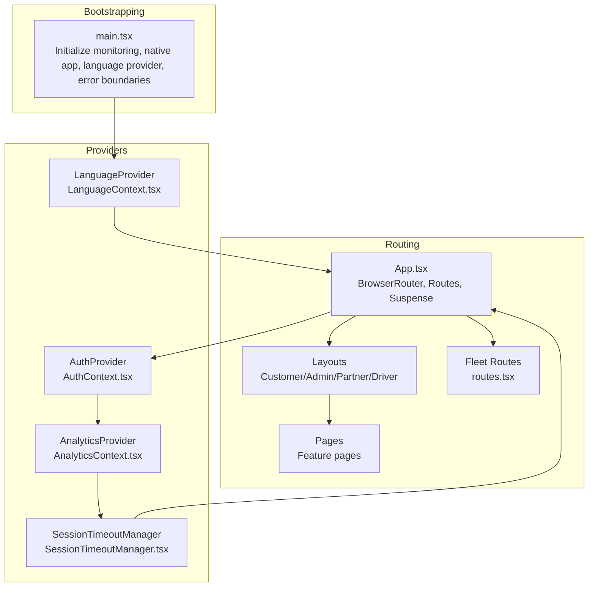
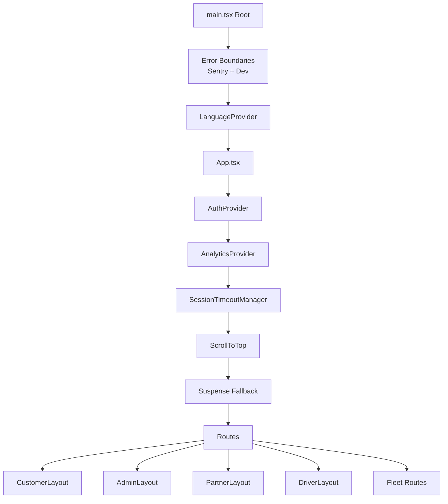
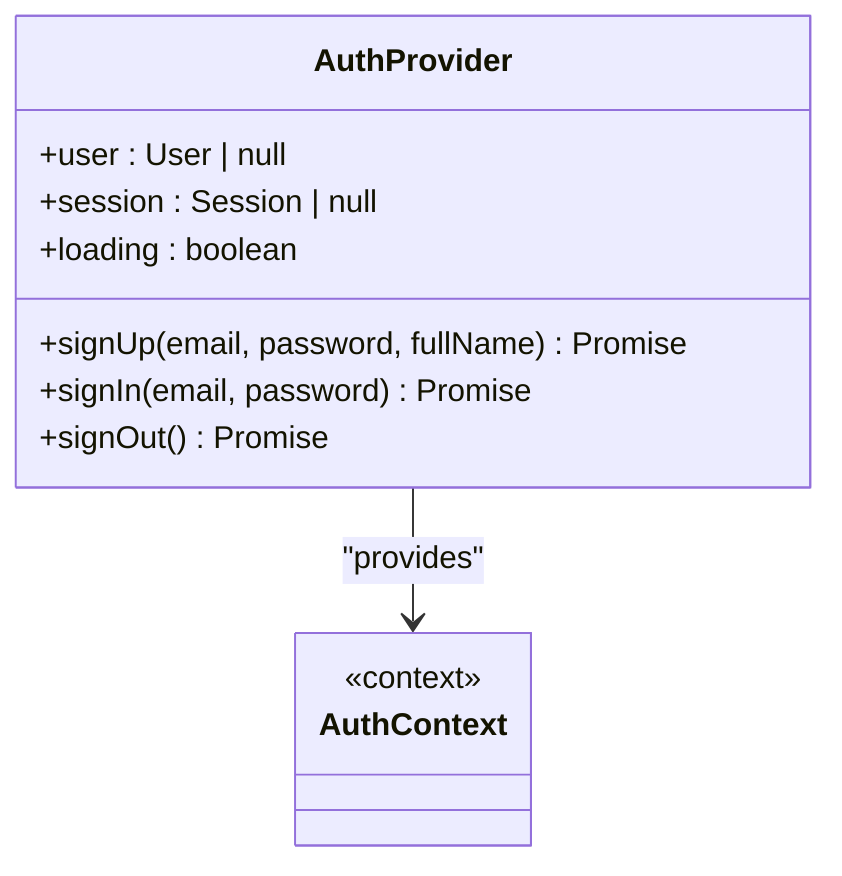
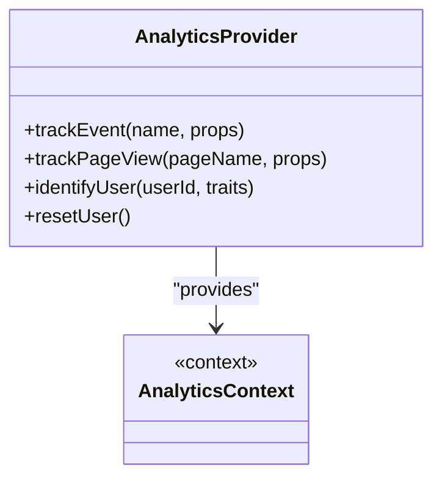
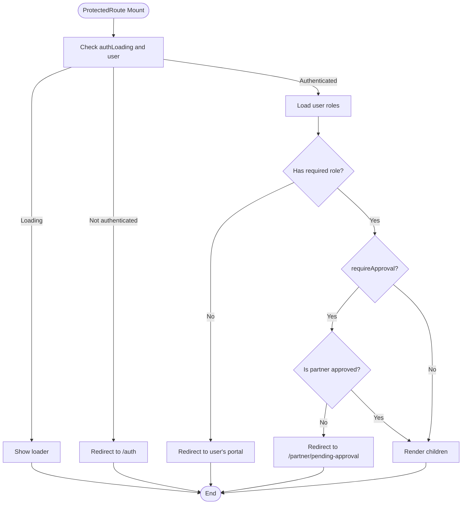
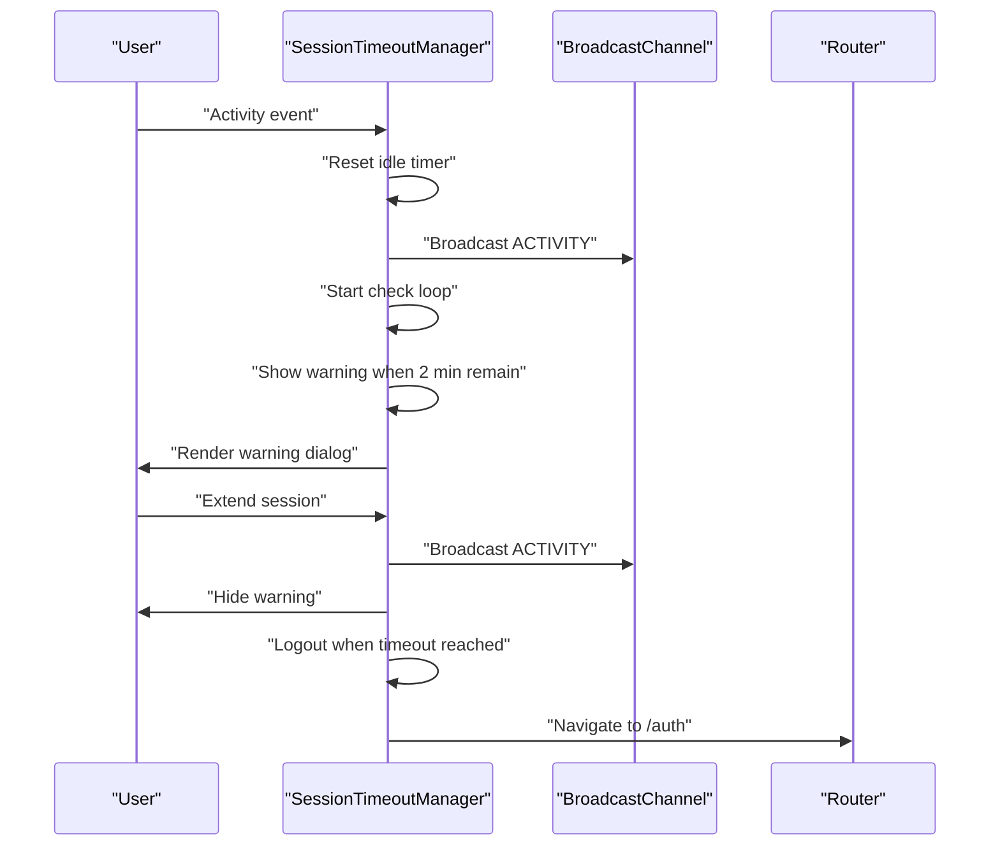
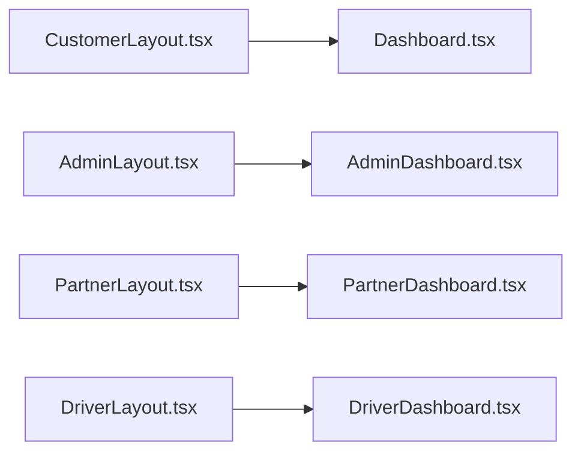
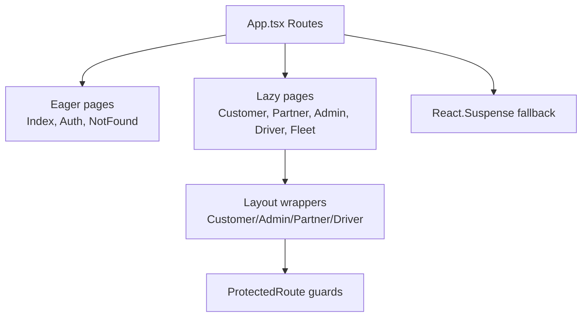
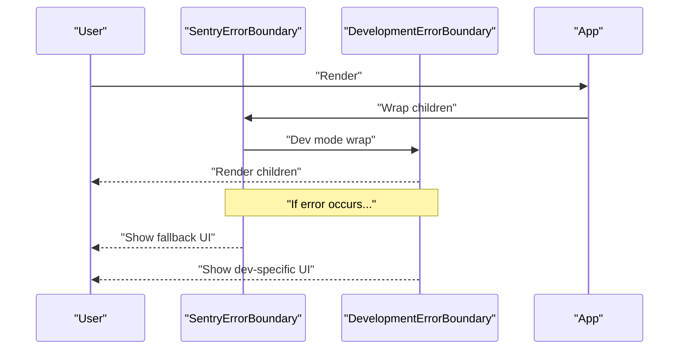
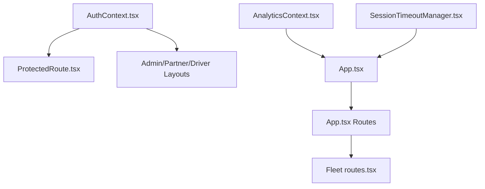

# Component Architecture

<cite>
**Referenced Files in This Document**
- [App.tsx](file://src/App.tsx)
- [main.tsx](file://src/main.tsx)
- [AuthContext.tsx](file://src/contexts/AuthContext.tsx)
- [AnalyticsContext.tsx](file://src/contexts/AnalyticsContext.tsx)
- [ProtectedRoute.tsx](file://src/components/ProtectedRoute.tsx)
- [SessionTimeoutManager.tsx](file://src/components/SessionTimeoutManager.tsx)
- [DevelopmentErrorBoundary.tsx](file://src/components/DevelopmentErrorBoundary.tsx)
- [SentryErrorBoundary.tsx](file://src/components/SentryErrorBoundary.tsx)
- [CustomerLayout.tsx](file://src/components/CustomerLayout.tsx)
- [AdminLayout.tsx](file://src/components/AdminLayout.tsx)
- [PartnerLayout.tsx](file://src/components/PartnerLayout.tsx)
- [DriverLayout.tsx](file://src/components/DriverLayout.tsx)
- [routes.tsx](file://src/fleet/routes.tsx)
- [Dashboard.tsx](file://src/pages/Dashboard.tsx)
- [AdminDashboard.tsx](file://src/pages/admin/AdminDashboard.tsx)
- [PartnerDashboard.tsx](file://src/pages/partner/PartnerDashboard.tsx)
- [DriverDashboard.tsx](file://src/pages/driver/DriverDashboard.tsx)
</cite>

## Table of Contents
1. [Introduction](#introduction)
2. [Project Structure](#project-structure)
3. [Core Components](#core-components)
4. [Architecture Overview](#architecture-overview)
5. [Detailed Component Analysis](#detailed-component-analysis)
6. [Dependency Analysis](#dependency-analysis)
7. [Performance Considerations](#performance-considerations)
8. [Troubleshooting Guide](#troubleshooting-guide)
9. [Conclusion](#conclusion)

## Introduction
This document explains the React component architecture of the application, focusing on the component hierarchy, context provider system, routing patterns, and cross-cutting concerns such as authentication, analytics, and session timeout management. It also covers protected routes with role-based access control, lazy loading strategies, layout composition, error boundaries, and performance optimizations including React Suspense and lazy loading.

## Project Structure
The application bootstraps at the root level and composes providers and routing around feature-specific pages and layouts. Providers are established early to ensure global availability of authentication, analytics, and UI services. Routing is organized by portal (customer, admin, partner, driver, fleet) and uses nested layouts for consistent UI and navigation.

**Diagram sources**
- [main.tsx:20-47](file://src/main.tsx#L20-L47)
- [App.tsx:139-739](file://src/App.tsx#L139-L739)
- [AuthContext.tsx:31-130](file://src/contexts/AuthContext.tsx#L31-L130)
- [AnalyticsContext.tsx:22-61](file://src/contexts/AnalyticsContext.tsx#L22-L61)
- [SessionTimeoutManager.tsx:47-317](file://src/components/SessionTimeoutManager.tsx#L47-L317)
- [routes.tsx:20-42](file://src/fleet/routes.tsx#L20-L42)

**Section sources**
- [main.tsx:13-47](file://src/main.tsx#L13-L47)
- [App.tsx:139-739](file://src/App.tsx#L139-L739)

## Core Components
- Centralized authentication context: Provides user/session state, sign-up/sign-in/sign-out, and native push notification initialization.
- Analytics context: Initializes analytics SDK and exposes tracking APIs for events, page views, and user identification.
- Protected route guard: Enforces authentication and role-based access control with caching and optional approval checks.
- Session timeout manager: Monitors user activity, warns before logout, and logs out after inactivity; supports cross-tab synchronization and temporary extension during long operations.
- Layout components: Provide shared UI scaffolding for customer, admin, partner, and driver portals, including navigation and breadcrumbs.
- Error boundaries: Wrap the app in Sentry-aware and development-friendly boundaries to gracefully handle runtime errors.

**Section sources**
- [AuthContext.tsx:1-131](file://src/contexts/AuthContext.tsx#L1-L131)
- [AnalyticsContext.tsx:1-61](file://src/contexts/AnalyticsContext.tsx#L1-L61)
- [ProtectedRoute.tsx:1-264](file://src/components/ProtectedRoute.tsx#L1-L264)
- [SessionTimeoutManager.tsx:1-344](file://src/components/SessionTimeoutManager.tsx#L1-L344)
- [CustomerLayout.tsx:1-24](file://src/components/CustomerLayout.tsx#L1-L24)
- [AdminLayout.tsx:1-130](file://src/components/AdminLayout.tsx#L1-L130)
- [PartnerLayout.tsx:1-141](file://src/components/PartnerLayout.tsx#L1-L141)
- [DriverLayout.tsx:1-183](file://src/components/DriverLayout.tsx#L1-L183)
- [DevelopmentErrorBoundary.tsx:1-97](file://src/components/DevelopmentErrorBoundary.tsx#L1-L97)
- [SentryErrorBoundary.tsx:1-77](file://src/components/SentryErrorBoundary.tsx#L1-L77)

## Architecture Overview
The application composes providers at the root and uses React Router to define routes per portal. Pages are lazily loaded to improve initial load performance. Protected routes enforce authentication and role checks, while layouts standardize UI and navigation across feature areas. Analytics and session timeout are managed centrally to reduce duplication and ensure consistent behavior.

**Diagram sources**
- [main.tsx:20-47](file://src/main.tsx#L20-L47)
- [App.tsx:139-739](file://src/App.tsx#L139-L739)
- [routes.tsx:20-42](file://src/fleet/routes.tsx#L20-L42)

## Detailed Component Analysis

### Authentication Context and Provider
- Purpose: Centralizes authentication state and operations, initializes push notifications on native platforms, and persists remembered credentials.
- Key behaviors:
  - Subscribes to Supabase auth state changes and sets session/user state.
  - Provides sign-up, sign-in, and sign-out methods with IP location checks and error handling.
  - Exposes a context consumer hook for components to access auth state and methods.

**Diagram sources**
- [AuthContext.tsx:31-130](file://src/contexts/AuthContext.tsx#L31-L130)

**Section sources**
- [AuthContext.tsx:1-131](file://src/contexts/AuthContext.tsx#L1-L131)

### Analytics Context and Provider
- Purpose: Initializes analytics SDK and exposes tracking APIs for events, page views, and user identification.
- Key behaviors:
  - Initializes analytics on mount.
  - Provides hooks for page tracking and user identification/reset.

**Diagram sources**
- [AnalyticsContext.tsx:22-61](file://src/contexts/AnalyticsContext.tsx#L22-L61)

**Section sources**
- [AnalyticsContext.tsx:1-61](file://src/contexts/AnalyticsContext.tsx#L1-L61)

### Protected Routes and Role-Based Access Control
- Purpose: Guard routes by requiring authentication and enforcing role-based access with optional approval checks.
- Key behaviors:
  - Role hierarchy allows higher roles to access lower-role routes.
  - Caches role checks to minimize repeated database queries.
  - Supports optional approval checks for partner routes.
  - Redirects unauthorized users to appropriate destinations or fallback content.

**Diagram sources**
- [ProtectedRoute.tsx:139-230](file://src/components/ProtectedRoute.tsx#L139-L230)

**Section sources**
- [ProtectedRoute.tsx:1-264](file://src/components/ProtectedRoute.tsx#L1-L264)

### Session Timeout Management
- Purpose: Monitor user activity, warn before logout, and log out after inactivity; synchronize across browser tabs and extend during long operations.
- Key behaviors:
  - Listens to activity events to reset idle timers.
  - Shows a warning dialog two minutes before logout.
  - Uses BroadcastChannel to coordinate timeouts across tabs.
  - Exposes a control hook to pause/resume timeout during long operations.

**Diagram sources**
- [SessionTimeoutManager.tsx:47-317](file://src/components/SessionTimeoutManager.tsx#L47-L317)

**Section sources**
- [SessionTimeoutManager.tsx:1-344](file://src/components/SessionTimeoutManager.tsx#L1-L344)

### Layout Components and Feature Pages
- CustomerLayout: Wraps customer feature pages with a consistent background and navigation.
- AdminLayout: Provides admin sidebar, breadcrumbs, and role checks to ensure only admins access admin routes.
- PartnerLayout: Ensures only partners or restaurant owners can access partner routes and displays order notifications.
- DriverLayout: Manages driver-specific UI, online/offline toggle, and bottom navigation.

**Diagram sources**
- [CustomerLayout.tsx:8-21](file://src/components/CustomerLayout.tsx#L8-L21)
- [AdminLayout.tsx:25-129](file://src/components/AdminLayout.tsx#L25-L129)
- [PartnerLayout.tsx:27-140](file://src/components/PartnerLayout.tsx#L27-L140)
- [DriverLayout.tsx:16-182](file://src/components/DriverLayout.tsx#L16-L182)

**Section sources**
- [CustomerLayout.tsx:1-24](file://src/components/CustomerLayout.tsx#L1-L24)
- [AdminLayout.tsx:1-130](file://src/components/AdminLayout.tsx#L1-L130)
- [PartnerLayout.tsx:1-141](file://src/components/PartnerLayout.tsx#L1-L141)
- [DriverLayout.tsx:1-183](file://src/components/DriverLayout.tsx#L1-L183)
- [Dashboard.tsx:1-200](file://src/pages/Dashboard.tsx#L1-L200)
- [AdminDashboard.tsx:1-200](file://src/pages/admin/AdminDashboard.tsx#L1-L200)
- [PartnerDashboard.tsx:1-200](file://src/pages/partner/PartnerDashboard.tsx#L1-L200)
- [DriverDashboard.tsx:1-200](file://src/pages/driver/DriverDashboard.tsx#L1-L200)

### Routing Patterns and Lazy Loading Strategy
- Routing is organized by portal and wraps feature pages with appropriate layouts.
- First-render critical pages are eagerly loaded; others are lazy-loaded by feature area to optimize initial bundle size.
- Suspense provides a consistent loading experience while lazy chunks are fetched.
- Fleet routes are composed dynamically and wrapped with their own auth and protection layers.

**Diagram sources**
- [App.tsx:16-117](file://src/App.tsx#L16-L117)
- [App.tsx:150-729](file://src/App.tsx#L150-L729)
- [routes.tsx:20-42](file://src/fleet/routes.tsx#L20-L42)

**Section sources**
- [App.tsx:16-117](file://src/App.tsx#L16-L117)
- [App.tsx:150-729](file://src/App.tsx#L150-L729)
- [routes.tsx:1-42](file://src/fleet/routes.tsx#L1-L42)

### Error Boundaries and Recovery
- SentryErrorBoundary: Captures unhandled errors in production and provides a friendly fallback UI.
- DevelopmentErrorBoundary: Handles hot reload and hook-related errors during development with actionable guidance.
- Root composition ensures error boundaries wrap the app depending on environment.

**Diagram sources**
- [SentryErrorBoundary.tsx:14-63](file://src/components/SentryErrorBoundary.tsx#L14-L63)
- [DevelopmentErrorBoundary.tsx:20-94](file://src/components/DevelopmentErrorBoundary.tsx#L20-L94)
- [main.tsx:20-47](file://src/main.tsx#L20-L47)

**Section sources**
- [SentryErrorBoundary.tsx:1-77](file://src/components/SentryErrorBoundary.tsx#L1-L77)
- [DevelopmentErrorBoundary.tsx:1-97](file://src/components/DevelopmentErrorBoundary.tsx#L1-L97)
- [main.tsx:13-47](file://src/main.tsx#L13-L47)

## Dependency Analysis
- Provider dependencies:
  - App.tsx depends on AuthProvider, AnalyticsProvider, SessionTimeoutManager, and React Router.
  - ProtectedRoute depends on AuthContext and Supabase client for role checks.
  - Layouts depend on AuthContext and Supabase for role verification and navigation.
- Routing dependencies:
  - App.tsx defines routes and lazy loads pages by feature area.
  - Fleet routes are composed dynamically and wrapped with fleet-specific providers and guards.
- Cross-cutting concerns:
  - SessionTimeoutManager coordinates with AuthContext for logout and with BroadcastChannel for cross-tab sync.
  - AnalyticsProvider integrates with analytics SDK initialization.

**Diagram sources**
- [App.tsx:139-739](file://src/App.tsx#L139-L739)
- [ProtectedRoute.tsx:139-230](file://src/components/ProtectedRoute.tsx#L139-L230)
- [AdminLayout.tsx:25-129](file://src/components/AdminLayout.tsx#L25-L129)
- [PartnerLayout.tsx:27-140](file://src/components/PartnerLayout.tsx#L27-L140)
- [DriverLayout.tsx:16-182](file://src/components/DriverLayout.tsx#L16-L182)
- [routes.tsx:20-42](file://src/fleet/routes.tsx#L20-L42)

**Section sources**
- [App.tsx:139-739](file://src/App.tsx#L139-L739)
- [ProtectedRoute.tsx:1-264](file://src/components/ProtectedRoute.tsx#L1-L264)
- [AdminLayout.tsx:1-130](file://src/components/AdminLayout.tsx#L1-L130)
- [PartnerLayout.tsx:1-141](file://src/components/PartnerLayout.tsx#L1-L141)
- [DriverLayout.tsx:1-183](file://src/components/DriverLayout.tsx#L1-L183)
- [routes.tsx:1-42](file://src/fleet/routes.tsx#L1-L42)

## Performance Considerations
- Lazy loading: Pages are grouped by feature area and lazily imported to reduce initial bundle size. This improves first paint and time-to-interactive for non-critical routes.
- Suspense: A single fallback component is used globally to ensure consistent UX during chunk loading.
- Role caching: ProtectedRoute caches role checks to avoid repeated database queries for the same user within a short TTL.
- Scroll restoration: A dedicated component resets scroll on route changes to mitigate Capacitor WebView scroll persistence issues.
- Native initialization: Monitoring and analytics are initialized at startup to avoid runtime overhead later.

[No sources needed since this section provides general guidance]

## Troubleshooting Guide
- Authentication issues:
  - Verify AuthProvider subscription and session retrieval on mount.
  - Check IP location checks during sign-in and error propagation.
- Role/access issues:
  - Confirm role hierarchy and caching behavior in ProtectedRoute.
  - Ensure approval checks for partner routes and redirects to pending approval page when needed.
- Session timeout problems:
  - Validate activity event listeners and BroadcastChannel usage.
  - Use the control hook to pause/resume timeout during long operations.
- Error handling:
  - Use SentryErrorBoundary for production error capture and reporting.
  - Use DevelopmentErrorBoundary to recover from hot reload and hook-related errors during development.

**Section sources**
- [AuthContext.tsx:36-61](file://src/contexts/AuthContext.tsx#L36-L61)
- [ProtectedRoute.tsx:160-189](file://src/components/ProtectedRoute.tsx#L160-L189)
- [SessionTimeoutManager.tsx:153-217](file://src/components/SessionTimeoutManager.tsx#L153-L217)
- [SentryErrorBoundary.tsx:14-63](file://src/components/SentryErrorBoundary.tsx#L14-L63)
- [DevelopmentErrorBoundary.tsx:20-94](file://src/components/DevelopmentErrorBoundary.tsx#L20-L94)

## Conclusion
The application’s component architecture centers on a robust provider stack, strict routing with role-based access control, and thoughtful cross-cutting concerns like analytics and session management. Layouts encapsulate shared UI, while lazy loading and Suspense optimize performance. Error boundaries ensure resilient user experiences across environments. Together, these patterns deliver a scalable, maintainable, and user-friendly multi-portal application.