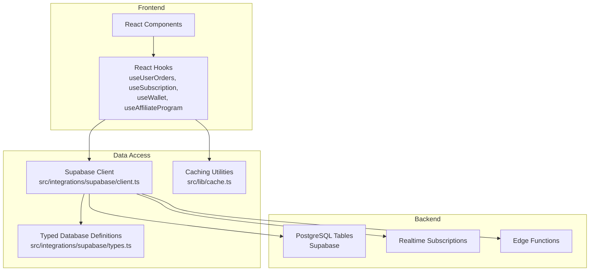
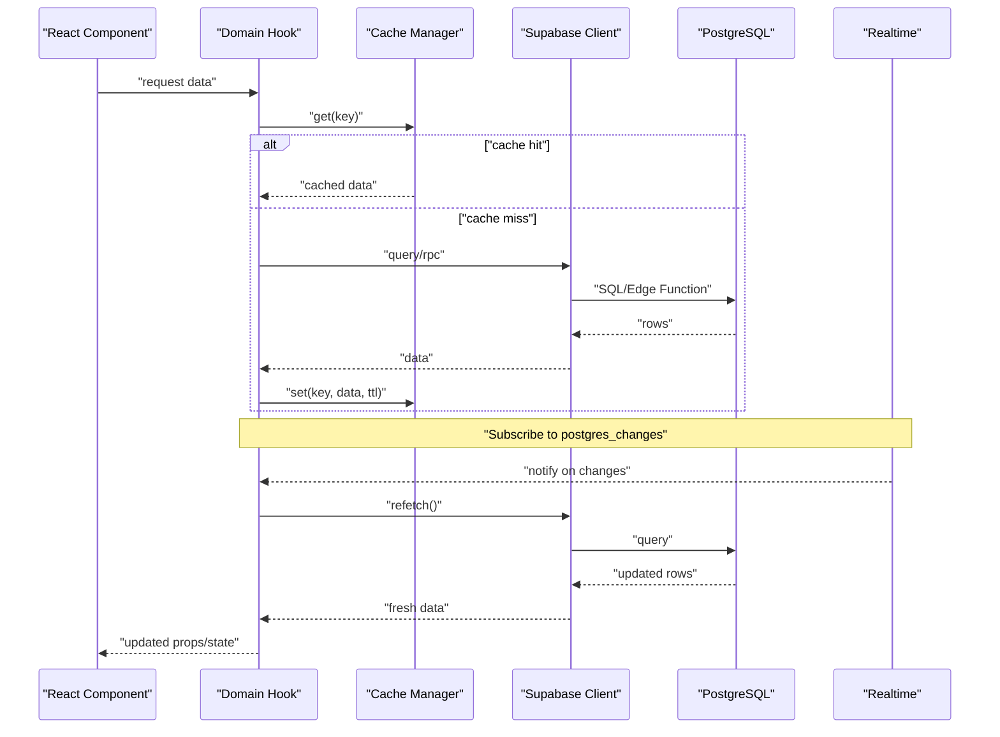
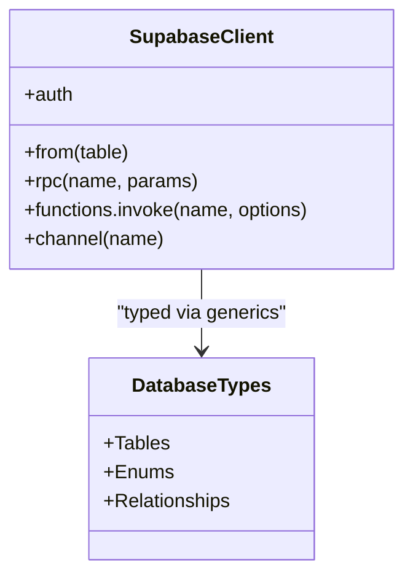
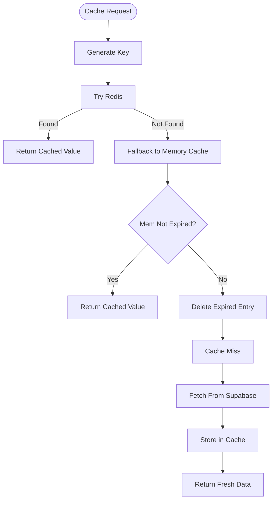
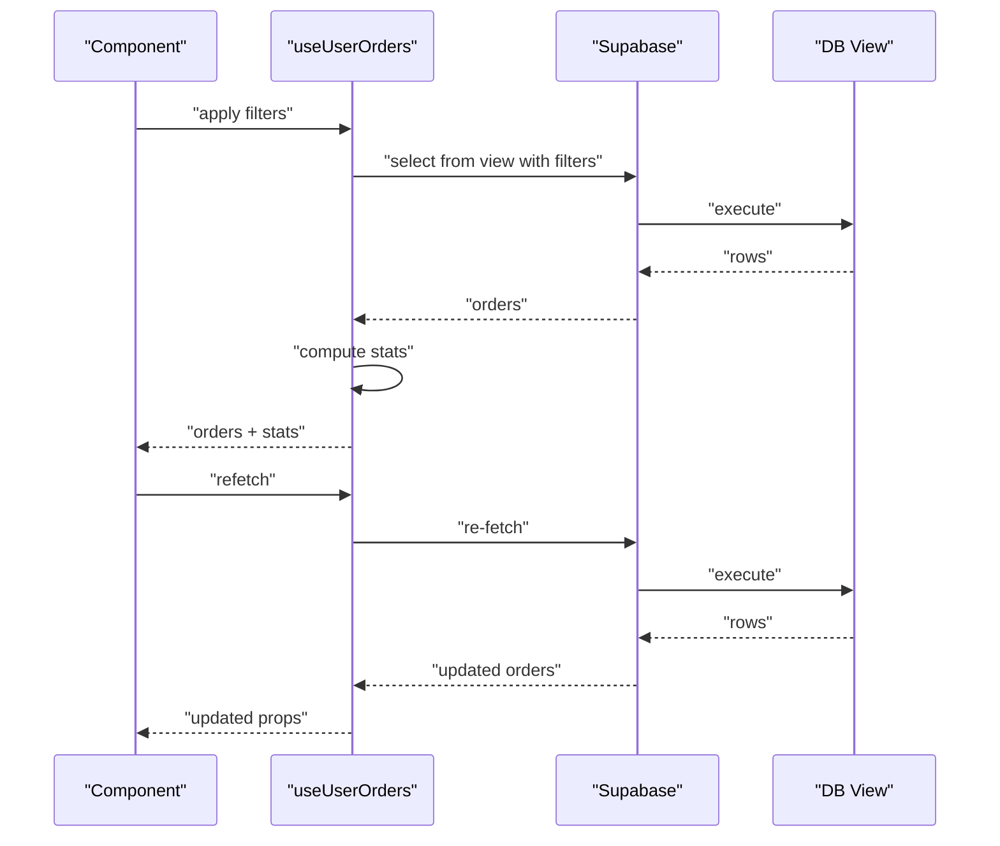
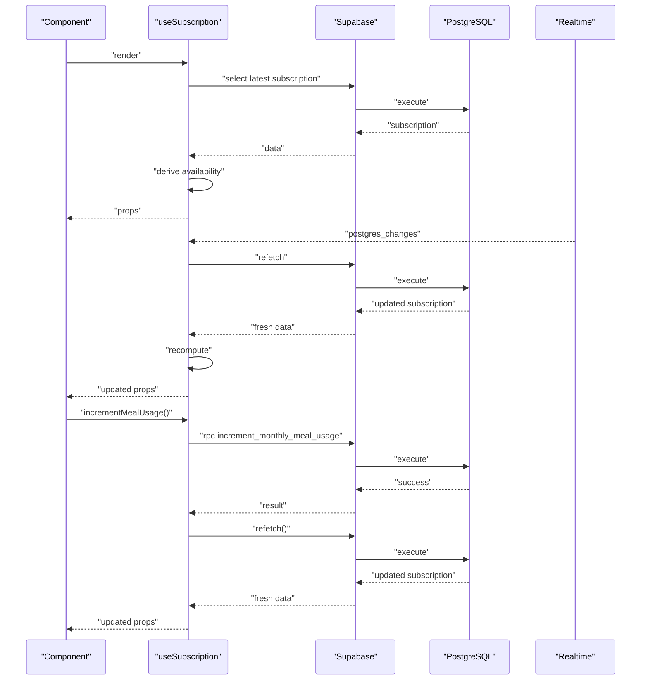
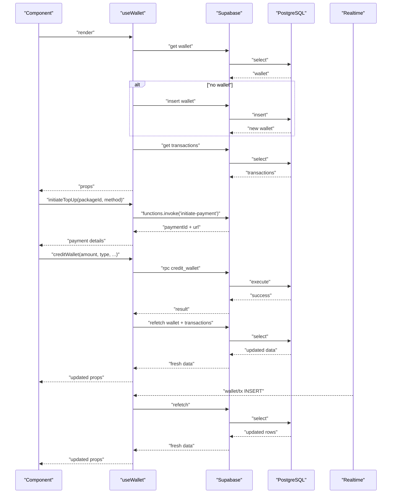
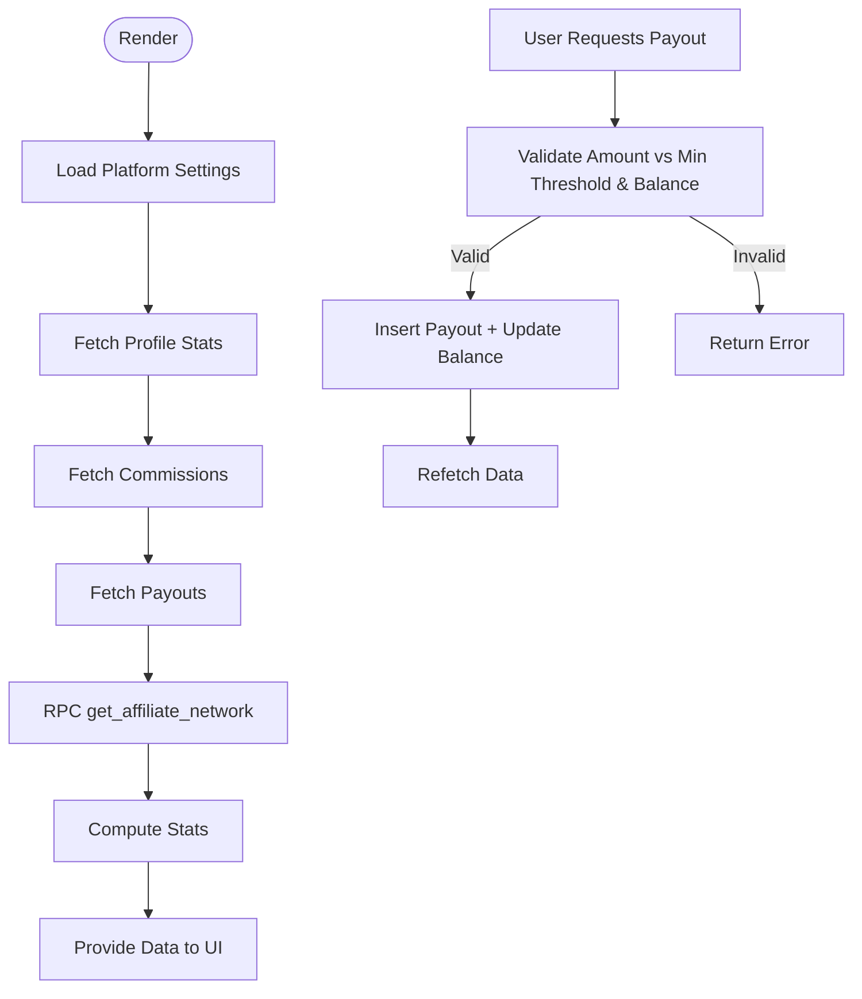
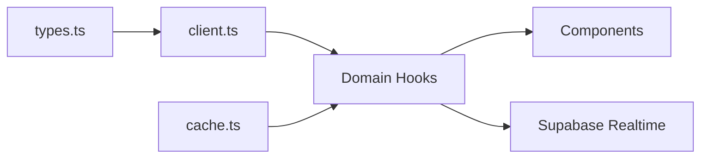

# Data Flow Patterns

<cite>
**Referenced Files in This Document**
- [client.ts](file://src/integrations/supabase/client.ts)
- [types.ts](file://src/integrations/supabase/types.ts)
- [cache.ts](file://src/lib/cache.ts)
- [useUserOrders.ts](file://src/hooks/useUserOrders.ts)
- [useSubscription.ts](file://src/hooks/useSubscription.ts)
- [useWallet.ts](file://src/hooks/useWallet.ts)
- [useAffiliateProgram.ts](file://src/hooks/useAffiliateProgram.ts)
</cite>

## Table of Contents
1. [Introduction](#introduction)
2. [Project Structure](#project-structure)
3. [Core Components](#core-components)
4. [Architecture Overview](#architecture-overview)
5. [Detailed Component Analysis](#detailed-component-analysis)
6. [Dependency Analysis](#dependency-analysis)
7. [Performance Considerations](#performance-considerations)
8. [Troubleshooting Guide](#troubleshooting-guide)
9. [Conclusion](#conclusion)

## Introduction
This document explains the data flow patterns in the Nutrio application, focusing on:
- How Supabase serves as the backend for server state
- How Supabase real-time subscriptions keep the UI synchronized
- How local React hooks encapsulate data fetching and mutations
- How caching strategies improve performance and resilience
- How optimistic updates and cache invalidation maintain consistency

It synthesizes the Supabase client configuration, typed database definitions, caching utilities, and domain-specific hooks to show the end-to-end lifecycle of data from the database to the UI.

## Project Structure
The data flow spans three layers:
- Backend: Supabase (PostgreSQL, Edge Functions, Realtime)
- Data Access: Supabase client and typed database definitions
- Frontend: React hooks that fetch, mutate, and subscribe to data

**Diagram sources**
- [client.ts](file://src/integrations/supabase/client.ts)
- [types.ts](file://src/integrations/supabase/types.ts)
- [cache.ts](file://src/lib/cache.ts)
- [useUserOrders.ts](file://src/hooks/useUserOrders.ts)
- [useSubscription.ts](file://src/hooks/useSubscription.ts)
- [useWallet.ts](file://src/hooks/useWallet.ts)
- [useAffiliateProgram.ts](file://src/hooks/useAffiliateProgram.ts)

**Section sources**
- [client.ts](file://src/integrations/supabase/client.ts)
- [types.ts](file://src/integrations/supabase/types.ts)
- [cache.ts](file://src/lib/cache.ts)

## Core Components
- Supabase client configured with Capacitor-compatible storage for sessions and persisted auth state
- Typed database definitions for strong typing across the stack
- Domain-specific hooks that encapsulate:
  - Data fetching and filtering
  - Real-time subscriptions
  - Mutations via Supabase SQL and Edge Functions
  - Local state management and derived computations
- A caching layer that supports Redis or in-memory fallback with TTL and pattern-based invalidation

Key responsibilities:
- useUserOrders: fetches user orders with filters, computes stats, and exposes refetch
- useSubscription: fetches active/pending/cancelled-but-valid subscriptions, exposes derived availability and usage, and subscribes to changes
- useWallet: manages wallet, transactions, top-up packages, initiates payments via Edge Functions, and subscribes to wallet and transaction updates
- useAffiliateProgram: loads platform settings, aggregates stats, and handles payouts
- cache.ts: provides get/set/delete/invalidatePattern with Redis or in-memory fallback

**Section sources**
- [client.ts](file://src/integrations/supabase/client.ts)
- [types.ts](file://src/integrations/supabase/types.ts)
- [cache.ts](file://src/lib/cache.ts)
- [useUserOrders.ts](file://src/hooks/useUserOrders.ts)
- [useSubscription.ts](file://src/hooks/useSubscription.ts)
- [useWallet.ts](file://src/hooks/useWallet.ts)
- [useAffiliateProgram.ts](file://src/hooks/useAffiliateProgram.ts)

## Architecture Overview
The data lifecycle follows a predictable flow:
- UI triggers a data operation (fetch, filter, mutate)
- Hook executes a Supabase query or RPC
- Optional caching layer checks and updates cache
- Real-time channels react to server changes and trigger refetches
- UI re-renders with fresh data

**Diagram sources**
- [client.ts](file://src/integrations/supabase/client.ts)
- [cache.ts](file://src/lib/cache.ts)
- [useSubscription.ts](file://src/hooks/useSubscription.ts)
- [useWallet.ts](file://src/hooks/useWallet.ts)

## Detailed Component Analysis

### Supabase Client and Typed Database
- The client initializes with environment variables and a Capacitor-compatible storage adapter for auth persistence
- The typed definitions enumerate tables, enums, and relationships, enabling compile-time safety for queries and mutations

**Diagram sources**
- [client.ts](file://src/integrations/supabase/client.ts)
- [types.ts](file://src/integrations/supabase/types.ts)

**Section sources**
- [client.ts](file://src/integrations/supabase/client.ts)
- [types.ts](file://src/integrations/supabase/types.ts)

### Caching Layer
- Provides get/set/delete/invalidatePattern with Redis or in-memory fallback
- Generates cache keys per domain (e.g., restaurant, meal, challenges)
- Used by domain fetchers to reduce latency and server load

**Diagram sources**
- [cache.ts](file://src/lib/cache.ts)

**Section sources**
- [cache.ts](file://src/lib/cache.ts)

### useUserOrders: Filtering, Stats, and Refetch
- Fetches from a materialized view with optional filters (meal type, status, date range)
- Computes derived stats client-side
- Exposes refetch to refresh after mutations

**Diagram sources**
- [useUserOrders.ts](file://src/hooks/useUserOrders.ts)

**Section sources**
- [useUserOrders.ts](file://src/hooks/useUserOrders.ts)

### useSubscription: Real-time Availability and Usage
- Fetches the most recent active/pending/cancelled-but-valid subscription
- Derives availability, weekly/monthly quotas, and whether a meal can be ordered
- Subscribes to postgres_changes on the subscriptions table for the user
- Uses RPCs for usage increments and rollover credit checks

**Diagram sources**
- [useSubscription.ts](file://src/hooks/useSubscription.ts)

**Section sources**
- [useSubscription.ts](file://src/hooks/useSubscription.ts)

### useWallet: Payments, Credits, and Real-time Updates
- Ensures a wallet exists for the user, otherwise inserts one
- Loads transactions and top-up packages
- Initiates payments via Edge Functions and credits wallet via RPC
- Subscribes to customer_wallets and wallet_transactions for live updates

**Diagram sources**
- [useWallet.ts](file://src/hooks/useWallet.ts)

**Section sources**
- [useWallet.ts](file://src/hooks/useWallet.ts)

### useAffiliateProgram: Settings, Stats, and Payouts
- Loads platform settings from a settings table
- Aggregates stats (earnings, pending, available, referrals by tier)
- Uses RPC to fetch hierarchical referral networks
- Handles payout requests with validation against settings and balances

**Diagram sources**
- [useAffiliateProgram.ts](file://src/hooks/useAffiliateProgram.ts)

**Section sources**
- [useAffiliateProgram.ts](file://src/hooks/useAffiliateProgram.ts)

## Dependency Analysis
- Hooks depend on the Supabase client for all data operations
- Real-time subscriptions are scoped per user/channel to minimize overhead
- Cache is orthogonal to hooks and can wrap repeated queries
- Typed database definitions underpin safe column and enum usage across the app

**Diagram sources**
- [types.ts](file://src/integrations/supabase/types.ts)
- [client.ts](file://src/integrations/supabase/client.ts)
- [cache.ts](file://src/lib/cache.ts)
- [useUserOrders.ts](file://src/hooks/useUserOrders.ts)
- [useSubscription.ts](file://src/hooks/useSubscription.ts)
- [useWallet.ts](file://src/hooks/useWallet.ts)
- [useAffiliateProgram.ts](file://src/hooks/useAffiliateProgram.ts)

**Section sources**
- [client.ts](file://src/integrations/supabase/client.ts)
- [types.ts](file://src/integrations/supabase/types.ts)
- [cache.ts](file://src/lib/cache.ts)
- [useUserOrders.ts](file://src/hooks/useUserOrders.ts)
- [useSubscription.ts](file://src/hooks/useSubscription.ts)
- [useWallet.ts](file://src/hooks/useWallet.ts)
- [useAffiliateProgram.ts](file://src/hooks/useAffiliateProgram.ts)

## Performance Considerations
- Selective re-rendering
  - Hooks expose minimal state and computed values; components should consume only required fields
  - Keep derived computations inside hooks to avoid recomputation in consumers
- Data normalization
  - Prefer normalized entities and lookup maps for related data (e.g., restaurant and meal references)
  - Use memoization for expensive computations (e.g., stats) in hooks
- Offline and resilience
  - Use the caching layer to serve stale data while refreshing in the background
  - Implement retry with exponential backoff for transient failures
- Real-time efficiency
  - Subscribe only to relevant channels and filters (per user/table)
  - Debounce frequent updates when appropriate
- Pagination and filtering
  - Use server-side filters and pagination to limit payload sizes
  - Combine with caching for frequently accessed slices

## Troubleshooting Guide
Common issues and remedies:
- Missing Supabase configuration
  - Ensure environment variables are present during build; the client logs a guard message if missing
- Real-time not updating
  - Verify channel filters match the user ID and table
  - Confirm permissions and RLS policies allow the events to propagate
- Cache inconsistencies
  - Use targeted invalidation after mutations (e.g., invalidate restaurant/meals)
  - Monitor TTLs to avoid serving stale data beyond acceptable windows
- RPC or Edge Function errors
  - Inspect returned errors and surface user-friendly messages
  - Validate inputs and constraints before invoking RPCs/functions

**Section sources**
- [client.ts](file://src/integrations/supabase/client.ts)
- [cache.ts](file://src/lib/cache.ts)
- [useSubscription.ts](file://src/hooks/useSubscription.ts)
- [useWallet.ts](file://src/hooks/useWallet.ts)

## Conclusion
Nutrio’s data flow combines Supabase’s robust SQL, real-time, and edge capabilities with React hooks that encapsulate fetching, mutations, and subscriptions. The caching layer improves responsiveness and resilience, while typed database definitions enhance reliability. Together, these patterns deliver a scalable, consistent, and user-responsive data experience across domains like orders, subscriptions, wallets, and affiliate programs.