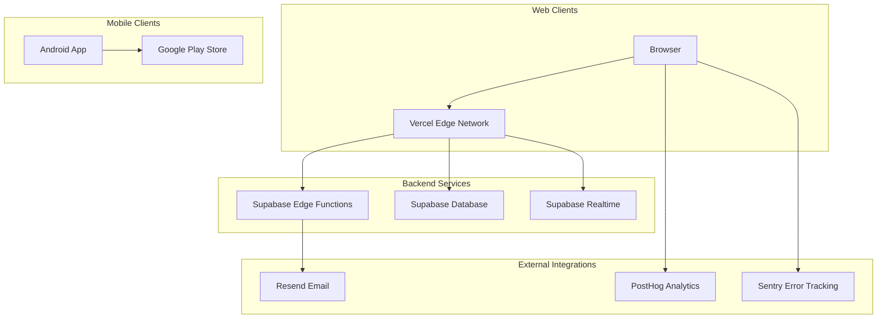
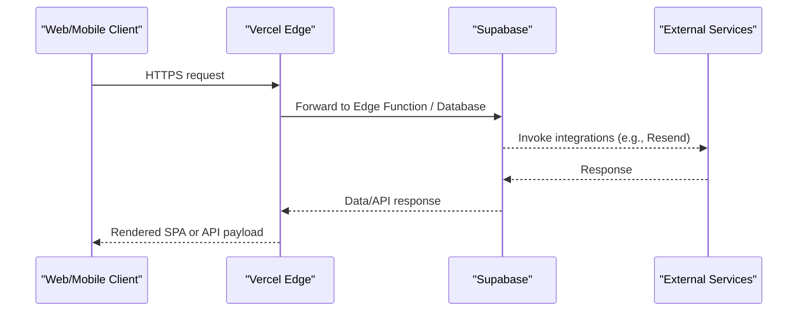
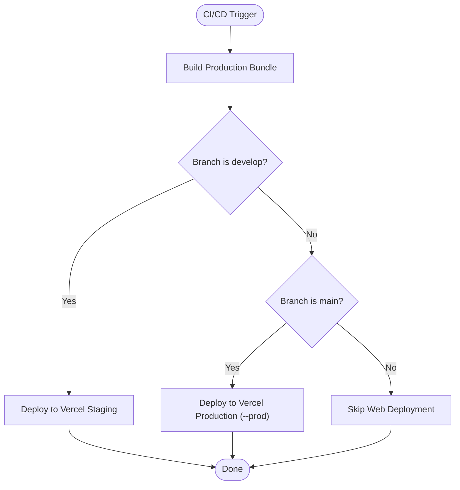
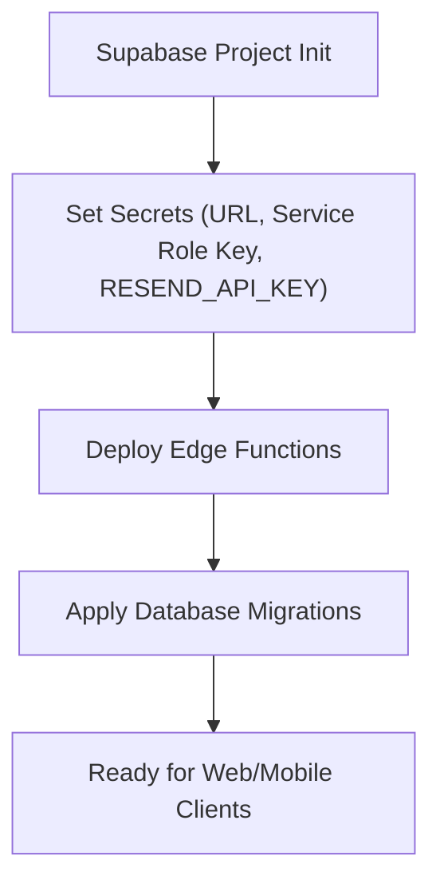
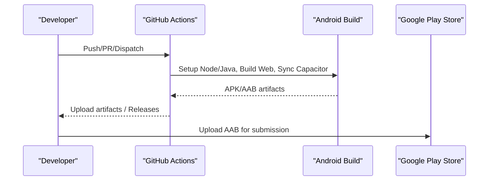
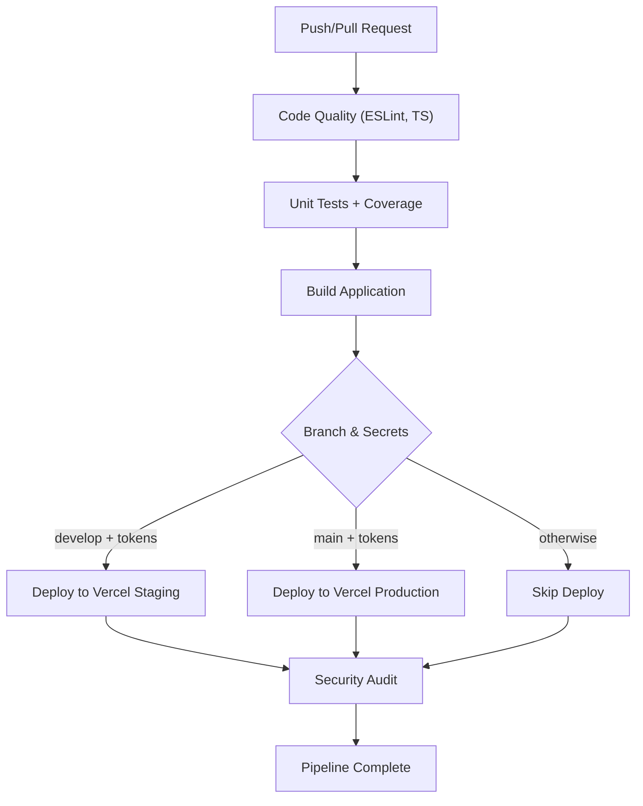
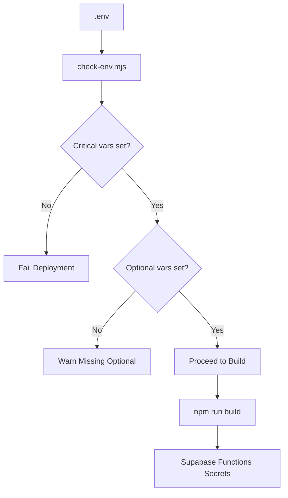
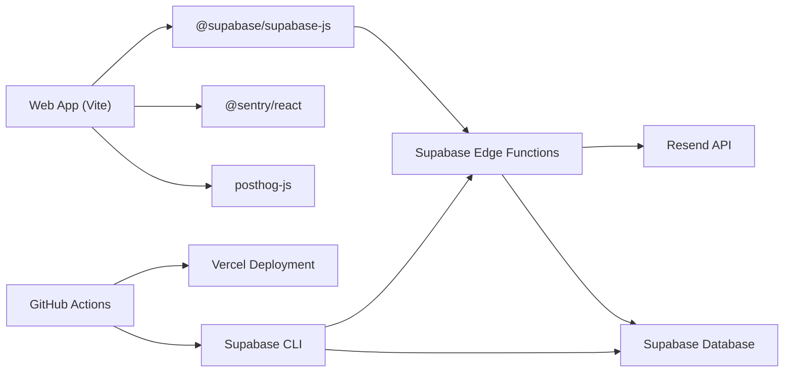

# Deployment Topology

<cite>
**Referenced Files in This Document**
- [vercel.json](file://vercel.json)
- [DEPLOYMENT.md](file://DEPLOYMENT.md)
- [DEPLOYMENT_SUMMARY.md](file://DEPLOYMENT_SUMMARY.md)
- [GITHUB_ACTIONS_SETUP.md](file://GITHUB_ACTIONS_SETUP.md)
- [.github/workflows/ci-cd.yml](file://.github/workflows/ci-cd.yml)
- [.github/workflows/build-android-apk.yml](file://.github/workflows/build-android-apk.yml)
- [.github/workflows/build-android-release.yml](file://.github/workflows/build-android-release.yml)
- [supabase/config.toml](file://supabase/config.toml)
- [supabase/functions/PHASE2_EDGE_FUNCTIONS.md](file://supabase/functions/PHASE2_EDGE_FUNCTIONS.md)
- [package.json](file://package.json)
- [deploy.mjs](file://deploy.mjs)
- [deploy.sh](file://deploy.sh)
- [deploy.bat](file://deploy.bat)
- [check-env.mjs](file://check-env.mjs)
</cite>

## Table of Contents
1. [Introduction](#introduction)
2. [Project Structure](#project-structure)
3. [Core Components](#core-components)
4. [Architecture Overview](#architecture-overview)
5. [Detailed Component Analysis](#detailed-component-analysis)
6. [Dependency Analysis](#dependency-analysis)
7. [Performance Considerations](#performance-considerations)
8. [Troubleshooting Guide](#troubleshooting-guide)
9. [Conclusion](#conclusion)
10. [Appendices](#appendices)

## Introduction
This document describes the deployment topology and infrastructure requirements for the Nutrio Fuel application. It covers:
- Multi-environment deployment strategy with Vercel for web, Supabase for backend services, and native app stores for mobile.
- CI/CD pipeline configuration across GitHub Actions for web, Android APK/AAB builds, and Supabase Edge Functions.
- Environment variable management and deployment automation.
- Infrastructure requirements including database scaling, edge function deployment, and CDN configuration.
- Domain management, SSL certificates, and monitoring setup.
- Deployment rollback procedures, blue-green deployment strategies, and performance monitoring.

## Project Structure
The deployment stack spans three primary environments:
- Web (React SPA): Built with Vite and hosted on Vercel.
- Backend (Supabase): Edge Functions, database, and real-time features.
- Mobile (Native apps): Android builds produced via GitHub Actions and distributed to stores.

**Diagram sources**
- [vercel.json:1-38](file://vercel.json#L1-L38)
- [supabase/config.toml:1-59](file://supabase/config.toml#L1-L59)
- [supabase/functions/PHASE2_EDGE_FUNCTIONS.md:1-411](file://supabase/functions/PHASE2_EDGE_FUNCTIONS.md#L1-L411)
- [.github/workflows/ci-cd.yml:1-197](file://.github/workflows/ci-cd.yml#L1-L197)
- [.github/workflows/build-android-apk.yml:1-142](file://.github/workflows/build-android-apk.yml#L1-L142)
- [.github/workflows/build-android-release.yml:1-148](file://.github/workflows/build-android-release.yml#L1-L148)

**Section sources**
- [vercel.json:1-38](file://vercel.json#L1-L38)
- [DEPLOYMENT.md:1-137](file://DEPLOYMENT.md#L1-L137)
- [DEPLOYMENT_SUMMARY.md:1-85](file://DEPLOYMENT_SUMMARY.md#L1-L85)
- [.github/workflows/ci-cd.yml:1-197](file://.github/workflows/ci-cd.yml#L1-L197)
- [.github/workflows/build-android-apk.yml:1-142](file://.github/workflows/build-android-apk.yml#L1-L142)
- [.github/workflows/build-android-release.yml:1-148](file://.github/workflows/build-android-release.yml#L1-L148)
- [supabase/config.toml:1-59](file://supabase/config.toml#L1-L59)

## Core Components
- Vercel-hosted web application with SPA routing and asset caching.
- Supabase Edge Functions for automation and integrations.
- Supabase Database with migrations and RLS policies.
- GitHub Actions CI/CD for web, Android APK/AAB builds, and security audits.
- Environment variable management for Supabase, Sentry, PostHog, and Resend.

Key responsibilities:
- Web: Serve React SPA, apply security headers, and route all paths to index.html.
- Backend: Provide Edge Functions, database, and realtime subscriptions.
- Mobile: Produce signed APK/AAB artifacts for distribution.

**Section sources**
- [vercel.json:1-38](file://vercel.json#L1-L38)
- [supabase/config.toml:1-59](file://supabase/config.toml#L1-L59)
- [supabase/functions/PHASE2_EDGE_FUNCTIONS.md:1-411](file://supabase/functions/PHASE2_EDGE_FUNCTIONS.md#L1-L411)
- [.github/workflows/ci-cd.yml:1-197](file://.github/workflows/ci-cd.yml#L1-L197)
- [.github/workflows/build-android-apk.yml:1-142](file://.github/workflows/build-android-apk.yml#L1-L142)
- [.github/workflows/build-android-release.yml:1-148](file://.github/workflows/build-android-release.yml#L1-L148)

## Architecture Overview
The system follows a decoupled architecture:
- Web clients connect to Vercel-hosted SPA and proxy API calls to Supabase Edge Functions and database.
- Mobile clients consume Supabase APIs directly and optionally integrate with store-specific distribution channels.
- Edge Functions encapsulate business logic and integrations (e.g., email, driver assignment, invoice generation).
- CI/CD automates builds, tests, and deployments across environments.

**Diagram sources**
- [vercel.json:1-38](file://vercel.json#L1-L38)
- [supabase/config.toml:1-59](file://supabase/config.toml#L1-L59)
- [supabase/functions/PHASE2_EDGE_FUNCTIONS.md:1-411](file://supabase/functions/PHASE2_EDGE_FUNCTIONS.md#L1-L411)

## Detailed Component Analysis

### Vercel Web Deployment
- Single Page Application with universal rewrite to index.html for client-side routing.
- Asset caching headers for static assets; security headers applied to all routes.
- CI/CD deploys to staging or production based on branch and secrets.

**Diagram sources**
- [.github/workflows/ci-cd.yml:112-169](file://.github/workflows/ci-cd.yml#L112-L169)

**Section sources**
- [vercel.json:1-38](file://vercel.json#L1-L38)
- [.github/workflows/ci-cd.yml:112-169](file://.github/workflows/ci-cd.yml#L112-L169)

### Supabase Backend Services
- Edge Functions configured in config.toml; multiple functions documented for automation.
- Environment variables managed via Supabase secrets and injected at runtime.
- Database migrations and RLS policies support secure, scalable data access.

**Diagram sources**
- [supabase/config.toml:1-59](file://supabase/config.toml#L1-L59)
- [supabase/functions/PHASE2_EDGE_FUNCTIONS.md:175-221](file://supabase/functions/PHASE2_EDGE_FUNCTIONS.md#L175-L221)

**Section sources**
- [supabase/config.toml:1-59](file://supabase/config.toml#L1-L59)
- [supabase/functions/PHASE2_EDGE_FUNCTIONS.md:1-411](file://supabase/functions/PHASE2_EDGE_FUNCTIONS.md#L1-L411)
- [DEPLOYMENT.md:26-52](file://DEPLOYMENT.md#L26-L52)

### Mobile App Deployment (Android)
- GitHub Actions workflows produce APK (debug/release) and AAB (release bundle) artifacts.
- Optional keystore signing for production distributions.
- Artifacts published as GitHub Releases for distribution.

**Diagram sources**
- [.github/workflows/build-android-apk.yml:1-142](file://.github/workflows/build-android-apk.yml#L1-L142)
- [.github/workflows/build-android-release.yml:1-148](file://.github/workflows/build-android-release.yml#L1-L148)

**Section sources**
- [.github/workflows/build-android-apk.yml:1-142](file://.github/workflows/build-android-apk.yml#L1-L142)
- [.github/workflows/build-android-release.yml:1-148](file://.github/workflows/build-android-release.yml#L1-L148)
- [GITHUB_ACTIONS_SETUP.md:1-318](file://GITHUB_ACTIONS_SETUP.md#L1-L318)

### CI/CD Pipeline Configuration
- Multi-job pipeline: quality checks, unit tests, build, optional staging/production deployment, security audit.
- Environment variables injected from GitHub secrets for Supabase and observability.
- Conditional deployment to Vercel based on branch and presence of tokens.

**Diagram sources**
- [.github/workflows/ci-cd.yml:1-197](file://.github/workflows/ci-cd.yml#L1-L197)

**Section sources**
- [.github/workflows/ci-cd.yml:1-197](file://.github/workflows/ci-cd.yml#L1-L197)
- [package.json:7-43](file://package.json#L7-L43)

### Environment Variable Management
- Web build requires Supabase keys; optional Sentry, PostHog, and Resend keys for monitoring and email.
- Local deployment scripts validate critical variables and warn on missing optional ones.
- CI injects secrets at build time; Supabase functions rely on Supabase secrets.

**Diagram sources**
- [check-env.mjs:1-52](file://check-env.mjs#L1-L52)
- [.github/workflows/ci-cd.yml:94-101](file://.github/workflows/ci-cd.yml#L94-L101)
- [supabase/functions/PHASE2_EDGE_FUNCTIONS.md:10-21](file://supabase/functions/PHASE2_EDGE_FUNCTIONS.md#L10-L21)

**Section sources**
- [check-env.mjs:1-52](file://check-env.mjs#L1-L52)
- [DEPLOYMENT.md:69-78](file://DEPLOYMENT.md#L69-L78)
- [.github/workflows/ci-cd.yml:94-101](file://.github/workflows/ci-cd.yml#L94-L101)
- [supabase/functions/PHASE2_EDGE_FUNCTIONS.md:10-21](file://supabase/functions/PHASE2_EDGE_FUNCTIONS.md#L10-L21)

### Deployment Automation Scripts
- Cross-platform scripts orchestrate Supabase Edge Function deployment, database migrations, build, and hosting deployment.
- Shell scripts wrap the same steps for Unix-like systems; batch script targets Windows.

**Section sources**
- [deploy.mjs:1-91](file://deploy.mjs#L1-L91)
- [deploy.sh:1-32](file://deploy.sh#L1-L32)
- [deploy.bat:1-33](file://deploy.bat#L1-L33)

## Dependency Analysis
- Web depends on Supabase client libraries and environment variables for API keys.
- Edge Functions depend on Supabase secrets and external services (e.g., Resend).
- CI/CD depends on GitHub secrets for Vercel and Supabase tokens.

**Diagram sources**
- [package.json:44-126](file://package.json#L44-L126)
- [supabase/config.toml:1-59](file://supabase/config.toml#L1-L59)
- [.github/workflows/ci-cd.yml:1-197](file://.github/workflows/ci-cd.yml#L1-L197)

**Section sources**
- [package.json:44-126](file://package.json#L44-L126)
- [supabase/config.toml:1-59](file://supabase/config.toml#L1-L59)
- [.github/workflows/ci-cd.yml:1-197](file://.github/workflows/ci-cd.yml#L1-L197)

## Performance Considerations
- CDN and edge caching: Vercel’s global edge network caches static assets and serves SPA routes efficiently.
- Asset optimization: Use Vite build outputs and ensure long-lived caching for immutable assets.
- Database scaling: Plan Supabase Pro tier for increased throughput and concurrency; monitor query performance and add indexes as needed.
- Edge Function cold starts: Keep functions small and minimize cold start impact; consider function grouping and warm-up strategies if necessary.
- Observability: Enable Sentry and PostHog to track performance regressions and user behavior.

[No sources needed since this section provides general guidance]

## Troubleshooting Guide
Common issues and resolutions:
- Supabase CLI not found: Install globally via npm; scripts will detect and install if missing.
- Function deployment errors: Check Supabase dashboard for logs; verify function syntax and secrets.
- Database migration conflicts: Reset database using Supabase CLI (data will be lost); re-apply migrations.
- Missing environment variables: Use the environment checker script; configure .env and GitHub secrets accordingly.
- Android build failures: Verify Node/Java versions, Gradle permissions, and keystore configuration if signing.

**Section sources**
- [DEPLOYMENT.md:96-137](file://DEPLOYMENT.md#L96-L137)
- [check-env.mjs:29-51](file://check-env.mjs#L29-L51)
- [.github/workflows/build-android-apk.yml:206-234](file://.github/workflows/build-android-apk.yml#L206-L234)
- [.github/workflows/build-android-release.yml:64-106](file://.github/workflows/build-android-release.yml#L64-L106)

## Conclusion
The deployment topology leverages Vercel for fast, secure web delivery, Supabase for scalable backend services and Edge Functions, and GitHub Actions for robust CI/CD across web and mobile. With environment variable management, security headers, and observability integrated, the system supports reliable multi-environment deployments and operational excellence.

[No sources needed since this section summarizes without analyzing specific files]

## Appendices

### Multi-Environment Deployment Strategy
- Development: Local builds and testing.
- Staging: Deployed from develop branch via CI/CD to Vercel staging.
- Production: Deployed from main branch via CI/CD to Vercel production.

**Section sources**
- [.github/workflows/ci-cd.yml:112-169](file://.github/workflows/ci-cd.yml#L112-L169)

### Rollback Procedures
- Web: Redeploy previous commit or use Vercel’s rollback to earlier versions.
- Backend: Revert code and redeploy Edge Functions; restore database from backups if needed.
- Mobile: Revoke or replace distribution keys and re-upload signed artifacts.

**Section sources**
- [DEPLOYMENT.md:124-131](file://DEPLOYMENT.md#L124-L131)

### Blue-Green Deployment Strategy
- Maintain two identical environments behind a load balancer or CDN endpoint switch.
- Route traffic to the inactive environment during deployment; switch after validation.

[No sources needed since this section provides general guidance]

### Infrastructure Requirements
- Database scaling: Upgrade to Supabase Pro tier for higher limits and performance.
- Edge functions: Keep functions minimal; group related functions; monitor logs and performance.
- CDN configuration: Rely on Vercel’s edge caching; configure custom domains and SSL in Vercel settings.

**Section sources**
- [DEPLOYMENT_SUMMARY.md:46-51](file://DEPLOYMENT_SUMMARY.md#L46-L51)
- [vercel.json:1-38](file://vercel.json#L1-L38)

### Domain Management and SSL Certificates
- Configure custom domains in Vercel; SSL certificates are managed automatically by Vercel.
- For Supabase, ensure custom domains and SSL are configured in the Supabase dashboard if using custom endpoints.

[No sources needed since this section provides general guidance]

### Monitoring Setup
- Error tracking: Sentry for frontend and Edge Function error reporting.
- Analytics: PostHog for behavioral insights.
- Database and function monitoring: Supabase dashboard and function logs.

**Section sources**
- [DEPLOYMENT.md:117-122](file://DEPLOYMENT.md#L117-L122)
- [supabase/functions/PHASE2_EDGE_FUNCTIONS.md:337-351](file://supabase/functions/PHASE2_EDGE_FUNCTIONS.md#L337-L351)