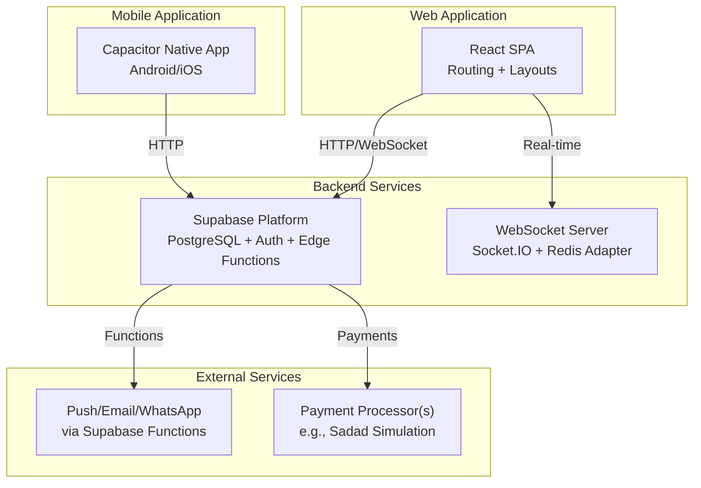
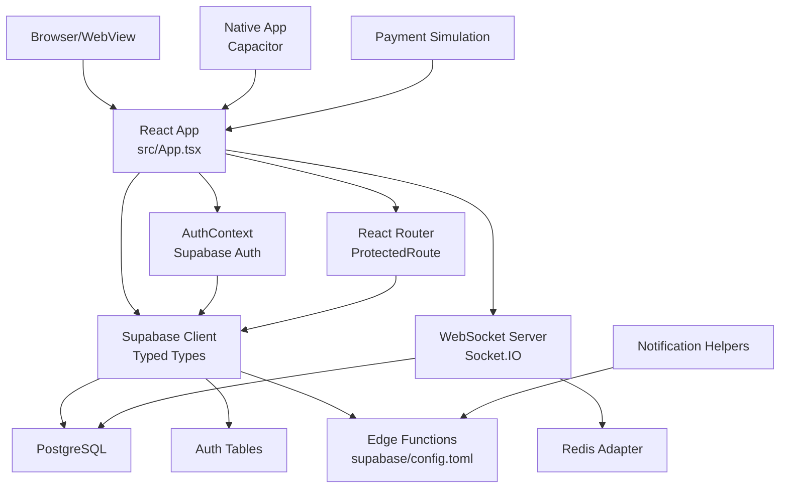
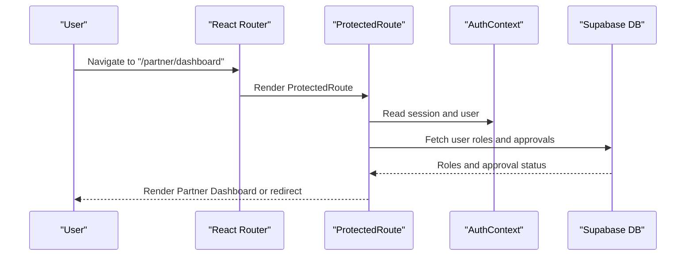
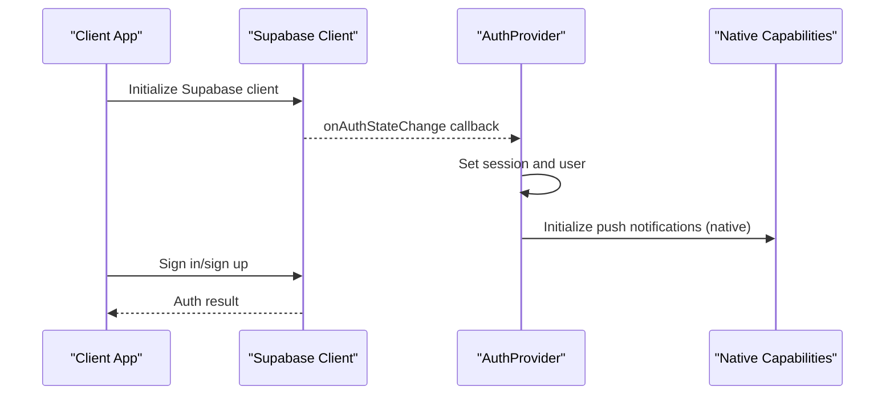
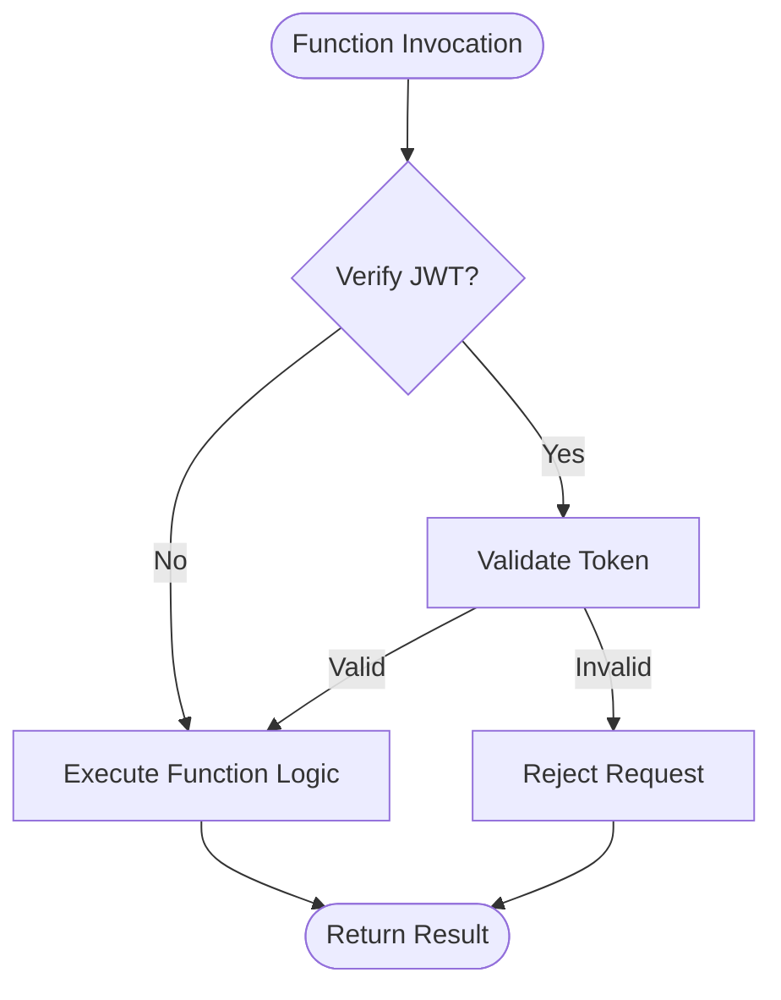
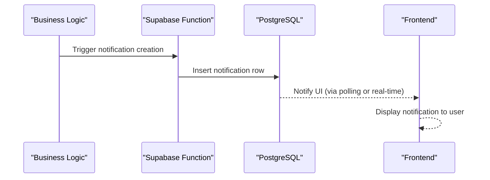
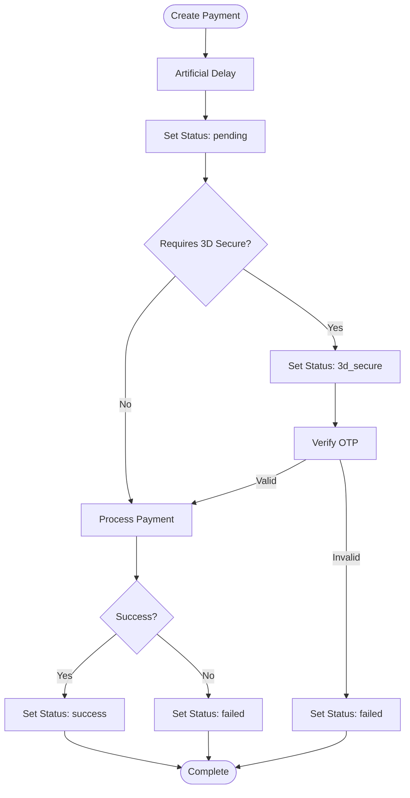
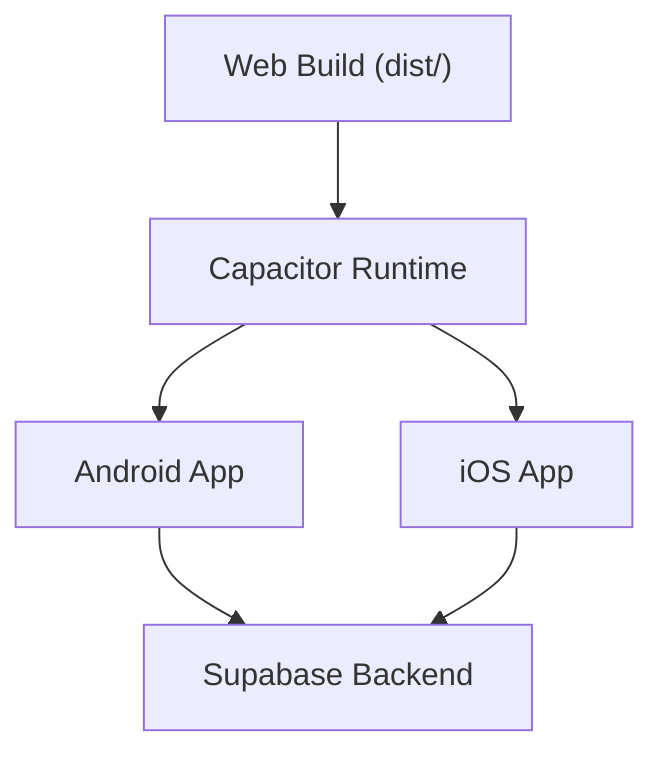
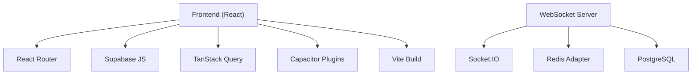

# Overall System Design

<cite>
**Referenced Files in This Document**
- [package.json](file://package.json)
- [vite.config.ts](file://vite.config.ts)
- [capacitor.config.ts](file://capacitor.config.ts)
- [src/App.tsx](file://src/App.tsx)
- [src/main.tsx](file://src/main.tsx)
- [src/contexts/AuthContext.tsx](file://src/contexts/AuthContext.tsx)
- [src/components/ProtectedRoute.tsx](file://src/components/ProtectedRoute.tsx)
- [src/integrations/supabase/client.ts](file://src/integrations/supabase/client.ts)
- [src/integrations/supabase/types.ts](file://src/integrations/supabase/types.ts)
- [supabase/config.toml](file://supabase/config.toml)
- [src/lib/notifications.ts](file://src/lib/notifications.ts)
- [src/lib/payment-simulation.ts](file://src/lib/payment-simulation.ts)
- [src/fleet/routes.tsx](file://src/fleet/routes.tsx)
- [websocket-server/package.json](file://websocket-server/package.json)
</cite>

## Table of Contents
1. [Introduction](#introduction)
2. [Project Structure](#project-structure)
3. [Core Components](#core-components)
4. [Architecture Overview](#architecture-overview)
5. [Detailed Component Analysis](#detailed-component-analysis)
6. [Dependency Analysis](#dependency-analysis)
7. [Performance Considerations](#performance-considerations)
8. [Troubleshooting Guide](#troubleshooting-guide)
9. [Conclusion](#conclusion)

## Introduction
This document describes the overall system design of the Nutrio application, a multi-portal platform serving customers, partners, drivers, and administrators through a unified React web application integrated with a Supabase backend and native mobile experiences via Apache Cordova/ Capacitor. The system emphasizes a single-codebase, multi-portal routing strategy, centralized authentication and authorization, real-time capabilities for fleet operations, and scalable backend services orchestrated through Supabase Edge Functions and a dedicated WebSocket server.

## Project Structure
The repository is organized around:
- Frontend: React application built with Vite, supporting both web and native packaging via Capacitor.
- Backend: Supabase-managed PostgreSQL with Edge Functions for business logic and event-driven automation.
- Mobile: Capacitor integration enabling Android and iOS builds with native device features.
- Real-time: Dedicated WebSocket server for live fleet tracking and operational coordination.
- Testing and CI/CD: Playwright end-to-end tests spanning cross-portal workflows.



**Diagram sources**
- [src/App.tsx:139-739](file://src/App.tsx#L139-L739)
- [capacitor.config.ts:3-42](file://capacitor.config.ts#L3-L42)
- [supabase/config.toml:1-59](file://supabase/config.toml#L1-L59)
- [websocket-server/package.json:1-44](file://websocket-server/package.json#L1-L44)

**Section sources**
- [package.json:1-159](file://package.json#L1-L159)
- [vite.config.ts:1-77](file://vite.config.ts#L1-L77)
- [capacitor.config.ts:1-45](file://capacitor.config.ts#L1-L45)

## Core Components
- Unified Routing and Layouts: A single React application defines routes for customer, partner, admin, driver, and fleet portals, with protected routes enforcing role-based access and optional approval checks.
- Authentication and Authorization: Centralized via Supabase Auth with session persistence, IP checks, and role discovery from database tables.
- Supabase Integration: Typed database client with Capacitor-aware storage for native sessions and JWT-based auth.
- Real-time Communication: WebSocket server for live fleet tracking and driver dispatching; Supabase Edge Functions for notifications and operational automation.
- Payment Simulation: In-development payment flow simulation for testing and QA without live transactions.
- Native Mobile: Capacitor configuration enabling secure navigation to Supabase domains, push notifications, and native biometric authentication.

**Section sources**
- [src/App.tsx:139-739](file://src/App.tsx#L139-L739)
- [src/contexts/AuthContext.tsx:1-131](file://src/contexts/AuthContext.tsx#L1-L131)
- [src/components/ProtectedRoute.tsx:1-264](file://src/components/ProtectedRoute.tsx#L1-L264)
- [src/integrations/supabase/client.ts:1-57](file://src/integrations/supabase/client.ts#L1-L57)
- [src/lib/notifications.ts:1-114](file://src/lib/notifications.ts#L1-L114)
- [src/lib/payment-simulation.ts:1-223](file://src/lib/payment-simulation.ts#L1-L223)
- [capacitor.config.ts:3-42](file://capacitor.config.ts#L3-L42)

## Architecture Overview
The system follows a multi-portal, single-page application architecture with Supabase as the backend backbone and a separate WebSocket server for real-time fleet operations. The web app and native app share the same routing logic and authentication, while Supabase handles identity, data, and serverless functions.



**Diagram sources**
- [src/App.tsx:139-739](file://src/App.tsx#L139-L739)
- [src/contexts/AuthContext.tsx:31-61](file://src/contexts/AuthContext.tsx#L31-L61)
- [src/components/ProtectedRoute.tsx:139-189](file://src/components/ProtectedRoute.tsx#L139-L189)
- [src/integrations/supabase/client.ts:47-57](file://src/integrations/supabase/client.ts#L47-L57)
- [supabase/config.toml:1-59](file://supabase/config.toml#L1-L59)
- [websocket-server/package.json:21-29](file://websocket-server/package.json#L21-L29)

## Detailed Component Analysis

### Multi-Portal Routing and Access Control
The application defines a unified routing tree that exposes distinct portals behind role-based protection. ProtectedRoute resolves user roles from the database, supports role hierarchy, and enforces approval requirements for partner routes. It redirects unauthenticated users to the login page and unauthorized users to their appropriate portal home.



**Diagram sources**
- [src/App.tsx:364-470](file://src/App.tsx#L364-L470)
- [src/components/ProtectedRoute.tsx:139-230](file://src/components/ProtectedRoute.tsx#L139-L230)
- [src/contexts/AuthContext.tsx:31-61](file://src/contexts/AuthContext.tsx#L31-L61)

**Section sources**
- [src/App.tsx:174-727](file://src/App.tsx#L174-L727)
- [src/components/ProtectedRoute.tsx:1-264](file://src/components/ProtectedRoute.tsx#L1-L264)

### Authentication and Session Management
Authentication is handled centrally by Supabase Auth. The AuthProvider subscribes to auth state changes, initializes push notifications on native platforms upon sign-in, and persists sessions using Capacitor Preferences on native devices or localStorage on the web. Sign-up and sign-in flows integrate with IP location checks and redirect handling.



**Diagram sources**
- [src/contexts/AuthContext.tsx:31-61](file://src/contexts/AuthContext.tsx#L31-L61)
- [src/integrations/supabase/client.ts:47-57](file://src/integrations/supabase/client.ts#L47-L57)
- [capacitor.config.ts:30-32](file://capacitor.config.ts#L30-L32)

**Section sources**
- [src/contexts/AuthContext.tsx:1-131](file://src/contexts/AuthContext.tsx#L1-L131)
- [src/integrations/supabase/client.ts:1-57](file://src/integrations/supabase/client.ts#L1-L57)

### Supabase Backend and Edge Functions
Supabase provides the relational data layer, authentication, and serverless functions. The configuration file disables JWT verification for selected functions, indicating direct invocation paths for operational tasks such as reminders, notifications, analytics, and subscription management.



**Diagram sources**
- [supabase/config.toml:3-59](file://supabase/config.toml#L3-L59)

**Section sources**
- [supabase/config.toml:1-59](file://supabase/config.toml#L1-L59)
- [src/integrations/supabase/types.ts:1-800](file://src/integrations/supabase/types.ts#L1-L800)

### Real-Time Communication for Fleet Operations
The WebSocket server enables real-time tracking and dispatching for fleet management. It leverages Socket.IO with a Redis adapter for horizontal scaling and integrates with PostgreSQL for operational data.

```mermaid
graph LR
Clients["Fleet Clients"] < --> |Socket.IO| WS["WebSocket Server"]
WS < --> |Redis| Redis["Redis Adapter"]
WS < --> |PostgreSQL| DB["PostgreSQL"]
```

**Diagram sources**
- [websocket-server/package.json:21-29](file://websocket-server/package.json#L21-L29)

**Section sources**
- [websocket-server/package.json:1-44](file://websocket-server/package.json#L1-L44)
- [src/fleet/routes.tsx:1-42](file://src/fleet/routes.tsx#L1-L42)

### Notification System
Notifications are persisted to the database and triggered by Supabase Edge Functions. The frontend provides helper functions to create notifications for order updates, driver assignments, and delivery claims.



**Diagram sources**
- [src/lib/notifications.ts:18-35](file://src/lib/notifications.ts#L18-L35)

**Section sources**
- [src/lib/notifications.ts:1-114](file://src/lib/notifications.ts#L1-L114)

### Payment Simulation
The payment simulation service simulates end-to-end payment flows for testing, including initiation, 3D Secure steps, and outcomes. It maintains in-memory state and notifies subscribers of status changes.



**Diagram sources**
- [src/lib/payment-simulation.ts:25-209](file://src/lib/payment-simulation.ts#L25-L209)

**Section sources**
- [src/lib/payment-simulation.ts:1-223](file://src/lib/payment-simulation.ts#L1-L223)

### Native Mobile Integration
Capacitor configures the native app shell, including splash screen, push/local notifications, and allowlisted domains for navigation. The web app is served from the Capacitor webDir and can proxy to the Vite dev server during development.



**Diagram sources**
- [capacitor.config.ts:3-42](file://capacitor.config.ts#L3-L42)
- [vite.config.ts:52-75](file://vite.config.ts#L52-L75)

**Section sources**
- [capacitor.config.ts:1-45](file://capacitor.config.ts#L1-L45)
- [vite.config.ts:1-77](file://vite.config.ts#L1-L77)

## Dependency Analysis
The frontend depends on React, React Router, Supabase JS client, TanStack React Query for caching, and Capacitor plugins for native features. The build pipeline uses Vite with optimized chunking and source maps. The WebSocket server depends on Socket.IO, Redis adapter, and PostgreSQL.



**Diagram sources**
- [package.json:44-126](file://package.json#L44-L126)
- [websocket-server/package.json:21-29](file://websocket-server/package.json#L21-L29)

**Section sources**
- [package.json:1-159](file://package.json#L1-L159)
- [websocket-server/package.json:1-44](file://websocket-server/package.json#L1-L44)

## Performance Considerations
- Frontend
  - Code splitting and lazy loading for portal pages reduce initial bundle size.
  - Manual chunking groups vendor libraries for improved caching.
  - Source maps enabled for production error tracking.
- Backend
  - Edge Functions configured per endpoint; disabling JWT verification reduces overhead for internal invocations.
  - Consider adding rate limiting and circuit breakers for external integrations.
- Real-time
  - Redis adapter ensures horizontal scalability for WebSocket connections.
  - Keepalive and heartbeat configurations should be tuned for mobile networks.

[No sources needed since this section provides general guidance]

## Troubleshooting Guide
- Authentication Issues
  - Verify Supabase URL and publishable key environment variables are present in the build environment.
  - Check auth state listener initialization and session retrieval on app startup.
- Role-Based Access Problems
  - Confirm user roles exist in the database and cache TTL is sufficient.
  - Validate approval status for partner routes.
- Real-time Connectivity
  - Ensure WebSocket server is reachable and Redis adapter is configured.
  - Verify CORS and domain allowlists for native navigation.
- Payment Simulation
  - Confirm simulation mode is enabled via environment variable and inspect in-memory state for debugging.

**Section sources**
- [src/integrations/supabase/client.ts:10-16](file://src/integrations/supabase/client.ts#L10-L16)
- [src/contexts/AuthContext.tsx:31-61](file://src/contexts/AuthContext.tsx#L31-L61)
- [src/components/ProtectedRoute.tsx:40-98](file://src/components/ProtectedRoute.tsx#L40-L98)
- [websocket-server/package.json:21-29](file://websocket-server/package.json#L21-L29)
- [src/lib/payment-simulation.ts:214-223](file://src/lib/payment-simulation.ts#L214-L223)

## Conclusion
Nutrio’s system design centers on a unified React application with Supabase as the backend, enabling seamless multi-portal experiences for customers, partners, drivers, and administrators. The architecture leverages Supabase Auth and Edge Functions for identity and serverless logic, while a dedicated WebSocket server powers real-time fleet operations. Capacitor integration delivers native capabilities across Android and iOS. With careful attention to authentication, role-based access, and real-time communication, the platform scales efficiently and remains maintainable.