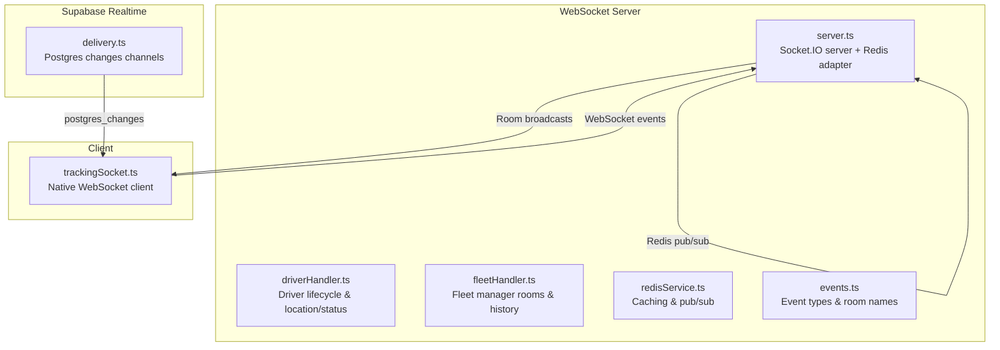
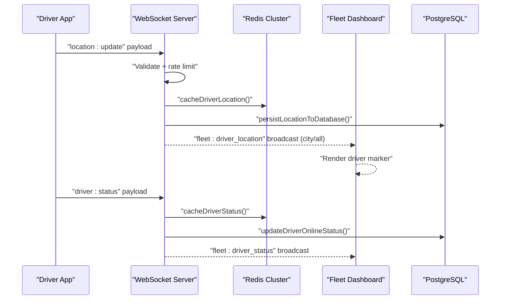
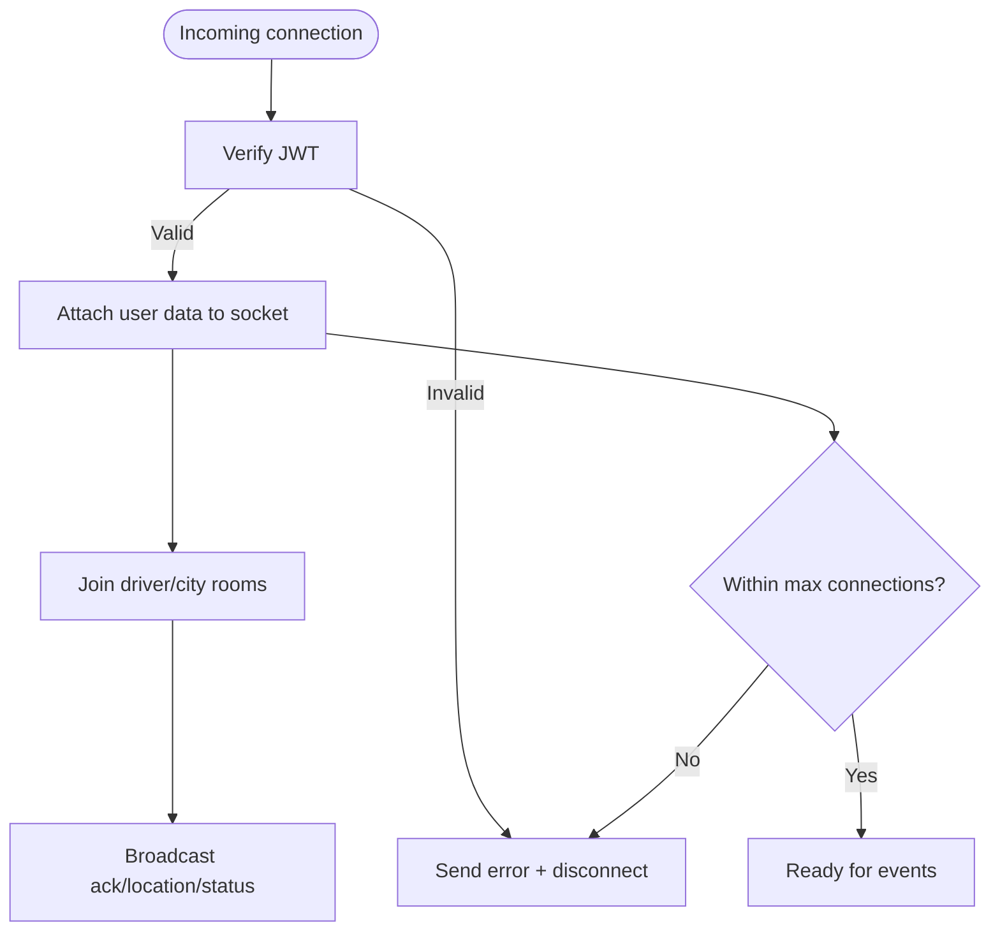
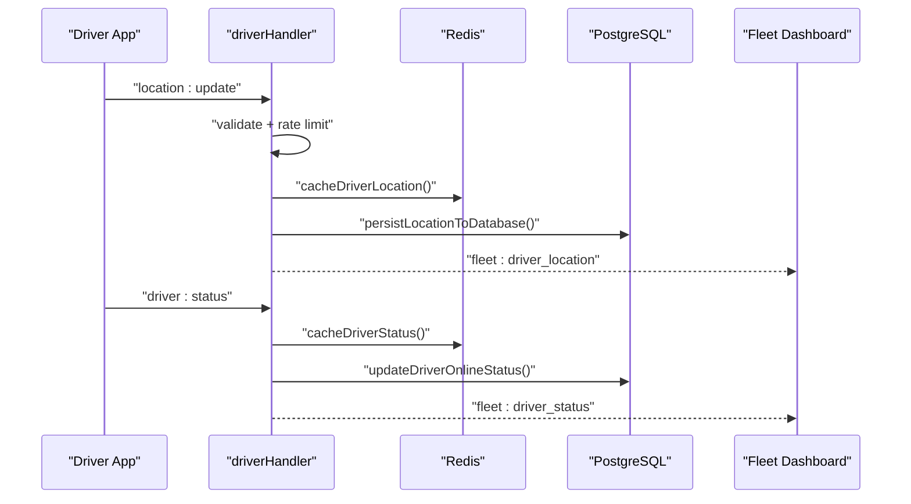
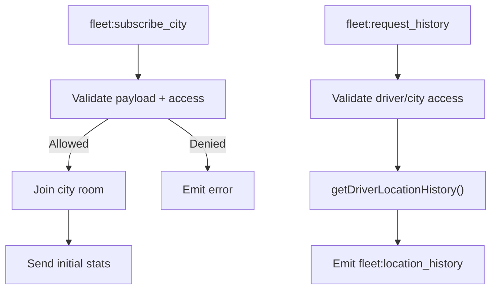
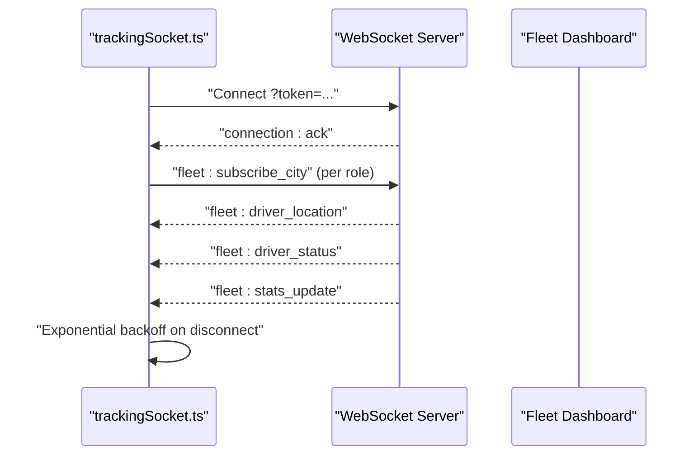
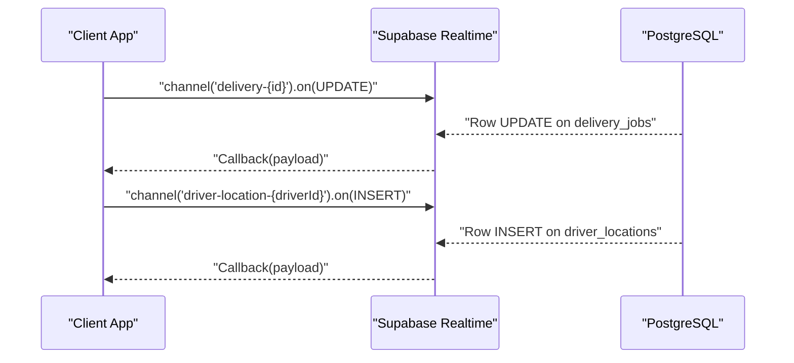
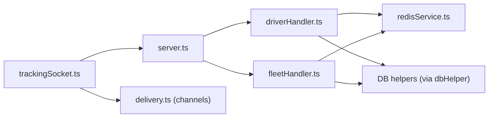

# Real-time Communication

<cite>
**Referenced Files in This Document**
- [server.ts](file://websocket-server/src/server.ts)
- [events.ts](file://websocket-server/src/types/events.ts)
- [driverHandler.ts](file://websocket-server/src/handlers/driverHandler.ts)
- [fleetHandler.ts](file://websocket-server/src/handlers/fleetHandler.ts)
- [redisService.ts](file://websocket-server/src/services/redisService.ts)
- [trackingSocket.ts](file://src/fleet/services/trackingSocket.ts)
- [delivery.ts](file://src/integrations/supabase/delivery.ts)
- [realtime.spec.ts](file://e2e/system/realtime.spec.ts)
</cite>

## Table of Contents
1. [Introduction](#introduction)
2. [Project Structure](#project-structure)
3. [Core Components](#core-components)
4. [Architecture Overview](#architecture-overview)
5. [Detailed Component Analysis](#detailed-component-analysis)
6. [Dependency Analysis](#dependency-analysis)
7. [Performance Considerations](#performance-considerations)
8. [Troubleshooting Guide](#troubleshooting-guide)
9. [Conclusion](#conclusion)

## Introduction
This document explains the real-time communication architecture powering live updates for drivers, fleet managers, and customers. It covers the WebSocket server built with Socket.IO, event-driven patterns, message routing, and integration with Supabase Realtime. It also documents concrete real-time features such as driver location updates, order tracking, and push notifications, along with scaling, resilience, and monitoring strategies.

## Project Structure
The real-time system spans three primary areas:
- WebSocket server: Node.js with Socket.IO, Redis adapter, and room-based broadcasting
- Client SDK: A lightweight native WebSocket client for browser-based fleet dashboards
- Supabase Realtime: PostgreSQL-based real-time subscriptions for delivery and driver location updates

**Diagram sources**
- [server.ts:34-56](file://websocket-server/src/server.ts#L34-L56)
- [driverHandler.ts:48-100](file://websocket-server/src/handlers/driverHandler.ts#L48-L100)
- [fleetHandler.ts:36-82](file://websocket-server/src/handlers/fleetHandler.ts#L36-L82)
- [redisService.ts:63-82](file://websocket-server/src/services/redisService.ts#L63-L82)
- [events.ts:157-187](file://websocket-server/src/types/events.ts#L157-L187)
- [trackingSocket.ts:34-95](file://src/fleet/services/trackingSocket.ts#L34-L95)
- [delivery.ts:695-734](file://src/integrations/supabase/delivery.ts#L695-L734)

**Section sources**
- [server.ts:34-56](file://websocket-server/src/server.ts#L34-L56)
- [events.ts:157-187](file://websocket-server/src/types/events.ts#L157-L187)
- [trackingSocket.ts:34-95](file://src/fleet/services/trackingSocket.ts#L34-L95)
- [delivery.ts:695-734](file://src/integrations/supabase/delivery.ts#L695-L734)

## Core Components
- WebSocket server: Authenticates clients via JWT, enforces connection limits, and routes events across rooms. Uses Redis adapter for horizontal scaling.
- Driver handler: Processes driver location/status updates, validates payloads, caches recent data, persists to DB, and broadcasts to fleet clients.
- Fleet handler: Manages city subscriptions, access control, and location history requests.
- Redis service: Provides caching for driver location/status, city stats, and pub/sub connectivity for multi-instance servers.
- Client SDK: Native WebSocket client that connects with token auth, subscribes to cities, and handles reconnection with exponential backoff.
- Supabase Realtime: Channels for delivery and driver location updates complement the WebSocket server for database-driven live updates.

**Section sources**
- [server.ts:65-103](file://websocket-server/src/server.ts#L65-L103)
- [driverHandler.ts:48-100](file://websocket-server/src/handlers/driverHandler.ts#L48-L100)
- [fleetHandler.ts:36-82](file://websocket-server/src/handlers/fleetHandler.ts#L36-L82)
- [redisService.ts:84-160](file://websocket-server/src/services/redisService.ts#L84-L160)
- [trackingSocket.ts:34-95](file://src/fleet/services/trackingSocket.ts#L34-L95)
- [delivery.ts:695-734](file://src/integrations/supabase/delivery.ts#L695-L734)

## Architecture Overview
The system uses a hybrid real-time model:
- WebSocket for live driver location/status and fleet dashboards
- Supabase Realtime for delivery job updates and driver location inserts

**Diagram sources**
- [driverHandler.ts:105-207](file://websocket-server/src/handlers/driverHandler.ts#L105-L207)
- [redisService.ts:87-96](file://websocket-server/src/services/redisService.ts#L87-L96)
- [redisService.ts:119-128](file://websocket-server/src/services/redisService.ts#L119-L128)
- [fleetHandler.ts:67-82](file://websocket-server/src/handlers/fleetHandler.ts#L67-L82)

## Detailed Component Analysis

### WebSocket Server
- Authentication: Validates JWT from handshake and attaches user metadata to the socket.
- Connection limits: Enforces maximum concurrent connections and emits an error before disconnecting.
- Rooms: Driver-specific and city-based rooms for efficient broadcasting.
- Health checks: HTTP endpoints expose connection counts and readiness probes.

**Diagram sources**
- [server.ts:65-103](file://websocket-server/src/server.ts#L65-L103)
- [server.ts:108-150](file://websocket-server/src/server.ts#L108-L150)
- [server.ts:162-192](file://websocket-server/src/server.ts#L162-L192)

**Section sources**
- [server.ts:65-103](file://websocket-server/src/server.ts#L65-L103)
- [server.ts:108-150](file://websocket-server/src/server.ts#L108-L150)
- [server.ts:162-192](file://websocket-server/src/server.ts#L162-L192)

### Driver Handler
- Location updates: Payload validation, rate limiting, Redis caching, DB persistence, and targeted broadcasts to city/all rooms.
- Status updates: Online/offline transitions, reason tagging, and broadcasts.
- Disconnect handling: Marks driver offline in cache and DB.

**Diagram sources**
- [driverHandler.ts:105-207](file://websocket-server/src/handlers/driverHandler.ts#L105-L207)
- [driverHandler.ts:212-275](file://websocket-server/src/handlers/driverHandler.ts#L212-L275)
- [redisService.ts:87-96](file://websocket-server/src/services/redisService.ts#L87-L96)
- [redisService.ts:119-128](file://websocket-server/src/services/redisService.ts#L119-L128)

**Section sources**
- [driverHandler.ts:105-207](file://websocket-server/src/handlers/driverHandler.ts#L105-L207)
- [driverHandler.ts:212-275](file://websocket-server/src/handlers/driverHandler.ts#L212-L275)
- [redisService.ts:87-96](file://websocket-server/src/services/redisService.ts#L87-L96)
- [redisService.ts:119-128](file://websocket-server/src/services/redisService.ts#L119-L128)

### Fleet Handler
- City subscriptions: Validates access (role/city assignment), joins rooms, and sends initial stats.
- Location history: Validates driver/city access, fetches points from DB, and returns paginated history.
- Stats broadcasting: Sends periodic fleet stats updates to subscribed clients.

**Diagram sources**
- [fleetHandler.ts:87-140](file://websocket-server/src/handlers/fleetHandler.ts#L87-L140)
- [fleetHandler.ts:145-212](file://websocket-server/src/handlers/fleetHandler.ts#L145-L212)
- [events.ts:157-187](file://websocket-server/src/types/events.ts#L157-L187)

**Section sources**
- [fleetHandler.ts:87-140](file://websocket-server/src/handlers/fleetHandler.ts#L87-L140)
- [fleetHandler.ts:145-212](file://websocket-server/src/handlers/fleetHandler.ts#L145-L212)
- [events.ts:157-187](file://websocket-server/src/types/events.ts#L157-L187)

### Client SDK (trackingSocket)
- Connection lifecycle: Connects with token query param, subscribes to cities on open, and flushes queued messages.
- Reconnection: Exponential backoff with capped attempts.
- Event routing: Dispatches incoming events to registered callbacks for location, status, and stats.

**Diagram sources**
- [trackingSocket.ts:34-95](file://src/fleet/services/trackingSocket.ts#L34-L95)
- [trackingSocket.ts:162-178](file://src/fleet/services/trackingSocket.ts#L162-L178)
- [events.ts:157-187](file://websocket-server/src/types/events.ts#L157-L187)

**Section sources**
- [trackingSocket.ts:34-95](file://src/fleet/services/trackingSocket.ts#L34-L95)
- [trackingSocket.ts:162-178](file://src/fleet/services/trackingSocket.ts#L162-L178)
- [events.ts:157-187](file://websocket-server/src/types/events.ts#L157-L187)

### Supabase Realtime Integration
- Delivery updates: Subscribes to postgres_changes on delivery_jobs for a given schedule.
- Driver location updates: Subscribes to INSERTs on driver_locations for a given driver.

**Diagram sources**
- [delivery.ts:695-734](file://src/integrations/supabase/delivery.ts#L695-L734)

**Section sources**
- [delivery.ts:695-734](file://src/integrations/supabase/delivery.ts#L695-L734)

## Dependency Analysis
- Server depends on Redis adapter for multi-instance coordination and on database helpers for persistence.
- Handlers depend on Redis service for caching and on DB helpers for persistence and queries.
- Client SDK depends on the WebSocket server and optionally on Supabase channels for complementary updates.

**Diagram sources**
- [server.ts:13-14](file://websocket-server/src/server.ts#L13-L14)
- [driverHandler.ts:16-21](file://websocket-server/src/handlers/driverHandler.ts#L16-L21)
- [fleetHandler.ts:15-16](file://websocket-server/src/handlers/fleetHandler.ts#L15-L16)
- [redisService.ts:6-12](file://websocket-server/src/services/redisService.ts#L6-L12)
- [trackingSocket.ts](file://src/fleet/services/trackingSocket.ts#L6)
- [delivery.ts](file://src/integrations/supabase/delivery.ts#L4)

**Section sources**
- [server.ts:13-14](file://websocket-server/src/server.ts#L13-L14)
- [driverHandler.ts:16-21](file://websocket-server/src/handlers/driverHandler.ts#L16-L21)
- [fleetHandler.ts:15-16](file://websocket-server/src/handlers/fleetHandler.ts#L15-L16)
- [redisService.ts:6-12](file://websocket-server/src/services/redisService.ts#L6-L12)
- [trackingSocket.ts](file://src/fleet/services/trackingSocket.ts#L6)
- [delivery.ts](file://src/integrations/supabase/delivery.ts#L4)

## Performance Considerations
- Compression: Per-message deflate threshold configured to compress larger messages.
- Buffer limits: Max HTTP buffer size set to cap memory usage.
- Rate limiting: Driver location updates are rate-limited to reduce load.
- Caching: Redis stores recent driver location/status to minimize DB reads/writes.
- Scaling: Redis adapter enables horizontal scaling across multiple WebSocket server instances.
- Backpressure: Client queues messages until connected; server enforces max connections.

[No sources needed since this section provides general guidance]

## Troubleshooting Guide
- Authentication failures: Ensure the token is present and valid; server emits explicit errors for expired or invalid tokens.
- Connection limits: If the server is at capacity, clients receive an error and should retry later.
- Reconnection: Client implements exponential backoff; monitor logs for repeated reconnect attempts.
- Redis health: Use the readiness endpoint to verify Redis availability.
- Event parsing: Client logs parsing errors; verify event names match server definitions.

**Section sources**
- [server.ts:95-102](file://websocket-server/src/server.ts#L95-L102)
- [server.ts:110-117](file://websocket-server/src/server.ts#L110-L117)
- [trackingSocket.ts:82-94](file://src/fleet/services/trackingSocket.ts#L82-L94)
- [server.ts:177-187](file://websocket-server/src/server.ts#L177-L187)
- [events.ts:157-187](file://websocket-server/src/types/events.ts#L157-L187)

## Conclusion
The real-time architecture combines a robust WebSocket server with Redis-based scaling and a native client SDK for seamless driver and fleet updates. Complementary Supabase Realtime channels provide database-driven live updates for delivery and driver location. Together, these components deliver low-latency, scalable, and resilient real-time experiences across drivers, fleet managers, and customers.