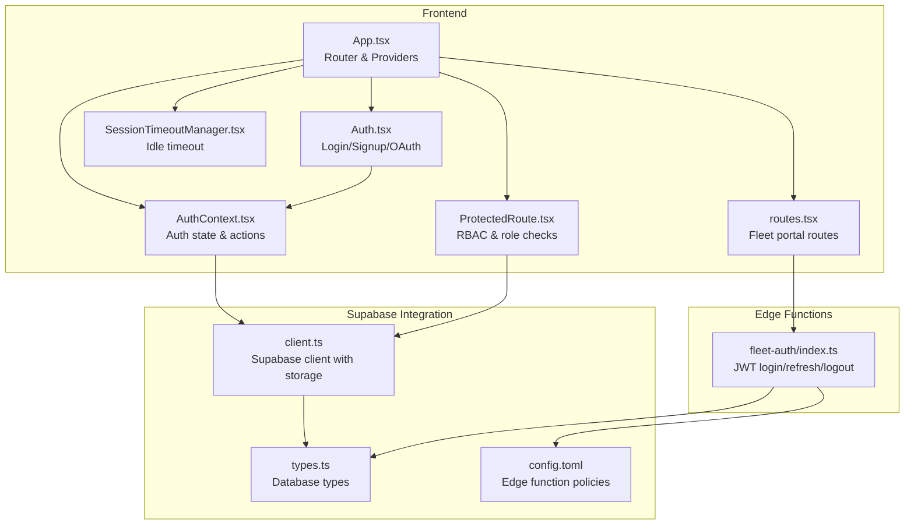
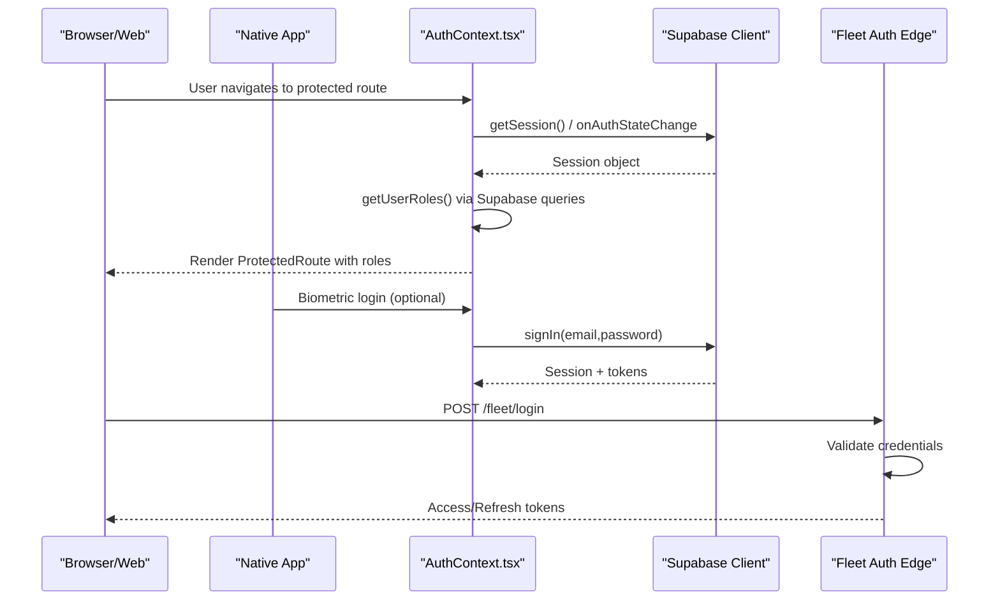
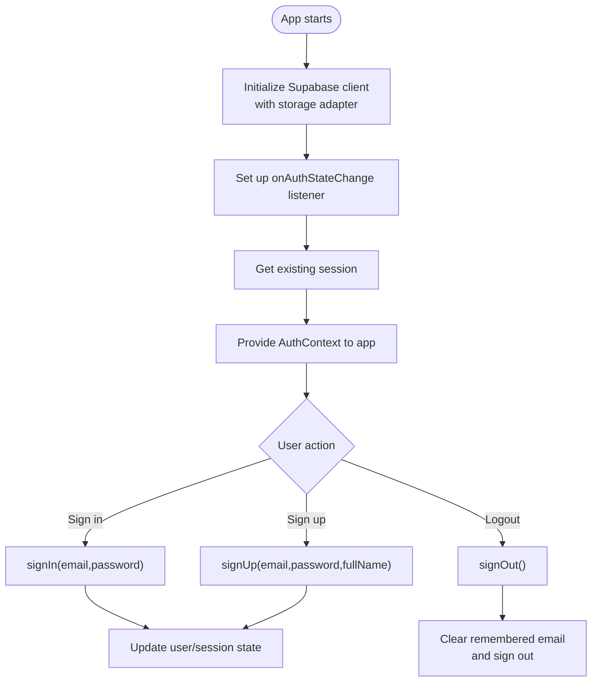
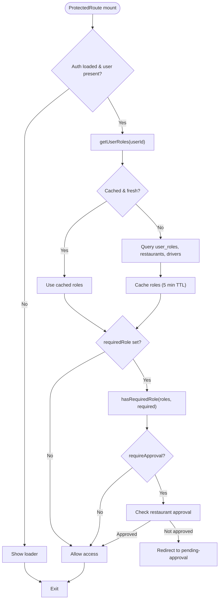
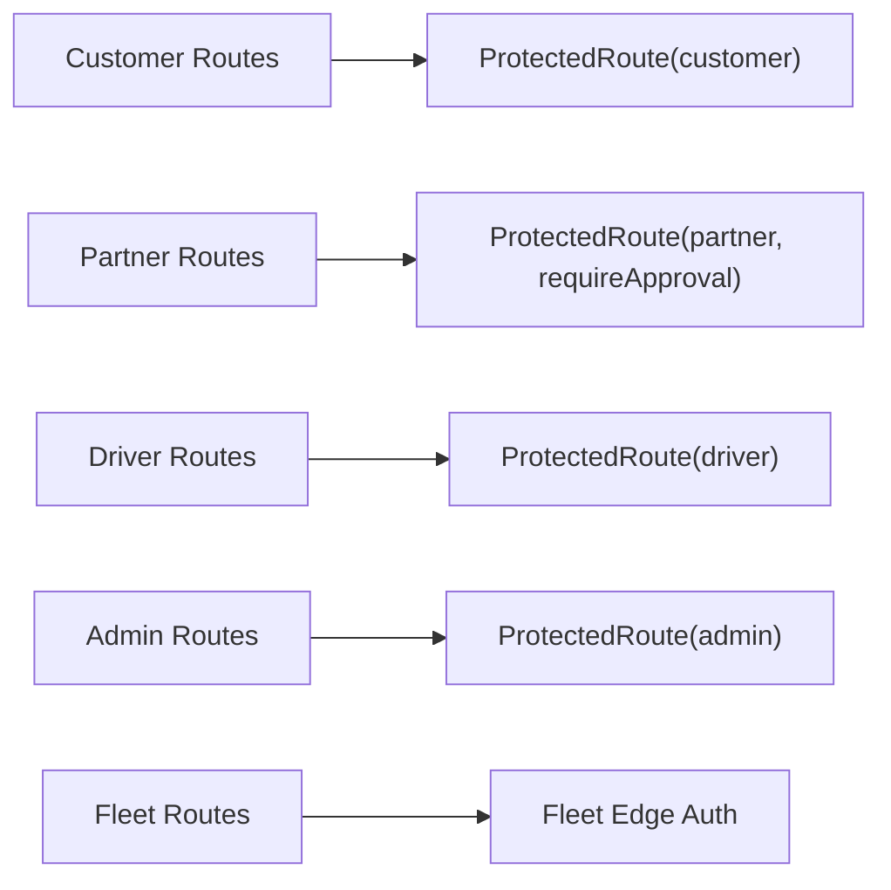
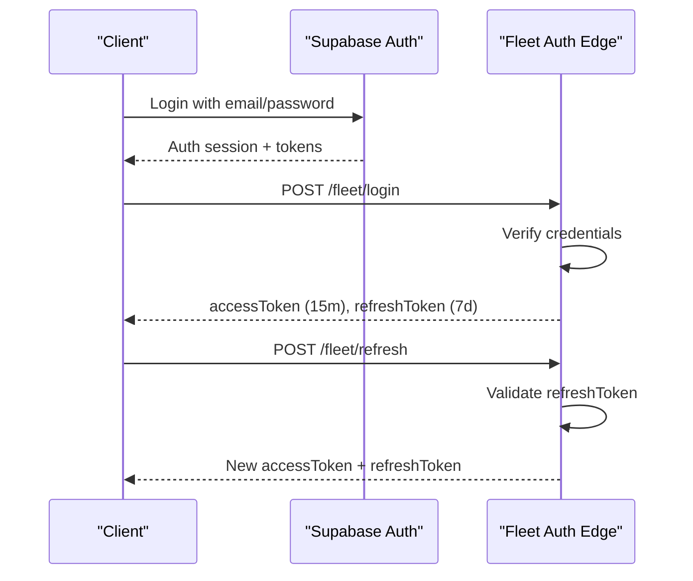
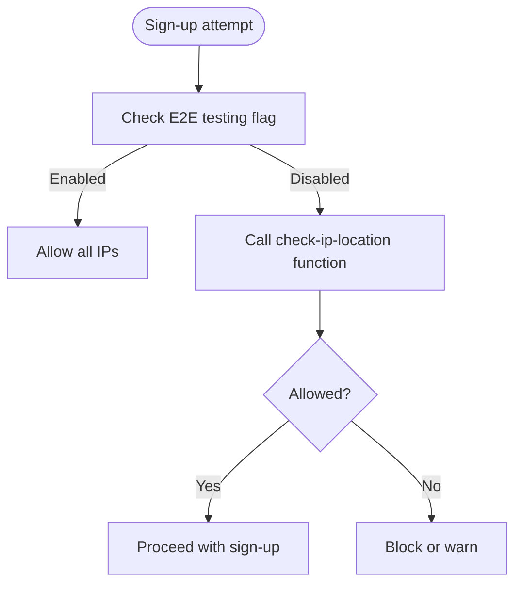
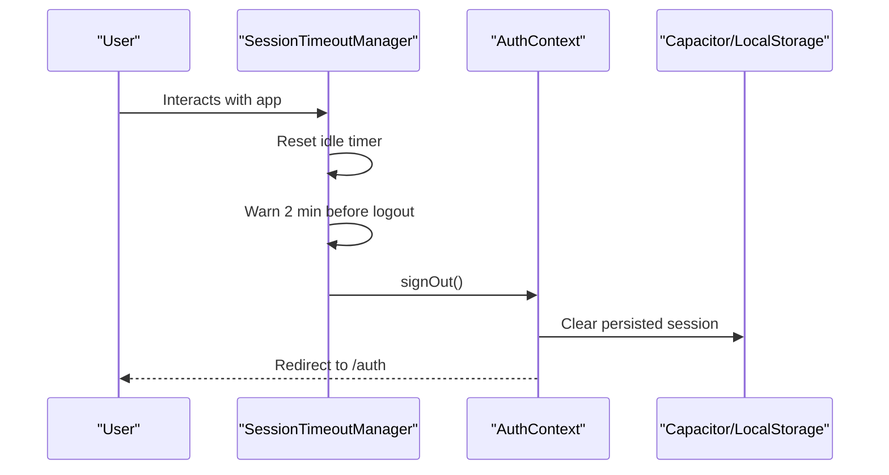
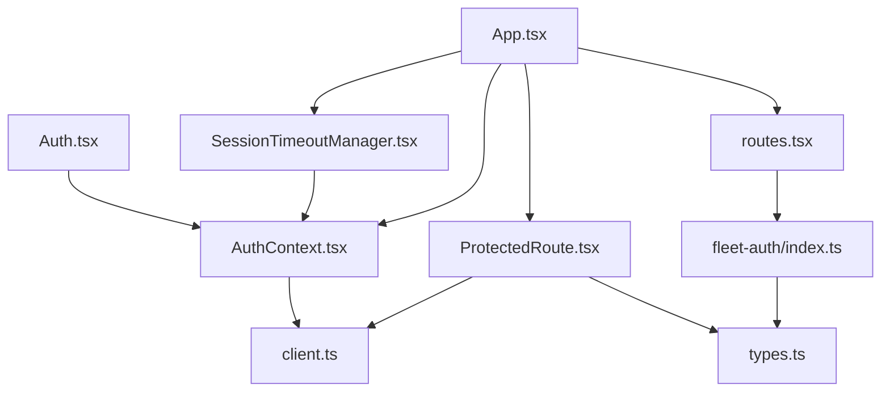

# Authentication & Authorization

<cite>
**Referenced Files in This Document**
- [AuthContext.tsx](file://src/contexts/AuthContext.tsx)
- [ProtectedRoute.tsx](file://src/components/ProtectedRoute.tsx)
- [client.ts](file://src/integrations/supabase/client.ts)
- [Auth.tsx](file://src/pages/Auth.tsx)
- [ipCheck.ts](file://src/lib/ipCheck.ts)
- [capacitor.ts](file://src/lib/capacitor.ts)
- [SessionTimeoutManager.tsx](file://src/components/SessionTimeoutManager.tsx)
- [App.tsx](file://src/App.tsx)
- [routes.tsx](file://src/fleet/routes.tsx)
- [index.ts](file://supabase/functions/fleet-auth/index.ts)
- [types.ts](file://supabase/types.ts)
- [config.toml](file://supabase/config.toml)
</cite>

## Table of Contents
1. [Introduction](#introduction)
2. [Project Structure](#project-structure)
3. [Core Components](#core-components)
4. [Architecture Overview](#architecture-overview)
5. [Detailed Component Analysis](#detailed-component-analysis)
6. [Dependency Analysis](#dependency-analysis)
7. [Performance Considerations](#performance-considerations)
8. [Troubleshooting Guide](#troubleshooting-guide)
9. [Conclusion](#conclusion)

## Introduction
This document explains the multi-role authentication and authorization system for the Nutrio platform. It covers Supabase Auth integration, session management, role-based access control (RBAC), and security policies. It documents the authentication flows for customers, partners, drivers, administrators, and fleet managers, along with JWT token handling, refresh mechanisms, session persistence, and logout behavior across all portals.

## Project Structure
The authentication system spans frontend React components, Supabase client configuration, Supabase edge functions for fleet management, and Supabase database policies and types.

**Diagram sources**
- [App.tsx:139-739](file://src/App.tsx#L139-L739)
- [Auth.tsx:1-890](file://src/pages/Auth.tsx#L1-L890)
- [AuthContext.tsx:1-131](file://src/contexts/AuthContext.tsx#L1-L131)
- [ProtectedRoute.tsx:1-264](file://src/components/ProtectedRoute.tsx#L1-L264)
- [SessionTimeoutManager.tsx:1-344](file://src/components/SessionTimeoutManager.tsx#L1-L344)
- [routes.tsx:1-42](file://src/fleet/routes.tsx#L1-L42)
- [client.ts:1-57](file://src/integrations/supabase/client.ts#L1-L57)
- [types.ts:1-800](file://supabase/types.ts#L1-L800)
- [index.ts:1-307](file://supabase/functions/fleet-auth/index.ts#L1-L307)
- [config.toml:1-59](file://supabase/config.toml#L1-L59)

**Section sources**
- [App.tsx:139-739](file://src/App.tsx#L139-L739)
- [client.ts:1-57](file://src/integrations/supabase/client.ts#L1-L57)

## Core Components
- Supabase client with Capacitor storage adapter for session persistence
- Auth provider managing auth state, sign-up/sign-in, and sign-out
- ProtectedRoute component implementing RBAC with role caching and approval checks
- SessionTimeoutManager enforcing idle timeouts and cross-tab synchronization
- Fleet authentication edge function handling JWT lifecycle for fleet portal

**Section sources**
- [client.ts:18-57](file://src/integrations/supabase/client.ts#L18-L57)
- [AuthContext.tsx:31-131](file://src/contexts/AuthContext.tsx#L31-L131)
- [ProtectedRoute.tsx:26-264](file://src/components/ProtectedRoute.tsx#L26-L264)
- [SessionTimeoutManager.tsx:47-344](file://src/components/SessionTimeoutManager.tsx#L47-L344)
- [index.ts:90-307](file://supabase/functions/fleet-auth/index.ts#L90-L307)

## Architecture Overview
The system integrates Supabase Auth for identity and session management, with custom storage for native platforms and automatic token refresh. Role-based access control is enforced via ProtectedRoute, which queries user roles and approval status. The fleet portal uses dedicated JWT tokens managed by an edge function.

**Diagram sources**
- [AuthContext.tsx:36-61](file://src/contexts/AuthContext.tsx#L36-L61)
- [Auth.tsx:169-203](file://src/pages/Auth.tsx#L169-L203)
- [ProtectedRoute.tsx:40-98](file://src/components/ProtectedRoute.tsx#L40-L98)
- [index.ts:90-174](file://supabase/functions/fleet-auth/index.ts#L90-L174)

## Detailed Component Analysis

### Supabase Auth Integration and Session Management
- Client initialization configures persistent sessions and auto-refresh tokens, with a Capacitor storage adapter for native apps.
- Auth provider listens to Supabase auth state changes and exposes sign-up, sign-in, and sign-out functions.
- Auth page validates forms, handles social login redirects, and performs IP checks for sign-up.

**Diagram sources**
- [client.ts:44-57](file://src/integrations/supabase/client.ts#L44-L57)
- [AuthContext.tsx:36-118](file://src/contexts/AuthContext.tsx#L36-L118)
- [Auth.tsx:169-203](file://src/pages/Auth.tsx#L169-L203)

**Section sources**
- [client.ts:18-57](file://src/integrations/supabase/client.ts#L18-L57)
- [AuthContext.tsx:31-131](file://src/contexts/AuthContext.tsx#L31-L131)
- [Auth.tsx:19-115](file://src/pages/Auth.tsx#L19-L115)

### Role-Based Access Control (RBAC) Implementation
- ProtectedRoute defines user roles and a role hierarchy, caches role lookups, and enforces required roles and approval checks.
- Role resolution queries user roles, restaurant ownership, and driver status to derive effective roles.
- Conditional navigation routes users to appropriate dashboards based on detected roles.

**Diagram sources**
- [ProtectedRoute.tsx:139-230](file://src/components/ProtectedRoute.tsx#L139-L230)
- [ProtectedRoute.tsx:40-98](file://src/components/ProtectedRoute.tsx#L40-L98)
- [ProtectedRoute.tsx:124-137](file://src/components/ProtectedRoute.tsx#L124-L137)

**Section sources**
- [ProtectedRoute.tsx:7-264](file://src/components/ProtectedRoute.tsx#L7-L264)

### Authentication Flows by Portal
- Customer portal: Authenticated routes under CustomerLayout; public routes for browsing menus/restaurants.
- Partner portal: Requires "partner" role and approved restaurant; routes guarded by ProtectedRoute with requireApproval.
- Driver portal: Requires "driver" role; routes under DriverLayout.
- Admin portal: Requires "admin" role; extensive administrative routes.
- Fleet portal: Uses separate JWT tokens via fleet-auth edge function for isolated access.

**Diagram sources**
- [App.tsx:174-724](file://src/App.tsx#L174-L724)
- [routes.tsx:20-41](file://src/fleet/routes.tsx#L20-L41)
- [index.ts:90-307](file://supabase/functions/fleet-auth/index.ts#L90-L307)

**Section sources**
- [App.tsx:174-724](file://src/App.tsx#L174-L724)
- [routes.tsx:1-42](file://src/fleet/routes.tsx#L1-L42)

### JWT Token Handling and Refresh Mechanisms
- Frontend: Supabase client auto-refreshes tokens and persists sessions using Capacitor preferences on native or localStorage on web.
- Fleet portal: Dedicated edge function manages access/refresh tokens with short-lived access tokens and longer refresh tokens, validating credentials and issuing JWTs with role claims.

**Diagram sources**
- [client.ts:50-56](file://src/integrations/supabase/client.ts#L50-L56)
- [index.ts:90-230](file://supabase/functions/fleet-auth/index.ts#L90-L230)

**Section sources**
- [client.ts:18-57](file://src/integrations/supabase/client.ts#L18-L57)
- [index.ts:33-88](file://supabase/functions/fleet-auth/index.ts#L33-L88)

### Security Policies and IP Controls
- IP location checks for sign-up are currently bypassed for E2E testing but can be enabled; login attempts are optionally restricted by IP.
- Supabase functions in config.toml disable JWT verification for most notification and engine functions, while fleet-auth requires JWT verification.
- Native biometric authentication is supported for secure login on devices.

**Diagram sources**
- [ipCheck.ts:19-80](file://src/lib/ipCheck.ts#L19-L80)
- [config.toml:30-59](file://supabase/config.toml#L30-L59)

**Section sources**
- [ipCheck.ts:12-107](file://src/lib/ipCheck.ts#L12-L107)
- [config.toml:1-59](file://supabase/config.toml#L1-59)
- [capacitor.ts:468-581](file://src/lib/capacitor.ts#L468-L581)

### Session Persistence and Logout Handling
- Session persistence uses Capacitor Preferences on native and localStorage on web; logout clears remembered email and calls Supabase signOut.
- SessionTimeoutManager monitors user activity, warns before timeout, and logs out after inactivity; supports cross-tab synchronization and temporary extension during long operations.

**Diagram sources**
- [SessionTimeoutManager.tsx:47-217](file://src/components/SessionTimeoutManager.tsx#L47-L217)
- [AuthContext.tsx:114-118](file://src/contexts/AuthContext.tsx#L114-L118)

**Section sources**
- [client.ts:18-42](file://src/integrations/supabase/client.ts#L18-L42)
- [AuthContext.tsx:114-118](file://src/contexts/AuthContext.tsx#L114-L118)
- [SessionTimeoutManager.tsx:47-344](file://src/components/SessionTimeoutManager.tsx#L47-L344)

## Dependency Analysis
- AuthContext depends on Supabase client and provides auth state to all components.
- ProtectedRoute depends on Supabase for role queries and uses cached results to minimize DB calls.
- Fleet routes depend on fleet-auth edge function for JWT lifecycle.
- Auth page depends on AuthContext and IP check utilities.

**Diagram sources**
- [AuthContext.tsx:1-131](file://src/contexts/AuthContext.tsx#L1-L131)
- [client.ts:1-57](file://src/integrations/supabase/client.ts#L1-L57)
- [ProtectedRoute.tsx:1-264](file://src/components/ProtectedRoute.tsx#L1-L264)
- [types.ts:1-800](file://supabase/types.ts#L1-L800)
- [routes.tsx:1-42](file://src/fleet/routes.tsx#L1-L42)
- [index.ts:1-307](file://supabase/functions/fleet-auth/index.ts#L1-L307)
- [SessionTimeoutManager.tsx:1-344](file://src/components/SessionTimeoutManager.tsx#L1-L344)
- [App.tsx:139-739](file://src/App.tsx#L139-L739)

**Section sources**
- [App.tsx:139-739](file://src/App.tsx#L139-L739)
- [ProtectedRoute.tsx:33-98](file://src/components/ProtectedRoute.tsx#L33-L98)

## Performance Considerations
- Role caching reduces repeated database queries; cache TTL balances freshness and performance.
- Auto-refresh tokens minimize re-authentication friction; ensure network reliability for seamless operation.
- Cross-tab synchronization avoids redundant idle timers; consider disabling BroadcastChannel for native builds.
- Edge functions for fleet portal reduce frontend token management overhead.

## Troubleshooting Guide
- Authentication loops or stale sessions: Verify Capacitor storage adapter is available on native; check persisted session keys.
- Role checks failing: Confirm user_roles table exists and has proper RLS policies; ensure user roles are correctly assigned.
- Fleet login failures: Validate JWT secrets are configured; ensure fleet-auth endpoint is reachable and function policies permit access.
- Idle timeout issues: Confirm BroadcastChannel availability on web; ensure activity events are attached and not blocked by long-running operations.

**Section sources**
- [client.ts:18-42](file://src/integrations/supabase/client.ts#L18-L42)
- [ProtectedRoute.tsx:33-98](file://src/components/ProtectedRoute.tsx#L33-L98)
- [index.ts:90-307](file://supabase/functions/fleet-auth/index.ts#L90-L307)
- [SessionTimeoutManager.tsx:63-81](file://src/components/SessionTimeoutManager.tsx#L63-L81)

## Conclusion
The Nutrio platform implements a robust, multi-role authentication and authorization system leveraging Supabase Auth for identity and session management, with custom RBAC enforcement and secure session controls. The fleet portal adds a dedicated JWT-based authentication layer for isolated access. The design balances security, performance, and user experience across all portals.