# Authentication & Authorization

<cite>
**Referenced Files in This Document**
- [AuthContext.tsx](file://src/contexts/AuthContext.tsx)
- [ProtectedRoute.tsx](file://src/components/ProtectedRoute.tsx)
- [Auth.tsx](file://src/pages/Auth.tsx)
- [client.ts](file://src/integrations/supabase/client.ts)
- [types.ts](file://src/integrations/supabase/types.ts)
- [ipCheck.ts](file://src/lib/ipCheck.ts)
- [DriverAuth.tsx](file://src/pages/driver/DriverAuth.tsx)
- [PartnerAuth.tsx](file://src/pages/partner/PartnerAuth.tsx)
- [security.spec.ts](file://e2e/system/security.spec.ts)
</cite>

## Table of Contents
1. [Introduction](#introduction)
2. [Project Structure](#project-structure)
3. [Core Components](#core-components)
4. [Architecture Overview](#architecture-overview)
5. [Detailed Component Analysis](#detailed-component-analysis)
6. [Dependency Analysis](#dependency-analysis)
7. [Performance Considerations](#performance-considerations)
8. [Troubleshooting Guide](#troubleshooting-guide)
9. [Conclusion](#conclusion)

## Introduction
This document describes the authentication and authorization system in Nutrio, focusing on multi-tenant capabilities, role-based access control (RBAC), Supabase integration, session management, token handling, IP location verification, and security policies. It covers user registration flows, login processes, password reset procedures, role assignment mechanisms, protected route enforcement, and conditional rendering based on permissions. Practical guidance is included for implementing new protected routes and customizing access controls for different user types.

## Project Structure
The authentication system spans several layers:
- Supabase client configuration and typed database schema
- Global authentication context managing sessions and user state
- Protected route wrapper enforcing RBAC and approval checks
- Portal-specific authentication pages for customer, driver, and partner
- IP location verification and user IP logging utilities
- End-to-end security tests validating system behavior

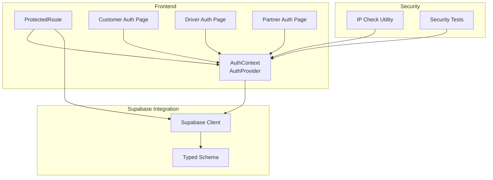

**Diagram sources**
- [AuthContext.tsx:31-130](file://src/contexts/AuthContext.tsx#L31-L130)
- [ProtectedRoute.tsx:139-230](file://src/components/ProtectedRoute.tsx#L139-L230)
- [Auth.tsx:19-115](file://src/pages/Auth.tsx#L19-L115)
- [DriverAuth.tsx:25-188](file://src/pages/driver/DriverAuth.tsx#L25-L188)
- [PartnerAuth.tsx:30-275](file://src/pages/partner/PartnerAuth.tsx#L30-L275)
- [client.ts:47-57](file://src/integrations/supabase/client.ts#L47-L57)
- [types.ts:9-15](file://src/integrations/supabase/types.ts#L9-L15)
- [ipCheck.ts:19-107](file://src/lib/ipCheck.ts#L19-L107)
- [security.spec.ts](file://e2e/system/security.spec.ts)

**Section sources**
- [AuthContext.tsx:1-131](file://src/contexts/AuthContext.tsx#L1-L131)
- [ProtectedRoute.tsx:1-264](file://src/components/ProtectedRoute.tsx#L1-L264)
- [Auth.tsx:1-890](file://src/pages/Auth.tsx#L1-L890)
- [client.ts:1-57](file://src/integrations/supabase/client.ts#L1-L57)
- [types.ts:1-800](file://src/integrations/supabase/types.ts#L1-L800)
- [ipCheck.ts:1-107](file://src/lib/ipCheck.ts#L1-L107)
- [DriverAuth.tsx:1-322](file://src/pages/driver/DriverAuth.tsx#L1-L322)
- [PartnerAuth.tsx:1-492](file://src/pages/partner/PartnerAuth.tsx#L1-L492)
- [security.spec.ts](file://e2e/system/security.spec.ts)

## Core Components
- Supabase client with Capacitor-native storage adapter and automatic token refresh
- Global AuthContext providing sign-up, sign-in, sign-out, and session state
- ProtectedRoute enforcing role-based access, optional approval gating, and role caching
- IP location verification and user IP logging utilities
- Portal-specific authentication flows for customer, driver, and partner

Key implementation highlights:
- Supabase client initialization with persistent session and auto-refresh
- AuthContext subscribes to Supabase auth state changes and initializes push notifications on native platforms
- ProtectedRoute resolves user roles from multiple sources and caches results
- IP checks are integrated into login and sign-up flows with fail-open behavior
- Driver and partner portals create dedicated records and assign roles upon registration

**Section sources**
- [client.ts:18-57](file://src/integrations/supabase/client.ts#L18-L57)
- [AuthContext.tsx:36-118](file://src/contexts/AuthContext.tsx#L36-L118)
- [ProtectedRoute.tsx:40-98](file://src/components/ProtectedRoute.tsx#L40-L98)
- [ipCheck.ts:19-107](file://src/lib/ipCheck.ts#L19-L107)
- [DriverAuth.tsx:122-177](file://src/pages/driver/DriverAuth.tsx#L122-L177)
- [PartnerAuth.tsx:200-275](file://src/pages/partner/PartnerAuth.tsx#L200-L275)

## Architecture Overview
The system integrates frontend React components with Supabase for authentication and authorization. Supabase manages sessions, tokens, and user metadata. The frontend enforces access control via ProtectedRoute and augments security with IP location checks and user IP logging.

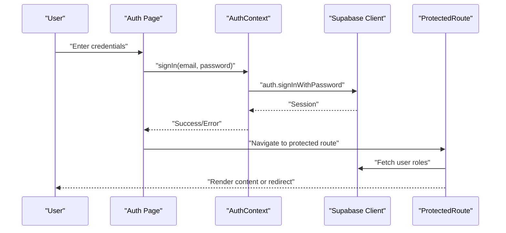

**Diagram sources**
- [Auth.tsx:169-203](file://src/pages/Auth.tsx#L169-L203)
- [AuthContext.tsx:87-112](file://src/contexts/AuthContext.tsx#L87-L112)
- [ProtectedRoute.tsx:160-189](file://src/components/ProtectedRoute.tsx#L160-L189)

## Detailed Component Analysis

### Supabase Client and Session Management
- Uses a custom storage adapter for Capacitor to persist sessions securely on native devices
- Enables automatic token refresh and persistent sessions
- Provides typed database access through generated types

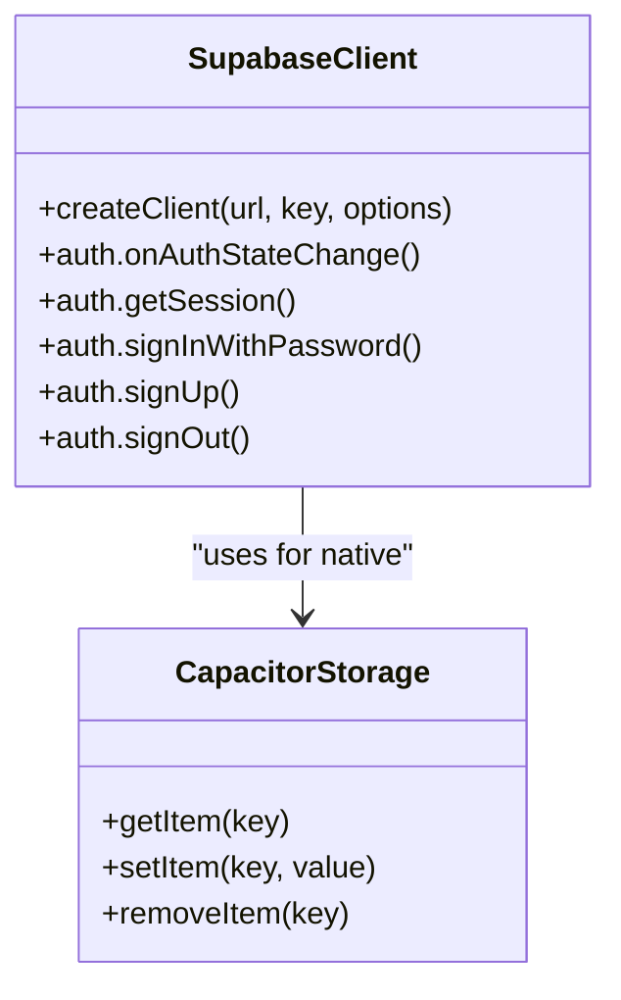

**Diagram sources**
- [client.ts:47-57](file://src/integrations/supabase/client.ts#L47-L57)
- [client.ts:18-42](file://src/integrations/supabase/client.ts#L18-L42)

**Section sources**
- [client.ts:1-57](file://src/integrations/supabase/client.ts#L1-L57)
- [types.ts:9-15](file://src/integrations/supabase/types.ts#L9-L15)

### Authentication Context (AuthContext)
- Subscribes to Supabase auth state changes and updates React context
- Exposes sign-up, sign-in, and sign-out functions
- Integrates IP location checks during login with fail-open behavior
- Initializes push notifications on native platforms upon sign-in

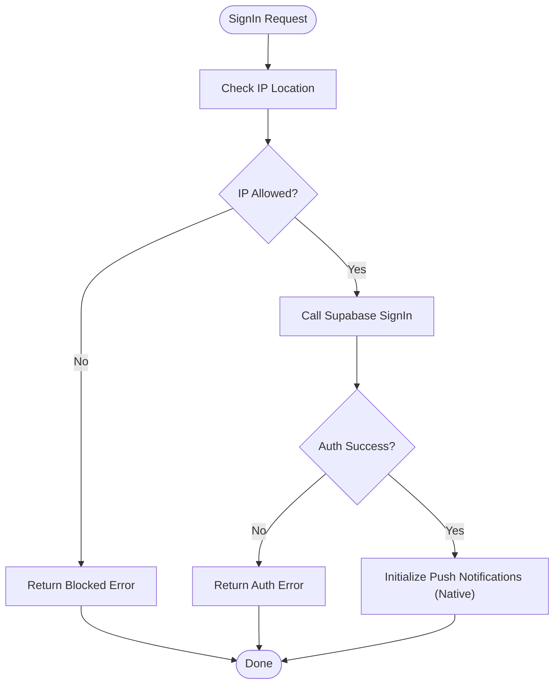

**Diagram sources**
- [AuthContext.tsx:87-112](file://src/contexts/AuthContext.tsx#L87-L112)
- [ipCheck.ts:19-80](file://src/lib/ipCheck.ts#L19-L80)

**Section sources**
- [AuthContext.tsx:31-130](file://src/contexts/AuthContext.tsx#L31-L130)
- [ipCheck.ts:87-107](file://src/lib/ipCheck.ts#L87-L107)

### Protected Route System (RBAC)
- Defines user roles and a role hierarchy for permission checks
- Resolves user roles from multiple sources (user_roles table, restaurants, drivers)
- Caches role results to minimize database queries
- Supports optional approval checks for partner routes
- Redirects unauthorized users to appropriate dashboards or approval pages

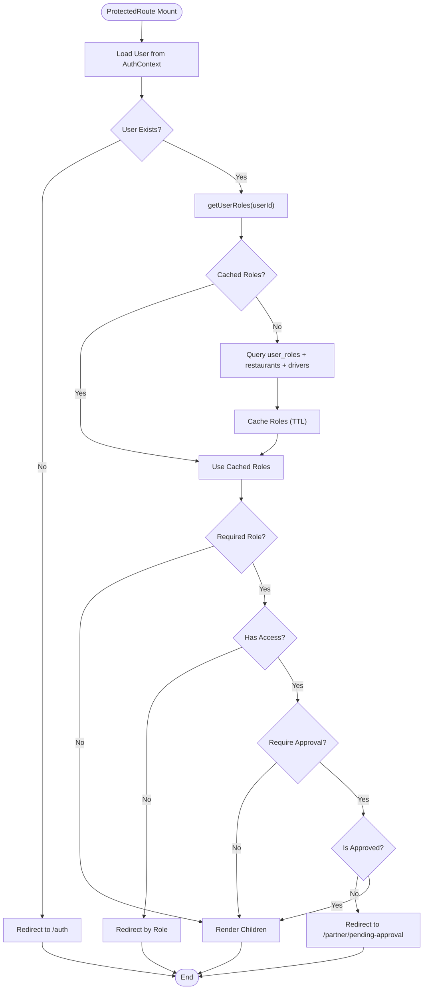

**Diagram sources**
- [ProtectedRoute.tsx:139-230](file://src/components/ProtectedRoute.tsx#L139-L230)
- [ProtectedRoute.tsx:40-98](file://src/components/ProtectedRoute.tsx#L40-L98)

**Section sources**
- [ProtectedRoute.tsx:7-264](file://src/components/ProtectedRoute.tsx#L7-L264)

### IP Location Verification and Security Logging
- IP location checks are integrated into sign-up and sign-in flows
- Fail-open behavior ensures availability if external service is down
- User IP information is logged via Supabase Edge Functions for auditability

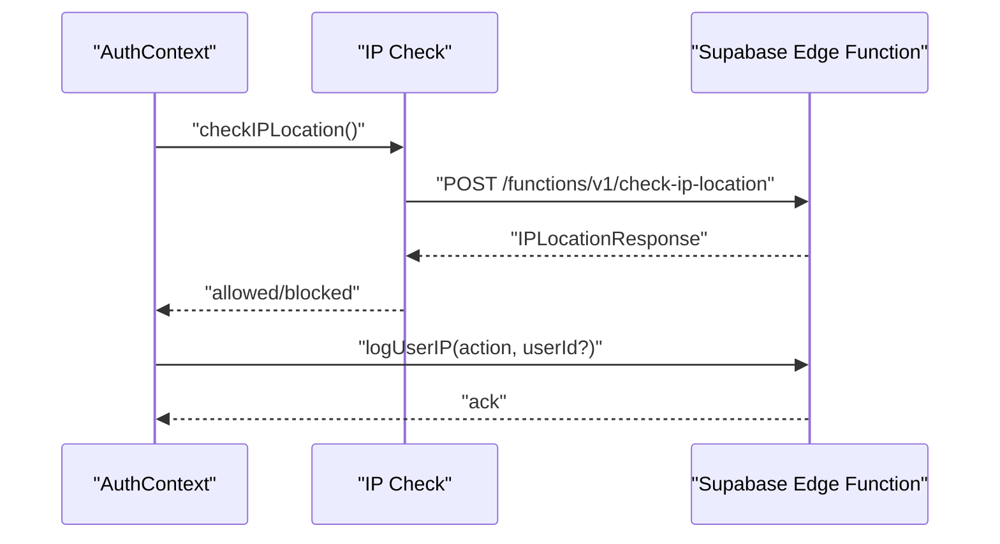

**Diagram sources**
- [ipCheck.ts:19-80](file://src/lib/ipCheck.ts#L19-L80)
- [ipCheck.ts:87-107](file://src/lib/ipCheck.ts#L87-L107)

**Section sources**
- [ipCheck.ts:1-107](file://src/lib/ipCheck.ts#L1-L107)

### Customer Registration and Login Flow
- Customer portal supports email/password login and OAuth providers
- Validates form inputs and handles biometric login on native devices
- Redirects users to appropriate dashboards based on roles and approvals
- Integrates IP restrictions during sign-up with user feedback

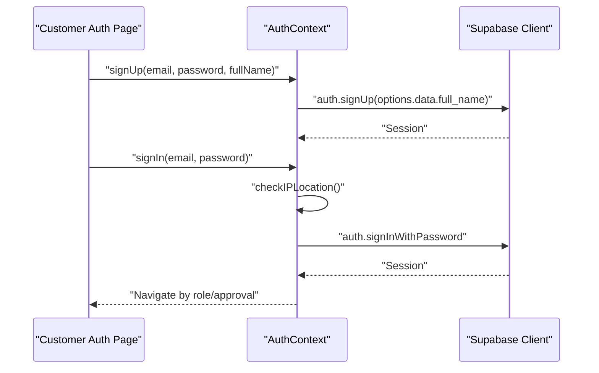

**Diagram sources**
- [Auth.tsx:169-203](file://src/pages/Auth.tsx#L169-L203)
- [Auth.tsx:80-115](file://src/pages/Auth.tsx#L80-L115)
- [AuthContext.tsx:63-112](file://src/contexts/AuthContext.tsx#L63-L112)

**Section sources**
- [Auth.tsx:19-890](file://src/pages/Auth.tsx#L19-L890)
- [AuthContext.tsx:1-131](file://src/contexts/AuthContext.tsx#L1-L131)

### Driver Registration and Login Flow
- Driver portal creates driver profiles and assigns driver roles upon sign-up
- Enforces approval status and redirects accordingly
- Integrates with Supabase auth and database for seamless onboarding

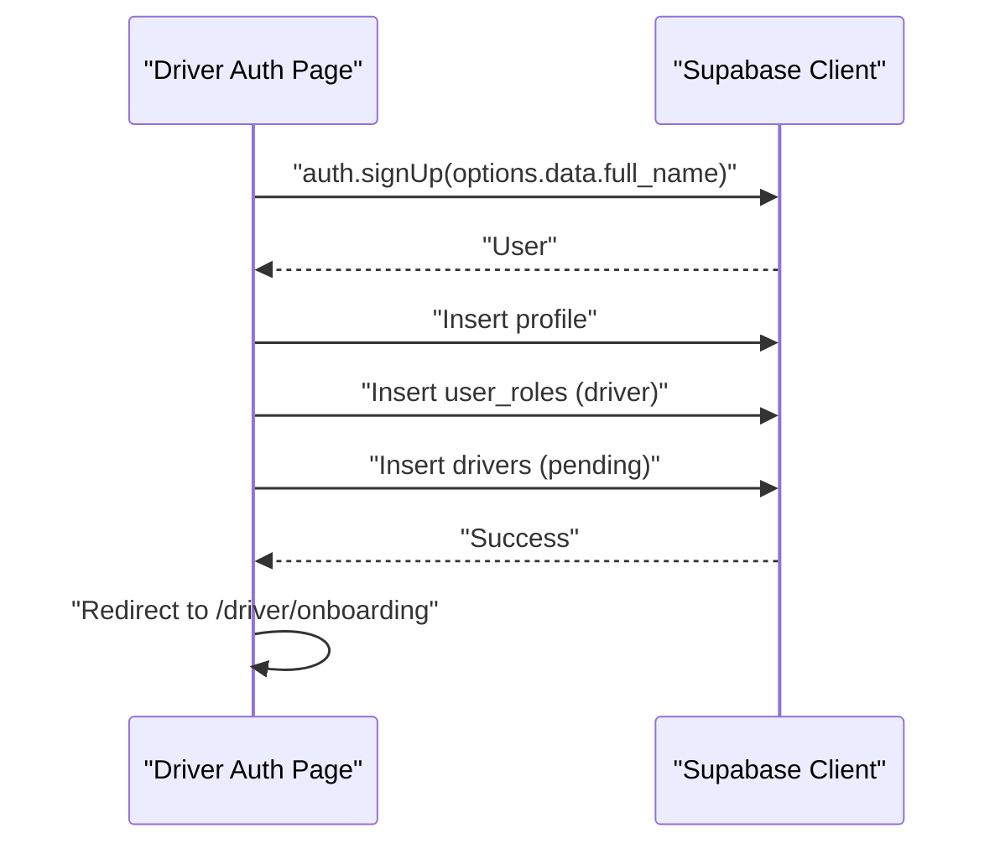

**Diagram sources**
- [DriverAuth.tsx:122-177](file://src/pages/driver/DriverAuth.tsx#L122-L177)

**Section sources**
- [DriverAuth.tsx:1-322](file://src/pages/driver/DriverAuth.tsx#L1-L322)

### Partner Registration and Login Flow
- Partner portal supports restaurant creation, logo upload, and approval gating
- Assigns partner roles and redirects based on approval status
- Integrates with Supabase auth and storage for restaurant assets

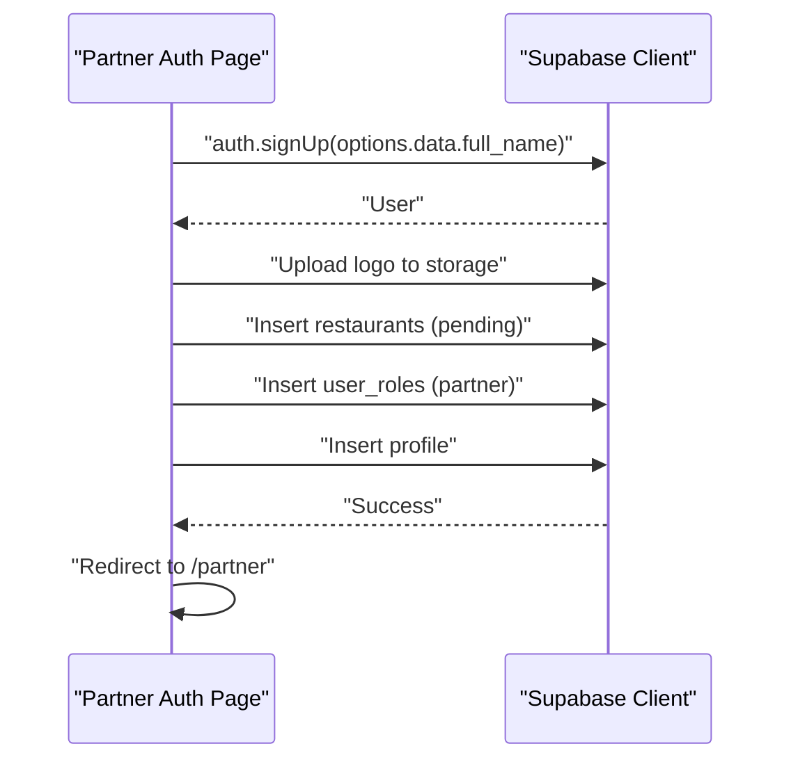

**Diagram sources**
- [PartnerAuth.tsx:200-275](file://src/pages/partner/PartnerAuth.tsx#L200-L275)

**Section sources**
- [PartnerAuth.tsx:1-492](file://src/pages/partner/PartnerAuth.tsx#L1-L492)

### Password Reset Procedures
- Forgot password flow validates email, sends OTP via Supabase, and verifies OTP
- OTP is entered in a numeric keypad UI with resend capability and countdown
- After verification, navigates to reset password page

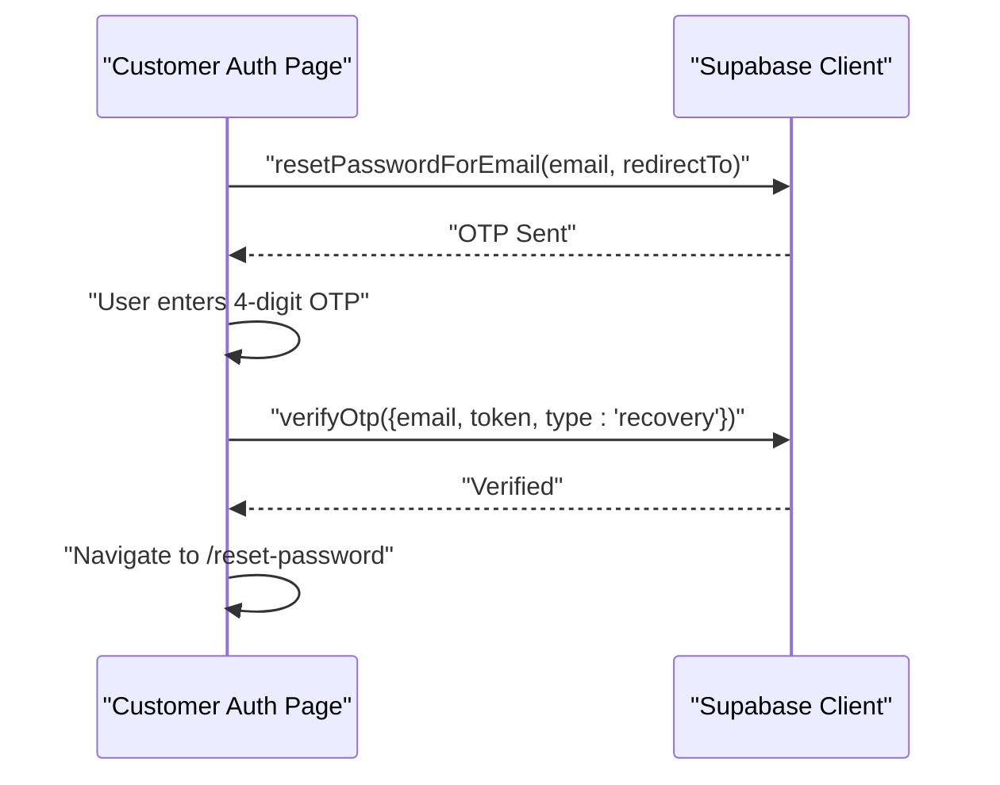

**Diagram sources**
- [Auth.tsx:216-292](file://src/pages/Auth.tsx#L216-L292)

**Section sources**
- [Auth.tsx:216-292](file://src/pages/Auth.tsx#L216-L292)

### Role Assignment Mechanisms
- Drivers: Assigned role "driver" and created driver record with pending approval
- Partners: Assigned role "partner" and created restaurant record with pending approval
- Admin/staff: Determined by presence in user_roles table
- Fleet managers: Determined by fleet_managers table with active flag

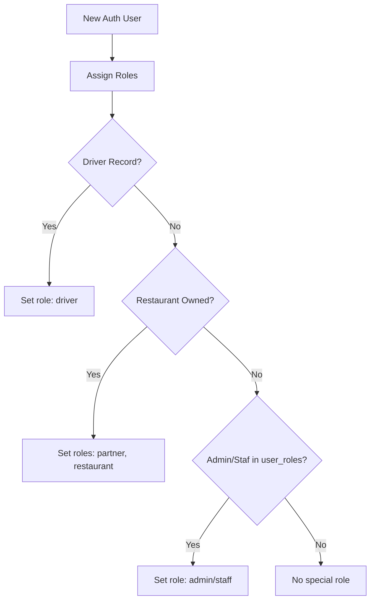

**Diagram sources**
- [DriverAuth.tsx:148-157](file://src/pages/driver/DriverAuth.tsx#L148-L157)
- [PartnerAuth.tsx:235-245](file://src/pages/partner/PartnerAuth.tsx#L235-L245)
- [Auth.tsx:80-115](file://src/pages/Auth.tsx#L80-L115)

**Section sources**
- [DriverAuth.tsx:122-177](file://src/pages/driver/DriverAuth.tsx#L122-L177)
- [PartnerAuth.tsx:200-275](file://src/pages/partner/PartnerAuth.tsx#L200-L275)
- [Auth.tsx:80-115](file://src/pages/Auth.tsx#L80-L115)

### Protected Routes and Conditional Rendering
- ProtectedRoute accepts requiredRole and requireApproval props
- Uses role hierarchy to allow higher roles to access lower-role routes
- Redirects unauthorized users to appropriate dashboards
- Renders fallback content when provided and user lacks access

Practical example: Add a new protected route requiring "admin" role
- Wrap the route with ProtectedRoute and set requiredRole="admin"
- Optionally set fallback to render a custom message or component

**Section sources**
- [ProtectedRoute.tsx:139-230](file://src/components/ProtectedRoute.tsx#L139-L230)
- [ProtectedRoute.tsx:232-263](file://src/components/ProtectedRoute.tsx#L232-L263)

## Dependency Analysis
The authentication system exhibits clear separation of concerns:
- AuthContext depends on Supabase client for session management
- ProtectedRoute depends on AuthContext and Supabase for role resolution
- Portal pages depend on Supabase for auth and database operations
- IP utilities depend on Supabase Edge Functions for geolocation and logging

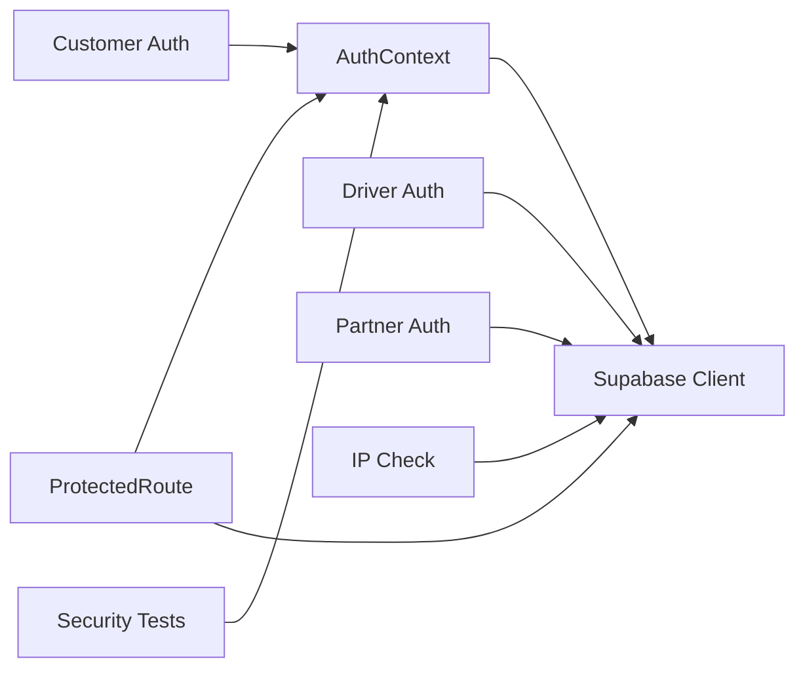

**Diagram sources**
- [AuthContext.tsx:31-130](file://src/contexts/AuthContext.tsx#L31-L130)
- [ProtectedRoute.tsx:139-230](file://src/components/ProtectedRoute.tsx#L139-L230)
- [Auth.tsx:19-115](file://src/pages/Auth.tsx#L19-L115)
- [DriverAuth.tsx:25-188](file://src/pages/driver/DriverAuth.tsx#L25-L188)
- [PartnerAuth.tsx:30-275](file://src/pages/partner/PartnerAuth.tsx#L30-L275)
- [ipCheck.ts:19-107](file://src/lib/ipCheck.ts#L19-L107)
- [security.spec.ts](file://e2e/system/security.spec.ts)

**Section sources**
- [AuthContext.tsx:1-131](file://src/contexts/AuthContext.tsx#L1-L131)
- [ProtectedRoute.tsx:1-264](file://src/components/ProtectedRoute.tsx#L1-L264)
- [Auth.tsx:1-890](file://src/pages/Auth.tsx#L1-L890)
- [DriverAuth.tsx:1-322](file://src/pages/driver/DriverAuth.tsx#L1-L322)
- [PartnerAuth.tsx:1-492](file://src/pages/partner/PartnerAuth.tsx#L1-L492)
- [ipCheck.ts:1-107](file://src/lib/ipCheck.ts#L1-L107)
- [security.spec.ts](file://e2e/system/security.spec.ts)

## Performance Considerations
- Role caching in ProtectedRoute reduces repeated database queries for user roles
- Supabase auto-refresh minimizes token expiration impact on UX
- Capacitor storage adapter avoids blocking UI during session persistence
- IP checks use fail-open behavior to prevent availability degradation

## Troubleshooting Guide
Common issues and resolutions:
- Authentication state not updating: Ensure AuthContext is mounted at the root and subscribes to Supabase auth state changes
- Protected routes redirecting unexpectedly: Verify user roles exist in user_roles table and approval statuses in restaurants/drivers
- IP restrictions blocking legitimate users: Confirm IP check bypass is removed in production and Edge Functions are deployed
- Native push notifications not initializing: Check Capacitor preferences integration and platform detection logic
- Security test failures: Review e2e/system/security.spec.ts scenarios and ensure Supabase Edge Functions are reachable

**Section sources**
- [AuthContext.tsx:36-61](file://src/contexts/AuthContext.tsx#L36-L61)
- [ProtectedRoute.tsx:160-189](file://src/components/ProtectedRoute.tsx#L160-L189)
- [ipCheck.ts:19-80](file://src/lib/ipCheck.ts#L19-L80)
- [security.spec.ts](file://e2e/system/security.spec.ts)

## Conclusion
Nutrio’s authentication and authorization system leverages Supabase for robust session and token management, with a flexible RBAC layer enforced by ProtectedRoute. Multi-tenant support is achieved through role assignments and approval checks across customer, driver, and partner portals. IP location verification and user IP logging provide security visibility, while native device integration enhances user experience. The modular design facilitates extending access controls and adding new protected routes with minimal effort.