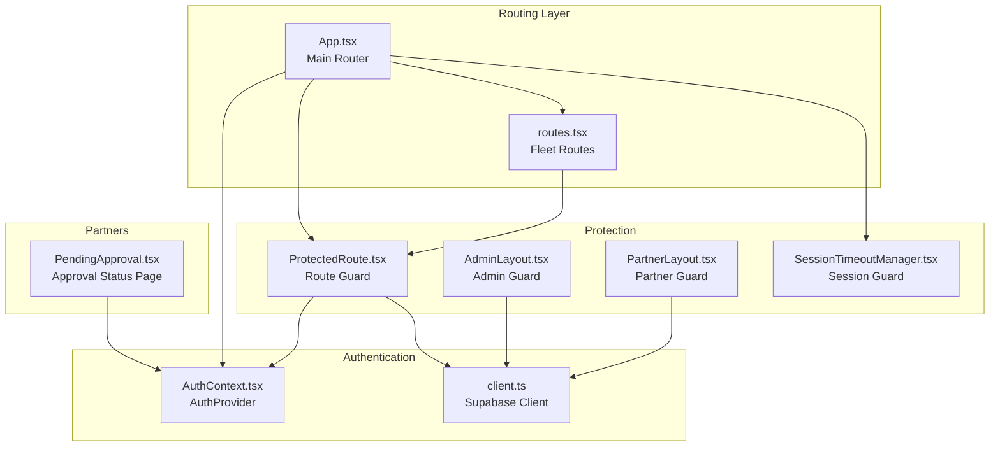
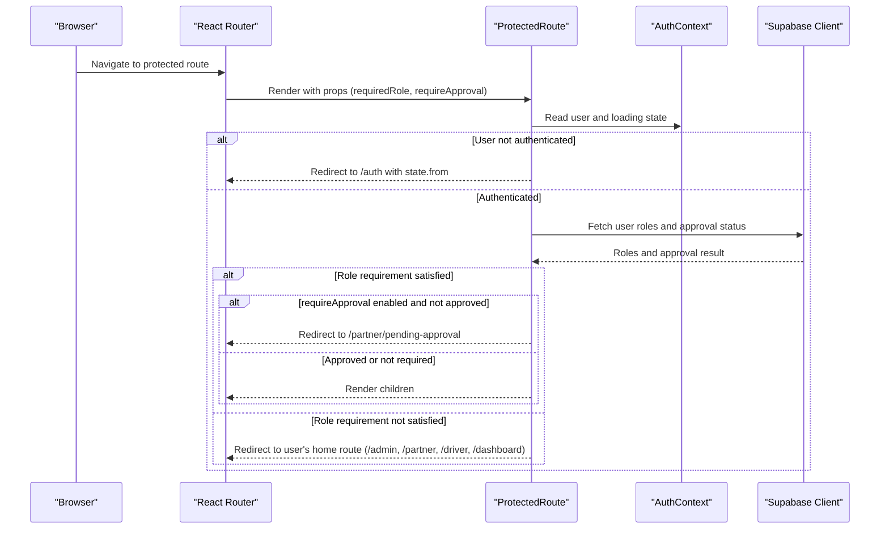
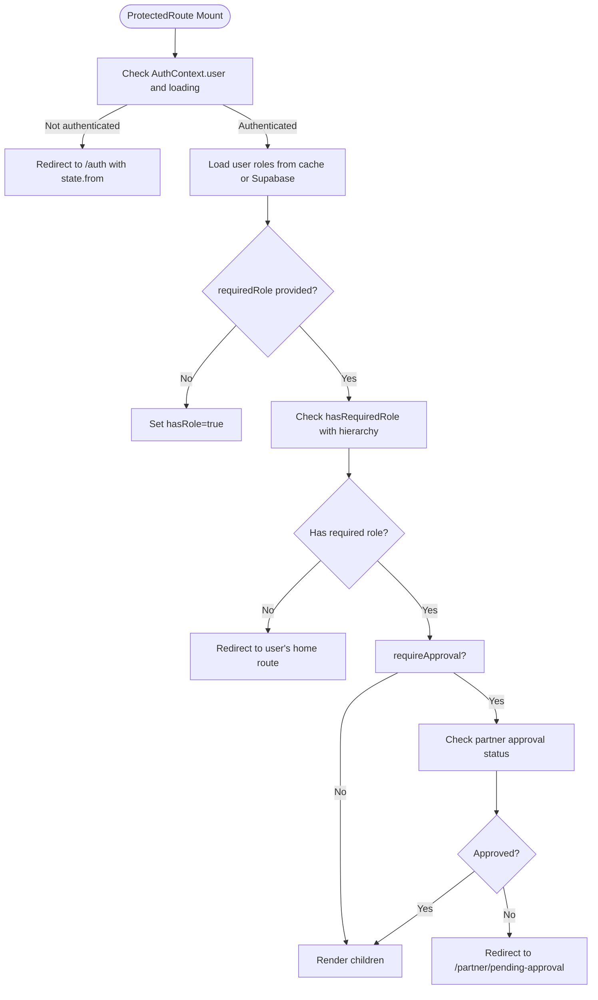
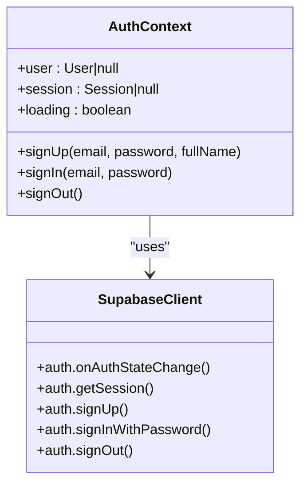
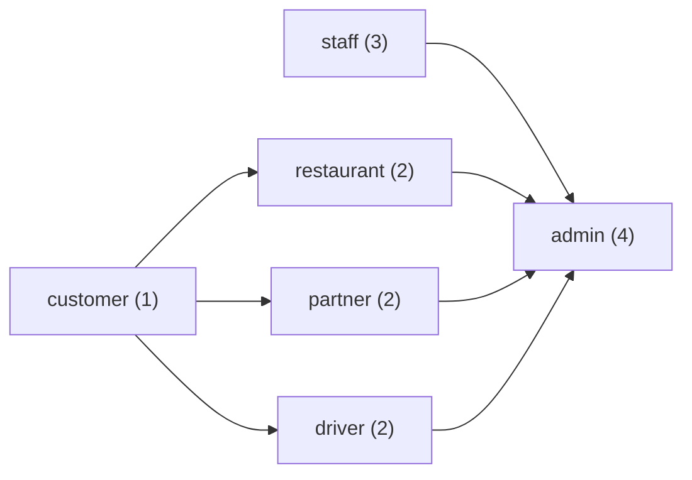
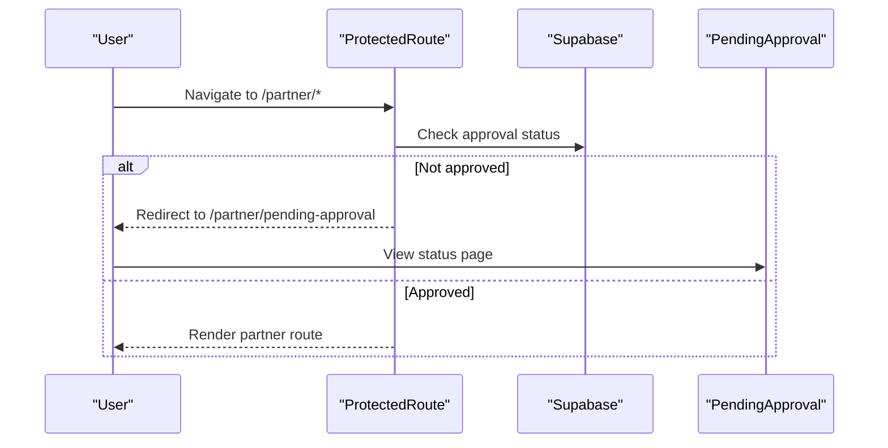
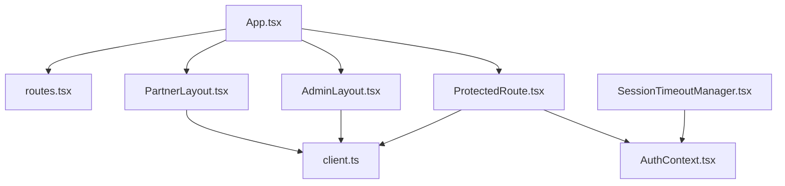

# Protected Routes & Access Control

<cite>
**Referenced Files in This Document**
- [ProtectedRoute.tsx](file://src/components/ProtectedRoute.tsx)
- [AuthContext.tsx](file://src/contexts/AuthContext.tsx)
- [App.tsx](file://src/App.tsx)
- [routes.tsx](file://src/fleet/routes.tsx)
- [client.ts](file://src/integrations/supabase/client.ts)
- [PendingApproval.tsx](file://src/pages/partner/PendingApproval.tsx)
- [SessionTimeoutManager.tsx](file://src/components/SessionTimeoutManager.tsx)
- [AdminLayout.tsx](file://src/components/AdminLayout.tsx)
- [PartnerLayout.tsx](file://src/components/PartnerLayout.tsx)
- [20250220000000_create_essential_tables.sql](file://supabase/migrations/20250220000000_create_essential_tables.sql)
- [20250220000001_fix_ip_rls_policies.sql](file://supabase/migrations/20250220000001_fix_ip_rls_policies.sql)
- [20260226000004_staff_rls_policies.sql](file://supabase/migrations/20260226000004_staff_rls_policies.sql)
</cite>

## Table of Contents
1. [Introduction](#introduction)
2. [Project Structure](#project-structure)
3. [Core Components](#core-components)
4. [Architecture Overview](#architecture-overview)
5. [Detailed Component Analysis](#detailed-component-analysis)
6. [Dependency Analysis](#dependency-analysis)
7. [Performance Considerations](#performance-considerations)
8. [Troubleshooting Guide](#troubleshooting-guide)
9. [Conclusion](#conclusion)

## Introduction
This document explains the protected routes and access control system in Nutrio. It focuses on the ProtectedRoute component, role-based access control (RBAC), authentication guards, and conditional rendering logic. It also covers how routes are secured based on user roles and permissions, redirect logic for unauthorized access, integration with the authentication context, handling of loading states and authentication status, and practical patterns for implementing new protected routes, customizing access rules, and managing edge cases like session expiration.

## Project Structure
The access control system spans several key areas:
- Authentication provider and context for user/session state
- ProtectedRoute component for route-level RBAC
- Application routing configuration that wraps routes with protection
- Layout components that enforce role-specific access
- Supabase integration for authentication and role data
- Fleet portal with its own protected route guard

**Diagram sources**
- [App.tsx:139-739](file://src/App.tsx#L139-L739)
- [routes.tsx:1-42](file://src/fleet/routes.tsx#L1-L42)
- [AuthContext.tsx:31-130](file://src/contexts/AuthContext.tsx#L31-L130)
- [client.ts:47-57](file://src/integrations/supabase/client.ts#L47-L57)
- [ProtectedRoute.tsx:139-230](file://src/components/ProtectedRoute.tsx#L139-L230)
- [AdminLayout.tsx:25-129](file://src/components/AdminLayout.tsx#L25-L129)
- [PartnerLayout.tsx:27-140](file://src/components/PartnerLayout.tsx#L27-L140)
- [SessionTimeoutManager.tsx:47-317](file://src/components/SessionTimeoutManager.tsx#L47-L317)
- [PendingApproval.tsx:23-80](file://src/pages/partner/PendingApproval.tsx#L23-L80)

**Section sources**
- [App.tsx:139-739](file://src/App.tsx#L139-L739)
- [routes.tsx:1-42](file://src/fleet/routes.tsx#L1-L42)

## Core Components
- ProtectedRoute: Central route guard that checks authentication, resolves user roles, enforces role hierarchy, and handles approval requirements for partners.
- AuthContext: Provides authentication state, session lifecycle, and sign-in/sign-out operations via Supabase.
- Supabase Client: Configured with persistent sessions and native storage for Capacitor environments.
- AdminLayout and PartnerLayout: Additional guards that verify explicit roles after initial route protection.
- SessionTimeoutManager: Handles idle timeouts and session warnings across the application.
- Fleet routes: Separate protected routing for the fleet management portal.

Key responsibilities:
- Authentication: Determined by AuthContext user/session state.
- Authorization: Determined by ProtectedRoute role checks and optional approval status.
- Conditional rendering: ProtectedRoute renders children when authorized, redirects otherwise, or shows a loader while resolving state.
- Approval gating: Partner routes can require restaurant approval status.

**Section sources**
- [ProtectedRoute.tsx:139-230](file://src/components/ProtectedRoute.tsx#L139-L230)
- [AuthContext.tsx:31-130](file://src/contexts/AuthContext.tsx#L31-L130)
- [client.ts:47-57](file://src/integrations/supabase/client.ts#L47-L57)
- [AdminLayout.tsx:25-129](file://src/components/AdminLayout.tsx#L25-L129)
- [PartnerLayout.tsx:27-140](file://src/components/PartnerLayout.tsx#L27-L140)
- [SessionTimeoutManager.tsx:47-317](file://src/components/SessionTimeoutManager.tsx#L47-L317)

## Architecture Overview
The access control architecture combines route-level protection with runtime role resolution and approval checks. ProtectedRoute integrates with AuthContext for authentication state and Supabase for role discovery and approval status. The main App router defines protected routes per portal, while AdminLayout and PartnerLayout provide additional enforcement for administrative and partner-specific pages.

**Diagram sources**
- [ProtectedRoute.tsx:145-230](file://src/components/ProtectedRoute.tsx#L145-L230)
- [AuthContext.tsx:19-25](file://src/contexts/AuthContext.tsx#L19-L25)
- [client.ts:47-57](file://src/integrations/supabase/client.ts#L47-L57)
- [App.tsx:364-470](file://src/App.tsx#L364-L470)

## Detailed Component Analysis

### ProtectedRoute Component
ProtectedRoute orchestrates authentication, role resolution, and conditional rendering:
- Authentication: Uses AuthContext to determine if a user is present and not loading.
- Role Resolution: Queries Supabase for roles from multiple sources and caches results for performance.
- Role Hierarchy: Supports hierarchical access where higher roles can access lower-role routes.
- Approval Check: Optional approval requirement for partner routes.
- Redirect Logic: Redirects to appropriate home page based on detected roles or to /auth when unauthenticated.
- Fallback Rendering: Allows rendering a custom fallback component when role requirements are not met.

**Diagram sources**
- [ProtectedRoute.tsx:152-230](file://src/components/ProtectedRoute.tsx#L152-L230)
- [ProtectedRoute.tsx:40-98](file://src/components/ProtectedRoute.tsx#L40-L98)
- [ProtectedRoute.tsx:103-119](file://src/components/ProtectedRoute.tsx#L103-L119)
- [ProtectedRoute.tsx:124-137](file://src/components/ProtectedRoute.tsx#L124-L137)

**Section sources**
- [ProtectedRoute.tsx:139-230](file://src/components/ProtectedRoute.tsx#L139-L230)
- [ProtectedRoute.tsx:40-98](file://src/components/ProtectedRoute.tsx#L40-L98)
- [ProtectedRoute.tsx:103-119](file://src/components/ProtectedRoute.tsx#L103-L119)
- [ProtectedRoute.tsx:124-137](file://src/components/ProtectedRoute.tsx#L124-L137)

### Authentication Context and Supabase Integration
AuthContext manages authentication state and session lifecycle:
- Initializes Supabase auth listener and session retrieval on mount.
- Provides sign-up, sign-in, and sign-out methods.
- Integrates with Supabase client configured for persistent sessions and native storage.

Supabase client configuration ensures:
- Persistent session storage using Capacitor Preferences on native platforms.
- Auto-refresh of tokens and secure auth handling.

**Diagram sources**
- [AuthContext.tsx:31-130](file://src/contexts/AuthContext.tsx#L31-L130)
- [client.ts:47-57](file://src/integrations/supabase/client.ts#L47-L57)

**Section sources**
- [AuthContext.tsx:31-130](file://src/contexts/AuthContext.tsx#L31-L130)
- [client.ts:47-57](file://src/integrations/supabase/client.ts#L47-L57)

### Role-Based Access Control and Hierarchies
ProtectedRoute implements a role hierarchy where higher roles can access lower-role routes:
- customer: 1
- restaurant: 2
- partner: 2
- driver: 2
- staff: 3
- admin: 4

Role detection sources:
- user_roles table entries
- Restaurant ownership (automatically grants partner and restaurant roles)
- Driver registration (grants driver role)

**Diagram sources**
- [ProtectedRoute.tsx:17-24](file://src/components/ProtectedRoute.tsx#L17-L24)
- [ProtectedRoute.tsx:49-98](file://src/components/ProtectedRoute.tsx#L49-L98)

**Section sources**
- [ProtectedRoute.tsx:17-24](file://src/components/ProtectedRoute.tsx#L17-L24)
- [ProtectedRoute.tsx:49-98](file://src/components/ProtectedRoute.tsx#L49-L98)

### Partner Approval Workflow
Partner routes can require approval status:
- ProtectedRoute checks approval when requireApproval is true and the user has the partner role.
- PendingApproval page displays the current restaurant application status and provides actions for the user.

**Diagram sources**
- [ProtectedRoute.tsx:171-175](file://src/components/ProtectedRoute.tsx#L171-L175)
- [ProtectedRoute.tsx:224-227](file://src/components/ProtectedRoute.tsx#L224-L227)
- [PendingApproval.tsx:36-80](file://src/pages/partner/PendingApproval.tsx#L36-L80)

**Section sources**
- [ProtectedRoute.tsx:171-175](file://src/components/ProtectedRoute.tsx#L171-L175)
- [ProtectedRoute.tsx:224-227](file://src/components/ProtectedRoute.tsx#L224-L227)
- [PendingApproval.tsx:36-80](file://src/pages/partner/PendingApproval.tsx#L36-L80)

### Additional Guards: AdminLayout and PartnerLayout
AdminLayout and PartnerLayout provide additional enforcement:
- AdminLayout verifies admin privileges via Supabase role checks and redirects non-admins to the customer dashboard.
- PartnerLayout verifies either a partner role or restaurant ownership and redirects non-partners similarly.

These guards complement ProtectedRoute by ensuring explicit role membership beyond route-level protection.

**Section sources**
- [AdminLayout.tsx:39-67](file://src/components/AdminLayout.tsx#L39-L67)
- [PartnerLayout.tsx:41-76](file://src/components/PartnerLayout.tsx#L41-L76)

### Fleet Portal Protected Routes
The fleet portal uses its own routing system with ProtectedFleetRoute and FleetAuthContext. While distinct from the main ProtectedRoute, it follows similar patterns for authentication and authorization within the fleet domain.

**Section sources**
- [routes.tsx:20-41](file://src/fleet/routes.tsx#L20-L41)

## Dependency Analysis
The access control system exhibits clear separation of concerns:
- ProtectedRoute depends on AuthContext for authentication state and Supabase for role data.
- App routing configures ProtectedRoute around portal routes.
- AdminLayout and PartnerLayout depend on Supabase for explicit role verification.
- SessionTimeoutManager depends on AuthContext for session lifecycle and user presence.

**Diagram sources**
- [App.tsx:139-739](file://src/App.tsx#L139-L739)
- [ProtectedRoute.tsx:139-230](file://src/components/ProtectedRoute.tsx#L139-L230)
- [AuthContext.tsx:31-130](file://src/contexts/AuthContext.tsx#L31-L130)
- [client.ts:47-57](file://src/integrations/supabase/client.ts#L47-L57)
- [AdminLayout.tsx:25-129](file://src/components/AdminLayout.tsx#L25-L129)
- [PartnerLayout.tsx:27-140](file://src/components/PartnerLayout.tsx#L27-L140)
- [SessionTimeoutManager.tsx:47-317](file://src/components/SessionTimeoutManager.tsx#L47-L317)
- [routes.tsx:1-42](file://src/fleet/routes.tsx#L1-L42)

**Section sources**
- [App.tsx:139-739](file://src/App.tsx#L139-L739)

## Performance Considerations
- Role caching: ProtectedRoute caches role results with a TTL to minimize repeated Supabase queries.
- Lazy loading: Routes are lazily loaded to reduce initial bundle size.
- Efficient role checks: Role hierarchy comparison avoids expensive computations by leveraging numeric levels.
- Session persistence: Supabase client persists sessions and refreshes tokens automatically, reducing re-authentication overhead.

Best practices:
- Keep role cache TTL reasonable to balance freshness and performance.
- Use lazy-loaded route components for infrequently accessed pages.
- Minimize role queries by leveraging cached results and avoiding redundant checks.

**Section sources**
- [ProtectedRoute.tsx:34-35](file://src/components/ProtectedRoute.tsx#L34-L35)
- [ProtectedRoute.tsx:40-98](file://src/components/ProtectedRoute.tsx#L40-L98)
- [client.ts:47-57](file://src/integrations/supabase/client.ts#L47-L57)

## Troubleshooting Guide
Common issues and resolutions:
- Unauthorized access attempts: ProtectedRoute redirects to the user's home route based on detected roles. Verify role assignments in the user_roles table and restaurant ownership records.
- Partner approval redirects: Users without approved restaurants are redirected to the pending-approval page. Ensure restaurant approval status is correctly maintained.
- Authentication failures: Check AuthContext initialization and Supabase client configuration. Confirm environment variables for Supabase URLs and keys are set.
- Session expiration: SessionTimeoutManager handles idle timeouts. Use the provided hook to pause timeout during long operations and ensure proper session lifecycle management.
- Mixed guards: If both ProtectedRoute and AdminLayout/PartnerLayout are used, ensure the route hierarchy aligns with intended access levels.

Operational checks:
- Verify Supabase policies allow authenticated users to view their own roles and that admin policies permit role management.
- Confirm that staff permissions and restaurant staff roles are properly defined in database migrations.

**Section sources**
- [ProtectedRoute.tsx:206-227](file://src/components/ProtectedRoute.tsx#L206-L227)
- [ProtectedRoute.tsx:224-227](file://src/components/ProtectedRoute.tsx#L224-L227)
- [AuthContext.tsx:36-61](file://src/contexts/AuthContext.tsx#L36-L61)
- [client.ts:10-16](file://src/integrations/supabase/client.ts#L10-L16)
- [SessionTimeoutManager.tsx:125-134](file://src/components/SessionTimeoutManager.tsx#L125-L134)
- [20250220000000_create_essential_tables.sql:127-136](file://supabase/migrations/20250220000000_create_essential_tables.sql#L127-L136)
- [20250220000001_fix_ip_rls_policies.sql:47-56](file://supabase/migrations/20250220000001_fix_ip_rls_policies.sql#L47-L56)
- [20260226000004_staff_rls_policies.sql:304-326](file://supabase/migrations/20260226000004_staff_rls_policies.sql#L304-L326)

## Conclusion
Nutrio’s access control system combines route-level protection with robust role resolution and approval checks. ProtectedRoute centralizes authentication and authorization logic, integrating seamlessly with AuthContext and Supabase. The system supports hierarchical roles, cached role queries, and clear redirect semantics for unauthorized access. AdminLayout and PartnerLayout provide additional enforcement for specialized portals. Together, these components deliver a maintainable and extensible access control framework suitable for multi-portal applications.