# Session Management & State Persistence

<cite>
**Referenced Files in This Document**
- [AuthContext.tsx](file://src/contexts/AuthContext.tsx)
- [client.ts](file://src/integrations/supabase/client.ts)
- [push.ts](file://src/lib/notifications/push.ts)
- [capacitor.ts](file://src/lib/capacitor.ts)
- [SessionTimeoutManager.tsx](file://src/components/SessionTimeoutManager.tsx)
- [Auth.tsx](file://src/pages/Auth.tsx)
- [ipCheck.ts](file://src/lib/ipCheck.ts)
- [cache.ts](file://src/lib/cache.ts)
</cite>

## Table of Contents
1. [Introduction](#introduction)
2. [Project Structure](#project-structure)
3. [Core Components](#core-components)
4. [Architecture Overview](#architecture-overview)
5. [Detailed Component Analysis](#detailed-component-analysis)
6. [Dependency Analysis](#dependency-analysis)
7. [Performance Considerations](#performance-considerations)
8. [Security Considerations](#security-considerations)
9. [Troubleshooting Guide](#troubleshooting-guide)
10. [Conclusion](#conclusion)

## Introduction
This document provides comprehensive documentation for session management and state persistence in Nutrio's authentication system. It covers the Supabase auth state listener implementation, session restoration on application startup, automatic reconnection handling, session storage mechanisms (including local storage usage for email persistence and session token management), integration with Capacitor native platform features, and how session state is maintained across app restarts. It also documents the push notification initialization flow and how session state affects notification permissions, along with examples of handling session expiration, manual session clearing, and session synchronization across multiple tabs or browser instances. Security considerations for session storage, token refresh mechanisms, and preventing session hijacking are addressed throughout.

## Project Structure
The session management system spans several key areas:
- Authentication context and lifecycle management
- Supabase client configuration for session persistence
- Capacitor integration for native platform features
- Push notification service initialization and token management
- Session timeout management for web browsers
- IP location checks and role-based routing

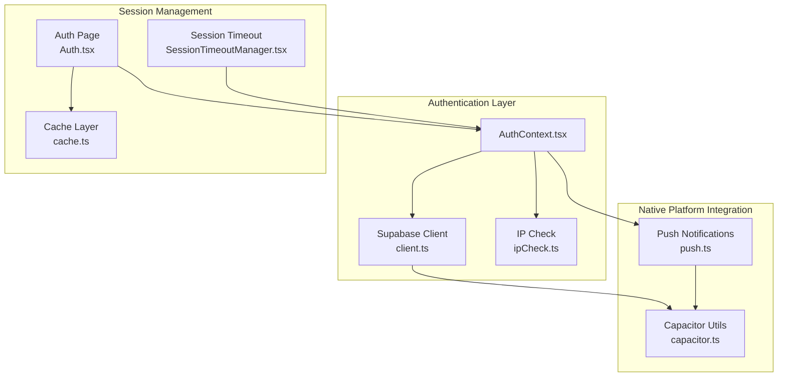

**Diagram sources**
- [AuthContext.tsx:31-61](file://src/contexts/AuthContext.tsx#L31-L61)
- [client.ts:47-57](file://src/integrations/supabase/client.ts#L47-L57)
- [capacitor.ts:27-43](file://src/lib/capacitor.ts#L27-L43)
- [push.ts:25-75](file://src/lib/notifications/push.ts#L25-L75)
- [SessionTimeoutManager.tsx:47-81](file://src/components/SessionTimeoutManager.tsx#L47-L81)
- [Auth.tsx:51-54](file://src/pages/Auth.tsx#L51-L54)
- [ipCheck.ts:19-80](file://src/lib/ipCheck.ts#L19-L80)

**Section sources**
- [AuthContext.tsx:1-131](file://src/contexts/AuthContext.tsx#L1-L131)
- [client.ts:1-57](file://src/integrations/supabase/client.ts#L1-L57)
- [capacitor.ts:1-640](file://src/lib/capacitor.ts#L1-L640)
- [push.ts:1-137](file://src/lib/notifications/push.ts#L1-L137)
- [SessionTimeoutManager.tsx:1-344](file://src/components/SessionTimeoutManager.tsx#L1-L344)
- [Auth.tsx:1-800](file://src/pages/Auth.tsx#L1-L800)
- [ipCheck.ts:1-107](file://src/lib/ipCheck.ts#L1-L107)
- [cache.ts:1-199](file://src/lib/cache.ts#L1-L199)

## Core Components
This section analyzes the primary components involved in session management and state persistence.

### Supabase Authentication Client Configuration
The Supabase client is configured with session persistence and automatic token refresh enabled. The storage mechanism adapts based on the platform:
- Native platforms use Capacitor Preferences for secure session storage
- Web platforms use localStorage for session persistence

Key configuration highlights:
- Session persistence enabled to maintain login state across app restarts
- Automatic token refresh to keep sessions valid without manual intervention
- Platform-specific storage adapter for secure token handling

**Section sources**
- [client.ts:47-57](file://src/integrations/supabase/client.ts#L47-L57)
- [client.ts:18-42](file://src/integrations/supabase/client.ts#L18-L42)
- [client.ts:44-45](file://src/integrations/supabase/client.ts#L44-L45)

### Authentication Context Provider
The AuthContext provider manages the complete authentication lifecycle:
- Sets up the Supabase auth state listener as the first operation
- Restores existing sessions on application startup
- Initializes push notifications for native platforms upon user sign-in
- Provides sign-up, sign-in, and sign-out functionality

The provider ensures proper ordering of operations to guarantee reliable session restoration and state synchronization.

**Section sources**
- [AuthContext.tsx:36-61](file://src/contexts/AuthContext.tsx#L36-L61)
- [AuthContext.tsx:114-118](file://src/contexts/AuthContext.tsx#L114-L118)

### Push Notification Service
The push notification service handles native platform notification permissions and token management:
- Checks and requests notification permissions on native platforms
- Registers for push notifications and captures FCM tokens
- Saves tokens to the database associated with the authenticated user
- Handles notification tap actions and navigation

The service initializes only on native platforms and requires user authentication to save tokens.

**Section sources**
- [push.ts:25-75](file://src/lib/notifications/push.ts#L25-L75)
- [push.ts:77-108](file://src/lib/notifications/push.ts#L77-L108)
- [push.ts:110-125](file://src/lib/notifications/push.ts#L110-L125)

### Session Timeout Management (Web)
The SessionTimeoutManager component provides idle-based session termination for web browsers:
- 30-minute idle timeout with 2-minute warning period
- Cross-tab synchronization using BroadcastChannel
- Activity detection through multiple event types
- Temporary suspension during form submissions and long API calls

**Section sources**
- [SessionTimeoutManager.tsx:17-32](file://src/components/SessionTimeoutManager.tsx#L17-L32)
- [SessionTimeoutManager.tsx:63-81](file://src/components/SessionTimeoutManager.tsx#L63-L81)
- [SessionTimeoutManager.tsx:136-150](file://src/components/SessionTimeoutManager.tsx#L136-L150)

### Email Persistence and Remember Me
The authentication page implements email persistence using localStorage:
- Automatically loads previously saved email addresses
- Supports "Remember me" functionality for convenience
- Clears stored email on logout for security

**Section sources**
- [Auth.tsx:51-54](file://src/pages/Auth.tsx#L51-L54)
- [Auth.tsx:179-182](file://src/pages/Auth.tsx#L179-L182)
- [Auth.tsx:116-118](file://src/pages/Auth.tsx#L116-L118)

## Architecture Overview
The session management architecture integrates multiple layers to provide robust authentication and state persistence across platforms.

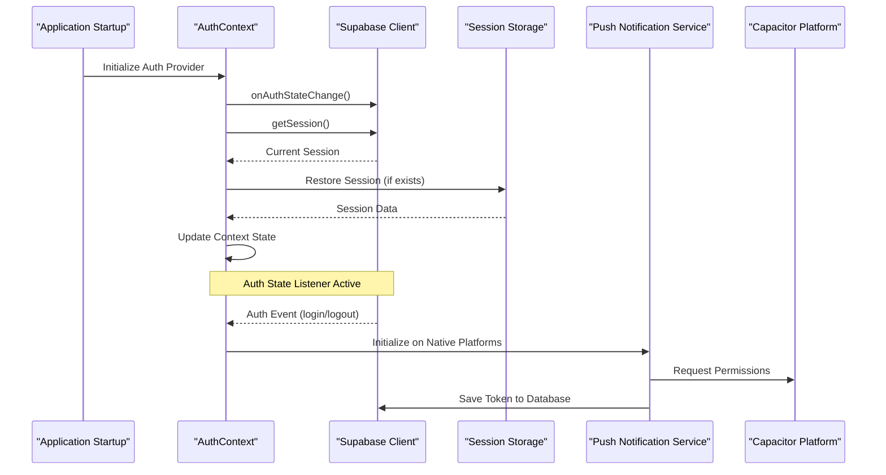

**Diagram sources**
- [AuthContext.tsx:36-61](file://src/contexts/AuthContext.tsx#L36-L61)
- [client.ts:47-57](file://src/integrations/supabase/client.ts#L47-L57)
- [push.ts:25-75](file://src/lib/notifications/push.ts#L25-L75)

## Detailed Component Analysis

### Supabase Auth State Listener Implementation
The auth state listener provides real-time session updates and automatic reconnection handling:

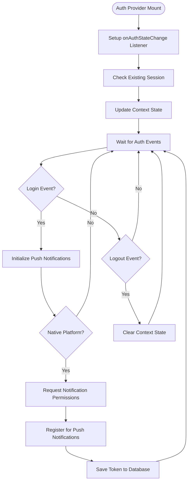

**Diagram sources**
- [AuthContext.tsx:36-61](file://src/contexts/AuthContext.tsx#L36-L61)
- [push.ts:25-75](file://src/lib/notifications/push.ts#L25-L75)

**Section sources**
- [AuthContext.tsx:36-61](file://src/contexts/AuthContext.tsx#L36-L61)

### Session Restoration on Application Startup
Session restoration follows a specific sequence to ensure reliability:

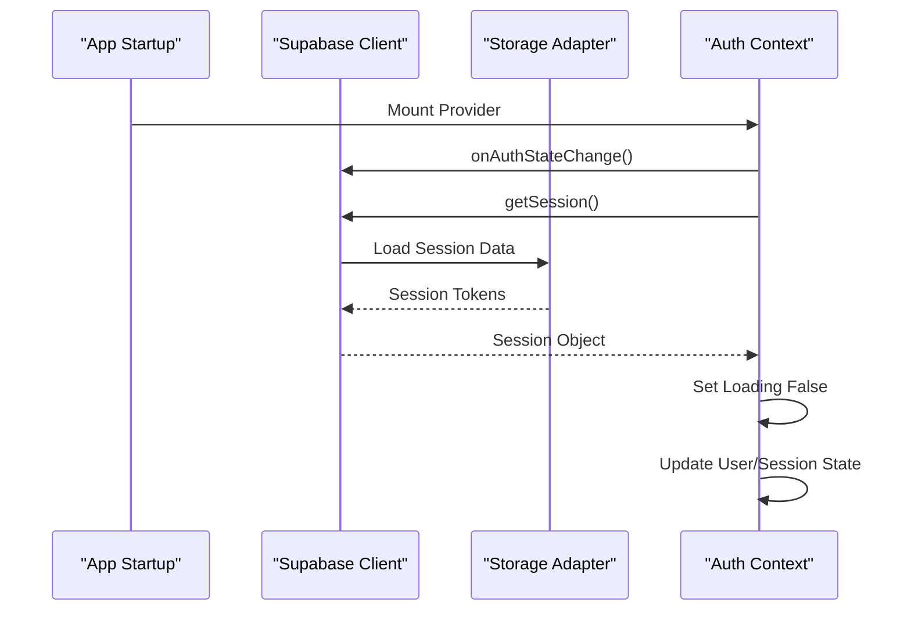

**Diagram sources**
- [AuthContext.tsx:36-61](file://src/contexts/AuthContext.tsx#L36-L61)
- [client.ts:47-57](file://src/integrations/supabase/client.ts#L47-L57)

**Section sources**
- [AuthContext.tsx:53-58](file://src/contexts/AuthContext.tsx#L53-L58)

### Automatic Reconnection Handling
The system handles automatic reconnection through Supabase's built-in mechanisms:

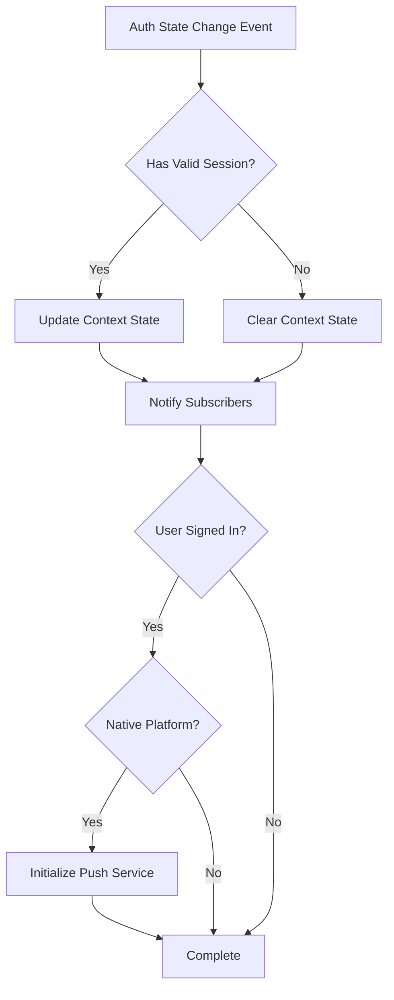

**Diagram sources**
- [AuthContext.tsx:38-50](file://src/contexts/AuthContext.tsx#L38-L50)

**Section sources**
- [AuthContext.tsx:38-50](file://src/contexts/AuthContext.tsx#L38-L50)

### Session Storage Mechanisms
The storage system adapts to different platforms:

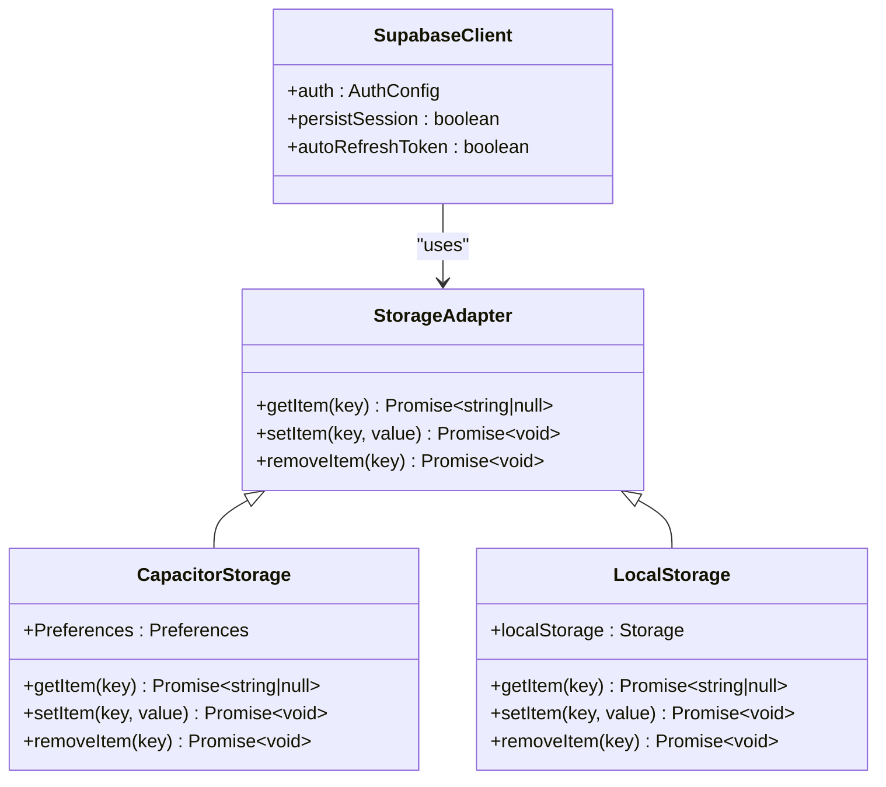

**Diagram sources**
- [client.ts:18-42](file://src/integrations/supabase/client.ts#L18-L42)
- [client.ts:44-45](file://src/integrations/supabase/client.ts#L44-L45)
- [client.ts:47-57](file://src/integrations/supabase/client.ts#L47-L57)

**Section sources**
- [client.ts:18-42](file://src/integrations/supabase/client.ts#L18-L42)
- [client.ts:44-45](file://src/integrations/supabase/client.ts#L44-L45)

### Push Notification Initialization Flow
The push notification service follows a structured initialization process:

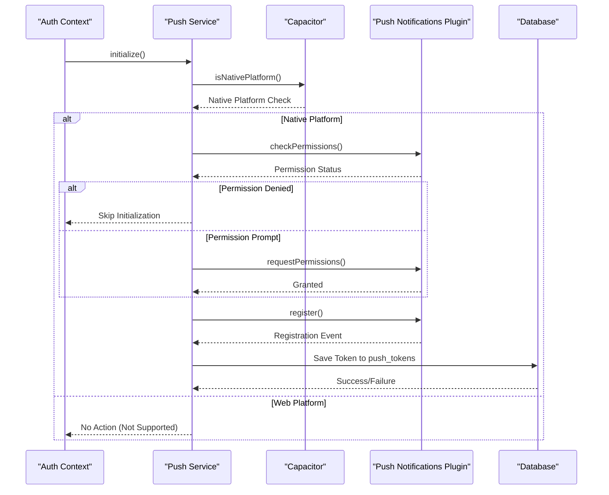

**Diagram sources**
- [push.ts:25-75](file://src/lib/notifications/push.ts#L25-L75)
- [AuthContext.tsx:44-49](file://src/contexts/AuthContext.tsx#L44-L49)

**Section sources**
- [push.ts:25-75](file://src/lib/notifications/push.ts#L25-L75)
- [AuthContext.tsx:44-49](file://src/contexts/AuthContext.tsx#L44-L49)

### Session Expiration Handling
The system implements multiple layers of session expiration protection:

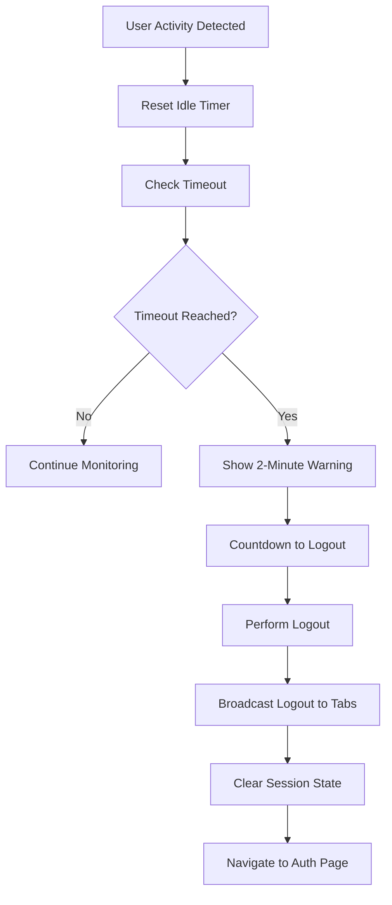

**Diagram sources**
- [SessionTimeoutManager.tsx:169-217](file://src/components/SessionTimeoutManager.tsx#L169-L217)

**Section sources**
- [SessionTimeoutManager.tsx:169-217](file://src/components/SessionTimeoutManager.tsx#L169-L217)

## Dependency Analysis
The session management system exhibits the following dependency relationships:

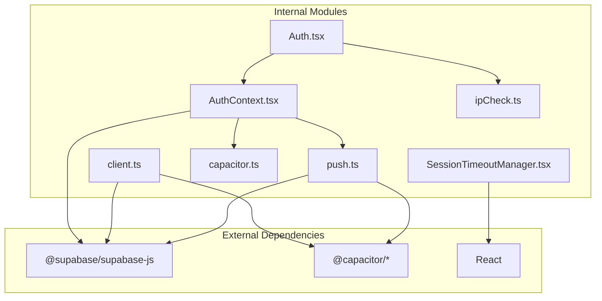

**Diagram sources**
- [AuthContext.tsx:1-7](file://src/contexts/AuthContext.tsx#L1-L7)
- [client.ts:1-8](file://src/integrations/supabase/client.ts#L1-L8)
- [push.ts:1-3](file://src/lib/notifications/push.ts#L1-L3)
- [capacitor.ts:8-21](file://src/lib/capacitor.ts#L8-L21)
- [SessionTimeoutManager.tsx:1-15](file://src/components/SessionTimeoutManager.tsx#L1-L15)
- [Auth.tsx:1-17](file://src/pages/Auth.tsx#L1-L17)
- [ipCheck.ts:1-10](file://src/lib/ipCheck.ts#L1-L10)

**Section sources**
- [AuthContext.tsx:1-7](file://src/contexts/AuthContext.tsx#L1-L7)
- [client.ts:1-8](file://src/integrations/supabase/client.ts#L1-L8)
- [push.ts:1-3](file://src/lib/notifications/push.ts#L1-L3)
- [capacitor.ts:8-21](file://src/lib/capacitor.ts#L8-L21)
- [SessionTimeoutManager.tsx:1-15](file://src/components/SessionTimeoutManager.tsx#L1-L15)
- [Auth.tsx:1-17](file://src/pages/Auth.tsx#L1-L17)
- [ipCheck.ts:1-10](file://src/lib/ipCheck.ts#L1-L10)

## Performance Considerations
Several performance optimizations are implemented in the session management system:

- **Lazy Initialization**: Push notification service initializes only when needed and only on native platforms
- **Efficient Storage**: Platform-specific storage adapters minimize overhead and maximize reliability
- **Automatic Token Refresh**: Reduces manual intervention and prevents unnecessary re-authentication
- **Cross-tab Synchronization**: Uses BroadcastChannel for efficient inter-tab communication
- **Conditional Rendering**: Session timeout manager only activates for authenticated users
- **Memory Management**: Proper cleanup of intervals and event listeners prevents memory leaks

## Security Considerations
The session management system implements multiple security measures:

### Session Storage Security
- **Native Platform Protection**: Capacitor Preferences provide secure storage on mobile devices
- **Web Platform Fallback**: localStorage usage with appropriate security headers
- **Automatic Cleanup**: Session tokens are cleared on logout to prevent unauthorized access
- **Environment Validation**: Missing configuration detection prevents runtime crashes

### Token Management
- **Automatic Refresh**: Built-in token refresh prevents session expiration during normal usage
- **Secure Transmission**: All authentication communications use HTTPS
- **Token Binding**: Push tokens are bound to specific user accounts in the database
- **Permission Control**: Push notifications require explicit user consent

### Session Hijacking Prevention
- **IP Location Checks**: Optional IP geolocation verification during authentication
- **Role-Based Access**: Post-authentication role verification prevents unauthorized access
- **Session Timeout**: Automatic logout after periods of inactivity reduces exposure windows
- **Cross-tab Synchronization**: Logout broadcasts prevent simultaneous access across browser tabs

### Additional Security Measures
- **Biometric Authentication**: Native biometric login for enhanced security on supported devices
- **Remember Me Protection**: Email persistence uses localStorage with appropriate security considerations
- **Rate Limiting**: Configurable rate limiting for authentication attempts
- **Audit Logging**: IP logging for security monitoring and incident response

**Section sources**
- [client.ts:18-42](file://src/integrations/supabase/client.ts#L18-L42)
- [Auth.tsx:179-182](file://src/pages/Auth.tsx#L179-L182)
- [ipCheck.ts:19-80](file://src/lib/ipCheck.ts#L19-L80)
- [SessionTimeoutManager.tsx:88-113](file://src/components/SessionTimeoutManager.tsx#L88-L113)

## Troubleshooting Guide

### Common Session Issues

#### Session Not Restoring on App Restart
**Symptoms**: Users remain logged out after closing and reopening the app
**Causes**:
- Missing or corrupted session storage
- Supabase configuration issues
- Platform detection problems

**Solutions**:
1. Verify Supabase configuration environment variables
2. Check platform detection logic in capacitor.ts
3. Inspect storage adapter implementation
4. Review session persistence settings

#### Push Notifications Not Working
**Symptoms**: Push notifications fail to register or receive tokens
**Causes**:
- Missing notification permissions
- Platform-specific configuration issues
- Network connectivity problems

**Solutions**:
1. Verify Capacitor plugin installation
2. Check notification permission status
3. Review Firebase Cloud Messaging configuration
4. Test network connectivity

#### Session Timeout Issues
**Symptoms**: Sessions expire unexpectedly or not at all
**Causes**:
- Incorrect timeout configuration
- Cross-tab synchronization failures
- Browser compatibility issues

**Solutions**:
1. Verify timeout constants in SessionTimeoutManager
2. Check BroadcastChannel support in target browsers
3. Review activity event detection
4. Test across different browser versions

### Manual Session Clearing
The system provides multiple mechanisms for manual session clearing:

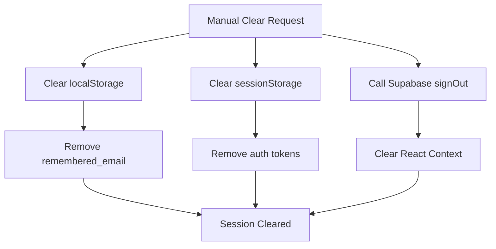

**Diagram sources**
- [Auth.tsx:116-118](file://src/pages/Auth.tsx#L116-L118)

**Section sources**
- [Auth.tsx:116-118](file://src/pages/Auth.tsx#L116-L118)

### Session Synchronization Across Tabs
The system implements cross-tab synchronization for web browsers:

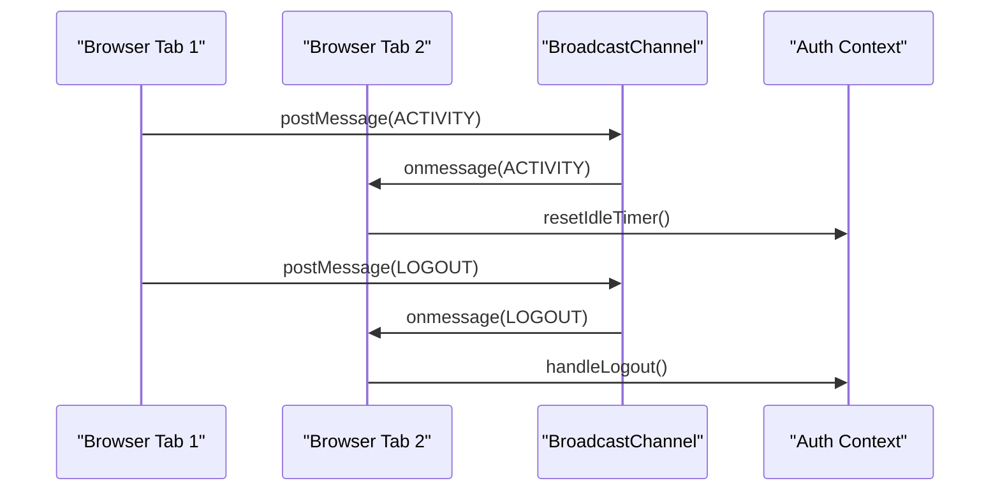

**Diagram sources**
- [SessionTimeoutManager.tsx:69-75](file://src/components/SessionTimeoutManager.tsx#L69-L75)

**Section sources**
- [SessionTimeoutManager.tsx:63-81](file://src/components/SessionTimeoutManager.tsx#L63-L81)

## Conclusion
Nutrio's session management and state persistence system provides a robust, multi-platform authentication solution. The implementation leverages Supabase's built-in capabilities while adding platform-specific enhancements for native applications. Key strengths include automatic session restoration, secure storage mechanisms, comprehensive push notification integration, and intelligent session timeout management. The system balances security with user experience through thoughtful design decisions, including automatic token refresh, cross-tab synchronization, and configurable timeout policies. Future enhancements could include advanced threat detection, enhanced encryption for sensitive data, and expanded biometric authentication support.