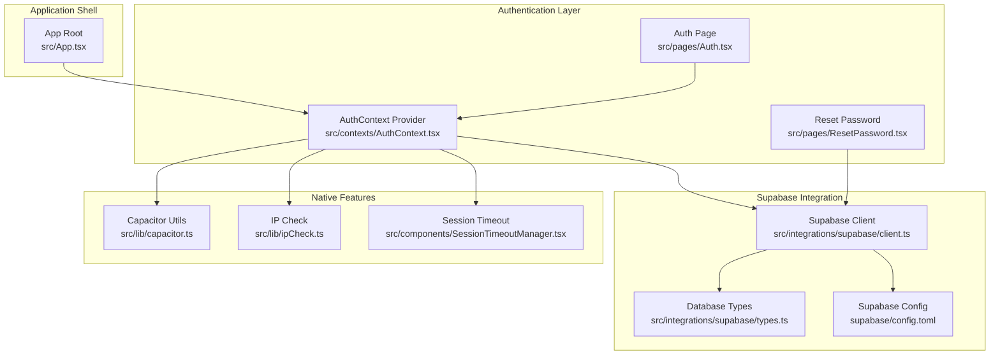
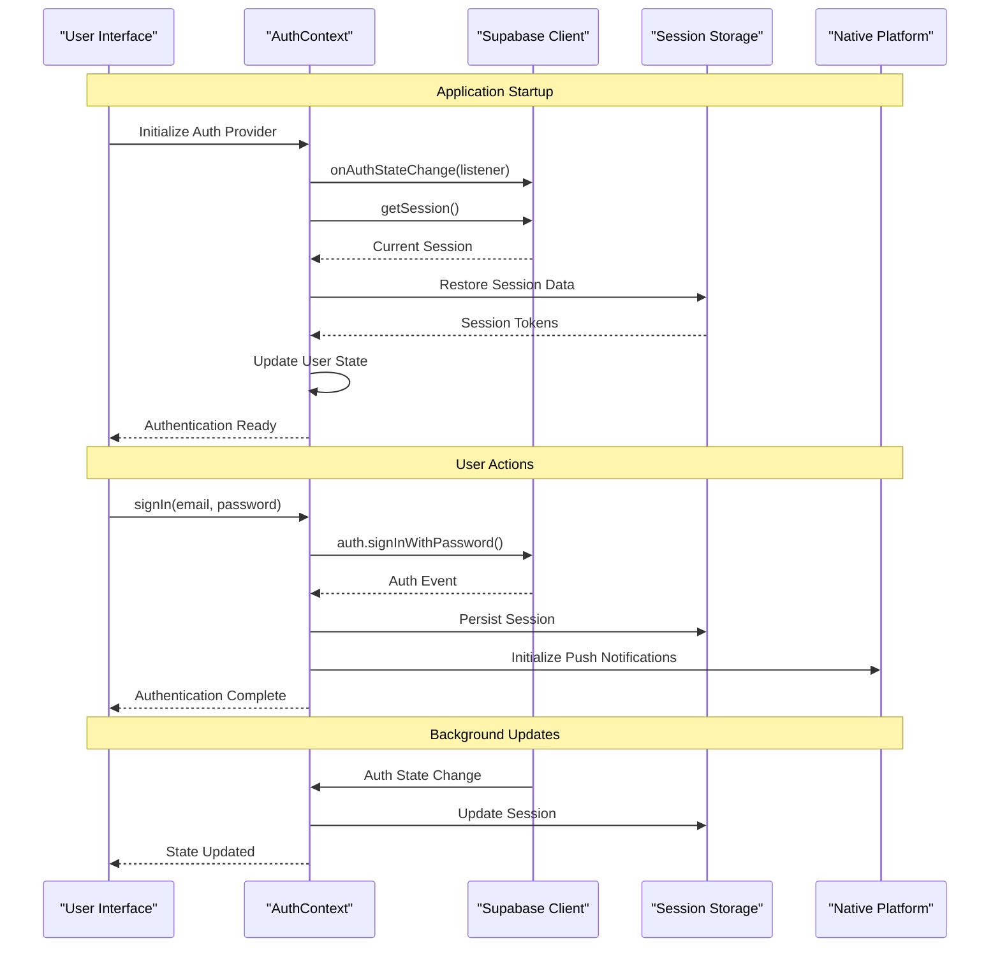
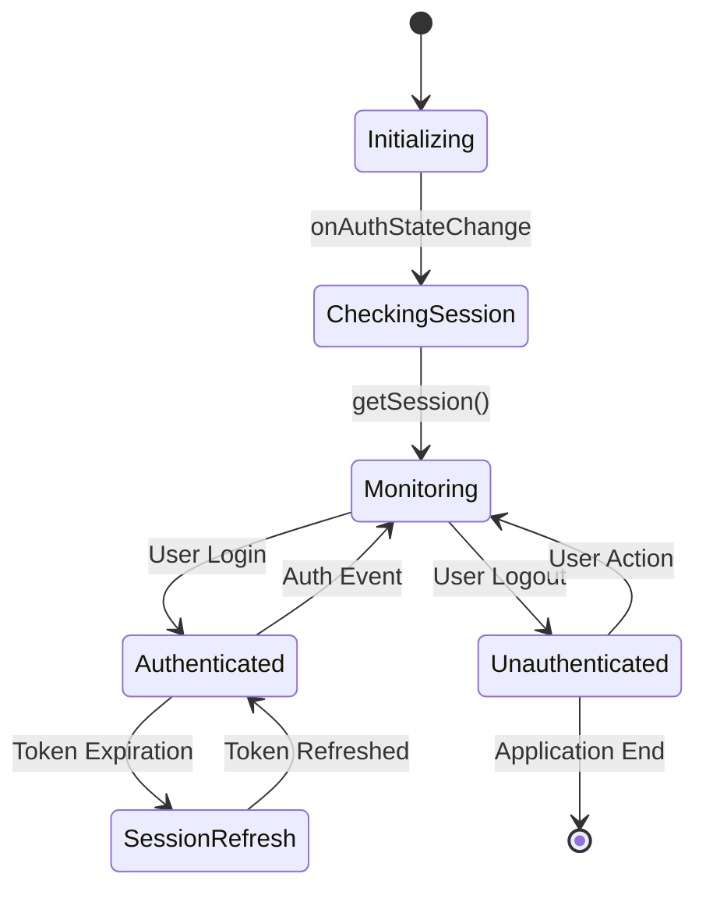
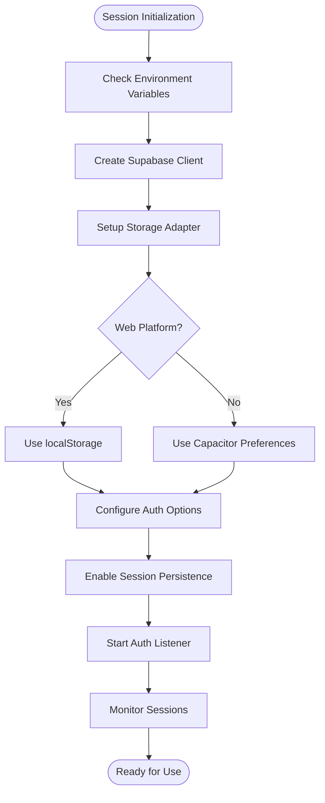
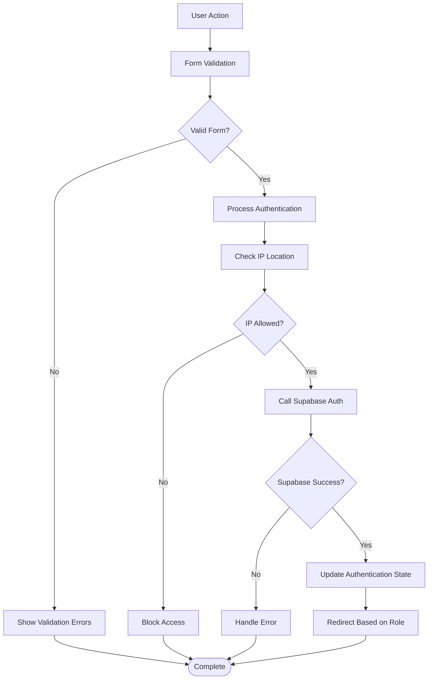
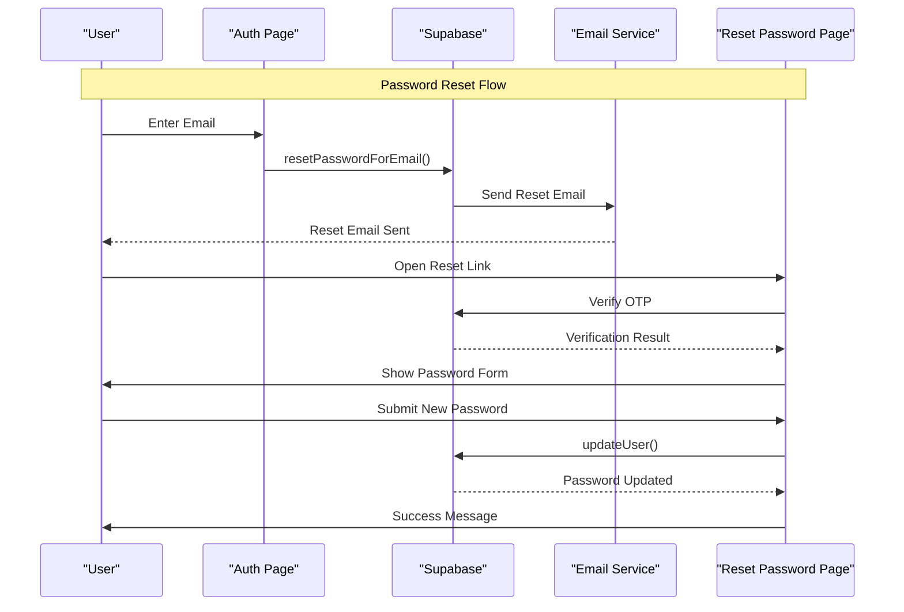
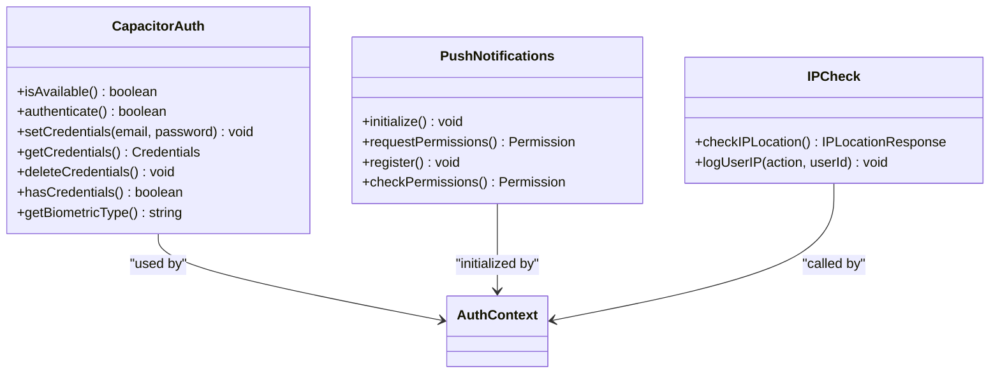
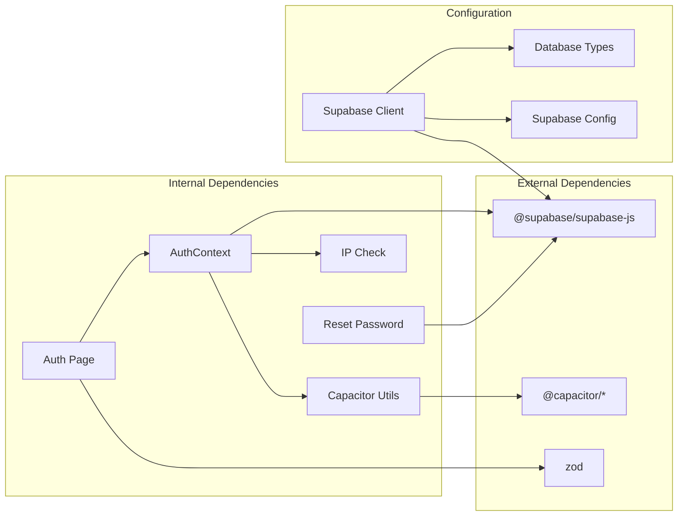

# Supabase Authentication Integration

<cite>
**Referenced Files in This Document**
- [AuthContext.tsx](file://src/contexts/AuthContext.tsx)
- [client.ts](file://src/integrations/supabase/client.ts)
- [Auth.tsx](file://src/pages/Auth.tsx)
- [ResetPassword.tsx](file://src/pages/ResetPassword.tsx)
- [ipCheck.ts](file://src/lib/ipCheck.ts)
- [capacitor.ts](file://src/lib/capacitor.ts)
- [App.tsx](file://src/App.tsx)
- [SessionTimeoutManager.tsx](file://src/components/SessionTimeoutManager.tsx)
- [types.ts](file://src/integrations/supabase/types.ts)
- [config.toml](file://supabase/config.toml)
</cite>

## Table of Contents
1. [Introduction](#introduction)
2. [Project Structure](#project-structure)
3. [Core Components](#core-components)
4. [Architecture Overview](#architecture-overview)
5. [Detailed Component Analysis](#detailed-component-analysis)
6. [Dependency Analysis](#dependency-analysis)
7. [Performance Considerations](#performance-considerations)
8. [Troubleshooting Guide](#troubleshooting-guide)
9. [Conclusion](#conclusion)

## Introduction

This document provides comprehensive documentation for the Supabase authentication integration in Nutrio. It covers authentication state management using Supabase auth onAuthStateChange listeners and session persistence, sign-up and sign-in implementations with email confirmation flows, session management and token handling, automatic reconnection on page reload, Supabase client configuration and environment variable setup, authentication context provider implementation, user state management, loading state handling, and common authentication scenarios including password reset, email verification, and session refresh.

## Project Structure

The authentication system is built around several key components:

**Diagram sources**
- [AuthContext.tsx:1-131](file://src/contexts/AuthContext.tsx#L1-L131)
- [client.ts:1-57](file://src/integrations/supabase/client.ts#L1-L57)
- [App.tsx:139-150](file://src/App.tsx#L139-L150)

**Section sources**
- [AuthContext.tsx:1-131](file://src/contexts/AuthContext.tsx#L1-L131)
- [client.ts:1-57](file://src/integrations/supabase/client.ts#L1-L57)
- [App.tsx:139-150](file://src/App.tsx#L139-L150)

## Core Components

### Authentication Context Provider

The AuthContext provider serves as the central hub for authentication state management in the application. It implements Supabase auth onAuthStateChange listeners and manages session persistence across page reloads.

**Key Features:**
- Real-time authentication state monitoring via Supabase auth listeners
- Automatic session restoration on application startup
- User and session state management with loading indicators
- Native platform integration for push notifications
- IP location checking for security enforcement

**Section sources**
- [AuthContext.tsx:31-61](file://src/contexts/AuthContext.tsx#L31-L61)
- [AuthContext.tsx:36-51](file://src/contexts/AuthContext.tsx#L36-L51)

### Supabase Client Configuration

The Supabase client is configured with custom storage adapters for both web and native environments, ensuring seamless session persistence across platforms.

**Configuration Details:**
- Custom Capacitor storage adapter for native applications
- Local storage fallback for web browsers
- Automatic session persistence and token refresh
- Environment variable validation with clear error messages

**Section sources**
- [client.ts:18-42](file://src/integrations/supabase/client.ts#L18-L42)
- [client.ts:44-57](file://src/integrations/supabase/client.ts#L44-L57)

### Authentication Pages

The authentication system includes dedicated pages for user registration, login, and password recovery with comprehensive error handling and user experience features.

**Features:**
- Multi-step authentication flow with validation
- Biometric authentication support for native platforms
- Email-based password reset with OTP verification
- Role-based redirection after successful authentication
- IP-based access restrictions with configurable enforcement

**Section sources**
- [Auth.tsx:19-115](file://src/pages/Auth.tsx#L19-L115)
- [Auth.tsx:169-203](file://src/pages/Auth.tsx#L169-L203)
- [ResetPassword.tsx:31-43](file://src/pages/ResetPassword.tsx#L31-L43)

## Architecture Overview

The authentication architecture follows a reactive pattern with real-time state synchronization:

**Diagram sources**
- [AuthContext.tsx:36-61](file://src/contexts/AuthContext.tsx#L36-L61)
- [client.ts:50-57](file://src/integrations/supabase/client.ts#L50-L57)

## Detailed Component Analysis

### Authentication State Management

The authentication state management system implements a robust pattern for handling user sessions and real-time updates:

**Key Implementation Details:**
- **Real-time Listeners**: Supabase auth onAuthStateChange provides immediate updates to authentication state
- **Session Restoration**: Automatic session retrieval on application startup prevents unnecessary re-authentication
- **State Synchronization**: User and session state remain synchronized across all components
- **Loading States**: Comprehensive loading indicators provide user feedback during authentication operations

**Section sources**
- [AuthContext.tsx:36-61](file://src/contexts/AuthContext.tsx#L36-L61)
- [AuthContext.tsx:32-35](file://src/contexts/AuthContext.tsx#L32-L35)

### Session Persistence and Token Management

The session persistence system handles token storage and refresh across different platforms:

**Storage Configuration:**
- **Web Applications**: Uses localStorage for session persistence
- **Native Applications**: Uses Capacitor Preferences for secure session storage
- **Automatic Refresh**: Built-in token refresh prevents session expiration
- **Error Handling**: Graceful degradation if storage operations fail

**Section sources**
- [client.ts:18-42](file://src/integrations/supabase/client.ts#L18-L42)
- [client.ts:50-57](file://src/integrations/supabase/client.ts#L50-L57)

### Sign-Up and Sign-In Implementation

The authentication forms implement comprehensive validation and user experience features:

**Authentication Features:**
- **Multi-step Forms**: Separate sign-up and sign-in forms with appropriate validation
- **IP Restriction**: Optional IP-based access control with configurable enforcement
- **Biometric Support**: Native biometric authentication for streamlined login
- **Role-based Redirection**: Automatic navigation based on user roles after authentication

**Section sources**
- [Auth.tsx:117-126](file://src/pages/Auth.tsx#L117-L126)
- [Auth.tsx:169-203](file://src/pages/Auth.tsx#L169-L203)
- [Auth.tsx:80-115](file://src/pages/Auth.tsx#L80-L115)

### Password Reset and Email Verification

The password reset system implements a secure two-step verification process:

**Security Features:**
- **OTP Verification**: 4-digit OTP verification for password resets
- **Session Validation**: Ensures reset links are valid and not expired
- **Password Requirements**: Enforces strong password policies
- **Email Templates**: Professional email templates for reset notifications

**Section sources**
- [Auth.tsx:216-240](file://src/pages/Auth.tsx#L216-L240)
- [Auth.tsx:257-276](file://src/pages/Auth.tsx#L257-L276)
- [ResetPassword.tsx:31-43](file://src/pages/ResetPassword.tsx#L31-L43)

### Native Platform Integration

The authentication system includes comprehensive native platform support:

**Native Features:**
- **Biometric Authentication**: Face ID, Touch ID, and fingerprint support
- **Push Notifications**: Automatic initialization upon user login
- **IP Logging**: Comprehensive user IP tracking for security
- **Platform Detection**: Automatic detection of native vs web environments

**Section sources**
- [capacitor.ts:468-581](file://src/lib/capacitor.ts#L468-L581)
- [AuthContext.tsx:44-49](file://src/contexts/AuthContext.tsx#L44-L49)
- [ipCheck.ts:87-107](file://src/lib/ipCheck.ts#L87-L107)

## Dependency Analysis

The authentication system has well-defined dependencies that ensure modularity and maintainability:

**Dependency Management:**
- **Supabase Client**: Central dependency for all authentication operations
- **Capacitor Integration**: Optional native platform features
- **Validation Library**: Zod for form validation and error handling
- **Type Safety**: Comprehensive TypeScript definitions for database operations

**Section sources**
- [AuthContext.tsx:1-7](file://src/contexts/AuthContext.tsx#L1-L7)
- [client.ts:1-5](file://src/integrations/supabase/client.ts#L1-L5)
- [types.ts:1-15](file://src/integrations/supabase/types.ts#L1-L15)

## Performance Considerations

The authentication system is designed with several performance optimizations:

### Session Management Optimizations
- **Lazy Loading**: Authentication components are loaded only when needed
- **Efficient State Updates**: Minimal re-renders through proper state management
- **Background Processing**: Non-blocking authentication operations
- **Memory Management**: Proper cleanup of event listeners and subscriptions

### Security Considerations
- **Environment Validation**: Immediate detection of missing configuration
- **Graceful Degradation**: System continues working even if some features fail
- **Secure Storage**: Native platform encryption for credential storage
- **Rate Limiting**: Built-in protection against brute force attacks

## Troubleshooting Guide

### Common Authentication Issues

**Missing Environment Variables**
- **Symptom**: Application fails to initialize authentication
- **Solution**: Ensure VITE_SUPABASE_URL and VITE_SUPABASE_PUBLISHABLE_KEY are configured
- **Prevention**: Use the provided deployment scripts to validate environment setup

**Session Not Persisting**
- **Symptom**: Users must re-authenticate after page refresh
- **Solution**: Verify storage adapter is properly configured for the platform
- **Debug**: Check browser developer tools for storage access permissions

**Biometric Authentication Failing**
- **Symptom**: Biometric login prompts appear but authentication fails
- **Solution**: Verify device biometric capabilities and user enrollment
- **Debug**: Check native platform logs for biometric errors

**Password Reset Issues**
- **Symptom**: Users cannot reset passwords or receive reset emails
- **Solution**: Verify email service configuration and domain whitelisting
- **Debug**: Check email delivery logs and Supabase function execution

**Section sources**
- [client.ts:10-16](file://src/integrations/supabase/client.ts#L10-L16)
- [AuthContext.tsx:114-118](file://src/contexts/AuthContext.tsx#L114-L118)
- [ipCheck.ts:16-30](file://src/lib/ipCheck.ts#L16-L30)

### Best Practices for Secure Authentication

1. **Environment Configuration**: Always validate environment variables at startup
2. **Error Handling**: Implement comprehensive error handling for all authentication operations
3. **Session Management**: Use appropriate session timeouts and automatic refresh
4. **Security Headers**: Configure proper CORS and security headers for production
5. **Monitoring**: Implement logging and monitoring for authentication events
6. **Testing**: Regularly test authentication flows across different platforms and browsers

**Section sources**
- [client.ts:10-16](file://src/integrations/supabase/client.ts#L10-L16)
- [AuthContext.tsx:36-61](file://src/contexts/AuthContext.tsx#L36-L61)
- [config.toml:1-59](file://supabase/config.toml#L1-L59)

## Conclusion

The Supabase authentication integration in Nutrio provides a robust, secure, and scalable foundation for user authentication across web and native platforms. The implementation leverages Supabase's real-time capabilities, provides comprehensive error handling, supports modern authentication features like biometric login, and maintains security best practices through proper session management and environment validation.

The modular architecture ensures maintainability and extensibility, while the comprehensive error handling and debugging capabilities facilitate smooth operation in production environments. The system successfully balances user experience with security requirements, providing a solid foundation for the application's authentication needs.