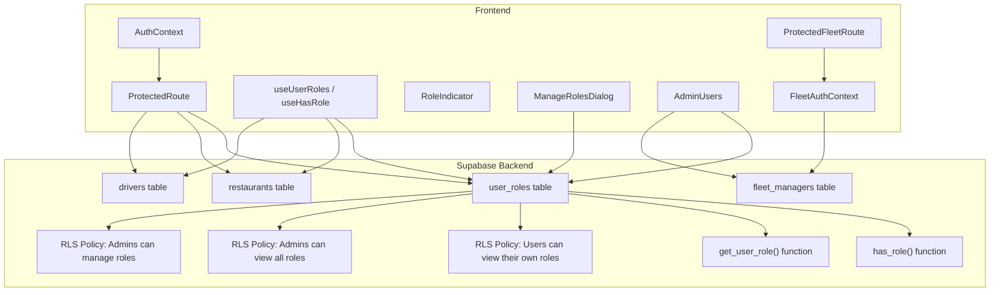
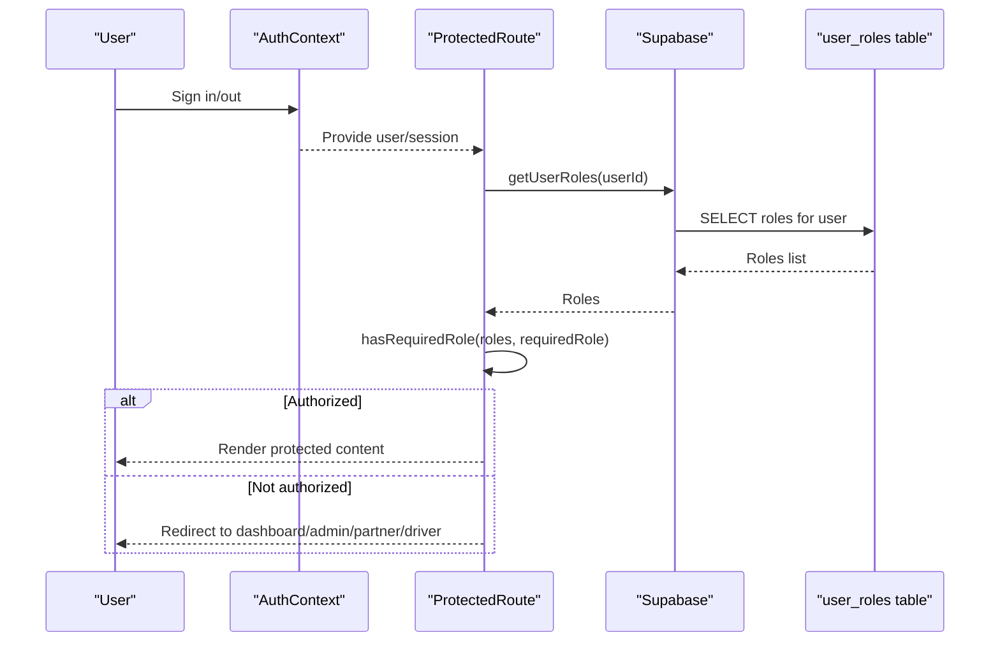
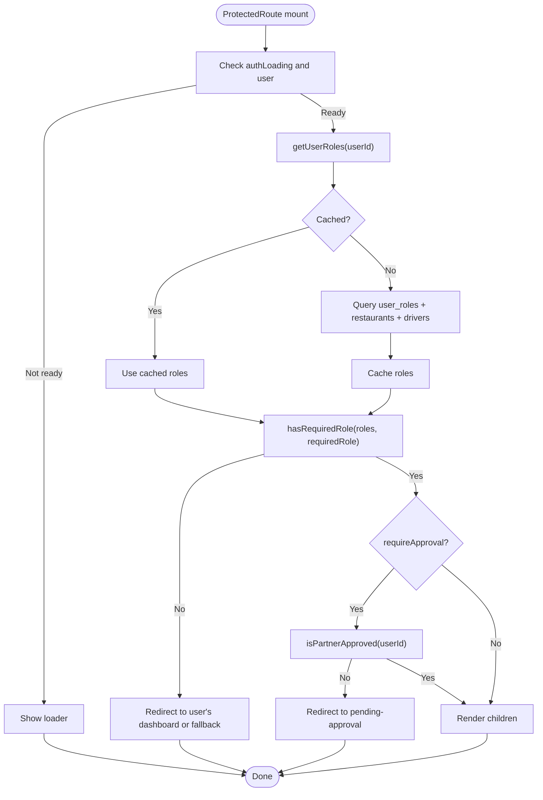
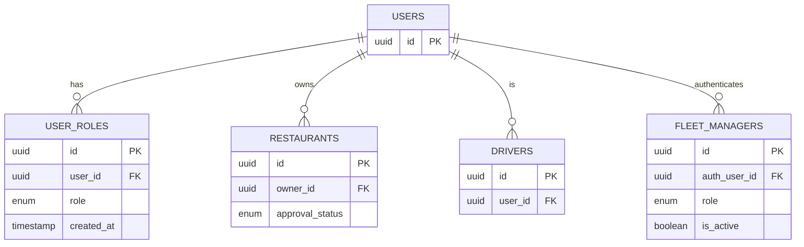
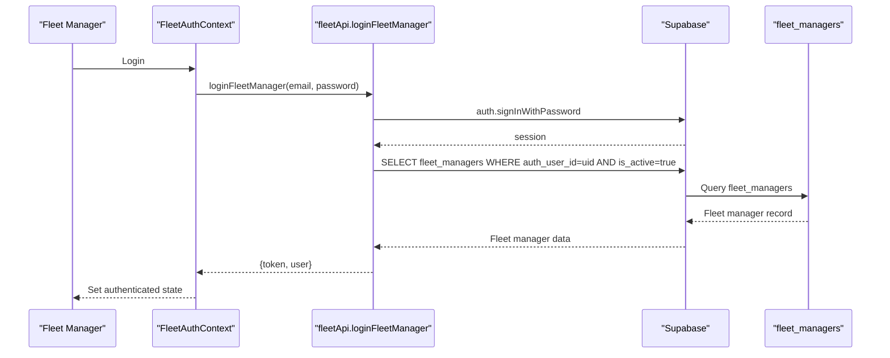
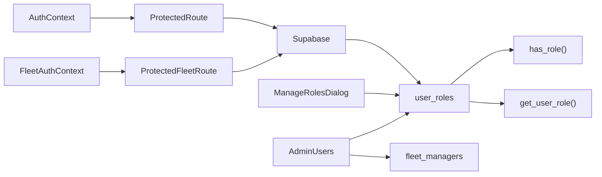

# User Roles & Permissions

<cite>
**Referenced Files in This Document**
- [ProtectedRoute.tsx](file://src/components/ProtectedRoute.tsx)
- [AuthContext.tsx](file://src/contexts/AuthContext.tsx)
- [RoleIndicator.tsx](file://src/components/RoleIndicator.tsx)
- [ManageRolesDialog.tsx](file://src/components/admin/ManageRolesDialog.tsx)
- [AdminUsers.tsx](file://src/pages/admin/AdminUsers.tsx)
- [fleetApi.ts](file://src/fleet/services/fleetApi.ts)
- [ProtectedFleetRoute.tsx](file://src/fleet/components/ProtectedFleetRoute.tsx)
- [FleetAuthContext.tsx](file://src/fleet/context/FleetAuthContext.tsx)
- [types.ts](file://src/integrations/supabase/types.ts)
- [CREATE_TABLES_SQL.md](file://CREATE_TABLES_SQL.md)
- [20250220000000_create_essential_tables.sql](file://supabase/migrations/20250220000000_create_essential_tables.sql)
- [create-missing-tables.mjs](file://create-missing-tables.mjs)
</cite>

## Table of Contents
1. [Introduction](#introduction)
2. [Project Structure](#project-structure)
3. [Core Components](#core-components)
4. [Architecture Overview](#architecture-overview)
5. [Detailed Component Analysis](#detailed-component-analysis)
6. [Dependency Analysis](#dependency-analysis)
7. [Performance Considerations](#performance-considerations)
8. [Troubleshooting Guide](#troubleshooting-guide)
9. [Conclusion](#conclusion)
10. [Appendices](#appendices)

## Introduction
This document explains Nutrio’s user role-based access control system. It covers the five primary user types (customer, partner, driver, admin, and staff), how roles are assigned and enforced, where roles are stored in the database, and how the ProtectedRoute component enforces access control. It also documents role checking in components, conditional rendering, role-based navigation, and the relationship between user roles and row-level security (RLS) policies. Finally, it provides practical examples for implementing new role-based features and extending the permission system for custom use cases.

## Project Structure
The role and permission system spans frontend components, contexts, and backend Supabase resources:
- Frontend enforcement via ProtectedRoute and supporting hooks
- Authentication state via AuthContext
- Role indicators and admin role management UI
- Fleet portal with its own role enforcement
- Backend Supabase tables, policies, and helper functions

**Diagram sources**
- [ProtectedRoute.tsx:1–264:1-264](file://src/components/ProtectedRoute.tsx#L1-L264)
- [AuthContext.tsx:1–131:1-131](file://src/contexts/AuthContext.tsx#L1-L131)
- [ManageRolesDialog.tsx:124–169:124-169](file://src/components/admin/ManageRolesDialog.tsx#L124-L169)
- [AdminUsers.tsx:155–193:155-193](file://src/pages/admin/AdminUsers.tsx#L155-L193)
- [ProtectedFleetRoute.tsx:61–85:61-85](file://src/fleet/components/ProtectedFleetRoute.tsx#L61-L85)
- [FleetAuthContext.tsx:1–33:1-33](file://src/fleet/context/FleetAuthContext.tsx#L1-L33)
- [CREATE_TABLES_SQL.md:33–96:33-96](file://CREATE_TABLES_SQL.md#L33-L96)
- [20250220000000_create_essential_tables.sql:90–139:90-139](file://supabase/migrations/20250220000000_create_essential_tables.sql#L90-L139)

**Section sources**
- [ProtectedRoute.tsx:1–264:1-264](file://src/components/ProtectedRoute.tsx#L1-L264)
- [AuthContext.tsx:1–131:1-131](file://src/contexts/AuthContext.tsx#L1-L131)
- [CREATE_TABLES_SQL.md:33–96:33-96](file://CREATE_TABLES_SQL.md#L33-L96)
- [20250220000000_create_essential_tables.sql:90–139:90-139](file://supabase/migrations/20250220000000_create_essential_tables.sql#L90-L139)

## Core Components
- ProtectedRoute: Enforces role-based access for routes, caches role checks, and redirects unauthorized users to appropriate dashboards.
- AuthContext: Provides authentication state and lifecycle for sign-in/sign-out.
- useUserRoles / useHasRole: Hooks to fetch and check user roles in components.
- RoleIndicator: Visual indicator for switching between customer and partner views.
- ManageRolesDialog: Admin UI to assign and remove roles, including fleet_manager.
- AdminUsers: Aggregates roles from user_roles and fleet_managers for display.
- ProtectedFleetRoute and FleetAuthContext: Fleet portal role enforcement and authentication.
- Supabase user_roles table and RLS policies: Centralized role storage and row-level security.

**Section sources**
- [ProtectedRoute.tsx:1–264:1-264](file://src/components/ProtectedRoute.tsx#L1-L264)
- [AuthContext.tsx:1–131:1-131](file://src/contexts/AuthContext.tsx#L1-L131)
- [RoleIndicator.tsx:1–56:1-56](file://src/components/RoleIndicator.tsx#L1-L56)
- [ManageRolesDialog.tsx:124–169:124-169](file://src/components/admin/ManageRolesDialog.tsx#L124-L169)
- [AdminUsers.tsx:155–193:155-193](file://src/pages/admin/AdminUsers.tsx#L155-L193)
- [ProtectedFleetRoute.tsx:61–85:61-85](file://src/fleet/components/ProtectedFleetRoute.tsx#L61-L85)
- [FleetAuthContext.tsx:1–33:1-33](file://src/fleet/context/FleetAuthContext.tsx#L1-L33)
- [CREATE_TABLES_SQL.md:33–96:33-96](file://CREATE_TABLES_SQL.md#L33-L96)
- [20250220000000_create_essential_tables.sql:90–139:90-139](file://supabase/migrations/20250220000000_create_essential_tables.sql#L90-L139)

## Architecture Overview
The system combines client-side route guards with server-side RLS:
- ProtectedRoute resolves user roles from Supabase, applies role hierarchy, and enforces approvals for partner routes.
- AuthContext manages session state and initializes push notifications on native platforms.
- Supabase user_roles stores role assignments with RLS policies ensuring users can only access their own roles and admins can manage roles.
- Fleet portal has a separate authentication and authorization flow using fleet_managers.

**Diagram sources**
- [ProtectedRoute.tsx:140–230:140-230](file://src/components/ProtectedRoute.tsx#L140-L230)
- [AuthContext.tsx:31–61:31-61](file://src/contexts/AuthContext.tsx#L31-L61)
- [20250220000000_create_essential_tables.sql:127–135:127-135](file://supabase/migrations/20250220000000_create_essential_tables.sql#L127-L135)

## Detailed Component Analysis

### ProtectedRoute Implementation
ProtectedRoute enforces role-based access at the routing level:
- Defines the set of user roles and a role hierarchy.
- Caches role queries to reduce DB load.
- Fetches roles from user_roles, and infers additional roles from restaurants and drivers tables.
- Supports optional partner approval checks.
- Redirects unauthorized users to appropriate dashboards or shows fallback content.

**Diagram sources**
- [ProtectedRoute.tsx:140–230:140-230](file://src/components/ProtectedRoute.tsx#L140-L230)
- [ProtectedRoute.tsx:40–98:40-98](file://src/components/ProtectedRoute.tsx#L40-L98)
- [ProtectedRoute.tsx:103–119:103-119](file://src/components/ProtectedRoute.tsx#L103-L119)
- [ProtectedRoute.tsx:124–137:124-137](file://src/components/ProtectedRoute.tsx#L124-L137)

**Section sources**
- [ProtectedRoute.tsx:1–264:1-264](file://src/components/ProtectedRoute.tsx#L1-L264)

### Role Assignment Mechanisms and Storage
Roles are stored in the Supabase user_roles table with RLS policies:
- user_roles table: Stores user_id and role with a unique constraint on (user_id, role).
- has_role() function: Checks if a user has a specific role.
- get_user_role() function: Returns a user’s primary role.
- RLS policies:
  - Users can view their own roles.
  - Admins can view all roles.
  - Admins can manage roles (insert/update/delete).

**Diagram sources**
- [CREATE_TABLES_SQL.md:33–96:33-96](file://CREATE_TABLES_SQL.md#L33-L96)
- [20250220000000_create_essential_tables.sql:90–139:90-139](file://supabase/migrations/20250220000000_create_essential_tables.sql#L90-L139)
- [AdminUsers.tsx:155–193:155-193](file://src/pages/admin/AdminUsers.tsx#L155-L193)

**Section sources**
- [CREATE_TABLES_SQL.md:33–96:33-96](file://CREATE_TABLES_SQL.md#L33-L96)
- [20250220000000_create_essential_tables.sql:90–139:90-139](file://supabase/migrations/20250220000000_create_essential_tables.sql#L90-L139)
- [AdminUsers.tsx:155–193:155-193](file://src/pages/admin/AdminUsers.tsx#L155-L193)

### Permission Hierarchies
ProtectedRoute defines a role hierarchy to enable higher roles to access lower-role routes:
- customer: 1
- restaurant: 2
- partner: 2
- driver: 2
- staff: 3
- admin: 4

This allows admin and staff to access routes intended for restaurant/partner/driver while maintaining stricter controls for customer-only routes.

**Section sources**
- [ProtectedRoute.tsx:16–24:16-24](file://src/components/ProtectedRoute.tsx#L16-L24)

### Role Checking in Components and Conditional Rendering
Components can use:
- useUserRoles: To fetch roles for a user and render conditionally.
- useHasRole: To check if a user has a specific role or any role in a list.

These hooks wrap the same role resolution logic used by ProtectedRoute, enabling consistent permission checks across the UI.

**Section sources**
- [ProtectedRoute.tsx:232–263:232-263](file://src/components/ProtectedRoute.tsx#L232-L263)

### Role-Based Navigation
ProtectedRoute redirects unauthorized users to:
- /admin for admins
- /partner for partners/restaurants
- /driver for drivers
- /dashboard for customers

RoleIndicator provides a quick switch between customer and partner views, updating the UI state accordingly.

**Section sources**
- [ProtectedRoute.tsx:213–221:213-221](file://src/components/ProtectedRoute.tsx#L213-L221)
- [RoleIndicator.tsx:16–55:16-55](file://src/components/RoleIndicator.tsx#L16-L55)

### Relationship Between Roles and Database RLS Policies
- has_role() and get_user_role() are Supabase SQL functions used by RLS policies to enforce access control.
- RLS policies on user_roles ensure:
  - Users can only view their own roles.
  - Admins can view all roles.
  - Admins can manage roles.

This guarantees that role-based logic remains consistent whether enforced in the frontend or backend.

**Section sources**
- [20250220000000_create_essential_tables.sql:90–139:90-139](file://supabase/migrations/20250220000000_create_essential_tables.sql#L90-L139)
- [CREATE_TABLES_SQL.md:33–96:33-96](file://CREATE_TABLES_SQL.md#L33-L96)

### Fleet Portal Role Enforcement
The fleet portal has a dedicated authentication and authorization flow:
- FleetAuthContext manages fleet manager sessions and city access.
- ProtectedFleetRoute validates fleet manager access and city permissions.
- fleet_managers table stores fleet manager records linked to Supabase auth users.

**Diagram sources**
- [FleetAuthContext.tsx:24–33:24-33](file://src/fleet/context/FleetAuthContext.tsx#L24-L33)
- [fleetApi.ts:35–75:35-75](file://src/fleet/services/fleetApi.ts#L35-L75)
- [ProtectedFleetRoute.tsx:61–85:61-85](file://src/fleet/components/ProtectedFleetRoute.tsx#L61-L85)

**Section sources**
- [FleetAuthContext.tsx:1–33:1-33](file://src/fleet/context/FleetAuthContext.tsx#L1-L33)
- [fleetApi.ts:35–75:35-75](file://src/fleet/services/fleetApi.ts#L35-L75)
- [ProtectedFleetRoute.tsx:61–85:61-85](file://src/fleet/components/ProtectedFleetRoute.tsx#L61-L85)

### Admin Role Management UI
Admins can manage roles via ManageRolesDialog:
- Fetches current roles from user_roles.
- Adds/removes roles excluding fleet_manager (managed separately).
- Enforces minimum role requirements (user role cannot be removed unless another role is assigned).
- Updates fleet_managers when fleet_manager is toggled.

**Section sources**
- [ManageRolesDialog.tsx:124–169:124-169](file://src/components/admin/ManageRolesDialog.tsx#L124-L169)
- [ManageRolesDialog.tsx:204–207:204-207](file://src/components/admin/ManageRolesDialog.tsx#L204-L207)

## Dependency Analysis
- ProtectedRoute depends on AuthContext for user/session state and Supabase for role resolution.
- AdminUsers aggregates roles from user_roles and fleet_managers for display.
- Fleet portal components depend on FleetAuthContext and fleetApi for fleet-specific authorization.
- Supabase RLS policies depend on has_role() and get_user_role() functions.

**Diagram sources**
- [ProtectedRoute.tsx:140–230:140-230](file://src/components/ProtectedRoute.tsx#L140-L230)
- [AuthContext.tsx:31–61:31-61](file://src/contexts/AuthContext.tsx#L31-L61)
- [ManageRolesDialog.tsx:142–169:142-169](file://src/components/admin/ManageRolesDialog.tsx#L142-L169)
- [AdminUsers.tsx:155–193:155-193](file://src/pages/admin/AdminUsers.tsx#L155-L193)
- [ProtectedFleetRoute.tsx:61–85:61-85](file://src/fleet/components/ProtectedFleetRoute.tsx#L61-L85)
- [FleetAuthContext.tsx:24–33:24-33](file://src/fleet/context/FleetAuthContext.tsx#L24-L33)
- [20250220000000_create_essential_tables.sql:90–139:90-139](file://supabase/migrations/20250220000000_create_essential_tables.sql#L90-L139)

**Section sources**
- [ProtectedRoute.tsx:140–230:140-230](file://src/components/ProtectedRoute.tsx#L140-L230)
- [ManageRolesDialog.tsx:142–169:142-169](file://src/components/admin/ManageRolesDialog.tsx#L142-L169)
- [AdminUsers.tsx:155–193:155-193](file://src/pages/admin/AdminUsers.tsx#L155-L193)
- [ProtectedFleetRoute.tsx:61–85:61-85](file://src/fleet/components/ProtectedFleetRoute.tsx#L61-L85)
- [20250220000000_create_essential_tables.sql:90–139:90-139](file://supabase/migrations/20250220000000_create_essential_tables.sql#L90-L139)

## Performance Considerations
- Role caching: ProtectedRoute caches role results for 5 minutes to minimize repeated DB queries.
- Single-source role resolution: Roles are fetched once per user and reused across hooks and components.
- Efficient RLS: Supabase policies and helper functions ensure minimal overhead on the server.

**Section sources**
- [ProtectedRoute.tsx:33–35:33-35](file://src/components/ProtectedRoute.tsx#L33-L35)
- [ProtectedRoute.tsx:40–98:40-98](file://src/components/ProtectedRoute.tsx#L40-L98)

## Troubleshooting Guide
Common issues and resolutions:
- Missing user_roles table: The migration script and helper script detect missing tables and provide SQL to create them and enable RLS.
- Role not applying immediately: Clear browser cache or wait for cache TTL to expire; role updates are reflected after cache refresh.
- Fleet manager access denied: Ensure the user exists in fleet_managers with is_active true; ProtectedFleetRoute rejects unauthorized access and shows a toast.
- Partner approval required: ProtectedRoute redirects to pending-approval when requireApproval is true and the restaurant is not approved.

**Section sources**
- [create-missing-tables.mjs:19–84:19-84](file://create-missing-tables.mjs#L19-L84)
- [ProtectedFleetRoute.tsx:76–85:76-85](file://src/fleet/components/ProtectedFleetRoute.tsx#L76-L85)
- [ProtectedRoute.tsx:171–175:171-175](file://src/components/ProtectedRoute.tsx#L171-L175)

## Conclusion
Nutrio’s role-based access control combines a robust frontend route guard with secure backend RLS policies. Roles are centrally managed in the user_roles table with helper functions and policies ensuring consistent enforcement. The system supports flexible role hierarchies, admin-driven role management, and specialized fleet portal authorization. This foundation enables safe extension to new roles and custom permission scenarios.

## Appendices

### Practical Examples

- Enforce a route for admin-only:
  - Wrap the route with ProtectedRoute and set requiredRole to admin.
  - Optionally set fallback to render a custom “Access Denied” component.

- Check permissions in a component:
  - Use useHasRole to determine visibility of buttons or sections.
  - Use useUserRoles to render role-specific UI.

- Add a new role:
  - Extend the UserRole union and ROLE_HIERARCHY.
  - Add the role to the user_roles table for users.
  - Update RLS policies if backend access control is required.

- Implement fleet manager role:
  - Assign fleet_manager via ManageRolesDialog.
  - Use ProtectedFleetRoute to protect fleet routes.
  - Use FleetAuthContext for authentication state and city filtering.

**Section sources**
- [ProtectedRoute.tsx:26–31:26-31](file://src/components/ProtectedRoute.tsx#L26-L31)
- [ProtectedRoute.tsx:16–24:16-24](file://src/components/ProtectedRoute.tsx#L16-L24)
- [ManageRolesDialog.tsx:124–169:124-169](file://src/components/admin/ManageRolesDialog.tsx#L124-L169)
- [ProtectedFleetRoute.tsx:61–85:61-85](file://src/fleet/components/ProtectedFleetRoute.tsx#L61-L85)
- [FleetAuthContext.tsx:24–33:24-33](file://src/fleet/context/FleetAuthContext.tsx#L24-L33)