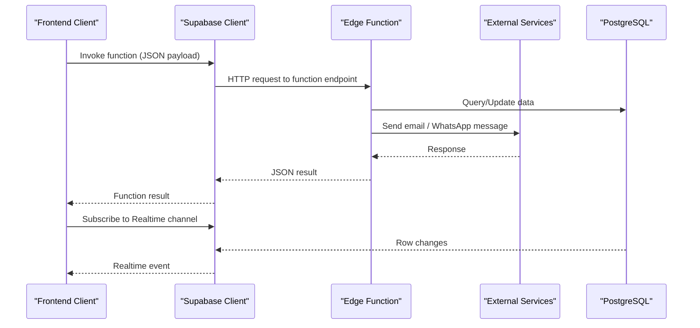
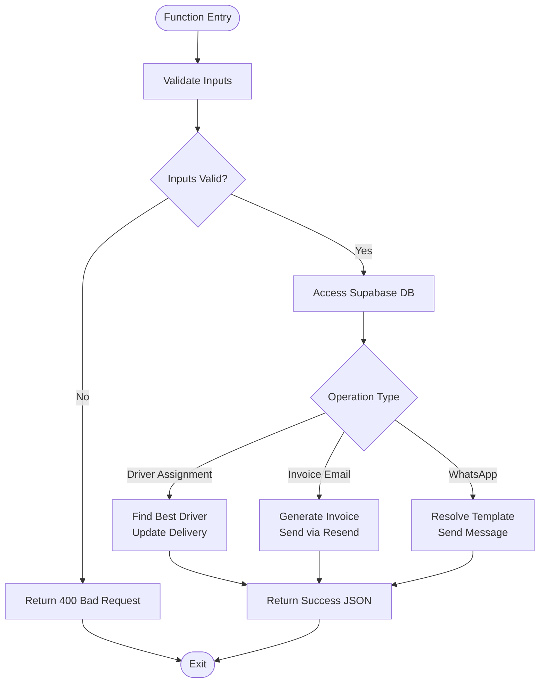
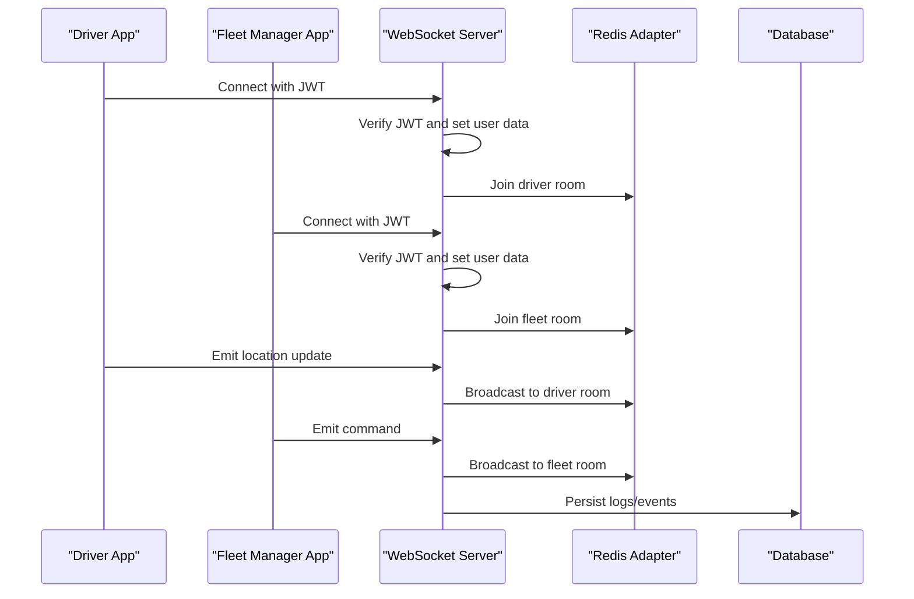
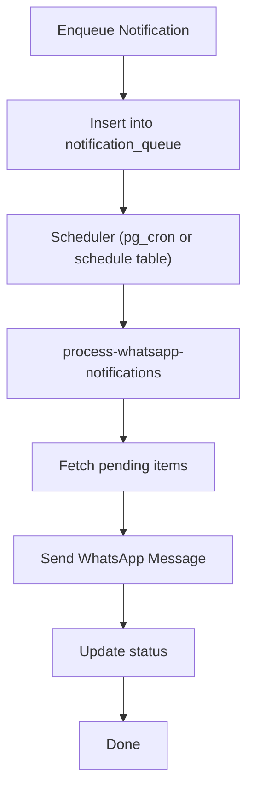
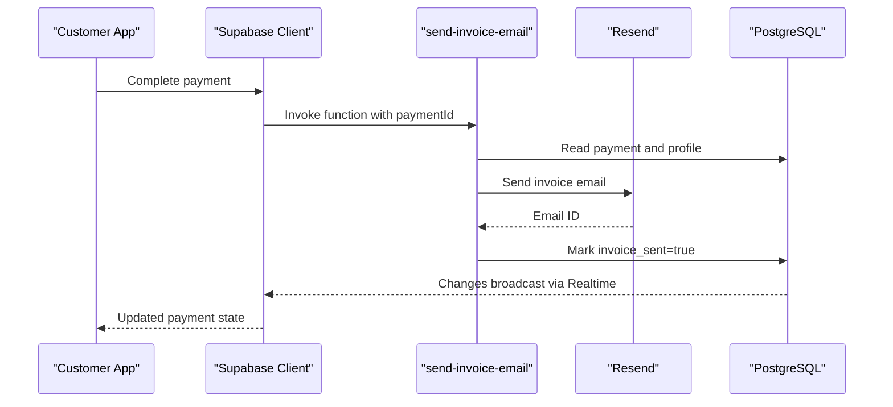

# Backend Services

<cite>
**Referenced Files in This Document**
- [config.toml](file://supabase/config.toml)
- [PHASE2_EDGE_FUNCTIONS.md](file://supabase/functions/PHASE2_EDGE_FUNCTIONS.md)
- [client.ts](file://src/integrations/supabase/client.ts)
- [server.ts](file://websocket-server/src/server.ts)
- [package.json](file://websocket-server/package.json)
- [implementation-plan-customer-portal.md](file://docs/implementation-plan-customer-portal.md)
- [delivery_implementation_plan.md](file://delivery_implementation_plan.md)
- [process-whatsapp-notifications index.ts](file://supabase/functions/process-whatsapp-notifications/index.ts)
- [20260226_create_whatsapp_processor_trigger.sql](file://supabase/migrations/20260226_create_whatsapp_processor_trigger.sql)
- [20260226000008_fix_rls_and_security_issues.sql](file://supabase/migrations/20260226000008_fix_rls_and_security_issues.sql)
- [PRODUCTION_HARDENING_FINAL_SUMMARY.md](file://PRODUCTION_HARDENING_FINAL_SUMMARY.md)
- [load-test-config.yml](file://tests/load-test-config.yml)
- [wallet-payments.spec.ts](file://e2e/cross-portal/wallet-payments.spec.ts)
</cite>

## Table of Contents
1. [Introduction](#introduction)
2. [Project Structure](#project-structure)
3. [Core Components](#core-components)
4. [Architecture Overview](#architecture-overview)
5. [Detailed Component Analysis](#detailed-component-analysis)
6. [Dependency Analysis](#dependency-analysis)
7. [Performance Considerations](#performance-considerations)
8. [Troubleshooting Guide](#troubleshooting-guide)
9. [Conclusion](#conclusion)
10. [Appendices](#appendices)

## Introduction
This document describes the backend services powering the Supabase-based Nutrio platform. It covers the edge function architecture, API endpoints, real-time WebSocket server, notification system, payment processing integration, adaptive goals, fleet management, and real-time tracking. It also documents integration patterns with external services, webhook handling, background job processing, error handling, logging, monitoring, and performance optimization strategies.

## Project Structure
The backend comprises:
- Supabase Edge Functions for automation and integrations
- A WebSocket server for real-time fleet and driver communications
- Supabase client integration in the frontend
- Database triggers and scheduled jobs for background processing
- Tests and documentation supporting production readiness

```mermaid
graph TB
subgraph "Frontend"
FE["React App<br/>Supabase Client"]
end
subgraph "Supabase Platform"
SF["Edge Functions"]
DB["PostgreSQL Database"]
RT["Realtime (via Supabase)"]
end
subgraph "External Services"
RES["Resend (Email)"]
WA["WhatsApp API"]
end
subgraph "Realtime Layer"
WS["WebSocket Server"]
end
FE --> SF
FE --> RT
SF --> DB
SF --> RES
SF --> WA
FE < --> WS
```

**Diagram sources**
- [client.ts:1-57](file://src/integrations/supabase/client.ts#L1-L57)
- [PHASE2_EDGE_FUNCTIONS.md:224-254](file://supabase/functions/PHASE2_EDGE_FUNCTIONS.md#L224-L254)
- [server.ts:1-256](file://websocket-server/src/server.ts#L1-L256)

**Section sources**
- [client.ts:1-57](file://src/integrations/supabase/client.ts#L1-L57)
- [config.toml:1-59](file://supabase/config.toml#L1-L59)

## Core Components
- Supabase Edge Functions: Serverless automation for driver assignment, invoice emails, notifications, and analytics.
- WebSocket Server: Real-time bidirectional communication for fleet and driver tracking.
- Supabase Client: Frontend integration for authentication, database access, and function invocation.
- Background Jobs: Scheduled triggers and queues for notifications and maintenance.
- Realtime Subscriptions: Supabase Realtime for live updates across portals.

**Section sources**
- [PHASE2_EDGE_FUNCTIONS.md:34-172](file://supabase/functions/PHASE2_EDGE_FUNCTIONS.md#L34-L172)
- [server.ts:34-150](file://websocket-server/src/server.ts#L34-L150)
- [client.ts:47-57](file://src/integrations/supabase/client.ts#L47-L57)

## Architecture Overview
The system integrates Supabase Edge Functions with external services (Resend, WhatsApp) and a dedicated WebSocket server for fleet tracking. Supabase Realtime complements serverless functions for live UI updates. Background jobs leverage database triggers and a simple scheduler table.



**Diagram sources**
- [PHASE2_EDGE_FUNCTIONS.md:224-254](file://supabase/functions/PHASE2_EDGE_FUNCTIONS.md#L224-L254)
- [implementation-plan-customer-portal.md:1643-1763](file://docs/implementation-plan-customer-portal.md#L1643-L1763)
- [process-whatsapp-notifications index.ts:88-130](file://supabase/functions/process-whatsapp-notifications/index.ts#L88-L130)

## Detailed Component Analysis

### Supabase Edge Functions
- Purpose: Automate workflows such as driver assignment, invoice email generation, notifications, and analytics.
- Invocation: Via Supabase client or direct HTTP requests.
- Security: JWT verification disabled in configuration; ensure secure gating in production.
- Environment: Uses Supabase secrets for service URLs and API keys.

Key functions and responsibilities:
- auto-assign-driver: Assigns drivers to pending deliveries using proximity and ratings.
- send-invoice-email: Generates and sends invoices via Resend, updates payment records.
- process-whatsapp-notifications: Processes queued WhatsApp messages periodically.
- Others: Adaptive goals, behavior prediction, nutrition engine, smart allocator, and fleet management functions.



**Diagram sources**
- [PHASE2_EDGE_FUNCTIONS.md:46-86](file://supabase/functions/PHASE2_EDGE_FUNCTIONS.md#L46-L86)
- [implementation-plan-customer-portal.md:1643-1763](file://docs/implementation-plan-customer-portal.md#L1643-L1763)
- [process-whatsapp-notifications index.ts:88-130](file://supabase/functions/process-whatsapp-notifications/index.ts#L88-L130)

**Section sources**
- [config.toml:3-59](file://supabase/config.toml#L3-L59)
- [PHASE2_EDGE_FUNCTIONS.md:34-172](file://supabase/functions/PHASE2_EDGE_FUNCTIONS.md#L34-L172)
- [PHASE2_EDGE_FUNCTIONS.md:258-322](file://supabase/functions/PHASE2_EDGE_FUNCTIONS.md#L258-L322)
- [PHASE2_EDGE_FUNCTIONS.md:325-351](file://supabase/functions/PHASE2_EDGE_FUNCTIONS.md#L325-L351)

### Real-Time Communication: WebSocket Server
- Technology: Socket.IO with Redis adapter for horizontal scaling.
- Authentication: JWT-based with role-aware rooms.
- Rooms: Separate channels for drivers and fleet managers.
- Health checks: HTTP endpoints for readiness and status.
- Scaling: Backpressure via max connections and compression.



**Diagram sources**
- [server.ts:65-150](file://websocket-server/src/server.ts#L65-L150)
- [server.ts:162-192](file://websocket-server/src/server.ts#L162-L192)

**Section sources**
- [server.ts:18-51](file://websocket-server/src/server.ts#L18-L51)
- [server.ts:65-150](file://websocket-server/src/server.ts#L65-L150)
- [server.ts:162-192](file://websocket-server/src/server.ts#L162-L192)
- [package.json:21-40](file://websocket-server/package.json#L21-L40)

### Notification System
- Email: Edge function sends invoices via Resend; logs are persisted.
- WhatsApp: Queued notifications processed by a background function.
- Queue: notification_queue table with status tracking.
- Scheduling: pg_cron or a simple scheduler table for periodic runs.



**Diagram sources**
- [process-whatsapp-notifications index.ts:88-130](file://supabase/functions/process-whatsapp-notifications/index.ts#L88-L130)
- [20260226_create_whatsapp_processor_trigger.sql:40-46](file://supabase/migrations/20260226_create_whatsapp_processor_trigger.sql#L40-L46)

**Section sources**
- [implementation-plan-customer-portal.md:1639-1763](file://docs/implementation-plan-customer-portal.md#L1639-L1763)
- [process-whatsapp-notifications index.ts:88-130](file://supabase/functions/process-whatsapp-notifications/index.ts#L88-L130)
- [20260226_create_whatsapp_processor_trigger.sql:40-46](file://supabase/migrations/20260226_create_whatsapp_processor_trigger.sql#L40-L46)

### Payment Processing Integration
- Invoice generation: Edge function creates invoice records and sends emails.
- Payment synchronization: End-to-end tests verify notifications and portal synchronization after payments.
- Realtime updates: Supabase Realtime ensures all portals reflect latest payment data.



**Diagram sources**
- [implementation-plan-customer-portal.md:1643-1763](file://docs/implementation-plan-customer-portal.md#L1643-L1763)
- [wallet-payments.spec.ts:281-324](file://e2e/cross-portal/wallet-payments.spec.ts#L281-L324)

**Section sources**
- [implementation-plan-customer-portal.md:1639-1763](file://docs/implementation-plan-customer-portal.md#L1639-L1763)
- [wallet-payments.spec.ts:281-324](file://e2e/cross-portal/wallet-payments.spec.ts#L281-L324)

### Adaptive Goals and Smart Systems
- Adaptive Goals Engine: Edge function for personalized nutrition goals.
- Behavior Prediction Engine: Predictive analytics for user engagement.
- Smart Meal Allocator: Allocates meals based on preferences and availability.
- Nutrition Profile Engine: Builds user-specific nutritional profiles.

**Section sources**
- [PHASE2_EDGE_FUNCTIONS.md:3-8](file://supabase/functions/PHASE2_EDGE_FUNCTIONS.md#L3-L8)

### Fleet Management and Real-Time Tracking
- Fleet Auth, Dashboard, Drivers, Payouts, Tracking, Vehicles: Dedicated edge functions for fleet operations.
- Real-time tracking: WebSocket server manages driver and fleet rooms; frontend subscribes to Supabase channels.

**Section sources**
- [PHASE2_EDGE_FUNCTIONS.md:3-8](file://supabase/functions/PHASE2_EDGE_FUNCTIONS.md#L3-L8)
- [server.ts:108-150](file://websocket-server/src/server.ts#L108-L150)

## Dependency Analysis
- Supabase Edge Functions depend on:
  - Supabase client for database operations
  - External APIs (Resend, WhatsApp)
  - Environment variables for secrets
- WebSocket server depends on:
  - Socket.IO and Redis adapter
  - PostgreSQL for persistence
  - JWT for authentication
- Frontend depends on:
  - Supabase client for authentication and function invocation
  - Supabase Realtime for live updates

```mermaid
graph LR
FE["Frontend"] --> SC["Supabase Client"]
SC --> EF["Edge Functions"]
EF --> DB["PostgreSQL"]
EF --> EXT["External Services"]
FE < --> WS["WebSocket Server"]
WS --> DB
WS --> REDIS["Redis"]
```

**Diagram sources**
- [client.ts:47-57](file://src/integrations/supabase/client.ts#L47-L57)
- [server.ts:54-55](file://websocket-server/src/server.ts#L54-L55)
- [package.json:21-29](file://websocket-server/package.json#L21-L29)

**Section sources**
- [client.ts:47-57](file://src/integrations/supabase/client.ts#L47-L57)
- [server.ts:54-55](file://websocket-server/src/server.ts#L54-L55)
- [package.json:21-29](file://websocket-server/package.json#L21-L29)

## Performance Considerations
- Edge Functions:
  - Use Supabase CLI to deploy and monitor logs.
  - Ensure environment variables are set and secrets are rotated.
  - Validate function inputs and handle errors gracefully.
- WebSocket Server:
  - Tune ping intervals and max buffer sizes.
  - Use Redis adapter for multi-instance scaling.
  - Implement connection caps and graceful shutdown.
- Database:
  - Create indexes for frequent filters (e.g., pending deliveries).
  - Use triggers and scheduled jobs to offload work.
- Load Testing:
  - Follow pre/post-test checklist for database pooling, CDN caching, and metrics.

**Section sources**
- [PHASE2_EDGE_FUNCTIONS.md:342-351](file://supabase/functions/PHASE2_EDGE_FUNCTIONS.md#L342-L351)
- [PHASE2_EDGE_FUNCTIONS.md:306-322](file://supabase/functions/PHASE2_EDGE_FUNCTIONS.md#L306-L322)
- [server.ts:18-26](file://websocket-server/src/server.ts#L18-L26)
- [load-test-config.yml:154-172](file://tests/load-test-config.yml#L154-L172)

## Troubleshooting Guide
- Edge Function Deployment:
  - Verify CLI version and project link.
  - Confirm secrets are set and function syntax is valid.
- Environment Variables:
  - Check exact names and restart functions after updates.
- Database Connectivity:
  - Validate URLs and service role permissions.
  - Ensure RLS allows service role access.
- Email Delivery:
  - Confirm API key validity and check logs.
- WebSocket:
  - Validate JWT secret and Redis health.
  - Use readiness probes and health endpoints.

**Section sources**
- [PHASE2_EDGE_FUNCTIONS.md:380-402](file://supabase/functions/PHASE2_EDGE_FUNCTIONS.md#L380-L402)
- [server.ts:162-192](file://websocket-server/src/server.ts#L162-L192)

## Conclusion
The backend leverages Supabase Edge Functions for scalable automation, a WebSocket server for real-time fleet operations, and Supabase Realtime for live UI updates. Robust background processing, queueing, and scheduling ensure reliable notifications and maintenance. Production hardening includes monitoring, load testing, and operational checklists to maintain reliability and performance.

## Appendices

### API and Function Invocation Patterns
- Supabase Client invocation and HTTP requests are supported for function calls.
- Realtime subscriptions enable live updates across customer, partner, driver, and admin portals.

**Section sources**
- [PHASE2_EDGE_FUNCTIONS.md:224-254](file://supabase/functions/PHASE2_EDGE_FUNCTIONS.md#L224-L254)
- [client.ts:47-57](file://src/integrations/supabase/client.ts#L47-L57)

### Database Retention and Maintenance
- Retention policies for logs and notification queues help manage storage growth.
- Scheduled purges keep the system lean while preserving audit trails.

**Section sources**
- [20260226000008_fix_rls_and_security_issues.sql:98-128](file://supabase/migrations/20260226000008_fix_rls_and_security_issues.sql#L98-L128)

### Monitoring and Alerting
- Establish critical alerts for error rates, unauthorized access, rate limits, and latency.
- Daily and weekly reviews of logs, approvals, and performance trends.

**Section sources**
- [PRODUCTION_HARDENING_FINAL_SUMMARY.md:271-333](file://PRODUCTION_HARDENING_FINAL_SUMMARY.md#L271-L333)