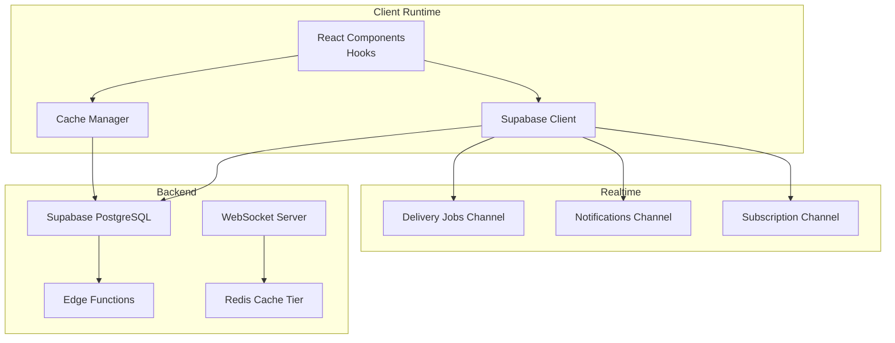
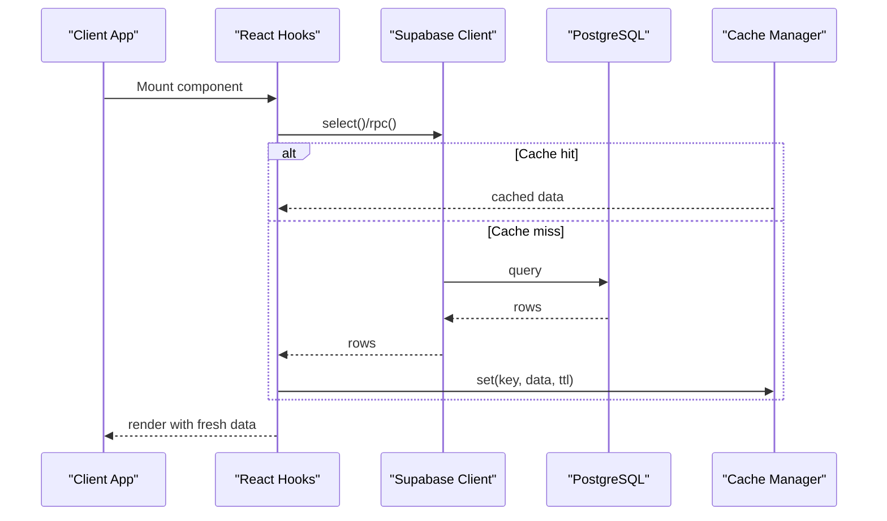
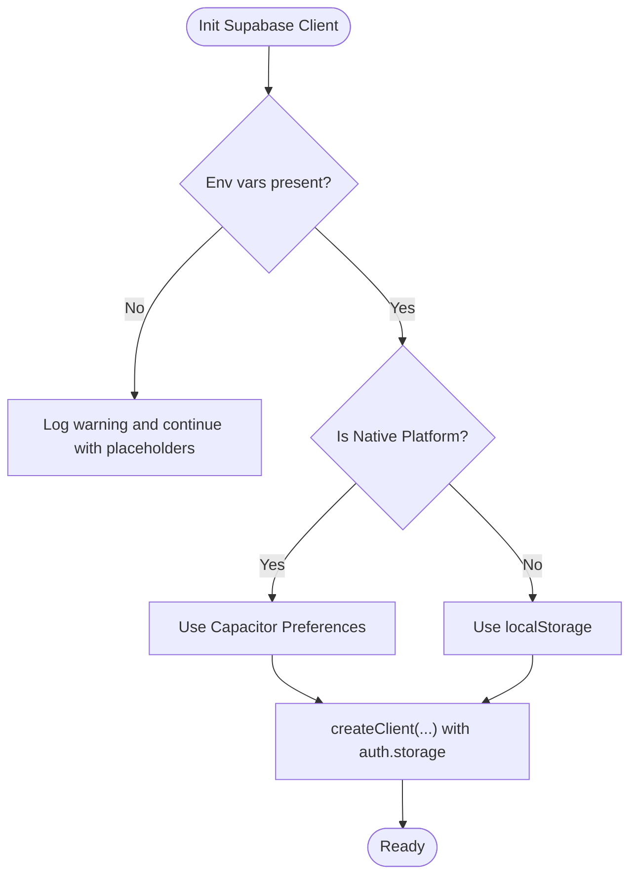
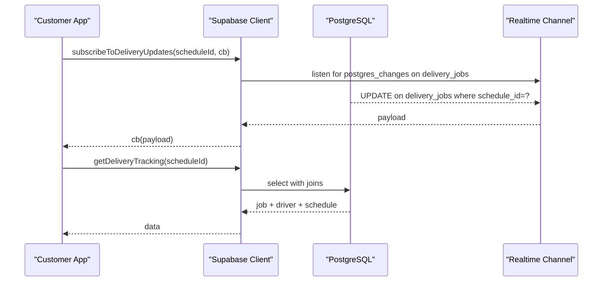
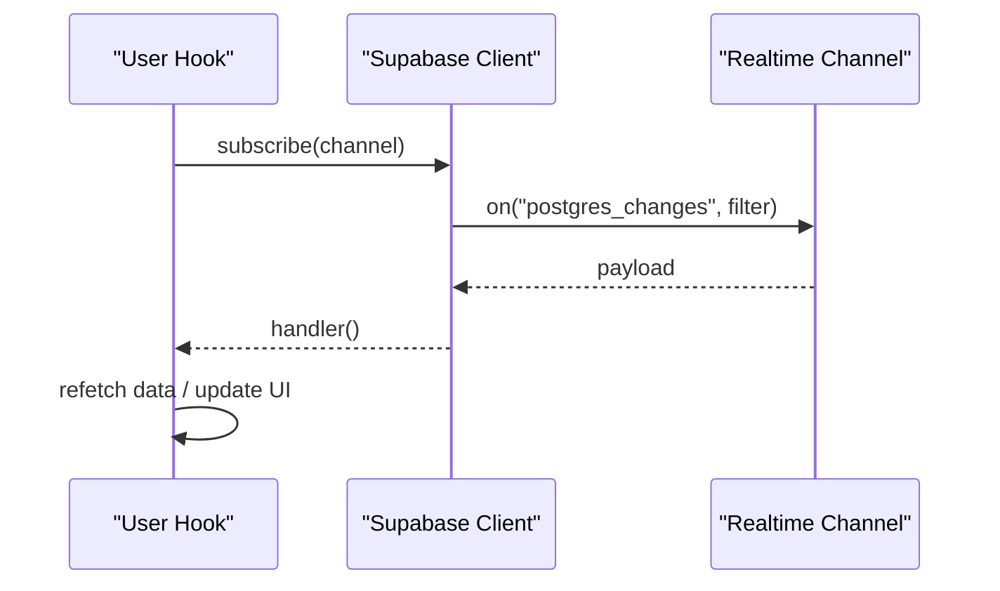
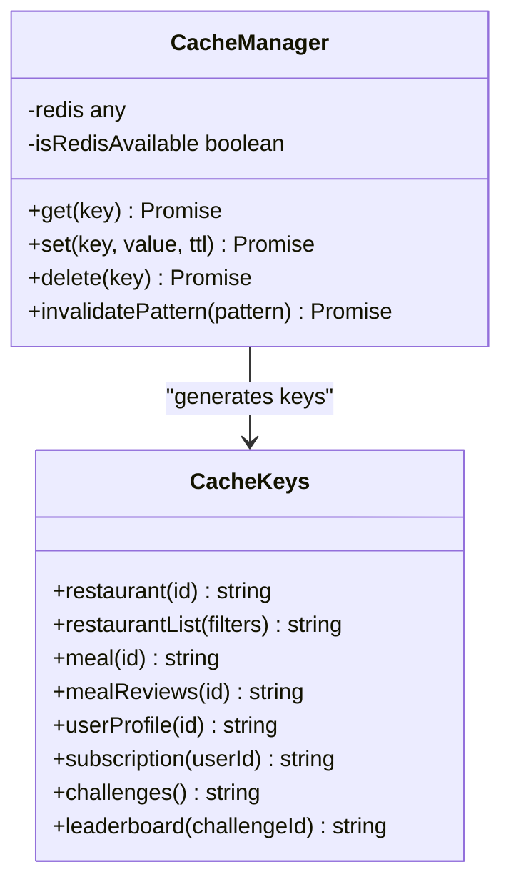
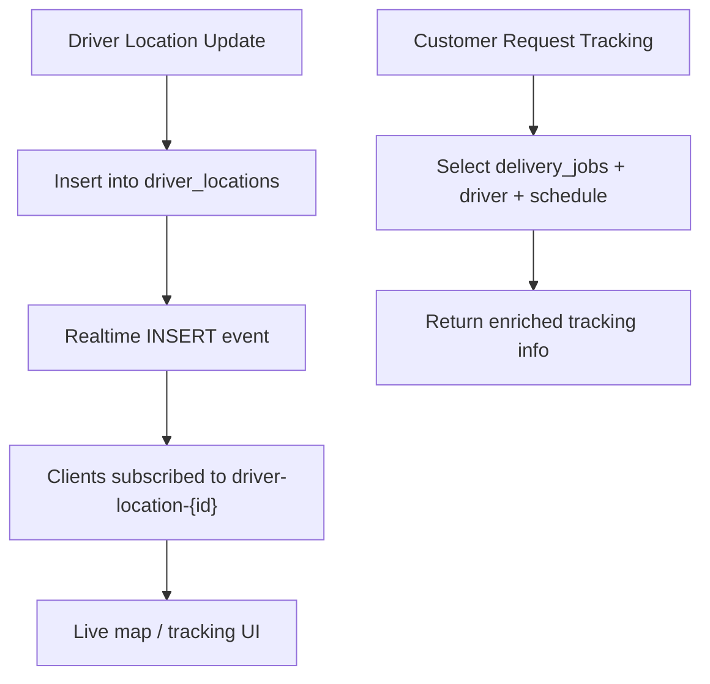
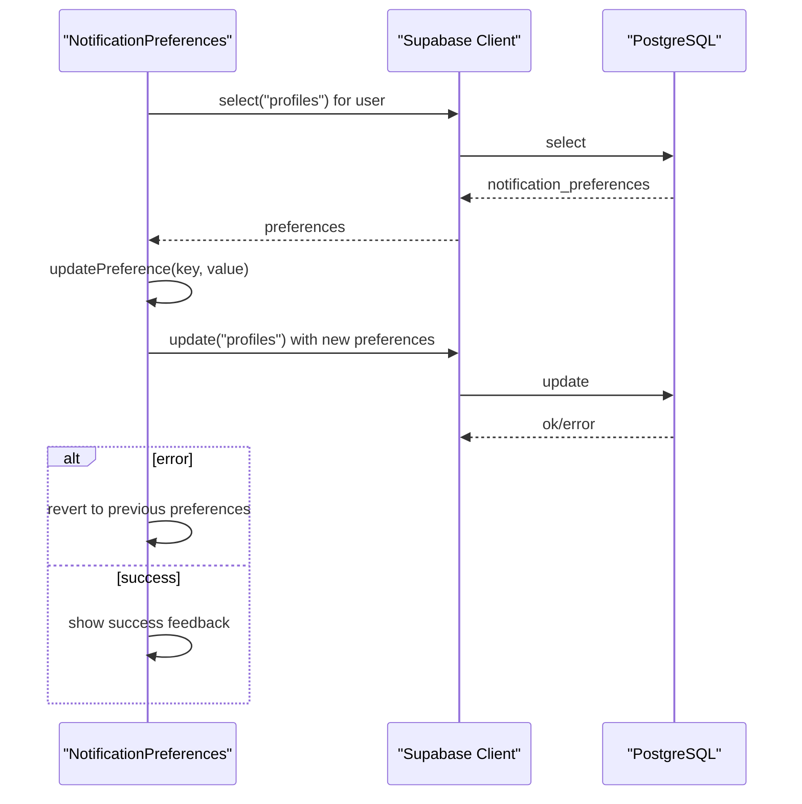
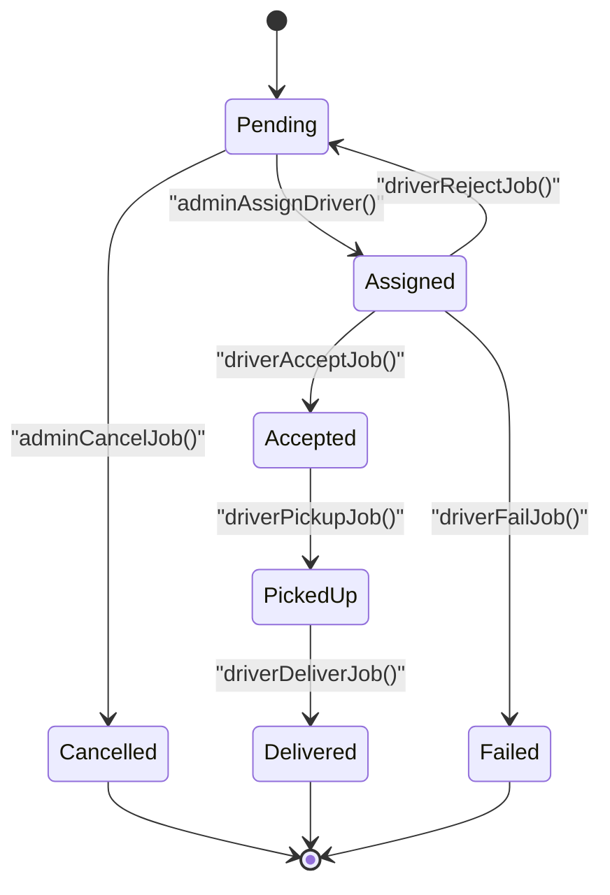
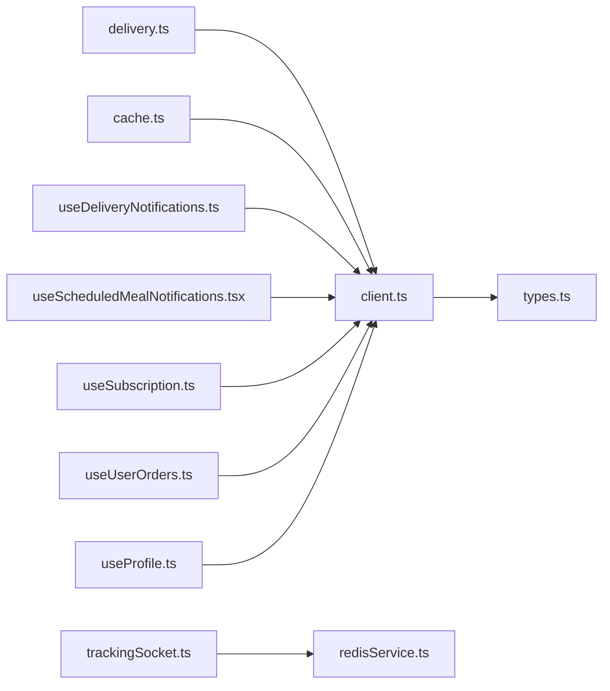

# Data Synchronization

<cite>
**Referenced Files in This Document**
- [client.ts](file://src/integrations/supabase/client.ts)
- [delivery.ts](file://src/integrations/supabase/delivery.ts)
- [types.ts](file://src/integrations/supabase/types.ts)
- [cache.ts](file://src/lib/cache.ts)
- [useDeliveryNotifications.ts](file://src/hooks/useDeliveryNotifications.ts)
- [useScheduledMealNotifications.tsx](file://src/hooks/useScheduledMealNotifications.tsx)
- [useSubscription.ts](file://src/hooks/useSubscription.ts)
- [useUserOrders.ts](file://src/hooks/useUserOrders.ts)
- [useProfile.ts](file://src/hooks/useProfile.ts)
- [NotificationPreferences.tsx](file://src/components/NotificationPreferences.tsx)
- [translationService.ts](file://src/services/translationService.ts)
- [trackingSocket.ts](file://src/fleet/services/trackingSocket.ts)
- [redisService.ts](file://websocket-server/src/services/redisService.ts)
- [20260227000003_verify_backups.sql](file://supabase/migrations/20260227000003_verify_backups.sql)
- [20260227000004_webhook_retry_system.sql](file://supabase/migrations/20260227000004_webhook_retry_system.sql)
- [realtime.spec.ts](file://e2e/system/realtime.spec.ts)
</cite>

## Table of Contents
1. [Introduction](#introduction)
2. [Project Structure](#project-structure)
3. [Core Components](#core-components)
4. [Architecture Overview](#architecture-overview)
5. [Detailed Component Analysis](#detailed-component-analysis)
6. [Dependency Analysis](#dependency-analysis)
7. [Performance Considerations](#performance-considerations)
8. [Troubleshooting Guide](#troubleshooting-guide)
9. [Conclusion](#conclusion)
10. [Appendices](#appendices)

## Introduction
This document explains the data synchronization mechanisms powering the Nutrio platform. It covers Supabase client configuration, real-time subscriptions, offline-friendly caching, and cross-platform session persistence. It also details consistency strategies, conflict handling, synchronization timing, delivery tracking flows, user preference synchronization, and robustness against failures. Practical guidance is included for reactive patterns, optimistic updates, and performance optimization for large datasets.

## Project Structure
The synchronization system spans:
- Supabase client and typed database definitions
- Real-time subscriptions for delivery, notifications, and subscription state
- A caching layer for frequently accessed data
- Cross-platform session persistence via Capacitor Preferences
- Delivery tracking channels and WebSocket-based tracking
- Disaster recovery and retry mechanisms

**Diagram sources**
- [client.ts:1-57](file://src/integrations/supabase/client.ts#L1-L57)
- [delivery.ts:694-735](file://src/integrations/supabase/delivery.ts#L694-L735)
- [cache.ts:16-107](file://src/lib/cache.ts#L16-L107)
- [trackingSocket.ts:164-214](file://src/fleet/services/trackingSocket.ts#L164-L214)
- [redisService.ts:83-140](file://websocket-server/src/services/redisService.ts#L83-L140)

**Section sources**
- [client.ts:1-57](file://src/integrations/supabase/client.ts#L1-L57)
- [types.ts:1-800](file://src/integrations/supabase/types.ts#L1-L800)
- [cache.ts:16-107](file://src/lib/cache.ts#L16-L107)

## Core Components
- Supabase client with Capacitor-native storage adapter for sessions and persistence
- Real-time channels for delivery updates, scheduled meal notifications, and subscription state
- Typed Supabase database definitions for compile-time safety
- Cache manager with in-memory fallback and Redis availability detection
- Delivery tracking APIs and subscriptions for customers and drivers
- Cross-platform session storage and user preference synchronization
- Disaster recovery and webhook retry infrastructure

**Section sources**
- [client.ts:18-57](file://src/integrations/supabase/client.ts#L18-L57)
- [delivery.ts:694-735](file://src/integrations/supabase/delivery.ts#L694-L735)
- [types.ts:9-800](file://src/integrations/supabase/types.ts#L9-L800)
- [cache.ts:16-107](file://src/lib/cache.ts#L16-L107)

## Architecture Overview
The system combines Supabase’s Postgres and Realtime with a caching layer and optional WebSocket-based tracking for fleet operations. Real-time channels reactively update UIs, while caching reduces backend load. Disaster recovery and retry systems protect against transient failures.

**Diagram sources**
- [cache.ts:37-75](file://src/lib/cache.ts#L37-L75)
- [cache.ts:124-177](file://src/lib/cache.ts#L124-L177)

**Section sources**
- [cache.ts:16-107](file://src/lib/cache.ts#L16-L107)

## Detailed Component Analysis

### Supabase Client Configuration and Cross-Platform Sessions
- Environment-driven client initialization with guardrails for missing variables
- Capacitor Preferences adapter for native sessions and local storage fallback for web
- Persistent auth sessions with automatic token refresh

**Diagram sources**
- [client.ts:7-57](file://src/integrations/supabase/client.ts#L7-L57)

**Section sources**
- [client.ts:7-57](file://src/integrations/supabase/client.ts#L7-L57)

### Real-Time Subscriptions: Delivery Tracking
- Customers receive real-time delivery status updates filtered by schedule ID
- Drivers’ live location updates are streamed via a dedicated channel
- Subscription state changes trigger re-fetches for accurate UI state

**Diagram sources**
- [delivery.ts:694-735](file://src/integrations/supabase/delivery.ts#L694-L735)
- [delivery.ts:650-674](file://src/integrations/supabase/delivery.ts#L650-L674)

**Section sources**
- [delivery.ts:694-735](file://src/integrations/supabase/delivery.ts#L694-L735)
- [delivery.ts:650-674](file://src/integrations/supabase/delivery.ts#L650-L674)

### Real-Time Subscriptions: Notifications and Subscription State
- Delivery notifications channel emits only status-change events for the user’s orders
- Scheduled meal notifications channel listens for new inserts and updates unread lists
- Subscription state channel triggers re-fetches for accurate quotas and tiers

**Diagram sources**
- [useDeliveryNotifications.ts:37-135](file://src/hooks/useDeliveryNotifications.ts#L37-L135)
- [useScheduledMealNotifications.tsx:98-118](file://src/hooks/useScheduledMealNotifications.tsx#L98-L118)
- [useSubscription.ts:100-123](file://src/hooks/useSubscription.ts#L100-L123)

**Section sources**
- [useDeliveryNotifications.ts:37-135](file://src/hooks/useDeliveryNotifications.ts#L37-L135)
- [useScheduledMealNotifications.tsx:98-118](file://src/hooks/useScheduledMealNotifications.tsx#L98-L118)
- [useSubscription.ts:100-123](file://src/hooks/useSubscription.ts#L100-L123)

### Offline Data Caching Strategies
- Cache manager supports Redis availability detection and falls back to in-memory cache
- TTL-based eviction and pattern-based invalidation
- Cached fetchers for restaurants, meals, and active challenges
- Cache key generators for targeted invalidation

**Diagram sources**
- [cache.ts:16-107](file://src/lib/cache.ts#L16-L107)
- [cache.ts:112-121](file://src/lib/cache.ts#L112-L121)

**Section sources**
- [cache.ts:16-107](file://src/lib/cache.ts#L16-L107)
- [cache.ts:124-177](file://src/lib/cache.ts#L124-L177)

### Delivery Tracking Data Flow
- Driver location updates are persisted and streamed to subscribers
- Customer tracking resolves job, driver, and schedule details
- Assignment logic finds nearest drivers and assigns jobs with prioritization

**Diagram sources**
- [delivery.ts:50-82](file://src/integrations/supabase/delivery.ts#L50-L82)
- [delivery.ts:679-690](file://src/integrations/supabase/delivery.ts#L679-L690)
- [delivery.ts:650-674](file://src/integrations/supabase/delivery.ts#L650-L674)

**Section sources**
- [delivery.ts:50-82](file://src/integrations/supabase/delivery.ts#L50-L82)
- [delivery.ts:679-690](file://src/integrations/supabase/delivery.ts#L679-L690)
- [delivery.ts:650-674](file://src/integrations/supabase/delivery.ts#L650-L674)

### User Preference Synchronization
- Notification preferences stored in user profiles and updated reactively
- Preferred language stored in profiles and synchronized via service functions
- UI components fetch and update preferences with optimistic toggles and rollback on error

**Diagram sources**
- [NotificationPreferences.tsx:51-83](file://src/components/NotificationPreferences.tsx#L51-L83)
- [translationService.ts:63-79](file://src/services/translationService.ts#L63-L79)

**Section sources**
- [NotificationPreferences.tsx:51-83](file://src/components/NotificationPreferences.tsx#L51-L83)
- [translationService.ts:63-79](file://src/services/translationService.ts#L63-L79)

### Cross-Platform Data Consistency
- Capacitor Preferences adapter ensures sessions persist across native app restarts
- Local storage fallback for web maintains parity
- Real-time channels and cache invalidation keep views consistent across platforms

**Section sources**
- [client.ts:18-45](file://src/integrations/supabase/client.ts#L18-L45)

### Conflict Resolution and Synchronization Timing
- Real-time channels filter by user or schedule identifiers to avoid cross-user updates
- Subscription state channel triggers re-fetch on any change, ensuring eventual consistency
- Visibility change listener forces periodic refresh when app becomes visible
- Delivery job transitions enforce state machine boundaries (assigned → accepted → picked_up → delivered/failed)

**Diagram sources**
- [delivery.ts:268-384](file://src/integrations/supabase/delivery.ts#L268-L384)

**Section sources**
- [delivery.ts:268-384](file://src/integrations/supabase/delivery.ts#L268-L384)
- [useSubscription.ts:100-134](file://src/hooks/useSubscription.ts#L100-L134)

### Reactive Data Patterns and Optimistic Updates
- Hooks orchestrate fetch, real-time updates, and visibility-based refresh
- Notification preferences update optimistically and roll back on error
- Subscription usage increments RPC calls with immediate UI updates followed by re-fetch

**Section sources**
- [useDeliveryNotifications.ts:37-135](file://src/hooks/useDeliveryNotifications.ts#L37-L135)
- [NotificationPreferences.tsx:68-83](file://src/components/NotificationPreferences.tsx#L68-L83)
- [useSubscription.ts:163-203](file://src/hooks/useSubscription.ts#L163-L203)

### Error Recovery During Synchronization Failures
- Webhook retry system with exponential backoff and dead letter queue
- Disaster recovery procedures with point-in-time recovery (PITR) checks
- WebSocket reconnection with exponential backoff and message queue flushing

**Section sources**
- [20260227000004_webhook_retry_system.sql:419-434](file://supabase/migrations/20260227000004_webhook_retry_system.sql#L419-L434)
- [20260227000003_verify_backups.sql:37-117](file://supabase/migrations/20260227000003_verify_backups.sql#L37-L117)
- [trackingSocket.ts:164-214](file://src/fleet/services/trackingSocket.ts#L164-L214)

## Dependency Analysis
- Supabase client depends on environment variables and platform-specific storage
- Hooks depend on Supabase client and typed database definitions
- Cache manager depends on Supabase client for cache misses and on Redis availability
- Delivery tracking depends on Supabase channels and typed tables
- WebSocket tracking depends on Redis cache service for driver location/status

**Diagram sources**
- [client.ts:1-57](file://src/integrations/supabase/client.ts#L1-L57)
- [delivery.ts:1-5](file://src/integrations/supabase/delivery.ts#L1-L5)
- [cache.ts:6-7](file://src/lib/cache.ts#L6-L7)
- [useDeliveryNotifications.ts:1-4](file://src/hooks/useDeliveryNotifications.ts#L1-L4)
- [useScheduledMealNotifications.tsx:1-8](file://src/hooks/useScheduledMealNotifications.tsx#L1-L8)
- [useSubscription.ts:1-4](file://src/hooks/useSubscription.ts#L1-L4)
- [useUserOrders.ts:1-3](file://src/hooks/useUserOrders.ts#L1-L3)
- [useProfile.ts:1-4](file://src/hooks/useProfile.ts#L1-L4)
- [trackingSocket.ts:164-214](file://src/fleet/services/trackingSocket.ts#L164-L214)
- [redisService.ts:83-140](file://websocket-server/src/services/redisService.ts#L83-L140)

**Section sources**
- [client.ts:1-57](file://src/integrations/supabase/client.ts#L1-L57)
- [delivery.ts:1-5](file://src/integrations/supabase/delivery.ts#L1-L5)
- [cache.ts:6-7](file://src/lib/cache.ts#L6-L7)
- [trackingSocket.ts:164-214](file://src/fleet/services/trackingSocket.ts#L164-L214)
- [redisService.ts:83-140](file://websocket-server/src/services/redisService.ts#L83-L140)

## Performance Considerations
- Use cache keys and TTLs appropriate for data volatility (e.g., restaurants and meals cache for minutes, leaderboards for shorter intervals)
- Prefer single-row selects with targeted joins for delivery tracking to minimize payload sizes
- Limit real-time subscriptions to narrow filters (by user ID or schedule ID) to reduce bandwidth
- Batch WebSocket updates where feasible and leverage Redis for hot-path driver location/status caching
- Monitor Supabase query performance and consider materialized views or edge functions for heavy aggregations

[No sources needed since this section provides general guidance]

## Troubleshooting Guide
- Realtime tests: Validate WebSocket connection and status update reception
- Delivery tracking: Confirm channel filters match schedule/user IDs and that updates are emitted on state transitions
- Cache invalidation: Ensure cache keys are invalidated after mutations (e.g., profile updates, order changes)
- Disaster recovery: Verify PITR configuration and test recovery procedures regularly
- Webhook retries: Inspect retry queue and dead letter handling for persistent failures

**Section sources**
- [realtime.spec.ts:1-37](file://e2e/system/realtime.spec.ts#L1-L37)
- [cache.ts:179-195](file://src/lib/cache.ts#L179-L195)
- [20260227000003_verify_backups.sql:37-117](file://supabase/migrations/20260227000003_verify_backups.sql#L37-L117)
- [20260227000004_webhook_retry_system.sql:419-434](file://supabase/migrations/20260227000004_webhook_retry_system.sql#L419-L434)

## Conclusion
Nutrio’s synchronization strategy blends Supabase’s real-time capabilities with a pragmatic caching layer and robust cross-platform session persistence. Delivery tracking, user preferences, and subscription state benefit from targeted real-time channels and cache-aware fetchers. Disaster recovery and webhook retry systems harden the platform against failures, while performance guidance helps scale to larger datasets.

[No sources needed since this section summarizes without analyzing specific files]

## Appendices

### Data Integrity Checks and Backup Procedures
- PITR verification and automated backup checks
- Disaster recovery procedures with documented RTO/RPO targets
- Webhook retry queue with exponential backoff and dead letter handling

**Section sources**
- [20260227000003_verify_backups.sql:37-117](file://supabase/migrations/20260227000003_verify_backups.sql#L37-L117)
- [20260227000004_webhook_retry_system.sql:419-434](file://supabase/migrations/20260227000004_webhook_retry_system.sql#L419-L434)