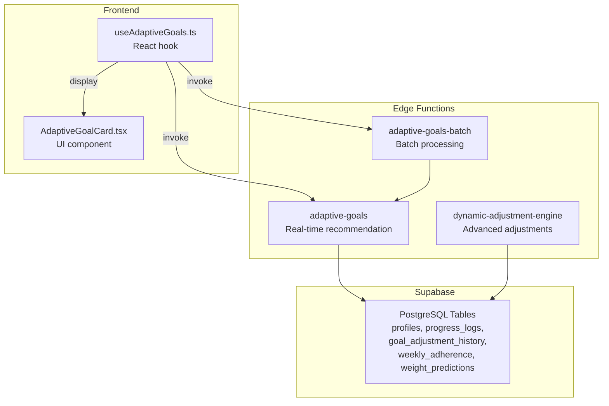
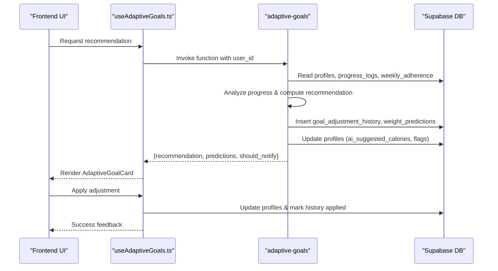
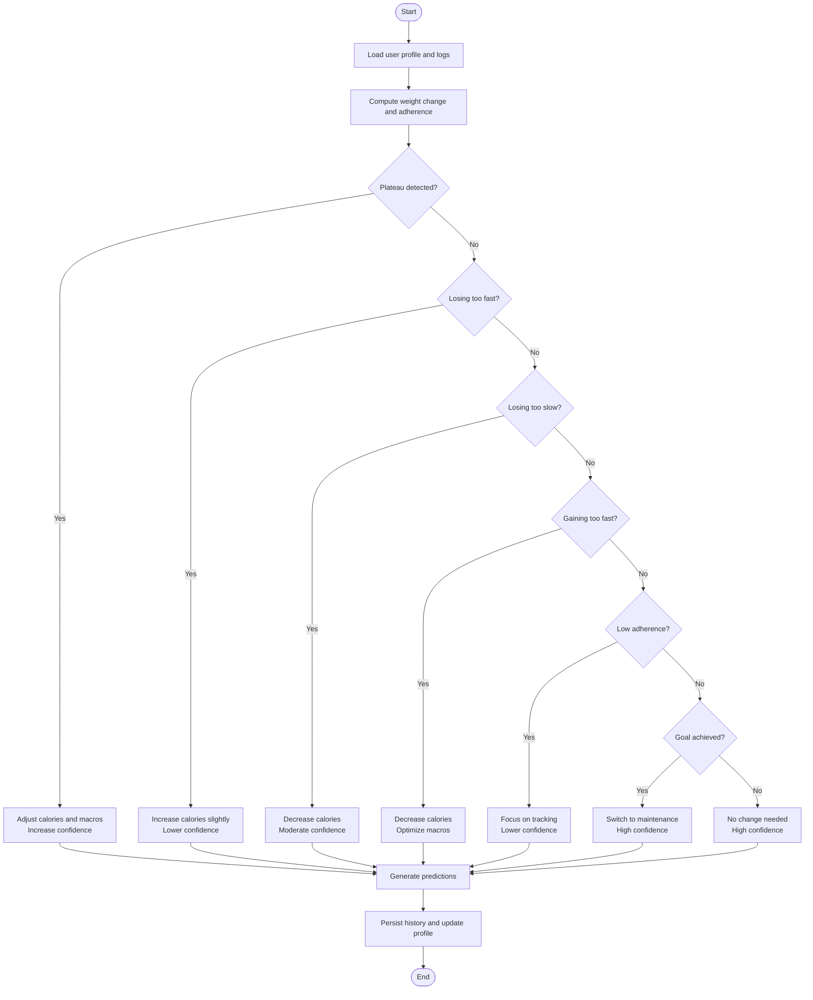
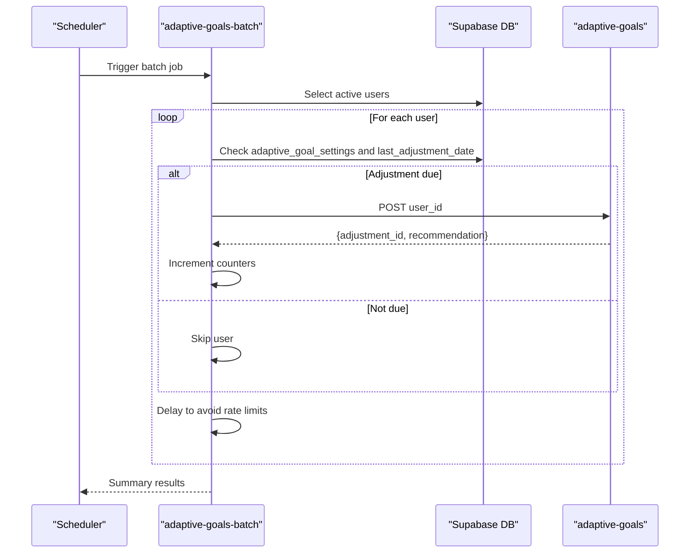
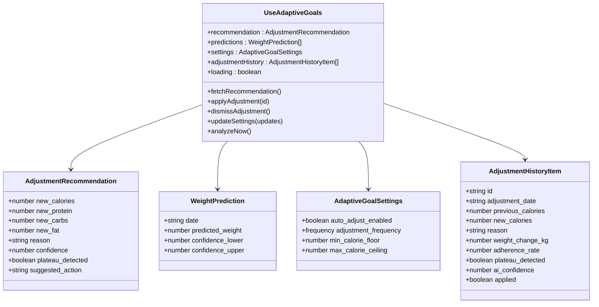
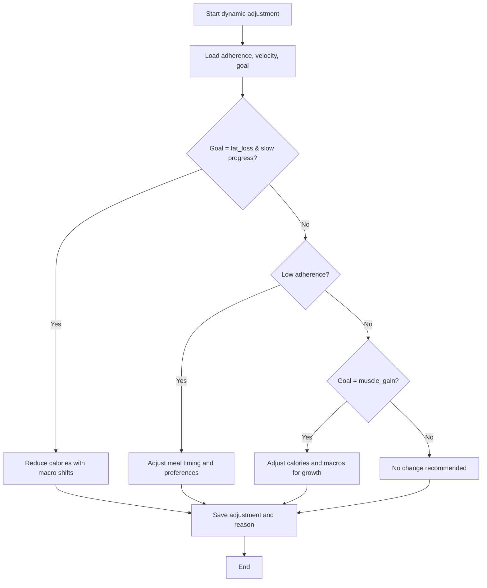
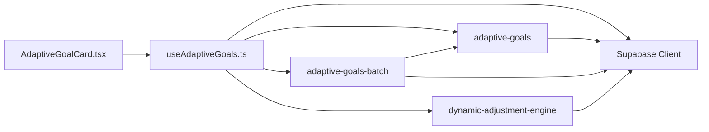

# Adaptive Goals Engine

<cite>
**Referenced Files in This Document**
- [index.ts](file://supabase/functions/adaptive-goals/index.ts)
- [index.ts](file://supabase/functions/adaptive-goals-batch/index.ts)
- [useAdaptiveGoals.ts](file://src/hooks/useAdaptiveGoals.ts)
- [AdaptiveGoalCard.tsx](file://src/components/AdaptiveGoalCard.tsx)
- [index.ts](file://supabase/functions/dynamic-adjustment-engine/index.ts)
</cite>

## Table of Contents
1. [Introduction](#introduction)
2. [Project Structure](#project-structure)
3. [Core Components](#core-components)
4. [Architecture Overview](#architecture-overview)
5. [Detailed Component Analysis](#detailed-component-analysis)
6. [Dependency Analysis](#dependency-analysis)
7. [Performance Considerations](#performance-considerations)
8. [Troubleshooting Guide](#troubleshooting-guide)
9. [Conclusion](#conclusion)

## Introduction
The Adaptive Goals Engine is an AI-powered edge function suite that analyzes user health data, preferences, and goals to generate personalized nutrition targets and recommendations. It provides real-time goal adjustment decisions based on progress trends, adherence patterns, and weight velocity, while offering batch processing capabilities for scalable operation across many users. The system integrates seamlessly with the frontend via Supabase Edge Functions and React hooks, delivering actionable insights with confidence scores and safety safeguards.

## Project Structure
The Adaptive Goals Engine spans three primary areas:
- Edge functions: Real-time and batch processing logic for generating recommendations and adjusting goals
- Frontend integration: React hooks and UI components for displaying recommendations, predictions, and managing adjustments
- Supporting engine: A complementary dynamic adjustment engine for advanced behavioral and adherence-driven recommendations

**Diagram sources**
- [index.ts:316-522](file://supabase/functions/adaptive-goals/index.ts#L316-L522)
- [index.ts:9-136](file://supabase/functions/adaptive-goals-batch/index.ts#L9-L136)
- [useAdaptiveGoals.ts:136-178](file://src/hooks/useAdaptiveGoals.ts#L136-L178)
- [AdaptiveGoalCard.tsx:1-218](file://src/components/AdaptiveGoalCard.tsx#L1-L218)

**Section sources**
- [index.ts:1-522](file://supabase/functions/adaptive-goals/index.ts#L1-L522)
- [index.ts:1-136](file://supabase/functions/adaptive-goals-batch/index.ts#L1-L136)
- [useAdaptiveGoals.ts:1-407](file://src/hooks/useAdaptiveGoals.ts#L1-L407)
- [AdaptiveGoalCard.tsx:1-218](file://src/components/AdaptiveGoalCard.tsx#L1-L218)

## Core Components
- Real-time Adaptive Goals Function: Processes user progress data to compute targeted nutrition adjustments, confidence scores, and future weight predictions.
- Batch Processing Function: Iterates through eligible users, invoking the real-time function with controlled pacing and aggregating results.
- Frontend Hook and UI: Manages recommendation lifecycle, displays suggestions with macro breakdowns, and enables safe application of changes.
- Dynamic Adjustment Engine: Provides advanced behavioral and adherence-driven recommendations for complex scenarios.

Key responsibilities:
- Data ingestion: Reads profiles, progress logs, and adherence metrics
- Decision logic: Applies scenario-based rules for goal adjustment
- Persistence: Stores recommendations, predictions, and adjustment history
- Frontend integration: Exposes typed APIs for UI rendering and user actions

**Section sources**
- [index.ts:52-227](file://supabase/functions/adaptive-goals/index.ts#L52-L227)
- [index.ts:264-314](file://supabase/functions/adaptive-goals/index.ts#L264-L314)
- [index.ts:316-522](file://supabase/functions/adaptive-goals/index.ts#L316-L522)
- [index.ts:19-136](file://supabase/functions/adaptive-goals-batch/index.ts#L19-L136)
- [useAdaptiveGoals.ts:136-178](file://src/hooks/useAdaptiveGoals.ts#L136-L178)
- [AdaptiveGoalCard.tsx:1-218](file://src/components/AdaptiveGoalCard.tsx#L1-L218)

## Architecture Overview
The system operates as a serverless pipeline:
- Frontend triggers analysis via Supabase Edge Functions
- Edge functions validate eligibility, compute recommendations, and persist outcomes
- Frontend renders recommendations and allows users to apply changes safely
- Batch function periodically evaluates many users concurrently

**Diagram sources**
- [useAdaptiveGoals.ts:136-178](file://src/hooks/useAdaptiveGoals.ts#L136-L178)
- [index.ts:316-522](file://supabase/functions/adaptive-goals/index.ts#L316-L522)

## Detailed Component Analysis

### Real-time Adaptive Goals Function
Responsibilities:
- Validate user eligibility and settings
- Aggregate progress data (weight logs, calorie logs, adherence)
- Compute scenario-based adjustments (plateau, rapid change, low adherence, goal achievement)
- Generate confidence scores and future weight predictions
- Persist recommendations and update user profile flags

Processing logic highlights:
- Scenario detection: Plateau, rapid weight change, low adherence, goal achievement, and default maintenance
- Confidence scoring: Reflects algorithm certainty based on data quality and trends
- Prediction model: Simple trend-based forecasting with decreasing confidence over time
- Safety checks: Minimum/maximum calorie thresholds and macro proportion constraints

**Diagram sources**
- [index.ts:52-227](file://supabase/functions/adaptive-goals/index.ts#L52-L227)
- [index.ts:229-262](file://supabase/functions/adaptive-goals/index.ts#L229-L262)
- [index.ts:316-522](file://supabase/functions/adaptive-goals/index.ts#L316-L522)

**Section sources**
- [index.ts:10-40](file://supabase/functions/adaptive-goals/index.ts#L10-L40)
- [index.ts:52-227](file://supabase/functions/adaptive-goals/index.ts#L52-L227)
- [index.ts:229-262](file://supabase/functions/adaptive-goals/index.ts#L229-L262)
- [index.ts:316-522](file://supabase/functions/adaptive-goals/index.ts#L316-L522)

### Batch Processing Function
Responsibilities:
- Enumerate active users with completed onboarding
- Evaluate adjustment frequency against last adjustment date
- Invoke the real-time function for eligible users with throttling
- Aggregate statistics (processed, skipped, errors, adjustments created, plateaus detected)

**Diagram sources**
- [index.ts:19-136](file://supabase/functions/adaptive-goals-batch/index.ts#L19-L136)

**Section sources**
- [index.ts:19-136](file://supabase/functions/adaptive-goals-batch/index.ts#L19-L136)

### Frontend Integration: Hook and UI
Responsibilities:
- Fetch and manage adaptive goal settings, recommendations, predictions, and adjustment history
- Provide safe application and dismissal of adjustments
- Handle availability detection for edge functions and graceful degradation

Key behaviors:
- Availability guard: Detects when edge functions are not yet deployed and disables features accordingly
- Dry-run vs. live analysis: Supports preview mode and actual execution
- Safe application: Updates user targets only after confirmation and persistence

**Diagram sources**
- [useAdaptiveGoals.ts:6-60](file://src/hooks/useAdaptiveGoals.ts#L6-L60)

**Section sources**
- [useAdaptiveGoals.ts:62-407](file://src/hooks/useAdaptiveGoals.ts#L62-L407)
- [AdaptiveGoalCard.tsx:1-218](file://src/components/AdaptiveGoalCard.tsx#L1-L218)

### Dynamic Adjustment Engine (Advanced Scenarios)
This engine extends the real-time function with additional behavioral and adherence-driven logic:
- Generates detailed recommendations based on adherence rates, weight velocity, and goal type
- Provides confidence scores and suggested actions tailored to user behavior
- Persists adjustments and updates user profiles accordingly

**Diagram sources**
- [index.ts:85-275](file://supabase/functions/dynamic-adjustment-engine/index.ts#L85-L275)

**Section sources**
- [index.ts:85-275](file://supabase/functions/dynamic-adjustment-engine/index.ts#L85-L275)

## Dependency Analysis
- Edge functions depend on Supabase client for database operations and environment variables for credentials
- Frontend depends on Supabase Edge Functions SDK to invoke functions and on local state for UI management
- Data dependencies include profiles, progress_logs, weekly_adherence, goal_adjustment_history, and weight_predictions

**Diagram sources**
- [index.ts:322-325](file://supabase/functions/adaptive-goals/index.ts#L322-L325)
- [index.ts:14-17](file://supabase/functions/adaptive-goals-batch/index.ts#L14-L17)
- [useAdaptiveGoals.ts:2-4](file://src/hooks/useAdaptiveGoals.ts#L2-L4)

**Section sources**
- [index.ts:322-325](file://supabase/functions/adaptive-goals/index.ts#L322-L325)
- [index.ts:14-17](file://supabase/functions/adaptive-goals-batch/index.ts#L14-L17)
- [useAdaptiveGoals.ts:2-4](file://src/hooks/useAdaptiveGoals.ts#L2-L4)

## Performance Considerations
- Batch processing throttling: Built-in delay between user invocations to prevent rate limiting
- Data windowing: Limits queries to recent data (e.g., last 12 weeks for weight logs, last 4 weeks for calories) to reduce payload sizes
- Upsert pattern: Uses conflict resolution for weekly adherence to avoid duplicates and reduce write contention
- Confidence-based notifications: Reduces noise by notifying only on significant changes or plateaus
- Frontend caching: Avoids repeated function calls when the function is unavailable, preventing unnecessary network requests

[No sources needed since this section provides general guidance]

## Troubleshooting Guide
Common issues and resolutions:
- Function not deployed: The frontend detects CORS/network errors and disables adaptive features until deployment completes
- Missing user profile: Returns 404 when profile data is not found; ensure onboarding is complete
- Insufficient data: Returns empty predictions when fewer than minimum required logs are present
- Rate limiting: Batch function includes deliberate delays; monitor backend quotas and adjust scheduling
- Adjustment conflicts: Duplicate settings creation handled via upsert; ensure unique constraints are respected

**Section sources**
- [useAdaptiveGoals.ts:153-161](file://src/hooks/useAdaptiveGoals.ts#L153-L161)
- [index.ts:361-366](file://supabase/functions/adaptive-goals/index.ts#L361-L366)
- [index.ts:236-238](file://supabase/functions/adaptive-goals/index.ts#L236-L238)
- [index.ts:110-111](file://supabase/functions/adaptive-goals-batch/index.ts#L110-L111)

## Conclusion
The Adaptive Goals Engine delivers a robust, scalable solution for AI-powered nutrition recommendations. Its real-time and batch processing capabilities, combined with strong frontend integration and safety mechanisms, enable personalized, evidence-based goal adjustments. The modular design supports extension for advanced scenarios via the dynamic adjustment engine, ensuring continued relevance as user needs evolve.