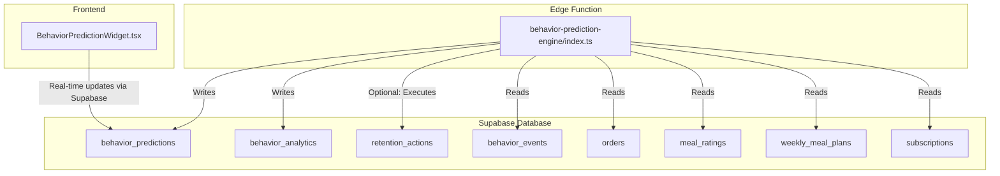
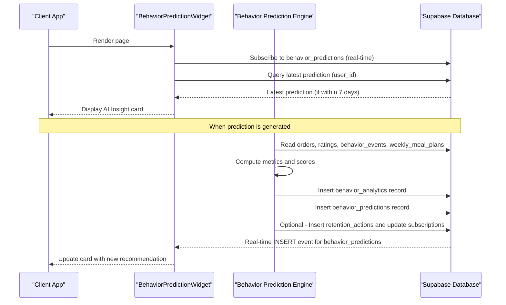
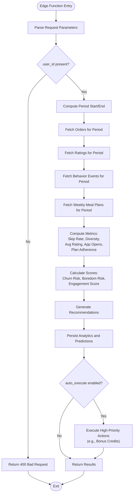
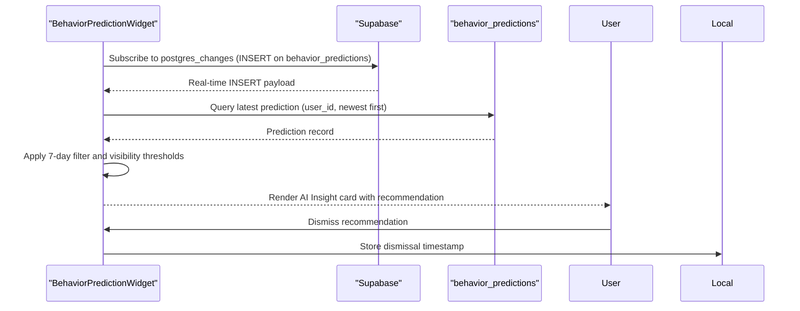
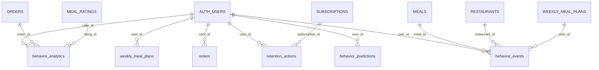
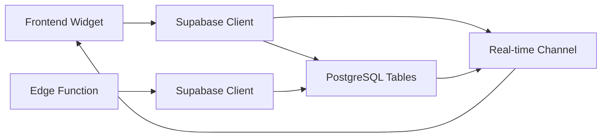

# Behavior Prediction Engine

<cite>
**Referenced Files in This Document**
- [index.ts](file://supabase/functions/behavior-prediction-engine/index.ts)
- [BehaviorPredictionWidget.tsx](file://src/components/BehaviorPredictionWidget.tsx)
- [config.toml](file://supabase/config.toml)
- [20260225000005_add_streak_rewards_and_behavior_predictions.sql](file://supabase/migrations/20260225000005_add_streak_rewards_and_behavior_predictions.sql)
- [20250223000001_ai_subscription_credit_system.sql](file://supabase/migrations/20250223000001_ai_subscription_credit_system.sql)
- [types.ts](file://src/integrations/supabase/types.ts)
</cite>

## Table of Contents
1. [Introduction](#introduction)
2. [Project Structure](#project-structure)
3. [Core Components](#core-components)
4. [Architecture Overview](#architecture-overview)
5. [Detailed Component Analysis](#detailed-component-analysis)
6. [Dependency Analysis](#dependency-analysis)
7. [Performance Considerations](#performance-considerations)
8. [Troubleshooting Guide](#troubleshooting-guide)
9. [Conclusion](#conclusion)

## Introduction
The Behavior Prediction Engine is a Deno-based edge function that analyzes user behavior patterns to forecast churn risk, boredom risk, and engagement levels. It powers proactive retention strategies by generating actionable recommendations and optionally executing automated actions such as issuing bonus credits. The system integrates with Supabase for data storage, real-time subscriptions, and row-level security policies.

## Project Structure
The Behavior Prediction Engine spans three primary areas:
- Edge Function: Predictive analytics and retention automation logic
- Frontend Widget: Real-time display of behavior predictions and recommendations
- Database Schema: Tables for storing behavior analytics, predictions, retention actions, and related events

**Diagram sources**
- [index.ts:306-512](file://supabase/functions/behavior-prediction-engine/index.ts#L306-L512)
- [BehaviorPredictionWidget.tsx:34-60](file://src/components/BehaviorPredictionWidget.tsx#L34-L60)
- [20260225000005_add_streak_rewards_and_behavior_predictions.sql:34-44](file://supabase/migrations/20260225000005_add_streak_rewards_and_behavior_predictions.sql#L34-L44)
- [20250223000001_ai_subscription_credit_system.sql:164-198](file://supabase/migrations/20250223000001_ai_subscription_credit_system.sql#L164-L198)

**Section sources**
- [index.ts:1-513](file://supabase/functions/behavior-prediction-engine/index.ts#L1-L513)
- [BehaviorPredictionWidget.tsx:1-201](file://src/components/BehaviorPredictionWidget.tsx#L1-L201)
- [config.toml:54-55](file://supabase/config.toml#L54-L55)

## Core Components
- Behavior Prediction Engine (Deno Edge Function)
  - Accepts user_id, analyze_period_days, and auto_execute parameters
  - Computes ordering frequency, skip rate, restaurant diversity, average rating, recent app opens, and plan adherence
  - Calculates churn risk score, boredom risk score, and engagement score
  - Generates retention recommendations with priorities and suggested actions
  - Optionally executes high-priority actions (e.g., awarding bonus credits) and logs outcomes
  - Stores analytics and predictions in Supabase tables
- Behavior Prediction Widget (React Component)
  - Subscribes to real-time behavior_predictions updates
  - Filters predictions to those within the last 7 days
  - Displays actionable insights with severity indicators
  - Supports dismissal and local persistence

Key prediction scoring mechanisms:
- Churn Risk Score: Weighted factors including ordering frequency, skip rate, restaurant diversity, recent app opens, and subscription timing
- Boredom Risk Score: Factors including average rating, cuisine diversity, plan adherence, and repetition patterns
- Engagement Score: Composite score derived from similar behavioral metrics, scaled to 1–100

Threshold configurations:
- Widget visibility thresholds: churn_risk_score > 0.6, boredom_risk_score > 0.6, or engagement_score < 40
- Action execution thresholds: auto_execute triggers only for critical and high-priority recommendations

**Section sources**
- [index.ts:41-142](file://supabase/functions/behavior-prediction-engine/index.ts#L41-L142)
- [index.ts:144-231](file://supabase/functions/behavior-prediction-engine/index.ts#L144-L231)
- [index.ts:433-451](file://supabase/functions/behavior-prediction-engine/index.ts#L433-L451)
- [BehaviorPredictionWidget.tsx:146-151](file://src/components/BehaviorPredictionWidget.tsx#L146-L151)

## Architecture Overview
The system follows a serverless edge function pattern with Supabase as the backend. The edge function performs batch analysis over configurable periods, persists results, and optionally triggers retention actions. The frontend consumes real-time updates to surface personalized insights.

**Diagram sources**
- [index.ts:306-512](file://supabase/functions/behavior-prediction-engine/index.ts#L306-L512)
- [BehaviorPredictionWidget.tsx:34-60](file://src/components/BehaviorPredictionWidget.tsx#L34-L60)
- [20250223000001_ai_subscription_credit_system.sql:164-198](file://supabase/migrations/20250223000001_ai_subscription_credit_system.sql#L164-L198)

## Detailed Component Analysis

### Edge Function: Behavior Prediction Engine
Responsibilities:
- Parameter validation and request parsing
- Historical data aggregation from orders, ratings, behavior_events, and weekly_meal_plans
- Metric computation and prediction scoring
- Recommendation generation and optional execution
- Persistence of analytics and predictions
- Error handling and CORS response headers

Processing logic:
- Time window calculation based on analyze_period_days
- Aggregation of order counts, cancellations, and skip rates
- Restaurant diversity and average rating calculations
- Recent app open count over the last 7 days
- Plan adherence ratio from weekly meal plans
- Ordering frequency normalized against expected monthly credits
- Scoring functions compute churn risk, boredom risk, and engagement score
- Recommendations prioritized by risk and context
- Optional execution of retention actions with logging and credit adjustments

**Diagram sources**
- [index.ts:306-512](file://supabase/functions/behavior-prediction-engine/index.ts#L306-L512)
- [index.ts:380-451](file://supabase/functions/behavior-prediction-engine/index.ts#L380-L451)

**Section sources**
- [index.ts:306-512](file://supabase/functions/behavior-prediction-engine/index.ts#L306-L512)
- [index.ts:41-142](file://supabase/functions/behavior-prediction-engine/index.ts#L41-L142)
- [index.ts:144-231](file://supabase/functions/behavior-prediction-engine/index.ts#L144-L231)

### Frontend Widget: BehaviorPredictionWidget
Responsibilities:
- Subscribe to real-time updates for behavior_predictions
- Fetch the latest prediction for the authenticated user
- Filter predictions older than 7 days
- Display actionable insights with severity indicators
- Allow users to dismiss recommendations locally

User-facing behavior:
- Visibility threshold checks for churn risk, boredom risk, and engagement
- Action-specific icons, titles, and descriptions mapped to recommended_action
- Local storage flag to prevent repeated display of the same recommendation

**Diagram sources**
- [BehaviorPredictionWidget.tsx:34-60](file://src/components/BehaviorPredictionWidget.tsx#L34-L60)
- [BehaviorPredictionWidget.tsx:62-89](file://src/components/BehaviorPredictionWidget.tsx#L62-L89)
- [BehaviorPredictionWidget.tsx:146-151](file://src/components/BehaviorPredictionWidget.tsx#L146-L151)

**Section sources**
- [BehaviorPredictionWidget.tsx:1-201](file://src/components/BehaviorPredictionWidget.tsx#L1-L201)

### Database Schema: Tables and Relationships
Core tables supporting the Behavior Prediction Engine:
- behavior_predictions: Stores churn risk score, boredom risk score, engagement score, recommended action, and metadata
- behavior_analytics: Stores computed metrics and scores for analysis history
- retention_actions: Logs retention actions triggered by the engine
- behavior_events: Captures user behavior events (e.g., meal viewed, ordered, rated)
- Supporting tables: orders, meal_ratings, weekly_meal_plans, subscriptions

**Diagram sources**
- [20260225000005_add_streak_rewards_and_behavior_predictions.sql:34-44](file://supabase/migrations/20260225000005_add_streak_rewards_and_behavior_predictions.sql#L34-L44)
- [20250223000001_ai_subscription_credit_system.sql:164-198](file://supabase/migrations/20250223000001_ai_subscription_credit_system.sql#L164-L198)
- [20250223000001_ai_subscription_credit_system.sql:203-218](file://supabase/migrations/20250223000001_ai_subscription_credit_system.sql#L203-L218)

**Section sources**
- [20260225000005_add_streak_rewards_and_behavior_predictions.sql:34-64](file://supabase/migrations/20260225000005_add_streak_rewards_and_behavior_predictions.sql#L34-L64)
- [20250223000001_ai_subscription_credit_system.sql:164-198](file://supabase/migrations/20250223000001_ai_subscription_credit_system.sql#L164-L198)
- [20250223000001_ai_subscription_credit_system.sql:203-218](file://supabase/migrations/20250223000001_ai_subscription_credit_system.sql#L203-L218)
- [types.ts:342-377](file://src/integrations/supabase/types.ts#L342-L377)

## Dependency Analysis
- Edge Function Dependencies
  - Supabase client for database operations
  - Environment variables for Supabase credentials
  - Real-time channels for publishing predictions
- Frontend Dependencies
  - Supabase client for real-time subscriptions and queries
  - Authentication context for user identification
  - Local storage for dismissal state
- Database Dependencies
  - Row-level security policies restricting access to user data
  - Indexes optimizing lookups by user_id and timestamps
  - Foreign keys linking events and plans to users and entities

**Diagram sources**
- [BehaviorPredictionWidget.tsx:15-16](file://src/components/BehaviorPredictionWidget.tsx#L15-L16)
- [index.ts:5-6](file://supabase/functions/behavior-prediction-engine/index.ts#L5-L6)
- [config.toml:54-55](file://supabase/config.toml#L54-L55)

**Section sources**
- [BehaviorPredictionWidget.tsx:15-16](file://src/components/BehaviorPredictionWidget.tsx#L15-L16)
- [index.ts:5-6](file://supabase/functions/behavior-prediction-engine/index.ts#L5-L6)
- [config.toml:54-55](file://supabase/config.toml#L54-L55)

## Performance Considerations
- Query Efficiency
  - Use indexed columns (user_id, created_at) for fast filtering
  - Limit result sets with appropriate bounds (e.g., last 7 days for app opens)
- Data Volume
  - Consider analyze_period_days tuning to balance accuracy and latency
  - Batch operations where feasible to reduce round trips
- Real-time Updates
  - Leverage Supabase real-time channels to avoid polling
  - Apply client-side filters (7-day window) to minimize rendering overhead
- Edge Function Optimization
  - Minimize external calls and cache where appropriate
  - Validate inputs early to fail fast and reduce unnecessary work

## Troubleshooting Guide
Common issues and resolutions:
- Missing user_id
  - Ensure requests include user_id; otherwise, the function returns a 400 error
- Empty or stale predictions
  - Verify that behavior_predictions contains recent records for the user
  - Confirm real-time channel subscriptions are active
- Incorrect metrics
  - Check that orders, ratings, behavior_events, and weekly_meal_plans contain sufficient data for the selected period
  - Validate that expected ordering frequency aligns with active subscription credits
- Action execution failures
  - Inspect retention_actions logging and subscription credit updates
  - Review error logs for database write failures

Operational checks:
- Supabase configuration
  - Confirm behavior-prediction-engine function is configured without JWT verification
- Database permissions
  - Ensure row-level security policies permit the service role to insert behavior_predictions and retention_actions
- Frontend dismissal state
  - Clear local dismissal entries if recommendations are not appearing

**Section sources**
- [index.ts:323-328](file://supabase/functions/behavior-prediction-engine/index.ts#L323-L328)
- [BehaviorPredictionWidget.tsx:74-83](file://src/components/BehaviorPredictionWidget.tsx#L74-L83)
- [config.toml:54-55](file://supabase/config.toml#L54-L55)

## Conclusion
The Behavior Prediction Engine provides a robust framework for predictive analytics and proactive retention. By combining behavioral metrics with weighted scoring and automated actions, it enables timely interventions to reduce churn, combat boredom, and sustain engagement. The modular design—edge function for computation, Supabase for persistence and real-time updates, and a lightweight frontend widget—supports scalable deployment and maintainability. Future enhancements could include confidence intervals, threshold calibration, and expanded feature engineering for richer insights.